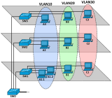
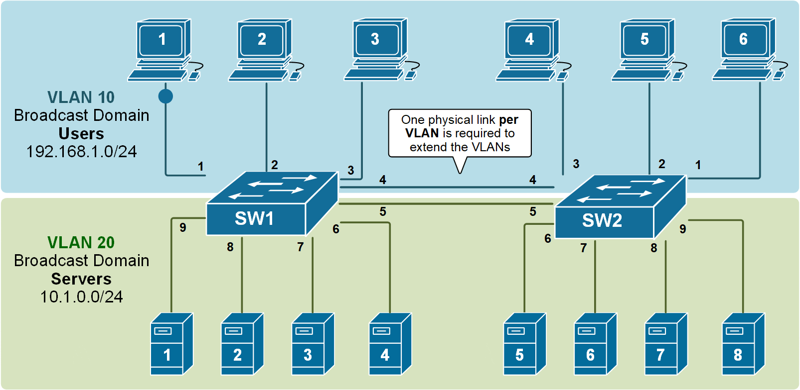
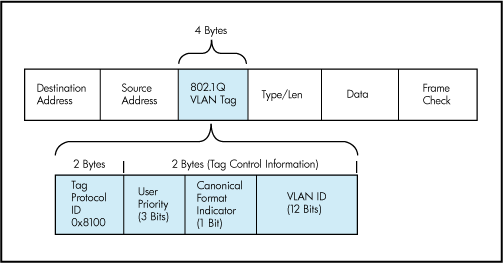
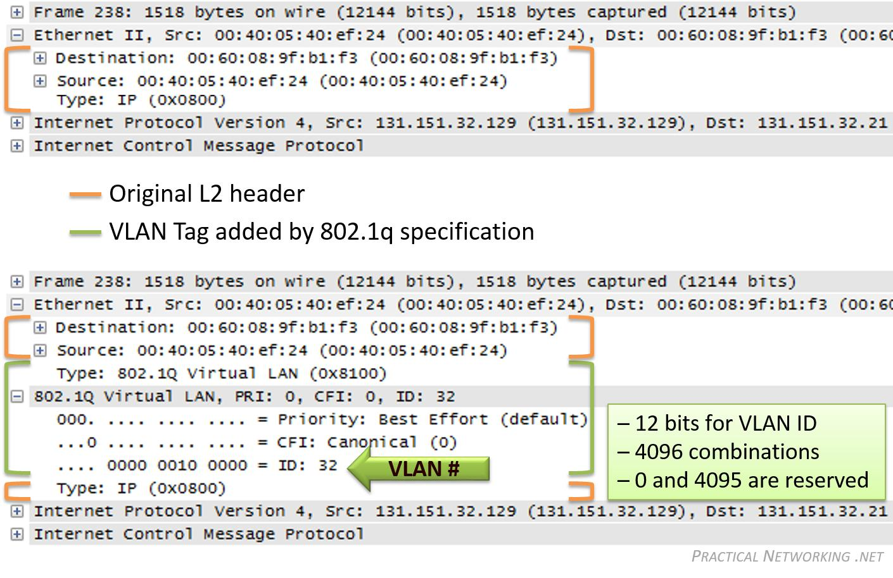
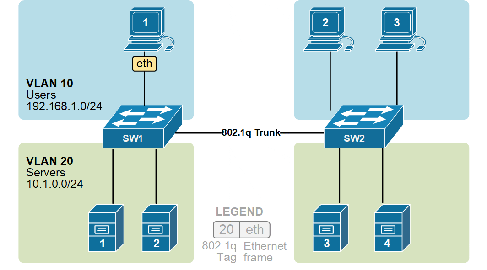
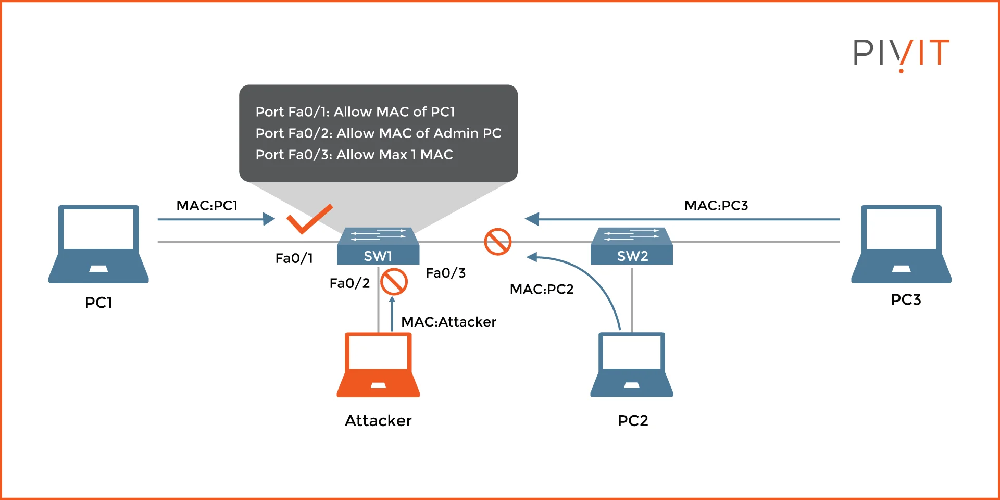
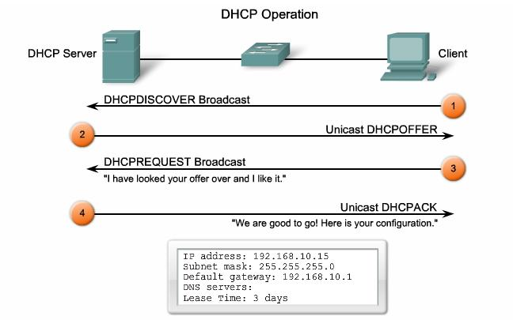
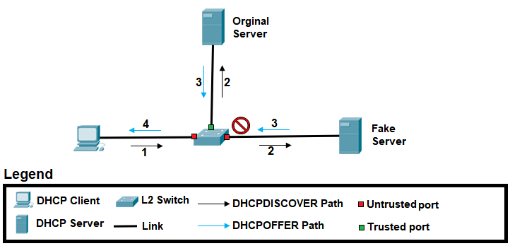
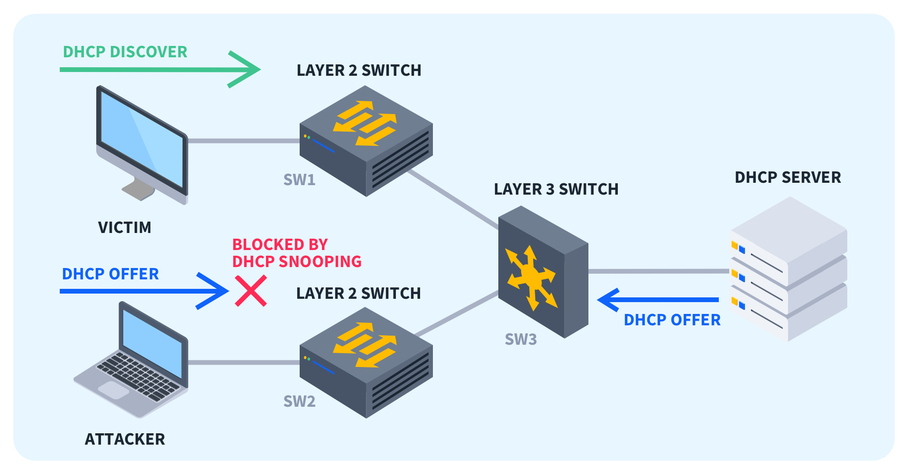

#  Guía Completa de Seguridad en Switches Cisco

## 1. **VLANs (Virtual Local Area Networks)**

### 1.1. **Concepto Teórico Detallado**

**¿Qué es una VLAN?**
Una VLAN es una **red lógica independiente** dentro de una red física. Imagina un edificio de oficinas donde cada departamento tiene su propio espacio privado aunque compartan el mismo edificio físico.

**Problema que resuelve:**

- **Dominios de broadcast grandes**: Sin VLANs, toda la red recibe tráfico broadcast
- **Seguridad**: Dispositivos en diferentes departamentos pueden comunicarse libremente
- **Rendimiento**: Tráfico innecesario en todos los puertos

**Tipos de VLANs:**

  - **VLAN de datos**: Para usuarios finales
  - **VLAN de voz**: Para tráfico VoIP (prioridad alta)
  - **VLAN de administración**: Para gestión del switch
  - **VLAN nativa**: Para tráfico sin etiquetar en trunks






### 1.2. ¿Qué es un trunk?

*Un trunk es un enlace de red que transporta múltiples VLANs simultáneamente entre switches o entre un switch y un router.**

### 1.3. **Analogía para Entenderlo**

```bash
# SIN TRUNK (Access Ports):
Cada VLAN = Carretera separada
Puerto access = Rampa de entrada/salida a UNA carretera

# CON TRUNK:
Trunk = Autopista con MÚLTIPLES carriles (cada carril = una VLAN)
Cada frame lleva "etiqueta" que dice a qué carril (VLAN) pertenece
```

### 1.4. **Problema que Resuelve**

```bash
# ESCENARIO SIN TRUNK:
Switch A (VLAN 10,20,30) --- Switch B (VLAN 10,20,30)
Necesitarías: 3 cables separados (uno por VLAN)
❌ Ineficiente ❌ Costoso ❌ No escalable

# ESCENARIO CON TRUNK:
Switch A (VLAN 10,20,30) ---[UN CABLE]--- Switch B (VLAN 10,20,30)
✅ Un solo cable transporta TODAS las VLANs
✅ Eficiente ✅ Escalable ✅ Flexible
```

## 2. 🏗️ **Cómo Funciona el Trunking Técnicamente**

### 2.1. **Protocolo 802.1Q (Dot1Q)**



### 2.2. **Ejemplo de Etiquetado**





## 3. ⚙️ **Configuración de Trunks en Cisco**

### 3.1. **Comandos Básicos**

```bash
! CONFIGURAR PUERTO COMO TRUNK
Switch(config)# interface gigabitethernet 0/1
Switch(config-if)# switchport mode trunk
! El puerto ahora transporta TODAS las VLANs

! LIMITAR VLANs PERMITIDAS EN EL TRUNK
Switch(config-if)# switchport trunk allowed vlan 10,20,30
! Solo estas VLANs pueden pasar por el trunk

! VERIFICACIÓN
Switch# show interfaces trunk
Port        Mode         Encapsulation  Status        Native vlan
Gi0/1       on           802.1q         trunking      1

Port        Vlans allowed on trunk
Gi0/1       10,20,30
```

### 3.2. **Modos de Operación de Puertos**

```bash
# SWITCHPORT MODE TRUNK → Forza trunk, negocia DTP
# SWITCHPORT MODE DYNAMIC DESIRABLE → Intenta formar trunk
# SWITCHPORT MODE DYNAMIC AUTO → Espera que otro inicie trunk  
# SWITCHPORT MODE ACCESS → Solo una VLAN (no trunk)
```


## 4. 🏷️ **¿Qué es la VLAN NATIVA?**

### 4.1. **Concepto Fundamental**

**La VLAN nativa es la única VLAN cuyos frames viajan SIN etiqueta 802.1Q a través de un trunk.**

### 4.2. **Propósito de la VLAN Nativa**

```bash
# COMUNICACIÓN CON DISPOSITIVOS QUE NO ENTIENDEN 802.1Q
- Dispositivos legacy
- Algunos servidores
- Equipos de red antiguos
- Dispositivos que no soportan VLAN tagging
```

### 4.3. **Comportamiento**

```bash
# PARA TRÁFICO DE VLAN NATIVA:
Frame entra al trunk → NO se añade etiqueta 802.1Q
Frame sale del trunk → Se asume que pertenece a VLAN nativa

# PARA TRÁFICO DE OTRAS VLANs:
Frame entra al trunk → SE AÑADE etiqueta 802.1Q con VLAN ID
Frame sale del trunk → SE REMUEVE etiqueta, se envía a VLAN correcta
```

## 5. ⚠️ **IMPORTANTE: Consideraciones de Seguridad**

### 5.1. **Problema de Seguridad con VLAN Nativa**

```bash
# ATAQUE DE SALTO DE VLAN (VLAN HOPPING)
Atacante puede:
1. Enviar frames etiquetados con VLAN nativa
2. Switch puede remover etiqueta y enviar a VLAN nativa
3. Posible acceso no autorizado a VLAN nativa

# SOLUCIÓN RECOMENDADA:
NUNCA usar VLAN 1 como nativa
Usar VLAN "basura" no utilizada para nativa
```

### 5.2. **Configuración Segura**

```bash
! CONFIGURACIÓN NO SEGURA (POR DEFECTO)
Switch(config-if)# switchport trunk native vlan 1
! ❌ VLAN 1 es default y puede tener dispositivos

! CONFIGURACIÓN SEGURA (RECOMENDADA)
Switch(config-if)# switchport trunk native vlan 999
Switch(config)# vlan 999  
Switch(config-vlan)# name VLAN_BASURA_NATIVA
Switch(config-vlan)# exit
! ✅ VLAN 999 no tiene dispositivos, solo existe para tráfico nativo
```

## 6. 🔧 **Configuración Completa y Segura**

### 6.1. **Ejemplo Práctico Corporativo**

```bash
! ESCENARIO: Empresa con 3 departamentos + VLAN de administración

! CREAR VLANs
Switch(config)# vlan 10
Switch(config-vlan)# name VENTAS
Switch(config-vlan)# vlan 20
Switch(config-vlan)# name IT
Switch(config-vlan)# vlan 30
Switch(config-vlan)# name CONTABILIDAD
Switch(config-vlan)# vlan 99
Switch(config-vlan)# name ADMIN
Switch(config-vlan)# vlan 999
Switch(config-vlan)# name NATIVA_SEGURA
Switch(config-vlan)# exit

! CONFIGURAR TRUNK SEGURO
Switch(config)# interface gigabitethernet 0/1
Switch(config-if)# description TRUNK_TO_CORE_SWITCH
Switch(config-if)# switchport mode trunk
Switch(config-if)# switchport trunk native vlan 999
Switch(config-if)# switchport trunk allowed vlan 10,20,30,99
! ✅ Solo las VLANs necesarias
! ✅ VLAN nativa segura (999)
! ✅ Explicítamente no permite VLAN 1

! CONFIGURAR EL OTRO EXTREMO (SWITCH CORE)
CoreSwitch(config)# interface gigabitethernet 0/1  
CoreSwitch(config-if)# description TRUNK_TO_ACCESS_SWITCH
CoreSwitch(config-if)# switchport mode trunk
CoreSwitch(config-if)# switchport trunk native vlan 999
CoreSwitch(config-if)# switchport trunk allowed vlan 10,20,30,99
```

### 6.2. **Configuración de Puertos de Acceso**

```bash
! PUERTOS PARA USUARIOS (NO TRUNK)
Switch(config)# interface range fastethernet 0/1-8
Switch(config-if-range)# switchport mode access
Switch(config-if-range)# switchport access vlan 10
Switch(config-if-range)# description USUARIOS_VENTAS

Switch(config)# interface range fastethernet 0/9-16  
Switch(config-if-range)# switchport mode access
Switch(config-if-range)# switchport access vlan 20
Switch(config-if-range)# description USUARIOS_IT
```

## 7. 📊 **Verificación y Troubleshooting**

### 7.1. **Comandos de Verificación**

```bash
! VER ESTADO DE TRUNKS
Switch# show interfaces trunk
Port        Mode         Encapsulation  Status        Native vlan
Gi0/1       on           802.1q         trunking      999
Gi0/2       auto         802.1q         trunking      1

Port        Vlans allowed on trunk
Gi0/1       10,20,30,99
Gi0/2       1-4094

! VER CONFIGURACIÓN DE INTERFAZ ESPECÍFICA
Switch# show interfaces gigabitethernet 0/1 switchport
Name: Gi0/1
Switchport: Enabled
Administrative Mode: trunk
Operational Mode: trunk
Administrative Trunking Encapsulation: dot1q
Operational Trunking Encapsulation: dot1q
Negotiation of Trunking: On
Access Mode VLAN: 1 (default)
Trunking Native Mode VLAN: 999 (VLAN_BASURA_NATIVA)
Trunking VLANs Enabled: 10,20,30,99

! VER ESTADÍSTICAS DE TRUNK
Switch# show interfaces gigabitethernet 0/1 trunk
Port        Vlans allowed on trunk
Gi0/1       10,20,30,99

Port        Vlans allowed and active in management domain
Gi0/1       10,20,30,99

Port        Vlans in spanning tree forwarding state and not pruned
Gi0/1       10,20,30,99
```

### 7.2. **Troubleshooting Común**

```bash
# PROBLEMA 1: Trunk no se forma
CAUSA: Mismatch en configuración de trunk
SOLUCIÓN: Verificar que ambos lados estén en "switchport mode trunk"

# PROBLEMA 2: VLAN nativa mismatch  
CAUSA: Diferente VLAN nativa en cada extremo
SÍNTOMA: Pérdida de conectividad para VLAN nativa
SOLUCIÓN: Configurar misma VLAN nativa en ambos extremos

# PROBLEMA 3: VLAN no permitida en trunk
CAUSA: VLAN no está en "allowed vlan list"
SÍNTOMA: Dispositivos en esa VLAN no pueden comunicarse through trunk
SOLUCIÓN: Añadir VLAN a la lista permitida
```

## 8. **Resumen de Conceptos Clave**

### 8.1. **TRUNK:**
```bash
✅ Transporta MÚLTIPLES VLANs en un solo enlace físico
✅ Usa etiquetado 802.1Q para identificar a qué VLAN pertenece cada frame
✅ Esencial para conectar switches en redes con múltiples VLANs
✅ Debe configurarse igual en ambos extremos del enlace
```

### 8.2. **VLAN NATIVA:**
```bash
✅ Única VLAN que viaja SIN etiqueta 802.1Q en un trunk
✅ Por defecto es VLAN 1 (❌ INSECURO)
✅ Mejor práctica: Usar VLAN no utilizada (ej: 999)
✅ Debe coincidir en ambos extremos del trunk
```

### 8.3. **MEJORES PRÁCTICAS:**
```bash
1. ✅ NUNCA usar VLAN 1 para nada
2. ✅ Usar VLAN dedicada no utilizada como nativa (999, 4094, etc.)
3. ✅ Limitar VLANs permitidas en trunk solo a las necesarias
4. ✅ Deshabilitar puertos no utilizados
5. ✅ Configurar manualmente trunks en lugar de usar auto-negotiation
6. ✅ Documentar configuración de trunks
```


### 8.4. **Comandos Explicados Paso a Paso**

```bash
! CREACIÓN DE VLANs
Switch# configure terminal
Switch(config)# vlan 10
! El comando 'vlan 10' crea o entra en la configuración de la VLAN 10
! Las VLANs 1-1005 son estándar, 1006-4094 son extendidas

Switch(config-vlan)# name VENTAS
! 'name' asigna un nombre descriptivo para identificar la VLAN fácilmente

Switch(config-vlan)# exit
! Sale del modo de configuración de VLAN

! ASIGNACIÓN DE PUERTOS A VLANs
Switch(config)# interface fastethernet 0/1
! Selecciona el puerto físico para configurar

Switch(config-if)# switchport mode access
! 'switchport mode access' configura el puerto como acceso (solo una VLAN)
! Esto significa que el dispositivo conectado no espera etiquetas VLAN

Switch(config-if)# switchport access vlan 10
! Asigna el puerto específicamente a la VLAN 10
! El dispositivo conectado estará en la red lógica de VENTAS

! CONFIGURACIÓN DE PUERTOS TRUNK
Switch(config)# interface gigabitethernet 0/1
Switch(config-if)# switchport mode trunk
! 'switchport mode trunk' configura el puerto para transportar múltiples VLANs
! Los trunks usan etiquetas 802.1Q para identificar a qué VLAN pertenece cada frame

Switch(config-if)# switchport trunk native vlan 999
! 'native vlan' define qué VLAN viaja sin etiquetar
! Por seguridad, NUNCA usar VLAN 1 como nativa

Switch(config-if)# switchport trunk allowed vlan 10,20,30
! 'allowed vlan' especifica qué VLANs pueden pasar por el trunk
! Esto proporciona control granular sobre qué VLANs se propagan

! VERIFICACIÓN
Switch# show vlan brief
! Muestra todas las VLANs y qué puertos están asignados a cada una
Switch# show interfaces trunk
! Muestra información detallada sobre puertos trunk
```

### 8.5. **Ejemplo Práctico Completo**

```bash
! ESCENARIO: Empresa con 3 departamentos
Switch(config)# vlan 10
Switch(config-vlan)# name VENTAS
Switch(config-vlan)# exit

Switch(config)# vlan 20
Switch(config-vlan)# name IT
Switch(config-vlan)# exit

Switch(config)# vlan 30
Switch(config-vlan)# name CONTABILIDAD
Switch(config-vlan)# exit

Switch(config)# vlan 99
Switch(config-vlan)# name ADMINISTRACION
Switch(config-vlan)# exit

! Asignar puertos a departamentos
Switch(config)# interface range fastethernet 0/1-8
Switch(config-if-range)# switchport mode access
Switch(config-if-range)# switchport access vlan 10
Switch(config-if-range)# description PUERTOS_VENTAS

Switch(config)# interface range fastethernet 0/9-16
Switch(config-if-range)# switchport mode access
Switch(config-if-range)# switchport access vlan 20
Switch(config-if-range)# description PUERTOS_IT

! Configurar IP de gestión en VLAN de administración
Switch(config)# interface vlan 99
Switch(config-if)# ip address 192.168.99.10 255.255.255.0
Switch(config-if)# no shutdown
! Esto permite administrar el switch remotamente mediante SSH/Telnet
```

---

## 9. **Port Security**

### 9.1. **Concepto Teórico Detallado**

**¿Qué es Port Security?**
Es un mecanismo que **restringe qué dispositivos pueden conectarse** a un puerto del switch basándose en direcciones MAC.



**Problemas que resuelve:**

   - **Conectividad no autorizada**: Evita que usuarios conecten dispositivos no autorizados
   - **Ataques MAC flooding**: Previene que atacantes saturen la tabla MAC
   - **Robo de puertos**: Impide usar puertos físicos para acceso no autorizado

**Mecanismos de aprendizaje de MAC:**

   - **Estáticas**: Se configuran manualmente
   - **Dinámicas**: El switch aprende automáticamente
   - **Sticky**: Combina ambos - aprende y luego las hace estáticas


### 9.2. **Comandos Explicados Paso a Paso**

```bash
! HABILITAR PORT SECURITY BÁSICO
Switch(config)# interface fastethernet 0/1
Switch(config-if)# switchport mode access
! PRIMERO debe ser puerto de acceso para habilitar port security

Switch(config-if)# switchport port-security
! Este comando ACTIVA la funcionalidad de port security en el puerto
! Sin esto, los demás comandos de port security no funcionarán

Switch(config-if)# switchport port-security maximum 2
! 'maximum' define el número máximo de direcciones MAC permitidas
! En este caso, permite hasta 2 dispositivos diferentes

! TIPOS DE VIOLACIÓN - CRÍTICOS PARA ENTENDER
Switch(config-if)# switchport port-security violation shutdown
! 'violation shutdown' - EL MÁS SEGURO
! - Cierra el puerto inmediatamente
! - Lo coloca en estado err-disable
! - Requiere intervención manual para reactivar
! - USAR EN ENTORNOS DE ALTA SEGURIDAD

Switch(config-if)# switchport port-security violation restrict
! 'violation restrict' - MODO INTERMEDIO
! - Permite tráfico de MACs conocidas
! - Bloquea tráfico de MACs no autorizadas
! - Genera logs pero mantiene el puerto activo
! - BUENO para monitoreo sin interrumpir servicio

Switch(config-if)# switchport port-security violation protect
! 'violation protect' - MODO MENOS RESTRICTIVO
! - Solo bloquea frames de MACs no autorizadas
! - No genera logs de violación
! - PUEDE PASAR DESAPERCIBIDO UN ATAQUE

! MÉTODOS DE APRENDIZAJE DE MAC
Switch(config-if)# switchport port-security mac-address sticky
! 'sticky' - EL MÁS PRÁCTICO
! - Aprende las MACs que se conectan inicialmente
! - Las convierte en direcciones estáticas automáticamente
! - Se guardan en la configuración
! - Perfecto para despliegues iniciales

Switch(config-if)# switchport port-security mac-address 0000.1111.2222
! Configuración MANUAL de MAC específica
! Útil para dispositivos críticos como impresoras o servidores

! CONFIGURACIONES AVANZADAS
Switch(config-if)# switchport port-security aging time 120
! 'aging time' define cuánto tiempo se mantiene una MAC en la tabla
! 120 minutos = 2 horas

Switch(config-if)# switchport port-security aging type inactivity
! 'inactivity' significa que el temporizador corre solo si no hay tráfico
! Alternativa: 'absolute' (tiempo fijo independiente del tráfico)
```

### 9.3. **Ejemplo Práctico Completo**

```bash
! ESCENARIO: Oficina con políticas de seguridad específicas

! Puerto para impresora (1 dispositivo fijo)
Switch(config)# interface fastethernet 0/5
Switch(config-if)# switchport mode access
Switch(config-if)# switchport access vlan 10
Switch(config-if)# switchport port-security
Switch(config-if)# switchport port-security maximum 1
Switch(config-if)# switchport port-security violation shutdown
Switch(config-if)# switchport port-security mac-address 0050.56AB.CDEF
Switch(config-if)# description IMPRESORA_SALA_VENTAS

! Puerto para usuarios generales (hasta 3 dispositivos)
Switch(config)# interface fastethernet 0/10
Switch(config-if)# switchport mode access
Switch(config-if)# switchport access vlan 20
Switch(config-if)# switchport port-security
Switch(config-if)# switchport port-security maximum 3
Switch(config-if)# switchport port-security violation restrict
Switch(config-if)# switchport port-security mac-address sticky
Switch(config-if)# switchport port-security aging time 240
Switch(config-if)# description PUESTO_TRABAJO_USUARIO

! Configurar recuperación automática de err-disable
Switch(config)# errdisable recovery cause psecure-violation
Switch(config)# errdisable recovery interval 300
! Esto reactiva automáticamente puertos después de 5 minutos

! VERIFICACIÓN DETALLADA
Switch# show port-security
! Muestra resumen de todos los puertos con port security

Switch# show port-security interface fastethernet 0/10
! Muestra detalles específicos del puerto:
! - Máximo de direcciones permitidas
! - Direcciones actualmente aprendidas
! - Contador de violaciones
! - Tipo de violación configurado

Switch# show port-security address
! Muestra la tabla de direcciones MAC seguras aprendidas
```

## 10. **DHCP Snooping**

## 11. **¿Pero qué es DHCP?**

### 11.1. **¿Qué es DHCP?**

**DHCP (Dynamic Host Configuration Protocol)** es el "servicio de entrega de direcciones" automático de las redes. En lugar de configurar manualmente cada dispositivo, DHCP asigna automáticamente:

- ✅ **Dirección IP**
- ✅ **Máscara de subred** 
- ✅ **Gateway por defecto**
- ✅ **Servidores DNS**

## 12. **El Proceso de 4 Pasos (DORA)**

### 12.1. **1.DISCOVER - "¿Hay algún servidor DHCP?"**
```bash
Cliente → Broadcast: "¡Hola! Necesito una IP, ¿alguien puede ayudarme?"
```
- El cliente envía broadcast sin IP
- Todos los dispositivos en la red local lo reciben

### 12.2. **2.OFFER - "Sí, te ofrezco esta IP"**
```bash
Servidor DHCP → Cliente: "Te ofrezco la IP 192.168.1.100"
```
- Servidor reserva una IP disponible
- Envía oferta con configuración de red

### 12.3. **3.REQUEST - "Acepto tu oferta"** 
```bash
Cliente → Broadcast: "Acepto la IP 192.168.1.100 del servidor X"
```
- Cliente confirma que acepta la IP
- Se hace por broadcast por si hay múltiples servidores

### 12.4. **4.ACK - "Confirmado, usa esta IP"**
```bash
Servidor DHCP → Cliente: "Confirmado, usa 192.168.1.100 por 24 horas"
```
- Confirmación final del servidor
- Incluye tiempo de arrendamiento (lease time)

## 13. **Renovación de IP**

```bash
# A LOS 50% DEL TIEMPO DE ARRENDAMIENTO:
Cliente → Servidor: "¿Puedo seguir usando esta IP?"
Servidor → Cliente: "Sí, renuevas por X tiempo más"

# SI NO HAY RESPUESTA, INTENTA DE NUEVO AL 87.5%
# SI EXPIRA → VUELVE AL PASO 1 (DISCOVER)
```

{width=600 height=300}

## 14. **En Resumen**

**DHCP = Sistema automático que evita tener que configurar manualmente cada dispositivo en la red, asignando y gestionando direcciones IP de forma dinámica.**

**Funciona como un "alquiler de direcciones" con renovación automática.**

### 14.1. **¿Qué es DHCP Snooping?**
La función exacta de DHCP Snooping es actuar como un guardián de seguridad que previene ataques DHCP maliciosos mediante la creación de una base de datos confiable de asignaciones IP-MAC, diferenciando entre puertos trusted (donde se conectan servidores DHCP legítimos) y untrusted (clientes), bloqueando respuestas DHCP no autorizadas y proporcionando la base de datos que tecnologías como DAI e IP Source Guard utilizan para validar la legitimidad del tráfico ARP y las direcciones IP en la red.

En esencia: DHCP Snooping es el sistema de verificación de identidades que asegura que solo dispositivos autorizados puedan ofrecer direcciones IP y mantiene un registro confiable de qué dispositivo tiene qué IP en qué puerto.
DHCP Snooping es la BASE, DAI es la CAPA DE SEGURIDAD que usa esa base

### 14.2. **Analogía para Entenderlo**

Imagina un edificio con:
- **Servidores DHCP legítimos** = Oficinas de administración autorizadas
- **Clientes DHCP** = Inquilinos que necesitan llaves (IPs)
- **Ataque DHCP Rogue** = Alguien fingiendo ser la administración
- **DHCP Snooping** = El sistema de seguridad que verifica credenciales





## 15. 🔍 **Problemas que Resuelve DHCP Snooping**

### 15.1. **Ataque DHCP Starvation (Inanición)**
```bash
# Un atacante envía MÚLTIPLES solicitudes DHCP con MACs falsas
# Resultado: Agota el pool de IPs del servidor legítimo
# Clientes legítimos no pueden obtener IP
```

### 15.2. **Ataque DHCP Rogue (Servidor Falso)**
```bash
# Atacante configura servidor DHCP no autorizado
# Ofrece IPs con:
# - Gateway falso (el atacante)
# - DNS falso (para redirigir tráfico)
# Resultado: Man-in-the-Middle completo
```

### 15.3. **IP Spoofing (Suplantación de IP)**
```bash
# Clientes usan IPs que no les corresponden
# Difícil de rastrear en la red
# Puede eludir controles de seguridad basados en IP
```

## 16. 🏗️ **Arquitectura de DHCP Snooping**

### 16.1. **Componentes Clave**

1. **Puertos Trusted (Confiables)**

      - Donde están los servidores DHCP legítimos
      - **Aceptan** mensajes DHCP de cualquier tipo

2. **Puertos Untrusted (No Confiables)**

      - Donde se conectan clientes
      - **Solo aceptan** solicitudes DHCP (DISCOVER, REQUEST)
      - **Rechazan** respuestas DHCP (OFFER, ACK)

3. **Binding Database (Base de Datos de Asignaciones)**

      - Almacena: MAC + IP + VLAN + Puerto + Tiempo de arrendamiento
      - Se usa por DAI y IP Source Guard


## 17. ⚙️ **Configuración Detallada Paso a Paso**

### 17.1. **Configuración Básica**

```bash
! PASO 1: HABILITAR DHCP SNOOPING GLOBALMENTE
Switch(config)# ip dhcp snooping
! Este comando ACTIVA la funcionalidad a nivel global
! Sin esto, nada de DHCP Snooping funcionará

! PASO 2: ESPECIFICAR VLANs DONDE ACTUARÁ
Switch(config)# ip dhcp snooping vlan 10,20,30
! Solo las VLANs especificadas estarán protegidas
! Puedes usar rangos: vlan 1-100

! PASO 3: CONFIGURAR PUERTOS TRUSTED
Switch(config)# interface gigabitethernet 0/1
Switch(config-if)# description SERVIDOR_DHCP_LEGITIMO
Switch(config-if)# ip dhcp snooping trust
! MARCA este puerto como confiable para respuestas DHCP
! Los servidores DHCP legítimos DEBEN estar en puertos trusted

! PASO 4: PUERTOS UNTRUSTED (POR DEFECTO)
Switch(config)# interface range fastethernet 0/1-24
Switch(config-if-range)# no ip dhcp snooping trust
! Explícitamente los marca como no confiables
! Aunque por defecto ya lo son, es buena práctica
```

### 17.2. **Configuración Avanzada**

```bash
! OPCIÓN 82 (AGENT INFORMATION OPTION)
Switch(config)# ip dhcp snooping information option
! Añade información sobre el switch y puerto donde se originó la solicitud
! Ayuda a los servidores DHCP a tomar decisiones basadas en ubicación

! LIMITAR TASA DE MENSAJES DHCP
Switch(config)# interface fastethernet 0/5
Switch(config-if)# ip dhcp snooping limit rate 10
! Limita a 10 mensajes DHCP por segundo
! Previene ataques de inundación (DHCP starvation)

! CONFIGURACIÓN DE LA BASE DE DATOS
Switch(config)# ip dhcp snooping database flash:dhcp-snooping.txt
Switch(config)# ip dhcp snooping database write-delay 15
! Guarda la base de datos en memoria flash cada 15 segundos
! Previene pérdida de información en reinicios
```

## 18. 🔧 **Ejemplos Prácticos de Configuración**

### 18.1. **Ejemplo 1: Pequeña Oficina**

```bash
! ESCENARIO: 1 servidor DHCP, 24 puertos de usuario
Switch(config)# ip dhcp snooping
Switch(config)# ip dhcp snooping vlan 10

! Servidor DHCP en puerto Gigabit 0/1
Switch(config)# interface gigabitethernet 0/1
Switch(config-if)# description SERVIDOR_DHCP
Switch(config-if)# ip dhcp snooping trust

! Puertos de usuarios (untrusted por defecto)
Switch(config)# interface range fastethernet 0/1-24
Switch(config-if-range)# switchport mode access
Switch(config-if-range)# switchport access vlan 10
Switch(config-if-range)# ip dhcp snooping limit rate 5
! Limita a 5 mensajes/segundo para prevenir ataques
```

### 18.2. **Ejemplo 2: Empresa Mediana con Múltiples VLANs**

```bash
! ESCENARIO: Múltiples departamentos, servidor centralizado
Switch(config)# ip dhcp snooping
Switch(config)# ip dhcp snooping vlan 10,20,30,99
Switch(config)# ip dhcp snooping information option

! Uplink al core donde está el servidor DHCP
Switch(config)# interface gigabitethernet 0/1
Switch(config-if)# description UPLINK_TO_CORE
Switch(config-if)# switchport mode trunk
Switch(config-if)# ip dhcp snooping trust

! VLAN de Ventas
Switch(config)# interface range fastethernet 0/1-8
Switch(config-if-range)# switchport access vlan 10
Switch(config-if-range)# ip dhcp snooping limit rate 8

! VLAN de IT
Switch(config)# interface range fastethernet 0/9-16
Switch(config-if-range)# switchport access vlan 20
Switch(config-if-range)# ip dhcp snooping limit rate 8

! VLAN de Administración
Switch(config)# interface range fastethernet 0/17-24
Switch(config-if-range)# switchport access vlan 99
Switch(config-if-range)# ip dhcp snooping limit rate 8
```

### 18.3. **Ejemplo 3: Entorno de Alta Seguridad**

```bash
! ESCENARIO: Entorno crítico con verificación estricta
Switch(config)# ip dhcp snooping
Switch(config)# ip dhcp snooping vlan 1-100
Switch(config)# ip dhcp snooping information option
Switch(config)# ip dhcp snooping verify mac-address
! VERIFICA que la MAC origen en DHCP sea la real del cliente
! Previene suplantación de MAC en mensajes DHCP

! Base de datos persistente
Switch(config)# ip dhcp snooping database flash:dhcp-snooping.db
Switch(config)# ip dhcp snooping database timeout 10
Switch(config)# ip dhcp snooping database write-delay 10

! Puertos trusted explícitos
Switch(config)# interface range gigabitethernet 0/1-2
Switch(config-if-range)# description SERVERS_DHCP_TRUSTED
Switch(config-if-range)# ip dhcp snooping trust

! Todos los demás puertos son untrusted con rate limiting estricto
Switch(config)# interface range fastethernet 0/1-48
Switch(config-if-range)# no ip dhcp snooping trust
Switch(config-if-range)# ip dhcp snooping limit rate 5
! Solo 5 mensajes DHCP por segundo - muy restrictivo
```

## 19. 🛠️ **Integración con Otras Tecnologías de Seguridad**

### 19.1. **Con Dynamic ARP Inspection (DAI)**

```bash
! DHCP Snooping es PRERREQUISITO para DAI
Switch(config)# ip dhcp snooping
Switch(config)# ip dhcp snooping vlan 10

! DAI usa la tabla de bindings de DHCP Snooping
Switch(config)# ip arp inspection vlan 10
Switch(config)# ip arp inspection validate src-mac dst-mac ip
! DAI verifica que las respuestas ARP coincidan con la tabla de DHCP Snooping
```

### 19.2. **Con IP Source Guard**

```bash
! IP Source Guard también depende de DHCP Snooping
Switch(config)# ip dhcp snooping
Switch(config)# ip dhcp snooping vlan 10

Switch(config)# interface fastethernet 0/1
Switch(config-if)# ip verify source
! Solo permite tráfico de IPs que están en la tabla de DHCP Snooping
```

## 20. 📊 **Comandos de Verificación y Monitoreo**

### 20.1. **Verificación Básica**

```bash
! VER ESTADO GLOBAL DE DHCP SNOOPING
Switch# show ip dhcp snooping
Switch DHCP snooping is enabled
DHCP snooping is configured on following VLANs:
10,20,30
DHCP snooping is operational on following VLANs:
10,20,30
DHCP snooping is configured on the following L3 Interfaces:

Insertion of option 82 is enabled
   circuit-id default format: vlan-mod-port
   remote-id: 0050.5689.ABCD (MAC del switch)
Option 82 on untrusted port is not allowed
Verification of hwaddr field is enabled

! MOSTRAR LA TABLA DE BINDINGS
Switch# show ip dhcp snooping binding
MacAddress          IpAddress        Lease(sec)  Type           VLAN  Interface
------------------  ---------------  ----------  -------------  ----  --------------------
00:50:56:89:AB:CD   192.168.10.10    86400       dhcp-snooping   10    FastEthernet0/1
00:50:56:89:AB:CE   192.168.10.11    86320       dhcp-snooping   10    FastEthernet0/2
00:50:56:89:AB:CF   192.168.20.15    86200       dhcp-snooping   20    FastEthernet0/9

! VER ESTADO DE PUERTOS TRUSTED
Switch# show ip dhcp snooping trust
Trusted | Port | 
------- | ---- | 
yes     | Gi0/1 | 
no      | Fa0/1 | 
no      | Fa0/2 | 
...     | ...  |
```

### 20.2. **Estadísticas y Troubleshooting**

```bash
! ESTADÍSTICAS DETALLADAS POR INTERFAZ
Switch# show ip dhcp snooping interface fastethernet 0/1
DHCP Snooping is enabled on this interface
DHCP Snooping trust is disabled
DHCP Snooping limit rate is 5 packets per second
DHCP Snooping violation count is 0

! CONTADORES DE MENSAJES DHCP
Switch# show ip dhcp snooping statistics
DHCP Snooping Statistics:
  Packets Dropped:
    DHCP Discover: 0
    DHCP Offer: 15
    DHCP Request: 0
    DHCP Ack: 12
    Others: 3
  Total Packets Dropped: 30

! VERIFICAR LA BASE DE DATOS
Switch# show ip dhcp snooping database
Agent URL : flash:dhcp-snooping.db
Write delay : 15 seconds
Abort delay : 300 seconds
Agent running : No
Delay timer : not running
Reconfigure timer : not running
Last succeeded : Never
Last failed : Never
```

### 20.3. **Comandos de Depuración (Debug)**

```bash
! SOLO USAR EN TROUBLESHOOTING - PUEDE GENERAR MUCHO OUTPUT
Switch# debug ip dhcp snooping events
DHCP_SNOOPING: received new DHCP packet from interface FastEthernet0/1
DHCP_SNOOPING: process new DHCP packet, message type: DHCPDISCOVER
DHCP_SNOOPING: packet passed validation check

Switch# debug ip dhcp snooping packet
DHCP_SNOOPING: received packet on FastEthernet0/1: 
  OP: 1, HTYPE: 1, HLEN: 6, HOPS: 0
  XID: 0x45A3F1C2, SECS: 0, FLAGS: 0
  CIADDR: 0.0.0.0, YIADDR: 0.0.0.0, SIADDR: 0.0.0.0, GIADDR: 0.0.0.0
  CHADDR: 0050.5689.ABCD
```

## 21. 🔄 **Flujo de Trabajo Completo de DHCP Snooping**

### 21.1. **Proceso Paso a Paso**

1. **Inicialización:**
   ```bash
   Switch arranca → DHCP Snooping deshabilitado por defecto
   Administrador ejecuta: ip dhcp snooping
   Se crea tabla de bindings vacía
   ```

2. **Aprendizaje:**
   ```bash
   Cliente conecta en Fa0/1 (untrusted)
   Envía DHCP DISCOVER → Switch permite (solicitud)
   Servidor legítimo en Gi0/1 (trusted) envía DHCP OFFER → Switch permite (trusted)
   Cliente envía DHCP REQUEST → Switch permite
   Servidor envía DHCP ACK → Switch permite (trusted)
   Switch añade binding a la tabla: MAC + IP + VLAN + Puerto
   ```

3. **Protección:**
   ```bash
   Atacante conecta servidor rogue en Fa0/10 (untrusted)
   Envía DHCP OFFER no solicitado → Switch BLOQUEA y registra violación
   Cliente legítimo solo ve ofertas del servidor autorizado
   ```

4. **Mantenimiento:**
   ```bash
   Switch monitorea renewals y expiraciones
   Actualiza tabla de bindings automáticamente
   Guarda base de datos periódicamente en memoria no volátil
   ```

## 22. 💡 **Mejores Prácticas y Recomendaciones**

### 22.1. **Configuración Recomendada**

```bash
! CONFIGURACIÓN ÓPTIMA PARA ENTORNOS CORPORATIVOS
Switch(config)# ip dhcp snooping
Switch(config)# ip dhcp snooping vlan [TODAS_LAS_VLANs_CON_CLIENTES]
Switch(config)# ip dhcp snooping information option
Switch(config)# ip dhcp snooping verify mac-address
Switch(config)# ip dhcp snooping database flash:dhcp-snooping.db
Switch(config)# ip dhcp snooping database write-delay 15

! PUERTOS TRUSTED - SOLO DONDE HAY SERVIDORES DHCP LEGÍTIMOS
Switch(config)# interface [PUERTOS_A_SERVIDORES_DHCP]
Switch(config-if)# ip dhcp snooping trust

! PUERTOS UNTRUSTED - TODOS LOS DEMÁS
Switch(config)# interface range [TODOS_LOS_PUERTOS_DE_CLIENTES]
Switch(config-if-range)# no ip dhcp snooping trust
Switch(config-if-range)# ip dhcp snooping limit rate 10
```

### 22.2. **Consideraciones Importantes**

1. **Planificación:**
   
      - Implementar en ventana de mantenimiento
      - Comenzar en VLANs de prueba
      - Tener rollback plan

2. **Rendimiento:**
   
      - Rate limiting muy bajo puede afectar clientes legítimos
      - Base de datos grande puede consumir memoria

3. **Compatibilidad:**
   
      - Verificar que dispositivos legados funcionen
      - Algunos dispositivos IoT pueden tener comportamientos DHCP extraños

4. **Monitoreo:**
   
      - Configurar SNMP traps para violaciones
      - Monitorear contadores de paquetes descartados
      - Revisar logs regularmente

## 23. 🎯 **Resumen Final**

**DHCP Snooping es la base fundamental** para:

   - ✅ Prevenir servidores DHCP no autorizados
   - ✅ Construir la tabla de bindings para DAI e IP Source Guard
   - ✅ Detectar y prevenir ataques de inundación DHCP
   - ✅ Mejorar la trazabilidad de dispositivos en la red

**Sin DHCP Snooping, las demás tecnologías de seguridad (DAI, IP Source Guard) no pueden funcionar correctamente.**


## 24. 🛡️ **3. Dynamic ARP Inspection (DAI)**

### 24.1. **Concepto Teórico Detallado**

**¿Qué es DAI?**
Es un mecanismo de seguridad que **previene ataques ARP spoofing** validando paquetes ARP en la red.

**Problema del ARP:**

   - ARP no tiene autenticación → Cualquiera puede enviar respuestas ARP
   - **ARP poisoning**: Atacante se hace pasar por el gateway
   - **Man-in-the-middle**: Intercepta tráfico entre víctima y gateway

**Cómo funciona DAI:**

   1. **Intercepta** todos los paquetes ARP
   2. **Valida** contra base de datos confiable (DHCP Snooping)
   3. **Descarta** paquetes ARP no válidos
   4. **Registra** intentos de violación

DAI utiliza la tabla de DHCP Snooping EXCLUSIVAMENTE cuando recibe un ARP Response (Respuesta ARP)

### 24.2. **Comandos Explicados Paso a Paso**

```bash
! CONFIGURACIÓN BÁSICA DE DAI
Switch(config)# ip arp inspection vlan 10,20
! Habilita DAI para las VLANs especificadas
! Sin este comando, DAI no está activo en ninguna VLAN

! DEFINIR PUERTOS TRUSTED (CONFIABLES)
Switch(config)# interface gigabitethernet 0/1
Switch(config-if)# ip arp inspection trust
! Los puertos 'trusted' NO son inspeccionados por DAI
! USAR SOLO en: routers, servidores, switches superiores
! NUNCA en puertos de usuarios finales

! VALIDACIONES ESPECÍFICAS
Switch(config)# ip arp inspection validate src-mac dst-mac ip
! 'src-mac' - Verifica que MAC origen en ARP = MAC origen en Ethernet
! 'dst-mac' - Verifica que MAC destino en ARP = MAC destino en Ethernet  
! 'ip' - Verifica direcciones IP válidas (no 0.0.0.0, 255.255.255.255, etc.)

! RATE LIMITING - CRÍTICO PARA PREVENIR DOS
Switch(config)# interface fastethernet 0/5
Switch(config-if)# ip arp inspection limit rate 15
! Limita a 15 paquetes ARP por segundo
! Paquetes excedentes son descartados
! Previene flood de ARP que podría saturar la CPU
```

### 24.3. **Configuración Integrada con DHCP Snooping**

```bash
! PRIMERO: Configurar DHCP Snooping (requisito para DAI)
Switch(config)# ip dhcp snooping
! Habilita la funcionalidad global de DHCP Snooping

Switch(config)# ip dhcp snooping vlan 10,20
! Especifica en qué VLANs actuará DHCP Snooping

Switch(config)# interface gigabitethernet 0/1
Switch(config-if)# ip dhcp snooping trust
! Puertos trusted para DHCP (hacia servidores DHCP legítimos)

! SEGUNDO: Configurar DAI que usa la tabla de DHCP Snooping
Switch(config)# ip arp inspection vlan 10,20
! DAI usará la tabla de bindings de DHCP Snooping para validar

Switch(config)# ip arp inspection log-buffer entries 1024
! Buffer para almacenar logs de violaciones ARP

Switch(config)# ip arp inspection log-buffer logs 10 interval 60
! Genera logs cada 60 segundos si hay más de 10 violaciones

! CONFIGURACIÓN POR PUERTO DE USUARIO
Switch(config)# interface range fastethernet 0/1-24
Switch(config-if-range)# switchport mode access
Switch(config-if-range)# ip arp inspection limit rate 10
! Todos los puertos de usuario tienen rate limiting
! Por defecto son untrusted (inspeccionados)
```

### 24.4. **Ejemplo Práctico Completo**

```bash
! ESCENARIO: Red corporativa con múltiples VLANs

! 1. Configurar DHCP Snooping
Switch(config)# ip dhcp snooping
Switch(config)# ip dhcp snooping vlan 10,20,30
Switch(config)# ip dhcp snooping information option
! 'information option' añade información adicional (option 82)

! 2. Definir puertos trusted
Switch(config)# interface gigabitethernet 0/1
Switch(config-if)# description UPLINK_TO_CORE_SWITCH
Switch(config-if)# ip dhcp snooping trust
Switch(config-if)# ip arp inspection trust

Switch(config)# interface gigabitethernet 0/2  
Switch(config-if)# description LINK_TO_DHCP_SERVER
Switch(config-if)# ip dhcp snooping trust
Switch(config-if)# ip arp inspection trust

! 3. Configurar DAI
Switch(config)# ip arp inspection vlan 10,20,30
Switch(config)# ip arp inspection validate src-mac dst-mac ip
Switch(config)# ip arp inspection log-buffer entries 2048

! 4. Configurar puertos de usuario
Switch(config)# interface range fastethernet 0/1-48
Switch(config-if-range)# switchport mode access
Switch(config-if-range)# ip arp inspection limit rate 15
Switch(config-if-range)# no ip dhcp snooping trust
! Explícitamente configurados como untrusted

! VERIFICACIÓN
Switch# show ip arp inspection
! Muestra configuración global de DAI

Switch# show ip arp inspection statistics
! Muestra contadores de paquetes procesados y descartados

Switch# show ip dhcp snooping binding
! Muestra la tabla de bindings IP-MAC-puerto
! ESTA TABLA ES LA QUE USA DAI PARA VALIDAR

Switch# show ip arp inspection interface fastethernet 0/10
! Muestra estadísticas específicas por puerto
```

---

## 25. 🌉 **4. BPDU Guard & BPDU Filter**

### 25.1. **Concepto Teórico Detallado**

**¿Qué son las BPDUs?**
BPDU (Bridge Protocol Data Units) son mensajes que intercambian los switches para **construir y mantener el spanning-tree**.

**Problemas que resuelven:**

- **Switches no autorizados**: Usuario conecta un switch casero
- **Bucles de red**: Configuraciones incorrectas crean loops
- **Interrupciones de servicio**: Topología STP cambia inesperadamente

### 25.2. **BPDU Guard - Explicación Detallada**

**Propósito**: Proteger puertos de acceso contra recepción de BPDUs

**Comportamiento**:
- Si recibe BPDU → **err-disable** inmediato
- Ideal para **puertos con usuarios finales**
- Se activa solo en puertos con **PortFast**

### 25.3. **Comandos BPDU Guard**

```bash
! MÉTODO 1: Global (recomendado para consistencia)
Switch(config)# spanning-tree portfast bpduguard default
! Aplica BPDU Guard automáticamente a TODOS los puertos con PortFast
! MÉTODO MÁS EFICIENTE para despliegues grandes

! MÉTODO 2: Por interfaz
Switch(config)# interface fastethernet 0/1
Switch(config-if)# spanning-tree portfast
! PortFast salta estados temporales (listening/learning)
Switch(config-if)# spanning-tree bpduguard enable
! Habilita BPDU Guard específicamente en este puerto

! RECUPERACIÓN AUTOMÁTICA
Switch(config)# errdisable recovery cause bpduguard
Switch(config)# errdisable recovery interval 300
! Reactiva puertos automáticamente después de 5 minutos
```

### 25.4. **BPDU Filter - Explicación Detallada**

**Propósito**: **Silenciar** BPDUs en puertos específicos

**Comportamiento**:

- **Bloquea envío y recepción** de BPDUs
- **Peligroso**: Puede crear bucles si no se usa correctamente
- **Caso de uso**: Conectar dispositivos que envían BPDUs pero no deben participar en STP

### 25.5. **Comandos BPDU Filter**

```bash
! MÉTODO 1: Global
Switch(config)# spanning-tree portfast bpdufilter default
! Aplica BPDU Filter a todos los puertos con PortFast
! CUIDADO: Puede causar bucles si se conecta un switch

! MÉTODO 2: Por interfaz
Switch(config)# interface fastethernet 0/2
Switch(config-if)# spanning-tree bpdufilter enable
! Habilita BPDU Filter específicamente en este puerto
```

### 25.6. **Ejemplo Práctico: Cuándo Usar Cada Uno**

```bash
! ESCENARIO: Oficina con diferentes tipos de puertos

! 1. Puertos de usuario normal - USAR BPDU GUARD
Switch(config)# interface range fastethernet 0/1-20
Switch(config-if-range)# switchport mode access
Switch(config-if-range)# spanning-tree portfast
Switch(config-if-range)# spanning-tree bpduguard enable
Switch(config-if-range)# description USUARIOS_FINALES
! Si alguien conecta un switch, el puerto se desactiva

! 2. Servidor que envía BPDUs - USAR BPDU FILTER
Switch(config)# interface fastethernet 0/21
Switch(config-if)# switchport mode access  
Switch(config-if)# spanning-tree bpdufilter enable
Switch(config-if)# description SERVIDOR_VMWARE
! El servidor puede enviar BPDUs pero no queremos que participe en STP

! 3. Configuración global de seguridad
Switch(config)# spanning-tree portfast bpduguard default
! Para todos los nuevos puertos con PortFast

Switch(config)# errdisable recovery cause bpduguard
Switch(config)# errdisable recovery interval 600
! Recuperación automática después de 10 minutos

! VERIFICACIÓN
Switch# show spanning-tree summary
! Muestra estado global de spanning-tree incluyendo BPDU Guard/Filter

Switch# show spanning-tree interface fastethernet 0/1 detail
! Muestra configuración específica de BPDU Guard/Filter por puerto

Switch# show errdisable recovery
! Muestra configuración de recuperación automática
```

---

## 26. 🔍 **5. IP Source Guard**

### 26.1. **Concepto Teórico Detallado**

**¿Qué es IP Source Guard?**
Es un mecanismo que **filtra tráfico IP** basándose en la tabla de bindings de DHCP Snooping.

**Problemas que resuelve:**

- **IP spoofing**: Usuario usa IP que no le pertenece
- **Ataques DoS**: Dispositivos maliciosos suplantando IPs
- **Robo de servicios**: Usar IPs de otros departamentos

**Cómo funciona:**

1. **Aprende** bindings IP-MAC de DHCP Snooping
2. **Instala** filtros en hardware del switch
3. **Permite** solo tráfico de IPs autorizadas
4. **Actualiza** dinámicamente cuando expiran leases DHCP

### 26.2. **Comandos Explicados Paso a Paso**

```bash
! PRERREQUISITO: DHCP Snooping debe estar configurado
Switch(config)# ip dhcp snooping
Switch(config)# ip dhcp snooping vlan 10

! CONFIGURACIÓN BÁSICA DE IP SOURCE GUARD
Switch(config)# interface fastethernet 0/1
Switch(config-if)# ip verify source
! Habilita verificación de dirección IP origen
! Solo permite tráfico de IPs que están en la tabla de DHCP Snooping

! CONFIGURACIÓN AVANZADA CON VERIFICACIÓN MAC
Switch(config-if)# ip verify source port-security
! 'port-security' añade verificación de dirección MAC también
! Más seguro pero requiere que Port Security esté configurado

Switch(config-if)# ip verify source vlan dhcp-snooping port-security
! Verificación completa: IP + MAC + VLAN
! MÁXIMA SEGURIDAD pero más complejo de implementar
```

### 26.3. **Ejemplo Práctico Completo**

```bash
! ESCENARIO: Red segura con validación múltiple

! 1. CONFIGURAR DHCP SNOOPING (BASE PARA TODO)
Switch(config)# ip dhcp snooping
Switch(config)# ip dhcp snooping vlan 10,20
Switch(config)# ip dhcp snooping information option

! Definir puertos trusted
Switch(config)# interface gigabitethernet 0/1
Switch(config-if)# ip dhcp snooping trust
Switch(config-if)# description TO_DHCP_SERVER

! 2. CONFIGURAR PORT SECURITY
Switch(config)# interface range fastethernet 0/1-24
Switch(config-if-range)# switchport mode access
Switch(config-if-range)# switchport port-security
Switch(config-if-range)# switchport port-security maximum 2
Switch(config-if-range)# switchport port-security violation restrict
Switch(config-if-range)# switchport port-security mac-address sticky

! 3. CONFIGURAR IP SOURCE GUARD
Switch(config)# interface range fastethernet 0/1-24
Switch(config-if-range)# ip verify source port-security
! Verifica tanto IP como dirección MAC
! Solo permite tráfico de dispositivos con binding válido

! 4. CONFIGURACIÓN ALTERNATIVA PARA DISPOSITIVOS ESTÁTICOS
Switch(config)# interface fastethernet 0/25
Switch(config-if)# description SERVIDOR_ESTATICO
Switch(config-if)# switchport mode access
Switch(config-if)# switchport port-security
Switch(config-if)# switchport port-security mac-address 0050.5687.1234
Switch(config-if)# ip verify source
! Para servidores con IP estática, solo verificación de IP

! VERIFICACIÓN COMPLETA
Switch# show ip verify source
! Muestra tabla de bindings activos y estado de verificación

Switch# show ip source binding
! Muestra toda la tabla de bindings IP-MAC-VLAN

Switch# show ip dhcp snooping binding
! Muestra bindings aprendidos via DHCP

Switch# show port-security address
! Muestra direcciones MAC seguras

! MONITOREO EN TIEMPO REAL
Switch# debug ip dhcp snooping events
! Para troubleshooting detallado (usar con cuidado en producción)
```

---

## 27. 🏗️ **CONFIGURACIÓN INTEGRADA COMPLETA**

### 27.1. **Switch de Acceso Corporativo Seguro**

```bash
! INICIALIZACIÓN BÁSICA
Switch> enable
Switch# configure terminal
Switch(config)# hostname SW-ACCESO-01

! CONFIGURACIÓN DE VLANs
SW-ACCESO-01(config)# vlan 10
SW-ACCESO-01(config-vlan)# name USUARIOS
SW-ACCESO-01(config-vlan)# vlan 20
SW-ACCESO-01(config-vlan)# name SERVIDORES
SW-ACCESO-01(config-vlan)# vlan 99
SW-ACCESO-01(config-vlan)# name ADMIN
SW-ACCESO-01(config-vlan)# vlan 999
SW-ACCESO-01(config-vlan)# name NATIVA
SW-ACCESO-01(config-vlan)# exit

! CONFIGURACIÓN DE ADMINISTRACIÓN
SW-ACCESO-01(config)# interface vlan 99
SW-ACCESO-01(config-if)# ip address 192.168.99.10 255.255.255.0
SW-ACCESO-01(config-if)# no shutdown
SW-ACCESO-01(config-if)# exit

! CONFIGURACIÓN DE PUERTOS UPLINK (TRUSTED)
SW-ACCESO-01(config)# interface gigabitethernet 0/1
SW-ACCESO-01(config-if)# description UPLINK_TO_CORE_SWITCH
SW-ACCESO-01(config-if)# switchport mode trunk
SW-ACCESO-01(config-if)# switchport trunk native vlan 999
SW-ACCESO-01(config-if)# switchport trunk allowed vlan 10,20,99
SW-ACCESO-01(config-if)# ip dhcp snooping trust
SW-ACCESO-01(config-if)# ip arp inspection trust
SW-ACCESO-01(config-if)# spanning-tree guard root
SW-ACCESO-01(config-if)# no shutdown

! CONFIGURACIÓN DE PUERTOS DE USUARIO (UNTRUSTED)
SW-ACCESO-01(config)# interface range fastethernet 0/1-24
SW-ACCESO-01(config-if-range)# description PUERTOS_USUARIOS
SW-ACCESO-01(config-if-range)# switchport mode access
SW-ACCESO-01(config-if-range)# switchport access vlan 10
SW-ACCESO-01(config-if-range)# switchport port-security
SW-ACCESO-01(config-if-range)# switchport port-security maximum 3
SW-ACCESO-01(config-if-range)# switchport port-security violation shutdown
SW-ACCESO-01(config-if-range)# switchport port-security mac-address sticky
SW-ACCESO-01(config-if-range)# switchport port-security aging time 120
SW-ACCESO-01(config-if-range)# spanning-tree portfast
SW-ACCESO-01(config-if-range)# spanning-tree bpduguard enable
SW-ACCESO-01(config-if-range)# ip verify source port-security
SW-ACCESO-01(config-if-range)# ip arp inspection limit rate 15
SW-ACCESO-01(config-if-range)# no ip dhcp snooping trust
SW-ACCESO-01(config-if-range)# no shutdown

! CONFIGURACIÓN DE PUERTOS DE SERVIDORES
SW-ACCESO-01(config)# interface range gigabitethernet 0/2-4
SW-ACCESO-01(config-if-range)# description SERVIDORES
SW-ACCESO-01(config-if-range)# switchport mode access
SW-ACCESO-01(config-if-range)# switchport access vlan 20
SW-ACCESO-01(config-if-range)# switchport port-security
SW-ACCESO-01(config-if-range)# switchport port-security maximum 1
SW-ACCESO-01(config-if-range)# switchport port-security violation shutdown
SW-ACCESO-01(config-if-range)# spanning-tree portfast
SW-ACCESO-01(config-if-range)# spanning-tree bpduguard enable
SW-ACCESO-01(config-if-range)# ip verify source
SW-ACCESO-01(config-if-range)# no shutdown

! CONFIGURACIONES GLOBALES DE SEGURIDAD
SW-ACCESO-01(config)# ip dhcp snooping
SW-ACCESO-01(config)# ip dhcp snooping vlan 10,20
SW-ACCESO-01(config)# ip dhcp snooping information option

SW-ACCESO-01(config)# ip arp inspection vlan 10,20
SW-ACCESO-01(config)# ip arp inspection validate src-mac dst-mac ip
SW-ACCESO-01(config)# ip arp inspection log-buffer entries 1024

SW-ACCESO-01(config)# spanning-tree portfast bpduguard default
SW-ACCESO-01(config)# spanning-tree portfast bpdufilter default

! RECUPERACIÓN AUTOMÁTICA
SW-ACCESO-01(config)# errdisable recovery cause all
SW-ACCESO-01(config)# errdisable recovery interval 600

! GUARDAR CONFIGURACIÓN
SW-ACCESO-01(config)# end
SW-ACCESO-01# copy running-config startup-config
```

### 27.2. **Comandos de Verificación y Monitoreo**

```bash
! VERIFICACIÓN COMPLETA DEL ESTADO
SW-ACCESO-01# show running-config
SW-ACCESO-01# show vlan brief
SW-ACCESO-01# show interfaces status

! VERIFICACIÓN DE SEGURIDAD
SW-ACCESO-01# show port-security
SW-ACCESO-01# show port-security address
SW-ACCESO-01# show ip dhcp snooping
SW-ACCESO-01# show ip arp inspection
SW-ACCESO-01# show ip verify source

! ESTADÍSTICAS Y MONITOREO
SW-ACCESO-01# show interface counters errors
SW-ACCESO-01# show errdisable recovery
SW-ACCESO-01# show logging

! TROUBLESHOOTING ESPECÍFICO
SW-ACCESO-01# show mac address-table interface fastethernet 0/1
SW-ACCESO-01# show ip dhcp snooping binding
SW-ACCESO-01# show spanning-tree interface fastethernet 0/1 detail
```

---

## 28. 🎯 **RESUMEN FINAL DE MEJORES PRÁCTICAS**

### 28.1. **Recomendaciones por Tecnología:**

1. **VLANs**:
      - Nunca usar VLAN 1 para tráfico de usuario
      - VLAN nativa diferente para cada trunk
      - Segmentar por función, no solo por ubicación

2. **Port Security**:
      - Usar "violation shutdown" en entornos seguros
      - "sticky" para despliegues iniciales
      - Rate limiting en puertos de alta densidad

3. **DAI**:
      - Siempre con DHCP Snooping primero
      - Rate limiting esencial para prevenir DoS
      - Validación completa (src-mac + dst-mac + ip)

4. **BPDU Guard**:
      - Global + PortFast para consistencia
      - Recuperación automática configurada
      - Nunca en puertos trunk

5. **IP Source Guard**:
      - Requiere DHCP Snooping funcionando
      - "port-security" para máxima seguridad
      - Monitorizar bindings regularmente

### 28.2. **Flujo de Implementación Recomendado:**
1. VLANs y segmentación
2. Port Security básica
3. DHCP Snooping
4. DAI con validaciones
5. BPDU Guard
6. IP Source Guard
7. Verificación y ajuste


## 29. Portfast

PortFast es una funcionalidad de los switches Cisco que se configura en puertos de acceso que conectan estaciones de trabajo finales (como PCs, impresoras, servidores) y nunca otros switches o dispositivos de red.
¿Qué hace PortFast?

    Objetivo principal: Acelerar el inicio de un puerto cuando se enciende un dispositivo conectado a él.

    Funcionamiento normal (sin PortFast): Cuando un puerto de switch se activa, el protocolo Spanning Tree (STP) pasa por una serie de estados antes de permitir el tráfico de datos:
    Bloqueando → Escuchando → Aprendiendo → Reenvío
    Este proceso puede tomar unos 30 segundos.

    Funcionamiento con PortFast: El puerto se salta los estados de "Escuchando" y "Aprendiendo" y pasa inmediatamente al estado de "Reenvío", permitiendo el tráfico casi al instante.

Analogía Rápida

    Sin PortFast: Es como arrancar un coche en un día frío: dejar que el motor se caliente antes de poder circular.

    Con PortFast: Es como tener el coche ya caliente y listo para circular en cuanto giras la llave.

Puntos Clave y Advertencias

    ¿Dónde se usa? Solo en puertos de acceso que conectan dispositivos finales.

    ¿Qué evita? La espera de 30 segundos para que un usuario obtenga una dirección IP (DHCP) o pueda empezar a navegar.

    ¡ADVERTENCIA CRUCIAL! NUNCA actives PortFast en un puerto que conecte a otro switch, hub o router. Esto podría crear bucles de capa 2 en la red, ya que STP no tendría tiempo de detectarlos y bloquearlos.

Relación con BPDU Guard

PortFast suele ir de la mano con BPDU Guard. Si un usuario conecta por error un switch a un puerto con PortFast, BPDU Guard detectará el paquete BPDU (propio de STP) y desactivará el puerto inmediatamente, evitando así un posible bucle. Es el "seguro de seguridad" de PortFast.

En resumen: PortFast es una optimización para puertos de usuarios finales que acelera el acceso a la red, saltándose los lentos estados de STP.


---

### 29.1. Configuración de PortFast

#### 29.1.1. **Por interfaz (recomendado)**
```bash
Switch# configure terminal
Switch(config)# interface [tipo-número]  # Ej: gigabitethernet 0/1
Switch(config-if)# spanning-tree portfast
```

**Para habilitar BPDU Guard en la misma interfaz:**
```bash
Switch(config-if)# spanning-tree bpduguard enable
```

#### 29.1.2. **De forma global (más rápido)**
Habilita PortFast en **todas** las interfaces que no son trunk y están en estado *connected*:
```bash
Switch# configure terminal
Switch(config)# spanning-tree portfast default
```

**Para habilitar BPDU Guard de forma global:**
```bash
Switch(config)# spanning-tree portfast bpduguard default
```

---

### 29.2. Verificación
```bash
Switch# show spanning-tree interface [tipo-número] detail
```
Busca en la salida:
- `Portfast enabled`
- `Bpdu guard enabled`

---

### 29.3. Comandos importantes para aclarar dudas

**¿La interfaz es de acceso o trunk?**
```bash
Switch# show interfaces [tipo-número] switchport
```

**¿Se han recibido BPDUs en el puerto?**
```bash
Switch# show spanning-tree interface [tipo-número] detail
```

**Si BPDU Guard desactiva un puerto:**
```bash
Switch# show interfaces status err-disabled
Switch# enable
Switch# configure terminal
Switch(config)# interface [tipo-número]
Switch(config-if)# shutdown
Switch(config-if)# no shutdown
```

---

### 29.4. ⚠️ Recordatorio importante

**SOLO uses PortFast en puertos que conecten dispositivos finales** (PCs, impresoras, servidores). **NUNCA** en puertos que conecten a otros switches, routers o puntos de acceso inalámbricos, ya que podrías causar bucles en la red.

La combinación **PortFast + BPDU Guard** es la práctica más segura y común.