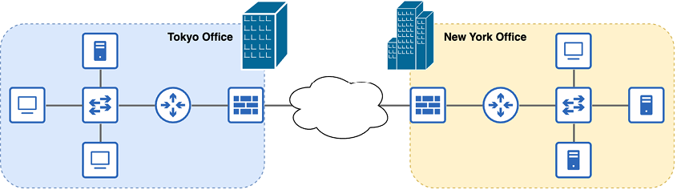
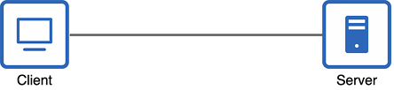
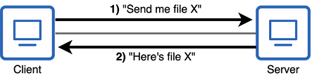
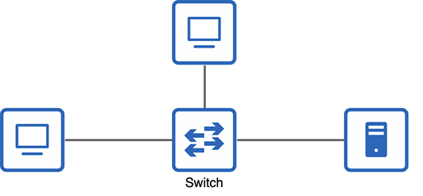
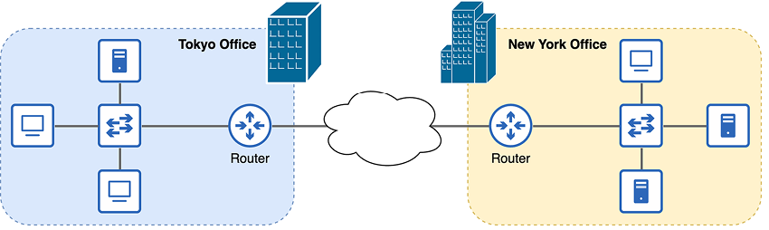
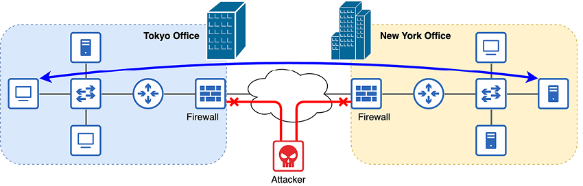

# Dispositivos de red

Este capítulo ofrece una introducción general a las redes y a algunos de los distintos tipos de dispositivos que las componen. Tras ver qué es una red, examinaremos los clientes, los servidores, los conmutadores, los routers y los cortafuegos. Veremos el papel básico de cada uno de estos tipos de dispositivos en una red, pero no entraremos en detalles sobre cómo realizan realmente estas funciones; todavía os quedan muchos temas por descubrir. Al final de este capítulo, seréis capaces de identificar cada uno de los dispositivos de red en la figura 1 y de explicar brevemente sus funciones respectives.

{text-align: justify}
/// figura
Una red de empresa que conecta varias oficinas a través de Internet.
///

Cada oficina de la figura 1 es una red de área local (LAN), es decir, un grupo de dispositivos interconectados en una zona limitada, como una oficina. Dentro de cada oficina del esquema, podéis encontrar los tipos de dispositivos de red que veremos en este capítulo: clientes, servidores, conmutadores, routers y cortafuegos. La conexión entre oficinas se denomina red de área amplia (WAN), una red que se extiende sobre una gran zona geográfica, como entre ciudades. En el volumen 2 de este libro, veremos varios tipos de conexiones WAN. Internet, representada por el icono de nube en la figura 1, es solo una de las opciones para conectar ubicaciones remotas.

## 2.1 ¿Qué es una red?

¿Qué es una red? Como término general, “red” puede referirse a muchas cosas diferentes. Un sistema de ferrocarriles que une poblaciones y ciudades es una red. Las venas y arterias de nuestro cuerpo pueden llamarse red. Un grupo de personas, como colegas o asociados de negocio, también puede considerarse una red. ¿Qué tienen en común todas estas cosas? Todas sirven para conectar personas o elementos. En los dos volúmenes de este libro, vamos a estudiar un tipo concreto de red: la red de ordenadores, es decir, una red que conecta equipos informáticos. Un ordenador conectado a una red puede ser muy diverso, por ejemplo:

- Un ordenador personal conectado a Internet a través de una red doméstica.
- Un televisor que se conecta a Internet para reproducir contenido en streaming.
- Un iPhone conectado a Internet mediante 5G inalámbrico.
- Un servidor de YouTube que transmite vídeos a dispositivos de todo el mundo.
- Los servidores de una empresa que almacenan archivos y datos privados.
- Una cámara de seguridad que guarda grabaciones en un servidor.

Podemos definir una red de ordenadores como una red de telecomunicaciones que permite a los nodos compartir recursos. Esa definición es breve y sencilla, pero quizá os queden algunas dudas, como por ejemplo: “¿qué es un nodo?” y “¿qué es un recurso?”

Un nodo es cualquier dispositivo que se conecta a una red. Incluye los ejemplos mencionados anteriormente, como un ordenador personal o un iPhone, así como la infraestructura de red que conecta los dispositivos: routers, conmutadores, cortafuegos y otros tipos de equipos que forman la red.

Un recurso es cualquier elemento que puede accederse o utilizarse a través de la red. Por ejemplo, si usáis un navegador web como Google Chrome para acceder a una página, la página que aparece en la pantalla es un recurso compartido por la red. Es un archivo ubicado en un servidor de Internet, y ese servidor lo comparte con el dispositivo que usáis para acceder al sitio web. Sin embargo, los recursos no son solo archivos. Hay innumerables ejemplos, pero aquí tenéis unos cuantos:

- Una impresora conectada a la red y compartida por los usuarios de una oficina.
- Un servidor de juegos en línea que soporta partidas multijugador.
- Software basado en la nube, como Gmail o Microsoft 365.

## 2.2 Tipos de dispositivos de red

La discusión anterior sobre nodos y recursos nos lleva a esta sección. Vamos a ver los tipos de nodos que comparten recursos en una red, así como los tipos de nodos que forman la infraestructura de red que facilita ese intercambio.

### 2.2.1 Clientes y servidores

En primer lugar, vamos a ver los nodos que comparten recursos en una red: los clientes y los servidores. No podemos entender uno sin el otro, porque se definen por su relación mutua: un cliente es un dispositivo que accede a un servicio proporcionado por un servidor, y un servidor es un dispositivo que ofrece servicios a los clientes. La figura 2 muestra los iconos para clientes y servidores que usaremos a lo largo de este libro.

{text-align: justify}
/// figura
Iconos de un ordenador de escritorio y un servidor de archivos. Estos iconos se utilizan habitualmente en los diagramas de red para representar clientes y servidores.
///

Es importante señalar que los clientes y los servidores no son tipos concretos de dispositivos físicos. Más bien, son roles que pueden asumir distintos tipos de equipos. Si un dispositivo ofrece un servicio, como alojar una página web, está funcionando como servidor. Si un dispositivo accede a un servicio, como recuperar una página web desde un servidor, está funcionando como cliente.

!!!note "Nota"
    El término servidor también se usa para referirse a un tipo concreto de dispositivo: un ordenador muy potente diseñado para ofrecer servicios a muchos clientes, como un servidor de YouTube que transmite vídeo a miles de usuarios a través de Internet. Sin embargo, casi cualquier tipo de dispositivo puede funcionar como servidor, por lo que es mejor pensar en el servidor como un rol, no como un tipo específico de equipo.

Veamos algunos ejemplos de parejas cliente-servidor:

- Cliente: un televisor con conexión a red que reproduce una película en Netflix.
- Servidor: un servidor de Netflix que aloja la película y la envía por la red.
- Cliente: un iPhone que navega por X (antes Twitter).
- Servidor: servidores de X que alojan los mensajes y los envían al iPhone.
- Cliente: un PC que accede a una hoja de cálculo de Excel ubicada en un servidor de empresa.
- Servidor: un servidor de empresa que contiene hojas de cálculo y otros archivos internos.

Casi cualquier nodo puede ser a la vez servidor y cliente, según el contexto. Por ejemplo, en una red doméstica, es posible compartir archivos entre dispositivos. Podéis transferir un archivo de película desde un PC a otro PC de la red. En ese caso, el PC donde se encuentra el archivo es un servidor, y el PC que accede al archivo es un cliente. Si el archivo se compartiera en sentido contrario, los roles de servidor y cliente se invertirían. Y ambos PCs serían clientes cuando accedieran a sitios web a través de Internet. La figura 3 muestra una relación cliente-servidor entre dos PCs.

{text-align: justify}
/// figura
Dos PCs de escritorio compartiendo un archivo. El PC de la izquierda funciona como cliente, y el de la derecha como servidor.
///

!!!note "Nota"
    Ambos dispositivos de la figura 3 utilizan el icono de cliente para subrayar que son ambos PCs, es decir, el mismo tipo de equipo, aunque sus roles sean diferentes en esta operación.

A veces, una red puede ser tan simple como dos dispositivos conectados directamente entre sí. Sin embargo, este tipo de conexión es poco frecuente. Para ampliar la red y permitir que más dispositivos se comuniquen entre sí, necesitamos ciertos tipos de equipos que actúen como infraestructura de red y faciliten esa comunicación.

Los nodos cliente y servidor a menudo se llaman puntos finales o hosts finales. Son términos generales para dispositivos que se comunican a través de una red, en contraposición a los dispositivos de infraestructura de red que conectan los hosts finales.

### 2.2.2 Conmutadores

Ampliemos la red conectando nuestros hosts finales a un conmutador, como en la figura 4.

{text-align: justify}
/// figura
Tres hosts finales conectados a un conmutador.
///

Los dispositivos conectados a un conmutador pueden comunicarse entre sí a través de él. Tened en cuenta que normalmente no se comunican con el propio conmutador; este solo sirve como infraestructura sobre la que puede producirse la comunicación.

La función de un conmutador es conectar dispositivos dentro de una LAN. Por ejemplo, todos los PCs, cámaras de seguridad, impresoras, servidores y otros dispositivos de una oficina probablemente estarán conectados a uno o varios conmutadores. Por eso, es habitual que los conmutadores tengan muchos puertos para que se conecten los hosts finales, normalmente entre 24 y 48 por conmutador.

!!!note "Nota"
    Un puerto es un conector físico de un dispositivo. Los equipos se conectan físicamente uniendo un extremo del cable a cada uno de los dos dispositivos. Un puerto actúa como interfaz entre un dispositivo y los demás equipos de la red. Por eso, los términos puerto e interfaz se usan a menudo indistintamente.

Los conmutadores utilizan distintas tecnologías para facilitar la comunicación entre los dispositivos conectados a ellos. En el capítulo 6, empezaremos a aprender exactamente cómo lo hacen. Por ahora, basta con conocer su propósito básico. Hay que tener en cuenta que la función de un conmutador no es proporcionar conectividad entre LANs ni con redes externas. Por ejemplo, no conectarías un conmutador directamente a Internet. Para eso necesitamos otro tipo de dispositivo.

### 2.2.3 Routers

Hasta ahora, hemos conectado los hosts finales a un conmutador para permitir que se comuniquen entre sí. Los conmutadores proporcionan conectividad entre dispositivos dentro de una LAN, pero probablemente queramos que nuestros hosts finales también puedan comunicarse con redes externas. Por ejemplo, para que los hosts finales se comuniquen a través de Internet, necesitamos un dispositivo que proporcione conectividad entre LANs e Internet. Ese tipo de dispositivo se llama router. La figura 5 muestra cómo se usan los routers para conectar LANs a redes externas, como Internet.

{text-align: justify}
/// figura
Dos LAN conectadas a Internet mediante un router en el borde de cada una.
///

!!!note "Nota"
    En un diagrama de red se usa un icono de nube para representar partes de una red que son desconocidas o poco relevantes para el esquema. Por ejemplo, la nube se usa a menudo para representar Internet. Para el propósito de la figura 5, solo necesitamos saber que las dos LAN están conectadas a Internet. No necesitamos detalles sobre cómo es Internet, una red enorme y muy compleja.

Los routers no se usan para conectar muchos hosts finales dentro de una LAN. En su lugar, se colocan en el borde de una LAN y se utilizan para habilitar las comunicaciones entre LANs y redes externas, como Internet.

Al igual que los conmutadores, los routers utilizan diversas tecnologías para desempeñar su función en la red, facilitando las comunicaciones entre LANs. Empezaremos a ver cómo funcionan en el capítulo 7, que trata sobre las direcciones IP.

#### Routers inalámbricos

Quizá os preguntéis: “Si eso es un router, ¿qué es el router inalámbrico que conecta mi red doméstica a Internet?” Un router inalámbrico (también conocido como router Wi-Fi o router doméstico) no es solo un router; es un dispositivo de red multifuncional que combina los roles de varios dispositivos distintos.

Estos equipos suelen desempeñar las funciones de router, conmutador, punto de acceso inalámbrico (para proporcionar conectividad Wi-Fi) y cortafuegos, todo en un mismo dispositivo. Son perfectos para una red pequeña de oficina o de casa (SOHO) con solo unos pocos usuarios. Sin embargo, en las redes empresariales, no es viable que un único dispositivo cumpla todos los roles necesarios.

### 2.2.4 Cortafuegos

Los dispositivos de las dos LAN de la figura 5 son perfectamente capaces de comunicarse entre sí y con otros dispositivos a través de Internet. Sin embargo, al permitir que nuestros dispositivos se comuniquen por Internet, los exponemos a posibles riesgos de seguridad. Internet es una red pública muy amplia, y cualquiera puede conectarse a ella, con intenciones buenas o malas. Para proteger nuestras redes, debemos hacer uso de cortafuegos. La figura 6 muestra cómo los cortafuegos pueden proteger las redes al denegar ciertos tipos de tráfico de red.

{text-align: justify}
/// figura
Un cortafuegos entre cada LAN e Internet protege la red. Se permite la comunicación entre las dos LAN, pero se deniega el tráfico malicioso procedente de un atacante.
///

Probablemente ya hayáis oído el término cortafuegos en relación con un programa de software en vuestro PC. Por ejemplo, los PCs con Windows usan Microsoft Defender Firewall de forma predeterminada. Ese tipo de cortafuegos se denomina cortafuegos basado en el host. Examina el tráfico de red que entra y sale del dispositivo host y luego decide permitirlo o denegarlo (bloquearlo). Toma estas decisiones en función de un conjunto de reglas definidas. Sin embargo, no es este el tipo de cortafuegos que debéis conocer para la CCNA. El tipo de cortafuegos que vamos a cubrir es el cortafuegos de red.

Un cortafuegos de red es un aparato independiente de hardware que cumple una función similar a la de un cortafuegos basado en el host, pero a mayor escala. Inspecciona todo el tráfico que entra y sale de una red y decide permitirlo o denegarlo en función de un conjunto de reglas configuradas.

Los cortafuegos no son un foco principal de la CCNA. Veremos alguna de sus funciones en el capítulo 11 del volumen 2, que trata sobre conceptos de seguridad, pero la mayor parte de este libro se centrará en los dos tipos de dispositivos que ya hemos comentado: los routers y los conmutadores.

## Resumen

- Una red de área local (LAN) es un grupo de dispositivos interconectados en una zona limitada, como una oficina.
- Una red de área amplia (WAN) es una red que se extiende sobre una gran zona geográfica, como entre ciudades.
- Una red de ordenadores es una red de telecomunicaciones que permite a los nodos compartir recursos.
- Un nodo es cualquier dispositivo que se conecta a una red: un ordenador personal, un iPhone, un router, etc.
- Un recurso es cualquier elemento compartido a través de una red, como una página web.
- Se utilizan distintos tipos de dispositivos de red para facilitar las comunicaciones.
- Los clientes y los servidores se definen por sus funciones en relación entre sí: los clientes acceden a servicios proporcionados por los servidores, y los servidores ofrecen servicios a los clientes. La mayoría de los dispositivos pueden ser tanto cliente como servidor.
- Los conmutadores proporcionan conectividad entre dispositivos dentro de una LAN. Normalmente tienen muchos puertos (entre 24 y 48) para conectar equipos.
- Los routers proporcionan conectividad entre LANs y redes externas, como Internet.
- Un router inalámbrico (router Wi-Fi/router doméstico) es un dispositivo multifuncional que combina los roles de router, conmutador, punto de acceso inalámbrico y cortafuegos.
- Los cortafuegos protegen la red inspeccionando el tráfico que entra o sale de ella y permitiendo o denegando el acceso según un conjunto de reglas configuradas.