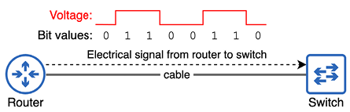
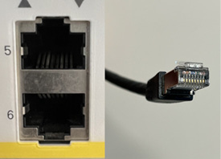
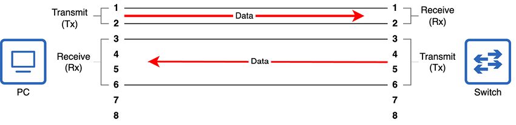
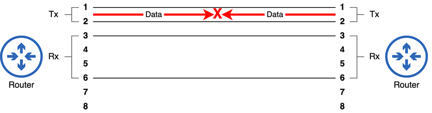
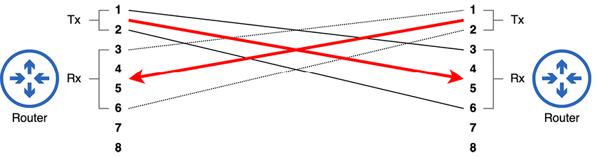
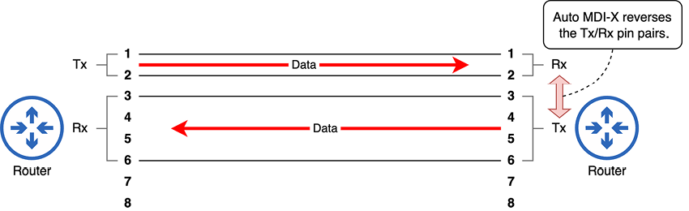
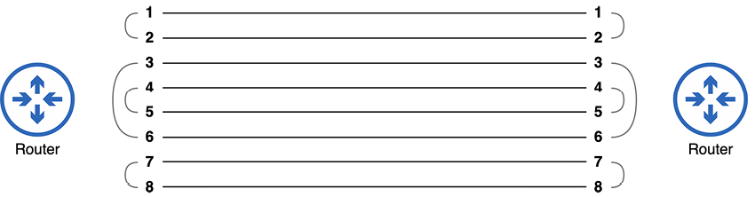
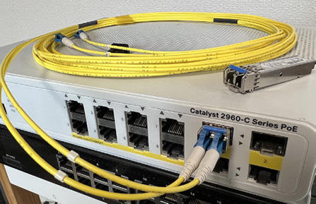
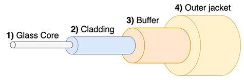
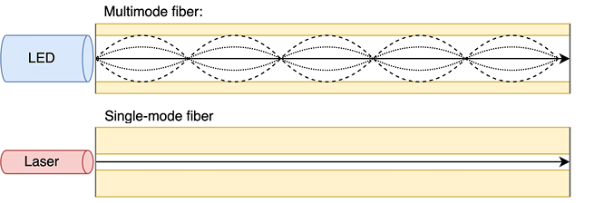

# Medios de transmisión

Este capítulo cubre:

- Las especificaciones y normas que permiten que los ordenadores se comuniquen.
- Los fundamentos del tráfico en una red.
- Los tipos de conexiones cableadas y las normas de cableado.
- Los usos del par trenzado sin apantallar y de las conexiones de fibra óptica en redes.

En el capítulo anterior vimos varios diagramas que mostraban nodos de red conectados con cables. En este capítulo, vamos a ver los tipos concretos de cables, conectores y puertos que se utilizan para realizar esas conexiones. Estos temas forman parte de la sección 1.0, Fundamentos de red, del examen CCNA. En concreto, vamos a cubrir aspectos del tema de examen 1.3, que son los siguientes:

- 1.3 Comparar los tipos de interfaces físicas y de cableado.
  - 1.3.a Fibra monomodo, fibra multimodo, cobre.
  - 1.3.b Conexiones (medio compartido Ethernet y punto a punto).

En el pasado, ha habido muchas formas diferentes de conectar dispositivos, y todavía las hay. Sin embargo, en las redes modernas, Ethernet domina y es, con diferencia, el tipo de conexión más común. Quizá ya hayáis oído hablar de Ethernet en relación con los cables Ethernet. Ethernet no es una única cosa, sino una colección de normas para las conexiones físicas por cable y de reglas para comunicarse a través de esas conexiones. En este capítulo, vamos a ver dos tipos diferentes de conexiones físicas entre dispositivos: las que utilizan cables de cobre y las que utilizan cables de fibra óptica.

## 1. Estándares de red

En las redes modernas, alguien que trabaje en una oficina con un PC Dell conectado a un conmutador Cisco puede comunicarse con otra persona que use un MacBook de Apple conectado al Wi-Fi de Starbucks. Los datos se envían por Internet, posiblemente recorriendo la infraestructura de varios proveedores de servicios de Internet (ISP), que utilizan hardware completamente distinto. ¿Cómo es posible que todos estos dispositivos, fabricados por distintas empresas, puedan comunicarse entre sí? Para este milagro moderno, podemos dar las gracias a los estándares: conjuntos de requisitos y especificaciones técnicas que definen las reglas de comunicación en las redes.

Para demostrar por qué estas reglas de comunicación son importantes, vamos a olvidar durante un momento los ordenadores y pensar en la comunicación directa entre personas. Si una persona que habla inglés se dirige a otra que solo entiende japonés, no va a producirse ninguna comunicación. Cada idioma, inglés y japonés, tiene un conjunto diferente de reglas sobre cómo debe comunicarse la información entre personas. A menos que ambos interlocutores estén de acuerdo en las reglas, la comunicación no se produce.

Incluso si ambas partes entienden inglés, deben acordar el medio de comunicación. Si la persona A escribe un mensaje en un trozo de papel, pero la persona B cierra los ojos e intenta escuchar el mensaje, el resultado es el mismo que en el ejemplo anterior: la comunicación no se produce. Para que las personas puedan comunicarse entre sí, debemos acordar tanto las reglas de comunicación como el medio de comunicación.

Lo mismo ocurre con los ordenadores. Para que dos ordenadores se comuniquen, deben cumplir las mismas reglas de comunicación; por ejemplo, cómo formatear los datos cuando se envían por la red. También deben existir reglas que rijan el medio de comunicación: especificaciones para cables físicos, conectores y puertos, así como las ondas de radio utilizadas en las comunicaciones inalámbricas.

Existen varios organismos que definen los estándares utilizados en las redes de ordenadores, y vamos a mencionar a un par de ellos a lo largo de los dos volúmenes de este libro. El más importante para este capítulo es el Institute of Electrical and Electronics Engineers (IEEE, pronunciado «I-triple-E»). En 1983, el IEEE definió por primera vez el estándar IEEE 802.3, más conocido como Ethernet.

!!!note "Nota"
    El IEEE también define el estándar IEEE 802.11, mejor conocido, aunque no oficialmente, como Wi-Fi. Las WLAN IEEE 802.11 son un tema importante del examen CCNA y se tratan en la parte 4 del volumen 2 de este libro.

Ethernet no es un estándar único, sino una familia de estándares que definen tanto los aspectos físicos de las conexiones de red como la forma de formatear los datos en mensajes para enviarlos por la red.

## 2. Binario: bits y bytes

Términos como bit, byte, megabit, megabyte, etc., os resultarán familiares, incluso si no estáis del todo seguros de lo que significan (yo tampoco lo estaba antes de empezar a estudiar redes). Incluso podéis usar vosotros mismos estos términos, refiriéndoos a una conexión de Internet de gigabit o a un archivo de X gigabytes. Dependiendo de vuestra edad, quizá incluso recordéis vuestra conexión de Internet de 56k (kilobit).

Para entender lo que significan estos términos, debemos definir el término bit. Un bit es la unidad básica de información utilizada por los ordenadores. La palabra bit es simplemente una combinación de las palabras binary digit. El binario es un sistema numérico que expresa todos los valores utilizando solo dos dígitos: 0 y 1. Un byte, por su parte, es simplemente una unidad de 8 bits. Ocho bits equivalen a 1 byte.

El binario es el lenguaje de los ordenadores. Calculan en binario y se comunican en binario. Todo lo que veis en la pantalla de un ordenador o oís por su altavoz es una serie de 0s y 1s interpretada por un ordenador y presentada en un formato comprensible para los humanos. Eso incluye aplicaciones, fotos, vídeos, canciones, este libro si lo estáis leyendo en formato electrónico, y todo lo demás que hace un ordenador.

El CCNA, como certificación de redes, trata sobre cómo se comunican los ordenadores; eso es precisamente lo que es la red. Cuando dos ordenadores conectados por un cable se comunican entre sí, se envían largas series de bits (0s y 1s) a través de ese cable. En las redes modernas, suelen enviarlos a una velocidad de miles de millones por segundo. Exactamente cómo se transmiten esos 0s y 1s depende del medio. Por ejemplo, los 0s y 1s pueden comunicarse por cable de cobre modificando el voltaje de una señal eléctrica entre los dos dispositivos. El voltaje «x» representa un valor de 0, y el voltaje «y» representa un valor de 1. En la Figura 1 se ilustra este concepto; cuando el router envía 1 byte de datos al conmutador a través del cable que los une, los cambios de voltaje de la señal se utilizan para comunicar los valores 0 y 1.

!!!note "Nota"
    Entender el sistema numérico binario es muy importante para el examen CCNA. En los próximos capítulos de este volumen, vamos a ver cómo contar en binario y cómo convertir entre binario y otros sistemas numéricos como el decimal o el hexadecimal.

{text-align: justify}
/// figura
Un router envía 1 byte de datos a un conmutador. Los cambios de voltaje de la señal eléctrica indican valores de 0 o 1.
///

Medimos la velocidad de las conexiones de red por cuántos bits pueden transmitirse por segundo. Sin embargo, debido a la enorme velocidad de las redes de ordenadores, expresamos estas tasas utilizando unidades mayores, como kilobits, megabits y gigabits. A continuación, se muestran algunas unidades habituales de medición de bits:

- 1 kilobit (kb) = 1.000 bits.
- 1 megabit (Mb) = 1.000.000 bits (1.000 kilobits).
- 1 gigabit (Gb) = 1.000.000.000 bits (1.000 megabits).
- 1 terabit (Tb) = 1.000.000.000.000 bits (1.000 gigabits).

Las velocidades de red se expresan entonces como X bits por segundo (bps); por ejemplo, 56 kilobits por segundo (56 kbps), 100 megabits por segundo (100 Mbps), 10 gigabits por segundo (10 Gbps) o 1 terabit por segundo (1 Tbps).

### 2.1. 1,000 o 1,024 bits

Existe cierta confusión sobre si 1 kilobit son 1.000 bits o 1.024 bits, si 1 megabit son 1.000 kilobits o 1.024 kilobits, etc. Las definiciones que se han listado anteriormente son correctas, y son los términos que debéis conocer para el CCNA. Los valores de 1.024 son resultado del sistema numérico binario (base 2); 2^10 es igual a 1.024. Los términos correctos para los valores en base 2 son:

- 1 kibibit (1.024 bits)
- 1 mebibit (1.024 kibibits)
- 1 gibibit (1.024 mebibits)
- 1 tebibit (1.024 gibibits)

## 3. Conexiones de cobre UTP

El CCNA os exige conocer dos tipos de conexiones cableadas: las que usan cables de cobre y las que usan cables de fibra óptica. Primero, vamos a ver los cables de cobre. Este es el tipo de cable de red más comúnmente llamado cable Ethernet, aunque el estándar Ethernet utiliza tanto cables de cobre como de fibra óptica. Antes de examinar un cable Ethernet de cobre en sí, vamos a mirar el conector del extremo del cable y el puerto al que se conecta en un dispositivo de red, ambos representados en la Figura 2.

{text-align: justify}
/// figura
Dos puertos 8P8C en un conmutador Cisco (izquierda) y un conector 8P8C en un cable de red UTP de cobre (derecha).
///

La Figura 2 muestra el conector de 8 posiciones y 8 contactos (8P8C) de un cable Ethernet en la derecha. El nombre se debe a que hay ocho pines en el conector: uno para cada uno de los ocho hilos del cable. Estos conectores permiten que el cable se conecte a puertos como los que se muestran a la izquierda de la Figura 2. Otro nombre para este tipo de conector es RJ45 (RJ significa Registered Jack); estrictamente hablando, este nombre no es del todo correcto, pero se usa habitualmente cuando se habla de cables Ethernet.

El tipo de cables utilizados para estas conexiones se llama cables de par trenzado sin apantallar (UTP). También existen cables de par trenzado apantallado (STP), pero son menos comunes, así que vamos a referirnos a ellos como UTP a lo largo de este libro. Cada cable UTP contiene ocho hilos individuales en su interior, trenzados para formar cuatro pares. Vamos a analizar el significado de UTP:

- Unshielded: los hilos no tienen un blindaje metálico alrededor. Ese blindaje puede reducir las interferencias electromagnéticas (EMI), pero no está presente en los cables UTP.
- Twisted pair: los ocho hilos del cable están trenzados para formar cuatro pares de dos hilos cada uno. El trenzado de los hilos reduce la EMI entre los hilos de cada par.

### 3.1. Estándares IEEE 802.3 (cobre)

El IEEE define varios estándares para las conexiones Ethernet que soportan diferentes velocidades, tipos de cable (cobre o fibra óptica) y distancias. Cada estándar se conoce por varios nombres distintos:

- Un nombre deriva de la velocidad máxima de transmisión soportada.
- También se usa el nombre del grupo de trabajo del IEEE que definió el estándar. Estos nombres comienzan con IEEE 802.3, seguido de una letra.
- El tercer nombre es un nombre informal dado por el IEEE que indica tanto la velocidad como el tipo de cable (los estándares de cableado de cobre terminan en T).

#### 3.1.1. Grupos de trabajo y subgrupos del IEEE

El IEEE asigna grupos de trabajo para desarrollar tecnologías concretas. Los dos grupos de trabajo principales relevantes para el CCNA son 802.3 (encargado de desarrollar el estándar Ethernet para redes cableadas) y 802.11 (redes LAN inalámbricas, también conocidas como Wi-Fi).

Dentro de cada grupo de trabajo, se asignan subgrupos para revisar y seguir desarrollando los estándares originales. Cada vez que se forma un subgrupo, se le asigna una letra en orden secuencial (por ejemplo, 802.3a a 802.3z). Cuando se usan todas las letras, se añade otra más (por ejemplo, 802.3aa a 802.3az). En el momento de escribir esto, 802.3dk está en desarrollo.

La Tabla 3.1 muestra algunos ejemplos de estándares Ethernet que usan cableado de cobre. Tened en cuenta los tres nombres de cada estándar, tal como se han descrito anteriormente.

| Velocidad | Nombre derivado de la velocidad | Grupo de trabajo IEEE | Nombre informal | Longitud máxima del cable |
| --- | --- | --- | --- | --- |
| 10 Mbps | Ethernet | IEEE 802.3i | 10BASE-T | 100 m |
| 100 Mbps | Fast Ethernet | IEEE 802.3u | 100BASE-T | 100 m |
| 1 Gbps | Gigabit Ethernet | IEEE 802.3ab | 1000BASE-T | 100 m |
| 10 Gbps | 10 Gig Ethernet | IEEE 802.3an | 10GBASE-T | 100 m |

!!!note "Nota"
    Para el examen CCNA, no es necesario memorizar los nombres de los grupos de trabajo del IEEE asociados a cada estándar. Sin embargo, sí debéis conocer los nombres derivados de la velocidad y los nombres informales.

Cada uno de estos estándares admite una longitud máxima de cable de 100 metros. Intentar usar cables UTP más largos que el máximo indicado puede provocar atenuación de la señal y un rendimiento menor. La longitud máxima del cable puede ser un problema para las conexiones de cobre UTP. Como veremos en la sección 3.4, una mayor longitud máxima es una ventaja importante de la fibra óptica frente a los cables UTP de cobre.

!!!note "Nota"
    Los cables utilizados en los estándares Ethernet mencionados no están definidos realmente por el IEEE, sino por dos organizaciones adicionales: la Electronic Industries Alliance (EIA) y la Telecommunications Industry Association (TIA). Por eso, el nombre «cable Ethernet» no es muy exacto, porque los cables, aunque se usen en Ethernet, no están definidos por IEEE 802.3.

Los estándares de estos cables reciben nombres como Category 5, que a menudo se abrevia como Cat 5. La Tabla 3.2 muestra algunos estándares de cable que pueden utilizarse con los estándares Ethernet mencionados.

| Velocidad | Nombre informal Ethernet | Nombre del cable |
| --- | --- | --- |
| 10 Mbps | 10BASE-T | Cat 3 |
| 100 Mbps | 100BASE-T | Cat 5 |
| 1 Gbps | 1000BASE-T | Cat 5e |
| 10 Gbps | 10GBASE-T | Cat 6a |

### 3.2. Cables straight-through y crossover

Aunque hoy en día todos los cables UTP usados para comunicaciones de red tienen cuatro pares de hilos (ocho hilos), no todos los estándares Ethernet utilizan los cuatro pares de hilos:

- 10BASE-T usa dos pares (cuatro hilos).
- 100BASE-T usa dos pares (cuatro hilos).
- 1000BASE-T usa cuatro pares (ocho hilos).
- 10GBASE-T usa cuatro pares (ocho hilos).

Cada hilo del cable está conectado a uno de los ocho pines del conector 8P8C. Para que los dispositivos se comuniquen a través de estos pares de hilos, cada par forma un circuito eléctrico entre los dos dispositivos conectados. En las conexiones 10BASE-T y 100BASE-T, es muy importante usar el cable adecuado para asegurar que los hilos conectan los pines de un extremo de la conexión con los pines correctos del otro extremo. Para facilitar esto, existen dos tipos de cables que podemos utilizar: straight-through y crossover. Estos tipos de cable se diferencian en qué pines de un extremo del cable se conectan a qué pines del otro extremo.

#### 3.2.1. Cables straight-through

10BASE-T y 100BASE-T usan dos pares de hilos, uno para cada sentido de la comunicación. Los dos pares de hilos son:

- El par conectado a los pines 1 y 2.
- El par conectado a los pines 3 y 6 (sí, es 3 y 6, no 3 y 4).

Esto se muestra en la Figura 3, en la que un PC y un conmutador están conectados por un cable UTP. Los pines 1 y 2 del PC se conectan a los pines 1 y 2 del conmutador. Del mismo modo, los pines 3 y 6 del PC se conectan a los pines 3 y 6 del conmutador.

{text-align: justify}
/// figura
Un PC y un conmutador conectados mediante un cable straight-through.
///

Cuando los dispositivos se conectan con un cable straight-through, un par de pines de un conector se conecta al mismo par de pines del otro conector. Esto funciona bien al conectar un PC a un conmutador. Como se muestra en la Figura 3, los PCs usan el par de pines 1–2 para transmitir datos (a menudo abreviado como Tx), y los conmutadores usan el par de pines 1–2 para recibir datos (a menudo abreviado como Rx). Del mismo modo, los conmutadores usan el par de pines 3–6 para transmitir datos, y los PCs usan el par de pines 3–6 para recibir datos.

Sin embargo, ¿qué pasaría si conectáramos dos conmutadores? ¿O dos PCs? ¿O dos routers? En estos casos, usar un cable straight-through causaría problemas, como se muestra en la Figura 4.

{text-align: justify}
/// figura
Dos routers conectados mediante un cable straight-through. Como ambos routers transmiten datos usando el mismo par de pines, la comunicación falla.
///

Cuando dos dispositivos que transmiten usando el mismo par de pines se conectan con un cable straight-through, no podrán comunicarse. Los pines Tx de un dispositivo se conectan a los pines Tx del otro. Para que dispositivos como estos puedan comunicarse, necesitan un cable con un cableado distinto: un cable crossover.

#### 3.2.2. Cables crossover

Un cable crossover conecta pares de pines opuestos; los pines 1 y 2 de un extremo del cable se conectan a los pines 3 y 6 del otro extremo. Esto permite que los dispositivos que transmiten datos en el mismo par de pines puedan comunicarse entre sí. Como muestra la Figura 5, los dispositivos que transmiten usando el mismo par de pines pueden comunicarse entre sí cuando se conectan con un cable crossover.

{text-align: justify}
/// figura
Dos routers conectados mediante un cable crossover. El par de pines Tx de un router se conecta al par de pines Rx del otro router.
///

La Tabla 3.3 enumera algunos tipos habituales de dispositivos de red y qué pines utilizan para transmitir y recibir datos. En pocas palabras, los conmutadores transmiten por los pines 3 y 6 y reciben por los pines 1 y 2. Todos los demás dispositivos hacen lo contrario.

| Tipo de dispositivo | Pines de transmisión (Tx) | Pines de recepción (Rx) |
| --- | --- | --- |
| Router | 1 y 2 | 3 y 6 |
| Firewall | 1 y 2 | 3 y 6 |
| PC/Servidor | 1 y 2 | 3 y 6 |
| Conmutador | 3 y 6 | 1 y 2 |

!!!note "Nota"
    Aunque 10BASE-T y 100BASE-T solo usan dos pares de hilos, siguen existiendo cuatro pares de hilos dentro del cable. Los otros dos pares de hilos quedan sin utilizar.

#### 3.2.3. Auto MDI-X

Ahora que ya hemos cubierto los cables straight-through y crossover, queremos daros una buena noticia: en los equipos de red modernos, no tenéis que preocuparos por usar el tipo de cable correcto. Eso se debe a una función llamada Auto Medium-Dependent Interface Crossover (Auto MDI-X). Auto MDI-X permite que un dispositivo cambie qué pines usará para transmitir y recibir datos según el dispositivo al que esté conectado. Debéis conocer los cables straight-through y crossover como posible pregunta de examen, pero en el campo probablemente no tendréis que pensar si un cable es straight-through o crossover.

La Figura 6 demuestra este concepto. Los dos routers están conectados mediante un cable straight-through. Normalmente, los routers transmiten datos en el par 1–2 y reciben en el par 3–6, pero gracias a Auto MDI-X, el router de la derecha invierte eso; transmite datos en el par 3–6 y recibe en el par 1–2.

{text-align: justify}
/// figura
Dos routers conectados mediante un cable straight-through. El router de la derecha usa Auto MDI-X para ajustar qué pines usa para transmitir y recibir datos.
///

#### 3.2.4. 1000BASE-T y 10GBASE-T

1000BASE-T y 10GBASE-T aprovechan los ocho hilos de un cable, por lo que se usan un total de cuatro pares de hilos. Se utilizan los mismos pares de pines/hilos 1–2 y 3–6 que en 10BASE-T y 100BASE-T. Los pares restantes son el par en las posiciones 4 y 5 y el par en las posiciones 7 y 8. Esto se muestra en la Figura 7.

{text-align: justify}
/// figura
Pares de pines y hilos usados en las conexiones 1000BASE-T y 10GBASE-T. Se usan los ocho hilos del cable.
///

Además, en lugar de que un dispositivo use cada par de hilos exclusivamente para transmitir o recibir datos, cada par de hilos puede usarse para ambos propósitos simultáneamente.

Si se usa un cable crossover, los pares 1–2 y 3–6 se cruzan como en 10BASE-T y 100BASE-T, y también se cruzan los nuevos pares 4–5 y 7–8. Sin embargo, gracias a Auto MDI-X, ya no tenemos que preocuparnos por seleccionar el tipo de cable adecuado.

## 4. Conexiones de fibra óptica

Las conexiones de cobre UTP siguen siendo el tipo de conexión más común dentro de una LAN. Tanto los cables como los puertos de los conmutadores son relativamente baratos y están soportados por casi todos los dispositivos modernos que se conectan a una red. Sin embargo, existe una limitación importante que puede hacer que las conexiones de cobre no sean viables en algunos casos: la longitud máxima del cable de 100 metros. Para conexiones entre dispositivos del mismo piso de un edificio, 100 metros suelen ser más que suficientes, pero para algunas conexiones entre dispositivos de distintos pisos quizá no lo sean. Y, desde luego, para conexiones entre edificios y conexiones WAN, se prefiere el siguiente tipo de cableado: el cableado de fibra óptica.

Los cables de fibra óptica, en lugar de transmitir señales eléctricas a lo largo de un cable de cobre, transmiten señales de luz a lo largo de una fibra de vidrio. La fibra de vidrio utilizada es más flexible de lo que quizá penséis al imaginar vidrio, pero aun así los cables de fibra óptica deben manipularse con cuidado; una curva cerrada en el cable puede dañar la fibra de vidrio y dejarlo inutilizable. Incluso si la fibra de vidrio no se rompe, doblar el cable puede hacer que la luz se escape del cable, debilitando la señal.

### 4.1. La anatomía de un cable de fibra óptica

Una conexión típica de fibra óptica no usa un único cable, sino dos: uno para transmitir datos y otro para recibirlos. Estos cables se conectan a un transceptor Small Form-Factor Pluggable (SFP) insertado en un puerto SFP del dispositivo. Los transceptores SFP son modulares y deben comprarse por separado del propio dispositivo (y probablemente os sorprenderá lo caros que son estas cositas).

La Figura 8 muestra un conmutador Cisco con un par de transceptores SFP: uno insertado en un puerto SFP y otro encima del conmutador. Observad que hay dos cables conectados al transceptor SFP, no uno. Al conectar dos dispositivos con cables de fibra óptica, es importante conectar los cables correctamente: el transmisor de un dispositivo debe conectarse al receptor del otro; de lo contrario, la comunicación no se producirá (algo parecido a seleccionar correctamente los cables straight-through/crossover cuando se conectan dispositivos que no admiten Auto MDI-X).

{text-align: justify}
/// figura
Un conmutador Cisco con un transceptor SFP insertado en uno de sus puertos SFP. Se coloca un SFP adicional encima del conmutador.
///

Como muestra la Figura 9, un cable de fibra óptica tiene varias capas. Una chaqueta exterior (4) y un buffer (3) sirven para proteger y contener los componentes internos. Una capa de revestimiento reflectante (2) ayuda a conducir la señal luminosa a lo largo del núcleo de vidrio (1). El núcleo es una fibra de vidrio muy fina, aunque su grosor depende del tipo de cable.

{text-align: justify}
/// figura
La estructura típica de un cable de fibra óptica. Una chaqueta exterior (4) y un buffer (3) sirven para proteger y contener los componentes internos. Una capa de revestimiento reflectante (2) ayuda a conducir la señal luminosa a lo largo del núcleo de vidrio (1).
///

Todo tipo de cableado de fibra óptica puede transportar una señal a mayor distancia que el cableado de cobre, pero incluso dentro de la categoría de fibra óptica, la longitud máxima admitida puede variar mucho. Existen dos tipos principales de cableado de fibra óptica: fibra multimodo (MMF) y fibra monomodo (SMF). La Figura 10 muestra cómo viaja la luz a lo largo de los cables MMF y SMF.

{text-align: justify}
/// figura
La luz viaja por un cable MMF en múltiples ángulos (modos), mientras que la luz viaja por los cables SMF en un solo ángulo.
///

Los cables MMF tienen un núcleo más ancho que los cables de fibra monomodo. Se utilizan junto con transmisores LED que envían luz por el cable en múltiples ángulos (modos), reflejándose en el revestimiento. Los cables MMF suelen soportar distancias máximas de varios cientos de metros.

Los cables SMF usan un núcleo muy estrecho junto con transmisores láser que envían luz por el cable en un solo ángulo. Estos transmisores láser suelen ser más caros que los transmisores LED utilizados por los cables MMF. Sin embargo, los cables SMF también admiten distancias máximas mucho mayores: de hasta decenas de kilómetros.

### 4.2. UTP frente a fibra

Las conexiones de fibra óptica admiten distancias mucho mayores que los cables UTP de cobre, pero a un coste mayor (sobre todo por los caros transceptores SFP). Ambos tipos de conexión tienen un uso frecuente en las redes modernas. Las conexiones UTP son las más comunes para conexiones de conmutadores a hosts finales. En un entorno de oficina, normalmente hay conmutadores en cada planta, y la longitud máxima de 100 metros suele ser suficiente para que los hosts finales lleguen a un conmutador de su planta. Por otro lado, las conexiones de fibra óptica son más comunes para las conexiones entre infraestructura de red; por ejemplo, para conectar conmutadores y routers ubicados en plantas separadas o en edificios distintos.

Sin embargo, el cableado de fibra tiene un par de ventajas adicionales frente al UTP de cobre: una es que los cables UTP de cobre son vulnerables a la EMI. En general, esto no suele ser un problema, pero en entornos con mucho equipo eléctrico, la EMI puede afectar negativamente a las señales que recorren un cable UTP. La segunda desventaja es que los cables UTP de cobre pueden filtrar (escapar) su señal fuera del cable. Esa señal filtrada es bastante débil, pero es posible que pueda detectarse y leerse, lo que supone un riesgo de seguridad.

Las consideraciones más habituales para decidir entre usar cableado UTP de cobre o fibra son la distancia máxima, el coste y qué tipo de conexión admite el dispositivo que se va a conectar. La mayoría de los dispositivos cliente (como los PCs) no tienen puertos SFP que puedan usarse para conexiones de fibra óptica, por lo que la conexión UTP es la única opción.

## 5. Resumen

- Los estándares proporcionan conjuntos de reglas acordadas para la comunicación en las redes.
- Ethernet es una familia de estándares definida por el grupo de trabajo 802.3 del Institute of Electrical and Electronics Engineers (IEEE). Define normas para la comunicación sobre conexiones físicas por cable.
- Los ordenadores calculan y se comunican utilizando binario: 0s y 1s. Cada dígito binario se llama bit, y un grupo de 8 bits se llama byte.
- Las velocidades de red se miden en bits por segundo usando unidades como kilobit (1.000 bits), megabit (1.000 kilobits), gigabit (1.000 megabits) y terabit (1.000 gigabits).
- El tipo de conexión más común en las LAN Ethernet usa cables de cobre de par trenzado sin apantallar (UTP). «Sin apantallar» significa que los hilos del cable no tienen un blindaje metálico alrededor para protegerlos frente a interferencias electromagnéticas (EMI). «Par trenzado» significa que los ocho hilos del cable están trenzados para formar cuatro pares de dos. El trenzado de los hilos reduce la EMI entre los hilos de cada par.
- Los cables UTP usan conectores de 8 posiciones y 8 contactos (8P8C), también conocidos como Registered Jack-45 (RJ45).
- Las conexiones 10BASE-T y 100BASE-T usan dos de los cuatro pares de hilos/pines en un cable UTP, y las conexiones 1000BASE-T y 10GBASE-T usan los cuatro pares. Todos los tipos de conexión admiten una longitud máxima de cable de 100 metros.
- En las conexiones 10BASE-T y 100BASE-T, los distintos tipos de dispositivos envían y reciben datos usando pines distintos del conector; sin embargo, Auto MDI-X permite a los dispositivos ajustar automáticamente qué pines usar para cada finalidad.
- Los cables de fibra óptica envían señales de luz a través de un núcleo de fibra de vidrio y admiten distancias máximas mucho mayores que los cables UTP.
- Los cables de fibra monomodo (SMF) admiten mayores distancias máximas (decenas de kilómetros) que los cables de fibra multimodo (MMF) (cientos de metros), pero los transceptores SFP basados en láser usados por las conexiones SMF son más caros que los transceptores basados en LED usados por las conexiones MMF.
- Las conexiones de fibra óptica son más caras que las de cobre UTP, sobre todo por el coste de los transceptores SFP.
- Las conexiones UTP son más comunes entre hosts finales y conmutadores debido a su menor coste y porque la longitud máxima de 100 metros suele ser suficiente. Además, la mayoría de los dispositivos cliente (como los PCs) solo admiten conexiones UTP.
- Las conexiones de fibra óptica son más comunes entre dispositivos de infraestructura de red debido a la mayor longitud máxima del cable. Los dispositivos de red suelen conectarse a otros dispositivos de red en plantas distintas y en edificios distintos.

