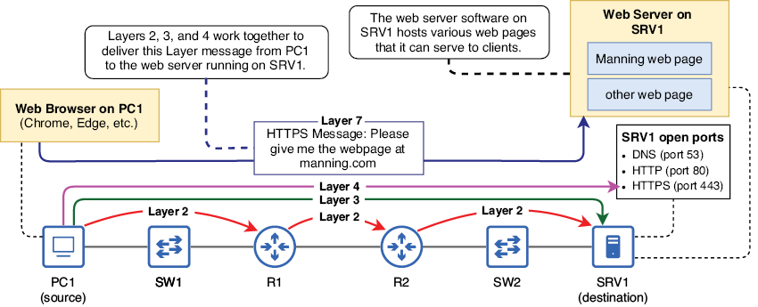
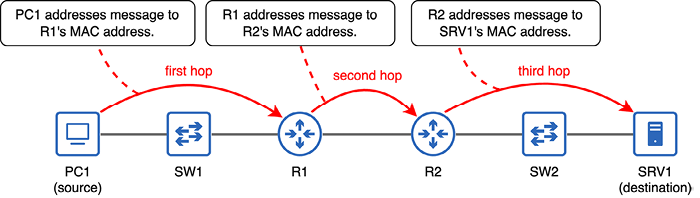
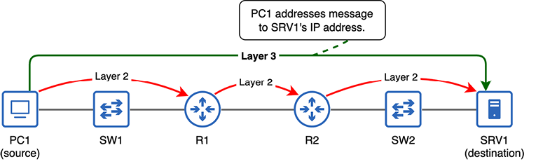
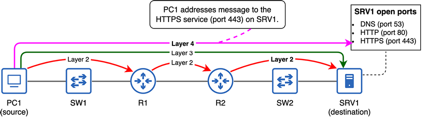
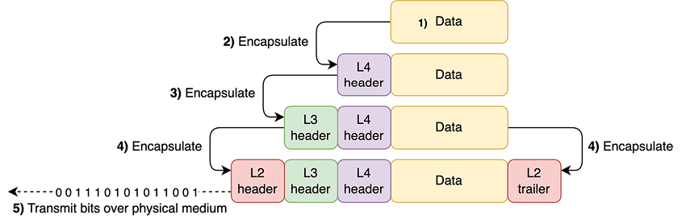
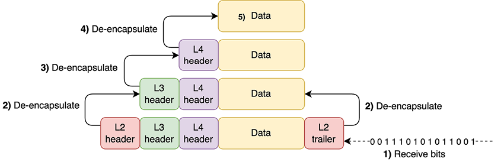
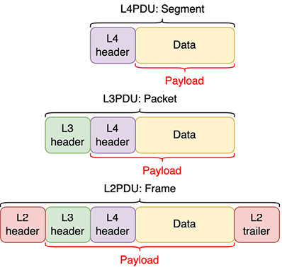
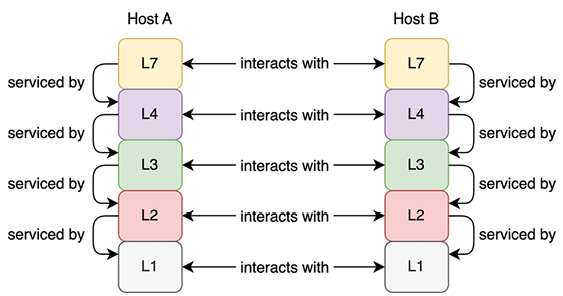

# Modelo TCP/IP

Este capítulo cubre:

- Qué son los modelos de red y por qué los necesitamos.
- El modelo OSI.
- El modelo TCP/IP y sus capas.
- El papel que juega cada capa al mover datos a través de una red.
- La encapsulación y la desencapsulación de datos.

En el capítulo anterior vimos Ethernet, concretamente los tipos de conexiones físicas definidas por el estándar Ethernet. Ethernet también define reglas sobre cómo los dispositivos pueden comunicarse a través de esas conexiones. Sin embargo, Ethernet por sí solo no es suficiente para que dos ordenadores se comuniquen en una red; por ejemplo, para que un PC consulte una página web desde un servidor a través de Internet. La comunicación a través de una red es un proceso complejo y requiere diversos protocolos, cada uno con funciones específicas, que, al combinarse, permiten la comunicación en red.

En este capítulo, vamos a ver un par de modelos que definen las distintas funciones necesarias para que los ordenadores se comuniquen a través de una red: el modelo de interconexión de sistemas abiertos (OSI) y el modelo TCP/IP (cuyos nombres provienen de dos protocolos clave del modelo: Transmission Control Protocol y Internet Protocol). TCP/IP es el modelo que utilizan actualmente las redes modernas de todo el mundo.

Ninguno de estos modelos aparece explícitamente como tema del examen CCNA. Sin embargo, la información incluida en este capítulo es conocimiento fundamental de redes. A lo largo de los dos volúmenes de este libro, vamos a estudiar las funciones de diversos protocolos de red, así que es importante contar con un marco para entenderlo todo. Ese es precisamente el papel de estos modelos de red: proporcionar un marco para organizar las distintas funciones que hacen que una red funcione.

El propósito de este capítulo es ofrecer una visión general de alto nivel sobre cómo viajan los datos desde el origen hasta el destino a través de una red. En el resto del libro, vamos a rellenar los huecos sobre los mecanismos concretos que hacen posible la comunicación en red, pero primero necesitamos un marco de referencia.

## 4.1 Modelos conceptuales de red

Desde los inicios de las redes de ordenadores, se han llevado a cabo varios intentos para crear modelos que definan las distintas funciones necesarias para que los ordenadores se comuniquen entre sí. Algunos de estos modelos eran propietarios de un fabricante, es decir, fueron creados por un fabricante concreto (por ejemplo, IBM) para ser usados por sus productos. Sin embargo, el enfoque propietario no era ideal; cada fabricante diseñaba sus propios protocolos de comunicación, por lo que habilitar la comunicación entre productos de distintos fabricantes no era una tarea sencilla.

!!!note "Nota"
    Un protocolo es un conjunto de reglas que define cómo deben comunicarse los datos entre dispositivos de una red. Los protocolos pueden entenderse como los lenguajes que utilizan los ordenadores para comunicarse; dos ordenadores que usen protocolos de red distintos son como dos personas que hablan idiomas diferentes: no podrán comunicarse.

Hoy en día disfrutamos de los beneficios del enfoque alternativo: el enfoque neutral para el fabricante. En un modelo neutral para el fabricante, con protocolos neutrales que pueden utilizar dispositivos de todo tipo, no tenemos que preocuparnos de si un MacBook de Apple podrá acceder a un sitio web alojado en un servidor web Linux o si un PC con Windows podrá enviar un correo electrónico que pueda leer un teléfono inteligente con Android.

Los modelos de red son marcos que definen las distintas funciones necesarias para permitir que los datos viajen desde el origen hasta el destino a través de una red. Estas funciones suelen dividirse en capas, y cada una describe un papel concreto necesario para habilitar la comunicación en red. A continuación, los protocolos pueden diseñarse para cubrir esos roles.

El uso de capas permite un diseño modular: en cada capa del modelo, existen varios protocolos que pueden cubrir los roles necesarios de esa capa. Por ejemplo, en el capítulo anterior, vimos algunos aspectos de Ethernet (IEEE 802.3) y también mencionamos brevemente las redes LAN inalámbricas definidas por IEEE 802.11 (más conocidas como Wi‑Fi). Ambos protocolos cumplen el mismo propósito: definen cómo deben enviarse los datos a través de un medio físico concreto (cables UTP/fibra para Ethernet, ondas de radio para Wi‑Fi). Una aplicación de correo electrónico en un ordenador no necesita preocuparse de si el mensaje se enviará por una conexión Ethernet cableada o por una conexión Wi‑Fi inalámbrica; siempre que la aplicación de correo realice su papel, puede esperar que las demás capas hagan lo suyo.

Hay dos modelos de red que los profesionales de redes deben conocer: OSI y TCP/IP. Aunque el modelo TCP/IP es el que se utiliza en las redes modernas, el modelo OSI también ha influido mucho en la forma en que pensamos y hablamos de las redes y sigue considerándose conocimiento básico para cualquier persona implicada en redes, aunque no se utilice en las redes modernos.

## 4.2 El modelo de referencia OSI

El modelo de interconexión de sistemas abiertos (OSI) es un modelo conceptual de red desarrollado por la Organización Internacional de Normalización (ISO). La mayoría de la gente simplemente lo llama modelo OSI.

!!!note "Nota"
    La ISO publica estándares relacionados con diversos aspectos de la tecnología. Al mirar el nombre, quizá os preguntéis por qué se abrevia como ISO y no como IOS. La ISO decidió utilizar esa abreviatura para tener una denominación compartida independientemente del idioma. En lugar de ser un acrónimo de International Organization for Standardization, la organización afirma que ISO deriva de la palabra griega isos, que significa “igual”.

El modelo OSI define siete capas, cada una con sus propias funciones que contribuyen al proceso de comunicación a través de una red. La Tabla 4.1 muestra las siete capas del modelo OSI.

| Capa | Nombre |
| --- | --- |
| 7 | Aplicación |
| 6 | Presentación |
| 5 | Sesión |
| 4 | Transporte |
| 3 | Red |
| 2 | Enlace de datos |
| 1 | Físico |

Como este capítulo se centra en el modelo TCP/IP, no vamos a cubrir el papel de cada una de las siete capas que aparecen en la Tabla 4.1. El modelo OSI es un modelo del pasado que no recomendamos estudiar en profundidad a menos que os interese la historia del desarrollo de las redes.

!!!note "Nota"
    Aunque vamos a centrarnos en el modelo TCP/IP en este capítulo, la terminología del modelo OSI sigue utilizándose ampliamente, así que merece la pena recordar las siete capas y sus nombres. La mayoría de los estudiantes usan un truco mnemotécnico para recordarlas; por ejemplo, “Please Do Not Teach Students Pointless Acronyms”, usando la inicial de cada nombre de capa desde la capa 1 hasta la 7.

## 4.3 El modelo TCP/IP

El modelo TCP/IP nació de una investigación y un desarrollo financiados por el Departamento de Defensa de los Estados Unidos (DOD) y la Agencia de Proyectos de Investigación Avanzada (DARPA). Originalmente se conocía como modelo de referencia ARPANET, pero desde entonces ha evolucionado hacia el conjunto de protocolos de Internet, definido en la Request for Comments (RFC) 1122. Las RFC son documentos publicados por el Internet Engineering Task Force (IETF) para definir protocolos estándar para Internet. Algunos nombres más comunes para este modelo son el conjunto TCP/IP, el modelo TCP/IP o simplemente TCP/IP. TCP e IP son dos de los protocolos fundamentales incluidos en el modelo, por eso a menudo se usan para referirse a él.

!!!note "Nota"
    Las RFC y el IETF son las organizaciones que definen los protocolos estándar utilizados en Internet. Las RFC son los documentos publicados por el IETF que definen estos protocolos. Muchos de estos documentos son informativos o experimentales y, en ocasiones, humorísticos. Por ejemplo, podéis consultar la RFC 1149 para ver cómo enviar mensajes de red usando aves.

Sin embargo, algunas RFC acaban siendo reconocidas como Internet Standards; son las RFC que definen los protocolos que componen el modelo TCP/IP. Por ejemplo, TCP, IP y otros protocolos conocidos como HTTPS son Internet Standards.

El modelo TCP/IP definido en la RFC 1122 tiene cuatro capas; sin embargo, los ingenieros de red suelen hacer referencia a un modelo TCP/IP de cinco capas. La versión de cinco capas del modelo, como se muestra con borde grueso en la Tabla 4.2, es la que vamos a usar en este libro. La tabla enumera las capas del modelo TCP/IP, sus capas equivalentes del modelo OSI y algunos protocolos de ejemplo que pertenecen a cada capa del modelo.

| Modelo OSI | Modelo TCP/IP de cuatro capas | Modelo TCP/IP de cinco capas | Protocolos de ejemplo |
| --- | --- | --- | --- |
| Aplicación | Aplicación | Aplicación | HTTP, HTTPS, FTP, SSH |
| Presentación |  |  |  |
| Sesión |  |  |  |
| Transporte | Transporte | Transporte | TCP, UDP |
| Red | Internet | Red | IPv4, IPv6 |
| Enlace de datos | Link | Enlace de datos | Ethernet, 802.11 (Wi‑Fi) |
| Físico | Físico | Físico |  |

!!!note "Nota"
    Las capas similares del modelo OSI y del modelo TCP/IP no son completamente equivalentes; aunque tienen similitudes, son dos modelos independientes.

Como muestra la Tabla 4.2, en lugar de las tres capas superiores (Aplicación, Presentación y Sesión) del modelo OSI, TCP/IP usa una única capa llamada Capa de aplicación. Además, en la versión de cuatro capas del modelo TCP/IP, las funciones de las dos capas inferiores de la versión de cinco capas se abordan con una única capa llamada Capa de enlace. Sin embargo, para el CCNA y para entender las redes, el modelo de cinco capas suele ser más útil, y es el que vamos a usar a lo largo de este libro.

Los protocolos de ejemplo que aparecen en la Tabla 4.2 son algunos de los protocolos que vamos a estudiar en este libro; son solo algunos de los que debéis conocer para el examen CCNA. Los incluí en la tabla como referencia, pero vamos a ver cómo funcionan en el resto del libro. En este capítulo, vamos a centrarnos en entender el papel de cada capa del modelo TCP/IP.

!!!note "Nota"
    Las capas del modelo TCP/IP pueden nombrarse por su nombre o por su número: la Capa física es la Capa 1, la Capa de enlace de datos es la Capa 2, la Capa de red es la Capa 3, la Capa de transporte es la Capa 4 y la Capa de aplicación es la Capa 7. Como ya mencioné antes, la terminología del modelo OSI sigue utilizándose ampliamente (¡para bien o para mal!), así que incluso al referirnos al modelo TCP/IP, la Capa de aplicación suele llamarse Capa 7 en lugar de Capa 5 o 4.

### 4.3.1 Las capas del modelo TCP/IP

Cada capa del modelo TCP/IP proporciona una función esencial para que los ordenadores puedan comunicarse a través de una red. El objetivo final es que una aplicación en un ordenador pueda comunicarse con una aplicación en otro ordenador a través de una red; por ejemplo, el navegador web de un PC comunicándose con un servidor web. Figura 1 ilustra este proceso: un PC (PC1) accede a una página web alojada en un servidor (SRV1). A medida que examinemos cada capa del modelo TCP/IP en las páginas siguientes, veremos cómo las capas trabajan juntas para habilitar esta comunicación.

{text-align: justify}
/// figura
Un navegador web en PC1 usa un protocolo de la Capa 7 (HTTPS) para solicitar una página web al servidor web que se ejecuta en SRV1. Las capas 2, 3 y 4 trabajan juntas para entregar el mensaje a la aplicación adecuada en SRV1. La capa 1 es el medio a través del cual ocurre la comunicación.
///

Las funciones definidas por cada capa del modelo TCP/IP incluyen:

- Especificaciones físicas, como cables y ondas de radio.
- La comunicación entre nodos intermedios en el camino hacia el destino.
- La comunicación de extremo a extremo desde el nodo origen hasta el nodo destino final.
- El direccionamiento de los mensajes hacia una aplicación concreta en el nodo de destino.
- Cómo debe interactuar una aplicación con la red.

Ahora vamos a examinar cada capa del modelo TCP/IP una por una para ver cómo permiten la comunicación en red. El objetivo de este capítulo es proporcionar un marco sobre el que podamos construir el resto del libro, con detalles sobre cómo los distintos protocolos de cada capa cumplen sus funciones.

#### Capa 1: la capa física

La Capa física es bastante intuitiva; define los requisitos físicos para transmitir datos (una serie de bits) desde un nodo a otro. Esos bits pueden codificarse como señales eléctricas que recorren un cable de cobre, señales de luz en un cable de fibra óptica o ondas de radio en una conexión inalámbrica.

Ya hemos tratado este tema en el capítulo 3: IEEE 802.3 (Ethernet) e IEEE 802.11 (Wi‑Fi) definen especificaciones en la Capa física. Por ejemplo, Ethernet define tipos de conectores y cables, cómo deben codificarse los datos en señales eléctricas (o de luz) y multitud de otros detalles sobre cómo comunicarse a través de cables UTP y fibra óptica. Del mismo modo, Wi‑Fi define qué frecuencias de radio deben utilizarse para la comunicación WLAN inalámbrica, cómo deben modularse las ondas de radio para codificar datos, etc.

En resumen, la Capa física del modelo TCP/IP define los requisitos físicos para permitir que una serie de bits viaje desde un nodo a otro a través de un medio físico.

#### Capa 2: la capa de enlace de datos

Ethernet y Wi‑Fi no solo definen especificaciones físicas; también especifican cómo deben direccionarse y enviarse los datos a otro nodo conectado al mismo medio físico dentro de una LAN. La función de la Capa de enlace de datos es preparar los datos para su transmisión por ese medio físico para que puedan ser recibidos por el siguiente nodo del camino hacia el destino final. Ese siguiente nodo puede ser el propio destino final o el siguiente router del camino. El recorrido desde un nodo al siguiente se llama salto, y la función de la Capa de enlace de datos es proporcionar entrega de mensajes de salto a salto.

Figura 2 ilustra este concepto de saltos en la red. PC1 envía un mensaje a SRV1, quizá una solicitud para acceder a un archivo alojado en el servidor. Para que el mensaje de PC1 llegue a SRV1, debe pasar por tres saltos en la red: desde PC1 a R1, desde R1 a R2 y desde R2 a SRV1. La función de la Capa de enlace de datos es reenviar el mensaje de un salto al siguiente hasta que llegue al host de destino: SRV1. Observad que un mensaje que atraviese un conmutador no cuenta como un salto. Lo veremos cuando estudiemos el switching Ethernet en el capítulo 6.

!!!note "Nota"
    PC1, R1, R2 y SRV1 son ejemplos de nombres de host. Un nombre de host es un nombre usado para identificar cada dispositivo de la red. El patrón de nombres que vamos a usar en este libro será PCX para los PCs, SWX para los conmutadores, RX para los routers y SRVX para los servidores.

/// figura
Un mensaje enviado desde PC1 a SRV1 recorre tres saltos por la red: desde PC1 a R1, desde R1 a R2 y desde R2 a SRV1. En cada salto, el mensaje se direcciona a la dirección MAC del siguiente salto. Un mensaje que atraviese un conmutador no cuenta como salto.
///

La Capa de enlace de datos consigue esta entrega de salto a salto utilizando direcciones de control de acceso al medio (MAC), un tipo de dirección de red asignada a cada puerto de un dispositivo. En cada salto, el mensaje se envía a la dirección MAC del siguiente salto. En el primer salto, PC1 direcciona el mensaje a la dirección MAC de R1. En el segundo salto, R1 direcciona el mensaje a la dirección MAC de R2. En el salto final, R2 direcciona el mensaje a la dirección MAC de SRV1.

!!!note "Nota"
    Los papeles de SW1 y SW2 pueden parecer poco claros en Figura 2. Como se explicó en el capítulo 2, la función de un conmutador es proporcionar muchos puertos para que los hosts finales se conecten a la LAN. Para evitar saturar el diagrama, solo muestro un host final conectado a cada conmutador (PC1 a SW1 y SRV1 a SW2). Sin embargo, en la realidad podrían haber más de 40 hosts finales conectados a cada uno de ellos. En el capítulo 6, estudiaremos cómo funcionan los conmutadores.

{text-align: justify}
/// figura
Un mensaje enviado desde PC1 a SRV1 recorre tres saltos por la red: desde PC1 a R1, desde R1 a R2 y desde R2 a SRV1. En cada salto, el mensaje se direcciona a la dirección MAC del siguiente salto. Un mensaje que atraviese un conmutador no cuenta como salto.
///

#### Capa 3: la capa de red

Acabamos de ver cómo se usa la Capa de enlace de datos para reenviar un mensaje de salto a salto hasta que llega al destino final. En cada salto, el mensaje se envía a la dirección MAC del siguiente salto. Sin embargo, aún necesitamos una forma de que el host de origen dirija el mensaje al host de destino final. Ese es el papel de la Capa de red: la entrega de extremo a extremo.

El tipo de dirección usada en la Capa de red es la dirección de Protocolo de Internet (IP). Lo más probable es que ya hayáis oído hablar de las direcciones IP, aunque quizá no sepáis exactamente cómo funcionan. Vamos a verlas en el capítulo 7. Figura 3 muestra cómo PC1 direcciona un mensaje a SRV1 indicando la dirección IP de SRV1. La dirección IP de destino del mensaje permanece igual a lo largo de todo el recorrido, mientras que la dirección MAC de destino cambia en cada salto.

{text-align: justify}
/// figura
PC1 direcciona un mensaje a la dirección IP de SRV1. La Capa 3 es responsable de la entrega de extremo a extremo del mensaje, mientras que la Capa 2 es responsable de la entrega de salto a salto. La dirección MAC de destino del mensaje cambia en cada salto, pero la dirección IP de destino permanece igual durante todo el recorrido.
///

!!!note "Nota"
    Hay dos versiones de IP en uso hoy en día: IP versión 4 (IPv4) e IP versión 6 (IPv6). Los ingenieros de red deben conocer ambas, y ambas forman parte del examen CCNA. IPv4 e IPv6 usan formatos de dirección distintos. Por ejemplo, una dirección IPv4 podría ser 203.0.113.255 y una dirección IPv6 podría ser 2001:db8:1:1:2fe3:1:32a:af01.

Aunque IPv4 ha sido durante mucho tiempo la versión dominante de IP, IPv6 va ganando popularidad poco a poco. En los últimos años, la adopción de IPv6 se ha acelerado a medida que se agotan las direcciones IPv4 disponibles. Vamos a tratar ambos tipos de direcciones en este libro.

Entender cómo funcionan juntas la Capa 2 y la Capa 3 para entregar un mensaje a su destino es un concepto fundamental que debéis entender para el examen CCNA. En este capítulo, os ofrezco una visión general de alto nivel; revisaremos estos conceptos y profundizaremos en ellos en capítulos posteriores de este volumen. En este punto, basta con conocer estos puntos:

- La Capa 2 usa direcciones MAC para proporcionar entrega de salto a salto de mensajes.
- La Capa 3 usa direcciones IP para proporcionar entrega de extremo a extremo de mensajes.
- Las capas 2 y 3 trabajan juntas para permitir que un mensaje viaje a través de la red hasta su destino final.
- La dirección IP de destino de un mensaje permanece igual a lo largo del recorrido, mientras que la dirección MAC de destino cambia en cada salto.

#### Capa 4: la capa de transporte

Las capas 2 y 3 trabajan juntas para entregar un mensaje desde el host de origen a través de una red hasta el host de destino. Podríais pensar que eso ya es el final de la historia porque el mensaje ha llegado a su destino, pero en realidad no es así del todo. No basta con que los datos lleguen al host correcto; necesitamos una forma de dirigir los datos a un proceso de aplicación concreto en el host de destino; por ejemplo, un servicio que se ejecute en un servidor. Ese es el papel de la Capa 4, la Capa de transporte.

Al igual que las capas 2 y 3, la Capa 4 también usa su propio esquema de direccionamiento: los números de puerto. Al dirigir un mensaje a un puerto concreto, podéis enviar mensajes a un proceso de aplicación concreto en el host de destino. Los ordenadores ejecutan muchas aplicaciones simultáneamente, por lo que esta es una función muy importante. Por ejemplo, un PC puede ejecutar simultáneamente un juego en línea, un navegador web con varias pestañas que acceden a sitios web distintos, una aplicación de antivirus que se comunica con un servidor externo para recibir actualizaciones y multitud de otras aplicaciones. Los números de puerto permiten que el PC se asegure de que los datos que recibe desde la red llegan al proceso de destino adecuado.

!!!note "Nota"
    Los números de puerto de la Capa 4 no están relacionados con los puertos físicos de un dispositivo a los que conectamos cables (que son un aspecto de la Capa 1, la Capa física). Son un concepto con el mismo nombre, pero diferente.

Figura 4 ilustra este concepto. Las capas 2 y 3 trabajan juntas para entregar el mensaje de PC1 a SRV1, y la Capa 4 lo entrega al proceso de aplicación adecuado en SRV1. SRV1 es un servidor que ofrece varios servicios a los clientes de la red. Es un servidor DNS que convierte nombres de sitios web en direcciones IP para los clientes (esto es lo que pasa cuando escribís manning.com en el navegador). También es un servidor web que usa HTTP y HTTPS para permitir que los clientes accedan a los sitios web que aloja. DNS, HTTP y HTTPS son protocolos de la Capa 7 (Capa de aplicación), y cada uno acepta mensajes usando un número de puerto de Capa 4 distinto.

{text-align: justify}
/// figura
Las capas 2 y 3 trabajan juntas para entregar el mensaje de PC1 a SRV1. En la Capa 4, PC1 dirige el mensaje al puerto 443, que usa el protocolo HTTPS. Hay tres puertos abiertos en SRV1 (53, 80 y 443), por lo que aceptará mensajes dirigidos a cualquiera de ellos.
///

!!!note "Nota"
    Las tres direcciones: la dirección MAC (Capa 2), la dirección IP (Capa 3) y el número de puerto (Capa 4), se incluyen en el mismo mensaje. Vamos a ver cómo funciona esto en la sección 4.3.2.

#### TCP y UDP

Los dos protocolos de Capa 4 más comunes son TCP (Transmission Control Protocol) y UDP (User Datagram Protocol). Ambos permiten a los ordenadores dirigir mensajes a servicios de aplicación concretos en el host de destino, pero existen varias diferencias entre ellos.

Por ejemplo, TCP implementa comprobaciones para asegurarse de que cada mensaje llega a su destino y se usa en protocolos de Capa de aplicación como HTTP y HTTPS (utilizados para acceder a sitios web). UDP, en cambio, sigue un enfoque de “envíalo y olvídate”; no comprueba que todos los mensajes lleguen al destino. UDP se usa en protocolos de voz sobre IP (VoIP), usados para llamadas telefónicas, y en protocolos de streaming de vídeo en directo, entre otros. Vamos a estudiar TCP y UDP en el capítulo 22 de este libro.

#### Capa 7: la capa de aplicación

La Capa de aplicación es la interfaz entre las aplicaciones que se ejecutan en un ordenador y la red. Usando protocolos de Capa 7, una aplicación que se ejecute en un ordenador puede preparar un mensaje para enviarlo a través de la red. Ese mensaje podría ser, por ejemplo, una solicitud desde un navegador web para recuperar una página web alojada en un servidor web. Después, las capas 2, 3 y 4 son responsables de entregar ese mensaje a la aplicación adecuada en el ordenador de destino.

!!!note "Nota"
    Aunque el modelo TCP/IP solo tiene cinco capas (o cuatro, en la definición original), la Capa 7 es el término más común para la Capa de aplicación, así que es el que vamos a usar a lo largo de este libro. Esto se debe a la influencia del modelo OSI, tal como se mencionó antes.

Los protocolos de Capa 7 como HTTPS no son aplicaciones en sí mismas; más bien, proporcionan servicios para que esas aplicaciones puedan comunicarse con aplicaciones de otros ordenadores a través de la red. Figura 1 muestra el proceso completo que permite a un navegador web de PC1 enviar un mensaje para solicitar una página web al servidor web que se ejecuta en SRV1. El proceso que sigue el mensaje para llegar a SRV1 es el siguiente:

- Capa 7: el navegador web de PC1 usa HTTPS para solicitar la página web.
- Capa 4: PC1 dirige el mensaje al puerto 443, que usa el protocolo HTTPS. Esto garantiza que el mensaje llegue a la aplicación correcta en SRV1.
- Capa 3: PC1 dirige el mensaje a la dirección IP de SRV1, y la dirección IP de destino del mensaje permanece igual mientras el mensaje viaja desde PC1 a SRV1.
- Capa 2: PC1 dirige el mensaje al siguiente salto en la ruta hacia SRV1, que es R1. Después de recibir el mensaje, R1 lo reenvía al siguiente salto (R2) dirigiéndolo a la dirección MAC de R2. Finalmente, R2 reenvía el mensaje al destino final (SRV1) dirigiéndolo a la dirección MAC de SRV1. A diferencia de la dirección IP de destino del mensaje, la dirección MAC de destino cambia en cada salto.

!!!note "Nota"
    Reenviar un mensaje consiste en enviarlo al siguiente nodo del camino hacia el destino, ya sea el propio nodo de destino final o el siguiente router del camino hacia el destino. En capítulos posteriores de este volumen, vamos a estudiar cómo los routers y los conmutadores toman decisiones de reenvío para entregar los mensajes al destino correcto.

### 4.3.2 Encapsulación y desencapsulación de datos

En esta sección, vamos a ver cómo trabajan juntas las capas del modelo TCP/IP para permitir que los ordenadores se comuniquen entre sí. A estas alturas, ya deberíais conocer el propósito básico de cada capa del modelo TCP/IP:

- Capa 7 (Aplicación): la interfaz entre las aplicaciones y la red.
- Capa 4 (Transporte): proporciona entrega de mensajes de aplicación a aplicación.
- Capa 3 (Red): proporciona entrega de mensajes de extremo a extremo.
- Capa 2 (Enlace de datos): proporciona entrega de mensajes de salto a salto.
- Capa 1 (Física): el medio físico por el que ocurre la comunicación.

#### Encapsulación de datos

El proceso que sigue un host para enviar datos consta de cinco pasos. Empieza con el protocolo de la Capa 7 preparando algunos datos para enviarlos. En el segundo paso, un protocolo de la Capa 4 añade una cabecera a esos datos dirigida a un determinado puerto.

!!!note "Nota"
    Una cabecera es datos suplementarios añadidos al principio de un mensaje que va a transmitirse por una red. La cabecera de un protocolo contiene los datos utilizados por ese protocolo. Por ejemplo, un protocolo de la Capa 4 incluirá un número de puerto de destino, además de otra información.

En el tercer paso, el mensaje se pasa a la Capa 3, que añade su propia cabecera a esos datos. Esta cabecera se dirigirá a la dirección IP del host de destino. En el cuarto paso, el mensaje pasará a la Capa 2, que añadirá una cabecera y un pie de página.

!!!note "Nota"
    Un pie de página es también información suplementaria añadida a un mensaje que va a transmitirse por una red. Mientras que la cabecera se añade al principio del mensaje, el pie de página se añade al final. El pie de página de Ethernet contiene un pequeño bloque de datos usado para comprobar errores en el mensaje. Por ejemplo, los errores pueden producirse durante la transmisión como resultado de interferencias electromagnéticas.

En la Capa 2, el mensaje se dirige al dispositivo del siguiente salto. Finalmente, en el quinto paso, el host transmitirá los bits a través del medio físico, como un cable UTP. El proceso de añadir cabeceras (y pies de página) a los datos antes de enviarlos por una red se llama encapsulación. En resumen:

- La Capa de aplicación prepara los datos.
- La Capa 4 encapsula los datos con una cabecera dirigida a un número de puerto del host de destino.
- La Capa 3 encapsula los datos con una cabecera dirigida a la dirección IP del host de destino.
- La Capa 2 encapsula los datos con una cabecera dirigida a la dirección MAC del siguiente salto. También encapsula los datos con un pie de página usado para comprobar errores.
- El host transmite los bits de datos por el medio físico (por ejemplo, codificados como señales eléctricas a través de un cable UTP).

Figura 5 ilustra el proceso de cinco pasos de encapsulación y transmisión.

{text-align: justify}
/// figura
El proceso de cinco pasos de encapsulación y transmisión de datos: (1) el protocolo de la Capa de aplicación prepara algunos datos, (2) la Capa 4 encapsula los datos con una cabecera, (3) la Capa 3 encapsula los datos con una cabecera, (4) la Capa 2 encapsula los datos con una cabecera y un pie de página, y (5) el host transmite los bits por el medio físico, por ejemplo, a través de un cable UTP.
///

!!!note "Nota"
    La cabecera de la Capa 2 es el comienzo del mensaje; es la primera parte que se envía. El pie de página de la Capa 2 es el final del mensaje; es la última parte que se envía.

#### Desencapsulación de datos

Cuando el host de destino recibe el mensaje, sigue el proceso contrario: la desencapsulación. En el proceso de desencapsulación, el host que recibe el mensaje inspecciona la información de cada cabecera y pie de página y luego los elimina hasta llegar a los datos del interior. Igual que encapsular y transmitir un mensaje, recibir y desencapsular un mensaje también puede resumirse en cinco pasos, como sigue (también véase Figura 6):

- El host de destino recibe el mensaje.
- Inspecciona la cabecera y el pie de página de la Capa 2, los elimina y pasa el mensaje a la Capa 3.
- Inspecciona la cabecera de la Capa 3, la elimina y pasa el mensaje a la Capa 4.
- Inspecciona la cabecera de la Capa 4, la elimina y envía los datos a la aplicación adecuada.
- La aplicación recibe y procesa los datos.

{text-align: justify}
/// figura
El proceso de cinco pasos de recibir y desencapsular datos: (1) el host de destino recibe los bits (el mensaje), (2) la cabecera y el pie de página de la Capa 2 se inspeccionan y eliminan, (3) la cabecera de la Capa 3 se inspecciona y elimina, (4) la cabecera de la Capa 4 se inspecciona y elimina, y (5) los datos son recibidos y procesados por la aplicación.
///

#### Unidades de datos de protocolo

En cada etapa del proceso de encapsulación/desencapsulación, se da un nombre al mensaje:

- La combinación de datos y una cabecera de la Capa 4 se llama segmento.
- La combinación de un segmento y una cabecera de la Capa 3 se llama paquete.
- La combinación de un paquete y una cabecera/pie de página de la Capa 2 se llama trama.

También podemos usar un término alternativo para describir el mensaje en cada etapa: unidad de datos de protocolo (PDU):

- Un segmento es una PDU de la Capa 4 (L4PDU).
- Un paquete es una PDU de la Capa 3 (L3PDU).
- Una trama es una PDU de la Capa 2 (L2PDU).

El contenido de cada PDU (todo lo encapsulado por la cabecera/pie de página de esa capa) se llama carga útil. Así, la carga útil de una trama es un paquete, la carga útil de un paquete es un segmento y la carga útil de un segmento es los datos de la aplicación. Figura 7 ilustra las distintas PDUs y sus cargas útiles.

{text-align: justify}
/// figura
Los datos de la aplicación encapsulados en una cabecera de la Capa 4 forman un segmento (L4PDU); un segmento encapsulado en una cabecera de la Capa 3 forma un paquete (L3PDU); y un paquete encapsulado en una cabecera/pie de página de la Capa 2 forma una trama (L2PDU). El contenido encapsulado de cada PDU es su carga útil.
///

#### Interacciones entre capas adyacentes y entre capas iguales

Dentro de un ordenador, cada capa del modelo TCP/IP proporciona un servicio para la capa superior, lo que se llama interacción entre capas adyacentes. A continuación, se resumen las interacciones entre capas adyacentes del modelo TCP/IP:

- La Capa 4 proporciona un servicio a la Capa 7 entregando datos a la aplicación adecuada en el host de destino.
- La Capa 3 proporciona un servicio a la Capa 4 entregando segmentos al host de destino correcto.
- La Capa 2 proporciona un servicio a la Capa 3 entregando paquetes al siguiente salto.
- La Capa 1 proporciona un servicio a la Capa 2 proporcionando un medio físico por el que viajar las tramas.

También existe un concepto relacionado llamado interacción entre capas iguales. Se refiere a las comunicaciones entre la misma capa de distintos ordenadores. Las interacciones entre capas iguales funcionan así:

- Los datos de la aplicación de un ordenador se envían a una aplicación de otro ordenador.
- Cuando los datos se encapsulan con una cabecera de la Capa 4, el segmento se dirige a la Capa 4 del host de destino, donde se inspeccionará la información de la cabecera.
- Cuando un segmento se encapsula con una cabecera de la Capa 3, el paquete se dirige a la Capa 3 del host de destino, donde se inspeccionará la información de la cabecera.
- Cuando un paquete se encapsula con una cabecera y un pie de página de la Capa 2, la trama se dirige a la Capa 2 del siguiente salto, donde se inspeccionará la información de la cabecera y del pie de página.
- Las señales enviadas por un puerto físico de un dispositivo son recibidas por un puerto físico de otro dispositivo.

Figura 8 ilustra estas interacciones entre capas adyacentes de diferentes capas en el mismo ordenador (en el Host A y en el Host B), así como las interacciones entre capas iguales entre distintos ordenadores que se comunican entre sí (entre el Host A y el Host B).

{text-align: justify}
/// figura
Cada capa de un host proporciona servicios para la capa superior; esto se llama interacción entre capas adyacentes. Cuando dos hosts se comunican, cada capa de un host se comunica con la misma capa del otro host; esto se llama interacción entre capas iguales.
///

## Resumen

- Los modelos de red proporcionan marcos para definir las funciones necesarias para habilitar la comunicación en red.
- Los modelos de red se dividen en capas; cada capa describe una función necesaria para la comunicación en red e incluye varios protocolos que pueden cumplir el papel de esa capa.
- El modelo de referencia de interconexión de sistemas abiertos (OSI) es un modelo de red que influyó en la forma en que pensamos y hablamos de las redes, aunque hoy ya no se usa.
- El modelo OSI tiene siete capas: (1) Física, (2) Enlace de datos, (3) Red, (4) Transporte, (5) Sesión, (6) Presentación y (7) Aplicación.
- El conjunto de protocolos de Internet (TCP/IP) es el modelo de red usado en las redes modernas y toma su nombre de dos de sus protocolos clave: TCP e IP.
- El modelo TCP/IP original tiene cuatro capas, pero una versión más popular tiene cinco: (1) Física, (2) Enlace de datos, (3) Red, (4) Transporte y (5) Aplicación (llamada Capa 7, no Capa 5).
- La Capa 1 (Física) define los requisitos físicos para transmitir datos, como puertos, conectores y cables, y cómo deben codificarse los datos en señales eléctricas o de luz.
- La Capa 2 (Enlace de datos) es responsable de la entrega de mensajes de salto a salto. Un salto es el recorrido desde un nodo de la red al siguiente en la ruta hacia el destino final.
- La Capa 2 usa direcciones MAC para dirigir los mensajes al siguiente salto.
- La Capa 3 (Red) es responsable de la entrega de mensajes de extremo a extremo, desde el host de origen al host de destino.
- La Capa 3 usa direcciones IP para dirigir los mensajes al host de destino.
- La dirección MAC de destino de un mensaje cambia en cada salto del camino hacia el destino, pero la dirección IP de destino permanece igual.
- La Capa 4 (Transporte) se usa para dirigir los mensajes a la aplicación adecuada en el host de destino.
- El esquema de direccionamiento de la Capa 4 usa números de puerto (no relacionados con los puertos físicos). El número de puerto identifica el protocolo de Capa 7 que se está usando.
- La Capa 7 (Aplicación) es la interfaz entre las aplicaciones y la red. Protocolos como HTTPS no son aplicaciones en sí, sino que proporcionan servicios para que las aplicaciones puedan comunicarse a través de la red.
- Un host encapsula los datos de la aplicación con una cabecera de la Capa 4, una cabecera de la Capa 3 y una cabecera/pie de página de la Capa 2 antes de transmitirse por el medio físico (cable o ondas de radio).
- Después de que un mensaje es recibido por un host, este lo desencapsula inspeccionando y eliminando la cabecera y el pie de página de la Capa 2, inspeccionando y eliminando la cabecera de la Capa 3, inspeccionando y eliminando la cabecera de la Capa 4 y, finalmente, procesando los datos del mensaje.
- El contenido encapsulado dentro de cada unidad de datos de protocolo (PDU) es su carga útil.
- La combinación de datos y una cabecera de la Capa 4 se llama segmento (L4PDU).
- La combinación de un segmento y una cabecera de la Capa 3 se llama paquete (L3PDU).
- La combinación de un paquete y una cabecera/pie de página de la Capa 2 se llama trama (L2PDU).
- Dentro de un ordenador, cada capa proporciona un servicio para la capa superior; esto se llama interacción entre capas adyacentes.
- La comunicación entre la misma capa de distintos ordenadores se llama interacción entre capas iguales.
