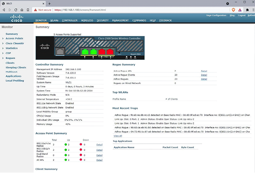
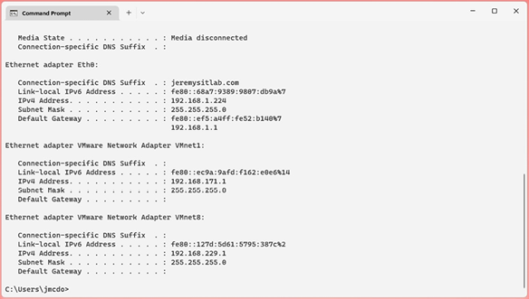
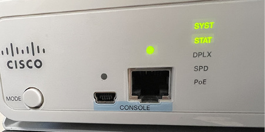
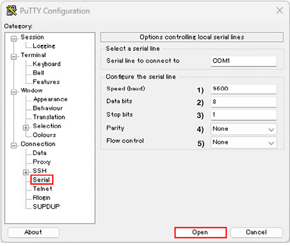
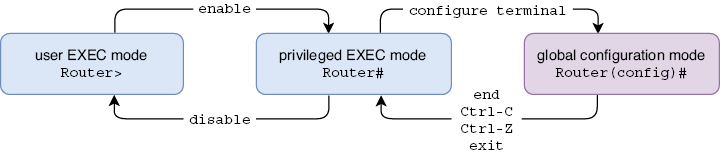

# Cisco IOS CLI

Este capítulo cubre:

- Las interfaces que se usan para configurar dispositivos de red.
- Cómo conectarse a la CLI de un dispositivo Cisco a través del puerto de consola.
- Cómo navegar entre los modos de la jerarquía de comandos de Cisco IOS.
- Cómo ver y guardar los archivos de configuración del dispositivo.
- Cómo proteger con contraseña un dispositivo Cisco IOS.

Este capítulo supone un cambio respecto a la teoría de redes del capítulo anterior: llega el momento de pasar a la práctica con routers y switches de Cisco. Entender la teoría de redes es esencial, pero las redes también son una habilidad que hay que practicar, y eso significa configurar dispositivos de red.

En la lista de temas del examen CCNA, encontraréis varios verbos distintos, como explicar X, describir Y e identificar Z, que indican que Cisco espera que tengáis una comprensión teórica de los conceptos citados y de su funcionamiento. Sin embargo, también hay muchos temas del examen que indican configurar X o configurar y verificar Y. En estos casos, además de comprender teóricamente los conceptos, debéis ser capaces de configurarlos en dispositivos de red de Cisco y verificar su funcionamiento.

Como introducción a los cambios de configuración en un dispositivo Cisco y a su guardado, en este capítulo veremos el tema del examen 4.3: Configurar y verificar el control de acceso al dispositivo mediante contraseñas locales. Sin embargo, este capítulo no está orientado específicamente a uno de los temas del examen CCNA, sino que sienta una base necesaria para todos los temas del examen que requieren configurar y verificar varios protocolos.

## 1. Shells: GUI y CLI

Una shell es un programa informático que permite a un usuario interactuar con el ordenador. Es la interfaz entre el ordenador y el usuario y recibe ese nombre porque es la capa exterior del sistema operativo. Para configurar un router o un switch de Cisco, usáis una shell para enviar comandos al dispositivo. En esta sección, veremos los dos tipos de shell que usaremos en este libro.

### 1.1. GUI y CLI

Hay dos tipos principales de shell: la interfaz gráfica de usuario (GUI, pronunciada “G-U-I” o “gooey”) y la interfaz de línea de comandos (CLI). Examinemos estos dos tipos.

#### 1.1.1. Interfaces gráficas

Una GUI permite a un usuario manipular el ordenador mediante una interfaz gráfica. Independientemente de vuestro nivel de experiencia o inexperiencia con los ordenadores, estoy seguro de que ya habéis usado una GUI antes. Si tenéis un PC con Windows, la GUI es la interfaz con la que interactuáis al abrir, cerrar y mover ventanas, o al abrir el menú Inicio para buscar un programa, etc. Ese es el shell de Windows. Si tenéis un smartphone, usáis una GUI para interactuar con el teléfono y sus aplicaciones.

Aunque la mayor parte del examen CCNA no se centra en las GUIs, se espera que conozcáis al menos una GUI para el examen: la interfaz gráfica del controlador inalámbrico de Cisco (WLC). Veremos las redes inalámbricas y cómo configurar un WLC mediante la GUI en la parte 4 del volumen 2 de este libro. La Figura 1 muestra una captura de pantalla de la GUI de un WLC de Cisco.

{text-align: justify}
/// figura
La interfaz gráfica de un controlador inalámbrico Cisco, accesible mediante un navegador web.
///

#### 1.1.2. Interfaces de línea de comandos

Una CLI es una interfaz basada en texto que permite controlar e interactuar con un dispositivo introduciendo comandos, que son líneas de texto. Un ejemplo famoso de CLI que quizá hayáis visto antes es el símbolo del sistema de Windows, que se muestra en la Figura 2. Aunque la gran mayoría de los usuarios usan la GUI de forma exclusiva o casi exclusiva, la CLI del símbolo del sistema ofrece otra forma de interactuar con un PC.

{text-align: justify}
/// figura
La CLI del símbolo del sistema de un PC con Windows, accesible desde la GUI del shell de Windows.
///

Para el examen CCNA, debéis estar familiarizados con la CLI de los routers y switches de Cisco que ejecutan Cisco IOS. Para quienes no tienen experiencia previa con una CLI (como yo cuando empecé a preparar el CCNA en 2018), esto puede parecer intimidante. Sin embargo, al final de este capítulo, espero que veáis que navegar por la CLI de Cisco IOS no es tan complicado.

!!!note "Nota"
    Durante los dos volúmenes de este libro, presentaremos diversos comandos de CLI para configurar los protocolos que debéis conocer para el examen CCNA. La práctica práctica con esos comandos, por ejemplo usando Cisco Packet Tracer, es esencial para prepararse para el examen CCNA.

### 1.2. Acceso a la CLI de un dispositivo Cisco

Para configurar dispositivos Cisco, primero tenéis que conectar vuestro ordenador al dispositivo para acceder a la CLI. Hay dos métodos principales para hacerlo:

- Conectar un PC o portátil al puerto de consola del dispositivo mediante un cable de consola.
- Conectarse al dispositivo a través de la red usando un protocolo como Telnet o Secure Shell (SSH).

Veremos Telnet y SSH en el capítulo 4 del volumen 2. Hasta entonces, nos centraremos en las conexiones mediante el puerto de consola del dispositivo. El puerto de consola es un puerto físico que permite conectar un ordenador directamente al dispositivo (en contraposición a conectarse a través de la infraestructura de la red). Para hacerlo, debéis estar físicamente cerca del dispositivo; un cable de consola suele tener solo unos pocos pies de longitud.

!!!note "Nota"
    Los puertos de consola no pueden utilizarse para comunicar datos a través de la red. Están dedicados a configurar el dispositivo mediante la CLI.

La Figura 3 muestra dos puertos de consola en un switch Cisco: USB Mini-B y RJ45. El tipo exacto de puertos de consola disponibles depende del modelo del dispositivo, pero USB Mini-B y RJ45 son comunes en muchos modelos de routers y switches Cisco. Podéis conectar a cualquiera de los dos puertos, pero no a ambos; solo se admite una conexión de consola a la vez.

{text-align: justify}
/// figura
Dos puertos de consola en un switch de Cisco: USB Mini-B (izquierda) y RJ45 (derecha).
///

Los cables de consola vienen en varios tipos con distintos conectores. El tipo que se usa depende de los puertos disponibles en el propio dispositivo y del PC que se conecta a él. Quizá la opción más sencilla sea utilizar un cable USB estándar para conectar vuestro PC al puerto de consola USB del dispositivo (aseguraos de que el cable tenga los conectores USB correctos para vuestro PC y para el dispositivo al que queréis conectaros).

Para conectar al puerto de consola RJ45, debéis usar un cable de rollover. Es un patrón distinto de los cables straight-through y crossover que vimos en el capítulo 3; los cables de rollover están conectados de la siguiente manera:

- Pin 1 a pin 8
- Pin 2 a pin 7
- Pin 3 a pin 6
- Pin 4 a pin 5
- Pin 5 a pin 4
- Pin 6 a pin 3
- Pin 7 a pin 2
- Pin 8 a pin 1

El cableado de un cable de rollover se ilustra en la Figura 4.

{text-align: justify}
/// figura
El cableado de un cable de rollover, usado para conectar un PC al puerto de consola RJ45 de un dispositivo de red. El pin 1 de un extremo se conecta al pin 8 del otro extremo, el pin 2 al 7, el pin 3 al 6, el pin 4 al 5, el pin 5 al 4, el pin 6 al 3, el pin 7 al 2 y el pin 8 al 1.
///

Después de conectar físicamente vuestro PC al puerto de consola del dispositivo, necesitáis usar un tipo de aplicación llamada emulador de terminal para acceder a la CLI. Un emulador de terminal es una aplicación de software que replica las funciones de un terminal informático: un antiguo dispositivo hardware formado por un monitor y un teclado que se usaba para introducir datos y recibir y mostrar datos de un ordenador. Un emulador de terminal popular y gratuito en Windows es PuTTY (www.putty.org), aunque hay muchas opciones disponibles para distintas plataformas.

Cuando usáis un emulador de terminal para conectar un PC al puerto de consola de un dispositivo, hay varios ajustes que debéis configurar. Estos son:

- Velocidad: la velocidad a la que se envían los datos.
- Bits de datos: el número de bits de información usados para cada carácter de texto enviado al dispositivo.
- Bits de parada: se envían después de cada carácter para permitir que el dispositivo receptor detecte el final del carácter.
- Paridad: un bit adicional que se envía con cada carácter para detectar errores.
- Control de flujo: proporciona soporte para situaciones en las que un dispositivo envía datos más rápido de lo que el receptor puede manejar.

El valor apropiado para cada ajuste depende del dispositivo que estéis configurando; para conocer los ajustes adecuados para un dispositivo concreto, tendréis que consultar la documentación del fabricante. La Figura 5 muestra cómo iniciar una conexión de consola a un dispositivo Cisco en PuTTY.

{text-align: justify}
/// figura
Cómo usar PuTTY para acceder a la CLI de un dispositivo Cisco mediante el puerto de consola. En la pestaña Serial, configurad estos ajustes y luego pulsad Open: (1) Speed (baud): 9600 bits por segundo, (2) Data bits: 8, (3) Stop bits: 1, (4) Parity: None, (5) Flow control: None.
///

!!!note "Nota"
    No os examinarán sobre cómo usar PuTTY u otro emulador de terminal para conectaros a un puerto de consola en el examen CCNA, pero incluyo esta información por si tenéis hardware físico con el que practicar. Para practicar en laboratorio de forma práctica para el CCNA, os recomiendo Cisco Packet Tracer, en el que simplemente podéis hacer clic sobre el icono de un dispositivo para acceder a la CLI.

## 2. Navegación por la CLI de Cisco IOS

Ahora sí que ya vamos a entrar en la práctica de la CLI de Cisco IOS, navegando entre diferentes modos y enviando comandos a un dispositivo Cisco. Quiero volver a enfatizar que las redes no son solo teoría, sino también una habilidad práctica. Será difícil asimilar esta información si no la ponéis en práctica vosotros mismos, por lo que os recomiendo encarecidamente que sigáis la explicación en Packet Tracer (o en la CLI de un router o switch Cisco real) e intentéis probar los distintos comandos y atajos que cubrimos.

Cuando accedéis por primera vez a la CLI de un dispositivo Cisco nuevo, se os ofrece la opción de configurar el dispositivo mediante el diálogo de configuración del sistema, como se muestra en el ejemplo siguiente:

```text
--- Diálogo de configuración del sistema ---
¿Deseáis entrar en el diálogo de configuración inicial? [sí/no]:
no
```

!!!note "Nota"
    En la salida de la CLI mostrada en este libro, el texto en negrita indica los comandos tecleados por el usuario. El texto normal indica la salida mostrada por el dispositivo.

El diálogo de configuración del sistema es un asistente paso a paso que permite hacer una configuración sencilla del dispositivo sin necesidad de conocer los comandos de la CLI de Cisco IOS. Esta función normalmente no se usa y no es algo que necesitéis conocer para el CCNA, así que os recomiendo omitirla escribiendo no y pulsando la tecla Enter (las opciones [sí/no] se muestran entre corchetes).

### 2.1. Los modos EXEC

Después de omitir el diálogo de configuración del sistema, se os muestra un indicador como el siguiente, donde podéis escribir comandos y pulsar Enter para enviarlos al dispositivo. El formato del indicador es el nombre del host (en este caso, Router, el nombre predeterminado de los routers Cisco) seguido de un signo mayor que. Esto indica que estáis en modo EXEC de usuario:

```text
Router>
```

!!!note "Nota"
    Todos los comandos que cubrimos en este capítulo se aplican tanto a routers como a switches de Cisco. Ambos ejecutan el mismo sistema operativo: Cisco IOS.

El modo EXEC de usuario es el menos privilegiado de la jerarquía de comandos de Cisco IOS; permite introducir algunos comandos básicos para ver información sobre la configuración y el estado del dispositivo. Sin embargo, no permite hacer nada intrusivo, como cambiar la configuración del dispositivo, reiniciarlo, etc. Para demostrar un comando sencillo que podéis usar en el modo EXEC de usuario, escribo show clock y pulso Enter. El router muestra la hora actual de su reloj:

```text
Router>show clock
*02:21:03.832 UTC Fri Feb 10 2023
```

!!!note "Nota"
    Hay una variedad de comandos show que iréis conociendo a lo largo de este libro. Aprender los comandos show disponibles y cómo interpretar su salida es una parte fundamental del estudio para el CCNA.

Comprobar la hora claramente no es intrusivo, por lo que el comando show clock está disponible en el modo EXEC de usuario. Sin embargo, un comando más intrusivo como reload, que reinicia el dispositivo, no funciona en el modo EXEC de usuario, como se muestra en el ejemplo siguiente. El router muestra un mensaje de error (un signo de porcentaje indica un mensaje de IOS):

```text
Router>reload
% Unknown command or computer name, or unable to find computer address
```

Para acceder a comandos más potentes, debéis entrar en el siguiente modo de la jerarquía de IOS: el modo EXEC privilegiado. Para acceder a él, usad el comando enable. Desde el modo EXEC privilegiado, el comando reload ya funciona:

```text
Router>enable
Router# reload
Proceed with reload? [confirm]
%SYS-5-RELOAD: Reload requested by console. Reload Reason: Reload Command.
```

!!!note "Nota"
    El signo mayor que (>) del indicador cambia a almohadilla (#) cuando estáis en modo EXEC privilegiado.

El modo EXEC privilegiado da acceso ilimitado a los comandos show disponibles y a muchos otros para controlar diversas funciones del dispositivo. Para volver al modo EXEC de usuario desde el modo EXEC privilegiado, podéis usar el comando disable. Sin embargo, disable casi no se usa porque no hay comandos en el modo EXEC de usuario que no podáis usar en el modo EXEC privilegiado; rara vez hay necesidad de volver al modo EXEC de usuario.

Aunque el modo EXEC privilegiado es más potente que el modo EXEC de usuario, ambos modos están limitados porque no permiten hacer cambios en la configuración del dispositivo. Los modos EXEC solo permiten ver el estado y la configuración del dispositivo, así como ejecutar comandos operativos para realizar acciones como reiniciar el dispositivo, guardar la configuración, mover y eliminar archivos, etc.

### 2.2. Modo de configuración global

Para hacer cambios en la configuración del dispositivo, debemos salir de los modos EXEC y pasar al siguiente modo de la jerarquía de IOS: el modo de configuración global. Para hacerlo, usad el comando configure terminal desde el modo EXEC privilegiado:

```text
Router#configure terminal
Enter configuration commands, one per line. End with CNTL/Z.
Router(config)#
```

Aunque solo hay dos modos EXEC en la CLI de Cisco (modo EXEC de usuario y modo EXEC privilegiado), existen varios modos de configuración que examinaremos a lo largo de este libro. En este capítulo, solo veremos el primero: el modo de configuración global. Desde el modo de configuración global, podéis configurar varias funciones como el nombre del dispositivo y las contraseñas. Desde este modo, también podéis acceder a los otros modos de configuración que veremos en capítulos posteriores de los dos volúmenes del libro.

Una configuración que podéis hacer desde el modo de configuración global es cambiar el nombre del dispositivo con el comando hostname, como se muestra en el ejemplo siguiente. Fijaos que al ejecutar el comando, el indicador cambia de Router a R1, lo que indica que el nombre del host ha cambiado. El comando tiene efecto de inmediato. Configurar un nombre único en cada dispositivo de la red es esencial para poder identificarlos con facilidad. Para este libro, usaremos identificadores numéricos sencillos (R1, R2, etc.). En una red empresarial real, a menudo se incluye otra información, como la ubicación del dispositivo, en el nombre del host (por ejemplo, Office1_R1):

```text
Router(config)#hostname R1
R1(config)#
```

!!!note "Nota"
    Si queréis deshacer un comando de configuración, podéis usar no delante del comando. Por ejemplo, después de hostname R1, no hostname R1 eliminaría el comando y devolvería el nombre del host del dispositivo a su valor predeterminado, Router.

Para volver del modo de configuración global al modo EXEC privilegiado, hay varias opciones. El comando end, el atajo de teclado Ctrl-C y el atajo Ctrl-Z devolverán al modo EXEC privilegiado desde el modo de configuración global o desde cualquier otro modo de configuración. El comando exit devolverá al modo EXEC privilegiado desde el modo de configuración global. Sin embargo, si estáis en otro modo de configuración, volveréis al modo de configuración global. La Figura 6 muestra cómo navegar entre el modo EXEC de usuario, el modo EXEC privilegiado y el modo de configuración global.

!!!note "Nota"
    Si usáis el atajo Ctrl-Z en mitad de la escritura de un comando, el dispositivo ejecutará el comando escrito antes de volver al modo EXEC privilegiado; es equivalente a pulsar Enter y luego emitir end. ¡Cuidado! Ctrl-C no hace esto; simplemente volverá al modo EXEC privilegiado.

{text-align: justify}
/// figura
Cómo navegar entre el modo EXEC de usuario, el modo EXEC privilegiado y el modo de configuración global en la jerarquía de comandos de Cisco IOS.
///

Los modos de configuración, como el modo de configuración global, os permiten configurar el dispositivo, pero los comandos del modo EXEC como show no funcionan. Sin embargo, el comando do permite usar comandos del modo EXEC desde un modo de configuración, así que no tenéis que volver al modo EXEC privilegiado. Esto puede acelerar vuestro flujo de trabajo cuando configuráis un dispositivo y también queréis usar comandos show para comprobar su estado. El ejemplo siguiente lo demuestra; el comando show clock genera un mensaje de error, pero el comando do show clock muestra la hora del reloj del dispositivo:

```text
R1(config)#show clock
              ^
% Invalid input detected at '^' marker.
R1(config)# do show clock
*03:06:22.892 UTC Fri Feb 10 2023
```

### 2.3. Atajos de teclado

Hay varios atajos de teclado que pueden ayudaros a navegar con mayor fluidez por la CLI e introducir comandos. Ya hemos visto dos en la sección anterior; Ctrl-C y Ctrl-Z pueden usarse para volver al modo EXEC privilegiado desde cualquier modo de configuración. Hay muchos más, y veremos algunos a continuación.

Cuando escribís comandos en la CLI, hay un cursor que indica dónde se insertará el siguiente carácter cuando lo escribáis. Por defecto, esto estará después del carácter anterior, como probablemente supondríais. También podéis mover el cursor, por ejemplo, para corregir un error en una palabra escrita antes. A continuación, tenéis algunos atajos de teclado que podéis usar para mover el cursor y editar el comando actual que estáis escribiendo:

- Flecha izquierda: mueve el cursor a la izquierda.
- Flecha derecha: mueve el cursor a la derecha.
- Retroceso: mueve el cursor a la izquierda y elimina el carácter anterior.
- Ctrl-A: mueve el cursor al principio del comando que estáis escribiendo.
- Ctrl-E: mueve el cursor al final del comando que estáis escribiendo.
- Ctrl-U: elimina todos los caracteres a la izquierda del cursor.

También podéis usar el teclado para ver los comandos ejecutados previamente, que Cisco IOS almacena en un búfer de memoria. Esto es útil si cometisteis un error en un comando anterior y queréis corregirlo sin escribir todo el comando de nuevo; podéis volver al comando anterior, corregir el error y ejecutar el comando otra vez. Podéis usar los siguientes atajos para desplazarnos por el búfer:

- Flecha arriba: comando anterior.
- Flecha abajo: comando siguiente.

### 2.4. Ayuda sensible al contexto

Tendréis que aprender muchos comandos distintos para prepararos para el CCNA, y esos comandos son solo una fracción de todos los comandos disponibles en Cisco IOS. Para el examen CCNA, es importante practicar y familiarizarse con los distintos comandos que veremos en este libro. Sin embargo, Cisco IOS tiene una función llamada ayuda sensible al contexto que puede ayudaros si habéis olvidado un comando.

#### 2.4.1. Visualización de los comandos disponibles

Un signo de interrogación (?) puede usarse para pedir ayuda en la CLI de Cisco IOS de varias formas:

- Para listar los comandos disponibles en el modo EXEC o de configuración actual.
- Para listar las palabras clave disponibles para un comando.
- Para listar las posibles completaciones de un comando o palabra clave parcialmente escrito.

En el primer caso, el signo de interrogación se usa para listar los comandos disponibles en el modo actual de la jerarquía de la CLI, junto con una breve descripción de cada uno. Fijaos que no tenéis que pulsar Enter; la lista de comandos aparece inmediatamente después de escribir el signo de interrogación. Los primeros comandos disponibles en el modo EXEC de usuario son los siguientes:

```text
R1>?
Exec commands:
  <1-99>           Session number to resume
  access-enable    Create a temporary Access-List entry
  access-profile   Apply user-profile to interface
  clear            Reset functions
  connect          Open a terminal connection
. . .
```

Pocos comandos de Cisco IOS son una sola palabra; la mayoría incluyen una o varias palabras clave, que son parámetros adicionales que se escriben después del comando inicial. El comando show que vimos antes es un ejemplo de esto; show por sí solo no es un comando válido, pero show clock sí lo es. En el segundo uso del signo de interrogación, podéis usarlo después de un comando para ver las palabras clave disponibles. El ejemplo siguiente lo demuestra:

```text
R1>show
% Type "show ?" for a list of subcommands
R1> show ?
  aaa             Show AAA values
  arp             ARP table
  auto            Show Automation Template
  call-home       Show command for call home
  capability      Capability Information
. . .
```

También podéis usar el signo de interrogación de esta forma después de una palabra clave para mostrar más palabras clave. Por ejemplo, show clock ? muestra la palabra clave detail, que puede usarse para ver más información sobre el reloj del dispositivo. Esto se muestra en el ejemplo siguiente:

```text
R1>show clock ?
  detail  Display detailed information
  |       Output modifiers
  <cr>    <cr>
```

Las otras dos opciones mostradas también merecen mención:

- El carácter pipe (|) puede usarse para filtrar la salida de un comando show. Más adelante en este capítulo os mostraré un ejemplo.
- <cr> significa carriage return, que se refiere a la tecla Enter. Esto significa que podéis pulsar simplemente Enter para ejecutar el comando. Aunque hay una palabra clave disponible (detail), show clock por sí solo es un comando válido.

El tercer caso de uso del signo de interrogación sirve para mostrar las posibles completaciones de un comando o palabra clave parcialmente escrito. En este caso, el signo de interrogación debe escribirse inmediatamente después del comando parcialmente escrito, sin un espacio. Por ejemplo, escribir e? en el modo EXEC de usuario mostrará varios comandos que empiezan por e. Escribir en?, por el contrario, mostrará que enable es el único comando que empieza por en, como se ve en el ejemplo siguiente:

```text
R1>e?
enable  ethernet  exit
R1> en?
enable
```

#### 2.4.2. Autocompletado de comandos

Escribir varios comandos puede resultar tedioso cuando configuráis un dispositivo manualmente. Afortunadamente, Cisco IOS no os exige escribir comandos completos; solo requiere que escribáis suficientes caracteres para que solo exista un posible comando que empiece por esos caracteres.

Si escribís suficientes caracteres para que solo exista un posible comando que empiece por ellos y luego pulsáis la tecla Tab, IOS completará automáticamente el comando por vosotros. Por ejemplo, escribir en y pulsar Tab completará automáticamente el comando enable. Luego podéis pulsar Enter para ejecutarlo. Sin embargo, si no escribís suficientes caracteres y hay varios comandos que comienzan por los caracteres que habéis escrito, el comando no funcionará; simplemente volverá a imprimir esos caracteres en una línea nueva. Esto se muestra en el ejemplo siguiente. Fijaos que <Tab> indica dónde he pulsado la tecla Tab:

```text
R1>e<Tab>
R1> en<Tab>
R1> enable
R1#
```

Pero aún hay más: ni siquiera tenéis que usar Tab para completar el comando. Usando el ejemplo anterior del comando enable, si escribís e y luego pulsáis Enter para ejecutarlo, el terminal mostrará un mensaje de error indicando que e es un comando ambiguo. Esto ocurre porque hay varios comandos que empiezan por e. Sin embargo, si escribís en y pulsáis Enter, el comando se acepta como enable y se accede al modo EXEC privilegiado:

```text

R1>e
% Ambiguous command:  "e"
R1> en
R1#
```

!!!note "Nota"
    La autocompletación con Tab y la ejecución de comandos parciales también se aplican a las palabras clave de un comando. Por ejemplo, conf t puede usarse en lugar de configure terminal para entrar en el modo de configuración global.

La Tabla 1 resume estas funciones de ayuda sensible al contexto. Dedica un poco de tiempo a experimentar con ellas en la CLI; cuando te acostumbréis, probablemente las usaréis bastante a medida que practiquéis la configuración y verificación de las distintas funciones de IOS que debéis conocer para el CCNA.

| Comando | Descripción |
| --- | --- |
| ? | Lista los comandos disponibles en el modo actual |
| command ? | Lista las palabras clave disponibles para ese comando |
| partial-command ? | Lista los posibles comandos que comienzan por los caracteres escritos |
| partial-command<Tab> | Completa automáticamente el comando si solo existe una opción que empiece por los caracteres escritos |
| partial-command<Enter> | Ejecuta el comando si solo existe una opción que empiece por los caracteres escritos |

## 3. Archivos de configuración de IOS

Los dispositivos Cisco IOS usan dos archivos de texto distintos para almacenar la configuración del dispositivo: running-config y startup-config. Los dos archivos se almacenan en memoria hardware distinta y cumplen propósitos diferentes. Podéis ver cada archivo de configuración con los comandos show running-config y show startup-config.

!!!note "Nota"
    La salida de show running-config y show startup-config puede ser bastante larga. Cuando la salida de un comando supera cierta longitud, solo se muestra una salida parcial con un indicador que dice --More-- en la parte inferior. Usad la tecla Enter para recorrer la salida línea a línea o la barra espaciadora para avanzar una pantalla a la vez.

Las configuraciones del archivo running-config determinan el funcionamiento actual del dispositivo. Cuando introducís un comando de configuración en la CLI, estáis modificando el archivo running-config. Los cambios tienen efecto de inmediato; como se vio antes, después de ejecutar el comando hostname, el nombre del dispositivo cambia de inmediato.

El archivo de configuración running-config se almacena en la memoria de acceso aleatorio (RAM). Es importante tener en cuenta que el contenido de la RAM se pierde cuando el dispositivo se apaga o se reinicia; por lo tanto, los cambios en running-config se pierden en cualquiera de estos eventos. Para guardar los cambios de configuración para que sigan existiendo aunque el dispositivo se apague o se reinicie, se usa el archivo startup-config.

Las configuraciones de startup-config no determinan el funcionamiento actual del dispositivo. Más bien, startup-config es el archivo de configuración que carga el dispositivo cuando arranca, por ejemplo, al encenderse o reiniciarse. El contenido del archivo startup-config se copia al archivo running-config de la RAM cuando el dispositivo arranca.

El archivo startup-config se almacena en un tipo especial de RAM llamado RAM no volátil (NVRAM). El contenido de la NVRAM se conserva incluso cuando el dispositivo se apaga o se reinicia, así que para guardar los cambios realizados en running-config, su contenido debe copiarse a startup-config. De lo contrario, el dispositivo tendrá una configuración predeterminada de fábrica cada vez que se arranque.

!!!note "Nota"
    Factory-default se refiere al estado original del dispositivo tal como sale de fábrica, antes de realizar cualquier cambio de configuración.

Hay varios comandos distintos (introducidos en el modo EXEC privilegiado) que pueden usarse para copiar el contenido del archivo running-config al archivo startup-config. El efecto de cada uno de estos comandos es el mismo, así que da igual cuál uséis:

- write
- write memory
- copy running-config startup-config

!!!note "Nota"
    Un dispositivo nuevo que se ha arrancado por primera vez ni siquiera tendrá un archivo startup-config hasta que uséis uno de estos comandos. Si no hay un archivo startup-config, el dispositivo usa la configuración predeterminada de fábrica.

Si queréis devolver un dispositivo a su configuración predeterminada de fábrica, podéis borrar startup-config y luego reiniciar el dispositivo con el comando reload. Al igual que al guardar la configuración, hay varios comandos que podéis usar para borrar startup-config:

- write erase
- erase nvram:
- erase startup-config

## 4. Protección con contraseña del modo EXEC privilegiado

El modo EXEC privilegiado no solo permite a un usuario ejecutar cualquiera de los comandos show disponibles para recopilar información sobre la configuración y el estado del dispositivo, sino que también le permite acceder al modo de configuración global y hacer cambios de configuración en el dispositivo. Por eso, siempre es buena idea configurar una contraseña para impedir que usuarios no autorizados accedan al modo EXEC privilegiado. En esta sección, veremos la enable password y su versión más segura, la enable secret.

### 4.1. Configuración de la enable password

La enable password es una contraseña que debéis introducir para acceder al modo EXEC privilegiado. También es el nombre del comando usado para configurar la contraseña; se configura con el comando enable password en el modo de configuración global. Después de configurar la enable password, cada vez que un usuario use el comando enable en el modo EXEC de usuario, deberá introducir esa contraseña para acceder al modo EXEC privilegiado.

!!!note "Nota"
    La enable password distingue mayúsculas y minúsculas: cisco y Cisco son dos contraseñas distintas.

En el ejemplo siguiente, configuro una enable password de ccna, uso exit para volver al modo EXEC privilegiado y uso disable para volver al modo EXEC de usuario. Cuando luego uso enable para volver al modo EXEC privilegiado, tengo que introducir la enable password configurada de ccna para obtener acceso. Fijaos que, por motivos de seguridad, las contraseñas no se muestran mientras las escribís en Cisco IOS:

```text
R1(config)#enable password ccna
R1(config)# exit
R1# disable
R1> enable
Password:
R1#
```

Hay un problema importante con la enable password: se almacena en texto claro, es decir, la contraseña exacta (ccna en este caso) se guarda en el archivo de configuración tal cual. Cualquiera que pueda ver running-config puede leer la contraseña, y esto supone un problema de seguridad importante. El siguiente ejemplo lo demuestra: uso el comando show running-config | include enable para ver la contraseña enable en running-config. El comando se muestra exactamente como lo configuré, con la contraseña en texto claro:

```text
R1#show running-config | include enable
enable password ccna
```

!!!note "Nota"
    Tras un comando show, un pipe (|) seguido de la palabra clave include permite filtrar la salida para mostrar solamente las líneas que incluyen los caracteres especificados (enable, en este caso).

Para mejorar la seguridad de la enable password, podéis usar el comando service password-encryption en el modo de configuración global. Esto cifra todas las contraseñas configuradas actualmente en el dispositivo, así como las que configuremos en el futuro. El ejemplo siguiente lo demuestra: después de emitir el comando y volver a ver running-config, la contraseña original ya no aparece. En su lugar, la contraseña se almacena como texto cifrado:

```text
R1(config)#service password-encryption
R1(config)# do show running-config | include enable
enable password 7 0307580507
```

!!!note "Nota"
    El 7 antes de la cadena cifrada 0307580507 indica el tipo de cifrado.

El comando service password-encryption cifra las contraseñas usando un cifrado de tipo 7. Es una forma de cifrado muy débil que es fácil de revertir con herramientas gratuitas disponibles en Internet (una búsqueda en Google de “cisco type 7 decrypt” dará muchos resultados). Aunque sí evita que alguien pueda mirar por encima de vuestro hombro para leer la contraseña al mirar running-config, no ofrece una protección suficiente. Para mejorar la seguridad, debéis usar enable secret.

!!!note "Nota"
    Si usáis el comando no service password-encryption para deshacer el cifrado, las contraseñas cifradas actualmente no se descifrarán. Sin embargo, las contraseñas futuras no se cifrarán.

La enable password es un ejemplo de función heredada: algo que ha sido reemplazado por una función más nueva (la enable secret) pero que sigue siendo compatible con Cisco IOS. Las diferencias entre la enable password y la enable secret son un posible tema de examen, pero al configurar dispositivos de red debéis usar siempre enable secret.

### 4.2. Configuración de la enable secret

La enable secret es una contraseña más segura que puede configurarse para proteger el acceso al modo EXEC privilegiado. Almacena la contraseña como hash en lugar de como texto cifrado. El hashing puede entenderse como un cifrado unidireccional; no se puede revertir. La enable secret puede configurarse con el comando enable secret en el modo de configuración global. En el ejemplo siguiente, configuro una enable secret y la veo en running-config:

```text
R1(config)#enable secret cisco
R1(config)# do show running-config | include enable
enable secret 9 $9$emuJQV5sVZCY8v$INbrp9XrtfWHieMubzYt7N640m4KXDIqKg/a6SHY9lU
enable password 7 0307580507
```

!!!note "Nota"
    Fijaos que la enable password sigue apareciendo en la configuración. Si se configuran tanto la enable password como la enable secret, solo se podrá usar la enable secret. El comando enable password sigue en la configuración, pero no puede usarse para acceder al modo EXEC privilegiado.

El comando enable secret genera un hash de la contraseña especificada usando el algoritmo de hashing predeterminado del dispositivo. Hay varios algoritmos de hashing que pueden usarse para generar el hash y la disponibilidad de estos algoritmos varía según la versión de IOS del dispositivo. En la plataforma que estoy usando para esta demostración, el tipo de algoritmo es scrypt (pronunciado “S-crypt”), también conocido como tipo 9 (como indica el 9 antes del hash en la salida del ejemplo anterior). En muchos dispositivos antiguos, el algoritmo predeterminado es Message Digest 5 (MD5), también conocido como tipo 5. El tipo 5 no es tan seguro como el tipo 9, así que el tipo 9 debe usarse siempre que sea posible. En el capítulo 11 del volumen 2, veremos los distintos algoritmos de hashing soportados por Cisco IOS y cómo configurar secretos usando algoritmos específicos.

## 5. Resumen

- Una shell es un programa informático que permite a un usuario interactuar con el ordenador. Una interfaz gráfica de usuario (GUI) es una shell con una interfaz gráfica, y una interfaz de línea de comandos (CLI) es una shell con una interfaz basada en texto.
- Para el examen CCNA, debéis ser capaces de usar la CLI de Cisco IOS para configurar los protocolos y funciones que aparecen en la lista de temas del examen.
- La CLI de un dispositivo de red puede accederse conectando un PC al puerto de consola del dispositivo mediante un cable de consola (rollover) o conectándose a través de la infraestructura de la red usando Telnet o Secure Shell (SSH).
- Después de conectar físicamente un PC al puerto de consola del dispositivo, es necesario un emulador de terminal (como PuTTY) para acceder a la CLI.
- Para dar comandos a un dispositivo de red, escribís los comandos en la CLI y pulsáis Enter.
- Tras conectaros a la CLI de un dispositivo, estaréis en el modo EXEC de usuario, que solo permite ver información básica sobre el dispositivo, pero no realizar nada intrusivo. El formato del indicador es hostname>.
- Para acceder a comandos más potentes, usad el comando enable para entrar en el modo EXEC privilegiado, que da acceso ilimitado a los comandos EXEC. Por ejemplo, podéis ver información sobre el dispositivo, reiniciarlo, guardar la configuración, mover y eliminar archivos, etc. El formato del indicador es hostname#.
- Usad el comando disable para volver al modo EXEC de usuario desde el modo EXEC privilegiado.
- Usad el comando reload en el modo EXEC privilegiado para reiniciar el dispositivo.
- Para hacer cambios de configuración en el dispositivo, usad el comando configure terminal en el modo EXEC privilegiado para acceder al modo de configuración global. El indicador es hostname(config)#.
- El modo de configuración global permite hacer cambios de configuración en el dispositivo. También permite acceder a otros modos de configuración para funciones específicas.
- Para cambiar el nombre del host del dispositivo, usad el comando hostname en el modo de configuración global.
- Para deshacer un comando, usad no delante del comando. Por ejemplo, no hostname R1.
- Usad el comando end, el comando exit o los atajos Ctrl-C/Ctrl-Z para volver al modo EXEC privilegiado desde el modo de configuración global.
- Cuando estáis en un modo de configuración, podéis usar do delante de un comando para ejecutar comandos EXEC.
- Los atajos de teclado pueden usarse para mover el cursor y recorrer los comandos ejecutados previamente.
- La ayuda sensible al contexto puede usarse para obtener orientación dentro de la CLI. Puede listar los comandos disponibles y las posibles completaciones para palabras parcialmente escritas.
- Los dispositivos Cisco IOS usan dos archivos de configuración: running-config y startup-config.
- El archivo running-config se almacena en RAM y determina el funcionamiento actual del dispositivo. Los comandos de configuración cambian running-config y tienen efecto inmediato. El archivo running-config se pierde cuando el dispositivo se apaga o se reinicia.
- El archivo startup-config se almacena en RAM no volátil (NVRAM) y no determina el funcionamiento actual del dispositivo. El contenido de startup-config se copia a running-config al arrancar el dispositivo.
- Para guardar el archivo running-config en startup-config, usad write, write memory o copy running-config startup-config en el modo EXEC privilegiado.
- Para devolver el dispositivo a la configuración predeterminada de fábrica, borrad startup-config con write erase, erase nvram: o erase startup-config y reiniciad el dispositivo con reload.
- El modo EXEC privilegiado puede protegerse con una enable password o con una enable secret. Si se configuran tanto la enable password como la enable secret, solo la enable secret puede usarse para acceder al modo EXEC privilegiado.
- La enable password puede configurarse con el comando enable password en el modo de configuración global. Se guarda en la configuración en texto claro por defecto, pero puede cifrarse con el comando service password-encryption (tipo 7).
- La enable password sigue existiendo en Cisco IOS como función heredada, pero en los dispositivos modernos se debe usar enable secret.
- La enable secret puede configurarse con el comando enable secret en el modo de configuración global. Se almacena en la configuración como hash, usando varios algoritmos de hashing. Los algoritmos de hashing disponibles varían según la versión de IOS.
- Message Digest 5 (MD5) es un cifrado de tipo 5, y scrypt es de tipo 9. scrypt es más seguro y debe usarse en lugar de MD5 si el dispositivo lo soporta.

