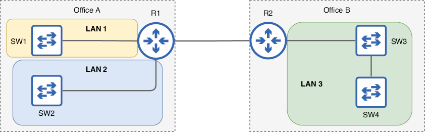
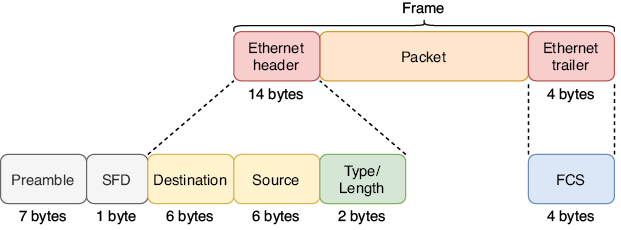
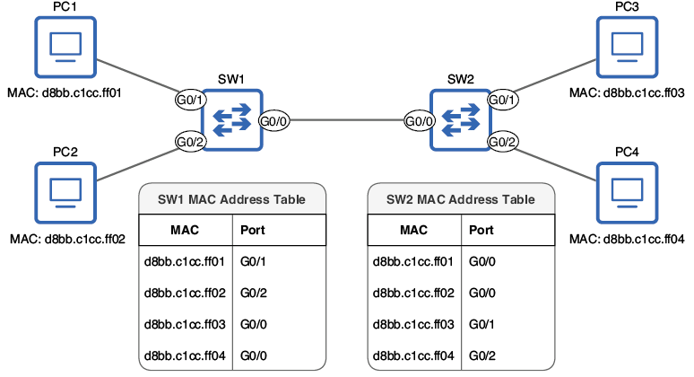
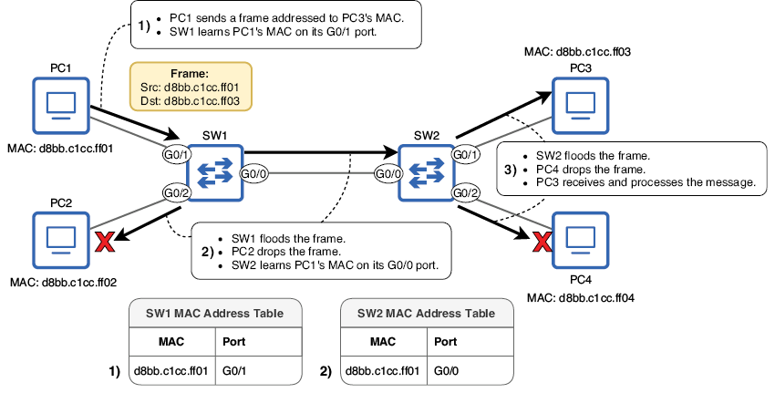
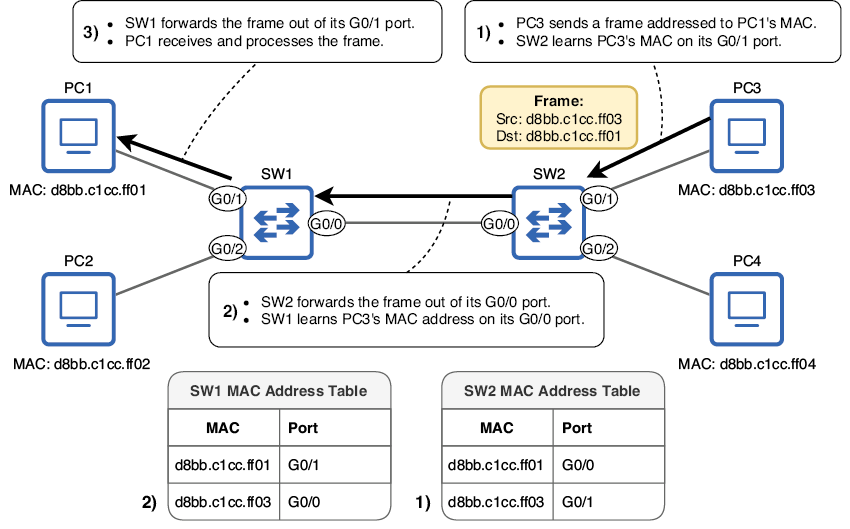
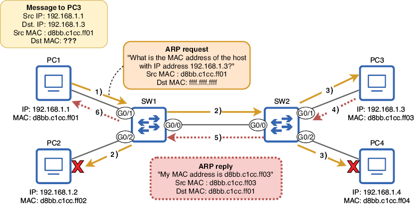

# Conmutación Ethernet

Este capítulo cubre:

- La definición de una LAN.
- El contenido de la cabecera y del trailer de Ethernet.
- Cómo aprenden los switches las direcciones MAC de los dispositivos de la red.
- Cómo reenviarán los switches las tramas a su destino adecuado.
- Cómo usan los hosts de red ARP para conocer la dirección MAC de otros hosts.
- La utilidad ping.

En este capítulo, veremos la conmutación Ethernet en LAN, que es el proceso que usan los switches para reenviar tramas a sus destinos correctos dentro de una LAN. Una trama es un PDU de Capa 2, que incluye la cabecera, el trailer y la carga útil de la Capa 2; ya tratamos los PDU en el capítulo 4. Cuando un host de red envía una trama por uno de sus puertos, es tarea del switch asegurarse de que la trama llegue a su destino correcto.

Este capítulo cubre material del dominio 1.0 de los temas del examen CCNA: Fundamentos de red. En concreto, veremos los siguientes temas:

- 1.13 Describir conceptos de conmutación
  - 1.13a Aprendizaje y envejecimiento de MAC
  - 1.13b Conmutación de tramas
  - 1.13c Inundación de tramas
  - 1.13d Tabla de direcciones MAC

A menudo se dice que los switches son dispositivos de Capa 2 o que operan en la Capa 2. La razón es que usan la información de la cabecera de la Capa 2 (la cabecera Ethernet) para tomar decisiones de reenvío. Esto contrasta con los routers, que usan la información de la cabecera de la Capa 3 (la cabecera IP) para tomar decisiones de reenvío. Veremos cómo reenvían los routers el tráfico de red entre LANs en la parte 2 de este libro, pero por ahora, nos centraremos en cómo reenvían los switches el tráfico dentro de una LAN.

## 1. Redes de área local

En el capítulo 2, definí una red de área local (LAN) como un grupo de dispositivos interconectados en un área limitada, como una oficina, y afirmé que la función de un switch es conectar dispositivos dentro de una LAN. La definición exacta de una LAN puede variar según el contexto, pero, para este tema, la forma en que están conectados los dispositivos es más importante que la distancia física real entre ellos. La Figura 1 demuestra este concepto.

{text-align: justify}
/// figura
Dos oficinas con dos switches en cada una. En la Oficina A, cada switch es una LAN separada porque los switches están conectados a través de un router. En la Oficina B, ambos switches están en la misma LAN porque están conectados directamente entre sí.
///

Hay dos oficinas en el diagrama, así que podríais decir que hay dos LANs, lo cual no sería incorrecto si definimos una LAN solo por la ubicación física. Sin embargo, en la Oficina A, los dos switches no están conectados directamente entre sí; cada uno está conectado a un puerto distinto de R1, y la función de un router es proporcionar conectividad entre LANs. Por tanto, cada switch de la Oficina A puede considerarse su propia LAN. Para que los hosts finales conectados a SW1 puedan comunicarse con los hosts finales conectados a SW2, sus mensajes deben pasar por R1 porque separa las dos LANs.

En la Oficina B, sin embargo, SW3 y SW4 están conectados directamente entre sí. Los hosts finales conectados a un switch pueden comunicarse con los hosts finales conectados al otro switch sin que los mensajes tengan que pasar por un router. SW3, SW4 y todos los hosts finales conectados a ellos forman una sola LAN.

Otro nombre para una LAN es dominio de Capa 2: una parte de una red donde se conmuta tráfico de tramas y los hosts conectados al switch o switches pueden comunicarse entre sí sin usar un router. Manteneos esta definición en mente durante todo este capítulo; examinaremos cómo reenvían los switches las tramas dentro de un dominio de Capa 2.

## 2. La cabecera y el trailer de Ethernet

Los switches toman decisiones de reenvío usando la información de la cabecera Ethernet, así que para entender la conmutación, es importante comprender el contenido de esa cabecera (y del trailer). La Figura 2 muestra la estructura de una trama Ethernet. Fijaos que el Preamble y el Start Frame Delimiter (SFD) aparecen en el diagrama, pero no se consideran parte de una trama Ethernet. Lo veremos enseguida.

{text-align: justify}
/// figura
El contenido de la cabecera y del trailer de Ethernet. Se dividen en varios campos, cada uno con una función distinta. Los campos de la cabecera son Destination, Source y Type/Length. El trailer consta de un único campo: Frame Check Sequence (FCS). Aunque no se consideran parte de la trama Ethernet, el Preamble y el SFD se envían con cada trama.
///

### 2.1. Preamble y SFD

El Preamble y el SFD se envían con cada trama Ethernet para permitir que el dispositivo receptor sincronice su reloj y se prepare para recibir la trama entrante. Este reloj no tiene nada que ver con la fecha y la hora, sino con cómo interpreta el dispositivo receptor las señales eléctricas entrantes: necesita determinar la longitud exacta de 1 bit.

El dispositivo que envía una trama Ethernet facilita esto enviando el Preamble y el SFD. El Preamble tiene 7 bytes (56 bits; recordad que 1 byte son 8 bits) y es simplemente una serie de 1s y 0s alternados, como este: 10101010. Luego, el SFD tiene 1 byte y señala que el Preamble ha terminado y que la trama va a comenzar. El patrón de bits del SFD es 10101011.

La razón por la que el Preamble y el SFD no se consideran parte de la trama Ethernet, aunque se envían con cada trama, es que son una función exclusiva de la Capa 1, la Capa física. No contienen información que influya en la decisión que toma el dispositivo receptor sobre la trama. Como se mencionó en capítulos anteriores, Ethernet incluye especificaciones tanto en la Capa 1 como en la Capa 2, pero los aspectos de la Capa 1 de Ethernet no se consideran parte de una trama, que es un concepto de Capa 2.

### 2.2. Destination y Source

Los campos Destination y Source son probablemente los más importantes de la cabecera y el trailer Ethernet; el campo Destination es la dirección MAC de destino de la trama, y el campo Source es la dirección MAC de origen de la trama.

!!!note "Nota"
    Una dirección de control de acceso al medio (MAC) es un tipo de dirección utilizada por protocolos de Capa 2 como Ethernet y Wi‑Fi. Las direcciones MAC tienen 6 bytes (48 bits) y suelen escribirse como una serie de 12 caracteres hexadecimales. Las asigna el fabricante del dispositivo y deben ser globalmente únicas.

La Capa 2 proporciona entrega de salto a salto de mensajes, y las direcciones MAC lo permiten. En la Capa 3, el mensaje se direcciona a la dirección IP del host final de destino, pero en la Capa 2 se direcciona a la dirección MAC del siguiente salto. Dentro de una LAN, la tarea del switch es mirar la dirección MAC de destino de la trama y reenviarla al destino adecuado. El campo de dirección MAC de origen también es importante porque ayuda al switch a aprender qué puerto está conectado a cada host (más sobre esto enseguida).

Como indica la Figura 2, cada uno de estos campos tiene 6 bytes (48 bits), porque 6 bytes es la longitud de una dirección MAC. Sin embargo, cuando representamos direcciones MAC, normalmente no las escribimos en binario; una cadena larga de 1s y 0s no es muy legible ni fácil de recordar. En su lugar, escribimos las direcciones MAC en hexadecimal.

#### 2.2.1. El sistema numérico hexadecimal

El sistema numérico que normalmente usamos en nuestra vida diaria es el sistema decimal, que usa 10 dígitos para representar todos los valores: 0, 1, 2, 3, 4, 5, 6, 7, 8 y 9. El hexadecimal es un sistema numérico que usa 16 dígitos; usa los mismos 10 dígitos del sistema decimal y toma 6 letras del alfabeto: A, B, C, D, E y F.

Como hay más dígitos disponibles, el hexadecimal puede expresar valores grandes con menos caracteres. En decimal, para expresar el valor que sigue al 9, tenemos que añadir otro carácter: se convierte en 10, un 1 y un 0. El hexadecimal puede expresar ese mismo valor con un solo carácter: A. La eficiencia del hexadecimal frente al decimal es más significativa a medida que los valores aumentan. La Tabla 1 enumera algunos números decimales y sus equivalentes hexadecimales.

| Decimal | Hexadecimal | Decimal | Hexadecimal | Decimal | Hexadecimal | Decimal | Hexadecimal |
| --- | --- | --- | --- | --- | --- | --- | --- |
| 0 | 0 | 8 | 8 | 16 | 10 | 24 | 18 |
| 1 | 1 | 9 | 9 | 17 | 11 | 25 | 19 |
| 2 | 2 | 10 | A | 18 | 12 | 26 | 1A |
| 3 | 3 | 11 | B | 19 | 13 | 27 | 1B |
| 4 | 4 | 12 | C | 20 | 14 | 28 | 1C |
| 5 | 5 | 13 | D | 21 | 15 | 29 | 1D |
| 6 | 6 | 14 | E | 22 | 16 | 30 | 1E |
| 7 | 7 | 15 | F | 23 | 17 | 31 | 1F |

!!!note "Nota"
    Podéis usar un prefijo para indicar si un número es decimal o hexadecimal: 0d para decimal y 0x para hexadecimal. Esto puede ser útil en redes porque usamos varios sistemas: binario, decimal y hexadecimal. Diez en decimal es 10, pero 10 en hexadecimal equivale a 16 en decimal. Para diferenciarlos claramente, podéis escribir 0d10 o 0x10.

En la parte 5 de este libro (IPv6), practicaremos la conversión entre decimal, hexadecimal y binario. Por ahora, no es necesario; basta con entender que las direcciones MAC suelen escribirse en hexadecimal.

#### 2.2.2. Características de las direcciones MAC

Ya hemos visto dos características de las direcciones MAC: tienen 6 bytes de longitud y normalmente se escriben en hexadecimal. Al escribirlas en hexadecimal, podemos expresar la dirección con menos caracteres; las direcciones MAC se escriben como 12 caracteres hexadecimales en lugar de 48 bits (1s y 0s). Los detalles sobre la notación de esos 12 caracteres pueden variar. A continuación, tenéis una sola dirección MAC escrita con tres convenciones de notación distintas. Por supuesto, como es un libro del CCNA, seguiré la convención de Cisco para escribir direcciones MAC, pero merece la pena saber que se pueden escribir de otras formas. Para compararlas, también he incluido la dirección escrita en binario; estoy seguro de que estaréis de acuerdo en que las representaciones hexadecimales son más fáciles de leer:

- 0cf5.a452.b101 (usado por Cisco IOS)
- 0C-F5-A4-52-B1-01 (usado por Windows)
- 0c:f5:a4:52:b1:01 (usado por macOS)
- 000011001111010110100100010100101011000100000001 (binario)

A diferencia de las direcciones IP (que trataremos en el capítulo 7), las direcciones MAC no las asigna el administrador o ingeniero de red que configura el dispositivo. En su lugar, cada puerto de un dispositivo de red tiene una dirección MAC asignada por el fabricante. Por esta razón, otro nombre para una dirección MAC es burned-in address (BIA): está "grabada" en el puerto físico. Una dirección MAC es globalmente única: no debería compartirse con ningún otro puerto de ningún otro dispositivo del mundo.

!!!note "Nota"
    Es posible sobrescribir una dirección MAC asignada por el fabricante configurándola manualmente, pero es extremadamente raro hacerlo.

Para que las direcciones MAC sigan siendo globalmente únicas, la primera mitad de cada dirección MAC (los primeros 3 bytes) es un identificador único de la organización (OUI) asignado al fabricante por la IEEE. Luego, el fabricante puede usar la segunda mitad para asignar direcciones MAC únicas a cada dispositivo que fabrica. Por ejemplo, las direcciones MAC de los primeros tres puertos del switch Cisco de mi red doméstica son:

- 0cf5.a452.b101
- 0cf5.a452.b102
- 0cf5.a452.b103

0cf5.a4 es el OUI de Cisco (de hecho, Cisco tiene varios OUI), y la segunda mitad es un identificador único para cada puerto del switch. Como probablemente habréis observado, esas tres direcciones MAC son bastante parecidas: solo difiere el último dígito. Esto se debe a que las direcciones MAC en el mismo dispositivo suelen asignarse de forma secuencial.

Resumamos las direcciones MAC antes de seguir adelante:

- Las direcciones MAC son direcciones de 6 bytes (48 bits) asignadas a los puertos por el fabricante del dispositivo. Otro nombre para una dirección MAC es burned-in address (BIA).
- Las direcciones MAC son globalmente únicas.
- Los primeros 3 bytes son un identificador único de la organización (OUI), asignado al fabricante por la IEEE.
- Los últimos 3 bytes son exclusivos del propio puerto.
- Las direcciones MAC se escriben como 12 caracteres hexadecimales.

### 2.3. Type/Length

El campo Type/Length es un campo de 2 bytes que puede usarse bien para indicar el tipo del paquete encapsulado (por ejemplo, un paquete IPv4 o IPv6) o para indicar la longitud del paquete encapsulado (en bytes). Hay razones históricas por las que este campo puede usarse para dos propósitos, pero ambos usos forman parte oficialmente del estándar Ethernet. En la actualidad, en casi todos los casos, este campo se usa para indicar el tipo del paquete encapsulado: en lugar de indicar la longitud, el final de la trama se indica mediante una señal especial después de la trama.

!!!note "Nota"
    El estándar original IEEE 802.3 usaba el campo Type/Length exclusivamente para indicar la longitud del paquete encapsulado, y se usaba una cabecera adicional para indicar el tipo de protocolo encapsulado: la cabecera Logical Link Control (LLC), a veces con una extensión adicional de Subnetwork Access Protocol (SNAP). Sin embargo, esto queda fuera del alcance del examen CCNA.

Un valor de 1500 (decimal) o menos en este campo significa que indica la longitud del paquete encapsulado en bytes. Por ejemplo, si el valor es 1500, significa que el paquete encapsulado tiene 1500 bytes de longitud.

Un valor de 1536 o superior en este campo indica el tipo del paquete encapsulado, que normalmente es IPv4 o IPv6. Cuando se usa para indicar el tipo del paquete encapsulado, este campo se llama EtherType. Para referencia, aquí tenéis los valores de este campo para IPv4 e IPv6, que son temas importantes en el examen CCNA (normalmente se usa la notación hexadecimal; incluyo los números decimales para compararlos):

- IPv4: 0x0800 (0d2048)
- IPv6: 0x86DD (0d34525)

!!!note "Nota"
    Los valores entre 1500 y 1536 no deben usarse en este campo.

### 2.4. Frame Check Sequence

La Frame Check Sequence (FCS) es el único campo del trailer Ethernet. Tiene 4 bytes de longitud y se usa para detectar datos corruptos en la trama. Antes de que un dispositivo envíe una trama, usa un algoritmo para calcular una suma de comprobación, un bloque pequeño de datos que se añade al final de la trama como campo FCS.

Luego, cuando el host de destino de la trama recibe la trama, calcula su propia suma de comprobación para la trama (con el mismo algoritmo) y la compara con la calculada por el emisor. Si las dos sumas coinciden, el receptor puede asumir con seguridad que los datos no se han corrompido en tránsito. Sin embargo, si las sumas calculadas por el emisor y el receptor son distintas, el receptor descartará la trama: los datos se han corrompido en tránsito (quizá por interferencias electromagnéticas).

FCS es el nombre del campo, pero el nombre de este tipo de suma de comprobación es cyclic redundancy check (CRC). El término cyclic se refiere al tipo de algoritmo usado para calcular la suma de comprobación. Redundancy significa que el campo es redundante: amplía el tamaño del mensaje pero no añade información adicional. Check es autoexplicativo: se usa para comprobar si la trama viajó del origen al destino sin que los datos se corrompieran.

## 3. Conmutación de tramas

Ahora que ya hemos visto la información de la cabecera y el trailer Ethernet, veamos cómo usan los switches los campos Source y Destination para construir una tabla de direcciones MAC y reenviar tramas al destino o destinos adecuados dentro de una LAN.

### 3.1. Aprendizaje de direcciones MAC

Cuando un switch tiene que tomar una decisión sobre cómo reenviar una trama, busca la dirección MAC de destino de la trama en su tabla de direcciones MAC, que es una lista de las direcciones MAC de la LAN y del puerto al que está conectada cada una. Examinaremos el proceso de reenvío de tramas más adelante, pero primero, ¿cómo construye un switch su tabla de direcciones MAC?

!!!note "Nota"
    Otro nombre para la tabla de direcciones MAC es tabla CAM, en referencia al tipo de memoria en la que se almacena la tabla (content addressable memory).

Este es el papel del campo Source de la cabecera Ethernet. Cuando un switch recibe una trama en uno de sus puertos, examina el campo Source y crea una entrada para esa dirección MAC en su tabla de direcciones MAC, asociando esa dirección MAC con el puerto por el que se recibió la trama. Esa entrada dice: "Para llegar a esta dirección MAC, reenvía la trama por este puerto." Esto tiene sentido: si un switch recibe una trama desde la dirección MAC X en el puerto Y, sabe que puede llegar al host con la dirección MAC X por el puerto Y. Este proceso se llama aprendizaje de direcciones MAC. La Figura 3 muestra una red simple con dos switches, cada uno con dos PCs conectados. Al examinar el campo Source de las tramas que llegan a sus puertos, cada switch ha construido una tabla de direcciones MAC que indica qué puerto está conectado a cada dirección MAC (directamente o a través de otro switch).

!!!note "Nota"
    Las direcciones MAC aprendidas por un switch de esta manera se conocen como direcciones MAC dinámicas: se aprenden automáticamente (dinámicamente). Esto contrasta con las direcciones MAC estáticas, que se configuran manualmente (estáticamente), aunque eso es bastante raro. Un switch eliminará una dirección MAC dinámica de su tabla de direcciones MAC después de 5 minutos de inactividad (si no recibe una trama desde esa dirección MAC durante 5 minutos); esto se llama envejecimiento de MAC.

{text-align: justify}
/// figura
Una red con dos switches, cada uno con dos PCs conectados. SW1 y SW2 han aprendido la dirección MAC de cada PC al examinar el campo Source de las tramas recibidas en sus puertos mientras los PCs se comunican entre sí. SW1 sabe que puede llegar a PC1 a través de su puerto G0/1, a PC2 a través de G0/2 y a PC3/PC4 a través de G0/0. SW2 sabe que puede llegar a PC1/PC2 a través de G0/0, a PC3 a través de G0/1 y a PC4 a través de G0/2.
///

La Figura 3 muestra el estado de la red después de que los switches han aprendido las direcciones MAC de los dispositivos de la LAN. Sin embargo, aún faltan algunos elementos del puzzle, como cómo reenvían los switches el tráfico antes de haber construido sus tablas de direcciones MAC y cómo aprenden los PCs las direcciones MAC entre sí.

#### 3.1.1. Nombres de puertos en dispositivos Cisco

Los puertos de los dispositivos Cisco tienen un nombre que indica su velocidad máxima soportada (Ethernet = 10 Mbps, FastEthernet = 100 Mbps, GigabitEthernet = 1 Gbps, TenGigabitEthernet = 10 Gbps), seguido de uno a tres números. El número de números que se usan depende del modelo del dispositivo.

En este libro, usaré un sistema de dos números (X/Y), donde el primer número es la ranura del dispositivo y el segundo es el número de puerto dentro de esa ranura. Una ranura es un grupo de puertos de un dispositivo de red. En muchos casos, los puertos de una ranura son modulares, es decir, puedes insertar módulos con distintos tipos de puertos según tus necesidades. Además, acortaré los nombres para usar solo la primera letra: E = Ethernet, F = FastEthernet, G = GigabitEthernet, T = TenGigabitEthernet.

Además, los números de puerto en los switches físicos de Cisco comienzan en 1 (G0/1, G0/2, G0/3, etc.). Sin embargo, en la mayoría de ejemplos de este libro usaré dispositivos virtuales ejecutados en el software de emulación de Cisco CML (Cisco Modeling Labs), en el que los números de puerto comienzan en 0 (G0/0, G0/1, G0/2, etc.).

### 3.2. Inundación y reenvío de tramas

Una vez que los switches han aprendido la dirección MAC de cada host de la LAN, como en la Figura 3, el reenvío del tráfico es sencillo: cuando un switch recibe una trama, busca la dirección MAC de destino en su tabla de direcciones MAC y reenvía la trama por el puerto adecuado. Por ejemplo, si PC1 envía una trama a la dirección MAC de PC2, SW1 comprobará su tabla de direcciones MAC y verá que debe reenviar la trama por su puerto G0/2. Esta trama enviada por PC1 es una unicast conocida.

!!!note "Nota"
    Una trama dirigida a un único host de destino se llama unicast. Si el switch ya tiene una entrada para la dirección MAC de destino de la trama en su tabla de direcciones MAC, se llama unicast conocida.

La acción que realiza un switch al recibir una trama unicast conocida es reenviarla por el puerto adecuado. Ahora, veamos qué ocurre cuando un switch recibe una trama unicast y no tiene una entrada para la dirección MAC de destino en su tabla de direcciones MAC: una unicast desconocida. La Figura 4 muestra lo que ocurre cuando PC1 envía un mensaje a PC3 y ambos switches tienen una tabla de direcciones MAC vacía.

!!!note "Nota"
    Una unicast desconocida es una trama dirigida a un único host de destino, pero el switch no tiene una entrada para la dirección MAC de destino en su tabla de direcciones MAC.

{text-align: justify}
/// figura
PC1 envía una trama unicast a PC3, pero ni SW1 ni SW2 tienen una entrada para la dirección MAC de destino en su tabla de direcciones MAC. (1) PC1 envía la trama y SW1 aprende la dirección MAC de PC1. (2) SW1 inunda la trama. SW2 aprende la dirección MAC de PC1. PC2 descarta la trama. (3) SW2 inunda la trama. PC4 descarta la trama. PC3 la recibe y la procesa.
///

PC1 envía una trama unicast dirigida a la dirección MAC de PC3. SW1 usa el campo Source de la trama para aprender la dirección MAC de PC1 y luego inunda la trama: envía la trama por todos los puertos excepto el que la recibió (G0/1). SW1 no tiene una entrada para la dirección MAC de PC3 en su tabla de direcciones MAC, así que, inundando la trama, espera que esta pueda llegar a PC3 y entonces aprender la dirección MAC de PC3 cuando PC3 responda.

!!!note "Nota"
    Inundar una trama consiste en enviarla por todos los puertos excepto el que la recibió. Los switches hacen esto al recibir una unicast desconocida.

Cuando SW1 inunda la trama, ambos PC2 y SW2 la reciben. Como la dirección MAC de destino de la trama no es la de PC2, este descarta la trama. SW2, por otra parte, tratará la trama como hizo SW1; aprenderá la dirección MAC de PC1 y luego inundará la trama por sus puertos G0/1 y G0/2.

Cuando SW2 inunda la trama, ambos PC3 y PC4 la reciben. Como PC2, PC4 descartará la trama porque la dirección MAC de destino no es la suya. Sin embargo, PC3 ve que la trama está dirigida a su propia dirección MAC, así que PC3 recibirá y procesará el mensaje. La Figura 5 muestra qué ocurre entonces cuando PC3 envía una respuesta a PC1.

{text-align: justify}
/// figura
PC3 responde al mensaje de PC1. (1) PC3 envía la trama y SW2 aprende la dirección MAC de PC3. (2) SW2 reenvía la trama por su puerto G0/0, y SW1 aprende la dirección MAC de PC3. (3) SW1 reenvía la trama por su puerto G0/1, y PC1 la recibe y la procesa.
///

La respuesta de PC3 a PC1 también es una trama unicast, pero esta vez tanto SW1 como SW2 tienen una entrada para el destino de la trama (la dirección MAC de PC1) en sus tablas de direcciones MAC, así que en lugar de inundar la trama, cada switch simplemente la reenvía por el puerto especificado por la entrada de su tabla de direcciones MAC. Primero, PC3 envía la trama y SW2 aprende la dirección MAC de PC3 en su puerto G0/1. Luego SW2 reenvía la trama por su puerto G0/0, y SW1 aprende la dirección MAC de PC3 en su puerto G0/0. Finalmente, SW1 reenvía la trama por su puerto G0/1, y PC1 la recibe y la procesa. Recordad qué acción toma un switch para cada tipo de trama unicast:

- Unicast conocida (reenviar): el switch enviará la trama por el puerto especificado por la entrada de la dirección MAC en la tabla de direcciones MAC.
- Unicast desconocida (inundar): el switch enviará la trama por todos los puertos excepto por el que la recibió.

!!!note "Nota"
    Un switch es transparente para sus hosts conectados; PC1 y PC3 dirigen sus mensajes directamente entre sí, no a SW1 ni a SW2, exactamente igual que si estuvieran conectados directamente por un único cable. Por eso, un mensaje que pasa a través de un switch no se considera un salto, como se dijo en el capítulo 4. Además, los switches no modifican las tramas que conmutan de ninguna manera; simplemente las reenvían o las inundan según corresponda.

### 3.3. La tabla de direcciones MAC en Cisco IOS

El comando para ver la tabla de direcciones MAC de un switch Cisco es show mac address-table (en modo EXEC de usuario o EXEC privilegiado). Como muestra el ejemplo siguiente, hay algunas columnas más además de la dirección MAC y el puerto. La columna Type indica si la dirección MAC se aprendió dinámicamente (DYNAMIC) o se configuró estáticamente (STATIC). La columna Vlan indica en qué VLAN virtual se aprendió cada dirección MAC. Veremos VLANs en el capítulo 12. Por ahora, solo tened en cuenta que todas las direcciones MAC están en la VLAN 1 por defecto:

```text
SW1# show mac address-table                      
          Mac Address Table
-------------------------------------------
  
Vlan    Mac Address       Type        Ports
----    -----------       --------    -----
   1    5254.0017.7cd2    DYNAMIC     Gi0/0      
   1    d8bb.c1cc.ff01    DYNAMIC     Gi0/1      
   1    d8bb.c1cc.ff02    DYNAMIC     Gi0/2      
   1    d8bb.c1cc.ff03    DYNAMIC     Gi0/0      
   1    d8bb.c1cc.ff04    DYNAMIC     Gi0/0      
#1 Ver la tabla de direcciones MAC de SW1
#2 Lista de direcciones MAC y del puerto en el que cada una se aprendió
```

!!!note "Nota"
    Cisco abrevia los puertos GigabitEthernet como “GiX/X”, no como “GX/X”.

Por encima de las direcciones MAC de PC1, PC2, PC3 y PC4 del ejemplo anterior, hay una dirección MAC adicional en la tabla de direcciones MAC de SW1 (5254.0017.7cd2). Es la dirección MAC del puerto G0/0 de SW2. Aunque las direcciones MAC de los puertos de un switch no desempeñan un papel cuando reenvía tráfico entre hosts, los switches intercambian mensajes entre sí y aprenden las direcciones MAC de cada uno en el proceso. Veremos algunos de estos mensajes intercambiados entre switches en este libro.

Aunque normalmente podéis dejar que un switch aprenda solo las direcciones MAC y que las borre según sea necesario (tras 5 minutos de inactividad), también podéis borrar manualmente las direcciones MAC dinámicas de la tabla de un switch con el comando clear mac address-table dynamic. El ejemplo siguiente lo muestra; borro la tabla de direcciones MAC de SW1 y luego la vuelvo a ver, pero está vacía:

```text
SW1# clear mac address-table dynamic           
SW1# show mac address-table
          Mac Address Table
-------------------------------------------
  
Vlan    Mac Address       Type        Ports    
----    -----------       --------    -----    
#1 Borra las direcciones MAC dinámicas aprendidas por SW1
#2 La tabla de direcciones MAC de SW1 está vacía.
```

También podéis especificar una dirección concreta para eliminarla de la tabla de direcciones MAC o indicar al switch que elimine todas las direcciones MAC aprendidas en un puerto concreto. Para borrar una dirección MAC dinámica concreta de la tabla, podéis usar el comando clear mac address-table dynamic address mac-address. Para borrar todas las direcciones MAC dinámicas aprendidas en una interfaz concreta, usad clear mac address-table dynamic interface interface-name.

Sin embargo, como se dijo antes, normalmente no tendréis que interferir manualmente en los procesos de aprendizaje y envejecimiento de MAC de un switch. Fijaos que este comando usa el término interface en lugar de port. Como veréis cuando cubramos más configuraciones, esto es cierto para la mayoría de los comandos dentro de Cisco IOS.

!!!note "Nota"
    Cuando uso negrita y cursiva en un comando, las palabras en negrita indican el comando y sus palabras clave que debéis escribir. Las palabras en cursiva indican argumentos para los que debéis proporcionar un valor. Por ejemplo, en clear mac address-table dynamic address mac-address, debéis escribir clear mac address-table dynamic address y luego especificar la dirección MAC que queréis borrar.

## 4. Protocolo de resolución de direcciones

Ahora ya hemos visto cómo reenvían los switches las tramas y aprenden las direcciones MAC de los dispositivos de su LAN. A continuación, daremos un paso atrás para completar otra pieza del puzzle: cómo saben los PCs la dirección MAC entre sí. Para que PC1 y PC3 se envíen mensajes entre sí, primero necesitan aprender la dirección MAC del otro. Para ello, usan el Protocolo de resolución de direcciones (ARP).

ARP permite a un host aprender la dirección MAC de otro host de la LAN. ARP implica dos mensajes: una solicitud ARP (usada para preguntar a otro host cuál es su dirección MAC) y una respuesta ARP (usada para informar a otro host de la dirección MAC de este). El mensaje de solicitud ARP se envía en un tipo nuevo de trama: no unicast, sino broadcast. La respuesta ARP es una trama unicast enviada a la dirección MAC del host que envió la solicitud ARP.

!!!note "Nota"
    Una trama broadcast es una trama dirigida a la dirección MAC de broadcast: ffff.ffff.ffff. Un switch inundará las tramas broadcast, como hace con las unicast desconocidas. Las tramas broadcast se usan para enviar mensajes a todos los hosts de la LAN.

Si una solicitud ARP es broadcast (dirigida a todos los demás hosts de la LAN), ¿cómo especifica el emisor a qué host quiere aprender su dirección MAC? Lo hace especificando la dirección IP del host del que quiere conocer la dirección MAC. La Figura 6 demuestra esto. PC1 quiere enviar un mensaje a PC3, pero no conoce la dirección MAC de PC3. Por tanto, PC1 usa ARP para aprender la dirección MAC de PC3.

!!!note "Nota"
    Las direcciones IP de PC1, PC2, PC3 y PC4 se muestran en la Figura 6, pero no es necesario entender todavía la estructura de las direcciones IP. Veremos las direcciones IP en el siguiente capítulo.

{text-align: justify}
/// figura
Un intercambio de solicitud y respuesta ARP entre PC1 y PC3. PC1 quiere enviar un mensaje a PC3 pero no conoce su dirección MAC, así que usa ARP para aprenderla.
///

Este es el proceso que se muestra en la Figura 6:

- PC1 envía una solicitud ARP dirigida a la MAC de broadcast (ffff.ffff.ffff).
- SW1 inunda la trama. PC2 ve que la solicitud ARP no es para su propia dirección IP, así que descarta el mensaje.
- SW2 inunda la trama. PC4 ve que la solicitud ARP no es para su propia dirección IP, así que descarta el mensaje. PC3 ve que la solicitud ARP es para su propia dirección IP.
- PC3 envía una respuesta ARP a PC1.
- SW2 reenvía la respuesta ARP por su puerto G0/0.
- SW1 reenvía la respuesta ARP por su puerto G0/1. PC1 ya conoce la dirección MAC de PC3 y podrá enviar el mensaje original a PC3.

!!!note "Nota"
    El grupo de dispositivos que recibirán una trama broadcast enviada por uno de los miembros del grupo está en el mismo dominio de broadcast. Un dominio de broadcast puede entenderse como equivalente a una LAN o a un dominio de Capa 2. Todos los dispositivos de la Figura 6 están en el mismo dominio de broadcast porque reciben los broadcasts entre sí.

Cuando finaliza el intercambio ARP, PC1 conoce la dirección MAC de PC3; almacenará la dirección MAC de PC3 en su tabla ARP, que es una lista de direcciones IP y sus direcciones MAC asociadas. ARP puede entenderse como el puente entre las capas 2 y 3 del modelo TCP/IP. ARP se usa para mapear una dirección de Capa 3 conocida (IP) con una dirección de Capa 2 desconocida (MAC).

Ahora PC1 podrá enviar su mensaje en una trama dirigida a la dirección MAC de PC3. También merece la pena mencionar que, al recibir el mensaje de solicitud ARP de PC1, PC3 también almacena la dirección MAC de PC1 en su propia tabla ARP.

Fijaos que, gracias al intercambio de solicitud y respuesta ARP, SW1 y SW2 ya han aprendido las direcciones MAC de PC1 y PC3 (el proceso de aprendizaje de MAC no se muestra en la Figura 6 para centrar la atención en el proceso ARP). Por tanto, cuando PC1 envía su mensaje a PC3, los switches no lo inundarán: simplemente lo reenviarán por el puerto apropiado porque es un mensaje unicast conocido.

!!!note "Nota"
    Los mensajes unicast pueden entenderse como uno a uno y los broadcast como uno a todos. Además, existe otro tipo de mensaje llamado multicast, que es uno a varios (pero no necesariamente a todos). Veremos los mensajes multicast en capítulos posteriores de este volumen y del volumen 2.

Ya hemos visto cómo aprenden los switches las direcciones MAC, cómo inundan y reenvían las tramas, y cómo los hosts aprenden la dirección MAC de otro host de la LAN enviando una solicitud ARP a la dirección IP del host, pero aún falta una pieza más. ¿Cómo sabe un host la dirección IP del host al que quiere enviar un mensaje? La respuesta es: “depende.” Veremos algunas posibilidades en este libro; por ejemplo, el Sistema de nombres de dominio (DNS), que se usa para convertir nombres de host (por ejemplo, manning.com) en direcciones IP. Como otra opción, el usuario del dispositivo podría especificar manualmente la dirección IP a la que quiere enviar un mensaje, como al usar ping para probar la conectividad.

!!!note "Nota"
    Un dispositivo no tiene que usar ARP cada vez que envía un mensaje. Después de usar ARP para aprender la dirección MAC de otro dispositivo, almacena esa información en su tabla ARP para usos futuros.

## 5. Ping

Ping es una utilidad de software que prueba la alcanzabilidad de hosts a través de una red. No está directamente relacionada con el tema de la conmutación Ethernet, pero es una herramienta a la que me referiré a lo largo del libro, y además sirve para completar la pieza final del puzzle de este capítulo: cómo sabe un host origen la dirección IP del host destino al que quiere enviar un mensaje.

Para enviar un mensaje ping a otro host de la red, el comando es ping ip-address (esto es válido en Cisco IOS, Windows, Linux, macOS, etc.). La dirección IP del host de destino se especifica directamente en el comando; así es como el host origen conoce la dirección IP del host destino.

Ping es un componente del Protocolo de mensajes de control de Internet (ICMP), que desempeña un papel de apoyo para el Protocolo de Internet (IP). En vuestra carrera de redes (o en casi cualquier otra área de TI), usaréis ping con mucha frecuencia como forma sencilla de comprobar si dos hosts pueden llegar el uno al otro a través de la red; es una herramienta muy común de diagnóstico y resolución de problemas. Como ARP, ping consta de dos mensajes: una solicitud echo ICMP y una respuesta echo ICMP. Sin embargo, a diferencia de ARP, los dos mensajes que usa ping son unicast.

Ping también puede usarse para medir el tiempo de ida y vuelta (RTT) entre dos hosts: el tiempo que tarda un mensaje en viajar de un host a otro y volver. El ejemplo siguiente muestra un ping desde un router Cisco (R1) a otro host de su red local. En Cisco IOS, un único comando ping envía cinco solicitudes echo ICMP. Como se resalta, la salida muestra el RTT mínimo, medio y máximo de esas cinco solicitudes:

```text
PC1# ping 10.0.0.12                                                    
Type escape sequence to abort.
Sending 5, 100-byte ICMP Echos to 10.0.0.12, timeout is 2 seconds:
!!!!!                                                                  
Success rate is 100 percent (5/5), round-trip min/avg/max = 3/3/4 ms   
#1 Envía cinco solicitudes echo ICMP (pings) a la dirección IP especificada
#2 Cada signo de exclamación indica un ping correcto.
```

Los cinco signos de exclamación (!!!!!) en la salida indican pings correctos: solicitudes ICMP echo que recibieron una respuesta ICMP echo. Si alguna de las solicitudes no recibe respuesta, se muestra un punto (.) en su lugar. Por ejemplo, si la primera solicitud no recibió respuesta, la salida sería .!!!!.

## 6. Resumen

- Una red de área local (LAN) puede definirse como una parte de una red en la que los hosts pueden comunicarse entre sí sin usar un router. Esto también se llama dominio de Capa 2.
- La cabecera Ethernet tiene tres campos: Destination, Source y Type/Length. El trailer Ethernet tiene un campo: Frame Check Sequence (FCS).
- Aunque no se consideran parte de la trama Ethernet, el Preamble y el Start Frame Delimiter (SFD) se envían con cada trama.
- El Preamble es una serie de 7 bytes de 1s y 0s binarios alternados. El SFD tiene un byte de longitud y usa el patrón de bits 10101011 para indicar el final del Preamble y el comienzo de la trama.
- Los campos Destination y Source tienen cada uno 6 bytes y contienen la dirección MAC del emisor de la trama (Source) y la dirección MAC del destinatario previsto (Destination). Las direcciones MAC las asigna el fabricante y deben ser globalmente únicas.
- Las direcciones MAC suelen escribirse en hexadecimal, un sistema numérico que usa 16 caracteres: 0, 1, 2, 3, 4, 5, 6, 7, 8, 9, A, B, C, D, E y F. Cuando se escriben en hexadecimal, las direcciones MAC tienen 12 caracteres de longitud.
- La primera mitad de una dirección MAC es el identificador único de la organización (OUI), que el IEEE asigna al fabricante del dispositivo. La segunda mitad de la dirección MAC puede usarse libremente para asignar una dirección MAC única a cada puerto de los dispositivos que fabrica.
- El campo Type/Length indica bien el tipo del paquete encapsulado (por ejemplo, IPv4 o IPv6) o la longitud del paquete encapsulado en bytes. Si el valor es 1500 o menos, indica la longitud del paquete. Si el valor es 1536 o más, indica el tipo (en este caso, el nombre es EtherType).
- El campo FCS usa una cyclic redundancy check (CRC) para permitir que el host receptor compruebe si la trama tiene errores que podrían haberse producido en tránsito.
- Un switch toma decisiones sobre cómo reenviar tramas consultando la dirección MAC de destino de cada trama en la tabla de direcciones MAC del switch.
- Un switch construye su tabla de direcciones MAC observando el campo de dirección MAC de origen de las tramas que recibe y creando una entrada en la tabla de direcciones MAC, asociando la dirección MAC con el puerto por el que se recibió la trama. Esto se llama aprendizaje de direcciones MAC.
- Las direcciones MAC aprendidas así se llaman direcciones MAC dinámicas.
- Si un switch no recibe una trama desde una dirección MAC dinámica durante 5 minutos, eliminará la entrada de la tabla de direcciones MAC. Esto se llama envejecimiento de direcciones MAC.
- Una trama dirigida a un único host se llama unicast. Si el switch ya tiene una entrada para la dirección MAC de destino de la trama en su tabla de direcciones MAC, es una unicast conocida y el switch la reenviará por el puerto adecuado. Si el switch no tiene una entrada para la dirección MAC de destino en su tabla de direcciones MAC, es una unicast desconocida y el switch inundará la trama enviándola por todos los puertos excepto el que la recibió.
- El comando show mac address-table permite ver la tabla de direcciones MAC de un switch Cisco. Las direcciones MAC dinámicas pueden borrarse con clear mac address-table dynamic, clear mac address-table dynamic address mac-address o clear mac address-table dynamic interface interface-name.
- El Protocolo de resolución de direcciones (ARP) permite a un host aprender la dirección MAC de otro host de la red. Usa dos mensajes: una solicitud ARP y una respuesta ARP.
- La solicitud ARP se envía a la dirección MAC de broadcast (ffff.ffff.ffff), por lo que los switches la inundan. La respuesta ARP es un mensaje unicast.
- Un dominio de broadcast es un grupo de dispositivos que reciben mensajes broadcast entre sí. Los dispositivos conectados al mismo switch (o a switches distintos pero conectados) están en el mismo dominio de broadcast.
- La tabla ARP se usa para almacenar mapeos de dirección IP a dirección MAC, por lo que no es necesario enviar una solicitud ARP antes de cada paquete.
- Ping es una utilidad que prueba la conectividad entre dos hosts de red. Es un componente del Protocolo de mensajes de control de Internet (ICMP) y es una herramienta muy común de diagnóstico y resolución de problemas. Para enviar un ping, usad el comando ping ip-address.
- Ping usa dos mensajes: una solicitud echo ICMP y una respuesta echo ICMP. Los dos son mensajes unicast.
