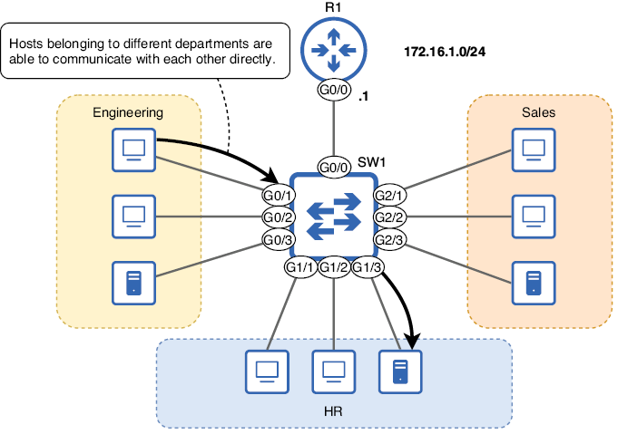
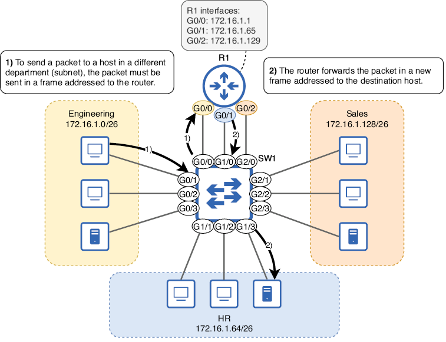
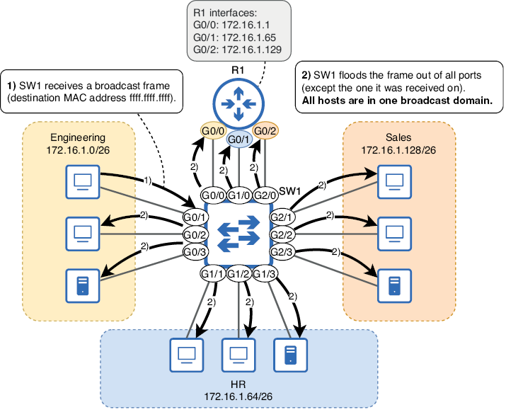
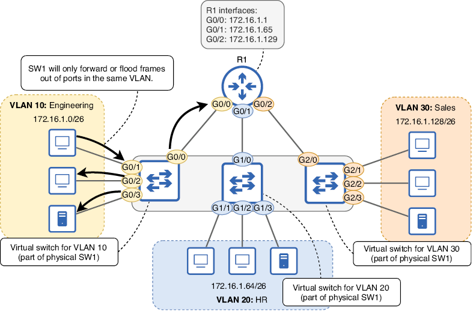
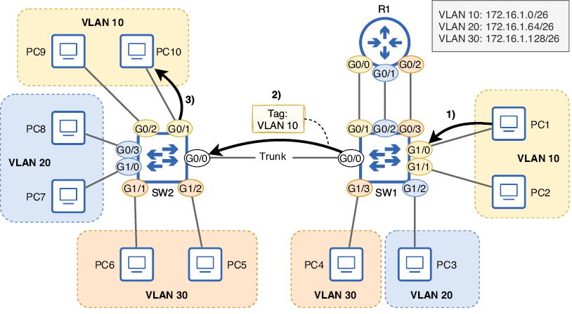
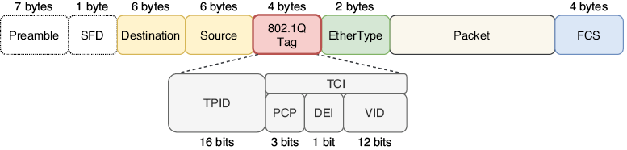
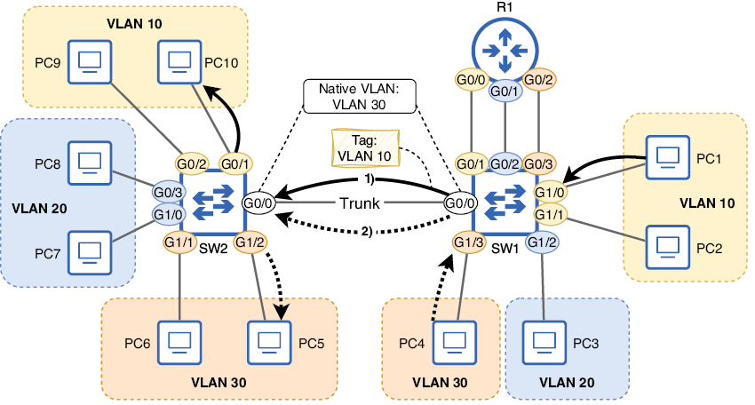
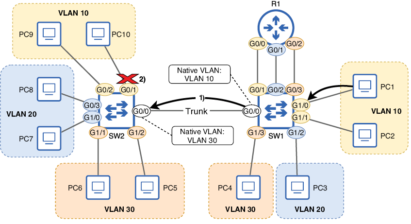

Este capítulo trata sobre

- Cómo dividir un switch en varios switches virtuales con VLANs.
- Cómo configurar puertos trunk para transportar tráfico en varias VLANs.
- Enrutamiento entre VLANs con un router o un switch multicapa.

En el capítulo 11 tratamos el subnetting, que permite dividir una red en subredes más pequeñas. Esto es un ejemplo de segmentación de red: la división de una red en partes más pequeñas. Las VLANs (Virtual LANs, pronunciadas “V-LANs”), tema de este capítulo, pueden compararse con las subredes porque también permiten dividir una red en partes más pequeñas. Con las VLANs, podemos dividir una LAN (un dominio de difusión) en redes locales más pequeñas, llamadas VLANs. Mientras que las subredes permiten segmentar la red en la Capa 3, las VLANs permiten segmentar la red en la Capa 2. En este capítulo se cubrirán tres temas del examen CCNA, todos relacionados con los switches y las VLANs:

- 1.1.b Switches de Capa 2 y Capa 3
- 2.1 Configurar y verificar VLANs (rango normal) que abarcan varios switches
- 2.2 Configurar y verificar la conectividad entre switches

## 1. ¿Por qué necesitamos VLANs?

Para entender una tecnología, es importante comprender por qué existe y qué problema resuelve. Para mostrar el papel que desempeñan las VLANs en la segmentación de redes, vamos a analizar una red sin segmentación, una red con segmentación en la Capa 3 y otra con segmentación tanto en la Capa 3 como en la Capa 2.

### 1.1. Segmentación en la Capa 3 con subredes

{text-align: justify}
/// figura
Una LAN de oficina con tres departamentos distintos: ingeniería, recursos humanos y ventas. Todos los hosts pertenecen a la red 172.16.1.0/24, por lo que pueden comunicarse directamente sin usar el router como intermediario.
///

Desde el punto de vista de la seguridad de la información, esto no es adecuado para las redes modernas. En lugar de tener todos los hosts dentro de una única red grande, debemos usar subnetting para segmentar la red en la Capa 3, asignando a cada departamento su propia subred. La figura 2 muestra cómo se comunican los hosts de distintos departamentos después de dividir la red en subredes separadas.

{text-align: justify}
/// figura
Una LAN segmentada en tres subredes. El departamento de ingeniería usa la subred 172.16.1.0/26, el de recursos humanos usa 172.16.1.64/26 y el de ventas usa 172.16.1.128/26. R1 tiene una interfaz en cada subred. La comunicación entre hosts de departamentos distintos debe pasar por R1.
///

!!!note "Nota"
    En una red ideal, cada subred tendría su propio switch para conectarse. Sin embargo, en la práctica, los switches suelen compartirse, tal como ocurre en la figura 2; los hosts de 172.16.1.0/26, 172.16.1.64/26 y 172.16.1.128/26 se conectan todos a SW1. La infraestructura de red cuesta dinero, por lo que reducir la cantidad de hardware necesaria es deseable.

Puede que os preguntéis cómo mejora la seguridad segmentar la LAN en subredes separadas. Al exigir que el tráfico entre departamentos pase por el router, podéis controlar qué tráfico se permite y cuál no; las políticas de seguridad pueden implementarse en el router para controlar el tráfico. La figura 2 muestra a un PC del departamento de ingeniería accediendo a un servidor utilizado por recursos humanos; este es un ejemplo de tráfico que quizá queráis restringir. Podéis elegir bloquear a todos los hosts fuera del departamento de RR. HH. el acceso al servidor o permitir solo tipos específicos de comunicación con él.

!!!note "Nota"
    En este capítulo no vamos a explicar cómo usar un router para controlar qué tráfico se permite y qué tráfico se deniega. Por ahora, segmentaremos la red, pero no especificaremos qué tráfico se permite o se deniega. Cubriremos las listas de control de acceso (un método para controlar el tráfico) en la parte 6 del libro.

### 1.2. Segmentación en la Capa 2 con VLANs

Usando subnetting, hemos segmentado la LAN en la Capa 3. Sin embargo, los switches no son conscientes de la Capa 3. Desde la perspectiva de SW1, todos los hosts siguen formando parte de la misma LAN; están en el mismo dominio de difusión. Una trama broadcast enviada por cualquier host conectado a SW1 será recibida por todos los demás hosts conectados (lo mismo ocurre con los unknown unicast). La figura 3 lo demuestra: cuando un host del departamento de ingeniería envía una trama broadcast, SW1 la inunda a todos los demás hosts conectados, sin importar la subred.

{text-align: justify}
/// figura
Aunque los hosts están divididos en tres subredes, en la Capa 2 siguen formando parte del mismo dominio de difusión (LAN). (1) SW1 recibe una trama broadcast desde un host del departamento de ingeniería. (2) SW1 inunda la trama por todos los puertos, excepto por el que la recibió. La LAN se ha segmentado en la Capa 3, pero no en la Capa 2.
///

!!!note "Nota"
    Una definición de LAN es “un grupo de dispositivos interconectados en un área limitada”, pero como se vio en el capítulo 6, una definición más matizada considera cómo están conectados los dispositivos y cómo se reenvía el tráfico entre ellos, en lugar de limitarse solo a su ubicación física. Para este capítulo, una LAN es lo mismo que un dominio de broadcast: el grupo de dispositivos que recibirán una trama broadcast enviada por cualquier otro miembro del grupo.

Desde el punto de vista de la seguridad, esto sigue sin ser adecuado: el tráfico de hosts de una subred puede llegar a hosts de otras subredes. Además, que todos los hosts estén en el mismo dominio de difusión puede tener efectos negativos sobre el rendimiento de la red; el inundado innecesario de tramas por todos los puertos puede causar o empeorar la congestión. Para resolver estos problemas, debemos segmentar la red en la Capa 2 y podemos usar VLANs para hacerlo.

Las VLANs permiten dividir un único switch físico en varios switches virtuales, con lo que se divide el dominio de broadcast en varios dominios de broadcast. La figura 4 demuestra este concepto, mostrando cómo SW1 se divide en varios switches virtuales. Al asignar cada uno de los puertos de SW1 a una VLAN específica, SW1 se divide en tres switches virtuales: uno para la VLAN 10, otro para la VLAN 20 y otro para la VLAN 30. Estos números de VLAN son arbitrarios; he elegido las VLANs 10, 20 y 30 para este ejemplo, pero pueden usarse cualquier número dentro del rango válido (más adelante se explicará en la sección 2).

{text-align: justify}
/// figura
Al asignar las interfaces de SW1 a tres VLANs separadas, SW1 se divide en tres switches virtuales, cada uno en un dominio de difusión independiente. G0/0, G0/1, G0/2 y G0/3 forman parte de la VLAN 10. G1/0, G1/1, G1/2 y G1/3 forman parte de la VLAN 20. G2/0, G2/1, G2/2 y G2/3 forman parte de la VLAN 30. SW1 no reenviará ni inundará una trama por puertos en una VLAN distinta a la que recibió la trama.
///

!!!note "Nota"
    La red física de la figura 4 es la misma que la de la figura 3; la única diferencia es que los puertos de SW1 ahora están en tres VLANs separadas. He mostrado SW1 como tres switches virtuales separados para ilustrar cómo funcionan las VLANs. Los diagramas de red normalmente no se representan así; en un diagrama típico, las VLANs aparecen etiquetadas, pero solo se muestra el switch físico.

Ahora ya hemos segmentado correctamente la LAN tanto en la Capa 3 (con subredes) como en la Capa 2 (con VLANs). SW1 no reenviará ni inundará tramas entre VLANs: los hosts de VLANs separadas solo pueden comunicarse entre sí a través de R1. Como regla general, debe existir una relación uno a uno entre subredes y VLANs, como se muestra en la figura 4: una subred por VLAN. Si continuáis vuestros estudios más allá del CCNA, encontraréis casos en los que hay varias subredes asociadas a una sola VLAN, pero para el CCNA podéis asumir que esta relación es uno a uno.

## 2. Configuración de VLANs y puertos de acceso

Hasta este punto del libro no hemos configurado casi nada en los switches. Esto se debe a que un switch puede cumplir su función básica de reenvío de tramas sin ninguna configuración especial; crea automáticamente su tabla de direcciones MAC examinando la dirección MAC de origen de las tramas que recibe y luego puede reenviar tramas entre hosts de una LAN. Sin embargo, para usar VLANs debemos configurarlas en los puertos del switch.

### 2.1. Creación y nombrado de VLANs

Primero, vamos a examinar el estado por defecto de las VLANs en SW1. El ejemplo siguiente muestra la salida del comando `show vlan brief` antes de configurar ninguna VLAN. Este comando muestra la lista de VLANs que existen en el switch (la base de datos de VLANs), así como qué puertos están en cada VLAN:

```
SW1#
show vlan brief
VLAN  Name                             Status    Ports
----  -------------------------------- --------- -------------------------------
1     default                          active    Gi0/0, Gi0/1, Gi0/2, Gi0/3
                                             Gi1/0, Gi1/1, Gi1/2, Gi1/3
                                             Gi2/0, Gi2/1, Gi2/2, Gi2/3
1002  fddi-default                     act/unsup
1003  token-ring-default               act/unsup
1004  fddinet-default                  act/unsup
1005  trnet-default                    act/unsup
```

Hay dos conclusiones principales de esa salida. En primer lugar, sin ninguna configuración, todos los puertos de SW1 están en la VLAN 1. La VLAN 1 es la VLAN predeterminada: la VLAN en la que todos los puertos se encuentran por defecto. También podemos confirmarlo mirando la tabla de direcciones MAC del switch; todas las direcciones MAC se aprenden en la VLAN 1, como se muestra en la columna izquierda del siguiente ejemplo:

```
SW1#
show mac address-table
          Mac Address Table
-------------------------------------------
Vlan    Mac Address       Type        Ports
----    -----------       --------    -----
   1    5254.0000.04c5    DYNAMIC     Gi2/0
   1    5254.000e.a694    DYNAMIC     Gi2/1
   1    5254.000f.d41a    DYNAMIC     Gi1/0
   1    5254.0011.fbcf    DYNAMIC     Gi0/1
. . .
```

La segunda conclusión es que las VLANs 1002, 1003, 1004 y 1005 también existen en el switch por defecto. Estas VLANs están reservadas para FDDI y Token Ring, dos tecnologías antiguas de la Capa de enlace de datos. FDDI y Token Ring ya no se usan en redes modernas, pero incluso en versiones actuales de Cisco IOS, estas cuatro VLANs se reservan por compatibilidad con versiones anteriores; no se pueden eliminar ni usar para VLANs Ethernet.

!!!note "Nota"
    Hay 4096 VLANs en total (del 0 al 4095), pero las VLANs 0 y 4095 están reservadas para fines especiales fuera del alcance del examen CCNA. Como las VLANs 1002-1005 están reservadas para FDDI y Token Ring, el rango de VLANs utilizables es del 1 al 1001 y del 1006 al 4094 (4.090 VLANs en total). Esto significa que una sola LAN (dominio de difusión) puede dividirse en un máximo de 4.090 VLANs, mucho más de lo que la mayoría de LANs necesitarán.

Para configurar una VLAN, usad el comando `vlan vlan-id` desde el modo de configuración global (`vlan-id` es un número). Eso os llevará al modo de configuración de VLAN, desde donde también podéis configurar el nombre de la VLAN con el comando `name vlan-name`. En el ejemplo siguiente, creo y nombro las VLANs 10, 20 y 30 en SW1 y luego las confirmo con `show vlan brief` (omitiendo las VLANs 1002-1005 en la salida para ahorrar espacio):

```
SW1(config)#
vlan 10
SW1(config-vlan)# name Engineering
SW1(config-vlan)# vlan 20
SW1(config-vlan)# name HR
SW1(config-vlan)# vlan 30
SW1(config-vlan)# name Sales
SW1(config-vlan)# end
SW1# show vlan brief
VLAN Name                             Status    Ports
---- -------------------------------- --------- -------------------------------
1    default                          active    Gi0/0, Gi0/1, Gi0/2, Gi0/3
                                                Gi1/0, Gi1/1, Gi1/2, Gi1/3
                                                Gi2/0, Gi2/1, Gi2/2, Gi2/3
10   Engineering                      active
20   HR                               active
30   Sales                            active
. . .
```

!!!note "Nota"
    Nombrar una VLAN es opcional. Si no configuráis un nombre, el nombre predeterminado es VLANxxxx, donde xxxx es el ID de la VLAN en cuatro dígitos (por ejemplo, VLAN0010 para la VLAN 10).

En el ejemplo anterior, el estado de cada VLAN es active. Sin embargo, podéis deshabilitar temporalmente una VLAN usando el comando `shutdown` en el modo de configuración de VLAN. En el siguiente ejemplo, desactivo la VLAN 10 en SW1 y la confirmo con `show vlan brief`. Observad que el estado cambia a `act/lshut` (active/locally shutdown):

```
SW1(config)#
vlan 10
SW1(config-vlan)# shutdown
SW1(config-vlan)# end
SW1# show vlan brief
VLAN Name                             Status    Ports
---- -------------------------------- --------- -------------------------------
. . .
10   Engineering                      act/lshut
. . .
```

!!!note "Nota"
    Si queréis eliminar una VLAN por completo, podéis negar el comando que usasteis para crearla añadiendo `no` delante, por ejemplo `no vlan 10`.

### 2.2. Asignación de puertos a VLANs

Ahora que ya hemos creado las VLANs 10, 20 y 30 en SW1, asignemos los puertos de SW1 a la VLAN adecuada. Hay dos pasos:

- Configurar los puertos de SW1 en modo access.
- Configurar la VLAN del modo access de los puertos.

Un puerto access es un puerto de switch que pertenece a una sola VLAN, a diferencia de un puerto trunk, que transporta tráfico en varias VLANs (lo trataremos en la sección 3). Por defecto, los puertos de switch de Cisco usan un protocolo llamado Dynamic Trunking Protocol (DTP) para determinar automáticamente si cada puerto debe operar en modo access o en modo trunk. Lo cubriremos en el capítulo 13, pero por ahora basta con saber que es una buena práctica configurar manualmente el modo access o trunk en lugar de dejar que DTP determine automáticamente el estado de las interfaces.

Podéis configurar manualmente un puerto de switch para que funcione en modo access con el comando `switchport mode access` en el modo de configuración de interfaz. Luego, usad `switchport access vlan vlan-id` para configurar a qué VLAN pertenece el puerto. En el ejemplo siguiente, configuro las interfaces G0/0, G0/1, G0/2 y G0/3 de SW1 como puertos access en la VLAN 10, las G1/0, G1/1, G1/2 y G1/3 como puertos access en la VLAN 20, y los puertos G2/0, G2/1, G2/2 y G2/3 como access en la VLAN 30:

```
SW1(config)#
interface range g0/0-3
SW1(config-if-range)# switchport mode access
SW1(config-if-range)# switchport access vlan 10
SW1(config-if-range)# interface range g1/0-3
SW1(config-if-range)# switchport mode access
SW1(config-if-range)# switchport access vlan 20
SW1(config-if-range)# interface range g2/0-3
SW1(config-if-range)# switchport mode access
SW1(config-if-range)# switchport access vlan 30
```

!!!note "Nota"
    Si usáis el comando `switchport access vlan` para asignar un puerto a una VLAN que aún no existe en el switch, el switch creará automáticamente la VLAN. Esto significa que no es necesario crear VLANs con el comando `vlan` antes de asignar puertos a VLANs (aunque sí es necesario si queréis usar el comando `name` para nombrar las VLANs).

¡Ya hemos terminado de configurar SW1! Reenviará e inundará tramas entre hosts de cada VLAN, pero no entre VLANs; cada VLAN es un dominio de broadcast independiente. Tened en cuenta que las VLANs se configuran en los puertos del switch; aunque es habitual decir que un host final está en la VLAN X, ese host en realidad no conoce en qué VLAN está; las VLANs son un concepto usado por los switches, no por hosts finales como PCs.

!!!note "Nota"
    Hay excepciones en las que los hosts finales sí son VLAN-aware; veremos un ejemplo cuando cubramos las máquinas virtuales más adelante.

## 3. Conexión de switches con puertos trunk

Los puertos access están asignados a una sola VLAN y solo reenviarán e inundarán tráfico entre puertos de la misma VLAN. Los puertos trunk, en cambio, no están asignados a una sola VLAN; en realidad, pueden reenviar tráfico en varias VLANs. La figura 5 muestra una situación en la que debe usarse un puerto trunk: la LAN consiste en dos switches (SW1 y SW2), y los hosts de las VLANs 10, 20 y 30 están conectados a cada switch. Para que los hosts de cada VLAN puedan comunicarse entre sí, el enlace entre SW1 y SW2 debe poder transportar tráfico en varias VLANs; para ello, las tramas enviadas entre SW1 y SW2 llevan una etiqueta que indica a qué VLAN pertenece cada trama.

{text-align: justify}
/// figura
SW1 y SW2 están conectados por un enlace trunk, que puede transportar tráfico en varias VLANs. SW1 y SW2 son dos switches físicos, cada uno de los cuales consta de tres switches virtuales: uno por cada VLAN. (1) PC1 (conectado a SW1) envía una trama dirigida a la MAC de PC10. (2) SW1 reenvía la trama por su puerto G0/0, que está en modo trunk. Añade una etiqueta a la trama indicando que la trama pertenece a la VLAN 10. (3) SW2 reenvía la trama por su puerto G0/1 (sin etiqueta).
///

!!!note "Nota"
    En lugar de conectar SW1 y SW2 con un único enlace trunk, otra opción es usar un enlace access separado entre los switches para cada VLAN (uno para la VLAN 10, uno para la VLAN 20 y otro para la VLAN 30). Aunque esto puede funcionar en redes pequeñas con pocas VLANs, no escala bien en redes con muchas VLANs; un enlace trunk es mejor opción.

Así funcionan los puertos trunk: el switch que reenvía una trama añade una etiqueta antes de enviarla por el puerto trunk. Por eso, otro nombre para un puerto trunk es puerto etiquetado. El switch que recibe la trama comprueba la etiqueta y asigna la trama a la VLAN indicada por la etiqueta. Si el destino de la trama está en una VLAN distinta a la especificada por la etiqueta, el switch no podrá reenviarla al destino correcto; recordad que los hosts de VLANs distintas no pueden comunicarse directamente entre sí.

Del mismo modo, otro nombre para un puerto access es puerto sin etiquetar; las tramas reenviadas por un puerto access no llevan etiqueta para indicar la VLAN, y las tramas recibidas por un puerto access se asignan a la VLAN especificada en el comando `switchport access vlan`. Como los puertos access solo están asociados a una VLAN, no es necesaria una etiqueta para identificar a qué VLAN pertenecen las tramas enviadas y recibidas por ese puerto.

!!!note "Nota"
    Los puertos access suelen usarse para conectar hosts finales, como PCs. Los puertos trunk suelen usarse para conectar otros switches (y a veces routers, como veremos en la sección 4).

### 3.1. La etiqueta IEEE 802.1Q

El protocolo usado para etiquetar tramas reenviadas por puertos trunk es IEEE 802.1Q (normalmente se pronuncia “dot one Q”). La etiqueta 802.1Q tiene 4 bytes y se añade entre los campos Source y EtherType del encabezado Ethernet. La figura 6 muestra la posición de la etiqueta 802.1Q dentro de una trama, así como los campos de la etiqueta.

{text-align: justify}
/// figura
La posición de la etiqueta 802.1Q dentro de una trama Ethernet y los campos de la etiqueta. Los campos son TPID (Tag Protocol Identifier) y TCI (Tag Control Information). TCI contiene tres subcampos: PCP (Priority Code Point), DEI (Drop Eligible Indicator) y VID (VLAN Identifier).
///

El campo Tag Protocol Identifier (TPID) tiene 16 bits y siempre contiene el valor `0x8100`. Cuando una trama está etiquetada con 802.1Q, el campo TPID ocupa la posición que normalmente tendría el campo EtherType. Cuando el switch ve el valor `0x8100`, sabe que la trama está etiquetada mediante 802.1Q; ese es el propósito del campo TPID.

La segunda parte de 802.1Q es Tag Control Information (TCI), que contiene tres subcampos: PCP, DEI y VID. El campo Priority Code Point (PCP) tiene 3 bits y puede usarse para marcar tramas como de mayor o menor prioridad; esto se usa para Quality of Service (QoS), un tema que trataremos en el capítulo 10 del volumen 2. El campo Drop Eligible Indicator (DEI) tiene 1 bit y también se usa para QoS; puede indicarse qué tramas pueden descartarse si la red está congestionada.

El campo VLAN Identifier (VID) es quizá el más importante; es el que indica a qué VLAN pertenece la trama. Tiene 12 bits y por eso hay 4.096 VLANs en total (2^12 = 4096).

### 3.2. Cisco Inter-Switch Link

Antes de IEEE 802.1Q, Cisco desarrolló un protocolo llamado Inter-Switch Link (ISL) para etiquetar tramas sobre enlaces trunk. Como protocolo propietario de Cisco, ISL solo puede usarse en switches Cisco. Mientras que 802.1Q añade una etiqueta de 4 bytes al encabezado Ethernet, ISL encapsula la trama Ethernet con un encabezado de 26 bytes y un trailer de 4 bytes que contiene un FCS (separado del FCS del trailer Ethernet).

ISL hoy se considera obsoleto y no es compatible con switches Cisco nuevos. Sin embargo, aún podéis encontrar switches Cisco que soportan tanto 802.1Q como ISL; en esos casos, se requiere un comando adicional al configurar puertos trunk, como veremos en la sección 2. Aunque no tenéis que conocer ISL para el examen CCNA, sí debéis entender cómo afecta a la configuración de trunk en switches que lo soportan (porque requiere un comando adicional).

### 3.3. Configuración de puertos trunk

Para demostrar la configuración de puertos trunk, configuremos el puerto G0/0 de SW1 como vimos en la figura 5: un enlace trunk capaz de transportar tráfico en las VLANs 10, 20 y 30. Aunque solo voy a mostrar el lado de SW1 del enlace, si lo probáis en un entorno real, asegurad que el puerto G0/0 de SW2 esté configurado del mismo modo (con los mismos comandos que en SW1). En el ejemplo siguiente, intento configurar G0/0 de SW1 como trunk, pero el comando es rechazado.

```
SW1(config)#
interface g0/0
SW1(config-if)# switchport mode trunk
Command rejected: An interface whose trunk encapsulation
is "Auto" can not be configured to "trunk" mode.
```

La razón por la que se rechaza el comando es que SW1 soporta tanto 802.1Q como ISL. Por defecto, los puertos de un switch que admite ambos protocolos usan DTP (mencionado antes en la sección 2) para determinar automáticamente cuál de los dos usar para el trunk. Sin embargo, para configurar manualmente el puerto en modo trunk, también debéis configurar manualmente el protocolo de encapsulación (802.1Q o ISL); no podéis configurar manualmente el modo trunk, pero sí podéis permitir que DTP determine automáticamente si debe usarse 802.1Q o ISL. El comando para configurar qué protocolo usar es `switchport trunk encapsulation { dot1q | isl }`. En el ejemplo siguiente, configuro G0/0 para usar 802.1Q y, entonces, sí puedo configurar G0/0 como puerto trunk:

```
SW1(config-if)#
switchport trunk encapsulation dot1q
SW1(config-if)# switchport mode trunk
SW1(config-if)#
```

!!!note "Nota"
    Si un switch solo soporta 802.1Q (no ISL), no hace falta usar el comando `switchport trunk encapsulation` antes de `switchport mode trunk`; de hecho, el switch ni siquiera soportará el comando `switchport trunk encapsulation`.

Después de configurar un puerto como trunk, ya no aparecerá en la salida de `show vlan brief`. El ejemplo siguiente lo demuestra; G0/0 no aparece en la salida. Observad que he configurado los puertos access de SW1 en sus VLANs adecuadas, según la figura 5:

```
SW1#
show vlan brief
VLAN Name                             Status    Ports
---- -------------------------------- --------- -------------------------------
1    default                          active    Gi2/0, Gi2/1, Gi2/2, Gi2/3
10   Engineering                      active    Gi0/1, Gi1/0, Gi1/1
20   HR                               active    Gi0/2, Gi1/2
30   Sales                            active    Gi0/3, Gi1/3
```

Para verificar los puertos trunk, podéis usar el comando `show interfaces trunk`, como se muestra en el siguiente ejemplo. La salida está dividida en cuatro partes, pero nos centraremos en las tres primeras:

```
SW1#
show interfaces trunk
Port        Mode             Encapsulation  Status        Native vlan
Gi0/0       on               802.1q         trunking      1

Port        Vlans allowed on trunk
Gi0/0       1-4094

Port        Vlans allowed and active in management domain
Gi0/0       1,10,20,30
. . .
```

La primera sección (las dos primeras líneas) lista cada puerto trunk y alguna información básica. El valor `on` en la columna Mode significa que G0/0 está configurado manualmente como trunk (con el comando `switchport mode trunk`). La columna Encapsulation es evidente; el valor es `802.1q` porque configuré antes el comando `switchport trunk encapsulation dot1q`. La columna Status dice `trunking`; esto es lo esperado porque configuré manualmente G0/0 en modo trunk. La última columna es Native vlan; la VLAN nativa es un tema importante para entender en el CCNA, y lo cubriremos en esta sección.

La segunda parte de la salida lista las VLANs permitidas en cada puerto trunk (`Vlans allowed on trunk`). Como indica `1-4094`, todas las VLANs están permitidas por defecto en un puerto trunk; esto significa que el tráfico de todas las VLANs puede ser reenviado y recibido por el puerto.

Sin embargo, la siguiente parte lista las VLANs que están permitidas y existen en el switch (`Vlans allowed and active in management domain`). La VLAN 1 existe por defecto, y yo he creado las VLANs 10, 20 y 30, así que esas cuatro aparecen aquí. Si una VLAN no existe en un switch, no puede reenviar tráfico en esa VLAN; por eso, aunque todas las VLANs estén permitidas en el trunk, SW1 solo puede reenviar tráfico en las VLANs 1, 10, 20 y 30.

!!!note "Nota"
    El dominio de gestión al que se refiere la línea `Vlans allowed and active in management domain` es el dominio de VLAN Trunking Protocol (VTP). VTP es uno de los temas del capítulo 13, así que no lo mencionaremos más en este capítulo.

### 3.4. Modificación de la lista de VLANs permitidas

Aunque todas las VLANs están permitidas en un puerto trunk por defecto, se considera buena práctica permitir solo las VLANs necesarias. Esto puede ayudar a limitar el tamaño de los dominios de broadcast; si una VLAN no está permitida en un trunk, las tramas broadcast y unknown unicast de esa VLAN no se inundarán por la interfaz. El comando para configurar la lista de VLANs permitidas en el trunk es `switchport trunk allowed vlan`, y luego hay varias palabras clave y argumentos posibles, como se muestra en el siguiente ejemplo:

```
SW1(config-if)#
switchport trunk allowed vlan
  WORD    VLAN IDs of the allowed VLANs when this port is
    in trunking mode
  add     add VLANs to the current list
  all     all VLANs
  except  all VLANs except the following
  none    no VLANs
  remove  remove VLANs from the current list
```

`WORD` permite especificar la lista de VLANs permitidas en el trunk como argumento, por ejemplo `switchport trunk allowed vlan 10,20,30`; esto permitirá solo las VLANs 10, 20 y 30 en el trunk. Este es el estado deseado para la red que vimos en la figura 5, que usa solo las VLANs 10, 20 y 30. Demuestro esta configuración en el siguiente ejemplo:

```
SW1(config-if)#
switchport trunk allowed vlan 10,20,30
SW1(config-if)# do show interfaces trunk
. . .
Port        Vlans allowed on trunk
Gi0/0       10,20,30
. . .
```

Las otras opciones son palabras clave, y para el examen CCNA es importante comprender cómo funciona cada una. `add` y `remove` se usan para modificar la lista actual de VLANs permitidas. En el siguiente ejemplo, añado la VLAN 1 y elimino la VLAN 30 de la lista de VLANs permitidas; la lista de VLANs permitidas pasa a ser 1, 10 y 20:

```
SW1(config-if)#
switchport trunk allowed vlan add 1
SW1(config-if)# switchport trunk allowed vlan remove 30
SW1(config-if)# do show interfaces trunk
. . .
Port        Vlans allowed on trunk
Gi0/0       1,10,20
. . .
```

Las palabras clave `all` y `none` son autoexplicativas; `all` permite todas las VLANs (configuración predeterminada), y `none` permite ninguna VLAN, impidiendo que el puerto reenvíe o reciba tráfico. En el siguiente ejemplo demuestro ambas:

```
SW1(config-if)#
switchport trunk allowed vlan all
SW1(config-if)# do show interfaces trunk
. . .
Port        Vlans allowed on trunk
Gi0/0       1-4094
. . .
SW1(config-if)# switchport trunk allowed vlan none
SW1(config-if)# do show interfaces trunk
. . .
Port        Vlans allowed on trunk
Gi0/0       none
. . .
```

La palabra clave final es `except`, que permite todas las VLANs excepto la(s) que se especifican como argumento. En el siguiente ejemplo, vuelvo a dejar la lista de VLANs permitidas en el estado deseado (permitiendo solo las VLANs 10, 20 y 30) usando la palabra clave `except` y especificando todas las VLANs excepto 10, 20 y 30 (un poco poco convencional, pero esto es solo una demostración):

```
SW1(config-if)#
switchport trunk allowed vlan except
 1-9,11-19,21-29,31-4094
SW1(config-if)# do show interfaces trunk
. . .
Port        Vlans allowed on trunk
Gi0/0       10,20,30
. . .
```

¡No olvidéis `add`!

Un error típico de principiantes (y el motivo de muchos memes de redes: sí, existe) es olvidar la palabra clave `add` al modificar la lista de VLANs permitidas en un trunk. Por ejemplo, si queréis añadir la VLAN 40 a la lista de VLANs permitidas, pero usáis el comando `switchport trunk allowed vlan 40`, no habéis añadido la VLAN 40 a la lista de VLANs permitidas; habéis reemplazado la lista de VLANs permitidas por solo la VLAN 40.

Es un error simple, pero sus consecuencias pueden ser desastrosas: bloquear todas las comunicaciones por el trunk salvo las de un único host en una sola VLAN. Esto puede ser una “pregunta trampa” en el examen, así que aseguraos de conocer la diferencia entre especificar la lista de VLANs permitidas (`switchport trunk allowed vlan vlans`) y añadir a la lista de VLANs permitidas (`switchport trunk allowed vlan add vlans`).

### 3.5. La VLAN nativa

Como se mencionó en la sección 2, los puertos access (sin etiquetar) envían y reciben tramas sin etiquetas 802.1Q. Los puertos trunk (etiquetados), por otro lado, envían y reciben tramas con etiquetas 802.1Q para indicar a qué VLAN pertenece cada trama, pero ¿qué ocurre si un switch recibe una trama sin etiqueta en un puerto trunk? La respuesta es la VLAN nativa.

La VLAN nativa es la VLAN a la que se asigna el tráfico sin etiquetar recibido en un puerto trunk. Además, cualquier tráfico de la VLAN nativa reenviado por un puerto trunk se reenvía sin etiqueta. Por defecto, la VLAN nativa es la VLAN 1, como se muestra en la salida de `show interfaces trunk`:

```
SW1#
show interfaces trunk
Port        Mode             Encapsulation  Status        Native vlan
Gi0/0       on               802.1q         trunking      1
. . .
```

!!!note "Nota"
    La VLAN predeterminada y la VLAN nativa suelen confundirse. La VLAN predeterminada es la VLAN a la que se asignan los puertos access por defecto: VLAN 1 (esto no se puede cambiar). La VLAN nativa es la VLAN a la que se asignan las tramas sin etiquetar cuando se reciben en un puerto trunk, y las tramas de la VLAN nativa se reenvían sin etiquetar por ese puerto. La VLAN nativa también es la VLAN 1 por defecto, pero esto puede cambiarse por puerto.

Para configurar la VLAN nativa de un puerto trunk, usad el comando `switchport trunk native vlan vlan-id`. En el ejemplo siguiente, configuro la VLAN 30 como VLAN nativa en la interfaz G0/0 de SW1 y luego la confirmo con `show interfaces trunk`:

```
SW1(config-if)#
switchport trunk native vlan 30
SW1(config-if)# show interfaces trunk
Port        Mode             Encapsulation  Status        Native vlan
Gi0/0       on               802.1q         trunking      30
. . .
```

La figura 7 muestra cómo se reenvía el tráfico de la VLAN nativa por un enlace trunk. La trama de PC1 a PC10 (ambos en la VLAN 10) se etiqueta cuando SW1 la reenvía a SW2. La trama de PC4 a PC5 (ambos en la VLAN 30), sin embargo, no se etiqueta al reenviarse de SW1 a SW2; la VLAN 30 es la VLAN nativa en el puerto G0/0 de SW1. Del mismo modo, la VLAN 30 es la VLAN nativa en el puerto G0/0 de SW2, así que cuando la trama llega a SW2, SW2 la asigna a la VLAN 30 y la reenvía al destino (que también está en la VLAN 30).

{text-align: justify}
/// figura
Tramas reenviadas por un enlace trunk en la VLAN nativa y en una VLAN no nativa. (1) La trama de PC1 a PC10 se etiqueta por el enlace trunk porque la VLAN 10 no es la VLAN nativa. (2) La trama de PC4 a PC5 no se etiqueta por el enlace trunk porque la VLAN 30 sí es la VLAN nativa.
///

!!!note "Nota"
    La VLAN nativa se configura por puerto. Si un switch tiene varios puertos trunk, es posible configurar una VLAN nativa distinta en cada uno.

### 3.6. Desajuste de VLAN nativa

Como la VLAN nativa se configura en los puertos de cada switch, es posible configurar una VLAN nativa diferente en cada extremo del enlace. Sin embargo, esto es una mala configuración y no debe hacerse. ¡Aseguraos de que la VLAN nativa coincida en ambos extremos del enlace! La figura 8 muestra un ejemplo de lo que puede ocurrir cuando hay un desajuste de VLAN nativa.

{text-align: justify}
/// figura
Un desajuste de VLAN nativa provoca que las tramas no lleguen a su destino. La VLAN nativa de G0/0 en SW1 es la VLAN 10, y la de G0/0 en SW2 es la VLAN 30. (1) La trama de PC1 a PC10 llega sin etiqueta por el enlace trunk porque la VLAN 10 es la VLAN nativa de G0/0 en SW1. (2) Cuando SW2 recibe la trama, la asigna a la VLAN 30 (la VLAN nativa de G0/0 en SW2) y, por tanto, no puede reenviarla a su destino (en la VLAN 10).
///

La VLAN nativa de G0/0 en SW1 es 10, pero la VLAN nativa de G0/0 en SW2 es 30. Cuando PC1 envía una trama a PC10, SW1 reenvía la trama sin etiqueta a SW2. Sin embargo, cuando SW2 recibe la trama sin etiqueta, la asigna a la VLAN 30 (la VLAN nativa de G0/0 en SW2). Como el destino está conectado a G0/1 de SW2 (un puerto access en la VLAN 10), SW2 no puede reenviar la trama a su destino correcto. Cuando el tráfico cruza de una VLAN a otra de esta forma, se denomina VLAN hopping.

!!!note "Nota"
    Los switches Cisco suelen ejecutar Per-VLAN Spanning Tree Plus (PVST+) o Rapid Per-VLAN Spanning Tree Plus (Rapid-PVST+). Si hay un desajuste de VLAN nativa, estos protocolos impiden que el tráfico se reenvíe por el trunk en las VLANs desalineadas y muestran un mensaje indicando este hecho. Cubriremos PVST+ y Rapid-PVST+ en los capítulos 14 y 15, respectivamente. Cisco Discovery Protocol (CDP) también puede detectar desajustes de VLAN nativa, pero no bloqueará el tráfico en las VLANs desalineadas; solo mostrará mensajes que indiquen el problema. Cubriremos CDP en el capítulo 1 del volumen 2.

### 3.7. Desactivación de la VLAN nativa

La VLAN nativa se desarrolló para acomodar dispositivos que no soportan etiquetado 802.1Q, como los hubs. Sin embargo, hoy en día normalmente no hace falta usar la VLAN nativa, y su uso puede dejar la red vulnerable a exploits de seguridad. Por tanto, es buena práctica desactivar la VLAN nativa en los puertos trunk.

Sin embargo, la función de VLAN nativa no puede desactivarse realmente; en su lugar, se debe configurar una VLAN no usada (que no sea la predeterminada VLAN 1) como VLAN nativa, lo que equivale a desactivarla. La red que he usado para las demostraciones de este capítulo usa las VLANs 10, 20 y 30, así que podría configurar `switchport trunk native vlan 999` en los puertos G0/0 de SW1 y SW2 para establecer la VLAN 999, una VLAN sin usar, como VLAN nativa.

!!!note "Nota"
    Recordad que, como medida de seguridad recomendada, configurad una VLAN no usada (que no sea la predeterminada VLAN 1) como VLAN nativa en vuestros puertos trunk.
