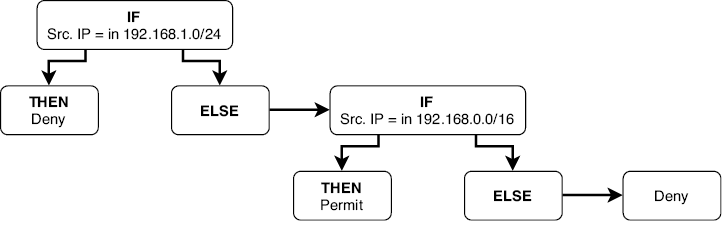
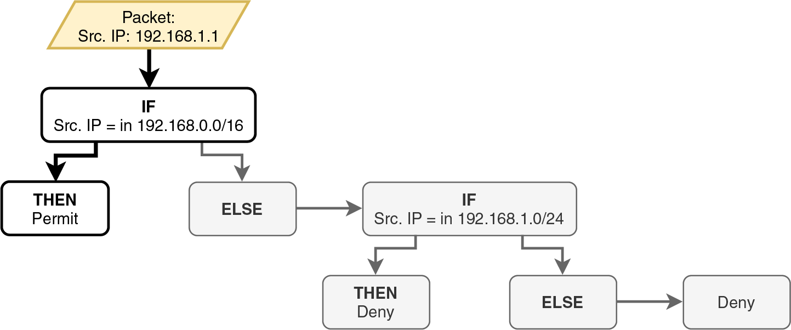
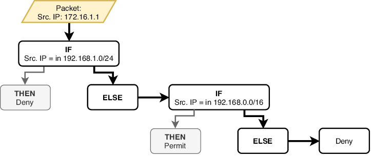
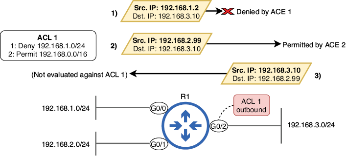
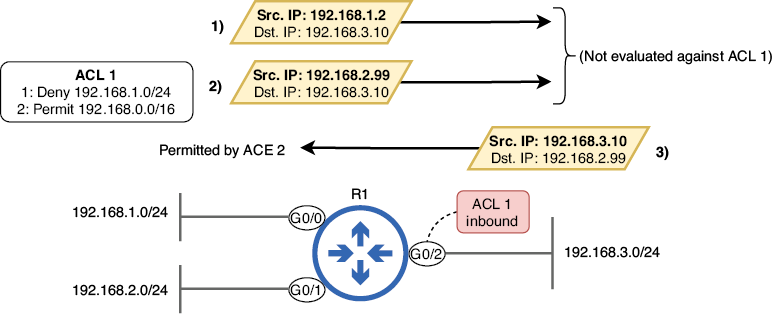
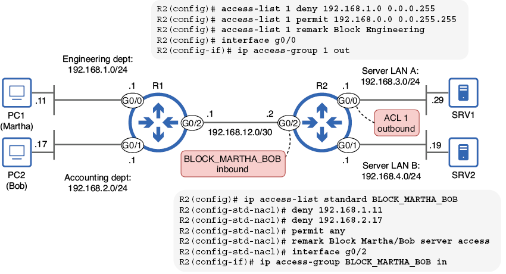
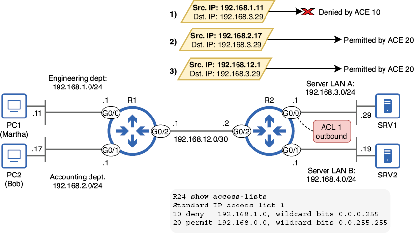
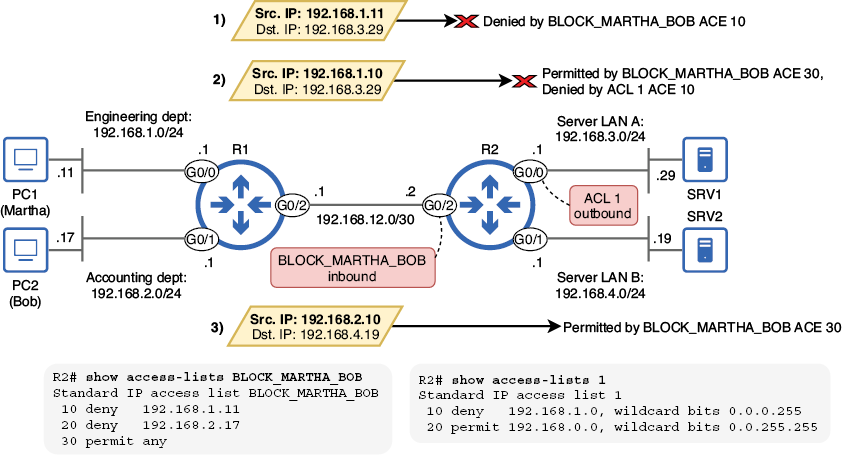
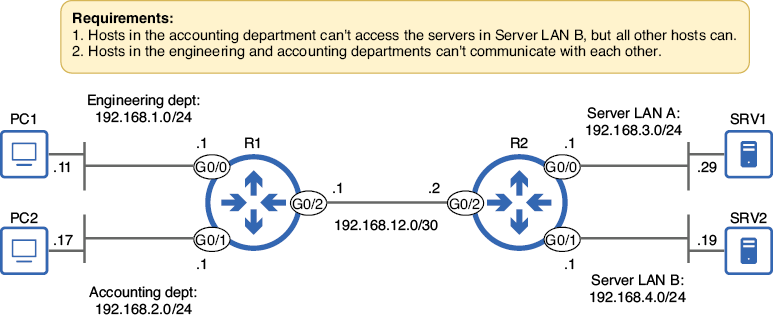
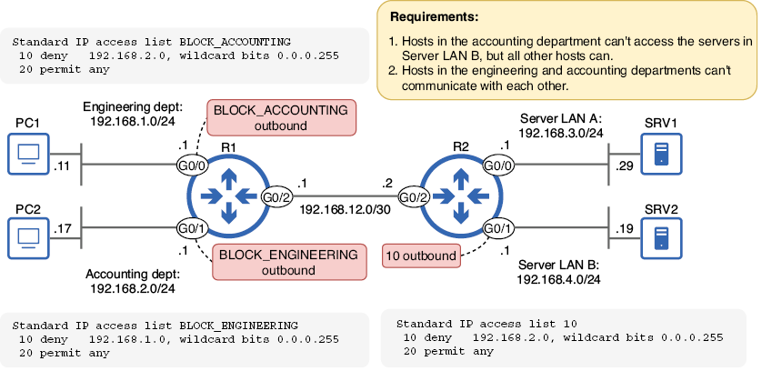

# Listas de control de acceso (ACL)

## 1. Introducción

En la mayoría de casos,por defecto, un router reenvía cualquier paquete que tenga una ruta coincidente en su tabla de enrutamiento. Sin embargo, este comportamiento predeterminado puede no ajustarse a las necesidades de seguridad de una organización. En muchos casos, el acceso a recursos específicos, como servidores que contienen información confidencial, debe restringirse a personas o dispositivos autorizados.

En un puesto de administración de redes, normalmente no es responsabilidad definir los requisitos de seguridad de la organización; la mayoría de las organizaciones de cierto tamaño cuentan con un equipo de seguridad dedicado. Sin embargo, sí es responsabilidad del administrador construir y mantener una red que cumpla con los requisitos de seguridad de la organización, y las listas de control de acceso (ACL) son una herramienta esencial para lograr este objetivo. En este capítulo, analizaremos las ACL desde la perspectiva de un ingeniero de redes que debe cumplir con los siguientes requisitos: los usuarios del departamento A no deben poder acceder a los recursos del servidor B, los usuarios de los departamentos X e Y no deben poder comunicarse entre sí a través de la red, etc.

Las ACL funcionan como filtros de paquetes, examinando cada paquete al entrar o salir de la interfaz de un router y determinando si debe permitirse o bloquearse según un conjunto de reglas predefinidas. En esta unidad, cubriremos las ACL estándar, que filtran los paquetes según su dirección IP de origen. Tras ello, cubriremos las ACL extendidas, que permiten al router filtrar paquetes según otros parámetros, como el protocolo de capa 4 y los números de puerto.

### 1.1. Cómo funcionan las ACL

Una ACL es una lista ordenada de reglas que filtra los paquetes al ser recibidos o enviados a través de una interfaz. Sigue una lógica muy parecida a la estructuras de control en programación; son muy similares a las estructuras condicionales *if-then-else*, que evalúan condiciones y realizan diferentes acciones según el resultado. Las ACL examinan ciertos criterios dentro de un paquete (como la dirección IP de origen) y luego realizan acciones específicas. Por ejemplo:

+ Si el paquete coincide con la regla 1, se realiza la acción correspondiente.
+ De lo contrario, si el paquete coincide con la regla 2, se realiza la acción correspondiente.
+ En caso contrario, se descarta el paquete (si no se cumple ninguna regla).

En esta sección explicaremos la lógica de las ACL paso a paso. Exploraremos el funcionamiento de las ACL: el proceso de coincidencia de paquetes, la función de la denegación implícita, cómo se aplican las ACL a las interfaces y los distintos tipos de ACL disponibles.

### 1.2. Coincidencia y procesamiento de paquetes

Cada ACL consta de una serie de reglas llamadas entradas de control de acceso (ACE). Cada ACE especifica una condición de coincidencia (una dirección IP o un rango de direcciones IP) y una acción (permitir o denegar). Los paquetes permitidos se reenvían y los denegados se descartan.

Imaginad que nuestra empresa utiliza el rango de direcciones** 192.168.0.0/16** para su red interna, a partir del cual crea varias subredes para uso de diferentes departamentos; Quizás la red **192.168.1.0/24** esté reservada para usuarios del departamento de ingeniería.

Los requisitos del equipo de seguridad establecen que los usuarios de este departamento no deben tener acceso a un grupo específico de servidores que contienen información de clientes, pero los usuarios de otros departamentos sí. A continuación, se muestra un ejemplo de una ACL, compuesta por dos ACE, que cumple con este requisito:

+ Si la dirección IP de origen coincide con 192.168.1.0/24, se deniega el paquete.
+ Si la dirección IP de origen coincide con 192.168.0.0/16, se permite el paquete.

Un router que evalúa un paquete con esta ACL procesará las ACE en orden, de arriba a abajo. La imagen muestra un diagrama de flujo que ilustra cómo el router evaluaría un paquete con esta ACL.



/// figura
Cómo evalúa un router un paquete con respecto a una lista de control de acceso (ACL).
Si la IP de origen coincide con 192.168.1.0/24, se deniega el paquete. De lo contrario, si la IP de origen coincide con 192.168.0.0/16, se permite el paquete. En caso contrario, se deniega el paquete.
///

!!!note "Nota"
    La acción de denegación final no está definida en ninguna de las ACE. Se la conoce como denegación implícita; la abordaremos más adelante.

Los paquetes se evalúan en función de cada ACE en orden, de arriba abajo. Si un paquete coincide con la condición de una ACE, el router ejecuta la acción especificada en la ACE (permitir o denegar) y no procesa el resto de la ACL; las ACE restantes se ignoran. Por este motivo, el orden de las ACE es crucial, ya que influye en el efecto general de la ACL.

¿Cuál es el efecto de nuestra ACL de ejemplo? Los paquetes provenientes de direcciones IP del rango 192.168.1.0/24 (el departamento de ingeniería) serán denegados; el router los descartará. A continuación, los paquetes provenientes de otras direcciones IP del rango 192.168.0.0/16 (el resto de la red interna) serán permitidos; el router los reenviará. Finalmente, los paquetes provenientes de todas las demás direcciones IP de origen (hosts fuera de la red interna) serán denegados. 

!!!note "Nota"
    Aunque el rango 192.168.1.0/24 está incluido en el rango 192.168.0.0/16, los paquetes provenientes de direcciones IP en 192.168.1.0/24 no serán permitidos por la segunda ACE; serán denegados por la primera ACE antes de que el router procese la segunda ACE.

Invirtamos las dos ACE en nuestra ACL de ejemplo para ver cómo esto cambia el efecto de la ACL. Esta es la ACL ahora:

1. Si la dirección IP de origen coincide con 192.168.0.0/16, se permite el paquete.
2. Si la dirección IP de origen coincide con 192.168.1.0/24, se deniega el paquete.

La siguiente imagen muestra cómo un router evaluaría un paquete de 192.168.1.1 con respecto a esta ACL; el efecto de esta ACL sería bastante diferente al de la primera.



/// figura
Un router evalúa un paquete proveniente de 192.168.1.1 comparándolo con la lista de control de acceso (ACL). El paquete es permitido por la primera entrada de control de acceso (ACE). Nunca se evalúa con la segunda ACE, que lo denegaría.
///

Aunque la segunda ACE especifica que se deben denegar los paquetes con una dirección IP de origen en 192.168.1.0/24 (como 192.168.1.1), el paquete proveniente de 192.168.1.1 está permitido porque coincide con la primera ACE. El efecto general de esta ACL es que se permitirán todos los paquetes con origen en direcciones IP en 192.168.0.0/16 (incluidas las de 192.168.1.0/24), y se denegarán todos los demás paquetes.

!!!note "Nota"
    La segunda ACE es un ejemplo de regla oculta: una regla (ACE) que nunca se ejecutará porque está precedida por una regla menos específica que cubre su condición coincidente (192.168.0.0/16 incluye 192.168.1.0/24). Esto no debería ocurrir en una ACL configurada correctamente; siempre se deben configurar primero las reglas más específicas.

### 1.3. Denegación implícita

Como decíamos al inicio de este capítulo, un router reenvía por defecto cualquier paquete con una ruta válida. Sin embargo, al usar listas de control de acceso (ACL), el comportamiento cambia: cualquier paquete no permitido explícitamente por la ACL se deniega por defecto.

Al final de cada ACL, hay una regla oculta que deniega cualquier paquete que no coincida previamente con las entradas de control de acceso (ACE) configuradas en la ACL; esto se denomina denegación implícita. Si un paquete no cumple ninguna condición definida explícitamente, será denegado por esta regla oculta. La denegación implícita garantiza una postura segura, donde solo se reenviará el tráfico permitido explícitamente por la ACL y todo lo demás se descartará automáticamente. Este es el ejemplo de ACL de la sección anterior, con la denegación implícita explícitamente establecida:

1. Si la dirección IP de origen coincide con **192.168.1.0/24**, se deniega el paquete.
2. Si la dirección IP de origen coincide con **192.168.0.0/16**, se permite el paquete.
3. Si la dirección IP de origen no coincide con ninguna entrada anterior, se deniega el paquete.

La figura de abajo muestra un ejemplo de un paquete denegado por la regla de denegación implícita. La dirección IP de origen del paquete es 172.16.1.1, que está fuera del rango utilizado para las redes internas de nuestra organización ficticia (192.168.0.0/16). Aunque la ACL no deniega explícitamente los paquetes de esta dirección IP, el paquete se descarta gracias a la regla de denegación implícita de la ACL.



/// figura
Un paquete es rechazado por la denegación implícita. La IP de origen del paquete (172.16.1.1) no coincide con la primera ACE (192.168.1.0/24) ni con la segunda ACE (192.168.0.0/16), por lo que es rechazado por la denegación implícita; el router lo descartará.
///

### 1.4. Aplicando ACLs

La creación de una ACL no afecta el comportamiento del router por sí sola; la ACL debe aplicarse a una o más interfaces del router para que surta efecto. Puede aplicar ACL tanto en la dirección de entrada como en la de salida (o en ambas), según el resultado deseado.

Una ACL de entrada evalúa los paquetes al ingresar a la interfaz a la que se aplica. Cada vez que el router recibe un paquete en la interfaz, lo evalúa comparándolo con la ACL. Si la ACL permite el paquete, el router continúa procesándolo. Si la ACL lo deniega, el router lo descarta.

Las ACL de salida evalúan los paquetes al salir de la interfaz. Si el router determina que un paquete debe reenviarse, primero lo evalúa comparándolo con la ACL. Si la ACL permite el paquete, el router lo reenvía; si lo deniega, el router lo descarta.

!!!note "Nota"
    Es posible que veáis a veces los términos *ingress* y *egress* en lugar de *inside* y *outside*, respectivamente; ambos significan lo mismo.

Abajo se muestra una ACL de salida que filtra los paquetes destinados a la LAN **192.168.3.0/24**. La ACL se aplica en la interfaz G0/2 del router R1 y, por lo tanto, filtra los paquetes a medida que salen de G0/2, es decir, cuando abandonan la interfaz. La ACL no filtra los paquetes que son recibidos por G0/2, es decir, los paquetes que entran en la interfaz.



/// figura
Una ACL de salida en G0/2 filtra los paquetes a medida que salen de la interfaz. El paquete 1, procedente de 192.168.1.2, es denegado por la ACE 1. El paquete 2, procedente de 192.168.2.99, es permitido por la ACE 2. El paquete 3, procedente de 192.168.3.10, no se evalúa con la ACL porque entra en G0/2; la ACL se aplica en sentido de salida, no de entrada.
///

La siguiente imagen muestra la misma ACL aplicada en sentido de entrada en R1 G0/2. Dado que la ACL se aplica en sentido de entrada, no se utiliza para filtrar los paquetes que salen de G0/2. Como resultado, los dos primeros paquetes se reenvían sin ser evaluados con la ACL 1. El tercer paquete, procedente de 192.168.3.10 a 192.168.2.99, es permitido por la ACE 2.



/// figura
Una ACL de entrada en G0/2 filtra los paquetes a medida que entran en la interfaz. Los paquetes 1 y 2 se reenvían fuera de G0/2 sin ser evaluados con la ACL 1. El paquete 3 se evalúa al entrar en G0/2 y es permitido por la ACE 2.
///

La ubicación y dirección ideales para aplicar una ACL dependen del resultado deseado; aplicar la ACL 1 de entrada en G0/2, como se muestra en la figura, no tiene sentido. El efecto de la ACL 1 es denegar los paquetes originados en la LAN 192.168.1.0/24, pero los paquetes originados en esa LAN nunca serán recibidos por G0/2, a la que está conectada la LAN 192.168.3.0/24. En efecto, la ACL 1 de la figura 5 es inútil.

Sin embargo, aplicar la ACL 1 de salida en G0/2, como vimos en la figura 4, tiene sentido: bloquea los paquetes originados en 192.168.1.0.24, impidiendo que lleguen a destinos en la LAN conectada a G0/2 (192.168.3.0/24); estos se descartarán antes de ser reenviados a través de la interfaz.

Normalmente, las ACL estándar deben aplicarse de salida en la interfaz conectada a la LAN de destino que se desea proteger; esto sirve para filtrar los paquetes destinados a dicha LAN. Sin embargo, más adelante veremos un ejemplo en el que aplicar una ACL de entrada resulta útil, permitiendo bloquear el tráfico no deseado que entra en un router y, por lo tanto, que accede a cualquiera de las LAN conectadas al router.

!!!note "Nota"
    Cada interfaz puede tener un máximo de una ACL aplicada en cada dirección: una de entrada y una de salida. La misma ACL puede aplicarse a varias interfaces. 
    
### 1.5. Tipos de ACL

Las ACL se pueden clasificar según dos características; sus parámetros de coincidencia y su método de identificación:

+ Parámetros de coincidencia: ACL estándar, ACL extendidas
+ Método de identificación: ACL numeradas, ACL con nombre

Las ACL estándar comparan paquetes según un único parámetro: la dirección IP de origen. Las ACL extendidas permiten un filtrado de paquetes más granular; comparan paquetes según parámetros adicionales, como direcciones IP de origen/destino, números de puerto de origen/destino, entre otros.

Las ACL numeradas se identifican mediante un número, y las ACL con nombre mediante un nombre. Al combinar ambos métodos de clasificación, podemos identificar los cuatro tipos de ACL que se deben conocer:


|                | ACL numerada              | ACL con nombre           |
|----------------|---------------------------|--------------------------|
| ACL estándar   | ACL estándar numerada     | ACL estándar con nombre  |
| ACL extendida  | ACL extendida numerada    | ACL extendida con nombre |


## 2. Configuración de ACL estándar

La configuración de ACL, ya sean estándar o extendidas, numeradas o con nombre, consta de dos pasos:

1. Creación de las ACL
2. Aplicación de las ACL

En esta sección, veremos cómo crear ACL estándar numeradas y con nombre, y cómo aplicarlas a las interfaces para filtrar paquetes. La imagen de más abajo muestra la red que utilizaremos en esta sección, así como los comandos que usaremos para configurar y aplicar las ACL:

+ La ACL 1, aplicada en la interfaz G0/0 de R2, bloquea el acceso del departamento de ingeniería (192.168.1.0/24) a la LAN del servidor A, que incluye SRV1.
+ La ACL BLOCK_MARTHA_BOB, aplicada en la interfaz G0/2 de R2, impide que dos usuarios accedan a cualquiera de las LAN conectadas a R2.



/// figura
Configuración y aplicación de ACL numeradas y con nombre estándar para controlar el tráfico en la red
///

### 2.1. ACL numeradas

Las ACL numeradas, como su nombre indica, se identifican con números. Sin embargo, no puede elegir cualquier número para identificar una ACL; existen rangos reservados que solo se pueden usar para tipos específicos de ACL. Por ejemplo:

+ Listas de control de acceso (ACL) IP estándar: 1–99 y 1300–1999
+ Listas de control de acceso (ACL) IP extendidas: 100–199 y 2000–2699

Los rangos originales para las ACL estándar y extendidas son 1–99 y 100–199, respectivamente. Sin embargo, posteriormente se ampliaron para admitir un mayor número de ACL, lo que dio lugar a los rangos 1300–1999 y 2000–2699. Dado que en este capítulo nos centraremos en las ACL estándar, debemos seleccionar los números de ACL dentro de los rangos correspondientes.

#### 2.1.1. Creando la ACL

En nuestra red de ejemplo, R1 y R2 están conectados mediante un enlace punto a punto, y cada router está conectado a dos LAN: R1 está conectado a 192.168.1.0/24 (departamento de ingeniería) y 192.168.2.0/24 (departamento de contabilidad), y R2 está conectado a 192.168.3.0/24 (LAN de servidores A) y 192.168.4.0/24 (LAN de servidores B), que contienen los servidores utilizados por la organización. Para demostrar la configuración de una ACL numerada, crearemos una ACL que limite el acceso a la LAN de servidores A, impidiendo que el departamento de ingeniería acceda a ella.

Al configurar una ACL numerada, se debe configurar cada ACE secuencialmente, de arriba a abajo. El orden en que se configuren las ACE es crucial, ya que el router las procesará en el orden en que se configuraron al evaluar un paquete con respecto a la ACL.

El comando principal para configurar una ACE como parte de una ACL numerada estándar es `access-list number {permit | deny} source-ip wildcard-mask`. El argumento `number` es el número que se usa para identificar la ACL; asegúrese de que esté dentro de uno de los rangos correctos (1–99 o 1300–1999). En el siguiente ejemplo, se configura la ACL 1 en R2, que consta de dos ACE (y una anotación opcional que identifica el propósito de la ACL):

```linenums="1"
R2(config)# access-list 1 deny 192.168.1.0 0.0.0.255         
R2(config)# access-list 1 permit 192.168.0.0 0.0.255.255     
R2(config)# access-list 1 remark Block Engineering           
```
!!!note "Nota"
    La observación o *remark* es opcional, pero puede ser útil para indicar el propósito de la ACL a otros usuarios que revisen la configuración (o a uno mismo en el futuro).

Las ACL utilizan máscaras comodín o *wildcards*, que ya hemos visto anteriormente en el curso. A modo de repaso, las máscaras comodín indican bits que deben coincidir con un 0 y bits que no tienen que coincidir con un 1. En la práctica, generalmente se pueden considerar como máscaras de red inversas: 0.0.0.255 es el equivalente en máscara comodín de 255.255.255.0, una máscara de red /24. Nota

!!!note "Nota"
    Un atajo para calcular la máscara comodín equivalente de una máscara de red es restar cada octeto de la máscara de red a 255. Los tres primeros octetos de una máscara de red /24 son 255 y 255 – 255 = 0. El último octeto es 0 y 255 – 0 = 255. Esto nos da 0.0.0.255.

Después de configurar una ACL, puede verificarse con `show access-lists` (que muestra todas las ACL) o `show ip access-lists` (que muestra solo las ACL de IP). Dado que solo estamos configurando ACL de IP, la salida de ambos comandos debería ser la misma. En el siguiente ejemplo, verifico la ACL 1 en R2:

```linenums="1"
R2# show access-lists
Standard IP access list 1
    10 deny   192.168.1.0, wildcard bits 0.0.0.255       
    20 permit 192.168.0.0, wildcard bits 0.0.255.255     
```

!!!note "Nota"
    El *remark* no aparece en `show access-lists`, solo en la configuración.

Observad los números de secuencia que se han agregado automáticamente al inicio de cada ACE: 10 y 20. Al configurar las ACL, a la primera ACE se le asigna el número de secuencia 10, y el incremento predeterminado es 10. Esto deja suficiente espacio entre cada ACE, lo que permite configurar nuevas ACE entre las existentes si es necesario. Sin embargo, esto solo es posible en el modo de configuración de ACL con nombre.

#### 2.1.2. Aplicación de la ACL

Para que una ACL surta efecto, debe aplicarse a una interfaz. El comando para hacerlo es `ip access-group number {in | out}`. En el siguiente ejemplo, se aplica la ACL 1 de salida en la interfaz G0/0 de R2 y lo verificamos con `show ip interface g0/0`:

```linenums="1"
R2(config)# interface g0/0
R2(config-if)# ip access-group 1 out         
R2(config-if)# do show ip interface g0/0
GigabitEthernet0/0 is up, line protocol is up (connected)
Internet address is 192.168.3.1/24
. . .
Outgoing access list is 1                    
Inbound access list is not set
. . .
```

La imagen muestra el efecto de esta configuración: los paquetes se filtran a medida que R2 los reenvía a través de G0/0, controlando el acceso a la LAN del servidor A. 



/// figura
Paquetes filtrados por la ACL 1 de R2, aplicada en el tráfico saliente de G0/0. El paquete 1, procedente del departamento de ingeniería, es denegado por la ACE 10. Los paquetes 2 y 3 son permitidos por la ACE 20.
///

La regla general al aplicar ACL estándar es aplicarlas lo más cerca posible del destino; el destino es la LAN que se desea proteger con la ACL. En este caso, el destino es la LAN del servidor A; queremos filtrar el tráfico destinado a esa LAN. Al colocar la ACL estándar de salida en R2 G0/0, se garantiza que solo el tráfico destinado a la LAN conectada a G0/0 sea filtrado por la ACL; el resto del tráfico no se ve afectado.

### 2.2. ACL con nombre

Las ACL numeradas y las ACL con nombre difieren no solo en cómo las identifican (con un número o un nombre), sino también en cómo se configuran. Mientras que las ACL numeradas se configuran completamente desde el modo de configuración global, las ACL con nombre se crean primero en el modo de configuración global, pero cada ACE se configura en un modo de configuración independiente. Se puede acceder al modo de configuración estándar de ACL con nombre y configurar cada ACE con los siguientes comandos:

+ Acceder al modo de configuración estándar de ACL con nombre: `ip access-list standard name`
+ Configurar ACE: `[seq-num] {permit | deny} source-ip wildcard-mask`

!!!note "Nota"
    En el modo de configuración de ACL con nombre, es posible especificar opcionalmente una `seq` (secuencia) para controlar la posición de la ACE en la ACL. Por defecto, las ACE comienzan en la secuencia 10 y se incrementan en 10 para cada nueva ACE, pero esta opción es útil para insertar nuevas ACE entre las existentes (por ejemplo, en la secuencia 15).

En nuestro ejemplo, bloquearemos el acceso de dos usuarios a las redes LAN A y B del servidor: Martha del departamento de ingeniería (que usa el PC1) y Bob del departamento de contabilidad (que usa el PC2). Para ello, configuraremos tres ACE: una para denegar el acceso a Martha (PC1), otra para denegar el acceso a Bob (PC2) y otra para permitir el resto del tráfico.

El comando para configurar una ACE es bastante flexible cuando se trata de una única dirección IP. Por ejemplo, aquí hay tres maneras de configurar una ACE que deniegue el acceso a 8.8.8.8:

+ `deny 8.8.8.8`
+ `deny 8.8.8.8 0.0.0.0` (una máscara /32)
+ `deny host 8.8.8.8`

Los tres comandos tienen el mismo efecto, así que podéis usar el que prefirais; en los apuntes se usará la primera opción (reemplazando `8.8.8.8` con las direcciones correspondientes). Tened en cuenta que los tres métodos funcionan tanto para ACL numeradas como para ACL con nombre.

En el siguiente ejemplo, se configura la ACL en R2 y se verifica con `show access-lists`, especificando **BLOCK_MARTHA_BOB** para ver solo esa ACL:

```linenums="1"
R2(config)# ip access-list standard BLOCK_MARTHA_BOB       
R2(config-std-nacl)# deny 192.168.1.11                     
R2(config-std-nacl)# deny 192.168.2.17                     
R2(config-std-nacl)# permit any                            
R2(config-std-nacl)# do show access-lists BLOCK_MARTHA_BOB
Standard IP access list BLOCK_MARTHA_BOB
    10 deny   192.168.1.11
    20 deny   192.168.2.17
    30 permit any
```
!!!note "Nota"
    La palabra clave `any` utilizada en la tercera ACE es una forma práctica de coincidir con todas las direcciones IP; alternativamente, podría configurar `permit 0.0.0.0 255.255.255.255`. Puede utilizarse tanto en ACL numeradas como en ACL con nombre.

Aplicar una ACL con nombre es idéntico a aplicar una ACL numerada: puede aplicarse en la interfaz G0/2 de R2 con `ip access group IP BLOCK_MARTHA_BOB`. Al aplicar la ACL en G0/2, los paquetes se filtran cuando R2 los recibe de R1. Esto filtra los paquetes destinados a ambos destinos que queremos proteger: la LAN del servidor A y la LAN del servidor B. La imagen muestra el resultado de aplicar nuestra nueva ACL. Tenga en cuenta que la ACL 1, que configuramos y aplicamos previamente, sigue vigente.



/// figura
Paquetes filtrados por las ACL de R2. El paquete 1 es denegado por la ACE 10 de BLOCK_MARTHA_BOB al entrar en la interfaz G0/2 de R2. El paquete 2 es permitido por la ACE 30 de BLOCK_MARTHA_BOB al entrar en R2 G0/2, pero es denegado por la ACE 10 de la ACL 1 al salir de R2 G0/0. El paquete 3 es permitido por la ACE 30 de BLOCK_MARTHA_BOB al entrar en R2 G0/2 y no se evalúa con respecto a ninguna ACL al salir de R2 G0/1; no se aplica ninguna ACL a esa interfaz.
///

En las versiones modernas de Cisco IOS, también se pueden configurar ACL numeradas en el modo de configuración de ACL con nombre especificando un número en lugar de un nombre después de `ip access-list standard`. En el siguiente ejemplo, configuro la ACL anterior, utilizando un número en lugar de un nombre:

```linenums="1"
R2(config)# ip access-list standard 99
R2(config-std-nacl)# deny 192.168.1.11
R2(config-std-nacl)# deny 192.168.2.17
R2(config-std-nacl)# permit any
```

Sin embargo, después de configurar la ACL, aparecerá en la configuración en ejecución como si se hubiera configurado mediante el método tradicional. El siguiente ejemplo muestra la ACL 99 en la configuración de R2:

```linenums="1"
R2# show running-config | include access-list 99
access-list 99 deny 192.168.1.11
access-list 99 deny 192.168.2.17
access-list 99 permit any
```

El modo de configuración de ACL con nombre ofrece algunas ventajas, como la posibilidad de especificar números de secuencia y una edición de ACL más sencilla. Sin embargo, tened en cuenta que las ACL configuradas con ambos métodos funcionan de forma idéntica una vez configuradas; ambas son ACL estándar que filtran paquetes según las direcciones IP de origen.

Si solo necesitamos configurar una ACL simple con algunas ACE, una ACL numerada configurada en el modo de configuración global es un método sencillo. No obstante, en algunos casos, puede que necesitemos aprovechar las ventajas del modo de configuración de ACL con nombre, por ejemplo, al editar ACL.

## 3. Escenario de ejemplo

Se necesita práctica para familiarizarse con las ACL. En esta sección, practicaremos con un escenario que utiliza la misma red que en los ejemplos anteriores. Partiremos de cero, sin ninguna ACL configurada. 

La imagen muestra la red y los requisitos que debemos cumplir al configurar las ACL.



/// figura
Requisitos que deben cumplirse al configurar ACL estándar
///

!!!note "Nota"
    Se pueden cumplir estos requisitos utilizando ACL numeradas o con nombre; el destino es más importante que el método para llegar a él. A modo de ejemplo, se configuran ambos tipos.

El primer requisito establece que *«Los hosts del departamento de contabilidad no pueden acceder a los servidores de la LAN de servidores B, pero todos los demás hosts sí»*.

Para cumplir este requisito, configuraremos una ACL en R2 que deniegue el acceso a la subred de contabilidad (192.168.2.0/24) pero permita el acceso a todas las demás direcciones IP. A continuación, se aplicará lo más cerca posible del destino: en la interfaz G0/1 de R2, en modo de salida. En el siguiente ejemplo, se configura y aplica la ACL:

```linenums="1"
R2(config)# access-list 10 deny 192.168.2.0 0.0.0.255     
R2(config)# access-list 10 permit any                     
R2(config)# interface g0/1                                
R2(config-if)# ip access-group 10 out                     
```

Esa ACL cumple con el primer requisito. El segundo requisito establece que "los hosts de los departamentos de ingeniería y contabilidad no pueden comunicarse entre sí". Esto se puede lograr configurando dos ACL en R1:

+ Una ACL que deniega el tráfico a la red 192.168.1.0/24, pero permite todas las demás direcciones IP.
+ Una ACL que deniega el tráfico a la red 192.168.2.0/24, pero permite todas las demás direcciones IP.

Al aplicar la primera ACL de salida en R1 G0/1, se bloqueará el acceso de los paquetes provenientes de hosts del departamento de ingeniería a destinos en el departamento de contabilidad. En el siguiente ejemplo, se configura y aplica la ACL en R1:

```linenums="1"
R1(config)# 
ip access-list standard BLOCK_ENGINEERING      
R1(config-std-nacl)# deny 192.168.1.0 0.0.0.255            
R1(config-std-nacl)# permit any                            
R1(config-std-nacl)# interface g0/1                        
R1(config-if)# ip access-group BLOCK_ENGINEERING out       
```

Asimismo, al aplicar la segunda ACL de salida en R1 G0/0, se bloqueará el acceso de los paquetes provenientes de hosts del departamento de contabilidad a los hosts del departamento de ingeniería.

 Configuramos y aplicamos la segunda ACL en el siguiente ejemplo:

```linenums="1"
R1(config)# 
ip access-list standard BLOCK_ACCOUNTING     
R1(config-std-nacl)# deny 192.168.2.0 0.0.0.255          
R1(config-std-nacl)# permit any                          
R1(config-std-nacl)# interface g0/0                      
R1(config-if)# ip access-group BLOCK_ACCOUNTING out      
```

¡Ya hemos cumplido con los requisitos! Para revisión, la figura siguiente muestra los requisitos y las ACL que hemos configurado para cumplirlos.



/// figura
Tres ACL configuradas en R1 y R2 cumplen con los requisitos. La ACL 10, configurada en R2, impide que los hosts en 192.168.2.0/24 accedan a 192.168.4.0/24. Las dos ACL con nombre en R1 impiden que los departamentos de ingeniería y contabilidad se comuniquen entre sí.
///