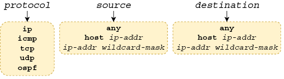
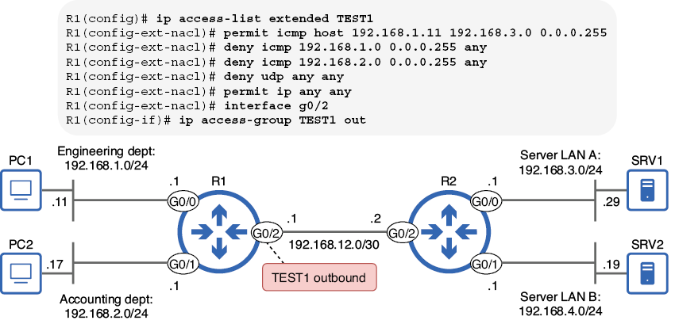
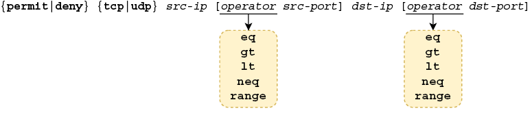
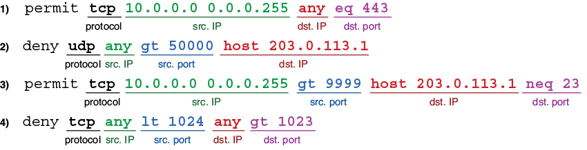
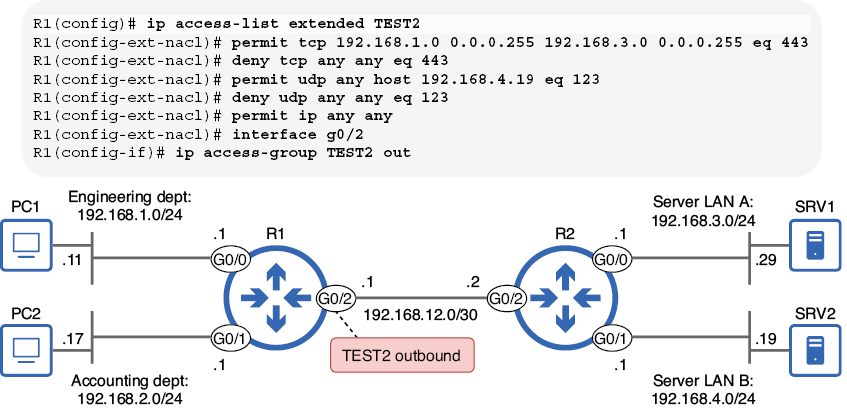
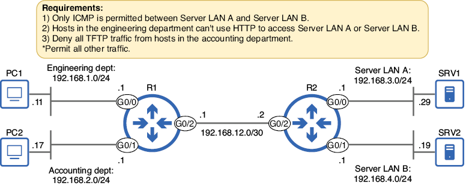
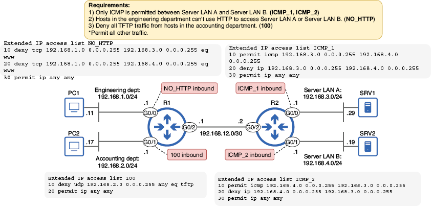

# Listas de control de acceso extendidas (ACL)

## 1. Introducción

Con anterioridad ya vimos las ACL estándar, que filtran paquetes según un único parámetro: la dirección IP de origen. Si bien las ACL estándar tienen su utilidad, son una herramienta poco precisa; no proporcionan un control exacto sobre qué tipos de tráfico se permiten y cuáles se deniegan. Las ACL extendidas, tema de este capítulo, son una herramienta más precisa: permiten filtrar paquetes según muchos más parámetros, lo que proporciona un control más granular del tráfico.

Aunque las ACL extendidas pueden ser más complejas que las estándar, la buena noticia es que los fundamentos de su funcionamiento, tal como vimos en el capítulo anterior, siguen siendo los mismos. Al igual que las ACL estándar, las entradas de control de acceso (ACE) de una ACL extendida se procesan en orden descendente. Las ACL extendidas incluyen una denegación implícita que descarta todo el tráfico que no coincida con una ACE configurada explícitamente. Además, las ACL extendidas deben aplicarse a una interfaz en las direcciones de entrada y/o salida para que surtan efecto.

Dadas estas similitudes, en esta sección veremos cómo configurar las ACL extendidas: cómo configurar las ACE que filtren paquetes según su protocolo, direcciones IP de origen/destino y puertos de origen/destino. 

## 2. Configuración de ACL extendidas

Las ACL extendidas pueden filtrar paquetes según diversos parámetros, como:

+ El protocolo de la carga útil del paquete (TCP, UDP, ICMP, etc.)
+ Direcciones IP de origen y/o destino
+ Puertos TCP/UDP de origen y/o destino

La configuración de las ACL extendidas es muy similar a la de las ACL estándar: se pueden configurar ACL numeradas en el modo de configuración global con el comando `access-list` o crear y configurar ACL con nombre mediante el comando `ip access-list`. Sin embargo, debido a los parámetros adicionales que las ACL extendidas pueden usar para hacer coincidir los paquetes, existen palabras clave y argumentos adicionales con los que conviene familiarizarse.

### 2.1. Coincidencia de protocolo, origen y destino

Comencemos configurando listas de control de acceso (ACL) que identifiquen los paquetes según el protocolo encapsulado, la dirección IP de origen y la dirección IP de destino. El siguiente ejemplo muestra la sintaxis del comando para configurar una ACL numerada con estos parámetros:

```
R1(config)# access-list number {permit | deny} protocol source destination
```

!!!note "Nota"
    Las ACL numeradas extendidas deben usar un número de uno de los rangos apropiados: 100–199 o 2000–2699.

El siguiente ejemplo muestra cómo configurar una ACL extendida en el modo de configuración de ACL con nombre. Al igual que con las ACL estándar, las versiones modernas de Cisco IOS permiten configurar tanto ACL numeradas extendidas como ACL con nombre extendidas en el modo de configuración de ACL con nombre.

```linenums="1"
R1(config)# ip access-list extended {name | number}
R1(config-ext-nacl)# [seq-num] {permit | deny} protocol source destination
```
Los argumentos de protocolo, origen y destino en estos comandos son los parámetros de coincidencia; aquí se especifica qué paquetes deben coincidir con la ACE y ser procesados ​​por ella. Para que un paquete coincida con una ACE, debe coincidir con todos los valores especificados: el protocolo, el origen y el destino. ¡Las coincidencias parciales no cuentan! La imagen ofrece más detalles sobre los valores que se pueden configurar para estos argumentos.




/// figura
Parámetros de coincidencia posibles. El argumento de protocolo especifica el protocolo de la carga útil del paquete. Los argumentos de *source* y *destination* especifican las direcciones IP de origen y destino del paquete, respectivamente.
///

El argumento  `protocol` requiere una explicación adicional. Se puede especificar una palabra clave como `icmp`, `tcp`, `udp` u `ospf` para que coincida con los paquetes que contienen una carga útil ICMP, TCP, UDP u OSPF, respectivamente. Otra palabra clave común es `ip`, que coincide con todos los paquetes IPv4. Utilizad esta opción si no os importa el protocolo del mensaje encapsulado y deseáis que la coincidencia se base únicamente en las direcciones IP de origen y destino.

Debéis familiarizaros con las opciones para los argumentos `source` y `destination`: las vimos en el capítulo anterior. Al proporcionar una dirección IP y una máscara comodín (`ip-addr wildcard-mask`), podéis especificar un rango de direcciones IP para la coincidencia. La palabra clave `any` coincide con todas las direcciones IP posibles, equivalente a **0.0.0.0 255.255.255.255** (esta es una máscara comodín /0, no una máscara de red /32). También `host ip-addr` os permite especificar una única dirección IP para la coincidencia, equivalente a una dirección IP y una máscara comodín /32 (**0.0.0.0**).

!!!note "Nota"
    Al configurar una ACL estándar, puede hacer coincidir una única dirección IP simplemente especificándola, sin la palabra clave `host` ni una máscara comodín. Sin embargo, esto no funciona en las ACL extendidas. Para que una dirección IP coincida con una dirección IP específica en una ACL extendida, por ejemplo, 8.8.8.8, utilice `host 8.8.8.8` o `8.8.8.8 0.0.0.0`.

Con estos tres parámetros, puede cumplir requisitos de seguridad más precisos que con las ACL estándar; por ejemplo, *«bloquear todo el tráfico TCP del host A a la LAN B»* o *«permitir solo el tráfico ICMP de la LAN X a la LAN Y»*. La siguiente tabla enumera y explica algunos ejemplos de ACE. Compare cada ACE y su explicación para familiarizarse con la lógica de las ACE que comparan paquetes según el protocolo, el origen y el destino.


| ACE                                      | Explicación                                                                 |
|------------------------------------------|------------------------------------------------------------------------------|
| `permit ip any any`                      | Permite todos los paquetes IPv4 desde cualquier origen a cualquier destino  |
| `deny udp 10.0.0.0 0.0.0.255 192.168.1.0 0.0.0.255` | Impide que la red 10.0.0.0/24 envíe mensajes UDP a 192.168.1.0/24           |
| `deny icmp any 203.0.113.0 0.0.0.255`      | Impide que todos los hosts envíen mensajes ICMP (por ejemplo, ping) a 203.0.113.0/24 |
| `permit ip host 172.16.1.1 any`            | Permite todos los paquetes IPv4 desde 172.16.1.1 a cualquier destino        |


Ahora examinemos una ACL extendida completa y consideremos su efecto en el tráfico. El esquema a continuación muestra una red de ejemplo —la misma que vimos en el capítulo anterior— y una ACL extendida con nombre, aplicada en la interfaz G0/2 de R1.



/// figura
La ACL extendida TEST1 se aplica en la interfaz G0/2 de R1. TEST1 permite el tráfico ICMP desde PC1 hacia 192.168.3.0/24, deniega el tráfico ICMP desde 192.168.1.0/24 y 192.168.2.0/24, deniega todo el tráfico UDP y permite todos los demás paquetes IPv4.
///

La primera entrada de control de acceso (ACE) de TEST1 permite el tráfico ICMP desde PC1 (192.168.1.11) hacia hosts en la LAN del servidor A, como SRV1; esto permitiría a PC1 probar la conectividad, por ejemplo, haciendo ping a SRV1. Sin embargo, la segunda y la tercera ACE deniegan todo el tráfico ICMP proveniente de los hosts en las subredes de ingeniería y contabilidad (excepto el tráfico ICMP de PC1, que coincide con la primera ACE).

 La cuarta ACE deniega todo el tráfico UDP, y la última ACE permite todos los demás paquetes IPv4. Las palabras clave `any any` en ambas ACE indican que coincidirán con paquetes desde cualquier dirección IP de origen a cualquier dirección IP de destino. Tened en cuenta que la ACL se aplica en sentido saliente en la interfaz G0/2 de R1, por lo que solo filtra los paquetes que se reenviarán desde esa interfaz hacia R2 y sus LAN conectadas.

Como ya se ha explicado con anterioridad, las ACL estándar deben aplicarse lo más cerca posible del destino. Las ACL estándar no proporcionan un control granular sobre qué paquetes se filtran, por lo que si se aplican demasiado cerca de su origen, se podría bloquear inadvertidamente tráfico legítimo proveniente de dicho origen.

Las ACL extendidas, sin embargo, ofrecen un mayor control sobre qué tipos de paquetes se permiten y cuáles se deniegan. Por ello, es más eficiente aplicarlas lo más cerca posible del origen. Una ACL extendida bien configurada solo bloqueará el tráfico previsto, y aplicarla cerca del origen es más eficiente, ya que evita que los paquetes viajen a través de toda la red solo para ser descartados justo antes de llegar a su destino.

En este ejemplo, filtramos los paquetes de las LAN de los departamentos de ingeniería y contabilidad hacia las LAN del servidor A y del servidor B. Al aplicar la regla TEST1 de salida en R1 G0/2, los paquetes de ambas LAN de origen se filtran al inicio de su ruta hacia cualquiera de las LAN de destino.

### 2.2. Coincidencia de números de puerto TCP/UDP

La coincidencia de paquetes según el protocolo, el origen y el destino proporciona un control mucho más preciso que las ACL estándar. Sin embargo, al añadir los números de puerto TCP y UDP, podemos lograr un control aún mayor sobre qué paquetes se permiten o se deniegan. La figura muestra cómo configurar una ACE que incluya puertos en sus parámetros de coincidencia; prestad especial atención a los valores de las palabras clave que se pueden proporcionar para los argumentos del operador.



///figura
Configuración de una ACE que coincide con paquetes según el protocolo (TCP/UDP), las direcciones IP de origen/destino y los puertos de origen/destino
///

A continuación, se muestra un ejemplo y una explicación de cada una de las palabras clave que puede proporcionar para los argumentos del operador:

+ `eq 80` = Equal to 80 (Igual a 80)
+ `gt 80` = Greater than 80 (Mayor que 80, pero sin incluir 80)
+ `lt 80` = Less than 80 (Menor que 80, pero sin incluir 80)
+ `neq 80` = Not equal to 80 (No igual a 80, cualquier valor excepto 80)
+ `range 80 100` = From 80 to 100 (Desde 80 hasta 100, incluyendo 80 y 100)

La tabla muestra algunos ejemplos de ACE que incluyen los números de puerto de origen y/o destino en su lista de parámetros coincidentes. Compare cada ACE con su explicación para familiarizarse con su lógica. Asegúrese de poder identificar cada parte de cada ACE: el protocolo, las direcciones IP de origen, los puertos de origen, las direcciones IP de destino y los puertos de destino. Algunas ACE especifican tanto el número de puerto de origen como el de destino, pero otras solo especifican uno. Si no especifica un número de puerto de origen, todos los números de puerto de origen se considerarán coincidentes, y lo mismo ocurre con el número de puerto de destino.

| ACE                                                                 | Explicación                                                                 |
|----------------------------------------------------------------------|-----------------------------------------------------------------------------|
| `permit tcp 10.0.0.0 0.0.0.255 any eq 443`                             | Permite a los hosts de la red 10.0.0.0/24 acceder a cualquier servidor web usando HTTPS (puerto 443) |
| `deny udp any gt 50000 host 203.0.113.1`                               | Evita que cualquier host con un puerto de origen UDP mayor a 50000 acceda a 203.0.113.1 |
| `permit tcp 10.0.0.0 0.0.0.255 gt 9999 host 203.0.113.1 neq 23`        | Permite a los hosts de la red 10.0.0.0/24 con puerto de origen TCP mayor a 9999 acceder a todos los puertos TCP de 203.0.113.1 excepto el puerto 23 |
| `deny tcp any lt 1024 any gt 1023`                                     | Deniega todos los mensajes TCP con puerto de origen menor a 1024 y puerto de destino mayor a 1023 |


!!!note "Nota"
    Recordad que un paquete debe coincidir con todos los parámetros de la ACE para considerarse una coincidencia. Si la ACE especifica el protocolo, la IP de origen, el puerto de origen, la IP de destino y el puerto de destino, los cinco parámetros deben coincidir.

La siguiente imagen muestra cada una de las ACE de la primera tabla e identifica cada parte: protocolo, IP de origen, puerto de origen, IP de destino y puerto de destino.



///figura
ACE que coinciden con paquetes según el protocolo, la IP de origen, el puerto de origen, la IP de destino y el puerto de destino. No todas las ACE especifican tanto el puerto de origen como el de destino.
///

Ahora examinemos una ACL extendida que utiliza ACE como estas, filtrando paquetes según los puertos de origen y/o destino. Examinemos la ACL que se muestra en la figura de más abajo (aplicada en el extremo saliente de R1 G0/2) y consideremos qué tráfico está permitido y cuál no.



///figura
La ACL extendida TEST2 se aplica en el extremo saliente de R1 G0/2. TEST2 permite el tráfico HTTPS desde el departamento de ingeniería al servidor LAN A, deniega todo el demás tráfico HTTPS, permite todo el tráfico NTP a SRV2, deniega todo el demás tráfico NTP y permite todos los demás paquetes IPv4.
///

En el siguiente ejemplo, se configura la ACL que se muestra en la figura anterior y se confirma con `show access-lists`. Observad que el puerto UDP 123, tal como se especifica en las ACE tercera y cuarta, se reemplaza por la palabra clave `ntp`, ya que NTP utiliza el puerto UDP 123. Puede configurar algunos números de puerto conocidos especificando el número de puerto o la palabra clave equivalente. Independientemente de la configuración, la palabra clave (es decir, `ntp`) aparecerá en la salida de los comandos `show`. Sin embargo, como también demuestra el ejemplo, no todos los protocolos comunes tienen dicha palabra clave; el puerto TCP 443 no se reemplaza por `https`.

```linenums="1"
R1(config)# ip access-list extended TEST2
R1(config-ext-nacl)# permit tcp 192.168.1.0 0.0.0.255 192.168.3.0 0.0.0.255 eq 443
R1(config-ext-nacl)# deny tcp any any eq 443
R1(config-ext-nacl)# permit udp any host 192.168.4.19 eq 123
R1(config-ext-nacl)# deny udp any any eq 123
R1(config-ext-nacl)# permit ip any any
R1(config-ext-nacl)# do show access-lists
Extended IP access list TEST2
    10 permit tcp 192.168.1.0 0.0.0.255 192.168.3.0 0.0.0.255 eq 443     
    20 deny tcp 192.168.2.0 0.0.0.255 any eq 443                         
    30 permit udp any host 192.168.4.19 eq ntp                           
    40 deny udp any any eq ntp                                           
    50 permit ip any any
```
A veces, en vez del número de puerto se utiliza la palabra clave o protocolo asociado por defecto a ese número de puerto:

+ TCP 20 (FTP data) = ftp-data
+ TCP 21 (FTP control) = ftp
+ TCP 23 (Telnet) = telnet
+ TCP/UDP 53 (DNS) = domain
+ UDP 67 (DHCP server) = bootps
+ UDP 68 (DHCP client) = bootpc
+ UDP 69 (TFTP) = tftp
+ TCP 80 (HTTP) = www


## 3. Ejemplo de requisitos de seguridad

Ahora que hemos examinado las ACL extendidas y sus componentes, practiquemos su configuración para cumplir con un conjunto de requisitos definidos por el equipo de seguridad de nuestra organización ficticia. Las ACL extendidas añaden cierta complejidad a las ACL estándar, por lo que esta práctica es especialmente importante.

A continuación se muestra el escenario, con tres requisitos que debemos cumplir al configurar las ACL extendidas.



/// figura 
Requisitos que deben cumplirse al configurar las ACL extendidas
///

El primer requisito establece que *«Solo se permite ICMP entre el servidor LAN A y el servidor LAN B»*. Lo lograremos con dos listas de control de acceso (ACL):

+ Una ACL que permite el tráfico ICMP desde el servidor LAN A al servidor LAN B y deniega el resto del tráfico entre ellos, pero permite todo el tráfico hacia otros destinos.

+ Una ACL que permite el tráfico ICMP desde el servidor LAN B al servidor LAN A y deniega el resto del tráfico entre ellos, pero permite todo el tráfico hacia otros destinos.

En el siguiente ejemplo, configuramos la primera ACL y la aplicamos como tráfico entrante en R2 G0/0; esto filtra los paquetes enviados desde los hosts del servidor LAN A.

```linenums="1"
R2(config)# ip access-list extended ICMP_1
R2(config-ext-nacl)# permit icmp 192.168.3.0 0.0.0.255 192.168.4.0 0.0.0.255              
R2(config-ext-nacl)# deny ip 192.168.3.0 0.0.0.255 192.168.4.0 0.0.0.255              
R2(config-ext-nacl)# permit ip any any         
R2(config-ext-nacl)# interface g0/0            
R2(config-if)# ip access-group ICMP_1 in       
```

Eso cumple con la mitad del primer requisito. En el siguiente ejemplo, configuramos la segunda ACL, esta vez aplicándola de entrada en R2 G0/1:

```linenums="1"
R2(config)# ip access-list extended ICMP_2
R2(config-ext-nacl)# permit icmp 192.168.4.0 0.0.0.255 192.168.3.0 0.0.0.255               
R2(config-ext-nacl)# deny ip 192.168.4.0 0.0.0.255 192.168.3.0 0.0.0.255               
R2(config-ext-nacl)# permit ip any any          
R2(config-ext-nacl)# interface g0/1             
R2(config-if)# ip access-group ICMP_2 in        
```

El efecto de estas dos ACL es que los hosts de la LAN del servidor A y la LAN del servidor B solo podrán comunicarse entre sí mediante ICMP (por ejemplo, ping). Sin embargo, se permite otro tráfico mediante la ACE `permit ip any any` al final de ambas ACL.

El segundo requisito de nuestro escenario establece que *«los hosts del departamento de ingeniería no pueden usar HTTP para acceder a la LAN del servidor A ni a la LAN del servidor B»*. 

Esto se puede lograr con una ACL aplicada en la interfaz G0/0 de R1. La ACL debe denegar los mensajes TCP originados en hosts de la LAN del servidor A y destinados al puerto 80 en hosts de la LAN del servidor A o la LAN del servidor B.

En el siguiente ejemplo, configuramos dicha ACL:

```linenums="1"
R1(config)# ip access-list extended NO_HTTP
R1(config-ext-nacl)# deny tcp 192.168.1.0 0.0.0.255 192.168.3.0 0.0.0.255 eq 80        
R1(config-ext-nacl)# deny tcp 192.168.1.0 0.0.0.255 192.168.4.0 0.0.0.255 eq 80        
R1(config-ext-nacl)# permit ip any any         
R1(config-ext-nacl)# interface g0/0            
R1(config-if)# ip access-group NO_HTTP in      
```

!!!note "Nota"
    Cuando un host utiliza HTTP para acceder a recursos en otro host (un servidor), usa el puerto 80 como puerto de destino, no el de origen. Por lo tanto, para filtrar el tráfico HTTP de un cliente a un servidor, aseguraos de que la coincidencia se base en el puerto de destino, no en el de origen. Esto también se aplica a otros protocolos; el siguiente ejemplo filtra el tráfico TFTP haciendo coincidir el puerto de destino 69.

El último requisito indica:* «Denegar todo el tráfico TFTP de los hosts del departamento de contabilidad»*. 

Podemos cumplir este requisito con una ACL simple de dos ACE: una ACE para denegar el tráfico TFTP y otra para permitir todo el demás tráfico. En el siguiente ejemplo, configuramos esa ACL y la aplicamos a la entrada en R1 G0/1. 

Para fines demostrativos, la configuraremos como una ACL numerada desde el modo de configuración global.

```linenums="1"
R1(config)# access-list 100 deny udp 192.168.2.0 0.0.0.255 any eq 69   
R1(config)# access-list 100 permit ip any any                          
R1(config)# interface g0/1                                             
R1(config-if)# ip access-group 100 in                                  
```

Ahora hemos cumplido los tres requisitos. Para repasar, la figura de abajo muestra nuevamente los requisitos y las cuatro ACL que configuramos para cumplirlos.



/// figura
Cuatro ACL configuradas en R1 y R2 cumplen los requisitos. Las ACL ICMP_1 e ICMP_2 cumplen el requisito 1, la ACL NO_HTTP cumple el requisito 2 y la ACL 100 cumple el requisito 3.
///

## 4. Edición de ACL

El orden en que se configuran las ACE de una ACL es muy importante, ya que determina el orden en que el router las procesará al evaluar un paquete con respecto a la ACL. Sin embargo, incluso si se configuran las ACE en el orden correcto, en algunos casos puede ser necesario editar la ACL posteriormente. Por ejemplo, puede ser necesario eliminar una ACE o insertar una nueva entre las existentes. En esta sección, veremos cómo hacerlo.

!!!note "Nota"
    Todo lo que se describe en esta sección se aplica tanto a las ACL estándar como a las extendidas. Para simplificar las ACL, se usan ACL estándar.

### 4.1. Eliminación de ACE

Negar un comando en Cisco IOS es tan sencillo como insertar la palabra clave `no` delante. Sin embargo, veamos qué sucede cuando usamos este método para eliminar una ACE de una ACL numerada:

```linenums="1"
R1(config)# do show access-lists    
Standard IP access list 1
    10 deny   192.168.1.1
    20 deny   192.168.2.1
    30 deny   192.168.3.0, wildcard bits 0.0.0.255
    40 permit any
R1(config)# no access-list 1 deny 192.168.3.0 0.0.0.255     
R1(config)# do show access-lists
R1(config)# 
```                                                
Tras usar `no` para negar el comando de la ACE 30, la ACL 1 ya no aparece en la salida de `show access-lists`: **¡se eliminó toda la ACL!** 

Al editar una ACL numerada desde el modo de configuración global, no se pueden eliminar ACE individuales; solo se puede eliminar la ACL completa. Afortunadamente, el modo de ACL con nombre soluciona esta limitación.

Eliminar una ACE en el modo de configuración de ACL con nombre es sencillo: basta con usar `no` seguido del número de secuencia. Esto funciona tanto para ACL numeradas como con nombre; solo recordad hacerlo desde el modo de configuración de ACL con nombre. En el siguiente ejemplo, eliminamos la ACE 30 de la misma ACL que antes, sin eliminar la ACL completa esta vez:

```linenums="1"
R1(config)# do show access-lists    
Standard IP access list 1
    10 deny   192.168.1.1
    20 deny   192.168.2.1
    30 deny   192.168.3.0, wildcard bits 0.0.0.255
    40 permit any
R1(config)# ip access-list standard 1        
R1(config-std-nacl)# no 30                   
R1(config-std-nacl)# do show access-lists
Standard IP access list 1
    10 deny   192.168.1.1                    
    20 deny   192.168.2.1                    
    40 permit any                            
```
El modo de configuración de ACL con nombre también ofrece la ventaja de permitir insertar nuevas ACE entre las existentes especificando un número de secuencia al principio del comando de configuración. En el siguiente ejemplo, insertamos una nueva ACE 30 en la misma ACL que antes, en lugar de la ACE 30 que acabamos de eliminar:

```linenums="1"
R1(config-std-nacl)# 30 deny 192.168.4.0 0.0.0.255
R1(config-std-nacl)# do show access-lists         
Standard IP access list 1
    10 deny   192.168.1.1
    20 deny   192.168.2.1
    30 deny   192.168.4.0, wildcard bits 0.0.0.255
    40 permit any
```
### 4.2. Reordenamiento de ACE

El modo de configuración de ACL con nombre permite configurar nuevas ACE entre las existentes especificando el número de secuencia de cada ACE. Pero, ¿qué ocurre si no hay espacio entre las ACE? Por defecto, los números de secuencia comienzan en 10 y se incrementan de 10 en 10, por lo que este problema es poco frecuente. Sin embargo, si se agota el espacio entre las ACE, Cisco IOS proporciona un comando útil que ajusta automáticamente los números de secuencia. La sintaxis del comando es `ip access-list resequence {name|number} starting-seq-num increment`. Aquí muestra un ejemplo del comando y explica los dos últimos argumentos (`starting-seq-num increment` e `increment`):


/// figura
El comando `ip access-list resequence`. El argumento `número-secuencia-inicial` especifica el nuevo número de secuencia de la primera ACE de la ACL, y el argumento `incremento` especifica el incremento para cada ACE subsiguiente.
///

En el siguiente ejemplo, visualizamos una ACL de ejemplo (ACL 2) que contiene cuatro ACE con los números de secuencia 10, 18, 19 y 20. A continuación, utilizamos el comando `ip access-list resequence` para ajustar los números de secuencia. Tras ejecutar el comando, queda espacio entre las ACE para insertar nuevas según sea necesario.

```linenums="1"
R1(config)# do show access-lists
Standard IP access list 2
    10 deny 192.168.1.0 0.0.0.255
    18 deny 192.168.3.0 0.0.0.255
    19 deny 192.168.4.0 0.0.0.255
    20 permit any    
R1(config)# ip access-list resequence 2 10 10       
R1(config)# do show access-lists
Standard IP access list 2
    10 deny 192.168.1.0 0.0.0.255                   
    20 deny 192.168.3.0 0.0.0.255                   
    30 deny 192.168.4.0 0.0.0.255                   
    40 permit any                                   
```