# Direccionamiento IPv4

Este capítulo cubre

+ Los campos dla cabecera IPv4
+ El sistema numérico binario.
+ Cómo convertir entre decimal y binario
+ La estructura de las direcciones IPv4.
+ Cómo configurar direcciones IPv4 en enrutadores Cisco

En el capítulo 6, nos centramos en la Capa 2 del modelo TCP/IP: cómo los conmutadores utilizan la información del encabezado Ethernet para tomar decisiones de reenvío. En este capítulo, subiremos una capa a la Capa 3 y veremos el contenido del encabezado del Protocolo de Internet versión 4 (IPv4), enfocándonos en el direccionamiento IPv4.

Ahora estamos en el ámbito de los enrutadores, más que de los conmutadores. Mientras que los conmutadores usan información en el encabezado de la Capa 2 para decidir cómo reenviar mensajes a sus destinos adecuados, los enrutadores usan información en el encabezado de la Capa 3 para tomar sus decisiones de reenvío. En este capítulo, todavía no nos centraremos exactamente en cómo los enrutadores toman esas decisiones de reenvío; Lo dejaremos para la parte 2 de este libro. En lugar de ello, primero nos centraremos en el contenido dla cabecera IPv4 y las direcciones utilizadas en ese encabezado.

El tema específico del examen que cubriremos es el tema 1.6: Configurar y verificar el direccionamiento y subredes IPv4. Sin embargo, el direccionamiento IPv4 no sólo es relevante para el tema 1.6 del examen; Es un tema fundamental que es esencial para comprender casi cualquier otro tema del examen CCNA. También tened en cuenta que cubriremos la subred, la segunda mitad del tema 1.6, en la parte 2 de este libro.

Dado el nombre IPv4, quizá os preguntéis qué ocurrió con las versiones anteriores. La historia y las características de IPv0, v1, v2 y v3, aunque son pasos importantes en la evolución hacia IPv4, no son necesarias para el examen CCNA, por lo que no las cubriremos. IPv4, definido oficialmente en RFC 791 (titulado «Internet Protocol»), constituye la base de las redes modernas, como internet.

!!!note "Nota"
    Además de IPv4, IPv6 es otro tema importante del examen que tiene su propia parte en este volumen. IPv6 se introdujo en 1995 para reemplazar a IPv4, pero su adopción ha sido lenta. Aunque la adopción de IPv6 se está acelerando a medida que se agota el conjunto de direcciones IPv4 disponibles, parece que en el futuro previsible, los ingenieros de redes tendrán que estar familiarizados tanto con IPv4 como con IPv6.

## 1. La cabecera IPv4

Antes de ver los detalles de las direcciones IPv4, resulta útil comprender el encabezado que contiene esas direcciones. Sin embargo, la cabecera IPv4 no sólo contiene direcciones IPv4; contiene una variedad de campos, cada uno de los cuales cumple una función diferente al permitir la entrega de paquetes de un extremo a otro (la función de la Capa 3).

La cabecera IPv4 es más compleja que el encabezado Ethernet, como probablemente notará al observar la figura 1. En total, hay 14 campos (aunque el campo Opciones es opcional), mientras que el encabezado y el tráiler Ethernet solo tienen 4 (6 si incluye el Preámbulo y el SFD).
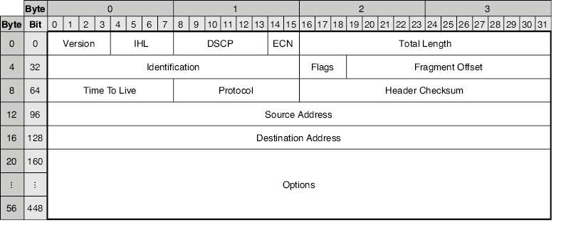

/// figura
El formato dla cabecera IPv4. El encabezado suele tener un tamaño de 20 bytes (el tamaño mínimo), pero puede tener hasta 60 bytes si se utiliza el campo Opciones.
///

Antes de examinar el propósito de cada campo del encabezado, quiero aclarar cómo leer la figura 1. Los campos del encabezado están contenidos dentro del borde grueso y deben leerse de izquierda a derecha y de arriba a abajo; el primer bit del encabezado está en la posición superior izquierda y el último bit está en la posición inferior derecha. Los números en la parte superior indican que cada fila tiene 4 bytes (32 bits) de longitud. Los números a la izquierda de cada fila indican el número de byte/bit inicial de esa fila. Por ejemplo, la segunda fila comienza en el byte 4 (el quinto byte), que es el bit 32 (el trigésimo tercer bit).
!!!note "Nota"
    En redes tendrás que acostumbrarte a contar desde 0. Por ejemplo, el rango de 0 a 31 incluye 32 bits en total: el bit 0 es el primer bit, el bit 1 es el segundo bit, etc. Asimismo, el byte 0 es el primer byte, el byte 1 es el segundo byte, el byte 2 es el tercer byte, el byte 3 es el cuarto byte, etc.

Como se indicó, el campo Opciones es opcional (y de tamaño variable), por lo que la longitud de la cabecera IPv4 es variable. Sin el campo Opciones, el encabezado tiene una longitud de 20 bytes, desde el primer bit del campo Versión hasta el último bit del campo Dirección de destino. Con el campo Opciones en su tamaño máximo (40 bytes), la cabecera IPv4 tiene 60 bytes de longitud. Sin embargo, el campo Opciones rara vez se utiliza y está más allá del alcance del examen CCNA.
!!!note "Nota"
    A los efectos del examen CCNA, no os preocupéis por memorizar la longitud y la posición de cada campo dla cabecera IPv4. Las preguntas del examen CCNA son más sustanciales que trivias como "¿Cuál es la longitud del campo X?" A los efectos de este capítulo, es suficiente tener una comprensión básica del propósito de cada campo. Este capítulo se centra en las direcciones IPv4 en los campos Dirección de origen y Dirección de destino y, en el resto de este libro, veremos otros campos con mayor detalle según sea necesario.
    
### 1.1. El campo Versión

El primer campo de la cabecera IPv4 es el campo Versión. Tiene 4 bits de longitud. Como mencioné anteriormente, existen dos versiones de IP utilizadas en las redes modernas: IPv4 e IPv6. El propósito de este campo es simple: indicar qué versión de IP se está utilizando. En las redes modernas, podéis esperar encontrar uno de dos valores en este campo:

+ Un valor de 0b0100 (0d4) indica IPv4.
+ Un valor de 0b0110 (0d6) indica IPv6.

!!!note "Nota"
    Como se mencionó en el capítulo 6, el prefijo 0b indica un número binario y el prefijo 0d indica un número decimal. Veremos cómo convertir entre los dos sistemas numéricos más adelante en este capítulo.

### 1.2. El campo IHL

El segundo campo es el campo Longitud del encabezado de Internet (IHL), que tiene una longitud de 4 bits. Este campo se utiliza para indicar la longitud de la cabecera IPv4. La razón por la que este campo es necesario es porque el encabezado IP tiene una longitud variable, dependiendo de si el campo Opciones está presente o no (y el campo Opciones en sí también tiene una longitud variable).

El campo IHL indica la longitud de la cabecera IPv4 en incrementos de 4 bytes. Por ejemplo, si el valor de este campo es 5, significa que el encabezado tiene 20 bytes de longitud (la longitud mínima dla cabecera IPv4).
!!!note "Nota"
    No se debe utilizar un valor inferior a 5 en este campo porque la cabecera IPv4 no puede tener menos de 20 bytes de longitud.

Cualquier valor mayor que 5 en el campo IHL indica que el campo Opciones está presente en el encabezado. El valor máximo del campo IHL es 15, lo que indica que el encabezado tiene una longitud de 60 bytes (la longitud máxima dla cabecera IPv4). En ese caso, el campo Opciones tiene una longitud de 40 bytes y el resto del encabezado tiene 20 bytes.
### 1.3. Los campos DSCP y ECN

Los dos campos siguientes son Punto de código de servicios diferenciados (DSCP), que tiene una longitud de 6 bits, y Notificación de congestión explícita (ECN), que tiene una longitud de 2 bits. Este byte dla cabecera IPv4 solía llamarse campo Tipo de servicio y todavía lo es a veces, pero DSCP + ECN es la definición actual.

Estos campos se utilizan para la Calidad de servicio (QoS), que es una característica de la red que se utiliza para priorizar tipos específicos de tráfico de red sobre otros tipos. Un caso de uso común de QoS es priorizar el tráfico de red sensible a demoras, tráfico de red para el cual es muy importante llegar al destino lo antes posible, sin demoras. Un ejemplo de esto es el tráfico de voz y video; Creo que la mayoría de nosotros sabemos lo frustrante que puede ser tener una llamada de Zoom (o una llamada usando cualquier aplicación similar) de mala calidad. QoS ayuda a garantizar que este tráfico se reenvíe con el menor retraso posible.
!!!note "Nota"
    QoS es otro tema del examen CCNA y lo cubriremos en el capítulo 10 del volumen 2 de este libro.
    ### El campo Longitud total

El campo Longitud total es un campo de 16 bits que indica la longitud total del paquete: la cabecera IPv4 y su carga útil. No confundáis esto con el campo IHL, que indica únicamente la longitud de la cabecera IPv4. La figura 2 ilustra la diferencia entre los campos IHL y Longitud total.
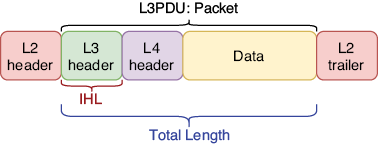

/// figura
La diferencia entre los campos IHL y Longitud total. El campo IHL indica la longitud de la cabecera IPv4 (encabezado de capa 3), mientras que el campo Longitud total indica la longitud de todo el paquete. El encabezado y el final de la Capa 2 se muestran para enfatizar que un paquete siempre se encapsulará en una trama antes de enviarse; un paquete por sí solo no está listo para ser enviado a través del medio físico.
///

Otra diferencia entre los campos IHL y Longitud total es que el valor del campo Longitud total indica la longitud del paquete en bytes, en lugar de incrementos de 4 bytes. Por ejemplo, un valor de 100 en el campo Longitud total significa que el paquete tiene 100 bytes de longitud y un valor de 1000 en el campo Longitud total significa que el paquete tiene 1000 bytes de longitud.

### 1.4. Los campos Identificación, Indicadores y Desplazamiento de fragmentos

Los campos Identificación, Indicadores y Desplazamiento de fragmentos, de 32 bits en total, se utilizan juntos para admitir la fragmentación de paquetes, cuando un paquete se divide en varios paquetes más pequeños llamados fragmentos. IPv4 utiliza un concepto llamado unidad máxima de transmisión (MTU) para indicar el tamaño máximo que debe tener un paquete, y cualquier paquete mayor que la MTU se fragmentará. Luego, el host de destino final del paquete vuelve a ensamblar los fragmentos para restaurar el paquete original.

La MTU típica es de 1500 bytes y debería ser compatible con todos los dispositivos modernos. Sin embargo, si por alguna razón un enrutador en la ruta del paquete hacia el destino tiene una MTU más baja, fragmentará el paquete. Otra posibilidad es que un host envíe paquetes más grandes que el tamaño estándar de 1500 bytes (a veces se utilizan tamaños de paquetes de hasta 9000 bytes). Si un enrutador en el camino hacia el destino no admite esos paquetes más grandes, los fragmentará. Examinemos brevemente el papel de cada uno de estos tres campos.

### 1.5. Campo de identificación

Este campo tiene 16 bits de longitud y se utiliza para identificar a qué paquete original pertenece un fragmento. Cuando se fragmenta un paquete, todos sus fragmentos deben tener el mismo valor en este campo.

### 1.6. Campo para flags

Este campo tiene 3 bits de longitud y se utiliza para controlar e identificar fragmentos. Los 3 bits de este campo (bit 0, bit 1 y bit 2) se definen de la siguiente manera:

+ Bit 0: Reservado: el uso de este bit no se ha definido, por lo que siempre está establecido en 0.
+ Bit 1: bit de No fragmentar (DF): si este bit se establece en 1, significa que el paquete no debe fragmentarse. En ese caso, si el tamaño del paquete es mayor que la MTU, será descartado.
+ Bit 2: bit Más fragmentos (MF): si este bit se establece en 1, significa que quedan más fragmentos; este no es el último. El fragmento final del paquete tendrá un valor de 0 en este campo (lo que indica que no hay más fragmentos). Un paquete no fragmentado siempre tendrá un valor de 0 para este bit.

### 1.7. Campo de desplazamiento de fragmento

Este campo tiene 13 bits de longitud y se utiliza para indicar la posición del fragmento dentro del paquete original. Esto permite volver a ensamblar paquetes fragmentados incluso si los fragmentos llegan desordenados. Esto es poco común, pero si hay múltiples caminos hacia un destino, diferentes fragmentos pueden tomar caminos diferentes, en cuyo caso pueden llegar al destino desordenados.

### 1.8. El campo TTL

El campo Tiempo de vida (TTL) es un campo de 8 bits. Cuando un host envía un paquete, establecerá un valor inicial en este campo (un valor común es 64) y luego cada enrutador que reenvíe el paquete disminuirá el valor en este campo en 1. Si el valor llega a 0, el enrutador descartará el paquete.

La razón de este mecanismo es evitar que los paquetes circulen infinitamente por la red. Un bucle es cuando un mensaje viaja por la red sin poder encontrar su destino. Por ejemplo, si hay tres enrutadores (R1, R2 y R3), se podría pasar un paquete en bucle de R1 a R2, de R2 a R3, de R3 a R1, de R1 a R2, de R2 a R3, etc. en un bucle. La figura 3 muestra un ejemplo de un paquete en bucle que se descarta gracias al campo TTL.
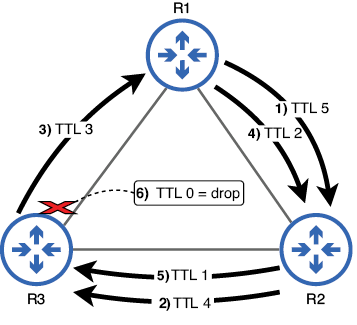

/// figura
Un paquete en bucle se descarta debido al mecanismo TTL. (1) R1 reenvía el paquete a R2 con un TTL de 5. (2) R2 reenvía el paquete a R3 con un TTL de 4. (3) R3 reenvía el paquete a R1 con un TTL de 3. (4) R1 reenvía el paquete a R2 con un TTL de 2. (5) R2 reenvía el paquete a R3 con un TTL de 1. (6) R3 quiere reenviar el paquete a R1 pero descarta el paquete porque debe disminuir el TTL a 0.
///

No deberían producirse bucles en una red configurada correctamente, pero pueden ocurrir errores. El campo TTL evita que los paquetes se repitan indefinidamente; una vez que el TTL del paquete llegue a 0, se descartará.
### 1.9. El campo Protocolo

El campo Protocolo tiene 8 bits de longitud y se utiliza para indicar qué tipo de mensaje se encapsula dentro del paquete. Esto es similar al campo EtherType del encabezado Ethernet, que indica el tipo de mensaje encapsulado en la trama (por ejemplo, un paquete IPv4 o un paquete IPv6).

En el capítulo anterior, cubrimos la utilidad ping, que es un componente de ICMP. Si un paquete contiene un mensaje ICMP, se indica con un valor de 1 en este campo. Los siguientes son los valores del campo Protocolo de algunos protocolos que cubriremos en este libro:

    1—ICMP
    6—Protocolo de control de transmisión (TCP)
    17—Protocolo de datagramas de usuario (UDP)
    89—Abrir primero la ruta más corta (OSPF)

### 1.10. El campo Suma de comprobación del encabezado

El campo Suma de comprobación del encabezado tiene 16 bits de longitud y se utiliza para comprobar si hay errores en la cabecera IPv4. El mecanismo es similar al FCS del tráiler Ethernet. Sin embargo, una diferencia importante es que el campo Suma de comprobación del encabezado solo busca errores en la cabecera IPv4, no en todo el paquete. Por otro lado, el campo Ethernet FCS no solo busca errores en el encabezado de Ethernet; busca errores en todo el trama.

### 1.11. Los campos Dirección de origen y Dirección de destino

Estos dos campos contienen la dirección IP del host que envía el paquete (campo Dirección de origen) y del destinatario previsto (campo Dirección de destino). Cada uno tiene una longitud de 32 bits, la longitud de una dirección IPv4. Cubriremos la estructura de las direcciones IPv4 con detalle más adelante en este capítulo.

### 1.12. El campo Opciones

El último campo dla cabecera IPv4 es el campo Opciones. Como se mencionó anteriormente, este campo es opcional y de longitud variable: desde 0 bytes (si no se usa) hasta 40 bytes de longitud; Esta es la razón por la que la cabecera IPv4 requiere un campo para indicar la longitud del encabezado. Este campo rara vez se utiliza y sus casos de uso están más allá del alcance del examen CCNA.

## 2. El sistema numérico binario

Para comprender las direcciones IPv4, debéis comprender el sistema numérico binario, así como también cómo convertir entre números binarios y decimales. Y para entender cómo funcionan los números binarios, primero revisemos cómo funcionan los números decimales. Todos estamos familiarizados con los números decimales porque los usamos en nuestra vida diaria, pero muchos de nosotros no pensamos en cómo funciona realmente el sistema numérico decimal.

### 2.1. Decimal

El sistema numérico decimal utiliza 10 dígitos: 0, 1, 2, 3, 4, 5, 6, 7, 8 y 9. Todos los valores se expresan utilizando esos 10 dígitos. Por esta razón, el sistema numérico decimal también se llama base 10. Los valores del 0 al 9 se pueden expresar con un solo dígito, pero para expresar valores mayores, tenemos que usar más dígitos. Por ejemplo, el número después de 0d9 es 0d10: un 1 en la posición de las decenas y un 0 en la posición de las unidades.

Después de contar hasta 0d99 (9 en la posición de las decenas y 9 en la posición de las unidades), tenemos que sumar un tercer dígito; el número después de 0d99 es 0d100: un 1 en la posición de las centenas y un 0 tanto en la posición de las decenas como de las unidades. Debido a que el decimal usa 10 dígitos, el valor de cada posición adicional aumenta diez veces a medida que agrega más dígitos: 1, luego 10, luego 100, luego 1000, etc. Por eso, en el número 1009 (por ejemplo), el 1 de la izquierda tiene un valor mayor que el 9 de la derecha, aunque por sí solo, el número 9 tiene un valor mayor que el número 1.

### 2.2. Binario

Contar en el sistema binario sigue el mismo proceso pero con solo dos dígitos: 0 y 1. Por esta razón, el sistema numérico binario también se llama base 2. Solo los valores 0 y 1 se pueden expresar con un solo dígito; para expresar valores mayores, tenemos que agregar más dígitos.

El valor después de 0b1 es 0b10: un 1 en la posición de los dos y un 0 en la posición de las unidades; esto equivale a 0d2. Después de 0b10 está 0b11 (equivalente a 0d3), y luego, una vez más, ambas posiciones han alcanzado su valor máximo, por lo que se necesita un tercer dígito. Esto da como resultado 0b100 (equivalente a 0d4). Mientras que el valor de cada posición decimal se multiplica por 10, el valor de cada posición binaria se duplica porque el binario utiliza dos dígitos. La figura 4 muestra un número binario de ocho dígitos con el valor de cada posición encima de cada bit (dígito binario).
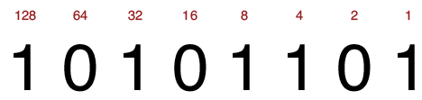

/// figura
Un número de 8 bits (1 byte) con el valor de cada bit escrito arriba. El equivalente decimal de 0b10101101 es 0d173. Esto se puede calcular sumando el valor de cada bit que se establece en 1.
///

!!!note "Nota"
    El dígito más a la derecha de un número binario se llama bit menos significativo porque tiene el menor valor. El dígito más a la izquierda se llama bit más significativo porque tiene el mayor valor.

La Tabla 1 enumera algunos números decimales y sus equivalentes binarios. Con sólo dos dígitos disponibles, los números binarios crecen rápidamente en tamaño (el valor después de 0b11111 sería 0b100000). Por eso, aunque las computadoras usan números binarios, convertimos esos valores binarios a otros sistemas numéricos (decimal y hexadecimal) para hacerlos más legibles para los humanos.
Tabla 1 Números decimales y sus equivalentes binarios (ver figura de la tabla)

| Dec | Bin   |     | Dec | Bin   |     | Dec | Bin    |     | Dec | Bin    |
|-----|-------|-----|-----|-------|-----|-----|--------|-----|-----|--------|
| 0   | 0     |     | 8   | 1000  |     | 16  | 10000  |     | 24  | 11000  |
| 1   | 1     |     | 9   | 1001  |     | 17  | 10001  |     | 25  | 11001  |
| 2   | 10    |     | 10  | 1010  |     | 18  | 10010  |     | 26  | 11010  |
| 3   | 11    |     | 11  | 1011  |     | 19  | 10011  |     | 27  | 11011  |
| 4   | 100   |     | 12  | 1100  |     | 20  | 10100  |     | 28  | 11100  |
| 5   | 101   |     | 13  | 1101  |     | 21  | 10101  |     | 29  | 11101  |
| 6   | 110   |     | 14  | 1110  |     | 22  | 10110  |     | 30  | 11110  |
| 7   | 111   |     | 15  | 1111  |     | 23  | 10111  |     | 31  | 11111  |

Aunque las direcciones IPv4 tienen una longitud de 32 bits, la buena noticia es que sólo tenéis que poder convertir entre binario y decimal para números de hasta 8 bits de longitud. Esto se debe a que las direcciones IPv4 se dividen en cuatro grupos de 8 bits, lo que las hace más manejables.
Convertir números binarios a decimales

Convertir números binarios a decimales es un proceso simple: simplemente sume los valores de los bits establecidos en 1. La figura 5 demuestra este proceso.
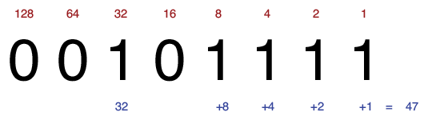

/// figura
El número binario 00101111 es igual a 47 en decimal. Para calcular esto, suma el valor de cada bit que está establecido en 1: 32 + 8 + 4 + 2 + 1 = 47.
///

Recomiendo encarecidamente dedicar algo de tiempo a practicar esto. Para hacerlo, escriba algunos números aleatorios de 8 bits (11011010, 01011100, 11101110, etc.) y practique convirtiéndolos a decimal. Con un poco de práctica, deberías poder convertir de binario a decimal en tu cabeza, sin escribir el valor de cada bit. Para comprobar sus respuestas, puede hacer una búsqueda rápida en Internet de "convertidor de binario a decimal"; Hay muchas herramientas gratuitas disponibles.
!!!note "Nota"
    El valor mínimo de un número de 8 bits (con todos los bits establecidos en 0) es 0d0. El valor máximo de un número de 8 bits (con todos los bits establecidos en 1) es 0d255. Por tanto, 8 bits proporcionan 256 valores posibles: desde 0d0 (0b00000000) hasta 0d255 (0b11111111).
    Convertir números decimales a binarios

La conversión de decimal a binario requiere algunos pasos más. Hay algunos métodos para hacer esto, pero la figura 6 demuestra el proceso que uso. Primero, intente restar el valor del bit más significativo (128) del número decimal. Si el resultado es un número positivo, anote el resto y escriba un 1 en esa posición de bit. Si la resta daría como resultado un valor negativo, no restes; simplemente escribid un 0 en esa posición de bit. Luego, resta el valor del segundo bit más significativo (64) del resto de la resta anterior (o del número original, si no pudiste restar 128 del número) y repite el proceso hasta llegar a 0. La figura 6 muestra cómo funciona esto:

1. Restar 128 de 206 da un resto de 78. Escribid un 1 en la posición 128.

2. Restar 64 de 78 da un resto de 14. Escribid un 1 en la posición 64.

3. 32 no se puede restar de 14. Escribid un 0 en la posición 32.

4. 16 no se puede restar de 14. Escribid un 0 en la posición 16.

5. Restar 8 de 14 da un resto de 6. Escribid un 1 en la posición 8.

6. Restar 4 de 6 da un resto de 2. Escribid un 1 en la posición 4.

7. Restar 2 de 2 da un resto de 0. Escribid un 1 en la posición 2.

8. Hemos llegado a 0, así que escribid un 1 en la posición restante. Ahora tenemos la respuesta: 0d206 equivale a 0b11001110.

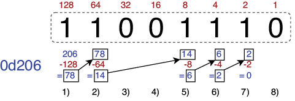

/// figura
El proceso de convertir un número decimal (206) a un número binario (11001110) restando el valor decimal de cada bit
///

En lugar de usar la resta, podéis convertir de decimal a binario usando la suma si lo prefieres. Comience con un total acumulado de 0 y agregue progresivamente los valores de cada bit, comenzando desde el bit más a la izquierda (el más significativo), sin exceder el valor del número decimal que está convirtiendo. Estos son los pasos para convertir el número decimal 206 a binario:

1. 0 + 128 = 128. Escribid un 1 en la posición 128.

2. 128 + 64 = 192. Escribid un 1 en la posición 64.

3. 192 + 32 = 224, que es mayor que 206. Escribid un 0 en la posición 32.

4. 192 + 16 = 208, que es mayor que 206. Escribid un 0 en la posición 16.

5. 192 + 8 = 200. Escribid un 1 en la posición 8.

6. 200 + 4 = 204. Escribid un 1 en la posición 4.

7. 204 + 2 = 206. Escribid un 1 en la posición 2.

8. Hemos alcanzado el valor original (206). Escribid un 0 en la posición restante.

Al igual que la conversión de binario a decimal, este proceso se vuelve mucho más fácil con la práctica y, eventualmente, deberías poder hacerlo mentalmente. Para practicar, escribid algunos números aleatorios del 0 al 255 (56, 127, 201, 199, etc.) e intentad convertirlos a binario.

Para practicar más la conversión entre decimal y binario (en ambas direcciones), podéis probar el juego binario en Cisco Learning Network: https://learningnetwork.cisco.com/s/binary-game. Probadlo varias veces al día; A medida que practiques y mejores, tus puntuaciones en el Juego Binario deberían aumentar y podrás hacer los cálculos necesarios en tu cabeza.
!!!note "Nota"
    Ser capaz de convertir rápidamente entre decimal y binario es de gran ayuda en el examen CCNA, especialmente cuando se trata de subredes (el tema del capítulo 11). El examen CCNA tiene un límite de tiempo de 2 horas; no pierda tiempo innecesariamente haciendo conversiones de binario a decimal y de decimal a binario. Un poco de práctica con el juego binario de Cisco ayuda mucho.


El binario es un tema fundamental para diversas aplicaciones en redes. Además del direccionamiento IPv4 (el tema de este capítulo), los siguientes son otros temas que requieren que usted domine el binario, incluida la conversión entre binario y decimal:

+ **Subredes IPv4:** La subred es el proceso de dividir redes en redes más pequeñas y constituye la segunda parte del tema 1.6 del examen: Configurar y verificar el direccionamiento y la subred IPv4. Para subdividir redes IPv4, es necesario poder convertir direcciones IPv4 de decimal a binario y viceversa. Abordaremos la subred en el capítulo 11 de este libro.

+ **Direccionamiento IPv6:** Este es el tema 1.8 del examen: Configurar y verificar el direccionamiento y el prefijo IPv6. Para comprender las direcciones IPv6, es necesario poder convertir entre binario, decimal y hexadecimal (ya que las direcciones IPv6 suelen escribirse en hexadecimal). Abordaremos IPv6 en la parte 5 de este libro.

+ **Enrutamiento IPv4 e IPv6:** Esto incluye casi la totalidad del dominio 3.0 de los temas del examen CCNA (Conectividad IP) y representa el 25 % del examen CCNA completo. Por ejemplo, para saber cómo un enrutador reenviará un paquete, debe identificar la ruta coincidente más específica: la ruta con la mayor cantidad de bits que coinciden con la dirección IP de destino del paquete. Para ello, debe comprender los números binarios. Cubriremos el concepto de la ruta coincidente más específica en el capítulo 9 y otros temas del dominio 3.0 en las partes 4 y 5 de este volumen. Listas de control de acceso (ACL): las ACL son el tema del examen 5.6: Configurar y verificar listas de control de acceso. Las ACL se utilizan para permitir o denegar tráfico de red específico, y lo hacen comparando los bits de la ACL configurada con los bits de las direcciones IP de origen y/o destino de un paquete. Para configurar las ACL adecuadas, debe comprender el sistema binario.

## 3. Direccionamiento IPv4

Una dirección IPv4 es un número de 32 bits que identifica un host en la Capa 3 del modelo TCP/IP. Las direcciones IP (ya sean IPv4 o IPv6) se utilizan para dirigir un mensaje a su destinatario final, a diferencia de las direcciones MAC, que se utilizan para dirigir un mensaje al siguiente salto. Mientras que se dice que los conmutadores son dispositivos de Capa 2, se dice que los enrutadores son dispositivos de Capa 3 o que operan en la Capa 3 porque toman decisiones de reenvío basándose en la dirección IP de destino de los mensajes (ubicada en el encabezado de la Capa 3).
!!!note "Nota"
    En este capítulo, veremos cómo configurar direcciones IPv4 en enrutadores, pero cubriremos cómo los enrutadores reenvían paquetes en la parte 2 de este libro.

### 3.1. La estructura de una dirección IPv4

Las direcciones IPv4 tienen 32 bits de longitud, pero una cadena de 32 bits de 1 y 0 no es muy legible ni fácil de recordar. Para facilitar su lectura, las direcciones IPv4 se representan mediante números decimales en lugar de binarios. Para simplificarlo aún más, primero dividimos la dirección IPv4 de 32 bits en cuatro grupos de 8 bits llamados octetos, separados por un punto, y luego convertimos cada uno de los octetos a decimal; esto se llama notación decimal con puntos. Es por eso que, para los fines de CCNA, solo necesita poder convertir entre binario y decimal para números de hasta 8 bits. La figura 7 muestra una dirección IPv4 escrita en decimal con puntos y en binario.
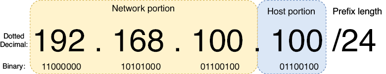

/// figura
Una dirección IPv4 escrita tanto en decimal con puntos como en binario. La dirección de 32 bits se divide en cuatro octetos de 8 bits cada uno. La dirección se divide en dos partes: la parte de red y la parte de host. La longitud del prefijo indica el tamaño de la parte de la red en bits y el resto es la parte del host.
///

#### 3.1.1. Octeto y byte

Quizás te preguntes cuál es la diferencia entre un octeto y un byte, los cuales he definido como un grupo de 8 bits. Un octeto siempre significa 8 bits. Sin embargo, un byte no es necesariamente 8 bits; un byte es la unidad mínima de datos que una computadora puede leer o escribir al mismo tiempo. Casi siempre es de 8 bits, pero en el pasado había computadoras que usaban bytes de 6, 7 y 9 bits. Por lo tanto, el término octeto se utiliza a veces para referirse a un grupo de 8 bits. En el contexto de las direcciones IPv4, se prefiere el octeto.
Longitud del prefijo

El tamaño de la parte de red de una dirección IP se puede indicar con una longitud de prefijo en el formato /X, donde X es el número de bits en la parte de red. En la figura 7, la dirección IPv4 va seguida de /24, lo que indica que la parte de red de la dirección tiene una longitud de 24 bits. De eso, podemos inferir que los 8 bits restantes son la porción del host.
!!!note "Nota"
    La parte de red de una dirección IPv4 a menudo se denomina prefijo o prefijo de red.

Todos los hosts en la misma LAN que el host con dirección IPv4 192.168.100.100 compartirán la misma porción de red; los primeros tres octetos de sus direcciones IPv4 serán los mismos (192.168.100). Sin embargo, cada host tendrá una porción de host única; el octeto final será único. Algunas direcciones posibles de otros hosts en la LAN podrían ser 192.168.100.1, 192.168.100.178, 192.168.100.234, etc.

La figura 8 muestra dos redes: LAN 1 y LAN 2. Observe que la dirección IP de cada host en LAN 1 comienza con 192.168.1 y la dirección IP de cada host en LAN 2 comienza con 192.168.2. El enrutador (R1) sirve para conectar las dos LAN; su interfaz G0/0 tiene la dirección IP 192.168.1.1/24 y su interfaz G0/1 tiene la dirección IP 192.168.2.1/24. Los hosts en las LAN separadas pueden comunicarse entre sí a través del R1. Tened en cuenta que los conmutadores no tienen direcciones IP; esto se debe a que los conmutadores no reconocen la Capa 3. Los conmutadores operan en la Capa 2 del modelo TCP/IP y no intervienen en la Capa 3.

!!!note "Nota"
    Cuando se habla de enrutadores, normalmente se utiliza el término interfaz en lugar de puerto.

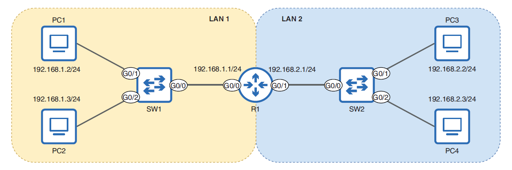

/// figura
Dos redes (LAN 1 y LAN 2) conectadas a través de un enrutador (R1). Las direcciones IP de los hosts en cada LAN comparten la misma porción de red: 192.168.1 en LAN 1 y 192.168.2 en LAN 2.
///

!!!note "Nota"
    El significado exacto del término red puede variar. Se podría decir que la figura 8 muestra una red que consta de dos LAN. Sin embargo, en el contexto de las direcciones IP y las longitudes de los prefijos, se puede pensar que una red es sinónimo de una LAN: un grupo de dispositivos que pueden comunicarse directamente entre sí, sin el uso de un enrutador.
    Máscaras de red

En lugar de indicar la longitud del prefijo con /X, otro método común es utilizar una máscara de red: otra cadena de 32 bits que se empareja con una dirección IP para indicar qué bits de la dirección IP son la parte de la red y cuáles son la parte del host. Un bit en la máscara de red establecido en 1 significa que el bit en la misma posición de la dirección IP es parte de la porción de red; un bit en la máscara de red establecido en 0 significa que el bit en la misma posición de la dirección IP es parte de la parte del host.

Al igual que las direcciones IPv4, las máscaras de red suelen escribirse en notación decimal con puntos. La figura 9 muestra una dirección IPv4 (172.16.20.21) con una máscara de red (255.255.0.0). Los primeros 16 bits de la máscara de red son 1, lo que significa que los primeros 16 bits de la dirección IPv4 son la parte de la red.
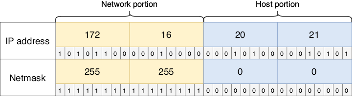

/// figura
Una dirección IPv4 (arriba) y su máscara de red (abajo). Los primeros 16 bits de la máscara de red se establecen en 1, lo que indica que los primeros 16 bits de la dirección IPv4 son la parte de la red. Esto equivale a una longitud de prefijo /16.
///

!!!note "Nota"
    Una máscara de red suele denominarse máscara de subred; Cubriremos el tema de las subredes más adelante.

Se debe estar familiarizado con ambos métodos para indicar la longitud de la parte de red de una dirección IPv4: usar la notación /X y usar una máscara de red. Generalmente usaré la notación /X porque es más simple, pero como se verá más adelante en este capítulo, la configuración de direcciones IPv4 en Cisco IOS requiere el uso de máscaras de red. A continuación se muestran algunas longitudes de prefijos y sus máscaras de red equivalentes para comparar:

+ Longitud del prefijo: /8 = máscara de red: 255.0.0.0
+ Longitud del prefijo: /16 = máscara de red: 255.255.0.0
+ Longitud del prefijo: /24 = máscara de red: 255.255.255.0

!!!note "Nota"
    Una máscara de red es siempre una serie de unos seguidos de una serie de ceros; esto se debe a que las direcciones IPv4 siempre están estructuradas para tener la parte de la red a la izquierda (los bits más significativos) y la parte del host a la derecha (los bits menos significativos). Máscaras de red como 0.0.0.255 o 255.0.255.0 no son posibles.

### 3.2. Configuración de direcciones IPv4 en un enrutador

A diferencia de las direcciones MAC, que el fabricante asigna a un dispositivo, las direcciones IP deben ser asignadas por el ingeniero o administrador que configura el dispositivo. Veamos cómo configurar direcciones IP en un enrutador Cisco.

!!!note "Nota"
    Los hosts finales, como las PC, generalmente reciben sus direcciones IP automáticamente mediante el Protocolo de configuración dinámica de host (DHCP), el tema del capítulo 4 del volumen 2. Sin embargo, las direcciones IP de los dispositivos de infraestructura de red, como los enrutadores, generalmente se configuran manualmente.

La figura 10 amplía el R1 desde la figura 8 y muestra cómo configurar direcciones IP y habilitar las interfaces G0/0 y G0/1 del R1. En el resto de esta sección, analizaremos estas configuraciones y usaremos los comandos show para verificar el estado de las interfaces de R1 antes y después de la configuración. Estos son los pasos básicos:

1. Desde el modo EXEC de usuario, pase al modo EXEC privilegiado y luego al modo de configuración global.
2. Acceda al modo de configuración de la interfaz G0/0, configure una dirección IP y una máscara de red, y habilite la interfaz.
3. Acceda al modo de configuración de la interfaz G0/1, configure una dirección IP y una máscara de red, y habilite la interfaz.

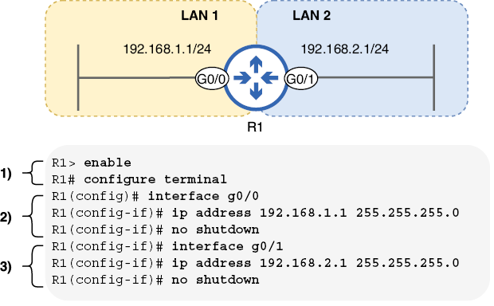

/// figura
Cómo configurar direcciones IP y habilitar interfaces de enrutador. R1 está conectado a dos LAN: 192.168.1.1/24 (G0/0) y 192.168.2.1/24 (G0/1).
///
!!!note "Nota"
    Los interruptores y PC presentes en la figura 8 han sido reemplazados por líneas perpendiculares al final de las conexiones en la figura 10. Esta es una técnica común en los diagramas de red para indicar que una LAN está conectada a una interfaz, pero sus detalles no son importantes para el diagrama. La figura 10 se centra en R1, por lo que no es necesario mostrar los conmutadores y las PC.
    Preverificación

Confirmemos el estado predeterminado de las interfaces de R1 antes de configurarlas; antes de configurar un dispositivo, es mejor confirmar el estado actual del dispositivo. Un comando conveniente para ver las interfaces de un enrutador es show ip interface brief, ejecutado en modo EXEC de usuario o EXEC privilegiado. ¡Usarás mucho este comando! El siguiente ejemplo muestra el resultado del comando en R1 antes de configurar sus interfaces:

```
R1# show ip interface brief
Interface           IP-Address   OK? Method Status                 Protocol
GigabitEthernet0/0  unassigned   YES unset  administratively down  down
GigabitEthernet0/1  unassigned   YES unset  administratively down  down
GigabitEthernet0/2  unassigned   YES unset  administratively down  down
GigabitEthernet0/3  unassigned   YES unset  administratively down  down
```

La columna Interfaz enumera las interfaces de R1; tiene cuatro y configuraremos dos de ellas. La columna Dirección IP enumerará la dirección IP de cada interfaz después de que las hayamos configurado, pero actualmente solo indica no asignada. La columna Estado enumera el estado físico de cada interfaz. Si la interfaz está conectada a otro dispositivo, el estado será activo; si no es así, el estado estará inactivo y, si la interfaz se desactiva manualmente, estará inactiva administrativamente (independientemente de si está conectada a otro dispositivo). Como se mostró anteriormente, el estado predeterminado es administrativamente inactivo: las interfaces del enrutador Cisco están deshabilitadas de forma predeterminada y deben habilitarse manualmente.

La columna Protocolo indica si el protocolo de Capa 2 de la interfaz está funcionando correctamente. Para una interfaz Ethernet, esto es bastante simple: si la columna Estado dice arriba, el Protocolo también debería estar activo. Si la columna Estado dice inactivo o administrativamente inactivo, el protocolo debería estar inactivo.
Configuración

Para configurar las interfaces de un dispositivo, debemos utilizar un nuevo modo en la jerarquía de la CLI de IOS: el modo de configuración de interfaz. Para acceder al modo de configuración de la interfaz, utilice el comando interface interface-name desde el modo de configuración global. El siguiente ejemplo demuestra esto:

```
R1# configure terminal
Enter configuration commands, one per line.  End with CNTL/Z.
R1(config)# interface gigabitethernet0/0
R1(config-if)#
```

Observad que el mensaje cambia de `R1(config)#` a `R1(config-if)#`, lo que indica el modo de configuración de la interfaz. El nombre de la interfaz que está configurando no se muestra en el mensaje, por lo que antes de realizar cualquier configuración, recomiendo verificar que haya utilizado el nombre de interfaz correcto después del comando de interfaz.

!!!note "Nota"
    En lugar de usar el comando interface gigabitethernet0/0 para ingresar al modo de configuración de interfaz para la interfaz G0/0, podéis usar la interfaz g0/0; no es necesario escribir el nombre completo de la interfaz.

El comando para configurar la dirección IP de una interfaz es dirección ip dirección-ip máscara de red; Como mencioné anteriormente, es necesario conocer las máscaras de red al configurar direcciones IP en Cisco IOS. En el siguiente ejemplo, configuro la dirección IP de la interfaz G0/0 del R1. La máscara de red es 255.255.255.0 porque la longitud del prefijo es /24: los primeros 24 bits de la máscara de red se establecen en 1 y los últimos 8 se establecen en 0:

```
R1(config-if)# ip address 192.168.1.1 255.255.255.0
```

Sin embargo, G0/0 todavía no está listo para reenviar tráfico; la interfaz todavía está deshabilitada. Para cambiar eso, debe usar el comando no apagar, como se muestra en el siguiente ejemplo. Después de emitir el comando, se muestran dos mensajes que indican que la interfaz está en funcionamiento. El primer mensaje indica que la interfaz está operativa físicamente (la columna Estado del resumen de la interfaz show ip) y el segundo mensaje indica que el protocolo de Capa 2 está operativo (la columna Protocolo del resumen de la interfaz show ip):

```
R1(config-if)# no shutdown
%LINK-3-UPDOWN: Interface GigabitEthernet0/0,
 changed state to up
%LINEPROTO-5-UPDOWN: Line protocol on Interface
 GigabitEthernet0/0, changed state to up
```

!!!note "Nota"
    Como se mencionó en el capítulo 5, no se podéis usar delante de un comando para eliminarlo de la configuración. Las interfaces del enrutador están deshabilitadas de forma predeterminada porque se les aplica el comando de apagado; el comando no apagado lo elimina y por lo tanto habilita la interfaz.

La interfaz G0/0 de R1 ahora tiene una dirección IP y está habilitada: está lista para reenviar tráfico. A continuación configuremos la interfaz G0/1, como en el siguiente ejemplo:

```
R1(config-if)# interface g0/1
R1(config-if)# ip address 192.168.2.1 255.255.255.0
R1(config-if)# no shutdown
%LINK-3-UPDOWN: Interface GigabitEthernet0/1, changed state to up
%LINEPROTO-5-UPDOWN: Line protocol on Interface GigabitEthernet0/1, changed state to up
```

!!!note "Nota"
    Para acceder al modo de configuración de interfaz para otra interfaz, no es necesario volver al modo de configuración global; podéis hacerlo directamente desde el modo de configuración de la interfaz. Tened en cuenta que no hay ninguna indicación de que cambié de configurar G0/0 a G0/1; nuevamente, siempre verifique que haya utilizado el nombre de interfaz correcto después del comando de interfaz.

#### 3.2.1. Verificación final

G0/0 y G0/1 de R1 están configurados y habilitados. Después de la configuración, siempre es una buena idea verificar que las configuraciones sean correctas. En el siguiente ejemplo, utilicé una vez más el comando show ip interface brief para verificar:

```
R1# show ip interface brief
Interface           IP-Address   OK? Method Status                 Protocol
GigabitEthernet0/0  192.168.1.1  YES manual up                     up
GigabitEthernet0/1  192.168.2.1  YES manual up                     up
GigabitEthernet0/2  unassigned   YES unset  administratively down  down    
GigabitEthernet0/3  unassigned   YES unset  administratively down  down
```

Observe que G0/0 y G0/1 tienen las direcciones IP correctas y están en las columnas Estado y Protocolo. Sin embargo, show ip interface brief no muestra la máscara de red. Para verificar que la máscara de red sea correcta, podéis usar el comando show ip interface [nombre-interfaz], como en el siguiente ejemplo. Tened en cuenta que, aunque debe utilizar una máscara de red al configurar direcciones IP, la longitud del prefijo se muestra como /X en el resultado de este comando. Este comando muestra una gran cantidad de resultados, por lo que solo incluyo las primeras líneas de cada interfaz:

```
R1# show ip interface
GigabitEthernet0/0 is up, line protocol is up
  Internet address is 192.168.1.1/24
  Broadcast address is 255.255.255.255
  Address determined by setup command
  MTU is 1500 bytes
. . .
GigabitEthernet0/1 is up, line protocol is up
  Internet address is 192.168.2.1/24
  Broadcast address is 255.255.255.255
  Address determined by setup command
  MTU is 1500 bytes
. . .
```

!!!note "Nota"
    Al indicar el formato de un comando, las palabras clave y los argumentos entre corchetes son opcionales. El comando show ip interface es válido por sí solo y muestra información para todas las interfaces; sin embargo, show ip interface g0/0 limita la salida solo a la interfaz indicada. Además de la longitud del prefijo, hay dos cosas más que me gustaría señalar sobre el resultado anterior, relacionadas con otros temas cubiertos en este capítulo: primero, la línea La dirección de transmisión es 255.255.255.255 indica la dirección IP que se usará para enviar un mensaje a todos los hosts en la red local: 255.255.255.255. Esta es una dirección IP especialmente reservada para paquetes de transmisión. Si R1 desea enviar un mensaje a todos los hosts en la LAN 1, enviará un paquete dirigido a 255.255.255.255 desde su interfaz G0/0 (encapsulado en una trama dirigida a la dirección MAC ffff.ffff.ffff).

En segundo lugar, la línea final de la MTU de estados de salida incluidos es de 1500 bytes. Como mencionamos cuando observamos la cabecera IPv4, esto significa que si R1 tiene que reenviar una trama de más de 1500 bytes desde cualquiera de sus interfaces, primero debe fragmentar el paquete.

!!!note "Nota"
    Después de verificar que las configuraciones son correctas, siempre es una buena idea guardar la configuración con uno de los comandos tratados en el capítulo 5: escribir, escribir en memoria o copiar running-config startup-config.

R1 ahora está listo para reenviar tráfico entre LAN 1 y LAN 2. La figura 11 muestra cómo la PC1 puede enviar un paquete a la PC3 a través de R1; La PC1 envía el paquete en una trama dirigida a la dirección MAC de la interfaz G0/0 del R1 y luego el R1 reenvía el paquete en una trama dirigida a la dirección MAC de la PC3. Recuerde que la Capa 3 proporciona entrega de un extremo a otro y la Capa 2 proporciona entrega de salto a salto. Aunque no se muestra en el diagrama, antes de que la PC1 pueda encapsular el paquete en una trama, debe usar ARP para conocer la dirección MAC de R1 G0/0. Asimismo, R1 debe usar ARP para conocer la dirección MAC de la PC3.

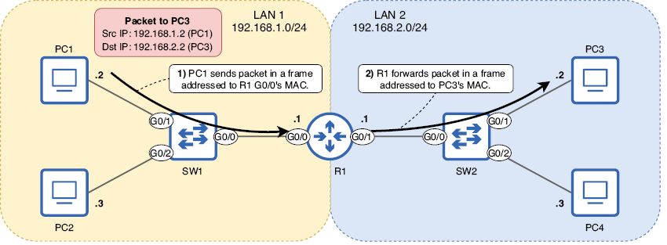

/// figura
La PC1 envía un paquete a la PC3 a través del R1. El paquete se dirige a la dirección IP de la PC3. (1) La PC1 envía el paquete en una trama dirigida a la dirección MAC de la interfaz G0/0 del R1. (2) R1 reenvía el paquete en una trama dirigida a la dirección MAC de la PC3. Para que R1 cumpla su propósito de conectar las dos redes, debe tener una dirección IP adecuada en cada una de sus interfaces, que configuramos en esta sección.
///

!!!note "Nota"
    La figura 11 indica la dirección IP de cada host de manera diferente que en los diagramas anteriores. La dirección de red (tratada en la sección correspondiente) se escribe junto al nombre de cada LAN, y solo la parte del host de la dirección IP de cada host se escribe junto al host. Esta es una técnica común para reducir la cantidad de texto en un diagrama. Tanto la PC1 como la PC3 tienen .2 escrito al lado, pero sus direcciones IP no son las mismas; la parte de red de la dirección IP de la PC1 es 192.168.1 y la de la PC3 es 192.168.2. La misma lógica se aplica para PC2 y PC4.

Para que un enrutador reenvíe paquetes a redes remotas (que no están conectadas directamente al enrutador), se requieren configuraciones adicionales; Cubriremos esas configuraciones en capítulos posteriores de este volumen. Sin embargo, en la red de ejemplo que se muestra en la figura 11, la LAN 1 y la LAN 2 están conectadas directamente al R1; no se necesitan más configuraciones. PC1 y PC2 en LAN 1 ahora pueden comunicarse con PC3 y PC4 en LAN 2 a través de R1.

### 3.3. Atributos de una red IPv4

Cada red IPv4 tiene algunos atributos que debería poder identificar: la dirección de red, la dirección de transmisión, la cantidad máxima de hosts, la primera dirección utilizable y la última dirección utilizable de la red.

#### 3.3.1. Dirección de red

La dirección de red es la primera dirección de cualquier red y se utiliza para identificar la red; no se puede asignar a un host. Una dirección IPv4 es una dirección de red si todos los bits de su parte de host están establecidos en 0. La figura 12 muestra un ejemplo: 192.168.100.0/24.

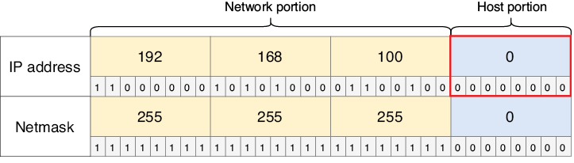

/// figura
192.168.100.0 es una dirección de red, como indica la parte de host `00000000`. Esta dirección identifica toda la red 192.168.100.0/24 y no se puede asignar a un host. 192.168.100.100 (utilizada en la figura 7) es una dirección de host de esa red.
///

#### 3.3.2. Dirección de broadcast

La dirección de transmisión es la última dirección de cualquier red y, al igual que la dirección de red, no se puede asignar a un host. La dirección de transmisión se puede utilizar para enviar un mensaje a todos los hosts de la red local. Una dirección IPv4 es una dirección de transmisión si todos los bits de su porción de host están configurados en 1. La figura 13 muestra la dirección de transmisión de la red 192.168.100.0/24.
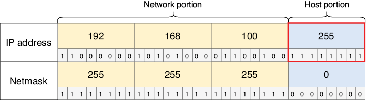

/// figura
192.168.100.255 es una dirección de transmisión, como lo indica la parte del host de 11111111. Esta dirección se puede usar para enviar un mensaje a todos los hosts en la red 192.168.100.0/24.
///

!!!note "Nota"
    Para enviar un mensaje a todos los dispositivos de la red local, los hosts normalmente envían los mensajes a 255.255.255.255, en lugar de a la dirección de transmisión de su red local. 255.255.255.255 es una dirección de transmisión especialmente reservada. Sin embargo, los hosts de otras redes pueden utilizar la dirección de transmisión 192.168.100.255 para enviar un mensaje a todos los hosts de la red 192.168.100.0/24.

#### 3.3.3. Número máximo de hosts

La cantidad máxima de hosts en una red es la cantidad de direcciones IP disponibles para asignar a los hosts conectados a la red. Para calcular la cantidad total de direcciones IP en una red, la fórmula es 2y, donde y es la cantidad de bits de host. Por ejemplo, con una longitud de prefijo /24, hay ocho bits de host; 28 es igual a 256, por lo que hay 256 direcciones IP en total en una red /24 (como 192.168.100.0/24).

Sin embargo, debido a que la red y las direcciones de transmisión de cada red no se pueden asignar a los hosts, tenemos que restar 2 del número total de direcciones en la red para encontrar el número máximo de hosts. Por lo tanto, la fórmula para determinar el número máximo de hosts en una red es en realidad 2y − 2. Por ejemplo, el número máximo de hosts de una red /24 es 254 (28 − 2). Los siguientes son el número máximo de hosts en redes con longitudes de prefijo /8, /16 y /24:

+ /8: 224 – 2 = 16.777.214 hosts
+ /16: 216 – 2 = 65.534 hosts
+ /24: 28 – 2 = 254 anfitriones

#### 3.3.4. Primera y última dirección utilizable

La primera dirección utilizable de una red es la primera dirección IP que se puede asignar a un host; en otras palabras, es la primera dirección IP después de la dirección de red. Es sencillo de calcular: simplemente agregue uno a la dirección de red (cambie el bit menos significativo a 1). La figura 14 muestra la primera dirección utilizable de la red 192.168.100.0/24.

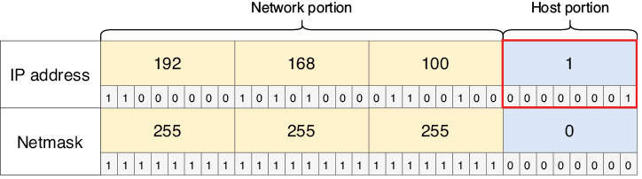

/// figura
192.168.100.1 es la primera dirección utilizable de la red 192.168.100.0/24. Es la primera dirección después de la dirección de red.
///

!!!note "Nota"
    La primera dirección utilizable de una red suele asignarse al enrutador de esa red. Por ejemplo, en la sección anterior, asignamos las direcciones IP 192.168.1.1 y 192.168.2.1 a las interfaces del R1, las primeras direcciones utilizables de sus respectivas redes.

La última dirección utilizable de una red es la última dirección IP que se puede asignar a un host; es la última dirección IP antes de la dirección de transmisión. Esta dirección también es fácil de encontrar: reste 1 de la dirección de transmisión (cambie el bit menos significativo a 0). La figura 15 muestra la última dirección utilizable de la red 192.168.100.0/24.


/// figura
192.168.100.254 es la última dirección utilizable de la red 192.168.100.0/24. Es la última dirección antes de la dirección de transmisión. Si conoce la primera y la última dirección utilizable, sabrá el rango de direcciones utilizables: desde la primera dirección utilizable hasta la última dirección utilizable. Por ejemplo, el rango de direcciones utilizables en la red 192.168.100.0/24 es de 192.168.100.1 a 192.168.100.254: 254 direcciones en total.
///


Para encontrar el rango de direcciones utilizables de una red, necesita conocer la primera y la última dirección utilizable de la red. Esto es bastante sencillo cuando se utiliza una longitud de prefijo de /8, /16 o /24; la división entre la porción de red y la porción de host se realiza entre octetos (en este caso, entre el segundo y el tercer octeto, porque la longitud del prefijo es /16).

Para encontrar la primera dirección utilizable, simplemente cambie los octetos de la parte del host a 0 (esta es la dirección de red) y luego agregue 1 al último octeto, por ejemplo: la dirección de la PC1 es 172.20.20.127, la dirección de red es 172.20.0.0 y la primera dirección utilizable es 172.20.0.1.

Para encontrar la última dirección utilizable, cambie los octetos de la parte del host a 255 (esta es la dirección de transmisión) y luego reste 1 del último octeto: la dirección de la PC1 es 172.20.20.127, la dirección de transmisión es 172.20.255.255 y la última dirección utilizable es 172.20.255.254. Ahora ya conoce el rango de direcciones utilizables: de 172.20.0.1 a 172.20.255.254. Por tanto, la respuesta a esta pregunta es C.

Este proceso se volverá más desafiante cuando cubramos la división en subredes en el capítulo 11 de este libro. Al dividir en subredes, utilizamos longitudes de prefijo que no encajan perfectamente entre los octetos de una dirección IP, como /19, /23, /28, etc. En ese caso, es importante ser competente en la conversión entre decimal y binario para poder identificar la red y los bits del host, convertir los bits del host a 0 o 1 según sea necesario, convertirlos nuevamente a decimal, etc.

### 3.4. Clases de direcciones IPv4

Originalmente, todas las direcciones IPv4 usaban una longitud de prefijo /8; el primer octeto identificaba la red y los últimos tres octetos identificaban el host específico dentro de esa red. Sin embargo, ese sistema pronto fue abandonado; debido a que solo los primeros 8 bits se podían usar para crear diferentes redes, solo podía haber 256 (28) redes (LAN) diferentes: de 0.x.x.x a 255.x.x.x. En el mundo moderno, donde Internet es omnipresente, no hay suficientes redes.

!!!note "Nota"
    La fórmula para calcular la cantidad de redes disponibles es 2x, donde x es la cantidad de bits en la parte de la red.

Para mejorar ese sistema y permitir más redes de varios tamaños, las direcciones IPv4 se organizaron en cinco clases: clase A, clase B, clase C, clase D y clase E. La Tabla 2 enumera las cinco clases de direcciones IPv4 y algo de información sobre ellas.

Tabla 2 Clases de direcciones IPv4 (ver figura de tabla)

| Clase | Patrón de bits del primer octeto | Rango decimal del primer octeto | Longitud de prefijo | Nota |
|-------|----------------------------------|--------------------------------|---------------------|------|
| A     | 0xxxxxxx                         | 0–127                          | /8                  | Rango de direcciones: 0.0.0.0–127.255.255.255 |
| B     | 10xxxxxx                         | 128–191                        | /16                 | Rango de direcciones: 128.0.0.0–191.255.255.255 |
| C     | 110xxxxx                         | 192–223                        | /24                 | Rango de direcciones: 192.0.0.0–223.255.255.255 |
| D     | 1110xxxx                         | 224–239                        | —                   | Reservado para direcciones multicast |
| E     | 1111xxxx                         | 240–255                        | —                   | Reservado para fines experimentales |

!!!note "Nota"
    Algunas direcciones de cada clase están reservadas para fines especiales y no se pueden asignar a hosts. Por ejemplo, las direcciones de clase A con un primer octeto de 0 o 127 están reservadas.

Las clases A, B y C usan cada una una longitud de prefijo específica: las direcciones de clase A usan una longitud de prefijo /8 (máscara de red 255.0.0.0), las direcciones de clase B usan una longitud de prefijo /16 (máscara de red 255.255.0.0) y las direcciones de clase C usan una longitud de prefijo /24 (máscara de red 255.255.255.0). Debido a que una dirección IPv4 siempre tiene una longitud de 32 bits, si la parte de la red es más grande, la parte del host es más pequeña (y viceversa). Esto le da algunas características a cada clase:

+ Existen pocas redes de clase A (128), pero cada red de clase A contiene muchas direcciones (16,777,216).
+ Las redes de clase B son un término medio. Hay 16.384 redes de clase B, cada una de las cuales contiene 65.536 direcciones.
+ Existen muchas redes de clase C (2.097.152), pero cada red de clase C contiene relativamente pocas direcciones (256).

La figura 16 representa visualmente estas características. Una porción de red más grande significa una porción de host más pequeña y viceversa. Hay una compensación entre los dos.

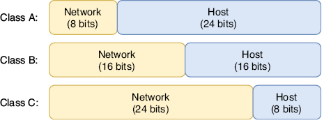

/// figura
Tamaños de la porción de red y de la porción de host de las direcciones IPv4 de clase A, clase B y clase C
///

Las redes de Clase A estaban destinadas a organizaciones muy grandes, como proveedores de servicios de Internet y el Departamento de Defensa de los Estados Unidos (DoD); la gran mayoría de las organizaciones no necesitan ni cerca de 16.777.216 direcciones IP. Las redes de clase B estaban destinadas a medianas y grandes empresas y las de clase C, a pequeñas y medianas empresas.

La Tabla 3 resume las características de las clases A, B y C. No es necesario memorizar el número de redes y direcciones por red para cada clase de dirección; simplemente comprenda que una porción de red más pequeña significa menos redes con más hosts en cada red, y una porción de red más grande significa más redes con menos hosts en cada red.
Tabla 3 Características de las clases A, B y C (ver figura de tabla)

| Clase | Primer octeto | Tamaño de la porción de red | Tamaño de la porción de host | Número de redes | Direcciones por red |
|-------|---------------|-----------------------------|------------------------------|-----------------|----------------------|
| A     | 0xxxxxxx      | 8 bits                      | 24 bits                      | 128 (2⁷)        | 16.777.216 (2²⁴)     |
| B     | 10xxxxxx      | 16 bits                     | 16 bits                      | 16.384 (2¹⁴)    | 65.536 (2¹⁶)         |
| C     | 110xxxxx      | 24 bits                     | 8 bits                       | 2.097.152 (2²¹) | 256 (2⁸)             |

!!!note "Nota"
    La razón por la que sólo hay 27 redes de clase A, aunque la parte de la red tiene una longitud de 8 bits, es que el primer bit está fijo en 0: sólo hay 7 bits disponibles para cambiar y crear redes diferentes. El mismo razonamiento se aplica a por qué hay 214 redes de clase B (no 216) y 221 redes de clase C (no 224).

Las redes que siguen las reglas de clase A, B y C se denominan redes con clase. Aunque es importante estudiarlo y comprenderlo incluso hoy en día, este sistema ahora está obsoleto y ha sido reemplazado por redes sin clases, un sistema en el que las longitudes de los prefijos no están restringidas por clase. Cubriremos esto en el capítulo 11 cuando analicemos la subred.
Direcciones reservadasDentro de cada clase de dirección, existen varios rangos de direcciones IP que están reservadas y no se pueden asignar a hosts. Aquí hay dos ejemplos:

+ **0.0.0.0/8:** cualquier dirección IP que comience con el primer octeto 0 está reservada.
+ **127.0.0.0/8:** este rango está reservado para direcciones de loopback. Un mensaje enviado a cualquier dirección IP en este rango (es decir, ping 127.0.0.1) se enviará de vuelta al host local (el dispositivo en el que está trabajando) sin transmitirse a través de la red. Esto se puede utilizar para probar el software de red en el dispositivo local.

## 4. Resumen
+ La cabecera IPv4 tiene una longitud de 20 a 60 bytes y contiene 14 campos.
+ El campo Versión indica la versión de IP (IPv4 o IPv6).
+ El campo Longitud del encabezado de Internet (IHL) indica la longitud del encabezado en incrementos de 4 bytes.
+ Los campos Punto de código de servicios diferenciados (DSCP) y Notificación de congestión explícita (ECN) se utilizan para priorizar ciertos tipos de tráfico. Esto se llama Calidad de Servicio (QoS).
+ El campo Longitud total indica la longitud del paquete completo en bytes.
+ Los campos Identificación, Indicadores y Desplazamiento de fragmentos admiten la fragmentación de paquetes. Si un paquete es más grande que la Unidad de Transmisión Máxima (MTU) de una interfaz, el enrutador dividirá el paquete en varios paquetes más pequeños llamados fragmentos. La MTU estándar es de 1500 bytes.
+ El campo Tiempo de vida (TTL) se utiliza para evitar que los paquetes circulen indefinidamente por la red. Cada vez que un enrutador reenvía un paquete, su TTL disminuye en 1 y, si llega a 0, el paquete se descarta.
+ El campo Protocolo indica el tipo de mensaje encapsulado dentro del paquete, como ICMP, TCP, UDP u OSPF.
+ El campo Suma de comprobación del encabezado se utiliza para comprobar si hay errores en la cabecera IPv4.
+ El campo Dirección de origen contiene la dirección IPv4 del host que envió el paquete.
+ El campo Dirección de destino contiene la dirección IPv4 del destinatario previsto del paquete.
+ El campo Opciones es opcional y de longitud variable: desde 0 bytes (si no se utiliza) hasta un máximo de 40 bytes de longitud. Este campo rara vez se utiliza.
+ El sistema numérico decimal utiliza 10 dígitos: 0, 1, 2, 3, 4, 5, 6, 7, 8 y 9. También se llama base 10. El valor de cada posición de dígito se multiplica por diez: 1, 10, 100, 1000, etc.
+ El sistema numérico binario utiliza dos dígitos: 0 y 1. También se le llama base 2. El valor de la posición de cada dígito se duplica: 1, 2, 4, 8, 16, 32, 64, 128, etc.
+ Un número binario de 8 bits proporciona 256 valores posibles: desde 0d0 (00000000) hasta 0d255 (11111111).
+ Para el examen CCNA, debe poder convertir entre binario y decimal números de hasta 8 bits de longitud. Podéis practicar en https://learningnetwork.cisco.com/s/binary-game.
+ Una dirección IPv4 es un número de 32 bits que identifica un host en la Capa 3. Se divide en cuatro grupos de 8 bits llamados octetos y se escribe en notación decimal con puntos.
+ Las direcciones IPv4 se dividen en dos partes: la parte de red y la parte de host. Todos los hosts dentro de una LAN tendrán la misma porción de red pero una porción de host única.
+ El tamaño de la parte de la red se puede indicar con una longitud de prefijo en el formato /X, donde X es el número de bits de la parte de la red. Cualquier bit que no forme parte de la parte de la red es parte de la parte del host.
+ El tamaño de la parte de la red también se puede indicar con una máscara de red (también llamada máscara de subred). Una máscara de red es una cadena de 32 bits que se empareja con una dirección IP para indicar qué bits de la dirección IP son la parte de la red y cuáles son la parte del host.
+ Un 1 en la máscara de red significa que el bit en la misma posición que la dirección IP es parte de la porción de red. Un 0 en la máscara de red significa que el bit en la misma posición que la dirección IP es parte de la parte del host.
+ El comando show ip interface brief enumera la interfaz de un enrutador e información sobre sus direcciones IP y su estado.
+ El comando show ip interface [nombre-interfaz] muestra más detalles sobre cada interfaz.
+ Las interfaces del enrutador están deshabilitadas de forma predeterminada y deben habilitarse con el comando de no apagado.
+ Se puede acceder al modo de configuración de la interfaz con el comando interface interface-name desde el modo de configuración global.
+ La dirección IPv4 de una interfaz se puede configurar con el comando ip-address netmask en el modo de configuración de interfaz.
+ La dirección de red de una red es la primera dirección de la red, con una parte del host formada por todos ceros. Se utiliza para identificar la red y no se puede asignar a un host.
+ La dirección de transmisión de una red es la última dirección de la red, con una porción de host compuesta solo de unos. Se puede utilizar para enviar un mensaje a todos los hosts de la red. Sin embargo, para enviar un mensaje a todos los hosts de la red local, normalmente se utiliza la dirección 255.255.255.255.
+ La cantidad máxima de hosts de una red es la cantidad de direcciones IP que se pueden asignar a los hosts. La fórmula es 2y − 2, donde y es el número de bits en la parte del host. Se restan dos para las direcciones de red y de transmisión.
+ La primera dirección utilizable de una red es la primera dirección que se puede asignar a un host. La última dirección utilizable es la última dirección que se puede asignar a un host.
+ Las direcciones IPv4 se pueden organizar en cinco clases: A, B, C, D y E. La clase D está reservada para direcciones de multidifusión y la clase E está reservada para fines experimentales. Las direcciones de las clases A, B y C se asignan a los hosts de la red.
+ Las direcciones de clase A tienen un primer octeto de 0 a 127 y utilizan una longitud de prefijo /8. Las direcciones de clase B tienen un primer octeto de 128 a 191 y utilizan una longitud de prefijo /16. Las direcciones de clase C tienen un primer octeto de 192 a 223 y utilizan una longitud de prefijo /24.
+ Las redes que siguen las reglas de clase A, B y C se denominan redes con clase. Este sistema ahora está obsoleto y ha sido reemplazado por redes sin clases, que son más flexibles.
