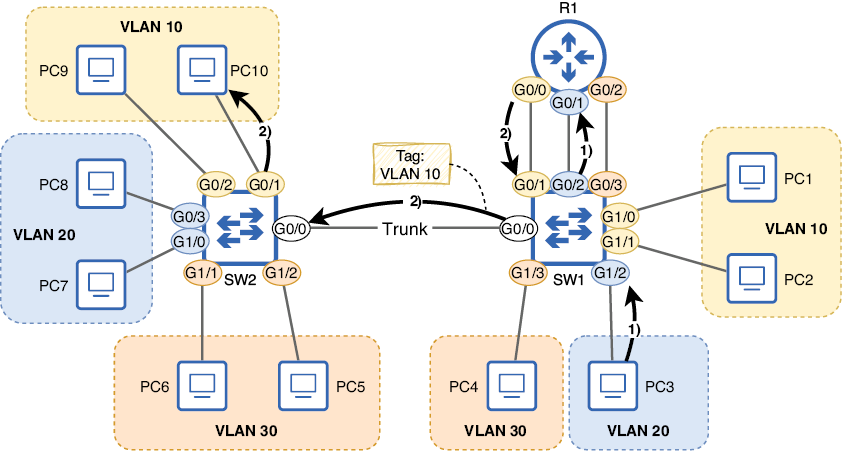
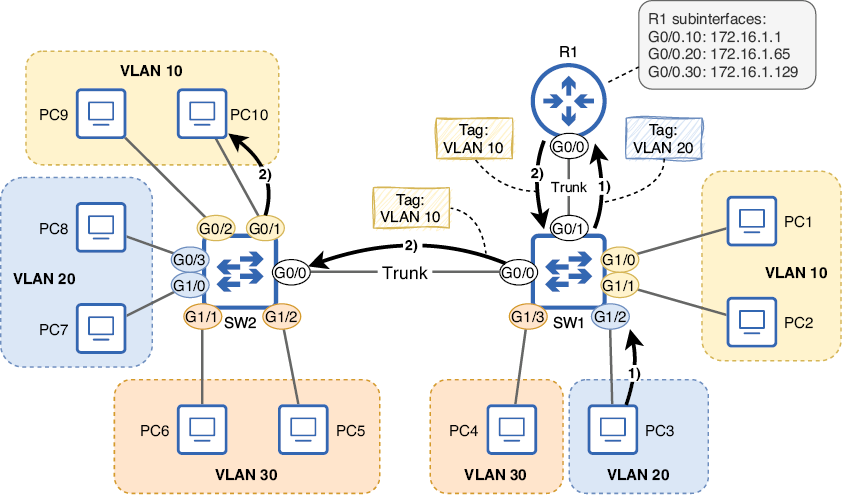
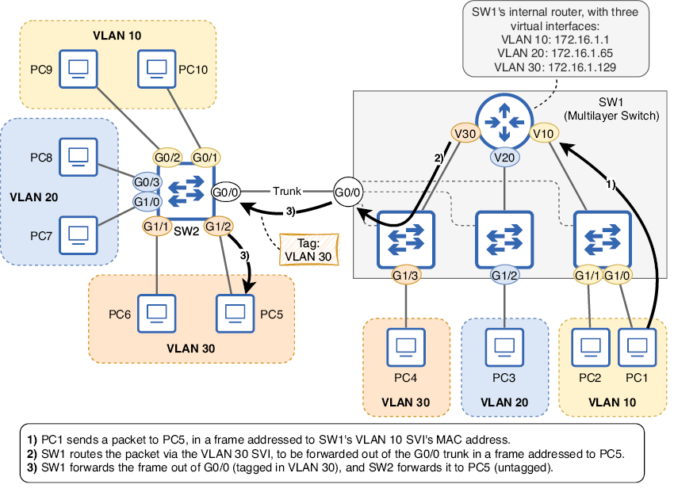
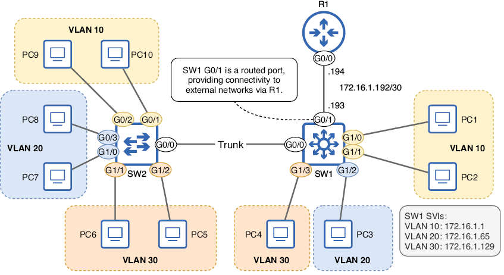
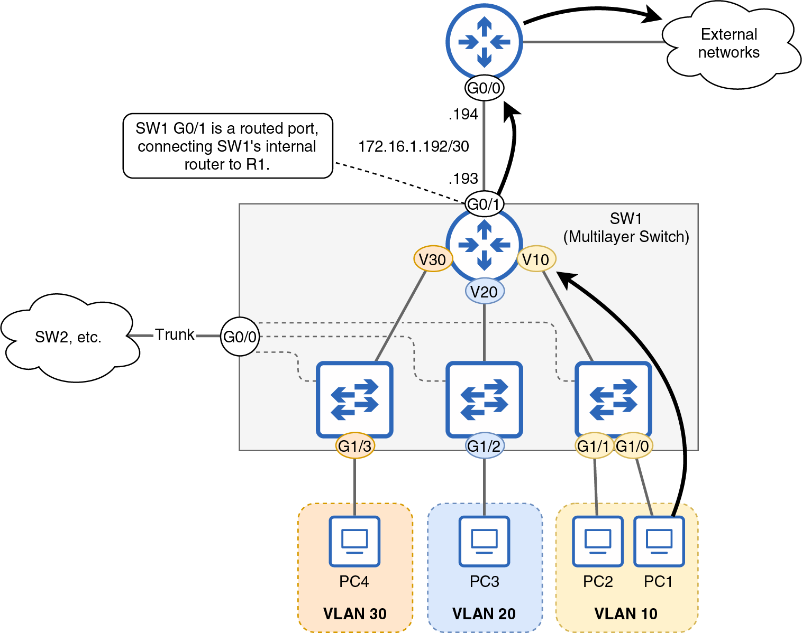

---
hide:
  - navigation
---

# Enrutamiento intervlan

## Enrutamiento básico

Durante el curso ya hemos tratado en detalle el tema de las VLANS, así como su configuración. Demos ahora un paso más y aprendamos como enrutar paquetes entre ellas, estableciendo esta comunicación.

Incluso después de segmentar una LAN en múltiples subredes y VLAN, generalmente se requiere que las subredes/VLAN puedan comunicarse entre sí (y con redes externas). Si bien el enrutamiento es un concepto de capa 3 y las VLAN son de capa 2, el término enrutamiento entre VLAN se utiliza para referirse al enrutamiento entre subredes en una LAN segmentada mediante VLAN.

Hasta este punto, todos los diagramas de este capítulo (excepto la figura 12.1, que solo muestra una subred) han mostrado tres enlaces entre R1 y SW1: uno por subred/VLAN. Esta es una opción para el enrutamiento entre VLAN; las interfaces del enrutador se configuran de forma normal y los puertos del switch se configuran como puertos de acceso. La figura 12.9 muestra cómo PC3 (en la VLAN 20) puede comunicarse con PC10 (en la VLAN 10) en este caso.



/// figura
PC3 (en VLAN 20) envía un paquete a PC10 (en VLAN 10). (1) PC3 envía el paquete en una trama dirigida a su puerta de enlace predeterminada (R1 G0/1). SW2 lo reenvía por su puerto G0/2 (sin etiquetar). (2) R1 enruta el paquete, reenviándolo por G0/0 en una nueva trama dirigida a PC10. La trama es reenviada a PC10 por SW1 y SW2. Se etiqueta solo al cruzar el enlace troncal de SW1 G0/0 a SW2 G0/0.
///

Los siguientes ejemplos muestran cómo se pueden configurar R1 y SW1 para habilitar el enrutamiento entre VLAN de esta manera:

```linenums="1"
R1(config)# 
interface g0/0                                
R1(config-if)# ip address 172.16.1.1 255.255.255.192      
R1(config-if)# no shutdown                                
R1(config-if)# interface g0/1                             
R1(config-if)# ip address 172.16.1.65 255.255.255.192     
R1(config-if)# no shutdown                                
R1(config-if)# interface g0/2                             
R1(config-if)# ip address 172.16.1.129 255.255.255.192    
R1(config-if)# no shutdown                                
 
SW1(config)# interface g0/1                               
SW1(config-if)# switchport mode access                    
SW1(config-if)# switchport access vlan 10                 
SW1(config-if)# interface g0/2                            
SW1(config-if)# switchport mode access                    
SW1(config-if)# switchport access vlan 20                 
SW1(config-if)# interface g0/3                            
SW1(config-if)# switchport mode access                    
SW1(config-if)# switchport access vlan 30    
```             

Sin embargo, este método de enrutamiento entre VLAN no es común por la misma razón que no es común conectar switches mediante puertos de acceso: en una LAN con muchas VLAN, pronto se agotarán los puertos físicos disponibles en los dispositivos. En su lugar, generalmente se prefiere una de las siguientes opciones:

+ Router on a stick (un enlace troncal entre el switch y el router)
+ Switch multicapa (un switch que también puede enrutar paquetes)

## Router on a stick

Router on a stick (ROAS) es un método de enrutamiento entre VLAN que implica la creación de un enlace troncal entre un switch y un router; una única interfaz física del router se puede dividir en múltiples subinterfaces virtuales, cada una con su propia dirección IP. Estas subinterfaces envían y reciben tramas etiquetadas, como un puerto troncal en un switch. La siguiente imagen muestra cómo se puede enrutar el mismo paquete desde PC3 a PC10 mediante ROAS. 



/// figura
PC3 (en la VLAN 20) envía un paquete a PC10 (en la VLAN 10), y el paquete se enruta mediante el método de enrutamiento en paralelo (router on a stick). La interfaz G0/0 de R1 tiene tres subinterfaces: G0/0.10 (VLAN 10, 172.16.1.1), G0/0.20 (VLAN 20, 172.16.1.65) y G0/0.30 (VLAN 30, 172.16.1.129). La trama de PC3 a R1 se etiqueta en la VLAN 20 a través del enlace troncal entre SW1 G0/1 y R1 G0/0. La trama de R1 a PC10 se etiqueta en la VLAN 10 a través del enlace troncal entre R1 G0/0 y SW1 G0/1, y el enlace troncal entre SW1 G0/0 y SW2 G0/0.
///

!!!note "Nota"
    La interfaz física y las subinterfaces virtuales de un router comparten la misma dirección MAC. Cuando llega una trama a la interfaz física, el router sabe a qué subinterfaz está destinada basándose en la etiqueta VLAN de la trama, en lugar de en su dirección MAC de destino.

### Configuración de ROAS

Veamos cómo configurar ROAS. El lado de la conexión de SW1 es un puerto troncal, tal como lo configuramos anteriormente. En el siguiente ejemplo, configuro SW1 G0/1 como puerto troncal, permito solo las VLAN necesarias y cambio la VLAN nativa a una VLAN no utilizada:

```linenums="1"
SW1(config)# 
interface g0/1
SW1(config-if)# switchport trunk encapsulation dot1q      
SW1(config-if)# switchport mode trunk                     
SW1(config-if)# switchport trunk allowed vlan 10,20,30    
SW1(config-if)# switchport trunk native vlan 999          
```

!!!note "Nota"
    Como se mencionó anteriormente, los switches que solo admiten 802.1Q (y no ISL) no requieren el comando `switchport trunk encapsulation` antes del comando `switchport mode trunk`.

A continuación, configuraremos R1; aquí utilizaremos algunos comandos nuevos. Para configurar una subinterfaz, utilizad el comando `interface` seguido del nombre de la interfaz, un punto y un número que la identifique, como `interface g0/0.10`. Esto os llevará al modo de configuración de subinterfaz. En el siguiente ejemplo, habilito la interfaz G0/0 de R1 y luego ingreso al modo de configuración de subinterfaz para la subinterfaz G0/0.10. Observad que el indicador de comandos cambia a `R1(config-subif)#`.

```linenums="1"
R1(config)# 
interface g0/0          
R1(config-if)# no shutdown          
R1(config-if)# interface g0/0.10    
R1(config-subif)#                   
```

!!!note "Nota"
    La interfaz G0/0 en sí no necesita ninguna configuración adicional; simplemente aseguraos de habilitarla sin apagar el sistema.

Una vez en el modo de configuración de subinterfaz, hay dos elementos que configurar en la subinterfaz: la VLAN asociada y la dirección IP. Para configurar el ID de VLAN, utilizad el comando `encapsulation dot1q vlan-id`. En el siguiente ejemplo, configuro el ID de VLAN y la dirección IP de la subinterfaz G0/0.10 de R1:

```linenums="1"
R1(config-subif)# encapsulation dot1q 10                   
R1(config-subif)# ip address 172.16.1.1 255.255.255.192    
```

Tras estas configuraciones, cualquier trama que R1 reciba en su interfaz G0/0 y que esté etiquetada con la VLAN 10 se enviará a la subinterfaz G0/0.10, y cualquier trama enviada por la subinterfaz G0/0.10 se etiquetará con la VLAN 10.
Nota

El número utilizado para identificar la subinterfaz (el .10 en G0/0.10) no tiene por qué coincidir con el ID de la VLAN; este número no tiene ninguna otra función que la de identificar la subinterfaz. Es el comando `encapsulation dot1q` el que indica al router qué VLAN asociar a esta subinterfaz. Sin embargo, recomiendo que estos dos números coincidan; no hay motivo para no hacerlo.

En el siguiente ejemplo, configuro dos subinterfaces más: una para la VLAN 20 y otra para la VLAN 30. A continuación, lo confirmo con el comando `show ip interface brief`. Observe que la interfaz G0/0 en sí misma no tiene una dirección IP. Más bien, las tres subinterfaces virtuales tienen direcciones IP y envían y reciben tráfico a través de la interfaz física G0/0:

```linenums="1"
R1(config-subif)# 
interface g0/0.20                                              
R1(config-subif)# encapsulation dot1q 20                                         
R1(config-subif)# ip address 172.16.1.65 255.255.255.192                         
R1(config-subif)# interface g0/0.30                                              
R1(config-subif)# encapsulation dot1q 30                                         
R1(config-subif)# ip address 172.16.1.129 255.255.255.192                        
R1(config-subif)# do show ip interface brief
Interface                  IP-Address      OK? Method Status                Protocol
GigabitEthernet0/0         unassigned      YES manual up                    up    
GigabitEthernet0/0.10      172.16.1.1      YES manual up                    up   
GigabitEthernet0/0.20      172.16.1.65     YES manual up                    up   
GigabitEthernet0/0.30      172.16.1.129    YES manual up                    up   
. . .
```

La configuración de ROAS ya está completa; R1 puede enrutar el tráfico entre las tres subredes/VLAN de la LAN mediante la única conexión troncal física con SW1. Cabe destacar que no realicé ninguna configuración relacionada con la VLAN nativa en el lado de R1 de la conexión; si no se utiliza la VLAN nativa, no es necesario realizar ninguna configuración específica en el router.

#### Configurando la VLAN nativa en ROAS

Si se decide usar la VLAN nativa sobre el enlace troncal ROAS, existen dos métodos para configurar la conexión en el router:

Utilizad el comando `encapsulation dot1q vlan-id native` en la subinterfaz correspondiente.

Configure la dirección IP de la VLAN nativa en la interfaz física, no en una subinterfaz.

Veamos ambos métodos. En el siguiente ejemplo, se muestra nuevamente la configuración ROAS, esta vez configurando la VLAN 10 como VLAN nativa mediante la adición de la palabra clave `native` al comando `encapsulation dot1q`. Por lo demás, las configuraciones son idénticas a los ejemplos anteriores.

```linenums="1"
R1(config)# 
interface g0/0                                   
R1(config-if)# no shutdown                                   
R1(config-if)# interface g0/0.10                             
R1(config-subif)# encapsulation dot1q 10 native              
R1(config-subif)# ip address 172.16.1.1 255.255.255.192      
R1(config-subif)# interface g0/0.20                          
R1(config-subif)# encapsulation dot1q 20                     
R1(config-subif)# ip address 172.16.1.65 255.255.255.192     
R1(config-subif)# interface g0/0.30                          
R1(config-subif)# encapsulation dot1q 30                     
R1(config-subif)# ip address 172.16.1.129 255.255.255.192  
```  

En el siguiente ejemplo, utilizo el segundo método para configurar la VLAN nativa en el enrutador. No configuro una subinterfaz para la VLAN 10, sino que configuro la dirección IP de la VLAN nativa en la propia interfaz G0/0; el comando encapsulation dot1q no es necesario para la VLAN 10 en este caso, aunque sigue siendo necesario en las subinterfaces de las VLAN no nativas (VLAN 20 y 30):

```linenums="1"
R1(config)# 
interface g0/0                                  
R1(config-if)# no shutdown                                  
R1(config-if)# ip address 172.16.1.1 255.255.255.192        
R1(config-if)# interface g0/0.20                            
R1(config-subif)# encapsulation dot1q 20                    
R1(config-subif)# ip address 172.16.1.65 255.255.255.192    
R1(config-subif)# interface g0/0.30                         
R1(config-subif)# encapsulation dot1q 30                    
R1(config-subif)# ip address 172.16.1.129 255.255.255.192   
```

!!!note "Nota"
    En ambos métodos, la VLAN nativa se asocia con la interfaz física G0/0, no con una subinterfaz virtual. En el primer método, la VLAN nativa se especifica con la palabra clave `native` en el comando `encapsulation dot1q`. En el segundo método, la VLAN nativa se configura simplemente al configurar la dirección IP en la interfaz física sin usar el comando `encapsulation dot1q`.

    Independientemente del método que utilicéis para configurar la VLAN nativa en el router, aseguraos de que la VLAN nativa coincida con la del switch.

## Switch multicapa

La tercera opción para el enrutamiento entre VLAN, y quizás la más popular (aunque ROAS también es común), es usar un switch multicapa. Un switch multicapa (también llamado switch de capa 3) es un switch capaz de enrutar paquetes; es un switch con un enrutador integrado.

!!!note "Nota"
    Un switch estándar que solo reenvía tramas se denomina switch de capa 2. Sin embargo, hoy en día, casi todos los switches tienen cierto grado de capacidades de capa 3, por lo que la diferencia entre un switch multicapa y un switch de capa 2 suele depender de cómo se utilice el switch, más que del switch en sí.

### Enrutamiento entre VLAN mediante SVI

Los switches multicapa realizan el enrutamiento entre VLAN mediante interfaces virtuales llamadas interfaces virtuales de switch (SVI). Cada SVI es una interfaz en el enrutador integrado del switch multicapa, y los hosts de cada VLAN utilizan la dirección IP de la SVI de su VLAN como puerta de enlace predeterminada.

La figura de abajo muestra la lógica interna de cómo SW1 (ahora un conmutador multicapa) enruta un paquete de PC1 a PC5. PC1 envía el paquete en una trama dirigida a la interfaz SVI de la VLAN 10 de SW1; cada SVI tiene una dirección MAC única. El enrutador interno de SW1 enruta el paquete a través de la SVI de la VLAN 30 y lo reenvía por el puerto troncal G0/0 en una trama (etiquetada en la VLAN 30) dirigida a la dirección MAC de PC5, y SW2 reenvía la trama a PC5 (sin etiquetar).



/// figura
Aquí se muestra cómo SW1, un conmutador multicapa, enruta un paquete de PC1 a PC5. SW1 tiene tres interfaces SVI: VLAN 10 (172.16.1.1), VLAN 20 (172.16.1.65) y VLAN 30 (172.16.1.129), lo que le permite enrutar paquetes internamente, sin depender de un enrutador externo.
///

!!!note "Nota"
    R1 ya no aparece en el diagrama de la figura; si configuramos las SVI en SW1, no es necesario depender de un enrutador externo para el enrutamiento entre VLAN.

El primer paso para configurar SW1, como se muestra arriba, es habilitar el enrutamiento IP con el comando `ip routing` en el modo de configuración global. Sin este comando, el switch no podrá reenviar paquetes entre subredes/VLAN.

Tras habilitar el enrutamiento IP, el siguiente paso es configurar las SVI de SW1. El comando para configurar una SVI es `interface vlan vlan-id`; a continuación, simplemente configurad una dirección IP en la SVI como si fuera una interfaz de enrutador. A diferencia de la configuración de una subinterfaz de enrutador (donde el identificador de subinterfaz no es relevante), el `vlan-id` especificado en el comando `interface vlan` sí lo es; es lo que indica a qué VLAN está asociada la SVI. En el siguiente ejemplo, habilito el enrutamiento IP y luego configuro las SVI de SW1 para las VLAN 10, VLAN 20 y VLAN 30, con las direcciones IP configuradas en R1 en los ejemplos anteriores:

```linenums="1"
SW1(config)# 
ip routing                                   
SW1(config)# interface vlan 10                            
SW1(config-if)# ip address 172.16.1.1 255.255.255.192     
SW1(config-if)# interface vlan 20                         
SW1(config-if)# ip address 172.16.1.65 255.255.255.192    
SW1(config-if)# interface vlan 30                         
SW1(config-if)# ip address 172.16.1.129 255.255.255.192   
```

!!!note "Nota"
    En algunos switches, las interfaces virtuales de switch (SVI) pueden estar deshabilitadas administrativamente por defecto. En ese caso, utilizad el comando `no shutdown` para habilitar cada SVI.

SW1 ya está listo para enrutar paquetes en la LAN; al igual que un enrutador, SW1 inserta rutas conectadas y locales en su tabla de enrutamiento para cada SVI, por lo que no es necesario configurar rutas estáticas. En el siguiente ejemplo, verifico la tabla de enrutamiento de SW1 con el comando `show ip route`:

```linenums="1"
SW1# 
show ip route                                              
. . .
      172.16.0.0/16 is variably subnetted, 6 subnets, 2 masks
C        172.16.1.0/26 is directly connected, Vlan10            
L        172.16.1.1/32 is directly connected, Vlan10            
C        172.16.1.64/26 is directly connected, Vlan20           
L        172.16.1.65/32 is directly connected, Vlan20           
C        172.16.1.128/26 is directly connected, Vlan30          
L        172.16.1.129/32 is directly connected, Vlan30     
```     
Para que una interfaz SVI funcione, debe estar en estado activo (consulte las columnas Estado y Protocolo en la salida del comando `show ip interface brief`), al igual que una interfaz física. Para que una interfaz SVI esté en estado activo, se requieren cuatro condiciones; consulte esta lista si necesita solucionar problemas con una interfaz SVI que no alcanza dicho estado:

1. La VLAN asociada a la interfaz SVI debe existir en el switch (es decir, creada con el comando `vlan vlan-id`).

2. El switch debe tener al menos una de las siguientes condiciones:

    a. Un puerto de acceso asociado a la VLAN (mediante el comando `switchport access vlan`) en estado activo.

    b. Un puerto troncal que permita el paso de la VLAN (mediante el comando `switchport trunk allowed vlan`) en estado activo.

3. La VLAN debe estar habilitada (no debe tener el comando `shutdown` aplicado).

4. La interfaz SVI debe estar habilitada (no debe tener el comando `shutdown` aplicado). 

!!!tip "Consejo"
    Aseguraos de comprender la diferencia entre una VLAN y una SVI. Una VLAN es un concepto de capa 2: un dominio de difusión virtual que divide un switch. Una SVI es una interfaz virtual de capa 3 asociada a una VLAN. Para crear una VLAN, utilizad el comando `vlan`. Para crear una SVI, utilizad el comando `interface vlan`.

Como muestra el siguiente ejemplo, las SVI de SW1 se encuentran actualmente en estado activo/activo:

```linenums="1"
SW1# 
show ip interface brief | include Vlan 
Vlan10                 172.16.1.1      YES manual up                    up  
Vlan20                 172.16.1.65     YES manual up                    up    
Vlan30                 172.16.1.129    YES manual up                    up  
```

Para demostrar los requisitos, en el siguiente ejemplo, incumplí un requisito para cada una de las interfaces SVI de las VLAN 10, 20 y 30:

+ Eliminé la VLAN 10 del switch SW1 (requisito 1).

+ Deshabilité el puerto G1/3 del switch SW1 (un puerto de acceso en la VLAN 30) y eliminé la VLAN 30 de la lista de VLAN permitidas del puerto G0/0 (requisito 2).

+ Deshabilité la VLAN 20 con el comando `shutdown` (requisito 3).

Como resultado, las tres interfaces SVI pasan a un estado de estado activo/inactivo; ya no podrán enrutar paquetes.

```linenums="1"
SW1(config)# 
no vlan 10                                                        
SW1(config)# interface g1/3                                                    
SW1(config-if)# shutdown                                                       
SW1(config-if)# interface g0/0                                                 
SW1(config-if)# switchport trunk allowed vlan remove 30                        
SW1(config-if)# vlan 20                                                        
SW1(config-vlan)# shutdown                                                     
SW1(config-vlan)# do show ip interface brief | include Vlan
Vlan10                 172.16.1.1      YES manual up                    down      
Vlan20                 172.16.1.65     YES manual up                    down   
Vlan30                 172.16.1.129    YES manual up                    down   
```

## Uso de puertos enrutados para conectividad externa

El enrutamiento dentro de una LAN es importante, pero también es esencial para que los hosts de la LAN puedan acceder a redes externas, como internet u otra LAN de la red corporativa. Para proporcionar conectividad externa, es común usar un puerto enrutado en un switch multicapa. Un puerto enrutado es un puerto físico en un switch multicapa configurado para funcionar como la interfaz de un enrutador. En la imagen se muestra cómo el puerto G0/1 de SW1 puede usarse como puerto enrutado, proporcionando conectividad a redes externas a través de R1.



//// figura
SW1, un switch multicapa, utiliza un puerto enrutado (G0/1) para proporcionar conectividad a redes externas (a través de R1, en este caso). Al igual que una interfaz de enrutador, el puerto G0/1 de SW1 está configurado con la dirección IP 172.16.1.193.
///

!!!note "Nota"
    El icono de SW1 es nuevo. Los diagramas de red suelen usar un icono como este para representar conmutadores multicapa, diferenciándolos de los conmutadores de capa 2.

Para configurar un puerto enrutado, utilizad el comando `no switchport` en el modo de configuración de interfaz; luego, podréis configurar una dirección IP como en la interfaz de un enrutador. En el siguiente ejemplo, configuro SW1 G0/1 como un puerto enrutado con una dirección IP y luego verifico la tabla de enrutamiento de SW1:

```linenums="1"
SW1(config)# 
interface g0/1                                         
SW1(config-if)# no switchport                                       
SW1(config-if)# ip address 172.16.1.193 255.255.255.252             
SW1(config-if)# do show ip route
. . .
      172.16.0.0/16 is variably subnetted, 8 subnets, 3 masks
C        172.16.1.0/26 is directly connected, Vlan10
L        172.16.1.1/32 is directly connected, Vlan10
C        172.16.1.64/26 is directly connected, Vlan20
L        172.16.1.65/32 is directly connected, Vlan20
C        172.16.1.128/26 is directly connected, Vlan30
L        172.16.1.129/32 is directly connected, Vlan30
C        172.16.1.192/30 is directly connected, GigabitEthernet0/1  
L        172.16.1.193/32 is directly connected, GigabitEthernet0/1  
```

SW1 G0/1 ahora es un puerto enrutado con una dirección IP, y SW1 ha agregado rutas conectadas y locales para él, pero SW1 aún no puede reenviar paquetes fuera de la LAN; necesita una o varias rutas hacia destinos externos. Al igual que en un enrutador, se pueden configurar rutas estáticas en un conmutador multicapa o usar un protocolo de enrutamiento dinámico (tema de la parte 4 de este volumen). En el siguiente ejemplo, configuro una ruta predeterminada estática en SW1, usando la dirección IP de R1 como siguiente salto:

```linenums="1"
SW1(config)# 
ip route 0.0.0.0 0.0.0.0 172.16.1.194      
```

Ahora que SW1 dispone de una ruta a redes externas, puede proporcionar conectividad entre la LAN y las redes externas, así como entre las subredes/VLAN de la LAN. La imagen muestra la lógica interna de cómo SW1 puede reenviar un paquete desde un host de la LAN hacia un destino externo; el puerto enrutado de SW1 (G0/1) proporciona conectividad desde el enrutador interno a R1.



/// figura
Un host de la LAN envía un paquete a un destino externo, enrutado por SW1. G0/1 es un puerto enrutado que conecta el enrutador interno de SW1 con R1.
///

## Resumen

+ La segmentación de red es el proceso de dividir una red en partes más pequeñas y proporciona beneficios en cuanto a seguridad y rendimiento. Las subredes se pueden usar para segmentar una red en la capa 3, y las redes de área local virtuales (VLAN) se pueden usar para segmentar una red en la capa 2.

+ Las VLAN dividen un dominio de difusión (LAN) en múltiples dominios de difusión al dividir un switch físico en múltiples switches virtuales. Las tramas enviadas por un host en una VLAN no se pueden reenviar a hosts en otra VLAN.

+ Aunque puede haber varias subredes por VLAN, para el examen CCNA, se puede asumir una relación uno a uno (una subred por VLAN).

+ Utilizad el comando `show vlan brief` para ver las VLAN existentes en el switch y qué puertos pertenecen a cada VLAN.

+ Las VLAN 1 y 1002-1005 existen por defecto y no se pueden eliminar. La VLAN 1 es la VLAN predeterminada, es decir, la VLAN a la que pertenecen todos los puertos por defecto. Las VLAN 1002–1005 están reservadas para su uso por FDDI y Token Ring, dos tecnologías heredadas de la capa de enlace de datos.

+ Utilizad el comando `vlan vlan-id` para crear una VLAN y, a continuación, el comando `name vlan-name` para asignarle un nombre opcional (el nombre predeterminado es VLANxxxx). Podéis usar el comando `shutdown` para deshabilitar temporalmente la VLAN o `no vlan vlan-id` para eliminarla.

+ Un puerto de acceso es un puerto de switch que envía y recibe tráfico en una sola VLAN. Los puertos de acceso también se denominan puertos sin etiquetar porque envían y reciben tramas sin etiquetas VLAN.

+ Utilizad el comando `switchport mode access` para configurar un puerto en modo de acceso. A continuación, utilizad el comando `switchport access vlan vlan-id` para configurar a qué VLAN pertenece el puerto. Si asignáis un puerto a una VLAN que aún no existe en el switch, este la creará automáticamente.

+ Un puerto troncal es un puerto de switch que envía y recibe tráfico en varias VLAN. Los puertos troncales diferencian las VLAN añadiendo una etiqueta VLAN a cada trama mediante el protocolo IEEE 802.1Q.

+ La etiqueta 802.1Q tiene una longitud de 4 bytes y se añade entre los campos Origen y Tipo de Ether del encabezado Ethernet. Los campos principales de la etiqueta 802.1Q son TPID y TCI.

+ El campo Identificador de Protocolo de Etiqueta (TPID) siempre contiene el valor 0x8100; se utiliza para identificar las tramas etiquetadas con 802.1Q.

+ El campo Información de Control de Etiqueta (TCI) consta de tres subcampos: Punto de Código de Prioridad (PCP) e Indicador de Elegibilidad para Descarte (DEI), que se utilizan para la Calidad de Servicio (QoS). El campo Identificador de VLAN (VID) se utiliza para indicar a qué VLAN pertenece la trama. El campo VID tiene una longitud de 12 bits, por lo que existen 4096 (2¹²) VLAN en total.

+ Para configurar un puerto troncal, utilizad el comando switchport mode trunk. Si el switch admite 802.1Q e ISL, primero deberíais usar el comando `switchport trunk encapsulation dot1q`. Si el switch solo admite 802.1Q, este comando no es necesario.

+ Utilizad el comando `show interfaces trunk` para verificar los puertos troncales, incluyendo información como las VLAN permitidas en cada puerto.

+ De forma predeterminada, todas las VLAN están permitidas en un puerto troncal, lo que significa que puede reenviar y recibir tramas en todas las VLAN.

+ Utilizad el comando `switchport trunk allowed vlan` para especificar las VLAN permitidas en un puerto troncal. Podéis especificar la lista de VLAN o usar las palabras clave `add`, `all`, `except`, `none` o `remove`.

+ La VLAN nativa es la VLAN sin etiquetar en un puerto troncal. Las tramas sin etiquetar recibidas en un puerto troncal se asignan a la VLAN nativa, y las tramas en la VLAN nativa se reenvían sin etiquetar. La VLAN nativa de un puerto troncal es la VLAN 1 de forma predeterminada.

+ La VLAN nativa se puede configurar con el comando `switchport trunk native vlan vlan-id`. El comando se configura por puerto, por lo que cada puerto de un switch puede tener una VLAN nativa diferente. Aseguraos de que la VLAN nativa coincida en ambos lados de una conexión troncal.

+ Se recomienda configurar una VLAN no utilizada (que no sea la VLAN 1 predeterminada) como VLAN nativa, lo que equivale a deshabilitarla.

+ El enrutamiento entre VLAN es el proceso de enrutamiento entre subredes en una LAN segmentada mediante VLAN. Este enrutamiento puede realizarse mediante un router externo o un switch multicapa (un switch con capacidades de enrutamiento).

+ Un router puede realizar el enrutamiento entre VLAN utilizando una interfaz independiente por subred/VLAN o mediante ROAS (Router on a Stick), donde un enlace troncal conecta el router y el switch.

+ ROAS utiliza subinterfaces virtuales. Para configurar una subinterfaz, utilizad el comando `interface` y añadid un punto y un número al final del nombre de la interfaz para identificarla (por ejemplo, `interface g0/0.10`). El identificador de la subinterfaz no tiene por qué coincidir con el ID de la VLAN.

+ Configurad la VLAN de una subinterfaz con el comando `encapsulation dot1q vlan-id`. A continuación, configurad una dirección IP del mismo modo que en un router.

+ Si utilizáis la VLAN nativa sobre el enlace troncal ROAS, utilizad el comando `encapsulation dot1q vlan-id native` en la subinterfaz de la VLAN nativa. O bien, configurad la dirección IP de la VLAN nativa en la interfaz física (el comando `encapsulation dot1q` no es necesario en la interfaz física).