# NAT (traducción de direcciones de red)

Este capítulo abarca:

+ Direcciones IPv4 privadas
+ Utilizar NAT para traducir entre direcciones IPv4 privadas y públicas.
+ Los diferentes tipos de NAT
+ Configuración de NAT 

## 1. Introducción

El agotamiento de las direcciones IPv4 es un problema importante desde hace mucho tiempo. La solución a largo plazo es conocida: IPv6. Sin embargo, IPv4 sigue siendo dominante hoy en día gracias a algunas soluciones que han sido muy efectivas para extender su vida útil. Analizamos una de estas soluciones en el capítulo 11 del volumen 1 sobre el subneteo con enrutamiento entre dominios sin clases (CIDR), que ofrece mayor flexibilidad que el rígido sistema de direccionamiento con clases que lo precedió.

En esta unidad abordaremos dos soluciones importantes que, en conjunto, han demostrado ser esenciales para preservar el espacio de direcciones IPv4: el direccionamiento IPv4 privado (que ya hemos visto anteriormente en el curso) y la traducción de direcciones de red (NAT). Se han reservado tres rangos de direcciones IPv4 para su uso gratuito en redes privadas sin necesidad de que sean globalmente únicas, y NAT proporciona una forma de traducir esas direcciones privadas a direcciones públicas para la comunicación a través de internet.

## 2. Direcciones IPv4 privadas

Las direcciones IPv4 privadas son direcciones IPv4 que cualquier organización o individuo puede utilizar libremente para sus redes internas; no es necesario que sean únicas a nivel global. En el RFC 1918, Asignación de direcciones para redes privadas de Internet, se definen tres rangos de direcciones IPv4 privadas:

+ 10.0.0.0/8 (10.0.0.0–10.255.255.255)
+ 172.16.0.0/12 (172.16.0.0–172.31.255.255)
+ 192.168.0.0/16 (192.168.0.0–192.168.255.255)


Abajo se muestran tres redes LAN conectadas a Internet. Todas las redes LAN utilizan direcciones IPv4 del tercer rango privado (192.168.0.0/16). Nótese que las tres subredes se superponen: 192.168.0.0/23 (192.168.0.0–192.168.1.255), 192.168.1.0/24 (192.168.1.0–192.168.1.255) y 192.168.1.0/25 (192.168.1.0–192.168.1.127). Esto no representa un problema, ya que las redes nunca están conectadas directamente; sus direcciones no tienen por qué ser únicas.

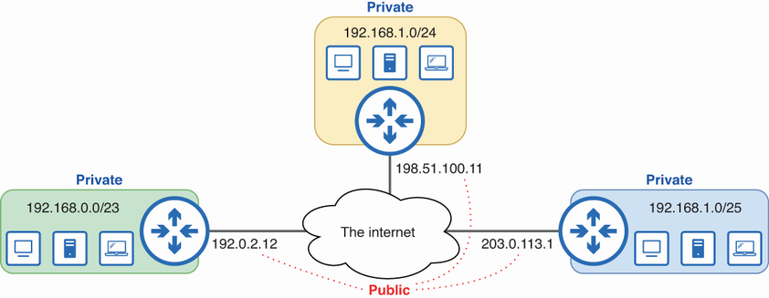

/// figura
Direcciones IPv4 públicas y privadas. Las direcciones IPv4 privadas se pueden usar libremente para redes internas y no tienen que ser únicas a nivel mundial. Las direcciones IPv4 públicas, utilizadas para la comunicación a través de Internet, deben ser únicas a nivel mundial.
///

Las direcciones IPv4 que no se encuentran en los rangos de la RFC 1918 (o en otro rango reservado) son direcciones IPv4 públicas; estas direcciones deben ser únicas a nivel global, ya que se utilizan para la comunicación a través de Internet. Si dos hosts conectados a Internet tienen la misma dirección IP, otros enrutadores no podrán determinar cuál de los dos hosts es el destinatario previsto de un paquete destinado a su dirección compartida. Las direcciones Anycast (descritas en el capítulo 20 del volumen 1) constituyen una excepción a esta regla; se asignan intencionadamente a varios hosts.

!!!note "Nota"
    Las direcciones IPv4 públicas de la figura anterior también pertenecen a rangos reservados: 192.0.2.0/24, 198.51.100.0/24 y 203.0.113.0/24 están reservadas para su uso en documentación y ejemplos, pero a menudo se utilizan para representar direcciones públicas.

Las direcciones IPv4 privadas no son enrutables a través de internet; los paquetes originados o destinados a direcciones privadas serán descartados por el proveedor de servicios de internet (ISP). Si tenéis un PC con Windows, usad `ipconfig` para comprobar su dirección IPv4 (`ifconfig` si usáis macOS/Linux); casi con toda seguridad se trata de una dirección privada. Entonces, ¿cómo puede vuestro PC comunicarse a través de internet a pesar de tener una dirección privada? La respuesta es NAT.

## 3. Conceptos NAT

La *traducción de direcciones de red* (NAT) es el proceso de modificar las direcciones IP de origen y/o destino de un paquete y, por lo general, la realiza un enrutador (o cortafuegos) en el perímetro de la red, es decir, un enrutador que conecta la red interna con internet. Al traducir las direcciones IP privadas a direcciones IP públicas, NAT permite que los hosts con direcciones IP privadas se comuniquen a través de internet.

### 3.1. El proceso NAT

En la imagen de abajo se muestra el proceso NAT. PC1, un host con una dirección IP privada, envía un paquete al servidor en 8.8.8.8. R1 utiliza NAT para traducir entre la dirección IP privada de PC1 (que no es enrutable a través de Internet) y una dirección IP pública.

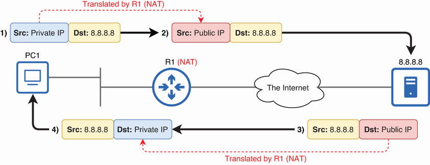

/// figura
R1 realiza la conversión entre la dirección IP privada de PC1 y una dirección IP pública para su uso a través de Internet.
///

En el paso 1, PC1 envía un paquete desde su dirección IP privada (la dirección IP de su interfaz de red). En el paso 2, R1 traduce la dirección IP de origen del paquete de PC1 a una dirección IP pública antes de reenviarlo a través de internet. Luego, en el paso 3, el servidor 8.8.8.8 responde enviando un paquete destinado a la dirección IP pública, que R1 traduce de nuevo a la dirección IP privada de PC1 antes de reenviarlo a PC1 en el paso 4.

!!!note "Nota"
    NAT se diseñó para traducir direcciones IP privadas y públicas, pero también es posible realizar traducciones entre direcciones privadas y públicas. Sin embargo, los casos de uso de NAT entre direcciones privadas y públicas son más limitados que los de NAT entre direcciones privadas. Para el examen CCNA, se puede asumir que NAT es entre direcciones privadas y públicas.

### 3.2. Terminología NAT de Cisco

Cuando un host en una red interna se comunica con un host en una red externa a través de un enrutador con NAT habilitado, hay cuatro direcciones involucradas desde el punto de vista del enrutador:

+ La dirección IP del host interno antes de NAT (local interno)
+ La dirección IP del host interno después de NAT (interno global)
+ La dirección IP del host externo antes de NAT (local externo)
+ La dirección IP del host externo después de NAT (externo global)

Cisco utiliza cuatro términos para describir cada una de estas direcciones: local interna, global interna, local externa y global externa. En esta sección, analizaremos la distinción entre interna y externa, así como entre local y global, y luego definiremos estos cuatro términos, fundamentales para el examen CCNA.

#### 3.2.1. Inside y Outside

Cisco utiliza los términos «interior» y «exterior» para referirse a las redes internas y externas, respectivamente. Una dirección interna es la dirección IP de un host ubicado en la red interna del router, y una dirección externa es la dirección IP de un host ubicado en la red externa. De forma similar, los hosts de la red interna se denominan hosts internos, y los hosts de la red externa se denominan hosts externos. La figura 3 ilustra estos conceptos. La interfaz G0/0 del router R1 se conecta a la red interna, y la interfaz G0/1 se conecta a la red externa (Internet).

!!!note "Nota"
    Para mayor coherencia, a partir de ahora usaré los términos *inside* y *outside*, ya que son los que usa Cisco en el contexto de NAT. Su significado es el mismo que el de *interno* y *externo*.

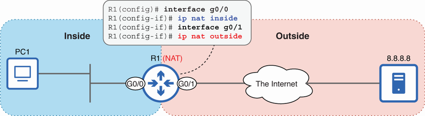

/// figura
La distinción entre interior y exterior desde la perspectiva de R1. La red interior es la red interna de R1, y la red exterior es la red externa (todo lo demás).
///

!!!note "Nota"
    Todos estos términos dependen de la perspectiva. Desde la perspectiva de R1, PC1 es un host interno y 8.8.8.8 es un host externo, pero desde la perspectiva de 8.8.8.8 y su enrutador (no mostrado), ocurre lo contrario.

Más adelante se abordará la configuración de NAT, pero la figura muestra un paso importante del proceso: especificar las interfaces interna y externa del router con el comando ip nat {inside | outside}. Dado que R1 G0/0 está configurado con el comando ip nat inside, PC1 es un host interno. Y dado que R1 G0/1 está configurado con ip nat outside, 8.8.8.8 es un host externo.

#### 3.2.2. Local y global

Cuando PC1 (un host interno) envía un paquete a un destino en la red externa, la dirección IP de origen de ese paquete es la dirección IP configurada en PC1: una dirección IP privada. Pero, ¿qué sucede después de que R1 utiliza NAT para traducir la dirección IP de origen del paquete de PC1 a una dirección IP pública? La dirección después de la traducción sigue representando a PC1, por lo que continúa siendo una dirección interna, pero es necesario otro criterio para diferenciar entre las direcciones antes y después de NAT: la distinción entre local y global.

Una dirección local es la dirección antes de que el enrutador la traduzca, y una dirección global es la dirección después de que el enrutador la traduzca. En otras palabras, una dirección local es la dirección de un host desde la perspectiva de la red interna, y una dirección global es la dirección de un host desde la perspectiva de la red externa. La figura 4 ilustra la distinción entre direcciones locales y globales.
Local/global y privado/público

!!!note "Nota"
    Las direcciones locales y globales pueden parecer similares a las direcciones privadas y públicas. Sin embargo, estos conceptos no siempre coinciden. Por ejemplo, en la figura 4, 8.8.8.8 (una dirección pública) es tanto una dirección local como una dirección global desde la perspectiva de R1.

    Los términos *local* y *global* son específicos de NAT y tienen significados concretos. Las direcciones locales se utilizan dentro de una red NAT, mientras que las direcciones globales se utilizan fuera de ella. NAT traduce las direcciones locales a direcciones globales cuando el tráfico fluye desde el interior hacia el exterior de la red y viceversa, independientemente de si las direcciones son privadas o públicas.

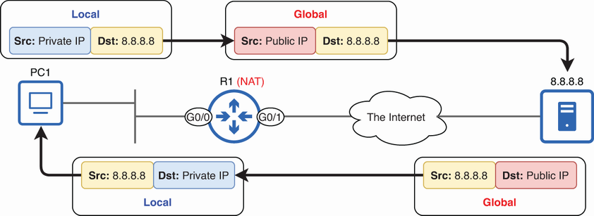

/// figura
La distinción entre local y global. Las direcciones locales aparecen en la red interna y las direcciones globales aparecen en la red externa.
///

Desde la perspectiva de PC1 y de otros hosts en la red interna, la dirección IP de PC1 es una dirección IP privada (es decir, 10.0.0.10). Sin embargo, desde la perspectiva de cualquier host en la red externa, la dirección IP de PC1 es una dirección IP pública (es decir, 203.0.113.1). Por ejemplo, cuando el servidor en 8.8.8.8 responde al paquete de PC1, dirige su respuesta a la dirección IP pública, no a la dirección IP privada de PC1; el servidor ni siquiera conoce la dirección IP privada de PC1.

Al combinar las distinciones entre interior/exterior y local/global, obtenemos los cuatro términos mencionados al inicio de esta sección: interior local, interior global, exterior local y exterior global. La figura 5 ilustra estas cuatro direcciones.

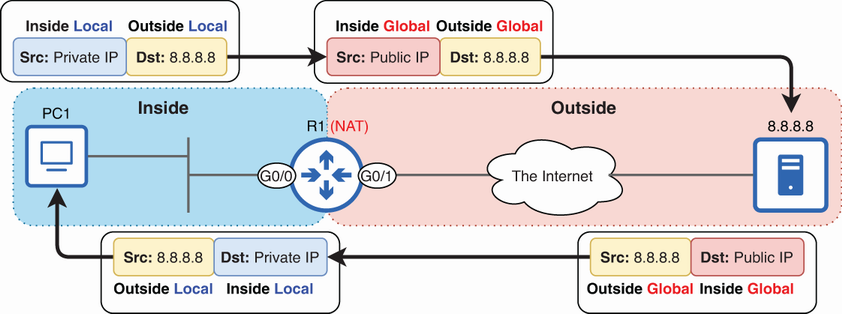

/// figura
Direcciones locales internas, globales internas, locales externas y globales externas. La distinción entre internas y externas diferencia entre los hosts ubicados en las redes internas y externas, y la distinción entre locales y globales diferencia entre las perspectivas de los hosts en las redes internas y externas.
///
!!!note "Nota"
    En nuestro ejemplo, R1 no traduce la dirección IP del host externo, por lo que las direcciones locales externas y globales externas son idénticas.

Ahora podemos definir con mayor precisión esos cuatro términos:

+ Local interno (inside local): la dirección IP de un host ubicado en la red interna desde la perspectiva de la red interna.
+ Dirección IP global interna (inside global): la dirección IP de un host ubicado en la red interna desde la perspectiva de la red externa.
+ Red externa local (outside local): la dirección IP de un host ubicado en la red externa desde la perspectiva de la red interna.
+ Global externo (outside global): la dirección IP de un host ubicado en la red externa desde la perspectiva de la red externa.

Como se indicó en la nota anterior, las direcciones IP externas locales y globales son idénticas en nuestro ejemplo. Esto se debe a que R1 solo realiza NAT de origen en el paquete de PC1; solo traduce la dirección IP de origen del paquete. R1 no realiza NAT de destino en el paquete de PC1; no traduce la dirección IP de destino del paquete. No abordaremos el NAT de destino en este curso.

!!!note "Nota"
    Como ya se comentó anteriormente, estos términos dependen de la perspectiva; son relativos a R1, el enrutador que realiza la traducción de direcciones de red (NAT) en nuestro ejemplo. Para R1, 8.8.8.8 es tanto una dirección local externa como una dirección global externa. Sin embargo, es probable que el servidor en 8.8.8.8 esté conectado a su propio enrutador que también realiza NAT, con su propia perspectiva sobre lo que está dentro y fuera, lo que es local y lo que es global. Desde la perspectiva de ese enrutador, 8.8.8.8 es la dirección global interna del servidor, y su dirección local interna es una dirección IP privada desconocida para R1, PC1 o cualquier otro host fuera de esa red.

## 4. Tipos de NAT

Existen varios tipos de NAT. Para el examen CCNA, debéis conocer los siguientes tres:

+ **NAT estático**: traducciones estáticas uno a uno
+ **NAT dinámico**: traducciones dinámicas uno a uno.
+ **PAT dinámico (Traducción de direcciones de puerto)**: traducciones dinámicas de muchos a uno

Cada tipo tiene sus propias aplicaciones, pero la PAT dinámica es, con diferencia, la más utilizada, ya que permite que miles de hosts compartan una única dirección IP pública. En esta sección, analizaremos cada tipo y cómo configurarlo en un router Cisco.

### 4.1. NAT estático

El primer tipo de NAT que veremos es el NAT estático, que consiste en configurar de forma estática asignaciones uno a uno de direcciones locales internas (privadas) a direcciones globales internas (públicas). En la imagen se muestra el NAT estático y cómo configurarlo en Cisco IOS.

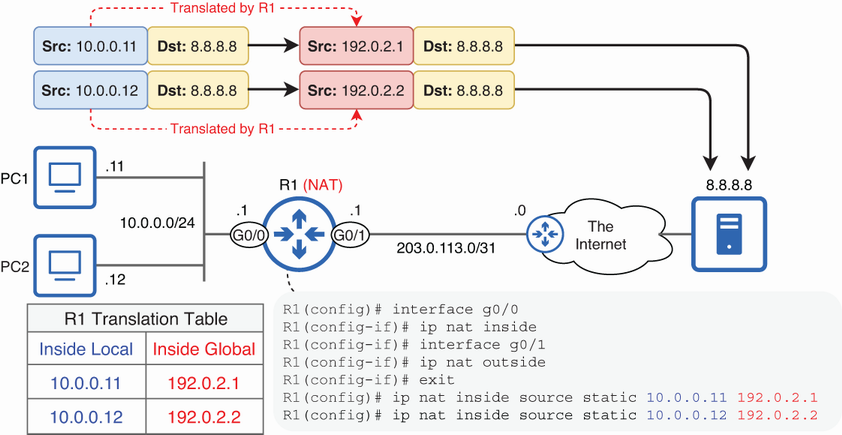

/// figura
NAT estático. Las direcciones locales internas 10.0.0.11 y 10.0.0.12 se asignan estáticamente a las direcciones globales internas 192.0.2.1 y 192.0.2.2, respectivamente.
///

!!!note "Nota"
    La figura sólo muestra las traducciones en una dirección (de PC1/PC2 al servidor), pero R1 también traducirá las respuestas del servidor (como se muestra en las figuras anteriores).

Al asignar la dirección IP privada de PC1 (10.0.0.11) a una dirección IP pública (192.0.2.1), PC1 puede comunicarse a través de internet. Para permitir que otro host interno (PC2) se comunique a través de internet, se necesita una segunda dirección IP pública (192.0.2.2). Esta es la limitación de la NAT estática: es una correspondencia uno a uno. Por lo tanto, no resuelve el problema del agotamiento de direcciones IPv4, aunque a veces se utiliza para permitir que hosts específicos se comuniquen a través de internet. En el siguiente ejemplo, se muestran las configuraciones:

```
R1(config)# 
interface g0/0                                      
R1(config-if)# ip nat inside                                    
R1(config-if)# interface g0/1                                   
R1(config-if)# ip nat outside                                   
R1(config-if)# exit
R1(config)# ip nat inside source static 10.0.0.11 192.0.2.1     
R1(config)# ip nat inside source static 10.0.0.12 192.0.2.2  
```

El primer paso consiste en configurar las interfaces interna y externa con `ip nat {inside | outside}` en el modo de configuración de interfaz, como se explicó en la sección anterior. A continuación, solo queda crear asignaciones estáticas con el comando `ip nat inside source static inside-local inside-global`. En el ejemplo, asigné las direcciones locales internas 10.0.0.11 y 10.0.0.12 a las direcciones globales internas 192.0.2.1 y 192.0.2.2, respectivamente.

Esta figura aclara el significado de las palabras clave del comando:


/// figura
NAT estático. Las direcciones locales internas 10.0.0.11 y 10.0.0.12 se asignan estáticamente a las direcciones globales internas 192.0.2.1 y 192.0.2.2, respectivamente.
///

La palabra clave `inside` le indica a R1 que realice traducciones para las direcciones IP que se originan en la red interna. Específicamente, R1 traducirá las direcciones locales internas a direcciones globales internas a medida que los paquetes se muevan desde la red interna a la red externa.

La palabra clave `source` que sigue indica a R1 que traduzca la dirección IP de origen de los paquetes provenientes de hosts en la red interna. Por lo tanto, cuando R1 reenvía un paquete desde PC1, traducirá la dirección IP de origen del paquete de 10.0.0.11 a 192.0.2.1. Sin embargo, es importante recordar que lo contrario ocurre con la respuesta del host externo. Cuando una respuesta proviene del host externo y está destinada a 192.0.2.1, R1 traducirá la dirección IP de destino del paquete de nuevo a 10.0.0.11, lo que permitirá que el paquete se entregue correctamente a PC1.

La lista de temas del examen CCNA indica que debéis ser capaces de "configurar y verificar NAT de origen interno", por lo que todas las instrucciones NAT que configuremos comenzarán con `ip nat inside source`. El resto del comando es lo que diferencia entre NAT estático, NAT dinámico y PAT dinámico. Al usar la palabra clave `static`, podéis configurar asignaciones estáticas de direcciones locales internas a direcciones globales internas, como en este ejemplo.

Tras configurar NAT estático, puede usar el comando `show ip nat translations` para ver la tabla de traducción del router, como en el siguiente ejemplo. Un aspecto que puede resultar confuso en la salida de este comando es que la columna de la izquierda es `Inside global`, seguida de `Inside local`. Creo que lo contrario tiene más sentido, ¡pero Cisco no me pidió mi opinión al diseñar este comando!

```
R1# show ip nat translations
Pro Inside global      Inside local       Outside local      Outside global
--- 192.0.2.1          10.0.0.11          ---                ---
--- 192.0.2.2          10.0.0.12          ---                ---  
```

Se crea una entrada estática en la tabla para cada asignación: 10.0.0.11 a 192.0.2.1 y 10.0.0.12 a 192.0.2.2; las demás columnas están vacías. Para ver información en estas columnas, abriré navegadores web en PC1 y PC2 y accederé a algunos sitios web. Cuando un host interno se comunica con un host externo, se crean entradas dinámicas adicionales en la tabla NAT. Estas entradas dinámicas están vinculadas a la asignación estática, pero registran el estado de las sesiones de comunicación individuales. El siguiente ejemplo muestra una pequeña parte del resultado posterior:

```
R1# show ip nat translations
Pro Inside global      Inside local       Outside local      Outside global
tcp 192.0.2.1:54568    10.0.0.11:54568    34.117.65.55:443   34.117.65.55:443
--- 192.0.2.1          10.0.0.11          ---                ---
tcp 192.0.2.2:53154    10.0.0.12:53154    34.117.65.55:443   34.117.65.55:443
--- 192.0.2.2          10.0.0.12          ---                ---
```

!!!note "Nota"
    Los números que aparecen después de las direcciones IP (separados por dos puntos) indican los números de puerto TCP y UDP utilizados por PC1/PC2 y los hosts externos. Así se puede identificar que en el ejemplo anterior se está utilizando HTTPS (puerto TCP 443).

Mientras que las entradas estáticas son permanentes, las dinámicas se eliminan tras un periodo de inactividad. Por ejemplo, si PC1 y PC2 dejan de comunicarse con el servidor HTTPS en 34.117.65.55, estas entradas se eliminarán automáticamente, quedando solo las estáticas. También puede usar el comando `clear ip nat translation *` en el modo EXEC privilegiado para borrar manualmente todas las entradas dinámicas de la tabla de traducción NAT.

!!!note "Nota"
    No confundáis las entradas estáticas/dinámicas de la tabla de traducción con NAT estática/dinámica; todas las entradas que acabamos de examinar son el resultado de traducciones NAT estáticas.

### 4.2. NAT dinámico

El siguiente tipo de NAT que veremos es el NAT dinámico. El NAT estático y el dinámico son similares en que ambos implican la asignación uno a uno de direcciones locales internas a direcciones globales internas. La diferencia radica en cómo se asignan estas direcciones. En el NAT estático, cada dirección se configura de forma estática, una por una. En el NAT dinámico, el enrutador crea dinámicamente las direcciones a partir de un conjunto de direcciones disponibles. La figura 8 muestra el NAT dinámico; aparte de los comandos de configuración, el proceso NAT es similar al del NAT estático.

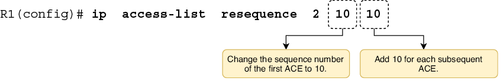

/// figura
NAT dinámico. Se utiliza una ACL para identificar un rango de direcciones locales internas y un grupo NAT para identificar un rango de direcciones globales internas. Las direcciones del grupo se asignan según el principio de primero en llegar, primero en ser atendido.
///

La configuración dinámica de NAT consta de tres pasos principales:

1. Definir un rango de direcciones locales internas (privadas) con una ACL.
2. Definir un rango de direcciones internas globales (públicas) con un grupo NAT.
3. Asignar la ACL al grupo NAT.

Cuando el enrutador reenvía un paquete desde un host con una dirección IP dentro del rango especificado por la ACL, traduce la dirección IP de origen a una de las direcciones globales internas disponibles según el principio de primero en llegar, primero en ser atendido. El siguiente ejemplo muestra las configuraciones necesarias:

```
R1(config)# interface g0/0
R1(config-if)# ip nat inside
R1(config-if)# interface g0/1
R1(config-if)# ip nat outside
R1(config-if)# exit
R1(config)# access-list 1 permit 10.0.0.0 0.0.0.255
R1(config)# ip nat pool POOL1 192.0.2.1 192.0.2.5 prefix-length 29
R1(config)# ip nat inside source list 1 pool POOL1
```

Al igual que en NAT estático, debéis usar `ip nat {inside | outside}` para especificar qué interfaz o interfaces se conectan a la red interna y cuáles a la red externa. A continuación, cread una ACL para identificar un rango de direcciones locales internas que se traducirán. Los paquetes permitidos por la ACL se traducirán, y los paquetes denegados no se traducirán; se reenviarán tal cual (sin embargo, si su dirección IP de origen es una dirección IP privada, el ISP los descartará).

!!!note "Nota"
    La ACL no se utiliza para decidir qué paquetes deben reenviarse y cuáles deben bloquearse; solo se utiliza para decidir qué paquetes deben traducirse mediante NAT. Este es otro uso común de las ACL, que son bastante versátiles.

La ACL que creé es access-list 1 permit 10.0.0.0 0.0.0.255, que permite todas las direcciones IP desde 10.0.0.0 hasta 10.0.0.255, pero deniega todas las demás direcciones IP mediante la denegación implícita. R1 utilizará NAT para traducir los paquetes con una dirección IP de origen dentro del rango permitido, pero los paquetes con una dirección IP de origen que no esté dentro de ese rango no se traducirán.

El siguiente paso consiste en especificar un rango de direcciones IP globales internas (las direcciones IPv4 públicas que se utilizarán para la comunicación a través de Internet). Esto se logra creando un grupo NAT con el comando `ip nat pool name start-ip end-ip prefix-length length`. Los argumentos `start-ip` y `end-ip` identifican el rango; yo configuré `192.0.2.1 192.0.2.5` para especificar un rango de cinco direcciones públicas: 192.0.2.1–192.0.2.5.

!!!note "Nota"
    En una red real, no se puede usar libremente cualquier dirección IPv4 pública. Las direcciones públicas deben ser únicas a nivel mundial, y su asignación está regulada por la IANA y los RIR que dependen de ella (como vimos en el capítulo 20 del volumen 1). Para obtener un rango de direcciones IP públicas, una empresa debe solicitarlo a un ISP o directamente a un RIR.

En el comando `ip nat pool`, también debe especificar una longitud de prefijo; esto se utiliza para garantizar que todas las direcciones dentro del rango especificado se encuentren en la misma subred. Especificé el rango 192.0.2.1–192.0.2.5 con una longitud de prefijo /29. Esto implica la subred 192.0.2.0/29 (todos los bits de host establecidos a 0), que incluye todas las direcciones desde 192.0.2.0 hasta 192.0.2.7. El rango especificado (192.0.2.1–192.0.2.5) está incluido en esa subred, por lo que el comando se ejecuta correctamente. De lo contrario, el comando sería rechazado.

!!!note "Nota"
    En lugar de `prefix-length`, puede usar la palabra clave `netmask`; por ejemplo, `ip nat pool POOL1 192.0.2.1 192.0.2.5 netmask 255.255.255.248`.

El último paso consiste en combinar la ACL y el pool con una instrucción NAT, asignando el rango de direcciones locales internas (la ACL) al rango de direcciones globales internas (el pool). El comando es `ip nat inside source list acl pool pool`. En el ejemplo, asigné la ACL 1 a POOL1 con `ip nat inside source list 1 pool POOL1`. Tras ejecutar este comando, la configuración NAT dinámica queda completa.

Cabe reiterar que la traducción de direcciones de red (NAT) dinámica es uno a uno, al igual que la NAT estática. Varias direcciones locales internas no pueden traducirse a la misma dirección global interna simultáneamente. Las direcciones globales internas se asignan por orden de llegada, y si el grupo se agota, los paquetes de otros hosts no podrán traducirse y se descartarán. Dichos hosts tendrán que esperar a que haya una dirección global interna disponible; esta es una desventaja importante de la NAT dinámica.

La imagen de abajo lo demuestra. Las primeras cinco direcciones locales internas se traducen a direcciones globales internas, pero la sexta no se puede traducir, lo que provoca que el paquete se descarte. El séptimo paquete, procedente de 10.1.1.2, se reenvía sin traducirse porque su dirección IP de origen está bloqueada por la ACL 1.

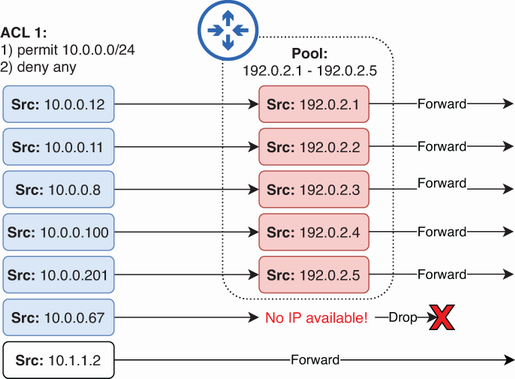

/// figura
El grupo de NAT dinámico se agota. Los paquetes que coinciden con la ACL pero que no se pueden traducir se descartan. Los paquetes rechazados por la ACL se reenvían tal cual.
///


Al igual que con NAT estático, podéis ver la tabla de traducción del enrutador con el comando `show ip nat translations`. La salida es la misma que cuando se usa NAT estático. El siguiente ejemplo muestra algunas entradas en la tabla de traducción de R1. Para cada traducción, se agrega una entrada que muestra solo la asignación local interna a global interna, y luego se agregan entradas adicionales para cada sesión de comunicación desde un host interno a un host externo; en este caso, se muestran una sesión DNS (UDP 53), una sesión HTTPS (TCP 443) y una sesión HTTP (TCP 80):

```
R1# show ip nat translations
Pro Inside global      Inside local       Outside local      Outside global
udp 192.0.2.2:58910    10.0.0.11:58910    8.8.8.8:53         8.8.8.8:53
--- 192.0.2.2          10.0.0.11          ---                ---
tcp 192.0.2.3:33630    10.0.0.12:33630    142.250.207.14:443 142.250.207.14:443
--- 192.0.2.3          10.0.0.12          ---                ---
tcp 192.0.2.1:32980    10.0.0.13:32980    34.107.221.82:80   34.107.221.82:80
--- 192.0.2.1          10.0.0.13          ---                ---
```

De los tipos de NAT que vamos a ver, el NAT dinámico es el que menos casos de uso reales tiene. Al igual que el NAT estático, solo proporciona traducciones uno a uno. Sin embargo, a diferencia del NAT estático, no permite controlar las traducciones. Si el número de hosts internos supera el conjunto disponible de direcciones IP globales internas, no hay una forma sencilla de controlar qué hosts acceden a internet y cuáles deben esperar. Obtener suficientes direcciones IP públicas para dar soporte a todos los hosts internos simplemente no es factible para la mayoría de las empresas hoy en día, dado el problema del agotamiento de las direcciones IPv4.

### 4.3. PAT dinámico

La traducción dinámica de direcciones de puerto (PAT) es un tipo de NAT que traduce tanto las direcciones IP como los números de puerto TCP/UDP (si es necesario) para establecer asignaciones de muchos a uno entre las direcciones locales internas y las direcciones globales internas. Al utilizar un número de puerto único para cada sesión de comunicación, una única dirección IP pública puede ser compartida por varios hosts internos simultáneamente; el enrutador con NAT habilitado utiliza los números de puerto para realizar un seguimiento de cada sesión individual.

En total existen 65.536 (2¹⁶) números de puerto, lo que significa que una única dirección IP pública puede, en teoría, soportar decenas de miles de sesiones desde hosts internos; la cantidad real dependerá de varios factores, como la capacidad de memoria del enrutador. Este tipo de NAT, combinado con los rangos de direcciones IPv4 privadas, ha extendido considerablemente la vida útil de IPv4.
!!!note "Nota"  
    ICMP no utiliza números de puerto como TCP y UDP, pero muchos tipos de mensajes ICMP usan un campo de identificador de 16 bits con un propósito similar. Al traducir paquetes ICMP (por ejemplo, ping), el identificador cumple la función que desempeñan los números de puerto TCP/UDP.

#### 4.3.1. PAT dinámico mediante un pool

Una forma de configurar PAT dinámico es simplemente añadir la palabra clave `overload` al final de una instrucción NAT dinámica; de hecho, otro nombre para PAT es sobrecarga de NAT. El siguiente ejemplo muestra cómo configurar PAT dinámico de esta manera:

```
R1(config)# interface g0/0
R1(config-if)# ip nat inside
R1(config-if)# interface g0/1
R1(config-if)# ip nat outside
R1(config-if)# exit
R1(config)# access-list 1 permit 10.0.0.0 0.0.0.255
R1(config)# ip nat pool POOL1 192.0.2.1 192.0.2.5 prefix-length 29
R1(config)# ip nat inside source list 1 pool POOL1 overload
```

A continuación se muestra cómo funcionan las traducciones después de estas configuraciones. Cuando el enrutador traduce un paquete, mantendrá los números de puerto antes y después de la traducción sin cambios, si es posible. Sin embargo, si el número de puerto previo a la traducción de un paquete ya está en uso para otra sesión, el enrutador lo traducirá a uno disponible.

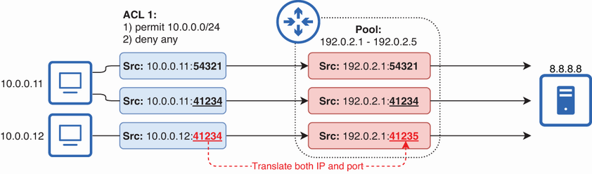

/// figura
PAT dinámico mediante un grupo NAT. El enrutador mantiene los números de puerto pre y post traducción iguales si es posible, pero los traduce si es necesario.
///

!!!note "Nota"
    Una vez traducido el primer paquete de una sesión, se utiliza el mismo número de puerto para el resto de la sesión; cada paquete individual no necesita un número de puerto único.

Observad que en la figura 10, R1 traduce las direcciones locales internas de los tres paquetes a la misma dirección global interna, aunque el grupo NAT tenga cinco direcciones disponibles. El enrutador utilizará todos los números de puerto disponibles para una dirección global interna (es decir, 192.0.2.1) antes de traducir a la siguiente dirección disponible en el grupo (es decir, 192.0.2.2).

Cuando el enrutador recibe los paquetes de respuesta, puede identificar a qué sesión pertenecen gracias a los números de puerto únicos. A continuación, el enrutador puede traducir la dirección global interna de cada paquete a la dirección local interna correspondiente. A continuación se ilustra este proceso.

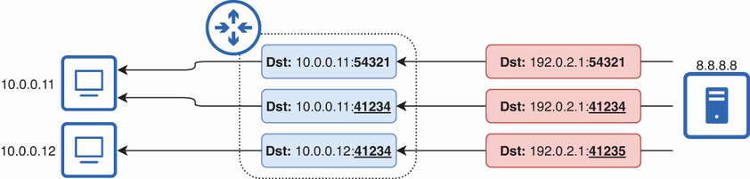

/// figura
El enrutador rastrea cada sesión y traduce la dirección de destino de cada respuesta a la dirección local interna apropiada.
///

#### 4.3.2. PAT dinámico mediante la dirección IP de una interfaz

Aunque la traducción de direcciones IP dinámica (PAT) se puede configurar con un grupo de direcciones, sus capacidades de traducción de muchos a uno implican que muchas organizaciones solo necesitan una única dirección IP pública, no un grupo de ellas. Además, si un enrutador está conectado a internet, ya tiene asignada una dirección IP pública: la dirección IP de la interfaz conectada a internet. Con PAT, el enrutador puede traducir las direcciones IP de los hosts internos a la dirección IP de su propia interfaz.

Ahora se muestra cómo configurar esto en Cisco IOS. Los paquetes de los hosts en la LAN interna de R1 se traducen a la dirección IP de la interfaz G0/1 de R1: 203.0.113.2.

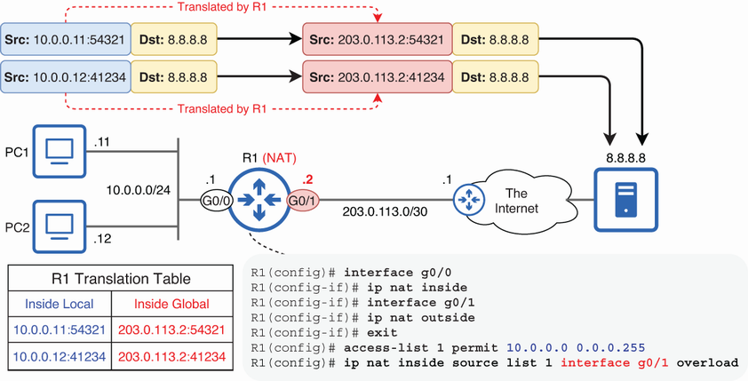

/// figura
PAT dinámico usando la dirección IP de una interfaz. R1 traduce las direcciones locales internas a la dirección IP de su propia interfaz G0/1: 203.0.113.2.
///

Así es como se configura con mayor frecuencia el PAT dinámico, ya que permite que los hosts internos se comuniquen a través de internet utilizando la dirección IP ya configurada en el router; no se necesitan direcciones públicas adicionales. El siguiente ejemplo muestra los pasos de configuración; analicemos cada comando:

```
R1(config)# interface g0/0
R1(config-if)# ip nat inside
R1(config-if)# interface g0/1
R1(config-if)# ip nat outside
R1(config-if)# exit
R1(config)# access-list 1 permit 10.0.0.0 0.0.0.255
R1(config)# ip nat inside source list 1 interface g0/1 overload
```

Como en los ejemplos anteriores, primero debéis configurar las interfaces interna y externa con `ip nat {inside | outside}` en el modo de configuración de interfaz. Luego, como en NAT dinámico, configurad una ACL para determinar qué direcciones IP deben traducirse. Esta ACL funciona igual que las de las configuraciones NAT que vimos anteriormente: los paquetes permitidos por la ACL se traducirán antes de ser reenviados, pero los paquetes rechazados por la ACL se reenviarán tal cual.

!!!note "Nota"
    Si un paquete está permitido por la ACL pero no se puede traducir por falta de direcciones o números de puerto, se descartará. Sin embargo, es probable que esto no ocurra con PAT dinámico, ya que hay muchos números de puerto disponibles.

Solo queda configurar la instrucción NAT. La sintaxis en este caso es `ip nat inside source list acl interface interface overload`. Esto indica al enrutador que use PAT para traducir los paquetes permitidos por la ACL a la dirección IP de la interfaz especificada. Los números de puerto se usan para realizar un seguimiento de cada sesión, incluidas las sesiones del propio enrutador (cuando este envía sus propios paquetes usando esa dirección IP).

!!!note "Nota"
    La palabra clave `overload` es opcional. Si la omitís, IOS la agregará automáticamente.

El siguiente ejemplo muestra la tabla de traducción de R1 después de que tres hosts internos se hayan comunicado con un servidor HTTPS. Las tres direcciones locales internas se traducen a 203.0.113.2, pero todas tienen puertos de origen únicos, lo que permite a R1 realizar un seguimiento de ellas:

```
R1# show ip nat translations 
Pro Inside global      Inside local     Outside local      Outside global
tcp 203.0.113.2:44578  10.0.0.11:44578  34.117.65.55:443   34.117.65.55:443
tcp 203.0.113.2:33032  10.0.0.12:33032  34.117.65.55:443   34.117.65.55:443
tcp 203.0.113.2:39102  10.0.0.13:39102  34.117.65.55:443   34.117.65.55:443
```

Otro comando útil para verificar NAT es `show ip nat statistics`. El siguiente ejemplo muestra la salida en R1:

```
R1# show ip nat statistics
Total active translations: 3 (0 static, 3 dynamic; 3 extended)
Peak translations: 292, occurred 02:54:25 ago
Outside interfaces:
  GigabitEthernet0/1
Inside interfaces:
  GigabitEthernet0/0
Hits: 179478  Misses: 0
CEF Translated packets: 175983, CEF Punted packets: 3495
Expired translations: 1566
. . .
```
