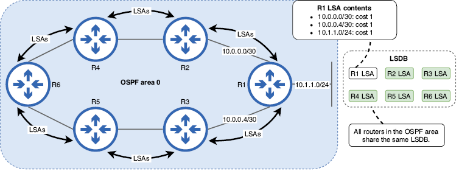
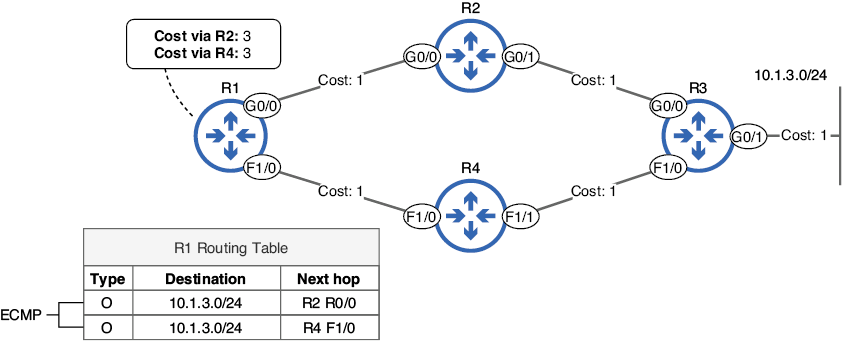
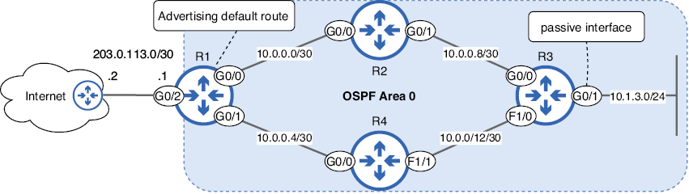
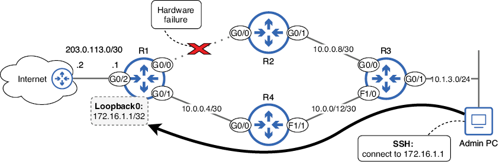
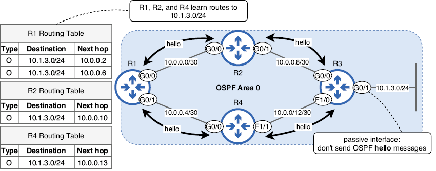
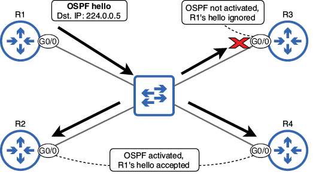
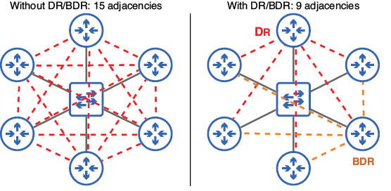
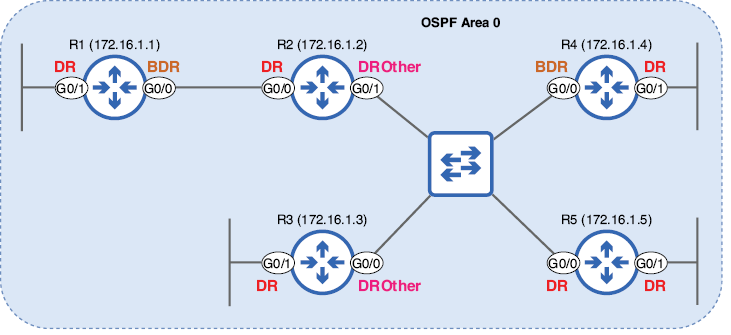
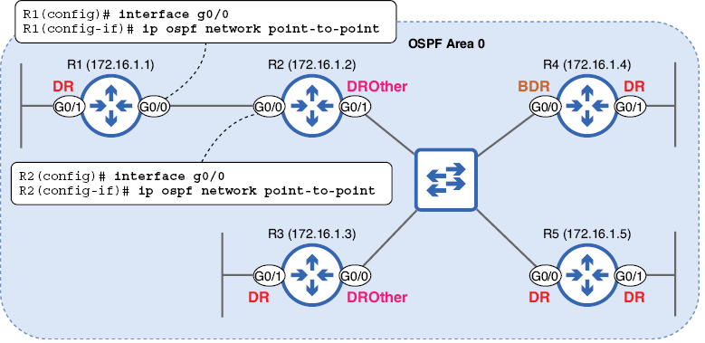
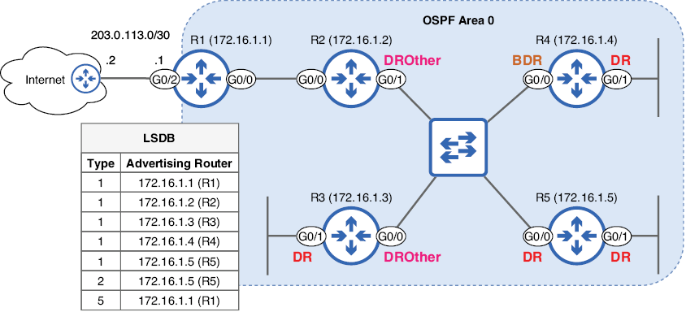

---
hide:
  - navigation
---

# OSPF (Open Shortest Path First)
 
En esta unidad vamos a tratar los siguientes puntos:

+ Anuncios y bases de datos de estados de enlaces de Open Shortest Path First
+ Cómo calculan las rutas los routers OSPF
+ Configuración de OSPF en routers Cisco
+ Cómo los routers OSPF se convierten en vecinos y forman adyacencias

OSPF (Open Shortest Path First) es un protocolo de puerta de enlace interior (IGP) fundamental para las redes empresariales modernas. Ya hemos abordado los protocolos de enrutamiento dinámico en general. En esta unidad, profundizaremos en el tema de OSPF y veremos cómo funciona realmente, incluyendo cómo los routers con OSPF se convierten en vecinos, comparten información de enrutamiento, calculan rutas y muchos otros detalles.

Actualmente, se utilizan dos versiones de OSPF: OSPFv2, que se usa principalmente para redes IPv4, y OSPFv3, que se usa principalmente para redes IPv6 (aunque también puede usarse para IPv4). Para el examen CCNA, la versión que nos interesa es OSPFv2; todas las menciones de OSPF en este libro se refieren específicamente a OSPFv2, como se indica en el tema 3.4 del examen: Configurar y verificar OSPFv2 de área única.

El nombre "Open Shortest Path First" tiene dos aspectos: abierto significa que es un protocolo estándar abierto; OSPF no es propiedad de Cisco. Todos los proveedores pueden implementar OSPF en sus dispositivos de red. Shortest Path First (SPF) es el nombre del algoritmo utilizado para calcular rutas; también se le conoce como algoritmo de Dijkstra, en honor a su creador, Edsger Dijkstra.

## Fundamentos de OSPF

Hay tres pasos principales que siguen los routers OSPF para compartir información de enrutamiento y crear sus tablas de enrutamiento:

+ Establecer relaciones de vecindad con otros routers habilitados para OSPF.
+ Intercambiar información de enrutamiento para construir un mapa de conectividad de la red.
+ Calcula las mejores rutas a cada destino.

Comencemos examinando el segundo y tercer paso de ese proceso, y luego examinaremos los detalles de cómo los routers OSPF se convierten en vecinos en la sección 18.3.

### La base de datos de estado del enlace

Al usar un protocolo de enrutamiento dinámico, los routers intercambian información de enrutamiento y la utilizan para calcular rutas automáticamente. En OSPF, los routers intercambian información de enrutamiento mediante estructuras de datos llamadas anuncios de estado de enlace (LSA). Cada router organiza los LSA que recibe en una base de datos llamada base de datos de estado de enlace (LSDB). La LSDB funciona como el mapa de la topología de red del router, que se utiliza para calcular la ruta más corta a cada red de destino; este es el conocido como *mapa de conectividad* de la red.

La siguiente imagen muestra cómo los routers con OSPF habilitado comparten LSA para construir la LSDB. Cada router crea una LSA que incluye información sobre sus redes conectadas y la envía a sus routers vecinos, quienes la reenvían a otros routers en el área OSPF. Las áreas OSPF son divisiones lógicas de la red que abordaremos más adelante. El proceso de enviar LSA a todos los demás routers en el área OSPF se denomina inundación de LSA.



/// figura
Los routers inundan el área OSPF con LSAs para garantizar que todos tengan una LSDB idéntica. Las LSAs que componen la LSDB contienen información sobre las redes conectadas de cada router, como su costo. La LSA del R1 indica que está conectado a 10.0.0.0/30, 10.0.0.4/30 y 10.1.1.0/24, cada una con un costo de 1.
///

Es fundamental que todos los routers del área tengan la misma LSDB, de modo que cada router pueda usar el algoritmo SPF para calcular rutas a todas las redes de destino. Por ejemplo, los routers de la figura anterior usarán la LSDB para calcular una ruta a la red 10.1.1.0/24. Al usar la LSDB, es como si los routers vieran el mismo diagrama que nosotros, pero con información más detallada sobre cada enlace. Esto contrasta con los protocolos de enrutamiento por vector de distancia como RIP y EIGRP, donde cada router no tiene un mapa completo de la red.

### Áreas OSPF

La red que vimos en la figura de arriba era un ejemplo de OSPF de área única; la red es una unidad lógica única y todos los routers comparten la misma LSDB. En redes pequeñas, un enfoque de área única es práctico y sencillo, y no presenta grandes inconvenientes. Sin embargo, en una red grande con docenas o cientos de routers (en lugar de los seis de la imagen de arriba), un diseño de área única tiene múltiples efectos negativos:

+ El LSDB más grande ocupa más recursos de memoria en los routers.
+ El algoritmo SPF requiere más tiempo y recursos de CPU para calcular rutas.
+ Un solo cambio en la red (es decir, una interfaz que se activa o desactiva) hace que las LSA inunden la red y haga que cada router ejecute nuevamente el algoritmo SPF.

Al dividir una red OSPF grande en varias áreas más pequeñas, minimizamos estos efectos negativos. LSDB más pequeñas implican que OSPF utiliza menos recursos en los routers y que el algoritmo SPF no tarda tanto en calcular las rutas. Los cambios de red solo se anuncian dentro del área local, y si hay inestabilidad en la red (interfaces que se activan y desactivan), sus efectos se limitan a una sola área.

**Un área OSPF se puede definir como un conjunto de routers que comparten la misma LSDB.**

En la siguiente imagen se muestra una red OSPF multiárea compuesta por cuatro áreas. OSPF emplea una estructura jerárquica de dos niveles que consta de un área troncal (área 0) y otras áreas no troncales. Todas las áreas no troncales deben estar conectadas al área 0, y el tráfico entre áreas debe pasar por ella.
!!!note "Nota"
    En OSPF de área única, se recomienda encarecidamente usar el área 0, aunque técnicamente es posible usar otro número de área. Usar el área 0 simplifica el proceso de expansión a OSPF multiárea en el futuro, si es necesario.


/// figura
Una red OSPF multiárea compuesta por cuatro áreas. El área 0 es el área principal a la que deben conectarse las demás áreas. Las áreas 1, 2 y 3 no son áreas principales, y el tráfico entre ellas debe pasar por el área 0.
///

OSPF distingue cuatro tipos de routers. La tabla a continuación resume estos cuatro tipos de routers y enumera los routers de la imagen anterior que pertenecen a cada tipo. Ten en cuenta que algunos routers se clasifican en varias categorías.

| Tipo de router | En la imagen| Descripción |
|----------------|-------------------|-------------|
| Router interno | R1, R2, R6, R7, R8, R9, R10, R11, R12, R13 | Todas las interfaces habilitadas para OSPF están en la misma área. |
| Router de backbone | R1, R2, R3, R4, R5 | Al menos una interfaz está en el área 0. |
| Router fronterizo de área (ABR) | R3, R4, R5 | Routers que conectan una o más áreas al área 0. |
| Router fronterizo del sistema autónomo (ASBR) | R1 | Routers que conectan el sistema autónomo OSPF a redes externas (por ejemplo, Internet). |

!!!note "Nota"
    Aunque R1 tiene una interfaz conectada a Internet, esa interfaz no utiliza OSPF y, por lo tanto, no afecta su clasificación como router OSPF interno.

Un router interno tiene todas sus interfaces habilitadas para OSPF en la misma área, ya sea el área 0 o un área no troncal. Un router troncal tiene al menos una interfaz en el área troncal. Un *router de borde de área* (**ABR**) conecta una (o más) áreas al área 0; dado que las áreas no troncales no pueden conectarse directamente entre sí, todos los ABR también son routers troncales (aunque los routers troncales no son necesariamente ABR).

!!!note "Nota"
    Los ABR mantienen un LSDB separado para cada área a la que están conectados.

El último tipo de router es un router de límite de sistema autónomo (ASBR), un router que conecta el sistema autónomo (AS) OSPF a redes externas, como Internet o la red de otra empresa. Ten en cuenta que este tipo es independiente de los demás; un ASBR puede ser un router troncal o no, y puede ser un router interno o un ABR. Como hemos mostrado en la tabla, el R1 de la imagen es un router interno, un router troncal y un ASBR, todo a la vez. Más adelante, veremos cómo configurar una ruta predeterminada en un ASBR y anunciarla a otros routers del AS OSPF.

Las rutas OSPF se pueden clasificar como intraárea, interárea o externas. Las rutas intraárea son rutas a destinos en la misma área OSPF que el router; por ejemplo, si el router es interno en el área 1, todas las rutas a destinos dentro del área 1 son rutas intraárea. Las rutas interárea son rutas a destinos en un área a la que el router no se conecta; por ejemplo, si un ABR conectado a las áreas 0 y 1 aprende una ruta al área 2. Finalmente, las rutas a destinos externos (publicadas por un ASBR) se denominan rutas externas.

### Costo de OSPF

La métrica de OSPF se denomina costo y es el valor que utiliza para determinar la mejor ruta a cada destino (la más corta en OSPF). Cada interfaz habilitada para OSPF tiene un valor de costo asociado, y el costo de una ruta es el costo acumulado de cada interfaz desde la que se debe enviar un paquete para llegar a su destino. La siguiente imagen muestra este concepto: el costo de R1 para llegar a 192.168.3.0/24 es el costo acumulado de R1 G0/0, R2 G0/1 y R3 G0/1 (pero no de R2 G0/0 ni de R3 G0/0).


/// figura
El costo de una ruta es el costo acumulado de cada interfaz desde la cual se debe enviar un paquete para llegar a su destino. El costo de R1 para llegar a 192.168.3.0/24 es 3: 1 para R1 G0/0, más 1 para R2 G0/1, más 1 para R3 G0/1.
///

Aunque la representación del costo de OSPF en la figura de arriba es precisa, es más común referirse al costo de un enlace que al costo de cada interfaz que lo compone. Dado que ambos lados del enlace deben tener el mismo costo (se considera una configuración incorrecta si no lo tienen) y que un router solo considera un lado del enlace al calcular el costo de la ruta, es más sencillo considerar el enlace como una sola entidad.

Usando nuevamente el ejemplo de la imagen anterior, no importa si R1 calcula una ruta a 192.168.3.0/24 o R3 a 192.168.1.0/24; el costo es el mismo en ambas direcciones. Salvo cuando me refiero específicamente al costo de una interfaz, me referiré al costo de un enlace en lugar del costo de cada interfaz individual.

#### Ancho de banda de referencia

El costo de un enlace se calcula dividiendo un valor de ancho de banda de referencia entre el ancho de banda del enlace; el ancho de banda de referencia predeterminado es de 100 Mbps. Si este cálculo resulta en un valor menor que 1, el costo OSPF se asigna como 1, ya que OSPF no acepta valores fraccionarios ni decimales. Esto da como resultado los siguientes valores de costo OSPF predeterminados:

+ Enlace de 10 Mbps = 10 (100/10)
+ Enlace de 100 Mbps = 1 (100/100)
+ Enlace de 1000 Mbps (1 Gbps) = 1 (100/1000 = 0,1)
+ Enlace de 10 000 Mbps (10 Gbps) = 1 (100/10 000 = 0,01)

Quizás hayáis notado un problema: con el ancho de banda de referencia predeterminado de 100 Mbps, todos los enlaces con un ancho de banda de 100 Mbps o superior tienen el mismo costo. Si OSPF considera que un enlace de 100 Mbps es tan preferible como uno de 1 Gbps o 10 Gbps, es probable que calcule rutas subóptimas. Más abajo se muestra un ejemplo: aunque la ruta de R1 a 10.1.3.0/24 a través de R4 utiliza enlaces FastEthernet, se considera igual a la ruta de R1 a trav R2, que utiliza enlaces GigabitEthernet.



/// figura
Aunque la ruta a 10.1.3.0/24 vía R2 es superior a la ruta vía R4, el costo OSPF de ambas rutas es el mismo. R1 agrega ambas rutas a la tabla de enrutamiento y las distribuye mediante ECMP.
///

R1 agrega ambas rutas a la tabla de enrutamiento y usará ECMP para equilibrar la carga del tráfico. Si bien ECMP en sí no es perjudicial, intentar reenviar la misma cantidad de tráfico a través de enlaces con anchos de banda muy diferentes podría generar congestión en los enlaces más lentos, mientras que los enlaces más rápidos se subutilizan.

OSPF se desarrolló hace décadas, cuando FastEthernet se consideraba un enlace de muy alta velocidad; por eso, el ancho de banda de referencia predeterminado es de 100 Mbps. Sin embargo, en las redes modernas es mejor ajustar el valor del ancho de banda de referencia para que OSPF pueda diferenciar entre enlaces con mayor ancho de banda. Para ajustar el valor del ancho de banda de referencia, utilice el comando auto-cost reference-bandwidth mbps en el modo de configuración del router OSPF.

En el siguiente ejemplo, se confirma el costo de las interfaces de R1 con el comando `show ip ospf interface brief`. Luego, se ajusta el ancho de banda de referencia a 1000 Mbps, de modo que los enlaces GigabitEthernet tengan un costo de 1 y los enlaces FastEthernet, de 10. Aunque no existe un valor recomendado específico para el ancho de banda de referencia, es común configurarlo para que coincida con el ancho de banda del enlace más rápido de la red. Otra opción es establecer el ancho de banda de referencia en un valor mayor que el ancho de banda del enlace más rápido actual para permitir que se agreguen enlaces aún más rápidos a la red sin tener que volver a ajustar el ancho de banda de referencia.

```
R1# show ip ospf interface brief
Interface    PID   Area   IP Address/Mask    Cost  State Nbrs F/C
Gi0/0        1     0      10.0.0.1/30        1     DR    1/1
Fa1/0        1     0      10.0.0.5/30        1     DR    1/1
R1# configure terminal
R1(config)# router ospf 1
R1(config-router)# auto-cost reference-bandwidth 1000
% OSPF: Reference bandwidth is changed.
        Please ensure reference bandwidth is consistent
 across all routers.
R1(config-router)# do show ip ospf interface brief
Interface    PID   Area   IP Address/Mask    Cost  State Nbrs F/C
Gi0/0        1     0      10.0.0.1/30        1     DR    1/1
Fa1/0        1     0      10.0.0.5/30        10    DR    1/1
```

Como indica el mensaje de advertencia del ejemplo anterior, es importante configurar el mismo ancho de banda de referencia en todos los routers para garantizar una selección de ruta consistente. En el peor de los casos, tener diferentes anchos de banda de referencia podría generar bucles de enrutamiento: si el router A cree que la mejor ruta a un destino es a través del router B, pero el router B cree que la mejor ruta es a través del router A, los paquetes para ese destino se repetirán entre los dos routers hasta que expire su TTL, sin llegar nunca a su destino previsto.

#### Modificar el coste de un enlace

Aunque modificar el ancho de banda de referencia suele ser suficiente para que OSPF seleccione la ruta más eficiente a un destino, en algunos casos, puede ser necesario modificar el coste de un enlace específico para que sea más o menos preferible. Existen dos métodos para hacerlo:

+ Configurar el costo con el comando `ip ospf cost cost` en el modo de configuración de interfaz.
+ Modificar el valor del ancho de banda de la interfaz con el comando `bandwidth kbps` en el modo de configuración de interfaz.

!!!note "Nota"
    Aunque el ancho de banda de referencia está configurado en megabits por segundo, el valor del ancho de banda de la interfaz está configurado en kilobits por segundo.

De los dos, el primer método es el preferido si se desea modificar el costo OSPF de un enlace específico: permite configurar directamente el costo OSPF de la interfaz. El segundo método, en cambio, se utiliza para influir en el cálculo automático de costos que vimos anteriormente: ancho de banda de referencia/ancho de banda de la interfaz. Sin embargo, el valor del ancho de banda de una interfaz afecta más allá de los valores de costo OSPF, como los mecanismos de QoS (calidad de servicio), por lo que generalmente es mejor no modificarlo.

!!!note "Nota"
    Modificar el valor del ancho de banda de una interfaz en realidad no afecta el funcionamiento de la interfaz; es solo un valor utilizado para cálculos como el costo de OSPF, la métrica de EIGRP, etc. Para cambiar la velocidad a la que funciona una interfaz, se ha de utilizar el comando `speed`.

## Configuración de OSPF

En la sección [correspondiente](#activacion-ospf), vimos cómo activar OSPF en las interfaces del router con el comando `network`. Este comando por sí solo es suficiente para que OSPF funcione en su nivel más básico; tras activar OSPF en las interfaces de un router, este intentará establecer relaciones de vecindad y compartir LSA con otros routers conectados a dichas interfaces. En esta sección, veremos cómo configurar otros aspectos de OSPF, incluyendo una forma más sencilla de activar OSPF en las interfaces de un router.

El primer paso para configurar OSPF es crear un proceso OSPF con el comando `router ospf process-id`. Este comando permite acceder al modo de configuración del router, desde donde se puede usar el comando network y muchos otros comandos relacionados con OSPF. Se pueden crear múltiples procesos OSPF. Cada uno de estos procesos calcula de forma independiente sus propias rutas a las redes de destino. Sin embargo, ejecutar múltiples procesos OSPF en un router es extremadamente raro, y los casos de uso específicos quedan fuera del objetivo de este curso. Para esta unidad, solo usaremos el ID de proceso 1 (aunque se puede elegir cualquier otro número).

!!!note "Nota"
    El ID de proceso OSPF es localmente significativo; no importa si coincide con los routers vecinos. Por ejemplo, un router con el ID de proceso OSPF 1 puede convertirse en vecino de un router con el ID de proceso OSPF 65535 (el valor más alto posible).

Aquí se muestra la topología que configuraremos en esta sección: una red OSPF de área única con cuatro routers. La subred 10.1.3.0/24 está conectada a R3 G0/1, que configuraremos como interfaz pasiva (más información más adelante). R1 se conecta a internet y lo configuraremos para que anuncie una ruta predeterminada a los demás routers.



/// figura
Red OSPF de área única con cuatro routers. El R3 se conecta a la subred 10.1.3.0/24 en su interfaz G0/1, una interfaz pasiva. El R1 se conecta a internet y anuncia una ruta predeterminada a los demás routers.
///

### El ID del router

Al usar por primera vez el comando `router ospf` para crear el proceso OSPF, el router se asignará un ID de router (RID), un valor único de 32 bits que lo identifica en el AS OSPF. A diferencia del ID de proceso, el RID debe ser único; no puede haber dos routers con el mismo RID en el AS. Para ver el RID de un router, se puede usar el comando `show ip protocols`; este comando muestra información sobre los protocolos de enrutamiento activos en el router. En el siguiente ejemplo, se crea el proceso OSPF 1 en R1 y verifico su RID:

```
R1(config)# router ospf 1
R1(config-router)# do show ip protocols
. . .
Routing Protocol is "ospf 1"
  Outgoing update filter list for all interfaces is not set
  Incoming update filter list for all interfaces is not set
  Router ID 203.0.113.1
  Number of areas in this router is 1. 1 normal 0 stub 0 nssa
. . .
```

R1 ha seleccionado la dirección IP de su interfaz *G0/2 (203.0.113.1)* como su RID. El RID se asigna en el siguiente orden de prioridad:

1. Configuración manual con el comando router-id
2. Dirección IP más alta en una interfaz de loopback operativa (ascendente/ascendente) (cubriremos las interfaces de loopback en esta sección)
3. Dirección IP más alta en una interfaz física operativa (arriba/arriba)

Como se indicó en el primer punto, se puede configurar manualmente el RID con el comando `router-id`. Sin embargo, este comando solo se puede configurar una vez que se haya ingresado al modo de configuración del router. Para acceder a este modo, primero se debe crear el proceso OSPF con el comando `router ospf`.

Por lo tanto, al crear el proceso OSPF por primera vez, el router no puede considerar ninguna configuración manual de RID: aún no se ha establecido ninguna. En su lugar, solo considera la segunda y la tercera opción para asignar el RID: la dirección IP más alta en una interfaz de *loopback* operativa (si existe alguna) o, en su defecto, la dirección IP más alta en una interfaz física operativa. En este caso, R1 seleccionó la dirección IP más alta en una interfaz física operativa: la de *G0/2*.

!!!note "Nota"
    Si se crea un proceso OSPF y el router no tiene interfaces operativas con una dirección IP, el proceso no podrá iniciarse hasta que se configure el RID o una interfaz con una dirección IP se vuelva operativa.

#### Interfaces de *loopback*

Una interfaz de *loopback* es una interfaz de router virtual que siempre está activa y accesible mientras el dispositivo esté operativo (aunque se puede desactivar mediante el apagado). 

A diferencia de las interfaces físicas (por ejemplo, GigabitEthernet0/1), que dependen de puertos y conexiones físicas, las interfaces de loopback se basan completamente en software. La ventaja de una interfaz de loopback es que proporciona una interfaz estable y fiable que permite identificar y conectarse al router sin depender de ningún puerto físico en particular. Abajo se muestra cómo la interfaz de loopback del R1 proporciona una interfaz estable para que un administrador se conecte mediante Secure Shell (SSH).



/// figura
Un administrador usa SSH para conectarse a la interfaz Loopback0 de R1. Loopback0 no depende del estado de una interfaz física específica, como G0/0, que está inactiva debido a un fallo de hardware.
///

!!!note "Nota"
    SSH es un protocolo utilizado para acceder de forma remota a la CLI de un dispositivo de forma segura.

Si el administrador, por ejemplo, hubiera intentado conectarse a la dirección IP de la interfaz G0/0 de R1, la conexión habría fallado; la interfaz G0/0 está inactiva debido a un fallo de hardware. Por otro lado, la interfaz Loopback0 proporciona una dirección IP estable a la que el administrador puede conectarse independientemente del estado de los puertos físicos de R1. Sin embargo, es importante tener en cuenta que el PC del administrador aún necesita una ruta física válida para llegar a R1. Si tanto G0/0 como G0/1 estuvieran inactivos, el PC no podría conectarse a R1 a pesar de la interfaz Loopback.

Aunque las interfaces de loopback no son obligatorias, se recomienda configurarlas en los routers y activar OSPF para que todos puedan acceder a las interfaces de loopback de los demás. Para crear una interfaz de loopback, utilice el comando interface loopback number; normalmente se empieza con Loopback0. En el siguiente ejemplo, se configura una interfaz de loopback en R1, se le configura una dirección IP y se vuelve a comprobar el RID de OSPF:

```
R1(config)# interface loopback0
R1(config-if)# ip address 172.16.1.1 255.255.255.255
R1(config-if)# do show ip protocols
. . .
  Router ID 203.0.113.1
. . .
```
!!!note "Nota"
    Es estándar configurar las interfaces de loopback con una máscara de red /32 (255.255.255.255). Esto se debe a que, por naturaleza, una interfaz de loopback no necesita comunicarse con otros dispositivos en la misma subred (como lo haría una interfaz física). En cambio, representa un solo dispositivo y, por lo tanto, no necesita un rango de direcciones.

A pesar de configurar una interfaz de loopback, el RID de R1 permanece invariable; para mantenerlo estable, IOS no lo vuelve a seleccionar al configurar una nueva interfaz. Es posible restablecer el proceso OSPF con el comando `clear ip ospf process` en modo EXEC privilegiado, pero ni siquiera esto hará que R1 seleccione la dirección IP de la interfaz de loopback como RID, como se muestra en el siguiente ejemplo:

```
R1# clear ip ospf process
Reset ALL OSPF processes? [no]: yes
R1# show ip protocols
. . .
  Router ID 203.0.113.1
. . .
```
!!!note "Nota"
    Es importante recordar que, una vez que el router haya seleccionado su RID, lo mantendrá incluso si se configura una interfaz de loopback y se restablece OSPF. La dirección IP de una interfaz de loopback solo se usará para la selección inicial del RID al crear el proceso OSPF. Para que un router cambie su RID después de haberlo seleccionado, debe configurarlo manualmente; lo explicaremos a continuación.

#### Cambiar el RID

Una vez que R1 ha seleccionado su RID, la mejor manera de cambiarlo es configurarlo manualmente y luego reiniciar el proceso OSPF (si es necesario). En cualquier caso, codificar el RID del router con configuración manual se considera una buena práctica para garantizar RID predecibles en todos los routers. En el siguiente ejemplo, se configura el comando `router-id` en R1, lo que provoca que cambie su RID:

```
R1(config)# router ospf 1
R1(config-router)# router-id 172.16.1.1
R1(config-router)# do show ip protocols
. . .
  Router ID 172.16.1.1
. . .
```
!!!note "Nota"
    Si el router ya ha establecido una relación de vecindad con uno o más vecinos OSPF, deberá reiniciar el proceso OSPF con el proceso `clear ip ospf` para que el RID recién configurado surta efecto. Sin embargo, en este punto del ejemplo, aún no se hs activado OSPF en ninguna de las interfaces del R1, por lo que no tiene vecinos OSPF. Por eso, el nuevo RID se implementó de inmediato.

Aunque el RID OSPF suele derivarse de una de las direcciones IP del router, es importante tener en cuenta que no es una dirección IP; es simplemente un valor de 32 bits con un formato similar al de una dirección IP (notación decimal con puntos). Siempre que el RID sea único en el AS OSPF, puede ser cualquier valor de 32 bits.

En el siguiente ejemplo, se configura una interfaz de loopback en R2 y luego se crea el proceso OSPF. En este caso, R2 toma la dirección IP de Loopback0 como su RID, ya que se ha configurado la interfaz de loopback antes de crear el proceso OSPF:

```
R2(config)# interface l0
R2(config-if)# ip address 172.16.1.2 255.255.255.255
R2(config-if)# router ospf 1
R2(config-router)# do show ip protocols
. . .
  Router ID 172.16.1.2
. . .
```
!!!note "Nota"
    Por cuestiones de espacio, no se mostrarán las configuraciones, pero también ha sido configurada Loopback0 en R3 (172.16.1.3/32) y R4 (172.16.1.4/32) y se ha creado el proceso OSPF.

#### Direcciones de loopback e interfaces de loopback 

Los mensajes enviados a cualquier dirección en este rango se reenvían al dispositivo local sin transmitirse por la red. Por ejemplo, si se ejecuta el comando ping 127.0.0.1 en una PC, se recibirá una respuesta de la propia PC. Esto puede usarse para probar el software de red del dispositivo.

Aunque comparten el término "loopback", las interfaces de loopback son un concepto diferente de las direcciones de loopback. Las interfaces de loopback son interfaces virtuales en un router a las que se puede asignar cualquier dirección IP válida (excepto el rango de direcciones de loopback reservado). Las interfaces de loopback proporcionan una dirección IP estable y confiable que permite acceder al router y que no depende del estado de una interfaz física específica.

### Activación de OSPF en interfaces {#activacion-ospf}

Activar OSPF en las interfaces es posiblemente la parte más importante de la configuración de OSPF; es lo que le indica al router que cree vecinos OSPF y comparta información de enrutamiento. En el siguiente ejemplo, se utiliza el comando `network` para activar OSPF en las interfaces G0/0, G0/1 y L0 del R1:

```
R1(config)# router ospf 1
R1(config-router)# network 10.0.0.1 0.0.0.0 area 0
R1(config-router)# network 10.0.0.5 0.0.0.0 area 0
R1(config-router)# network 172.16.1.1 0.0.0.0 area 0
R1(config-router)# do show ip protocols
. . .
  Router ID 172.16.1.1
  Number of areas in this router is 1. 1 normal 0 stub 0 nssa
  Maximum path: 4
  Routing for Networks:
    10.0.0.1 0.0.0.0 area 0
    10.0.0.5 0.0.0.0 area 0
    172.16.1.1 0.0.0.0 area 0
. . .
```

!!!note "Nota"
    No se ha activado OSPF en R1 G0/2, que está conectado a internet. Más adelante, configuraremos una ruta predeterminada a través de G0/2 en R1 y la anunciaremos a los vecinos de R1, pero no es necesario activar OSPF en la interfaz.

Sin embargo, existe un método más sencillo para activar OSPF en las interfaces: el comando `ip ospf process-id area area` en el modo de configuración de interfaz. Mientras que el comando `network` especifica un rango de direcciones IP y el router activa OSPF en todas las interfaces con una dirección IP dentro de ese rango, este comando permite especificar explícitamente en qué interfaces se debe activar OSPF. En el siguiente ejemplo, se activa OSPF en las interfaces G0/0, G0/1 y L0 (Loopback0) del R2:

```
R2(config)# interface range g0/0-1,l0
R2(config-if-range)# ip ospf 1 area 0
R2(config-if-range)# do show ip protocols
. . .
  Router ID 172.16.1.2
  Number of areas in this router is 1. 1 normal 0 stub 0 nssa
  Maximum path: 4
  Routing for Networks:
  Routing on Interfaces Configured Explicitly (Area 0):
    Loopback0    
    GigabitEthernet0/0    
    GigabitEthernet0/1
```

Creo que estaremos de acuerdo en que este método es mucho más sencillo que usar el comando `network`. En el siguiente ejemplo, se utiliza este método para activar OSPF también en las interfaces de R3 y R4:

```
R3(config)# interface range g0/0-2,l0
R3(config-if-range)# ip ospf 1 area 0
 
R4(config)# interface range g0/0-1,l0
R4(config-if-range)# ip ospf 1 area 0
```

### Interfaces pasivas

La activación de OSPF en una interfaz hace que el router realice dos acciones clave:

+ Intenta formar relaciones de vecinos con los routers conectados a la interfaz.
+ Anuncia el prefijo de red de la interfaz a los vecinos.

Sin embargo, en algunos casos, podría ser conveniente que el router realice la segunda acción (anunciar el prefijo de red) sin intentar establecer relaciones de red en la interfaz. Para establecer relaciones de vecindad, los routers con OSPF habilitado envían mensajes de saludo desde sus interfaces.

Si una interfaz no está conectada a otro router, estos mensajes de saludo se desperdician, consumiendo recursos de CPU y memoria del router y ancho de banda de la red. Además, estos mensajes OSPF innecesarios pueden representar un riesgo de seguridad, ya que usuarios maliciosos podrían recopilar información sobre la red al examinarlos.

!!!note "Nota"
    Aquí es donde entran en juego las interfaces pasivas. Una interfaz pasiva en OSPF es aquella que no envía mensajes OSPF para iniciar relaciones con vecinos, aunque esté habilitada para OSPF. Sin embargo, el router anunciará el prefijo de red de la interfaz a sus vecinos OSPF, lo que les permite reenviar paquetes a destinos en la red.

La figura de abajo muestra una situación en la que se debe configurar una interfaz pasiva. R3 G0/1 se conecta a la red 10.1.3.0/24, pero no hay otros routers conectados a la interfaz. Para permitir que R1, R2 y R4 conozcan 10.1.3.0/24 y evitar que R3 envíe mensajes de saludo OSPF desde la interfaz, esta debe configurarse como una interfaz pasiva.



/// figura
R3 anuncia el prefijo de red de G0/1 (una interfaz pasiva), pero no envía mensajes de saludo OSPF desde allí.
///

Configurar interfaces de loopback como pasivas también se considera una buena práctica en OSPF. Dado que una interfaz de loopback es una interfaz virtual que no está conectada físicamente a ninguna red, no es prácticamente necesario que envíe mensajes de saludo OSPF para intentar establecer relaciones de vecindad. Para configurar una interfaz pasiva, se utiliza el comando `passive-interface interface-name en el modo de configuración del router. En el siguiente ejemplo, se configuran R3 G0/1 y L0 como interfaces pasivas:

```
R3(config)# router ospf 1
R3(config-router)# passive-interface g0/1
R3(config-router)# passive-interface l0
R3(config-router)# do show ip protocols
. . .
 Routing on Interfaces Configured Explicitly (Area 0):
    Loopback0
    FastEthernet1/0
    GigabitEthernet0/0
    GigabitEthernet0/1
  Passive Interface(s):
    GigabitEthernet0/1
    Loopback0
```

Otro método para configurar interfaces pasivas es usar el comando `passive-interface default`, que establece todas las interfaces como pasivas por defecto. Luego, puede usar el comando `no passive-interface interface-name` para especificar qué interfaces no deben ser pasivas. Este método de configuración puede ser conveniente si un router tiene muchas interfaces habilitadas para OSPF, pero solo unas pocas interfaces en las que necesita establecer relaciones de vecindad OSPF. Aunque este no es el caso de R2, en el siguiente ejemplo, se utiliza este método para configurar L0 como interfaz pasiva y G0/0 y G0/1 como no pasivas:

```
R2(config)# router ospf 1
R2(config-router)# passive-interface default
R2(config-router)# no passive-interface g0/0
R2(config-router)# no passive-interface g0/1
```

### Anunciando una ruta predeterminada

En la mayoría de los casos, los hosts conectados a routers en un sistema autónomo OSPF no solo necesitan comunicarse entre sí, sino también con hosts en redes externas, como Internet. Para habilitar esta comunicación, se puede configurar una ruta predeterminada en el router conectado a su ISP y luego configurarlo para que comparta dicha ruta predeterminada con los demás routers del sistema autónomo OSPF. Aquí se muestra cómo configurar esto.


/// figura
El R1 funciona como un ASBR, anunciando una ruta predeterminada en el AS OSPF. Después de configurar una ruta predeterminada, se utiliza la función `default-information originate` para anunciar la ruta a otros routers en el AS OSPF.
///

Para que R1 anuncie una ruta predeterminada a R2, R3 y R4, primero debe configurar una ruta predeterminada estática en R1. Si configura `default-information origin` en R1 sin configurar una ruta predeterminada, R1 no anunciará una ruta predeterminada a otros routers; primero debe tener una ruta predeterminada en su propia tabla de enrutamiento.

Después de configurar la ruta predeterminada, se ha de usar el comando `default-information originate` en el modo de configuración del router para que R1 anuncie la ruta predeterminada a los demás routers. Esto se muestra en el siguiente ejemplo.

Observad la instrucción adicional agregada a la salida de `show ip protocols`, R1 es ahora un ASBR:

```
R1(config)# ip route 0.0.0.0 0.0.0.0 203.0.113.2
R1(config)# router ospf 1
R1(config-router)# default-information originate
R1(config-router)# do show ip protocols
. . .
Routing Protocol is "ospf 1"
  Outgoing update filter list for all interfaces is not set
  Incoming update filter list for all interfaces is not set
  Router ID 172.16.1.1
  It is an autonomous system boundary router
. . .
```

En el siguiente ejemplo, se utiliza `show ip route ospf on R2` para ver las rutas que R2 aprendió mediante OSPF. R2 aprendió una ruta predeterminada de R1, además de las demás rutas aprendidas mediante OSPF:

```
R2# show ip route ospf
. . .
O*E2  0.0.0.0/0 [110/1] via 10.0.0.1, 00:37:34,
      GigabitEthernet0/0
      10.0.0.0/8 is variably subnetted, 7 subnets, 3 masks
O        10.0.0.4/30 [110/2] via 10.0.0.1, 00:02:09,
      GigabitEthernet0/0
O        10.0.0.12/30 [110/2] via 10.0.0.10, 01:11:30,
      GigabitEthernet0/1
O        10.1.3.0/24 [110/2] via 10.0.0.10, 01:11:30,
      GigabitEthernet0/1
      172.16.0.0/32 is subnetted, 4 subnets
O        172.16.1.1 [110/2] via 10.0.0.1, 01:11:30,
      GigabitEthernet0/0
O        172.16.1.3 [110/2] via 10.0.0.10, 01:11:30,
      GigabitEthernet0/1
O        172.16.1.4 [110/3] via 10.0.0.10, 00:13:54,
      GigabitEthernet0/1
                    [110/3] via 10.0.0.1, 00:02:09,
      GigabitEthernet0/0
```

!!!note "Nota"
    Las interfaces de loopback añaden un coste de 1 a una ruta. Por ejemplo, el coste de R2 para llegar a la interfaz de loopback de R1 (172.16.1.1) es de 2: 1 para el enlace R2-R1, más 1 para la L0 de R1 (Loopback0).

Observad que R2 ha insertado dos rutas a 172.16.1.4 en su tabla de enrutamiento; este es un ejemplo de ECMP. De forma predeterminada, OSPF insertará hasta cuatro rutas de igual costo a un destino en la tabla de enrutamiento. Este valor se puede modificar con el comando `maximum-paths number` en el modo de configuración del router, aunque el valor predeterminado de 4 suele ser suficiente para la mayoría de los escenarios de red.

## Vecinos y adyacencias

Para que los routers OSPF intercambien información de enrutamiento, primero necesitan establecer relaciones de vecindad entre sí. En esta sección, examinaremos este primer paso crucial de OSPF. A modo de resumen, los tres pasos fundamentales del proceso OSPF son establecer relaciones de vecindad, intercambiar información de enrutamiento y calcular rutas. La siguiente tabla resume los cinco tipos de mensajes que OSPF utiliza en este proceso; examinaremos la función de cada uno en esta sección a medida que explicamos cómo los routers OSPF establecen relaciones de vecindad.


| Tipo | Nombre | Objetivo |
|------|--------|----------|
| 1    | Hola (Hello) | Descubrimiento y mantenimiento de vecinos. |
| 2    | Descripción de la base de datos (DBD) | Resume el LSDB del router. Se utiliza para comprobar si el LSDB de cada router es el mismo. |
| 3    | Solicitud de estado de enlace (LSR) | Solicita LSA específicos de un vecino. |
| 4    | Actualización del estado del enlace (LSU) | Envía LSA específicos a un vecino. |
| 5    | Reconocimiento del estado del enlace (LSAck) | Se utiliza para confirmar la recepción de una LSU. |

### Estados vecinos

Para que los routers OSPF intercambien información de enrutamiento, deben pasar por una serie de estados vecinos, en los cuales verifican la coincidencia de diversos parámetros de configuración. La imagne de bajo describe los estados vecinos OSPF, desde Inactivo hasta Completo.

Podríamos hablar largo y tendido sobre este proceso pero sobrepasa los objetivos del curso.


/// figura
Estados vecinos OSPF: Inactivo, Inicialización, Bidireccional, ExStart, Intercambio, Cargando y Completo. Los routers que alcanzan el estado Bidireccional son vecinos OSPF. Algunos routers permanecen en este estado y otros establecen una adyacencia completa.
///

Cuando OSPF se activa en una interfaz, el router envía regularmente mensajes de saludo OSPF, que se utilizan para descubrir dinámicamente vecinos OSPF y mantener las relaciones entre ellos una vez establecidas. Estos mensajes de saludo incluyen información diversa, dos de los cuales son el RID del router local y los RID de cualquier router vecino que tenga en cuenta en la interfaz.

Los mensajes de saludo OSPF se envían a la dirección IP *224.0.0.5*, que es una dirección IP de multidifusión. Mientras que los paquetes de unidifusión son uno a uno (de un host a otro) y los paquetes de difusión son uno a todos, los paquetes de multidifusión son uno a múltiples (pero no necesariamente todos). 

Un paquete enviado a la dirección IP de multidifusión 224.0.0.5 será inundado por un switch y, por lo tanto, recibido por todos los hosts del segmento. Sin embargo, solo las interfaces del router con OSPF activado estarán interesadas en el contenido del paquete; los demás hosts simplemente lo ignorarán, como se muestra en la imagen:



/// figura
Un mensaje `hello` OSPF del R1 se dirige a la dirección de multidifusión 224.0.0.5. El switch inunda la trama y los R2 G0/0 y R4 G0/0 con OSPF habilitado aceptan el mensaje de saludo. El R3 ignora el mensaje de saludo porque G0/0 no está habilitado para OSPF.
///

El primer estado de vecino OSPF es Inactivo, aunque no es realmente un estado de vecino; significa que el router no ha recibido ningún mensaje de saludo en la interfaz. Luego, usando un ejemplo de los estados de vecino que se mostraba en una imagen más arriba, cuando R2 recibe por primera vez un mensaje `hello` de R1, R2 creará una entrada de vecino OSPF para R1 en el estado Init, como se muestra en el siguiente ejemplo:

```
R2# show ip ospf neighbor
Neighbor ID     Pri   State           Dead Time   Address         Interface
172.16.1.1        1   INIT/DROTHER    00:00:38    10.0.0.1        GigabitEthernet0/0
```

`show ip ospf neighbor` es un comando muy útil para comprobar los vecinos OSPF del router y sus estados. El estado inicial significa que el router ha recibido un mensaje `hello` OSPF de un router vecino, pero que dicho mensaje no incluye el RID del router local. R2 enviará entonces su propio mensaje de saludo a R1, incluyendo el RID de R1, tras haberlo aprendido del saludo de R1. Cuando R1 recibe este saludo de R2, R1 crea una entrada de vecino OSPF para R2 en el estado bidireccional, omitiendo el estado inicial. El siguiente ejemplo muestra la entrada de la tabla de vecinos OSPF de R1 para R2:

```
R1# show ip ospf neighbor
Neighbor ID     Pri   State           Dead Time   Address    Interface
172.16.1.2        1   2WAY/DROTHER    00:00:39    10.0.0.2   GigabitEthernet0/0
```

Tras recibir un saludo de R2 (y, por lo tanto, conocer su RID), R1 envía otro saludo a R2, incluyendo esta vez su RID en el mensaje. R2 entonces mueve su entrada de la tabla de vecinos para R1 al estado bidireccional. En este punto, R1 y R2 se consideran vecinos OSPF: se ven y se reconocen mutuamente, pero no han intercambiado información de enrutamiento.

!!!note "Nota"
    En algunos casos, la elección de un router designado (DR) y un router designado de respaldo (BDR) se lleva a cabo en el estado bidireccional.

Para que los routers OSPF intercambien información de enrutamiento, deben establecer una adyacencia OSPF progresando hacia el estado completo. Para ello, pasan a los estados ExStart e Exchange, donde intercambian mensajes de descripción de base de datos (DBD), que son resúmenes del contenido de la LSDB de cada router. En el estado ExStart, determinan qué router liderará el intercambio DBD: el router con el RID más alto se convertirá en el líder y el router con el RID más bajo, en el seguidor. A continuación, el intercambio DBD se lleva a cabo en el estado Exchange.

!!!note "Nota"
    Líder/Seguidor es una actualización reciente de la terminología OSPF, que reemplaza al antiguo "Maestro/Esclavo". Al ser una actualización reciente, los términos antiguos siguen siendo más comunes (y se utilizan en el software Cisco IOS), por lo que conviene conocerlos.

Tras intercambiar las DBD, los routers conocen el contenido de sus respectivas LSDB. A continuación, pasan al estado de carga, donde utilizan mensajes de solicitud de estado de enlace (LSR) para solicitar LSA específicas, mensajes de actualización de estado de enlace (LSU) para enviar LSA y mensajes de acuse de recibo de estado de enlace (LSAck) para confirmar la recepción de LSU.

!!!note "Nota"
    Las LSA son estructuras de datos que contienen información de enrutamiento OSPF y se envían en mensajes LSU. Las LSU son como los sobres que contienen las LSA.

Los routers entran entonces en estado completo, lo que significa que han sincronizado sus LSDB. En este punto, se denominan vecinos adyacentes o completamente adyacentes, y su relación de vecindad se denomina ahora adyacencia o adyacencia completa. Mientras la conexión entre los routers se mantenga estable, deberían permanecer en estado completo, compartiendo LSA a medida que la red cambia.

Incluso después de establecer una relación de vecinos o adyacencia, los routers seguirán enviando mensajes de saludo a intervalos regulares, según lo determinado por el temporizador de saludo, que es de 10 segundos por defecto. El propósito de estos mensajes de saludo es mantener las relaciones con los vecinos. Si un router deja de recibir mensajes de saludo de un vecino, lo eliminará de la tabla de vecinos; esto se determina por el temporizador de inactividad, que es de 40 segundos por defecto. Esto significa que un router eliminará a un vecino si no ha recibido un mensaje `hello` de este durante los últimos 40 segundos.

### Tipos de red OSPF

OSPF utiliza una configuración de interfaz denominada *network type* para determinar su comportamiento en una red específica. En este contexto, una red es una conexión entre dos o más routers (un segmento). El tipo de red influye en aspectos como los temporizadores de mensajes OSPF, la elección de un DR y un BDR, y si todas las relaciones de vecinos se convertirán en adyacencias completas.

Existen varios tipos de redes OSPF: de difusión, multiacceso sin difusión (NBMA), punto a punto, punto a multipunto, punto a multipunto sin difusión y loopback. Esta tabla resume estos dos tipos de red.


| Broadcast | Point-to-point |
|-----------|----------------|
| DR/BDR elegido | Sin DR/BDR |
| Establecer adyacencia completa solo con DR y BDR | Establecer adyacencia completa |
| Vecinos descubiertos dinámicamente | Vecinos descubiertos dinámicamente |
| Temporizadores predeterminados: hello = 10, dead = 40 | Temporizadores predeterminados: hello = 10, dead = 40 |

Las dos características comunes de estos tipos de red son la detección dinámica de vecinos y los temporizadores predeterminados. Al enviar mensajes de saludo desde interfaces compatibles con OSPF, los routers pueden detectar dinámicamente qué vecinos están conectados a la interfaz, en lugar de requerir que un administrador configure manualmente las direcciones IP de los vecinos (como se requiere en algunos tipos de red OSPF).

El temporizador de saludo predeterminado en ambos tipos de red es de 10 segundos, por lo que las interfaces envían mensajes de saludo a intervalos de 10 segundos. El temporizador de inactividad predeterminado es de 40 segundos, por lo que un vecino se elimina de la tabla de vecinos si no se recibe ningún mensaje de saludo durante 40 segundos. Otros tipos de red utilizan temporizadores predeterminados más largos, de 30 y 120 segundos.

!!!note "Nota"
    Si el router detecta una falla de enlace físico (lo que provoca que la interfaz pase a estado inactivo), OSPF eliminará inmediatamente al vecino, sin necesidad de esperar a que finalice la cuenta regresiva del temporizador de inactividad. Este temporizador solo es relevante si la interfaz permanece activa, pero el router deja de recibir mensajes de saludo del vecino (por cualquier motivo).

#### Tipo de red de *broadcast*

*Broadcast* es el tipo de red OSPF predeterminado para las interfaces Ethernet (de todas las velocidades: FastEthernet, GigabitEthernet, etc.). Puede confirmarse con el comando `show ip ospf interface`, como en el siguiente ejemplo:

```
R1# show ip ospf interface g0/0
GigabitEthernet0/0 is up, line protocol is up 
  Internet Address 10.0.0.1/30, Area 0, Attached via Network Statement
  Process ID 1, Router ID 172.16.1.1, Network Type BROADCAST, Cost: 1
. . .
```

La principal característica definitoria del tipo de red de difusión es que un router designado (DR) y un router designado de respaldo (BDR) se eligen en el estado de vecino bidireccional; los demás routers conectados al segmento se convierten en DROthers (generalmente se pronuncia DR-other). Mientras que el DR y el BDR establecen adyacencias completas con todos los routers del segmento, los DROthers solo establecen adyacencia completa con el DR y el BDR del segmento y permanecen vecinos en el estado bidireccional con otros DROthers; no intercambian LSA entre sí.

El propósito de elegir un DR y un BDR es reducir la cantidad de tráfico OSPF en el segmento, requiriendo únicamente que los routers intercambien LSA (en mensajes LSU) con el DR y el BDR del segmento. Abajo se muestra cómo se reduce el número de adyacencias (y, por lo tanto, los intercambios de LSA), lo que limita la cantidad de tráfico OSPF en el segmento y la cantidad de recursos utilizados en los routers.



/// figura
Seis routers están conectados al mismo segmento de red. Sin el DR/BDR, se requerirían 15 adyacencias OSPF (y 15 intercambios LSA). Con el DR/BDR, solo se requieren 9, lo que reduce la cantidad de tráfico OSPF.
///

!!!note "Nota"
    Para dirigir los mensajes únicamente al DR y al BDR, los DRothers envían los paquetes a la dirección IP de multidifusión 224.0.0.6. Recuerdad las dos direcciones IP de multidifusión OSPF: 224.0.0.5 (todos los routers OSPF) y 224.0.0.6 (solo DR y BDR).

Dependiendo de la cantidad de routers conectados al segmento, la función DR/BDR de la red de difusión puede reducir considerablemente los recursos utilizados por OSPF en el segmento. Esto podría reducirse aún más seleccionando solo un DR, pero el BDR es importante para proporcionar estabilidad y resiliencia; si el DR falla por alguna razón, el BDR asume automáticamente el nuevo DR.

Ahora se muestra un ejemplo de AS OSPF con DR, BDR y DROthers etiquetados. Se ha de tener en cuenta que el DR y el BDR se eligen por segmento, no por área. Por ejemplo, R2 es el DR para el segmento R1-R2, pero un DROther para el segmento R2-R3-R4-R5.



/// figura
Un AS OSPF compuesto por seis segmentos. La elección de DR/BDR se realiza por segmento, no por área. Los RID están entre paréntesis.
///

Las interfaces G0/1 de R1, R3, R4 y R5 en la figura de arriba están etiquetadas como DR. Dado que no hay otros routers conectados a esos segmentos, no se realiza ninguna elección de DR/BDR; los routers simplemente se declaran como DR para esos segmentos. Sin embargo, no se establecerán adyacencias ni se intercambiarán LSAs desde esas interfaces; DR es solo un título en este caso. Además, estas interfaces deben configurarse en modo pasivo, por lo que no se enviarán mensajes de saludo OSPF.

El siguiente ejemplo muestra la salida de `show ip ospf neighbor` en R5. Como DR del segmento R2-R3-R4-R5, R5 tiene adyacencia completa con todos los demás routers:

```
R5# show ip ospf neighbor
Neighbor ID  Pri  State         Dead Time  Address   Interface
172.16.1.2   1    FULL/DROTHER  00:00:34   10.0.0.1  GigabitEthernet0/0
172.16.1.3   1    FULL/DROTHER  00:00:34   10.0.0.2  GigabitEthernet0/0
172.16.1.4   1    FULL/BDR      00:00:38   10.0.0.3  GigabitEthernet0/0
```

Aunque la salida no indica explícitamente que R5 es el DR, dado que ninguno de los otros tres routers conectados al segmento lo es, se puede concluir que R5 debe ser el DR del segmento. Confirmemos esto usando el mismo comando en R2:

```
R2# show ip ospf neighbor
Neighbor ID  Pri  State         Dead Time  Address   Interface
172.16.1.1   1    FULL/BDR      00:00:30   10.0.0.9  GigabitEthernet0/0
 
172.16.1.3   1    2WAY/DROTHER  00:00:34   10.0.0.2  GigabitEthernet0/1
 
172.16.1.4   1    FULL/BDR      00:00:30   10.0.0.3  GigabitEthernet0/1
172.16.1.5   1    FULL/DR       00:00:31   10.0.0.4  GigabitEthernet0/1
```

Como se muestra en la salida, R5 es efectivamente el DR del segmento. Otro punto importante es que R2 y R3 no forman una adyacencia completa; como DROthers, permanecen vecinos en el estado bidireccional. Esto significa que no intercambian LSA entre sí.

!!!note "Nota"
    Aunque los DROthers no intercambian LSA directamente entre sí, conocerán las LSA de cada uno a través del DR/BDR. Recuerdad que todos los routers en el área OSPF deben tener la misma LSDB.

A estas alturas, probablemente uno se pregunte cómo se eligen los DR y los BDR. Los DR y los BDR se eligen según los dos criterios siguientes:

+ La máxima prioridad de interfaz
+ El RID más alto

El router con la prioridad de interfaz más alta se convertirá en el DR del segmento, y el router con la segunda prioridad más alta se convertirá en el BDR. La prioridad de interfaz OSPF es un valor configurable (predeterminado: 1) que se puede configurar con el comando `ip ospf priority priority` en el modo de configuración de interfaz.

!!!note "Nota"
    Si deseamos asegurarnos de que un router nunca se convierta en DR o BDR de un segmento, se puede configurar `ip ospf priority 0` en su interfaz.

En el ejemplo de la última imagen, todas las interfaces tenían la prioridad predeterminada de 1, por lo que se utilizó el segundo parámetro para determinar el DR de cada segmento: el RID OSPF. Si las prioridades de las interfaces están empatadas, el router con el RID más alto se convertirá en el DR (R5, 172.16.1.5) y el router con el segundo RID más alto, en el BDR (R4, 172.16.1.4).

Modifiquemos la prioridad de la interfaz de R2 G0/1 para probar la elección de DR/BDR. En el siguiente ejemplo, se establece la prioridad de la interfaz de R2 G0/1 en 100 y se confirman los resultados:

```
R2(config)# interface g0/1
R2(config-if)# ip ospf priority 100
R2(config-if)# do show ip ospf interface g0/1
GigabitEthernet0/1 is up, line protocol is up 
  Internet Address 10.0.0.1/29, Area 0, 
  Attached via Interface Enable
  Process ID 1, Router ID 172.16.1.2, Network Type BROADCAST, Cost: 1
. . .
  Transmit Delay is 1 sec, State DROTHER, Priority 100
. . .
R2(config-if)# do show ip ospf neighbor
Neighbor ID  Pri  State         Dead Time  Address   Interface
172.16.1.1   1    FULL/BDR      00:00:30   10.0.0.9  GigabitEthernet0/0
172.16.1.3   1    2WAY/DROTHER  00:00:34   10.0.0.2  GigabitEthernet0/1
172.16.1.4   1    FULL/BDR      00:00:30   10.0.0.3  GigabitEthernet0/1
172.16.1.5   1    FULL/DR       00:00:31   10.0.0.4  GigabitEthernet0/1
```

Aunque R2 G0/1 ahora tiene la máxima prioridad del segmento, R5 y R4 siguen siendo el DR y el BDR. Esto se debe a que, una vez elegidos, no serán *preempted* (sus roles no se asumirán), incluso si se aumenta la prioridad de un router existente o si un router con mayor prioridad se conecta al segmento. Para que un DR o un BDR ceda su rol, se puede usar el comando `clear ip ospf process` para restablecer el proceso OSPF del router, como se hace en R5 en el siguiente ejemplo:

```
R5# clear ip ospf process
Reset ALL OSPF processes? [no]: yes
R5# show ip ospf neighbor
Neighbor ID  Pri  State         Dead Time  Address   Interface
172.16.1.2   100  FULL/BDR      00:00:35   10.0.0.1  GigabitEthernet0/0
172.16.1.3   1    2WAY/DROTHER  00:00:31   10.0.0.2  GigabitEthernet0/0
172.16.1.4   1    FULL/DR       00:00:31   10.0.0.3  GigabitEthernet0/0
```

Tras reiniciar el proceso OSPF de R5, R4 (anteriormente el BDR) se convierte en el nuevo DR, y R2 en el nuevo BDR, a pesar de tener la máxima prioridad. Estos resultados revelan un punto importante sobre el funcionamiento del DR y el BDR: si el DR falla, los routers conectados al segmento no realizan una elección para el nuevo DR. En su lugar, el BDR asume inmediatamente el rol de nuevo DR; por eso, R4 se convierte en el nuevo DR. A continuación, se realiza una elección para determinar el nuevo BDR; R2 gana esta elección y se convierte en el nuevo BDR. Para que R2 sea el DR, habría que reiniciar el proceso OSPF de R4, lo que haría que R2 (el BDR) asumiera inmediatamente el rol de R4.

#### Tipo de red punto a punto

Si bien la característica DR/BDR del tipo de red de difusión puede reducir la cantidad de recursos utilizados por OSPF, la elección de un DR y un BDR extiende el tiempo que tardan los routers en establecer una adyacencia completa; si solo hay dos routers conectados al segmento, esto es innecesario e ineficiente.

Una conexión punto a punto es un enlace directo entre dos routers. Cuando OSPF está habilitado en este enlace con el tipo de red predeterminado de difusión, un router se convierte en el DR y el otro, en el BDR. Sin embargo, estas designaciones no ofrecen ninguna ventaja en este caso, ya que ambos routers establecen una adyacencia completa.

!!!note "Nota"
    El tipo de red punto a punto es el predeterminado en las interfaces serial, que solían ser comunes en las conexiones WAN. Debido a la mayor velocidad y el menor costo de la fibra óptica Ethernet, las conexiones serial ahora se consideran una tecnología obsoleta. Para usar este tipo de red en enlaces Ethernet, debe configurarse manualmente.

Al usar el tipo de red punto a punto OSPF, eliminamos el proceso de selección de DR/BDR, lo que permite a los routers establecer una adyacencia completa en menos tiempo. Este tipo de red está diseñado para conexiones directas entre dos routers y es la opción más eficiente en estas situaciones. La siguiente imagen muestra una situación en la que se debe configurar el tipo de red punto a punto. R1 y R2 tienen una conexión punto a punto, por lo que no es necesario seleccionar un DR ni un BDR.



La elección de un DR y BDR en una conexión entre dos routers no es necesaria, por lo que el enlace R1–R2 debe utilizar el tipo de red punto a punto.

Para configurar el tipo de red punto a punto, se ha de utilizar el comando `ip ospf network point-to-point` en el modo de configuración de interfaz. ¡Hay que asegurarse de hacerlo en ambos lados de la conexión! En el siguiente ejemplo, se configura el tipo de red punto a punto en R1 G0/0 y R2 G0/0 y luego se confirma. Observamos que R1 y R2 establecen una adyacencia completa, pero ninguno es un DR ni un BDR, como lo indica el estado FULL/-:

```
R1(config)# interface g0/0
R1(config-if)# ip ospf network point-to-point
 
R2(config)# interface g0/0
R2(config-if)# ip ospf network point-to-point
R2(config-if)# do show ip ospf neighbor
Neighbor ID  Pri  State         Dead Time  Address   Interface
172.16.1.3   1    2WAY/DROTHER  00:00:35   10.0.0.2  GigabitEthernet0/1
172.16.1.4   1    FULL/BDR      00:00:38   10.0.0.3  GigabitEthernet0/1
172.16.1.5   1    FULL/DR       00:00:36   10.0.0.4  GigabitEthernet0/1
172.16.1.1   0    FULL/  -      00:00:38   10.0.0.9  GigabitEthernet0/0
```

### Requisitos de los vecinos

Aunque los tipos de red punto a punto y de difusión OSPF permiten que los routers descubran vecinos de forma dinámica, eso no garantiza que realmente se convertirán en vecinos; hay un conjunto de requisitos que deben cumplirse, incluidos varios parámetros que deben coincidir (y uno que no debe coincidir):

+ El número de área debe coincidir.
+ La subred (dirección de red, máscara de red) debe coincidir.
+ El proceso OSPF no estar *shutdown*.
+ Los RID deben ser únicos.
+ Los temporizadores de *hello* y *dead* deben coincidir.
+ La configuración de autenticación debe coincidir.
+ La configuración de MTU de IP debe coincidir.*
+ El tipo de red debe coincidir.*

Una discrepancia entre los dos últimos, que se ha marcado con asteriscos (*), no impedirá que los routers se conviertan en vecinos, pero sí que OSPF funcione correctamente. Analicemos estos requisitos uno por uno y veamos cómo afecta OSPF. Utilizaremos una conexión simple entre dos routers: R1 (192.168.1.1/30) y R2 (192.168.1.2/30). En el siguiente ejemplo, se configura una discrepancia de número de área en R1 y R2, y no se convierten en vecinos OSPF. Tras corregir la discrepancia, el problema se resuelve:

```
R1(config-if)# ip ospf 1 area 0

R2(config-if)# ip ospf 1 area 1
*Jun  9 03:40:12.255: %OSPF-4-ERRRCV: 
Received invalid packet: mismatched area ID from 
backbone area from 192.168.1.1, GigabitEthernet0/0
R2(config-if)# do show ip ospf neighbor
R2(config-if)# ip ospf 1 area 0
R2(config-if)# do show ip ospf neighbor
Neighbor ID  Pri  State     Dead Time  Address      Interface
192.168.1.1  1    FULL/BDR  00:00:37   192.168.1.1  GigabitEthernet0/0
```

En el siguiente ejemplo, se cambia la máscara de red de la interfaz de R2. Aunque no cambié la dirección IP, la simple discrepancia de la máscara de red hace que la adyacencia cambie de "Completa" a "Inactiva".

```
R2(config-if)# ip address 192.168.1.2 255.255.255.0
*Jun  9 04:36:32.664: %OSPF-5-ADJCHG: Process 1, 
Nbr 192.168.1.1 on GigabitEthernet0/0 from FULL to 
DOWN, Neighbor Down: Interface down or detached
R2(config-if)# ip address 192.168.1.2 255.255.255.252
*Jun  9 04:37:36.071: %OSPF-5-ADJCHG: Process 1, 
Nbr 192.168.1.1 on GigabitEthernet0/0 from LOADING to 
FULL, Loading Done
```

El tercer requisito es que el proceso OSPF no debe estar en `shutdown`, lo que se refiere al comando que se puede usar en el modo de configuración del router para deshabilitar OSPF, de forma similar a cómo se usa el comando `shutdown` para deshabilitar una interfaz. Queda demostrado en el siguiente ejemplo:

```
R2(config)# router ospf 1
R2(config-router)# shutdown
*Jun  9 05:02:01.379: %OSPF-5-ADJCHG: Process 1, 
Nbr 192.168.1.1 on GigabitEthernet0/0 from FULL to 
DOWN, Neighbor Down: Interface down or detached
R2(config-router)# no shutdown
*Jun  9 05:02:07.114: %OSPF-5-ADJCHG: Process 1, 
Nbr 192.168.1.1 on GigabitEthernet0/0 from LOADING to 
FULL, Loading Done
```

El cuarto requisito es que los RID de los routers sean únicos, es decir, el único parámetro que no debe coincidir. En el siguiente ejemplo, modificamos el RID de R2 para que coincida con el de R1, restablecemos el proceso OSPF y no logran convertirse en vecinos. Eliminar la configuración del RID de R2 soluciona el problema:

```
R2(config-router)# router-id 192.168.1.1
R2(config-router)# do clear ip ospf process
Reset ALL OSPF processes? [no]: yes
*Jun  9 05:06:09.209: %OSPF-5-ADJCHG: Process 1, 
Nbr 192.168.1.1 on GigabitEthernet0/0 from FULL to 
DOWN, Neighbor Down: Interface down or detached    
*Jun  9 05:06:11.679: %OSPF-4-DUP_RTRID_NBR: OSPF 
detected duplicate router-id 192.168.1.1 from 
192.168.1.1 on interface GigabitEthernet0/0
R2(config-router)# no router-id 192.168.1.1
*Jun  9 05:06:29.284: %OSPF-5-ADJCHG: Process 1, 
Nbr 192.168.1.1 on GigabitEthernet0/0 from LOADING to 
FULL, Loading Done
```

El quinto requisito es que los temporizadores de saludo y de inactividad coincidan. El temporizador de saludo predeterminado es de 10 segundos y el de inactividad, de 40 segundos, pero se pueden configurar con los comandos `ip ospf hello-interval seconds` e `ip ospf dead-interval seconds` en el modo de configuración de interfaz. En el siguiente ejemplo, modifico el temporizador de saludo de R2, lo que provoca la inactividad de la adyacencia con R1:

```
R2(config)# interface g0/0
R2(config-if)# ip ospf hello-interval 5
*Jun  9 05:14:34.525: %OSPF-5-ADJCHG: Process 1, 
Nbr 192.168.1.1 on GigabitEthernet0/0 from FULL to 
DOWN, Neighbor Down: Dead timer expired
R2(config-if)# ip ospf hello-interval 10
*Jun  9 05:17:25.749: %OSPF-5-ADJCHG: Process 1, 
Nbr 192.168.1.1 on GigabitEthernet0/0 from LOADING to 
FULL, Loading Done
```

El sexto requisito es que la configuración de autenticación coincida. Puede configurar una contraseña para autenticar vecinos OSPF y garantizar que solo los routers previstos establezcan relaciones de vecindad. Se puede usar el comando `ip ospf authentication` en el modo de configuración de interfaz para habilitar la autenticación y el comando `ip ospf authentication-key password` para configurar la contraseña.

El séptimo requisito es que la configuración de la unidad máxima de transmisión (MTU) IP de los routers coincida. Con anterioridad hemos mencionodo alguna vez de forma breve la MTU IP; ésta determina el tamaño máximo de un paquete IPv4. Si bien una discrepancia en la MTU IP no impide que dos routers OSPF se conviertan en vecinos, no podrán establecer una adyacencia completa ni avanzar más allá de los estados ExStart/Exchange. Se puede modificar la MTU IP de una interfaz con el comando `ip mtu bytes` en el modo de configuración de interfaz; la configuración predeterminada en las interfaces Ethernet es de 1500 bytes.

El requisito final es que los tipos de red OSPF coincidan. Este requisito es diferente a los demás que hemos tratado hasta ahora: un router con el tipo de red de difusión y un router con el tipo de red punto a punto podrán establecer una adyacencia completa. Sin embargo, el problema radica en que los routers no podrán sincronizar sus LSDB; no aprenderán las rutas del otro.

En el siguiente ejemplo, configuramos una interfaz de loopback en R2 y habilito OSPF. Luego, configuramos el tipo de red punto a punto G0/0 en R2, lo que resulta en una discrepancia en el tipo de red: la interfaz de R1 sigue usando el tipo de red de difusión. A pesar de la discrepancia en el tipo de red, la tabla de vecinos OSPF de R2 muestra una adyacencia completa con R1. A continuación, revisamos las tablas de vecinos y de enrutamiento de R1:

```
R2(config)# interface l0
R2(config-if)# ip address 10.10.10.2 255.255.255.255
R2(config-if)# ip ospf 1 area 0    
R2(config-if)# interface g0/0
R2(config-if)# ip ospf network point-to-point
R2(config-if)# do show ip ospf neighbor
Neighbor ID  Pri  State     Dead Time  Address      Interface
192.168.1.2  1    FULL/  -  00:00:34   192.168.1.2  GigabitEthernet0/0
 
R1# show ip ospf neighbor
Neighbor ID  Pri  State    Dead Time   Address      Interface
192.168.1.2  1    FULL/DR  00:00:34    192.168.1.2  GigabitEthernet0/0
R1# show ip route ospf
. . .
```

Las tablas de vecinos OSPF de R1 y R2 indican adyacencia completa, pero hay algo extraño: la salida de R2 muestra un estado FULL/ - (como se espera al usar el tipo de red punto a punto), pero la salida de R1 muestra FULL/DR; R1 cree que R2 es el DR. Además, aunque OSPF está activado en la interfaz de loopback de R2, la tabla de enrutamiento de R1 no muestra ninguna ruta a la dirección de la interfaz (10.10.10.2/32). A pesar de lograr la adyacencia completa, R1 y R2 no pudieron sincronizar sus LSDB. La solución es asegurar que ambos lados de la conexión usen el mismo tipo de red, ya sea de difusión o punto a punto.

## Tipos de LSA

Los routers OSPF comparten información de enrutamiento mediante el envío de mensajes LSU, que contienen LSA. Existen varios tipos de LSA, cada uno con su propia finalidad, pero para el examen CCNA, debe conocer tres:

+ Tipo 1 (LSA de router): generado por todos los routers, este LSA describe los enlaces del router.
+ Tipo 2 (LSA de red): generada por el DR de una red de difusión, esta LSA enumera todos los routers en el segmento.
+ Tipo 5 (LSA externa AS): generada por ASBR, esta LSA anuncia rutas a redes externas (es decir, una ruta predeterminada a Internet).

Se muestra el AS OSPF que analizamos con anterioridad modificado con una conexión a Internet, la cual R1 anuncia con `default-information originate`. Se observa el contenido de la LSDB, compartida por los cinco routers.



/// figura
Un AS OSPF y el contenido de su LSDB. Cada router anuncia una LSA de tipo 1 (router). R5, como DR del segmento R2-R3-R4-R5, anuncia una LSA de tipo 2 (red). R1, como ASBR, anuncia una LSA de tipo 5.
///

!!!note "Nota"
    R3, R4 y R5 no anuncian una LSA de tipo 2 para sus interfaces G0/1. Como se mencionó anteriormente, al no tener vecinos en esas interfaces, son DR solo de nombre.

Para ver la LSDB de OSPF, utilizaremos el comando `show ip ospf database`. El resultado de este comando debe ser el mismo en todos los routers; todos deben tener las mismas LSA en su LSDB. En el siguiente ejemplo, se utilizs el comando en el R1. Únicamente tened en cuenta que cada router anuncia una LSA de tipo 1, el R5 anuncia una única LSA de tipo 2 y el R1 anuncia una única LSA de tipo 5.

```
R1# show ip ospf database
           OSPF Router with ID (172.16.1.1) (Process ID 1)
             Router Link States (Area 0)
Link ID      ADV Router   Age    Seq#         Checksum   Link count
172.16.1.1   172.16.1.1   1851   0x80000008   0x0015D5   3
172.16.1.2   172.16.1.2   1852   0x8000000A   0x003688   4
172.16.1.3   172.16.1.3   1825   0x80000014   0x002510   3
172.16.1.4   172.16.1.4   1824   0x80000018   0x0052D9   3
172.16.1.5   172.16.1.5   1824   0x80000015   0x008D9C   3
 
             Net Link States (Area 0)
Link ID      ADV Router   Age    Seq#         Checksum
10.0.0.4     172.16.1.5   1824   0x8000000E   0x00B89D
 
             Type-5 AS External Link States
Link ID      ADV Router   Age    Seq#         Checksum   Tag
0.0.0.0      172.16.1.1   1850   0x80000001   0x009B58   1
```


## Resumen

+ Se utilizan dos versiones de OSPF: OSPFv2 (para IPv4) y OSPFv3 (principalmente para IPv6).
+ OSPF utiliza el algoritmo Shortest Path First (SPF), también llamado algoritmo de Dijkstra.
+ Los routers OSPF pasan por tres pasos principales: formar relaciones de vecinos, intercambiar información de enrutamiento y calcular rutas.
+ Los routers OSPF intercambian información de enrutamiento mediante anuncios de estado de enlace (LSA), organizados en la base de datos de estado de enlace (LSDB). El proceso de enviar LSA a todos los demás routers en la misma área OSPF se denomina inundación de LSA.
+ Una red OSPF se puede dividir lógicamente en áreas. Todos los routers en un área OSPF comparten la misma LSDB. El área 0 es la red troncal a la que deben conectarse todas las demás áreas.
+ En redes grandes, OSPF multiárea ofrece ventajas: los LSDB más pequeños ocupan menos recursos de memoria, el algoritmo SPF requiere menos tiempo y recursos de CPU para calcular rutas, y los cambios y la inestabilidad de la red quedan aislados en una sola área.
+ Un router interno tiene todas las interfaces habilitadas para OSPF en la misma área. Un router troncal tiene al menos una interfaz en el área 0. Un router de borde de área (ABR) conecta una (o más) áreas al área 0. Un router de borde de sistema autónomo (ASBR) conecta el AS OSPF a redes externas.
+ Las rutas intraárea son rutas a destinos en un área a la que el router está conectado. Las rutas interárea son rutas a destinos en un área a la que el router no está conectado. Las rutas externas son rutas a destinos fuera del sistema autónomo OSPF.
+ La métrica de OSPF se llama costo, y el costo de una ruta es el costo acumulativo de cada interfaz desde la que se debe enviar un paquete para llegar al destino.
+ El costo de un enlace se calcula dividiendo el ancho de banda de referencia (predeterminado: 100 Mbps) entre el ancho de banda del enlace. Los valores menores a 1 se asignan como 1, lo que significa que los enlaces con un ancho de banda de 100 Mbps o superior tienen un costo de 1 por defecto.
+ Se puede cambiar el ancho de banda de referencia con el comando auto-cost reference-bandwidth mbps en el modo de configuración del router.
+ Se puede modificar el costo de un enlace con ip ospf cost cost en cada interfaz o modificando el ancho de banda de las interfaces con bandwidth kbps.
+ Utilizremos `show ip ospf interface brief` para ver las interfaces habilitadas para OSPF.
+ El ID del proceso OSPF se especifica con el comando `router ospf process-id` y es significativo a nivel local; no tiene que coincidir entre routers.
+ Utilizamos `show ip protocols` para ver información sobre los protocolos de enrutamiento en el router, como el RID OSPF, las interfaces habilitadas para OSPF, etc.
+ El ID de router OSPF (RID) de cada router debe ser único. Se determina en el siguiente orden: (1) configuración manual con el comando router-id, (2) dirección IP más alta en una interfaz de loopback y (3) dirección IP más alta en una interfaz física.
+ Una interfaz de loopback es una interfaz virtual que no depende del estado de una interfaz física específica. Podemos crear una interfaz de *loopback* con el comando `interface loopback numbe`r y configurar una dirección IP como si fuera una interfaz física.
+ Además del comando de red, puede activar OSPF en las interfaces con el comando ip ospf process-id area area en el modo de configuración de interfaz.
+ Una interfaz pasiva está habilitada para OSPF pero no envía mensajes de saludo OSPF.
+ Para configurar una interfaz pasiva, utilizamos `passive-interface interface-name` en el modo de configuración del router o `passive-interface predeterminado` y luego `no passive-interface interface-name` para hacer que interfaces específicas sean no pasivas.
+ Utilice la información predeterminada que se origina en el modo de configuración del router para hacer que un router anuncie su ruta predeterminada a sus vecinos OSPF (convirtiéndolo en un ASBR).
+ OSPF utiliza cinco tipos de mensajes: **hello**, descripción de base de datos (DBD), solicitud de estado de enlace (LSR), actualización de estado de enlace (LSU) y reconocimiento de estado de enlace (LSAck).
+ Los mensajes de saludo se utilizan para el descubrimiento y mantenimiento de vecinos. Los DBD proporcionan un resumen de la LSDB del router. Los LSR solicitan LSA específicos a un vecino. Las LSU envían LSA específicos a un vecino. Los LSAcks confirman la recepción de una LSU.
+ Los mensajes de saludo OSPF se envían a la dirección IPv4 de multidifusión 224.0.0.5. Esta dirección se utiliza para enviar mensajes a todos los routers OSPF del segmento.
+ Hay siete estados vecinos OSPF: Inactivo, Inicial, Bidireccional, ExStart, Intercambio, Cargando y Completo.
+ Los routers OSPF en el estado bidireccional son vecinos pero aún no han intercambiado LSA.
+ Los routers en estado completo son adyacentes o completamente adyacentes; tienen una adyacencia o adyacencia total. Han intercambiado LSA y sincronizado sus LSDB.
+ Utilizamos `show ip ospf neighbor` para ver información sobre los vecinos OSPF.
+ OSPF utiliza una configuración de interfaz denominada tipo de red para determinar cómo se comporta OSPF en una red particular (un segmento, un enlace entre uno o más routers).
+ Utilice `show ip ospf interface interface` para ver detalles sobre una interfaz en particular.
+ Las interfaces Ethernet utilizan el tipo de red de difusión por defecto. Este tipo de red permite que los vecinos se descubran dinámicamente y utiliza estos temporizadores predeterminados: hello = 10, dead = 40.
+ Los routers OSPF eligen un router designado (DR) y un router designado de respaldo (BDR) en cada segmento de red de difusión. Los routers restantes son DROthers. La elección de DR/BDR se realiza en el estado bidireccional.
+ Todos los routers del segmento establecen una adyacencia completa con el DR/BDR, pero los DROthers siguen siendo vecinos en el estado bidireccional entre sí.
+ El DR y el BDR se determinan utilizando (1) la prioridad de interfaz más alta o (2) el RID más alto. La prioridad de interfaz predeterminada es 1. Se puede configurar con la prioridad IP OSPF.
+ Aumentar la prioridad de interfaz/RID de un router o conectar un nuevo router con una prioridad de interfaz/RID más alta no hará que el router preempte el DR/BDR. Para que el DR o el BDR abandonen su función, utilice el proceso `clear ip ospf`.
+ Si se pierde el DR, el BDR asume inmediatamente su papel y se celebran elecciones para el nuevo BDR.
+ El tipo de red punto a punto es ideal para conexiones entre dos routers. Los routers establecen una adyacencia completa sin una elección de DR/BDR. Utilizamos `ip ospf network point-to-point` en el modo de configuración de interfaz para configurar este tipo de red.
+ Para que los routers se conviertan en vecinos OSPF, el proceso OSPF no debe estar apagado, los RID deben ser únicos y los siguientes parámetros deben coincidir: número de área, subred, temporizadores de saludo/muerte, configuración de autenticación, configuración de MTU de IP y tipo de red.
+ Si la configuración de la MTU de IP no coincide, los routers se quedarán bloqueados en los estados ExStart/Exchange. Si el tipo de red no coincide, los routers establecerán una adyacencia completa, pero no sincronizarán sus LSDB.
+ Hay varios tipos de LSA, incluido el tipo 1 (LSA de router), el tipo 2 (LSA de red) y el tipo 5 (LSA externa AS).
    + Tipo 1 (LSA de router): generado por todos los routers, este LSA describe los enlaces del router.
    + Tipo 2 (LSA de red): generada por el DR de una red de difusión, esta LSA enumera todos los routers en el segmento.
    + Tipo 5 (LSA externa AS): generada por ASBR, esta LSA anuncia rutas a redes externas (es decir, una ruta predeterminada a Internet).

