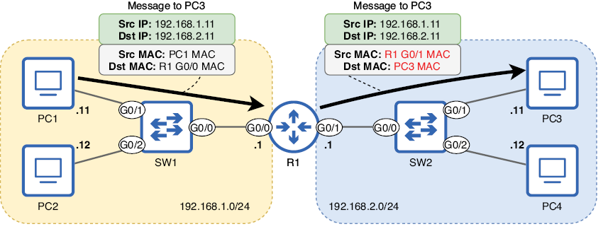

# Enrutamiento estático
En esta unidad vamos a tratar los siguientes puntos:

+ Cómo los hosts finales envían paquetes IP a destinos locales y remotos
+ El proceso de enrutamiento
+ Lectura e interpretación de la tabla de enrutamiento de un router
+ Configuración de rutas estáticas en un router
+ Uso de rutas predeterminadas para proporcionar conectividad a Internet

Estos aspectos aspectos tienen cierta correspondencia con los siguientes puntos del CCNA:

1. Interpretar los componentes de una tabla de enrutamiento
2. Determinar cómo un router toma una decisión de reenvío (*forwarding*) por defecto
3. Configurar y verificar el enrutamiento estático IPv4 e IPv6

El término *enrutamiento* puede referirse a dos procesos diferentes: el proceso mediante el cual los routers crean su **tabla de enrutamiento** (una base de datos de destinos conocidos y cómo reenviar paquetes hacia ellos) y el proceso de reenvío de paquetes.

Abordaremos pues ambos aspectos del enrutamiento.

## Cómo envían paquetes los hosts finales

Antes de examinar los detalles de cómo los routers reenvían paquetes IP, echemos un ojo a los hosts finales que se envían dichos paquetes entre sí. Después de que un host prepare un paquete para enviarlo a otro, debe encapsularlo en una trama. Si bien nos centramos en el enrutamiento, es decir un proceso de Capa 3, ¡no nos olvidemos de la Capa 2! Los paquetes nunca se envían por cable (u ondas de radio) sin estar encapsulados en una trama.

La dirección MAC de destino de la trama depende de la dirección IP de destino del paquete. Si el paquete está destinado a un host en la misma red que el emisor, la dirección MAC de destino será la del host de destino; en este caso, no se necesita un router porque **ya sabemos que el router sirve para conectar redes diferentes**.

La imagen de abajo muestra este proceso cuando el PC1 envía un paquete a el PC2. Las direcciones IP y MAC de destino son ambas de el PC2; No es necesario que R1 enrute el paquete porque el origen y el destino están en la misma red (la red 192.168.1.0/24).


El PC1 (192.168.1.11) envía un paquete al PC2 (192.168.1.12). Dado que ambos se encuentran en la misma red (192.168.1.0/24), el PC1 encapsula el paquete en una trama dirigida a la dirección MAC de el PC2. El PC1 no necesita enviar el paquete a R1 para su enrutamiento.

Este diagrama presupone que el PC1 ya conoce la dirección MAC de el PC2; de lo contrario, primero enviará una solicitud ARP para obtenerla, tal y como ya hemos visto anteriormente en el curso.

!!!note "Nota"
    Un icono de nube, como el que se muestra en la figura anterior, se utiliza a menudo para representar Internet, aunque no siempre. Un icono de nube puede utilizarse para obviar elementos que no son relevantes para el diagrama. La nube en la figura indica que R1 se conecta a otra red, cuyos detalles no son relevantes para el diagrama. Esa otra red podría ser internet o otra parte de la red de la misma empresa.

Por otro lado, si un host final, como un PC, desea enviar un paquete a un destino fuera de su red local, debe enviarlo a su puerta de enlace predeterminada (el router que proporciona conectividad a otras redes,  también conocido como ***gateway***). En la imagen de abajo, R1 es la puerta de enlace predeterminada de la red 192.168.1.0/24.

Para que PC1 y PC2 envíen paquetes a destinos fuera de 192.168.1.0/24, deben encapsular el paquete en una trama dirigida a la dirección MAC de la interfaz G0/0 de R1.

En la imagen se muestra cómo PC1 envía un paquete a PC3: encapsula el paquete en una trama dirigida a la dirección MAC de la interfaz G0/0 de R1. A continuación, R1 reenvía el paquete fuera de su interfaz G0/1, encapsulado en una nueva trama dirigida a la dirección MAC de PC3.



PC1 (192.168.1.11) envía un paquete a PC3 (192.168.2.11). Dado que PC1 y PC3 se encuentran en redes separadas, PC1 envía el paquete en una trama dirigida a la dirección MAC de su puerta de enlace predeterminada: la de la interfaz G0/0 de R1. R1 reenvía el paquete desde su interfaz G0/1, encapsulado en una nueva trama dirigida a la dirección MAC de PC3.

Este diagrama supone que PC1 ya conoce la dirección MAC G0/0 de R1; de lo contrario, PC1 enviará una solicitud ARP para obtenerla. Asimismo, R1 también debe obtener la dirección MAC de PC3.

!!!note "Nota"
    La dirección IP de la puerta de enlace predeterminada suele ser la primera dirección utilizable de la red. Por ejemplo, en la red 192.168.1.0/24, es 192.168.1.1, y en la red 192.168.2.0/24, es 192.168.2.1. Esto no tiene por qué ser así, pero es una práctica muy común. Las direcciones IP de los ordenadores, por otro lado, son arbitrarias. En los ejemplos las direcciones IP de los ordenadores terminan en .11 y .12, pero por ningún motivo concreto.

¿Cómo sabe el PC1 cuál es su puerta de enlace predeterminada?

Un host final puede conocer la dirección IP de su puerta de enlace predeterminada de dos maneras. La primera es mediante la configuración manual, en la que un administrador especifica manualmente la puerta de enlace predeterminada en cada dispositivo. Sin embargo, esto es muy poco común en dispositivos de usuario como los PC; suelen utilizar el segundo método (el Protocolo de Configuración Dinámica de Host o **DHCP**) para conocer automáticamente información como la dirección IP de su puerta de enlace predeterminada, así como su propia dirección IP.

En un dispositivo Windows, podemos usar el comando `ipconfig` en la aplicación *Símbolo del sistema* para ver información como la dirección IP del dispositivo, la máscara de red (*Subnet Mask* en la salida del comando) y la puerta de enlace predeterminada. El siguiente ejemplo muestra la salida de este comando en el PC1:

```rd
C:\Users\alumno> ipconfig
. . .
Ethernet adapter Local Area Connection:
   Connection-specific DNS Suffix  . : 
   IPv4 Address. . . . . . . . . . . : 192.168.1.11
   Subnet Mask . . . . . . . . . . . : 255.255.255.0
   Default Gateway . . . . . . . . . : 192.168.1.1
. . .
```

!!!note "Nota"
    La puerta de enlace predeterminada de un host se configura como una dirección IP, no como una dirección MAC. Para conocer la dirección MAC de la puerta de enlace predeterminada, el host debe enviar una solicitud ARP a su dirección IP.


Hay un par de puntos principales que se deben tener en cuenta en esta sección: primero, para enviar un paquete a un destino en la misma red, un host encapsulará el paquete (dirigido a la dirección IP del host de destino) en una trama dirigida a la dirección MAC del host de destino. El segundo punto es que, para enviar un paquete a un destino en una red diferente, el host emisor encapsulará el paquete (dirigido a la dirección IP del host de destino) en una trama dirigida a la dirección MAC de la puerta de enlace predeterminada. En cualquier caso, se debe usar ARP para obtener la dirección MAC adecuada (la del host de destino o la de la puerta de enlace predeterminada).

## Fundamentos de routing

En el apartado anterior hemos visto cómo un host envía paquetes a destinos fuera de su red local; envía cada paquete en una trama dirigida a la dirección MAC de la puerta de enlace predeterminada.

Ahora examinaremos cómo la puerta de enlace predeterminada (un router) realiza su función de reenvío de paquetes entre redes, lo que se denomina enrutamiento. La imagen de más abajo ofrece una descripción general de cómo R1 reenvía un paquete de PC1 a PC3.

!!!note "Nota"
    La tabla de enrutamiento de R1 en la imagen está simplificada; examinaremos la tabla de enrutamiento completa de R1 más adelante.

Cuando un router recibe una trama destinada a su propia dirección MAC, la desencapsula para examinar el paquete que contiene (si el destino no es su propia dirección MAC, la descarta). Si la dirección IP de destino del paquete es su propia dirección IP, continúa desencapsulando el mensaje; es un mensaje para el router.

Sin embargo, si la dirección IP de destino del paquete no es su propia dirección IP, el router intentará enrutarlo hacia su destino. Para ello, busca la dirección IP de destino del paquete en su tabla de enrutamiento para encontrar una ruta adecuada. Si encuentra una ruta adecuada, reenvía el paquete según esa ruta. De lo contrario, lo descarta.


En la figura de arriba, R1 recibe un paquete de PC1 y lo reenvía a PC3:

1. R1 recibe una trama en su interfaz G0/0. La trama está dirigida a la dirección MAC de R1, por lo que examina el paquete que contiene.
2. R1 busca la dirección IP de destino del paquete en su tabla de enrutamiento. 192.168.2.11 pertenece a la red 192.168.2.0/24, por lo que selecciona esa ruta para reenviarlo. 
3. R1 encapsula el paquete en una nueva trama destinada a la dirección MAC de PC3 y lo reenvía fuera de la interfaz especificada por la ruta (G0/1).

## La tabla de enrutamiento

La tabla de enrutamiento de un router es una base de datos de destinos conocidos por el router. Puede considerarse como un conjunto de instrucciones:

+ Para enviar un paquete al destino X, reenvíalo al siguiente salto Y.
+ O bien, si el destino está en una red conectada directamente, reenvíalo directamente al destino.
+ O bien, si el destino es la dirección IP del router, continúa desencapsulando el mensaje (no reenvíes el paquete).

El ejemplo que veíamos en la figura anterior es un ejemplo del segundo tipo de instrucción: el destino del paquete (PC3, 192.168.2.11) se encuentra en una red conectada directamente a R1 (192.168.2.0/24), por lo que R1 reenvía el paquete directamente al destino (encapsulándolo en una trama dirigida a PC3).

A diferencia de los switches, que pueden generar su tabla de direcciones MAC automáticamente sin necesidad de configuración, la tabla de enrutamiento de un router estará vacía por defecto; no podrá reenviar paquetes.

El siguiente ejemplo muestra la tabla de enrutamiento de R1 antes de cualquier configuración. El comando para ver la tabla de enrutamiento es `show ip route`:

```rd
R1# show ip route
Codes: L - local, C - connected, S - static, R - RIP, M - mobile, B - BGP
       D - EIGRP, EX - EIGRP external, O - OSPF, IA - OSPF inter area
       N1 - OSPF NSSA external type 1, N2 - OSPF NSSA external type 2
       E1 - OSPF external type 1, E2 - OSPF external type 2
       i - IS-IS, su - IS-IS summary, L1 - IS-IS level-1, L2 - IS-IS level-2
       ia - IS-IS inter area, * - candidate default, U - per-user static route
       o - ODR, P - periodic downloaded static route, H - NHRP, l - LISP
       a - application route
       + - replicated route, % - next hop override, p - overrides from PfR
 
Gateway of last resort is not set
```

Sin ninguna configuración, la salida muestra algunos códigos que representan los diferentes tipos de ruta que podrían aparecer en la tabla de enrutamiento. Finalmente, *Gateway of last resort is not set* indica que R1 no tiene una ruta predeterminada, algo que abordaremos más adelante.

Configuremos R1 y veamos cómo cambia la salida de `show ip route`. Primero, no configuraremos ninguna ruta; en lugar de eso, configuremos las direcciones IP de R1 y habiliaremos sus interfaces, como en el siguiente ejemplo:

```rd
R1# configure terminal
R1(config)# interface g0/0
R1(config-if)# ip address 192.168.1.1 255.255.255.0
R1(config-if)# no shutdown
R1(config-if)# interface g0/1
R1(config-if)# ip address 192.168.2.1 255.255.255.0
R1(config-if)# no shutdown
```

Las interfaces de R1 ahora están configuradas según los diagramas anteriores: 192.168.1.1/24 en G0/0 y 192.168.2.1/24 en G0/1. Ahora, examinemos de nuevo la tabla de enrutamiento de R1 y veamos qué ha cambiado (omitiendo algunos códigos para ahorrar espacio):

```rd
R1# show ip route
Codes: L - local, C - connected, S - static, R - RIP, M - mobile, B - BGP
. . .
Gateway of last resort is not set
      192.168.1.0/24 is variably subnetted, 2 subnets, 2 masks
C        192.168.1.0/24 is directly connected, GigabitEthernet0/0
L        192.168.1.1/32 is directly connected, GigabitEthernet0/0
      192.168.2.0/24 is variably subnetted, 2 subnets, 2 masks
C        192.168.2.0/24 is directly connected, GigabitEthernet0/1
L        192.168.2.1/32 is directly connected, GigabitEthernet0/1
```

Con solo configurar las direcciones IP y habilitar las dos interfaces de R1, R1 ha inseratdo cuatro rutas en su tabla de enrutamiento: dos rutas conectadas (indicadas por el código `C`) y dos rutas locales (indicadas por el código `L`).

!!!note "Nota"
    La línea `192.168.1.0/24 is variably subnetted, 2 subnets, 2 masks` no es una ruta. Esta afirmación significa que en la tabla de enrutamiento hay dos rutas a subredes que encajan en la red de clase C 192.168.1.0/24, con dos máscaras de red diferentes (/24 y /32). Lo mismo aplica a la línea similar sobre 192.168.2.0/24. 
    
### Rutas conectadas

Una ruta conectada es una ruta a la red a la que está conectada una interfaz. Se añade automáticamente una ruta conectada a la tabla de enrutamiento por cada interfaz que tenga una dirección IP y esté activa (se puede comprobar el estado de la interfaz con `show ip interface brief`). Por ejemplo, la interfaz G0/0 de R1 tiene la dirección IP 192.168.1.1/24, por lo que agrega automáticamente una ruta a la red 192.168.1.0/24 a su tabla de enrutamiento.


Una ruta conectada indicará que la red está conectada directamente y también indicará a qué interfaz está conectada. Para ver solo las rutas conectadas en la tabla de enrutamiento de R1, en el siguiente ejemplo, filtro la salida usando la barra vertical `|` seguida de `include C` para mostrar solo las líneas que incluyen `C`:

```rd
R1# show ip route | include C
Codes: L - local, C - connected, S - static, R - RIP, M - mobile, B - BGP
C        192.168.1.0/24 is directly connected, GigabitEthernet0/0
C        192.168.2.0/24 is directly connected, GigabitEthernet0/1
```

Con estas rutas en su tabla de enrutamiento, R1 sabe que para reenviar un paquete a un host con una dirección IP en las redes 192.168.1.0/24 o 192.168.2.0/24, debe enviar el paquete desde la interfaz especificada en la ruta en una trama dirigida directamente al host de destino. Esto se vio en la imagen de más arriba donde la dirección IP de destino del paquete era 192.168.2.11 (PC3), por lo que R1 reenvió el paquete desde la interfaz G0/1 en una trama dirigida a la dirección MAC de PC3.

A modo de recordatorio rápido, la siguiente imagen muestra cómo la ruta a 192.168.1.0/24 incluye todas las direcciones IP desde 192.168.1.0 hasta 192.168.1.255. La parte de red de la dirección de la ruta es fija, pero la parte del host puede ser cualquier número de 8 bits.


Dirección IP y longitud del prefijo (expresada como máscara de red) de la ruta a 192.168.1.0/24. Debido a la longitud del prefijo /24, los primeros tres octetos son fijos (los bits no pueden cambiar). Sin embargo, el último octeto puede ser cualquier número de 8 bits: .1, .11, .100, .179, etc. Esto significa que cualquier paquete con una dirección IP de destino que comience por 192.168.1 puede reenviarse mediante esta ruta.

### Rutas locales

Una ruta local es una ruta a la dirección IP exacta configurada en la interfaz del router.

Al igual que las rutas conectadas, se agrega automáticamente una ruta local a la tabla de enrutamiento por cada interfaz que tenga una dirección IP y esté activa. En el siguiente ejemplo, se utiliza `show ip route | include L` para ver solo las rutas locales de R1. Tened en cuenta que, al igual que las rutas conectadas, las rutas locales también indican que X está conectado directamente, seguido de la interfaz:

```rd
R1# show ip route | include L
Codes: L - local, C - connected, S - static, R - RIP, M - mobile, B - BGP
. . .
L        192.168.1.1/32 is directly connected, GigabitEthernet0/0
L        192.168.2.1/32 is directly connected, GigabitEthernet0/1
```

**Para especificar la dirección IP exacta de la interfaz, una ruta local utiliza una longitud de prefijo /32**; todos los bits de la máscara de red se establecen en 1. Esto se aplica independientemente de la máscara de red configurada en la interfaz.

Por ejemplo, aunque ambas interfaces de R1 tienen una longitud de prefijo /24, sus rutas locales son /32. Esto se debe a que una ruta local solo especifica una dirección IP. Como se mencionó anteriormente, una ruta a 192.168.1.0/24 incluye todas las direcciones IP desde 192.168.1.0 hasta 192.168.1.255; dado que la longitud del prefijo es /24, el octeto final puede ser cualquier número entre 0 y 255. Por otro lado, una ruta a 192.168.1.1/32 incluye solo 192.168.1.1, debido a su longitud de prefijo /32; todos los bits se consideran parte de la porción de red y no se pueden modificar. La figura de arriba muestra la dirección IP de R1 G0/0 con una longitud de prefijo /32 (escrita como una máscara de red).

Una ruta local indica al router que los paquetes destinados a la dirección IP especificada en la ruta son para él mismo; debe continuar desencapsulando el mensaje y examinando su contenido. En este caso, el router no reenvía el paquete, sino que lo recibe. La ruta local es necesaria para distinguir la dirección IP del router de otras direcciones IP en la red conectada. **Si R1 solo tuviera una ruta conectada a 192.168.1.0/24, pero ninguna ruta local, reenviaría los paquetes destinados a 192.168.1.1 desde su interfaz G0/0, en lugar de recibirlos.**

## Elección de rutas

Cuando un router reenvía un paquete, debe decidir qué ruta de su tabla de enrutamiento utilizará para reenviarlo, lo que se denomina selección de ruta. Para determinar cómo reenviar un paquete en particular, el router seleccionará la ruta coincidente más específica. Definamos este término:

+ <u>Ruta coincidente:</u> La dirección IP de destino del paquete forma parte de la red especificada en la ruta. De lo contrario, el paquete no se puede reenviar utilizando esta ruta.
+ <u>Más específica:</u> La ruta con la longitud de prefijo más larga.

Usemos un ejemplo para aclarar este concepto. La siguiente figura muestra el proceso de selección de ruta cuando R1 recibe un paquete dirigido a 192.168.1.1. La dirección IP de destino del paquete coincide con dos rutas en la tabla de enrutamiento de R1, por lo que selecciona la más específica.


R1 recibe un paquete y seleccionará la mejor ruta para él:

1. R1 recibe una trama en su interfaz G0/0. La MAC de destino es la suya, por lo que la desencapsula y examina el paquete que contiene.
2. La dirección IP de destino del paquete es 192.168.1.1. R1 realiza una búsqueda en la tabla de enrutamiento y descubre que dos rutas coinciden con la dirección IP de destino del paquete: la ruta conectada a 192.168.1.0/24 y la ruta local a 192.168.1.1/32. R1 selecciona la ruta más específica: 192.168.1.1/32.
3. Dado que R1 selecciona una ruta local, recibe el paquete por sí mismo; no lo reenvía.

Una ruta con un prefijo /24 incluye 256 direcciones IP diferentes. Por ejemplo, 192.168.1.0/24 incluye las rutas de 192.168.1.0 a 192.168.1.255. Por otro lado, una ruta con un prefijo /32 solo incluye una dirección IP, por lo que una ruta /32 es más específica que una ruta /24. De hecho, una ruta /32 es la más específica posible; si la dirección IP de destino de un paquete coincide con una ruta /32, esa ruta siempre se seleccionará para ese paquete, independientemente de cuántas otras rutas coincidentes haya. 

**¿Qué sucede si no hay ninguna ruta en la tabla de enrutamiento que coincida con la dirección IP de destino de un paquete?** En ese caso, el router descartará el paquete; no inundará todos los puertos como lo hacen los switches con tramas unicast desconocidas.

Un switch a veces inunda de tramas, pero un router nunca inunda de paquetes; reenvía el paquete, lo recibe para sí mismo o lo descarta. Esta tabla resume las acciones que un router puede realizar en un paquete:


| Condiciones de coincidencia | Acción del router |
| --- | --- |
| La dirección IP de destino del paquete coincide con una o más rutas no locales. | Reenviar el paquete según la ruta coincidente más específica |
| La dirección IP de destino del paquete coincide con una ruta local. | Recibir el paquete |
| La dirección IP de destino del paquete no coincide con ninguna ruta. | Descartar el paquete |

## Rutas estáticas

El proceso de reenvío de paquetes descrito en la sección anterior se denomina enrutamiento, pero el término enrutamiento también se utiliza para referirse a los procesos que utilizan los routers para aprender rutas. Además de las rutas conectadas y locales que un router inserta automáticamente en su tabla de enrutamiento, existen dos métodos principales mediante los cuales los routers pueden aprender rutas:

<u>**Enrutamiento dinámico:**</u> Los routers utilizan protocolos de enrutamiento dinámico para compartir información entre sí y crear sus tablas de enrutamiento.

<u>**Enrutamiento estático:**</u> Un ingeniero/administrador configura manualmente las rutas en el router.

Las rutas conectadas permiten al router reenviar paquetes a destinos en redes conectadas directamente a él, y las rutas locales permiten al router recibir paquetes destinados a sus propias direcciones IP. Sin embargo, para reenviar paquetes a destinos que no están en redes conectadas directamente, el router debe aprender de esos destinos mediante uno de los métodos mencionados anteriormente (abordaremos el enrutamiento dinámico en los capítulos 17 y 18).

Al reenviar un paquete a un destino que no está conectado directamente al router, este debe encapsularlo en una trama dirigida a la dirección MAC del siguiente salto, que corresponde al siguiente router en la ruta hacia el destino. Aquí se puede ver este proceso:


PC1 envía un paquete a PC3 a través de R1, R2 y R3:

   1. PC1 envía el paquete en una trama a R1 G0/1. R1 lo recibe y realiza una búsqueda en la tabla de enrutamiento.
   2. R1 reenvía el paquete en una trama a R2 G0/0. R2 lo recibe y realiza una búsqueda en la tabla de enrutamiento.
   3. R2 reenvía el paquete en una trama a la MAC de R3 G0/0. R3 recibe el paquete y realiza una búsqueda en la tabla de enrutamiento. (4) R3 reenvía el paquete en una trama a PC3, que lo recibe y lo procesa.

La imagen anterior muestra cómo los routers reenvían paquetes hacia destinos remotos (no conectados directamente). 

Sin embargo, los routers no tienen estas rutas en sus tablas de enrutamiento por defecto; estas rutas deben configurarse manualmente. Sin configurar ninguna ruta estática, si R1 recibe un paquete de PC1 con destino a 192.168.3.11, no encontrará ninguna ruta coincidente al realizar la búsqueda en la tabla de enrutamiento. No tendrá más remedio que descartar el paquete. La siguiente tabla enumera las redes que cada router del ejemplo anterior reconoce sin configurar rutas estáticas.

| Router | Redes conocidas | Redes desconocidas |
|--------|----------------|------------------|
| R1 | 192.168.1.0/24<br>192.168.12.0/24 | 192.168.3.0/24<br>192.168.23.0/24 |
| R2 | 192.168.12.0/24<br>192.168.23.0/24 | 192.168.1.0/24<br>192.168.3.0/24 |
| R3 | 192.168.3.0/24<br>192.168.23.0/24 | 192.168.1.0/24<br>192.168.12.0/24 |


Dado el objetivo de habilitar la comunicación bidireccional entre PC1 y PC3, ¿qué rutas debemos configurar? Al observar la tabla, se podría suponer que debemos configurar seis rutas para que cada router conozca todas las redes dentro de la red principal.

Sin embargo, para reenviar paquetes entre dos hosts, cada router solo necesita rutas a las redes de los hosts que se comunican (PC1 y PC3). R1, por ejemplo, no necesita conocer la red entre R2 y R3 (192.168.23.0/24); R1 solo necesita saber que para reenviar un paquete a un destino en 192.168.3.0/24, debe reenviarlo a R2. La Figura de más abajo demuestra este concepto: si configuramos una ruta a 192.168.3.0/24 en R1, con la dirección IP de R2 especificada como el siguiente salto, R1 podrá reenviar el paquete a R2. No necesita saber los detalles de la ruta que tomará el paquete después de R2; solo necesita saber que R2 es el siguiente salto.

R1 reenvía un paquete destinado a 192.168.3.11 (PC3). R1 ​​tiene una ruta estática a 192.168.3.0/24 a través de 192.168.12.2 (R2). R1 ​​sabe que para reenviar un paquete hacia la red 192.168.3.0/24, debe reenviarlo a R2. R1 desconoce los detalles de la ruta que tomará el paquete después de R2, y no está obligado a conocerlos.

En resumen, cada router necesita una ruta a 192.168.3.0/24 para poder reenviar paquetes de PC1 a PC3 y una ruta a 192.168.1.0/24 para poder reenviar paquetes de PC3 a PC1. El R1 ya tiene una ruta conectada a 192.168.1.0/24, y el R3 ya tiene una ruta conectada a 192.168.3.0/24. La Tabla 9.3 enumera las rutas estáticas que debemos configurar para habilitar la comunicación bidireccional entre el PC1 y el PC3.

| Router | Rutas necesarias | Próximo salto |
|--------|------------------|---------------|
| R1     | 192.168.3.0/24   | 192.168.12.2 (R2 G0/0) |
| R2     | 192.168.1.0/24   | 192.168.12.1 (R1 G0/0) |
| R2     | 192.168.3.0/24   | 192.168.23.2 (R3 G0/0) |
| R3     | 192.168.1.0/24   | 192.168.23.1 (R2 G0/1) |


!!!note "Nota"
    En este ejemplo, nos referimos a las rutas necesarias para habilitar la comunicación bidireccional entre el PC1 y el PC3. Si bien no es necesario para tal fin, no hay problema en configurar una ruta a 192.168.23.0/24 en el R1 y una ruta a 192.168.12.0/24 en el R3.


### Configurando rutas estáticas

El comando para configurar una ruta estática es, desde el modo de configuración global, `ip route`. Sin embargo, existen diferentes opciones en cuanto a los argumentos que se proporcionan con el comando:

+ `ip route red-destino máscara próximo-salto`
+ `ip route red-destino máscara interfaz-salida`
+ `ip route red-destino máscara interfaz-salida próximo-salto`

### Rutas estáticas especificando el próximo salto

Se puede configurar una ruta estática especificando la dirección de red de destino, la máscara de red y la dirección IP del siguiente salto.

Aquí se muestran los comandos para configurar cada una de las rutas necesarias en R1, R2 y R3.


Las rutas especifican la dirección IP del siguiente salto. R1 requiere una ruta a 192.168.3.0/24, R2 requiere rutas a 192.168.1.0/24 y 192.168.3.0/24, y R3 requiere una ruta a 192.168.1.0/24.

Una ruta estática que especifica únicamente la dirección IP del siguiente salto se denomina **ruta estática recursiva**. El nombre recursivo se debe a que requiere múltiples búsquedas en la tabla de enrutamiento para reenviar un paquete:

+ Una búsqueda para encontrar la dirección IP del siguiente salto
+ Una búsqueda para encontrar la interfaz a la que está conectado el siguiente salto

Para demostrarlo, observemos la tabla de enrutamiento de R1 en el siguiente ejemplo. Cuando R1 recibe un paquete destinado a 192.168.3.11, descubre que la ruta coincidente más específica (de hecho, la única ruta coincidente) es la estática:

```rd
R1# show ip route
Codes: L - local, C - connected, S - static, R - RIP, M - mobile, B - BGP
. . .
      192.168.1.0/24 is variably subnetted, 2 subnets, 2 masks
C        192.168.1.0/24 is directly connected, GigabitEthernet0/1
L        192.168.1.1/32 is directly connected, GigabitEthernet0/1
S     192.168.3.0/24 [1/0] via 192.168.12.2
      192.168.12.0/24 is variably subnetted, 2 subnets, 2 masks
C        192.168.12.0/24 is directly connected, GigabitEthernet0/0
L        192.168.12.1/32 is directly connected, GigabitEthernet0/0
```

!!!note "Nota"
    El [1/0] en la ruta estática indica la distancia administrativa (AD) y la métrica de la ruta, respectivamente. La AD y la métrica se abordarán en temas posteriores; no son relevantes para este.

La ruta estática indica `S 192.168.3.0/24 [1/0] vía 192.168.12.2` (nótese el código `S` para estática), pero esta información por sí sola no le indica a R1 por qué interfaz reenviar el paquete. Para obtenerla, realiza una segunda búsqueda de la dirección IP del siguiente salto: 192.168.12.2. La ruta más específica (y la única) que coincide con 192.168.12.2 es la ruta conectada a 192.168.12.0/24, que especifica la interfaz G0/0. Ahora, después de dos búsquedas, R1 conoce la dirección IP del siguiente salto y la interfaz por la que reenviar el paquete.

!!!note "Nota"
    R1 conoce la dirección IP del siguiente salto, pero la información que realmente necesita es la dirección MAC del siguiente salto. Para obtenerla, debe enviar una solicitud ARP a la dirección IP del siguiente salto.

### Rutas estáticas especificando la interfaz de salida

En lugar de especificar la dirección IP del siguiente salto de la ruta, puede especificar la interfaz de salida, es decir, la interfaz desde la que el router debe reenviar los paquetes. El siguiente ejemplo muestra las mismas rutas estáticas que hemos visto en la figura anterior, pero configuradas con la interfaz de salida:

+ `R1(config)# ip route 192.168.3.0 255.255.255.0 g0/0`
+ `R2(config)# ip route 192.168.1.0 255.255.255.0 g0/0`
+ `R2(config)# ip route 192.168.3.0 255.255.255.0 g0/1`
+ `R3(config)# ip route 192.168.1.0 255.255.255.0 g0/0`

Una ruta estática que especifica solo la interfaz de salida se denomina ruta estática **conectada directamente**. Esto se debe a que la ruta aparecerá como una red conectada directamente en la tabla de enrutamiento. El siguiente ejemplo muestra la ruta a 192.168.3.0/24 en la tabla de enrutamiento de R1:

```rd
R1# show ip route
Codes: L - local, C - connected, S - static, R - RIP, M - mobile, B - BGP
. . .
S     192.168.3.0/24 is directly connected, GigabitEthernet0/0
. . .
```

Este tipo de ruta estática tiene una desventaja: dado que R1 considera que la red 192.168.3.0/24 está conectada directamente a su interfaz G0/0, intentará enviar paquetes en tramas dirigidas directamente a PC3, en lugar de al siguiente salto.

Esto significa que R1 no enviará una solicitud ARP para conocer la dirección MAC del siguiente salto; en su lugar, enviará una solicitud ARP para conocer la dirección MAC de PC3. El problema es que esta solicitud ARP no llegará a PC3, sino a R2 (los mensajes de difusión no van más allá de su red local). Sin embargo, R2 puede usar una función llamada proxy ARP para responder en nombre de PC3, indicándole a R1 que envíe el paquete a la dirección MAC G0/0 de R2. Esto se muestra en la figura 9.10.


Un intercambio ARP proxy entre R1 y R2:

1. R1 envía una solicitud ARP para conocer la dirección MAC de PC3.
2. 192.168.3.11 no es la dirección IP de R2, pero R2 tiene una ruta a 192.168.3.0/24 en su tabla de enrutamiento, por lo que R2 usa ARP proxy para responder en nombre de PC3.

!!!note "Nota" 
    Un router solo usará proxy ARP para responder a una solicitud ARP si tiene una ruta al destino en su tabla de enrutamiento. De lo contrario, ignorará la solicitud.

El siguiente ejemplo muestra la tabla ARP de R1 (puede visualizarla con el comando `show arp`). Observe que se muestra la misma dirección MAC (`Hardware Addr`) para 192.168.12.2 y 192.168.3.11: la dirección MAC de la interfaz G0/0 de R2.


```rd
R1# show arp
Protocol  Address          Age (min)  Hardware Addr   Type   Interface
. . .
Internet  192.168.3.11            0   5254.0003.e684  ARPA   GigabitEthernet0/0
. . .
Internet  192.168.12.2            0   5254.0003.e684  ARPA   GigabitEthernet0/0
```

La dependencia del proxy ARP es una desventaja de las rutas estáticas conectadas directamente por dos razones.

+ En primer lugar, aunque el proxy ARP está habilitado en los routers Cisco por defecto, en algunos casos puede estar deshabilitado (por ejemplo, si R2 no es un router Cisco). Si el proxy ARP está deshabilitado en R2, no responderá a la solicitud ARP de R1 y R1 no podrá reenviar el paquete a PC3.

+ La segunda desventaja es que R1 necesitará crear una entrada ARP independiente para cada host en 192.168.3.0/24. Considera que cada host en 192.168.3.0/24 está conectado directamente, por lo que intentará obtener la dirección MAC de cada host; esto podría desperdiciar memoria en R1 si hay muchos hosts en la red. Por otro lado, si se especifica la dirección IP del siguiente salto en lugar de la interfaz de salida, R1 solo necesitará una entrada ARP para reenviar paquetes a 192.168.3.0/24: una entrada ARP para el siguiente salto.

!!!note "Nota"
    Aunque nos centramos en el R1 como ejemplo, lo mismo aplica para el R2, que considerará que las redes 192.168.1.0/24 y 192.168.3.0/24 están conectadas directamente, así como para el R3, que considerará que la red 192.168.1.0/24 está conectada directamente.

Deberíamos conocer la definición de rutas estáticas conectadas directamente y poder configurarlas, pero debido a las desventajas de depender de ARP proxy, es muy recomendable no usarlas en una red real. En su lugar, debemos utilizar rutas estáticas recursivas o la siguiente opción: rutas estáticas completamente especificadas.

### Rutas estáticas especificando tanto el interfaz de salida como el próximo salto

La tercera opción al configurar una ruta estática es especificar tanto la interfaz de salida como el siguiente salto, lo que se denomina ruta estática completamente especificada. Las siguientes son las mismas cuatro rutas estáticas, esta vez configuradas como **rutas estáticas completamente especificadas**:

+ `R1(config)# ip route 192.168.3.0 255.255.255.0 g0/0 192.168.12.2`
+ `R2(config)# ip route 192.168.1.0 255.255.255.0 g0/0 192.168.12.1`
+ `R2(config)# ip route 192.168.3.0 255.255.255.0 g0/1 192.168.23.2`
+ `R3(config)# ip route 192.168.1.0 255.255.255.0 g0/0 192.168.23.1`

La ventaja de este tipo de ruta estática es que el router sabe Tanto la dirección IP del siguiente salto como la interfaz desde la que se reenvía el paquete; no es necesario realizar una búsqueda recursiva ni depender de ARP proxy. El siguiente ejemplo muestra cómo aparece una ruta completamente especificada en la tabla de enrutamiento:

```rd
R1# show ip route
Codes: L - local, C - connected, S - static, R - RIP, M - mobile, B - BGP
. . .
S     192.168.3.0/24 [1/0] via 192.168.12.2, GigabitEthernet0/0
. . .
```

Este tipo de ruta estática puede parecer la mejor de las tres, pero en realidad, se pueden usar rutas recursivas o estáticas completamente especificadas sin una diferencia notable en el rendimiento. Sin embargo, generalmente se deben evitar las rutas estáticas conectadas directamente.

### Configurando una ruta por defecto


La ruta predeterminada es una ruta al destino menos específico posible: 0.0.0.0/0. Esta ruta coincide con todas las direcciones IP posibles, desde 0.0.0.0 hasta 255.255.255.255. Al ser la ruta menos específica posible, la ruta predeterminada solo se seleccionará si no hay rutas más específicas en la tabla de enrutamiento del router.

Una ruta predeterminada se utiliza a menudo para proporcionar una ruta a internet. Hay más de un millón de rutas en la tabla de enrutamiento global de internet, una cantidad muy superior a la que la mayoría de los routers pueden gestionar. Afortunadamente, un router no necesita conocer ninguna red de destino específica en internet; si tiene una ruta predeterminada a internet, puede usarla para reenviar paquetes hacia internet, y la infraestructura del proveedor de servicios de internet (ISP) se encargará de reenviarlos al destino correcto.

Se pueden usar rutas más específicas para destinos en la red corporativa interna, y el resto del tráfico (que no coincida con ninguna otra ruta) se enrutará utilizando la ruta predeterminada.

La imagen de abajo muestra un ejemplo: R1 tiene rutas específicas a 192.168.2.0/24 y 192.168.3.0/24, y luego una ruta predeterminada a internet; los paquetes con destinos que no coincidan con 192.168.2.0/24 o 192.168.3.0/24 (o las rutas conectadas y locales de R1) se reenviarán utilizando la ruta predeterminada.


El R1 tiene dos rutas a redes de destino específicas y una ruta predeterminada a Internet. (1) Una ruta a 192.168.2.0/24, con R2 G0/0 como siguiente salto. (2) Una ruta a 192.168.3.0/24, con R3 G0/0 como siguiente salto. (3) Una ruta predeterminada, con la dirección IP del ISP (203.0.113.2) como siguiente salto.

Para configurar una ruta predeterminada, especificamos la red de destino 0.0.0.0 y la máscara de red 0.0.0.0 en el comando ip route; esto da como resultado 0.0.0.0/0, que incluye todas las direcciones IP posibles. Si un router no tiene una ruta predeterminada configurada, verá la instrucción *«Gateway of last resort is not set»* encima de las rutas en la tabla de enrutamiento, como se muestra en el siguiente ejemplo. Esto significa que el router no tiene una ruta predeterminada:

```rd
R1# show ip route
Codes: L - local, C - connected, S - static, R - RIP, M - mobile, B - BGP
. . .
Gateway of last resort is not set
. . .
```

!!!note "Nota"
    Puerta de enlace de último recurso (*gateway of last resort*) es otro término para la puerta de enlace predeterminada (*default gateway*). La ruta predeterminada en un router es como la puerta de enlace predeterminada de un PC; se utiliza para reenviar tráfico a destinos fuera de las redes conocidas del router.

Tras configurar las rutas estáticas que se mostraban en la figura anterior, el resultado cambia.

En el siguiente ejemplo, se utiliza el comando `show ip route static` para ver solo las rutas estáticas de R1. Observe que la dirección IP del ISP (203.0.113.2) ahora aparece como la puerta de enlace de último recurso:

```rd
R1# show ip route static
Codes: L - local, C - connected, S - static, R - RIP, M - mobile, B - BGP
. . .
       ia - IS-IS inter area, * - candidate default, U - per-user static route
. . .
Gateway of last resort is 203.0.113.2 to network 0.0.0.0
S*    0.0.0.0/0 [1/0] via 203.0.113.2
S     192.168.2.0/24 [1/0] via 192.168.12.2
S     192.168.3.0/24 [1/0] via 192.168.13.2
```

!!!note "Nota"
    En este mismo tema se ha indicado que un router descartará los paquetes que no coincidan con ninguna ruta en su tabla de enrutamiento. Sin embargo, si el router tiene una ruta predeterminada, esta situación no ocurrirá; la ruta predeterminada coincide con todas las direcciones IP. Si un paquete no coincide con una ruta más específica, el router lo reenviará por la ruta predeterminada en lugar de descartarlo.


## Resumen

+ El término enrutamiento puede referirse al proceso de reenvío de paquetes entre redes y a la creación de una tabla de enrutamiento.
+ Los hosts de una misma red pueden enviarse paquetes entre sí sin necesidad de un router. Sin embargo, para enviar paquetes a destinos fuera de la red local, se requiere un router.
+ El router al que un host envía paquetes destinados a redes externas se denomina puerta de enlace predeterminada. El host envía los paquetes en tramas dirigidas a la dirección MAC de la puerta de enlace predeterminada.
+ La puerta de enlace predeterminada de un host puede configurarse manualmente o aprenderse automáticamente mediante DHCP.
+ Puede usar el comando ipconfig en el Símbolo del sistema de Windows para ver información como la dirección IP, la máscara de red y la puerta de enlace predeterminada del PC.
+ La tabla de enrutamiento es la base de datos de destinos conocidos del router. Es un conjunto de instrucciones sobre qué hacer con los paquetes. La tabla de enrutamiento se puede ver con show ip route.
+ Para cada interfaz que tenga una dirección IP y esté activa/activa, el router agregará automáticamente dos rutas a su tabla de enrutamiento: una ruta conectada y una ruta local. Una ruta conectada es una ruta a la red a la que está conectada una interfaz. Las rutas conectadas se indican mediante el código C en la tabla de enrutamiento. Si un router recibe un paquete destinado a un host en una red conectada directamente, lo reenviará directamente al host de destino (en una trama dirigida a la dirección MAC del host).
+ Una ruta local es una ruta a la misma dirección IP configurada en la interfaz. Las rutas locales utilizan un prefijo /32 para especificar una única dirección IP. Si un router recibe un paquete destinado a la dirección IP de una ruta local, significa que el paquete está destinado al propio router; este lo recibirá para sí mismo, no lo reenviará.
+ Una ruta a más de una dirección IP de destino (cualquier ruta con un prefijo menor que /32) se denomina ruta de red. Una ruta conectada es un ejemplo de ruta de red.
+ Una ruta a una única dirección IP de destino (una ruta con un prefijo /32) se denomina ruta de host. Una ruta local es un ejemplo de ruta de host. El proceso de decidir qué ruta es la adecuada para reenviar un paquete se denomina selección de ruta. Para determinar cómo reenviar un paquete en particular, el router seleccionará la ruta más específica (la que tenga el prefijo más largo).
+ Una ruta /32 es la más específica posible; especifica solo una dirección IP. Una ruta /0 (ruta predeterminada) es la menos específica posible; especifica todas las direcciones IP posibles.
+ Mientras que el reenvío de capa 3 implica buscar en la tabla de enrutamiento la ruta más específica, el reenvío de capa 2 implica buscar una coincidencia exacta en la tabla de direcciones MAC; las coincidencias parciales no cuentan.
+ Si no hay rutas que coincidan con la dirección IP de destino de un paquete, el router lo descartará.
+ Para enrutar paquetes a destinos que no están conectados directamente al router, este necesita aprender las rutas a esos destinos mediante enrutamiento dinámico (mediante un protocolo como OSPF) o enrutamiento estático (en el que las rutas se configuran manualmente en el router). Para reenviar un paquete a un destino remoto, el router lo encapsula en una trama destinada a la dirección MAC del siguiente salto (el siguiente router en la ruta hacia el destino).
+ Para que un router reenvíe paquetes entre dos hosts, necesita rutas a la red de cada host; no necesita rutas a todas las redes en la ruta entre cada destino.
+ El comando para configurar una ruta estática es ip route destination-network netmask {next-hop | exit-interface | exit-interface next-hop}.
+ Una ruta estática que especifica solo el siguiente salto se denomina ruta estática recursiva; requiere múltiples búsquedas en la tabla de enrutamiento para reenviar un paquete: una para encontrar la dirección IP del siguiente salto y otra para encontrar la interfaz a la que está conectado el siguiente salto.
+ Una ruta estática que especifica solo la interfaz de salida se denomina ruta estática conectada directamente porque hace que el router trate la red como una red conectada directamente.
+ Las rutas estáticas conectadas directamente requieren ARP proxy para funcionar. ARP proxy permite que un router responda a las solicitudes ARP en nombre de otros hosts. El proxy ARP está habilitado en los routers Cisco de forma predeterminada, pero podría no estarlo en los routers de otros proveedores.
+ Una ruta estática que especifica tanto la interfaz de salida como el siguiente salto se denomina ruta estática completamente especificada.
+ Una ruta predeterminada es una ruta a 0.0.0.0/0. Al ser la ruta menos específica posible, solo se utilizará para reenviar paquetes que no coincidan con ninguna otra ruta en la tabla de enrutamiento.
+ Si un router tiene una ruta predeterminada, no descartará los paquetes que no coincidan con otras rutas; en su lugar, los reenviará utilizando la ruta predeterminada.
+ La ruta predeterminada se utiliza a menudo para proporcionar una ruta a internet; no es posible que un router aprenda rutas específicas para cada posible...