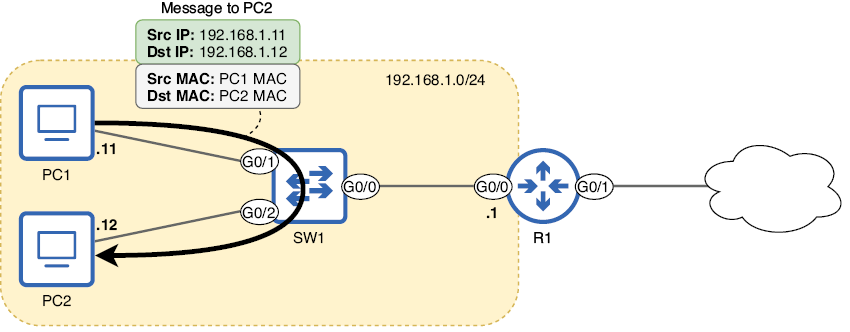
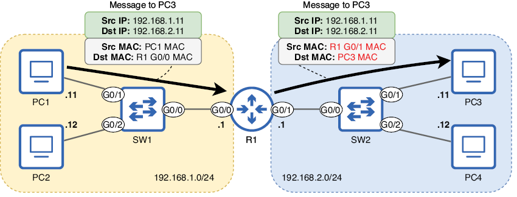
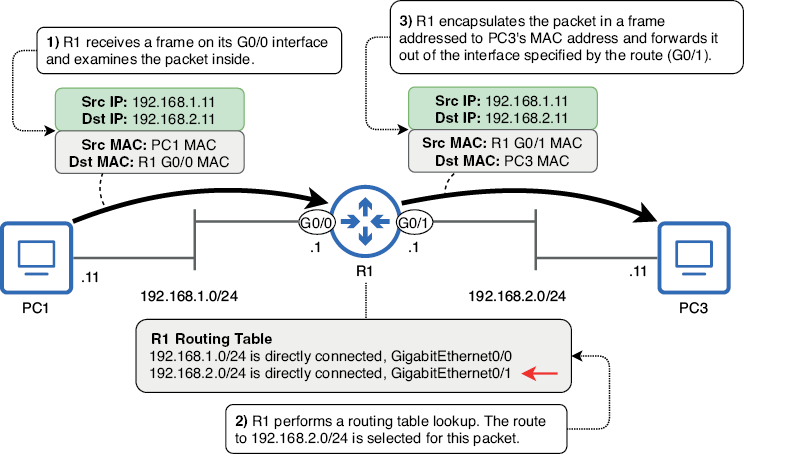
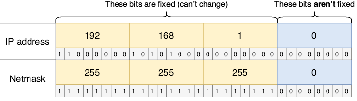
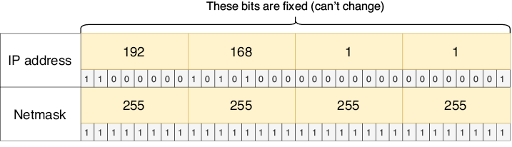
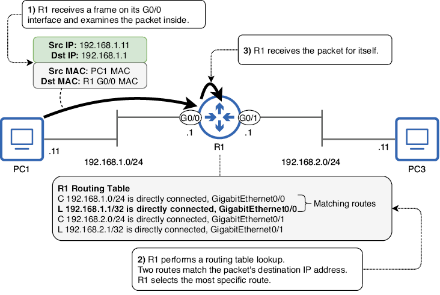

# Enrutamiento

Este capítulo cubre

+ Cómo los hosts finales envían paquetes IP a destinos locales y remotos
+ El proceso de enrutamiento
+ Cómo leer e interpretar la tabla de enrutamiento de un router
+ Cómo configurar rutas estáticas en un router
+ Cómo usar rutas por defecto para proporcionar conectividad a internet

En este capítulo trataremos el enrutamiento, el proceso mediante el cual los routers reenvían paquetes IP entre redes. En concreto, veremos elementos de los siguientes temas del examen CCNA:

+ 3.1 Interpretar los componentes de una tabla de enrutamiento
+ 3.2 Determinar cómo toma un router una decisión de reenvío por defecto
+ 3.3 Configurar y verificar el enrutamiento estático IPv4 e IPv6

El término enrutamiento puede referirse en realidad a dos procesos diferentes: el proceso mediante el cual los routers construyen su tabla de enrutamiento (una base de datos de destinos conocidos y cómo reenviar paquetes hacia ellos) y el proceso de reenviar los paquetes en sí. En este capítulo veremos ambos aspectos del enrutamiento, y partiremos de esta base en futuros capítulos de este volumen y del volumen 2.

## 1. Cómo envían paquetes los hosts finales

Antes de examinar los detalles de cómo los routers reenvían los paquetes IP, vamos a echar un vistazo a los hosts finales que se envían esos paquetes entre sí. Después de que un host prepare un paquete para enviar a otro, debe encapsular ese paquete en una trama; aunque nos estamos centrando en el enrutamiento, un proceso de Capa 3, ¡no os olvidéis de la Capa 2! Los paquetes nunca se envían por el cable (o por ondas de radio) sin ir encapsulados en una trama.

La dirección MAC de destino de la trama depende de la dirección IP de destino del paquete. Si el paquete va destinado a un host de la misma red que el emisor, la dirección MAC de destino será la del host de destino; en este caso, no hay necesidad de un router. La figura 1 muestra este proceso cuando PC1 envía un paquete a PC2. Las direcciones IP y MAC de destino son las de PC2; no es necesario que R1 enrute el paquete porque el origen y el destino están en la misma red (la red 192.168.1.0/24).

{text-align: justify}

/// figura
PC1 (192.168.1.11) envía un paquete a PC2 (192.168.1.12). Como PC1 y PC2 están en la misma red (192.168.1.0/24), PC1 encapsula el paquete en una trama dirigida a la dirección MAC de PC2. PC1 no necesita enviar el paquete a R1 para que lo enrute. Este diagrama asume que PC1 ya conoce la dirección MAC de PC2; si no, PC1 primero enviará una petición ARP para averiguar la dirección MAC de PC2.
///

!!!note "Nota"
    Un icono de nube, como el mostrado en la figura 1, se usa a menudo para representar internet. Sin embargo, no siempre es ése su propósito. Un icono de nube se puede usar para resumir elementos que no son relevantes para el diagrama. La nube de la figura 1 indica que R1 se conecta a otra red, cuyos detalles no son relevantes para el diagrama. Esa otra red podría ser internet, o podría ser otra parte de la red de la misma empresa.

Por otro lado, si un host final como un PC quiere enviar un paquete a un destino fuera de su red local, debe enviar el paquete a su puerta de enlace predeterminada, el router que proporciona conectividad a otras redes. En la figura 2, R1 es la puerta de enlace predeterminada de la red 192.168.1.0/24. Para que PC1 y PC2 puedan enviar paquetes a destinos fuera de 192.168.1.0/24, deben encapsular el paquete en una trama dirigida a la dirección MAC de la interfaz G0/0 de R1. La figura 2 muestra cómo PC1 envía un paquete a PC3: encapsula el paquete en una trama, dirigida a la dirección MAC de la interfaz G0/0 de R1. R1 reenvía entonces el paquete por su interfaz G0/1, encapsulado en una nueva trama dirigida a la dirección MAC de PC3.

{text-align: justify}

/// figura
PC1 (192.168.1.11) envía un paquete a PC3 (192.168.2.11). Como PC1 y PC3 están en redes distintas, PC1 envía el paquete en una trama dirigida a la dirección MAC de su puerta de enlace predeterminada, la de la interfaz G0/0 de R1. R1 reenvía entonces el paquete por su interfaz G0/1, encapsulado en una nueva trama dirigida a la dirección MAC de PC3. Este diagrama asume que PC1 ya conoce la dirección MAC de la G0/0 de R1; si no, PC1 enviará una petición ARP para averiguarla. Del mismo modo, R1 también debe averiguar la dirección MAC de PC3.
///

!!!note "Nota"
    La dirección IP de la puerta de enlace predeterminada suele ser la primera dirección utilizable de la red. Por ejemplo, en la red 192.168.1.0/24 es 192.168.1.1, y en la red 192.168.2.0/24 es 192.168.2.1. No tiene que ser así, pero es una práctica habitual, y yo seguiré esa práctica en este libro. Las direcciones IP de los PCs, en cambio, son arbitrarias. En los ejemplos de este capítulo, las direcciones IP de los PCs terminan en .11 y .12, pero esos valores no tienen ningún significado especial.

¿Cómo sabe PC1 cuál es su puerta de enlace predeterminada? Un host final puede averiguar la dirección IP de su puerta de enlace predeterminada de un par de maneras. Una es la configuración manual, en la que un administrador especifica manualmente la puerta de enlace predeterminada en cada dispositivo. Sin embargo, esto es muy raro en dispositivos de usuario como los PCs; normalmente usan el segundo método, el Protocolo de configuración dinámica de host (DHCP), para averiguar automáticamente información como la dirección IP de su puerta de enlace predeterminada, así como su propia dirección IP (DHCP se trata en el capítulo 4 del volumen 2 de este libro). En un dispositivo Windows, podéis usar el comando ipconfig en la aplicación Símbolo del sistema para ver información como la dirección IP del dispositivo, la máscara de red (llamada subnet mask en la salida del comando) y la puerta de enlace predeterminada. El siguiente ejemplo muestra la salida de este comando en PC1:

```
C:\Users\jmcdo> ipconfig
. . .
Ethernet adapter Local Area Connection:
   Connection-specific DNS Suffix  . :
   IPv4 Address. . . . . . . . . . . : 192.168.1.11
   Subnet Mask . . . . . . . . . . . : 255.255.255.0
   Default Gateway . . . . . . . . . : 192.168.1.1
. . .
```

!!!note "Nota"
    La puerta de enlace predeterminada de un host se configura como una dirección IP, no como una dirección MAC. Para averiguar la dirección MAC de la puerta de enlace predeterminada, el host debe enviar una petición ARP a la dirección IP de la puerta de enlace predeterminada.

Hay un par de ideas principales que debéis retener de esta sección: primero, para enviar un paquete a un destino de la misma red, un host encapsulará el paquete (dirigido a la dirección IP del host de destino) en una trama dirigida a la dirección MAC del host de destino. La segunda idea es que, para enviar un paquete a un destino en una red distinta, el host emisor encapsulará el paquete (dirigido a la dirección IP del host de destino) en una trama dirigida a la dirección MAC de la puerta de enlace predeterminada. En ambos casos, hay que usar ARP para averiguar la dirección MAC adecuada (la del host de destino o la de la puerta de enlace predeterminada).

## 2. Conceptos básicos de enrutamiento

En la sección 1 vimos cómo un host envía paquetes a destinos fuera de su red local: envía cada paquete en una trama dirigida a la dirección MAC de la puerta de enlace predeterminada. Ahora vamos a examinar cómo la puerta de enlace predeterminada, que es un router, realiza su función de reenviar paquetes entre redes, lo que se denomina enrutamiento. La figura 3 ofrece una visión general de alto nivel de cómo R1 reenvía un paquete de PC1 a PC3.

!!!note "Nota"
    La tabla de enrutamiento de R1 en la figura 3 está simplificada; examinaremos la tabla de enrutamiento completa de R1 en la sección 3.

Cuando un router recibe una trama destinada a su propia dirección MAC, des encapsulará la trama para examinar el paquete que contiene (si el destino no es su propia dirección MAC, descartará la trama). Si la dirección IP de destino del paquete es su propia dirección IP, seguirá des encapsulando el mensaje, ya que es un mensaje destinado al propio router.

Sin embargo, si la dirección IP de destino del paquete no es su propia dirección IP, el router intentará enrutar el paquete para reenviarlo hacia el destino del paquete. Para ello, busca la dirección IP de destino del paquete en su tabla de enrutamiento para encontrar una ruta adecuada. Si encuentra una ruta adecuada, reenvía el paquete según esa ruta. Si no, descarta el paquete.

{text-align: justify}

/// figura
R1 recibe un paquete de PC1 y lo reenvía a PC3. (1) R1 recibe una trama en su interfaz G0/0. La trama va dirigida a la propia dirección MAC de R1, así que examina el paquete que contiene. (2) R1 busca la dirección IP de destino del paquete en su tabla de enrutamiento. 192.168.2.11 está en la red 192.168.2.0/24, así que selecciona esa ruta para reenviar el paquete. (3) R1 encapsula el paquete en una nueva trama destinada a la dirección MAC de PC3 y lo reenvía por la interfaz especificada por la ruta (G0/1).
///

### 2.1. La tabla de enrutamiento

La tabla de enrutamiento de un router es una base de datos de destinos conocidos por el router. Se puede pensar en ella como un conjunto de instrucciones:

+ Para enviar un paquete al destino X, reenviar el paquete al siguiente salto Y.
+ O, si el destino está en una red directamente conectada, reenviar el paquete directamente al destino.
+ O, si el destino es la dirección IP del propio router, seguir des encapsulando el mensaje (no reenviar el paquete).

El ejemplo que vimos en la figura 3 es un ejemplo del segundo tipo de instrucción; el destino del paquete (PC3, 192.168.2.11) está en una red directamente conectada a R1 (192.168.2.0/24), por lo que R1 reenvía el paquete directamente al destino (encapsulándolo en una trama dirigida a PC3).

A diferencia de los switches, que pueden construir su tabla de direcciones MAC automáticamente sin ninguna configuración, la tabla de enrutamiento de un router estará vacía por defecto: no podrá reenviar paquetes. El siguiente ejemplo muestra la tabla de enrutamiento de R1 antes de cualquier configuración; el comando para ver la tabla de enrutamiento es show ip route:

```
R1# show ip route
Codes: L - local, C - connected, S - static, R - RIP, M - mobile, B - BGP
       D - EIGRP, EX - EIGRP external, O - OSPF, IA - OSPF inter area
       N1 - OSPF NSSA external type 1, N2 - OSPF NSSA external type 2
       E1 - OSPF external type 1, E2 - OSPF external type 2
       i - IS-IS, su - IS-IS summary, L1 - IS-IS level-1, L2 - IS-IS level-2
       ia - IS-IS inter area, * - candidate default, U - per-user static route
       o - ODR, P - periodic downloaded static route, H - NHRP, l - LISP
       a - application route
       + - replicated route, % - next hop override, p - overrides from PfR

Gateway of last resort is not set
```

Sin ninguna configuración, la salida muestra algunos códigos que representan los diferentes tipos de ruta que podrían aparecer en la tabla de enrutamiento. Por último, Gateway of last resort is not set indica que R1 no tiene una ruta por defecto, algo que veremos en la sección 4.

Vamos a configurar R1 y a ver cómo cambia la salida de show ip route. Primero, no configuraremos ninguna ruta; en su lugar, vamos a configurar las direcciones IP de R1 y a habilitar sus interfaces, como en el siguiente ejemplo:

```
R1# configure terminal
R1(config)# interface g0/0
R1(config-if)# ip address 192.168.1.1 255.255.255.0
R1(config-if)# no shutdown
R1(config-if)# interface g0/1
R1(config-if)# ip address 192.168.2.1 255.255.255.0
R1(config-if)# no shutdown
```

Las interfaces de R1 están ahora configuradas según los diagramas anteriores: 192.168.1.1/24 en G0/0 y 192.168.2.1/24 en G0/1. Ahora vamos a examinar de nuevo la tabla de enrutamiento de R1 y a ver qué ha cambiado (omitiendo algunos códigos para ahorrar espacio):

```
R1# show ip route
Codes: L - local, C - connected, S - static, R - RIP, M - mobile, B - BGP
. . .
Gateway of last resort is not set
      192.168.1.0/24 is variably subnetted, 2 subnets, 2 masks
C        192.168.1.0/24 is directly connected, GigabitEthernet0/0
L        192.168.1.1/32 is directly connected, GigabitEthernet0/0
      192.168.2.0/24 is variably subnetted, 2 subnets, 2 masks
C        192.168.2.0/24 is directly connected, GigabitEthernet0/1
L        192.168.2.1/32 is directly connected, GigabitEthernet0/1
```

Sólo con configurar las direcciones IP y habilitar las dos interfaces de R1, R1 ha insertado cuatro rutas en su tabla de enrutamiento: dos rutas conectadas (indicadas con el código C) y dos rutas locales (indicadas con el código L).

!!!note "Nota"
    La línea 192.168.1.0/24 is variably subnetted, 2 subnets, 2 masks no es una ruta. Esta línea significa que en la tabla de enrutamiento hay dos rutas a subredes que encajan dentro de la red de clase C 192.168.1.0/24, con dos máscaras de red distintas (/24 y /32). Lo mismo se aplica a la línea similar sobre 192.168.2.0/24. Trataremos las subredes en el capítulo 11.

#### 2.1.1. Rutas conectadas

Una ruta conectada es una ruta a la red a la que está conectada una interfaz. Se añade automáticamente una ruta conectada a la tabla de enrutamiento por cada interfaz que tiene una dirección IP y está en estado up/up (podéis comprobar el estado de la interfaz con show ip interface brief). Por ejemplo, la interfaz G0/0 de R1 tiene la dirección IP 192.168.1.1/24, así que añade automáticamente una ruta a la red 192.168.1.0/24 en su tabla de enrutamiento.

!!!note "Nota"
    192.168.1.0/24 es la dirección de red, con todos los bits de la parte de host puestos a 0. Esto se puede determinar simplemente cambiando el último octeto de 1 a 0, ya que la máscara de red en la interfaz es /24.

Una ruta conectada indicará que la red está directamente conectada, y también indicará a qué interfaz está conectada. Para ver sólo las rutas conectadas en la tabla de enrutamiento de R1, en el siguiente ejemplo filtro la salida usando la barra vertical (|) seguida de include C para mostrar sólo las líneas que contienen C:

```
R1# show ip route | include C
Codes: L - local, C - connected, S - static, R - RIP, M - mobile, B - BGP
C        192.168.1.0/24 is directly connected, GigabitEthernet0/0
C        192.168.2.0/24 is directly connected, GigabitEthernet0/1
```

Con estas rutas en su tabla de enrutamiento, R1 sabe que para reenviar un paquete a un host con una dirección IP en las redes 192.168.1.0/24 o 192.168.2.0/24, debe enviar el paquete por la interfaz especificada en la ruta en una trama dirigida directamente al host de destino. Vimos esto en la figura 3; la dirección IP de destino del paquete era 192.168.2.11 (PC3), así que R1 reenvió el paquete por la interfaz G0/1 en una trama dirigida a la dirección MAC de PC3.

La figura 4 muestra cómo la ruta a 192.168.1.0/24 incluye todas las direcciones IP desde 192.168.1.0 hasta 192.168.1.255. La parte de red de la dirección de la ruta es fija, pero la parte de host puede ser cualquier número de 8 bits.

{text-align: justify}

/// figura
La dirección IP y la longitud de prefijo (escrita como máscara de red) de la ruta a 192.168.1.0/24. Debido a la longitud de prefijo /24, los tres primeros octetos son fijos (los bits no pueden cambiar). Sin embargo, el último octeto puede ser cualquier número de 8 bits: .1, .11, .100, .179, etc. Esto significa que cualquier paquete con una dirección IP de destino que comience por 192.168.1 puede reenviarse usando esta ruta.
///

!!!tip "Consejo de examen"
    Una ruta a más de una dirección IP de destino se denomina ruta de red; es una ruta a una red, en lugar de una ruta a una única dirección IP de destino. Una ruta conectada es un ejemplo de ruta de red. El término ruta de red se menciona explícitamente en el tema del examen 3.3.b, así que recordad esa definición.

#### 2.1.2. Rutas locales

Una ruta local es una ruta a la dirección IP exacta configurada en la interfaz del router. Al igual que las rutas conectadas, se añade automáticamente una ruta local a la tabla de enrutamiento por cada interfaz que tiene una dirección IP y está en estado up/up. En el siguiente ejemplo, uso show ip route | include L para ver sólo las rutas locales de R1. Tened en cuenta que, como las rutas conectadas, las rutas locales también indican X is directly connected, seguida de la interfaz:

```
R1# show ip route | include L
Codes: L - local, C - connected, S - static, R - RIP, M - mobile, B - BGP
. . .
L        192.168.1.1/32 is directly connected, GigabitEthernet0/0
L        192.168.2.1/32 is directly connected, GigabitEthernet0/1
```

Para especificar la dirección IP exacta de la interfaz, una ruta local usa una longitud de prefijo /32; todos los bits de la máscara de red están a 1. Esto ocurre independientemente de la máscara de red configurada en la interfaz. Por ejemplo, aunque las interfaces de R1 tienen longitudes de prefijo /24, sus rutas locales son /32. La razón es que una ruta local especifica una sola dirección IP. Como dijimos antes, una ruta a 192.168.1.0/24 incluye todas las direcciones IP desde 192.168.1.0 hasta 192.168.1.255; como la longitud de prefijo es /24, el último octeto puede ser cualquier número del 0 al 255. En cambio, una ruta a 192.168.1.1/32 incluye sólo 192.168.1.1, debido a su longitud de prefijo /32; todos los bits se consideran parte de la parte de red y no se pueden cambiar. La figura 5 muestra la dirección IP de la G0/0 de R1 con una longitud de prefijo /32 (escrita como máscara de red).

{text-align: justify}

/// figura
La dirección IP de la interfaz G0/0 de R1 y una longitud de prefijo /32 escrita como máscara de red en decimal con puntos y en binario. Con un prefijo de longitud /32, la ruta sólo incluye una única dirección IP (192.168.1.1, en este caso). Un paquete destinado a 192.168.1.2, por ejemplo, no puede usar esta ruta.
///

Una ruta local le indica al router que los paquetes destinados a la dirección IP especificada en la ruta son para el propio router; debe seguir des encapsulando el mensaje y examinar su contenido. En este caso, el router no reenvía el paquete; simplemente recibe el paquete para sí mismo. La ruta local es necesaria para distinguir la dirección IP del propio router de las demás direcciones IP de la red conectada. Si R1 sólo tuviera una ruta conectada a 192.168.1.0/24 pero ninguna ruta local, reenviaría los paquetes destinados a 192.168.1.1 por su interfaz G0/0, en lugar de recibirlos para sí mismo.

!!!tip "Consejo de examen"
    Una ruta a una única dirección IP de destino (con una longitud de prefijo /32) se denomina ruta de host; es una ruta a un único host. Una ruta local es un ejemplo de ruta de host. Esto se opone al concepto de ruta de red, que vimos antes; una ruta de red es cualquier ruta con una longitud de prefijo menor que /32. El término ruta de host se menciona explícitamente en el tema del examen 3.3.c, así que recordad esa definición.

### 2.2. Selección de ruta

Cuando un router reenvía un paquete, tiene que decidir qué ruta de su tabla de enrutamiento va a usar para reenviar el paquete, y esto se denomina selección de ruta. Para determinar cómo reenviar un paquete concreto, el router seleccionará la ruta coincidente más específica. Vamos a definir ese término:

+ **Ruta coincidente**: la dirección IP de destino del paquete forma parte de la red especificada en la ruta. Si no, el paquete no se puede reenviar usando esta ruta.
+ **Más específica**: la ruta con la longitud de prefijo más larga.

Vamos a usar un ejemplo para aclarar ese concepto. La figura 6 muestra el proceso de selección de ruta cuando R1 recibe un paquete dirigido a 192.168.1.1. La dirección IP de destino del paquete coincide con dos rutas en la tabla de enrutamiento de R1, así que selecciona la más específica de las dos.

{text-align: justify}

/// figura
R1 recibe un paquete y selecciona la mejor ruta para ese paquete. (1) R1 recibe una trama en su interfaz G0/0. La MAC de destino es la suya, así que la des encapsula y examina el paquete que contiene. (2) La dirección IP de destino del paquete es 192.168.1.1. R1 realiza una búsqueda en la tabla de enrutamiento y encuentra que dos rutas coinciden con la dirección IP de destino del paquete: la ruta conectada a 192.168.1.0/24 y la ruta local a 192.168.1.1/32. R1 selecciona la ruta más específica: 192.168.1.1/32. (3) Como R1 selecciona una ruta local, recibe el paquete para sí mismo; no lo reenvía.
///

Una ruta con una longitud de prefijo /24 incluye 256 direcciones IP distintas. Por ejemplo, 192.168.1.0/24 incluye desde 192.168.1.0 hasta 192.168.1.255. En cambio, una ruta con una longitud de prefijo /32 incluye una sola dirección IP, por lo que una ruta /32 es más específica que una ruta /24. De hecho, una ruta /32 es la ruta más específica posible; si la dirección IP de destino de un paquete coincide con una ruta /32, esa ruta será siempre la seleccionada para ese paquete, sin importar cuántas otras rutas coincidentes haya.

!!!tip "Consejo de examen"
    Sed conscientes de esta gran diferencia entre el reenvío de Capa 3 que hacen los routers y el reenvío de Capa 2 que hacen los switches: cuando un router busca la dirección IP de destino de un paquete en su tabla de enrutamiento, busca la ruta coincidente más específica. En cambio, cuando un switch busca la dirección MAC de destino de una trama en su tabla de direcciones MAC, busca una coincidencia exacta; las coincidencias parciales no cuentan.

¿Qué ocurre si no hay ninguna ruta en la tabla de enrutamiento que coincida con la dirección IP de destino de un paquete? En ese caso, el router descartará el paquete; no lo inundará por todos los puertos como hacen los switches con las tramas unicast desconocidas. Un switch a veces inunda tramas, pero un router nunca inunda paquetes; el router reenvía el paquete, recibe el paquete para sí mismo o descarta el paquete. La tabla 1 resume las acciones que un router puede realizar sobre un paquete.

Tabla 1 Acciones que un router puede realizar sobre un paquete (ver figura de tabla)

| Condiciones de coincidencia | Acción del router |
|------------------------------|-------------------|
| La dirección IP de destino del paquete coincide con una o varias rutas no locales. | Reenviar el paquete según la ruta coincidente más específica |
| La dirección IP de destino del paquete coincide con una ruta local. | Recibir el paquete para sí mismo |
| La dirección IP de destino del paquete no coincide con ninguna ruta. | Descartar el paquete |
