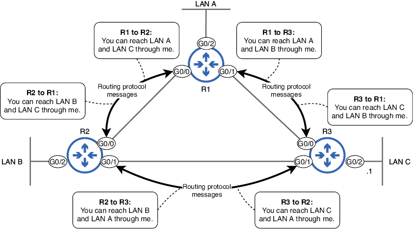
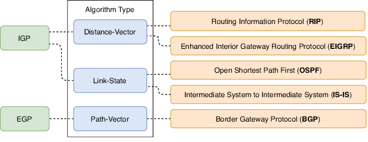
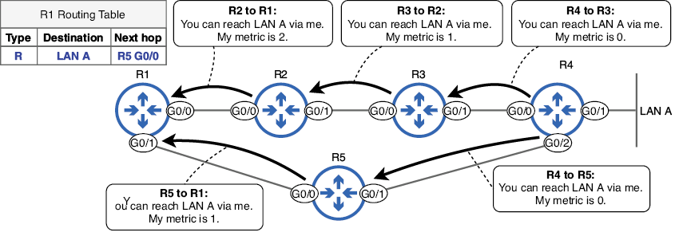
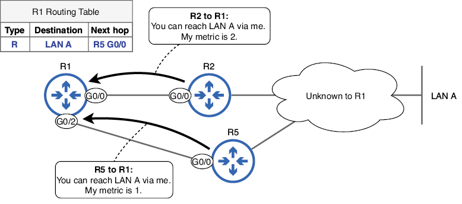
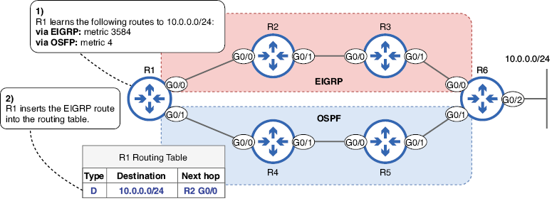
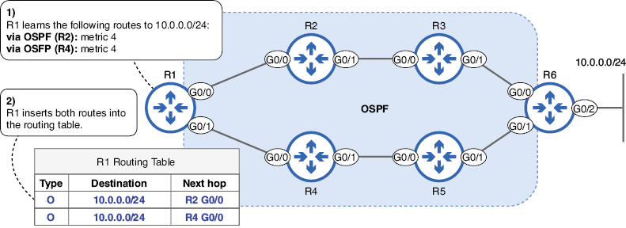
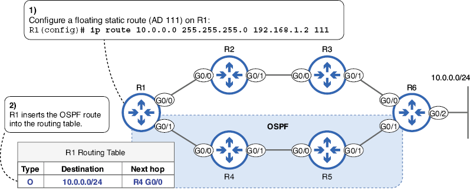
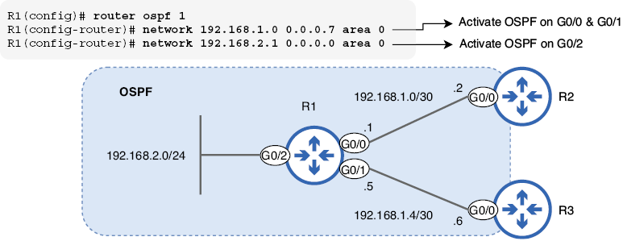

# Enrutamiento dinámico

En esta unidad veremos los siguientes puntos:

+ Las ventajas del enrutamiento dinámico sobre el enrutamiento estático
+ Los tipos de protocolos de enrutamiento dinámico
+ Cómo decide un router qué rutas ingresar en su tabla de enrutamiento
+ Activación de protocolos de enrutamiento dinámico con el comando de red

En la unidad anterior aprendimos sobre el enrutamiento estático, en el que un administrador configura manualmente las rutas para crear la tabla de enrutamiento de un router. Al usar el enrutamiento dinámico, los routers se comunican entre sí y crean sus tablas de enrutamiento automáticamente. Si bien el enrutamiento estático tiene sus usos, el enrutamiento dinámico ofrece varias ventajas que examinaremos en este capítulo.

Lo que aquí trataremos tiene, de alguna forma, una correspondencia con algunos de los elementos de los siguientes temas de examen del CCNA:

+ 3.1 Interpretar los componentes de la tabla de enrutamiento
+ 3.2 Determinar cómo un router toma una decisión de reenvío de forma predeterminada
+ 3.3 Configurar y verificar el enrutamiento estático IPv4 e IPv6
+ 3.4 Configurar y verificar OSPFv2

## Enrutamiento dinámico vs. enrutamiento estático

El enrutamiento dinámico es un proceso mediante el cual los routers comparten información sobre la red, lo que les permite crear sus tablas de enrutamiento sin necesidad de que un administrador configure manualmente cada ruta. Esto se logra mediante un protocolo de enrutamiento, que define cómo se comunican los routers para compartir información de enrutamiento y cómo la utilizan para crear sus tablas de enrutamiento. 

La imagen siguiente muestra un ejemplo del funcionamiento de los protocolos de enrutamiento. R1, R2 y R3 utilizan un protocolo de enrutamiento para intercambiar mensajes, informándose mutuamente de sus redes conocidas. Cada router utilizará esta información para crear su tabla de enrutamiento, sin necesidad de que un administrador configure manualmente las rutas.
Figura 17.1 R1, R2 y R3 utilizan un protocolo de enrutamiento para compartir información de enrutamiento. 

Cada router utilizará esta información para crear su tabla de enrutamiento.

{text-align: justify}

!!!note "Nota"
    El intercambio de información de enrutamiento también se denomina *advertisement* (anuncio) . R1, R2 y R3 anuncian sus redes conocidas entre sí.

El enrutamiento dinámico ofrece varias ventajas sobre el enrutamiento estático, como la adaptabilidad y la escalabilidad. Analicemos estas dos ventajas con más detalle.

### Adaptabilidad

Las rutas estáticas, como su nombre indica, son estáticas e inmutables; no pueden reaccionar a los cambios en la red. Si una ruta deja de ser válida debido a un fallo de hardware en uno de los routers de la ruta, la ruta estática no se ajustará automáticamente para encontrar una ruta alternativa. La imagen de más abajo muestra un ejemplo: el enlace R2-R3 se cae debido a un fallo de hardware. Esto hace que R3 elimine su ruta a 192.168.30.0/24 de su tabla de enrutamiento; ya no puede acceder a la dirección IP del siguiente salto. Sin embargo, R1 desconoce el fallo del enlace. Como resultado, R1 mantiene su ruta a 192.168.30.0/24 a través de R2 en su tabla de enrutamiento, aunque ya no sea una ruta válida para llegar al destino.

{text-align: justify}
/// figura
La ruta estática en R1 no puede adaptarse a un cambio en la red. (1) Una falla de hardware provoca la caída del enlace R2-R3. (2) R2 elimina su ruta a 192.168.30.0/24 porque ya no puede alcanzar el siguiente salto. (3) R1, sin percatarse de la falla de hardware, deja su ruta a 192.168.30.0/24 a través de R2 en su tabla de enrutamiento, a pesar de la existencia de una ruta alternativa.
///

!!!note "Nota"
    Si un router no puede acceder a la dirección IP del siguiente salto de una ruta, la eliminará de la tabla de enrutamiento. Esto aplica a todo tipo de rutas y es por eso que R2 elimina su ruta estática a 192.168.30.0/24 cuando falla el enlace R2-R3.

Dado que la ruta de R1 a 192.168.30.0/24 a través de R2 permanece en su tabla de enrutamiento, continuará reenviando paquetes destinados a hosts en la red 192.168.30.0/24 a R2. R2 no tiene otra opción que descartar los paquetes, ya que no tiene una ruta a 192.168.30.0/24 en su tabla de enrutamiento. La imagen muestra cómo el enrutamiento dinámico soluciona esto; permite a R1 adaptarse automáticamente al cambio de red, insertando una nueva ruta al destino en su tabla de enrutamiento.

{text-align: justify}
/// figura
El enrutamiento dinámico permite que los routers se adapten a los cambios en la red calculando automáticamente nuevas rutas. (1) Una falla de hardware provoca la caída del enlace R2-R3. (2) R2 elimina su ruta a 192.168.30.0/24 a través de R3 y agrega una nueva ruta con R1 como siguiente salto. (3) R1 elimina su ruta a través de R2 y agrega una nueva ruta con R4 como siguiente salto.
///

!!!note "Nota"
    El tipo de ruta D en la figura de arriba indica una ruta aprendida mediante el protocolo de enrutamiento Enhanced Interior Gateway Routing Protocol (EIGRP). D significa `DIFUSING UPDATE ALGORITHM (DUAL)`, el algoritmo específico que EIGRP utiliza para calcular rutas.

En cuestión de segundos tras el fallo, todos los routers de la red detectarán el cambio y tendrán nuevas rutas en sus tablas de enrutamiento. Una vez restaurado el enlace fallido (quizás reemplazando un cable defectuoso), los routers se adaptarán de nuevo a ese cambio, restaurando sus tablas de enrutamiento a su estado anterior. La adaptabilidad del enrutamiento dinámico mejora la resiliencia de la red; es capaz de recuperarse automáticamente de los fallos con un tiempo de inactividad mínimo. Esto no es posible en una red que utiliza exclusivamente enrutamiento estático.

### Escalabilidad

Otra ventaja importante del enrutamiento dinámico es la escalabilidad. Si bien el enrutamiento estático puede ser práctico para redes pequeñas, se vuelve cada vez más complejo e inmanejable a medida que la red crece. Por otro lado, los protocolos de enrutamiento dinámico se escalan fácilmente para admitir redes muy grandes y complejas. En la imagen se muestra una red de seis routers, cada uno conectado a una LAN que contiene varias subredes. Además, dos routers tienen conexiones a un ISP. Esta es una red bastante simple, pero incluso en una red de este tamaño, configurar manualmente rutas estáticas a cada destino en cada router no es muy práctico. Una opción más sencilla es habilitar un protocolo de enrutamiento en cada router y permitir que compartan la información de enrutamiento entre ellos.

{text-align: justify}
/// figura
Configurar rutas estáticas a cada destino en cada router, incluso en una red bastante pequeña como esta, no es práctico; consumiría mucho tiempo y sería propenso a errores humanos.
///

Antes de examinar los diferentes tipos de protocolos de enrutamiento, cabe mencionar que las rutas estáticas tienen sus propias ventajas, como la previsibilidad y el control. Dado que el enrutamiento estático implica la configuración manual de rutas (especificando el siguiente salto para cada destino), son útiles cuando se desea controlar la ruta exacta que siguen los paquetes. Afortunadamente, no es necesario elegir entre enrutamiento estático y dinámico; se puede usar una combinación de ambos en un solo router.

## Tipos de protocolos de enrutamiento

Los protocolos de enrutamiento se dividen en dos categorías principales: **Protocolos de Puerta de Enlace Interior (IGP - Interior Gatewa Protocol)** y **Protocolos de Puerta de Enlace Exterior (EGP - Exterior Gateway Protocols)**. Los IGP se utilizan para intercambiar información de enrutamiento dentro de un único sistema autónomo (AS), es decir, la red de una organización. Los EGP, por otro lado, se utilizan para intercambiar información de enrutamiento entre diferentes sistemas autónomos, como entre una empresa y un ISP o entre dos ISP.

!!!note "Nota"
    Puerta de enlace es un término antiguo para router. Aunque hoy en día los llamamos routers, el término puerta de enlace todavía se usa en algunos contextos (como puerta de enlace predeterminada, como ya hemos visto.

La imagen de abajo muestra la diferencia entre los IGP y los EGP. Cada organización del diagrama utiliza un IGP para intercambiar información de enrutamiento dentro de su organización, pero un EGP para intercambiar información de enrutamiento con otras organizaciones.

{text-align: justify}
/// figura
Los IGP se utilizan para intercambiar información de enrutamiento con routers del mismo sistema autónomo (conectados con líneas continuas). Los EGP se utilizan para intercambiar información de enrutamiento con routers de un sistema autónomo diferente (conectados con líneas discontinuas).
///

La siguiente imagen enumera los protocolos de enrutamiento más utilizados en la actualidad. Además de clasificarse como IGP o EGP, los protocolos de enrutamiento pueden clasificarse por tipo de algoritmo, que describe cómo los routers comparten información y calculan rutas.

{text-align: justify}
/// figura
Los cinco protocolos de enrutamiento de uso común en la actualidad. Los IGP se pueden clasificar como de vector-distancia o de estado de enlace. Los dos IGP de vector-distancia son RIP y EIGRP. Los dos IGP de estado de enlace son OSPF e IS-IS. El único protocolo de puerta de enlace exterior en uso actualmente, el Protocolo de Puerta de Enlace Fronterizo (Border Gateway Protocol), utiliza un algoritmo de vector-ruta.
///

### Protocolos de puerta de enlace interior

Los IGP utilizan uno de dos tipos de algoritmos: vector-distancia y estado-enlace. En esta sección, analizaremos las características básicas de cada uno.
Protocolos de vector de distancia

Actualmente se utilizan dos protocolos principales de enrutamiento por vector de distancia: **RIP (Routing Information Protocol)**, estándar de la industria, y **EIGRP (Enhanced Interior Gateway Routing Protocol)**, desarrollado por Cisco. RIP es un protocolo muy simple que suele emplearse solo en redes y laboratorios muy pequeños. EIGRP, por otro lado, es más avanzado que RIP (de hecho, a veces se le denomina protocolo de vector de distancia avanzado) y se utiliza en muchas redes a gran escala.

!!!note "Nota"
    Aunque EIGRP fue desarrollado por Cisco, la mayor parte de su funcionalidad se publicó en la RFC 7868, por lo que otros proveedores pueden implementarlo en sus dispositivos. Sin embargo, muy pocos proveedores lo han implementado, por lo que, en general, se puede afirmar que EIGRP solo funciona en routers Cisco.

Los routers que utilizan un protocolo de vector-distancia comparten información sobre sus redes conocidas y las métricas para acceder a ellas. Las métricas son un concepto similar al costo raíz de STP. Mientras que el costo raíz de STP mide la eficiencia de una ruta al puente raíz, una métrica mide la eficiencia de una ruta a la red de destino; las métricas se abordarán en la sección 17.3.1. La siguiente figura muestra cómo un router obtiene información de una red de destino (LAN A) con un protocolo de enrutamiento de vector-distancia. R1 obtiene información de LAN A a través de dos vecinos: R2 y R5. Dado que la ruta a través de R5 tiene una métrica menor, R1 la inserta en su tabla de enrutamiento; es preferible un valor de métrica menor.

{text-align: justify}
/// figura
Los routers comparten información de enrutamiento con un protocolo de enrutamiento por vector de distancia. R1 obtiene información de la LAN A de R2 y R5, pero inserta la ruta a través de R5 en su tabla de enrutamiento debido al menor valor de la métrica.
///

!!!note "Nota"
    El tipo de ruta R en la figura indica una ruta aprendida mediante el protocolo de enrutamiento RIP.

La característica clave de los protocolos de enrutamiento por vector de distancia es que cada router no tiene un mapa completo de la red; para cada red de destino que aprende, solo conoce la métrica y el router del siguiente salto. Usando el ejemplo de la figura 17.7, R1 sabe que para llegar a la LAN A, puede reenviar paquetes a R2, cuya métrica es 2, o a R5, cuya métrica es 1; desconoce los detalles de la red más allá de R2 y R5, como se muestra a continuación:

{text-align: justify}
/// figura
R1 obtiene información de la LAN A a través de R2 y R5 y selecciona una ruta basándose en esa información. R1 desconoce los detalles de la red más allá de R2 y R5.
///

!!!note "Nota"
    El enrutamiento por vector de distancia a veces se denomina enrutamiento por rumor. Los routers no tienen un mapa completo de la red; solo conocen lo que les dicen sus vecinos.

### Protocolos de estado de enlace

Al igual que los protocolos de enrutamiento por vector de distancia, existen dos protocolos principales de enrutamiento de estado de enlace en uso actualmente: Sistema Intermedio a Sistema Intermedio (IS-IS) y Open Shortest Path First (OSPF), ambos protocolos estándar de la industria. IS-IS se utiliza con mayor frecuencia en redes de proveedores de servicios (como las redes de ISP) y no se trata en el examen CCNA; no lo abordaremos en detalle en este libro. Por otro lado, OSPF es uno de los temas principales del examen CCNA y lo abordaremos en detalle en el capítulo 18.

Al utilizar un protocolo de enrutamiento de estado de enlace, cada router crea un mapa de conectividad de la red. Para que todos los routers puedan crear su propio mapa de conectividad, cada uno comparte información sobre sus enlaces conectados y su estado (subredes conectadas, costo métrico, etc.); de ahí el nombre "estado de enlace". Esta información no solo se comparte con los routers vecinos directamente conectados, sino con todos los routers de la red, para que todos puedan crear el mismo mapa de conectividad. Cada router utiliza este mapa de la red para calcular la mejor ruta a cada destino. La Figura 17.9 muestra este concepto: el R1 crea un mapa de conectividad y lo utiliza para calcular una ruta a la LAN A.

{text-align: justify}
/// figura
R1 construye un mapa de conectividad de la red y lo utiliza para calcular una ruta a LAN A.
///

!!!note "Nota"
    El tipo de ruta O indica una ruta aprendida a través del protocolo de enrutamiento OSPF.

Construir este mapa de la red y usarlo para calcular rutas requiere más recursos de CPU y memoria en el router que los requeridos por los protocolos de enrutamiento por vector de distancia, lo cual puede ser un problema en redes muy grandes. El mapa se almacena en memoria mediante una estructura llamada base de datos de estado de enlace (LSDB), y calcular rutas a partir de la LSDB puede consumir muchos recursos de la CPU. Sin embargo, existen métodos para superar esta limitación, como dividir la red en áreas, que abordaremos en el capítulo 18.

### Protocolos de puerta de enlace exterior

En las redes modernas, solo se utiliza ampliamente un único EGP: el Protocolo de Puerta de Enlace de Frontera (BGP). BGP utiliza un algoritmo de vector de ruta para calcular rutas. Al igual que los dos tipos de algoritmos IGP, el nombre de vector de ruta nos da una pista sobre cómo funciona BGP. La ruta es la serie de sistemas autónomos que un paquete recorrerá a lo largo de su ruta hacia su destino; por ejemplo, podría pasar por dos ISP diferentes antes de llegar al Sistema Autónomo de destino.

La Figura 17.10 muestra la lógica de vector de ruta: los paquetes del R1 a destinos en la Empresa B viajarán a través de los ISP A y B y luego llegarán a la Empresa B. El R1 conoce esta ruta comunicándose con el ISP A mediante BGP. En lugar de tomar decisiones de enrutamiento basadas en la serie de routers individuales por los que viajarán los paquetes, BGP toma decisiones de enrutamiento basadas en la serie de sistemas autónomos por los que viajarán (cada AS probablemente consta de varios routers).

{text-align: justify}
/// figura
La ruta de R1 a la Empresa B pasa por el ISP A y el ISP B y luego llega a la Empresa B. La lógica de vector de ruta es de AS a AS, en lugar de router a router.
///


!!!note "Nota"
    La Figura 17.10 simplifica el funcionamiento de BGP. BGP considera múltiples atributos de la ruta, no solo el número de sistemas autónomos.

## Selección de ruta

La selección de ruta es algo que ya hemos visto anteriormente. Esa definición de selección de ruta se refería al reenvío de paquetes; cuando un router reenvía un paquete, seleccionará la ruta coincidente más específica en la tabla de enrutamiento.

Sin embargo, la selección de ruta también puede referirse al proceso de seleccionar las rutas que se utilizan para completar la tabla de enrutamiento. Las rutas aprendidas mediante un protocolo de enrutamiento dinámico no se insertan automáticamente en la tabla de enrutamiento del router. Del mismo modo, las rutas estáticas configuradas manualmente tampoco se incluyen necesariamente en la tabla de enrutamiento. Si una ruta no está en la tabla de enrutamiento, no se puede utilizar para reenviar paquetes. En resumen, el término "selección de ruta" tiene dos significados:

+ <u>*Población de la tabla de enrutamiento:*</u> el proceso de seleccionar qué rutas ingresará el router en su tabla de enrutamiento
+ <u>*Reenvío de paquetes:*</u> el proceso de seleccionar la mejor ruta en la tabla de enrutamiento para reenviar un paquete en particular.

Si un router aprende varias rutas al mismo destino, solo insertará la mejor ruta a ese destino en su tabla de enrutamiento. Para determinar cuál es la mejor ruta, comparará dos parámetros: distancia métrica y administrativa.

### El parámetro de la métrica

Ya vimos un ejemplo del funcionamiento de las métricas en la figura 17.7. R1 aprendió dos rutas para llegar a la LAN A: una con una métrica de 2 y otra con una métrica de 1. ¿Cuál de las dos rutas insertó R1 en su tabla de enrutamiento? R1 seleccionó la última debido a su métrica más baja.

La métrica de cada protocolo de enrutamiento se calcula de forma diferente. RIP utiliza un conteo de saltos simple: la cantidad de routers entre el router y el destino constituye la métrica de la ruta. OSPF utiliza un valor de costo calculado a partir del ancho de banda de cada enlace de la ruta. EIGRP utiliza un cálculo más complejo basado en el ancho de banda y el retardo (el tiempo que tardan los bits en viajar a través de un enlace), así como otros parámetros. La Tabla 17.1 resume cómo RIP, EIGRP y OSPF calculan las métricas.
Tabla 17.1 Métricas del IGP (ver figura de la tabla)

| IGP | Métrica | Descripción |
|-----|---------|-------------|
| RIP | Nº de saltos | Cada router en la ruta cuenta como un salto. La métrica total es el número total de saltos hasta el destino. |
| EIGRP | Métrica basada en ancho de banda y retardo | Una fórmula compleja que puede tomar en cuenta muchos valores. Por defecto, se utilizan el ancho de banda y el retardo. |
| OSPF | Costo | El costo de cada enlace se calcula en base al ancho de banda. La métrica de una ruta es el costo total de cada enlace en la ruta. |

La Figura 17.11 muestra un ejemplo de selección de ruta en una red de routers que utilizan OSPF para compartir información de enrutamiento. El R1 utiliza su mapa de conectividad para calcular las posibles rutas para llegar a 192.168.3.0/24 y selecciona la mejor ruta para su tabla de enrutamiento.

{text-align: justify}
/// figura
R1 inserta la mejor ruta a 192.168.3.0/24 en su tabla de enrutamiento. (1) R1 calcula las posibles rutas a 192.168.3.0/24. La ruta a través de R3 tiene una métrica de 2 y la ruta a través de R2 tiene una métrica de 4. (2) R1 selecciona la ruta a través de R3 debido a su métrica más baja y la inserta en su tabla de enrutamiento.
///

El siguiente ejemplo muestra la ruta en la tabla de enrutamiento de R1. Preste atención a los dos valores entre corchetes:

```rd
R1# show ip route
. . .
O     192.168.3.0/24 [110/2] via 192.168.1.6, 00:08:35, GigabitEthernet0/0
```

Después de la red de destino 192.168.3.0/24, la ruta incluye dos valores entre corchetes: [110/2]. El primer valor (110) corresponde a la distancia administrativa de la ruta (descrita en la sección 17.3.2) y el segundo valor (2) a su métrica. En el siguiente ejemplo, deshabilito la interfaz G0/0 de R1, lo que invalida la ruta vía R3. A continuación, reviso de nuevo la tabla de enrutamiento; la ruta alternativa vía R2, con una métrica de 4, se inserta en la tabla de enrutamiento en lugar de la ruta vía R3.

```rd
R1(config)# interface g0/0
R1(config-if)# shutdown
R1(config-if)# do show ip route
. . .
O     192.168.3.0/24 [110/4] via 192.168.1.2, 00:00:04, GigabitEthernet0/1
```

### El parámetro de distancia administrativa

Aunque la mayoría de los routers solo ejecutan un protocolo de enrutamiento, hay casos en los que un router ejecuta varios protocolos; por ejemplo, si dos empresas (que ejecutan diferentes protocolos de enrutamiento) conectan sus redes para permitir la comunicación entre ellas. Al ejecutar varios protocolos de enrutamiento, un router puede obtener información sobre la misma red de destino a partir de diferentes protocolos de enrutamiento. En tales casos, el router necesita una forma de comparar las rutas para determinar cuál debe ingresar en la tabla de enrutamiento.

Cada protocolo de enrutamiento utiliza diferentes parámetros para determinar la métrica de una ruta: RIP utiliza un simple conteo de saltos, OSPF utiliza un costo basado en el ancho de banda y la métrica de EIGRP se calcula mediante una fórmula que puede considerar diversos factores. El proceso de selección de rutas de BGP, que queda fuera del alcance del examen CCNA, es mucho más complejo que un simple valor métrico. Dado que la métrica de cada protocolo de enrutamiento es diferente, no se pueden comparar directamente; sería como preguntar: "¿Qué es mejor: 20 kilogramos o 10 kilómetros?". Si un router aprende múltiples rutas a la misma red de destino desde diferentes protocolos de enrutamiento, necesita usar algo más para seleccionar qué ruta entra en la tabla de enrutamiento.

Esa es la función de la distancia administrativa (AD). La AD es un valor que indica la preferencia de un protocolo de enrutamiento. Un valor de AD bajo indica que el IOS considera que un protocolo de enrutamiento es más confiable, es decir, que tiene mayor probabilidad de seleccionar buenas rutas. Mientras que una métrica se utiliza para comparar rutas aprendidas mediante el mismo protocolo de enrutamiento, la AD se utiliza para comparar rutas aprendidas mediante diferentes protocolos de enrutamiento. La Tabla 17.2 muestra los valores de AD predeterminados de algunos protocolos de enrutamiento diferentes (incluidas las rutas conectadas y estáticas).

| Tipo de ruta / Protocolo | AD por defecto |
|--------------------------|----------------|
| Conectada                | 0              |
| Estática                 | 1              |
| BGP Externo (EBGP)       | 20             |
| EIGRP                    | 90             |
| OSPF                     | 110            |
| IS-IS                    | 115            |
| RIP                      | 120            |
| BGP Interno (IBGP)       | 200            |
| Ruta inutilizable        | 255            |

Tabla 17.2 Valores de AD predeterminados (ver figura de la tabla)

Al igual que al comparar valores de métricas, se prefiere el valor de AD más bajo. Las rutas conectadas (las rutas que se agregan automáticamente al configurar una dirección IP en una interfaz) tienen un AD de 0; siempre se prefieren sobre otros tipos de ruta. Las rutas estáticas, con un AD de 1, se prefieren por defecto sobre las rutas aprendidas de cualquier protocolo de enrutamiento dinámico; sin embargo, más adelante en esta sección explicaremos cómo reducir su preferencia. El valor de AD menos preferido es 255. Los routers Cisco pueden usar este valor para marcar una ruta como inutilizable; se eliminará de la tabla de enrutamiento.

La Figura 17.12 muestra un ejemplo en el que se utiliza AD para seleccionar la ruta que entra en la tabla de enrutamiento. R1 obtiene la red de destino 10.0.0.0/24 mediante EIGRP y OSPF. Aunque el valor de la métrica de la ruta EIGRP (3584) es numéricamente mayor que el de la ruta OSPF (4), esto es irrelevante en este caso; los valores de las métricas de EIGRP y OSPF no se pueden comparar directamente. En su lugar, se utiliza AD para decidir qué ruta entra en la tabla de enrutamiento. El AD de EIGRP (90) es menor que el de OSPF (110), por lo que R1 inserta la ruta EIGRP en su tabla de enrutamiento.

!!!note "Nota"
    Debido a la fórmula que EIGRP utiliza para calcular las métricas, los valores de las métricas de las rutas EIGRP tienden a ser bastante altos en comparación con los de las rutas RIP y OSPF. Si bien la métrica de esta ruta es 3584 (debido a que el R1 y el destino solo están separados por unos pocos routers), no es raro que la métrica de las rutas EIGRP se encuentre entre decenas y cientos de miles.

{text-align: justify}
/// figura
El R1 usa AD para seleccionar la ruta que ingresa a la tabla de enrutamiento. (1) El R1 aprende dos rutas a 10.0.0.0/24: vía EIGRP (métrica 3584) y vía OSPF (métrica 4). (2) El AD de EIGRP (90) es menor que el de OSPF (110), por lo que el R1 inserta la ruta EIGRP en su tabla de enrutamiento. Los valores de las métricas son irrelevantes en este caso.
///

El siguiente ejemplo muestra la ruta EIGRP en la tabla de enrutamiento del R1. Observe los valores entre corchetes: el AD de EIGRP es 90 y la métrica de la ruta es 3584.

```rd
R1# show ip route
. . .
D        10.0.0.0 [90/3584] via 192.168.12.2, 00:33:30, GigabitEthernet0/0
. . .
```

!!!note "Nota"
    Las métricas y el AD solo se utilizan para comparar rutas al mismo destino: la misma dirección de red de destino con la misma longitud de prefijo. Si dos rutas tienen la misma dirección de red de destino, pero diferente longitud de prefijo (por ejemplo, 192.168.0.0/24 y 192.168.0.0/25), se consideran destinos diferentes; ambas rutas se insertarán en la tabla de enrutamiento. Aclararemos este punto en la sección 17.3.3.

### ECMP

Las métricas se utilizan para seleccionar rutas con el mismo destino, aprendidas mediante el mismo protocolo de enrutamiento, y el AD se utiliza para seleccionar rutas con el mismo destino, aprendidas mediante diferentes protocolos de enrutamiento. Pero ¿qué sucede si un router aprende varias rutas con el mismo destino mediante el mismo protocolo de enrutamiento y estas tienen la misma métrica? En ese caso, todas las rutas se añadirán a la tabla de enrutamiento y el tráfico se distribuirá entre ellas; la mitad del tráfico se enviará por una ruta y la otra por la otra. Esto se denomina enrutamiento multirruta de igual coste (ECMP).

!!!note "Nota"
    De forma predeterminada, se puede utilizar un máximo de cuatro rutas al mismo destino para el enrutamiento ECMP.

{text-align: justify}
/// figura
Ejemplo de ECMP. El R1 aprende dos rutas a 10.0.0.0/24: una de R2 y otra de R4. Ambas rutas se aprenden mediante OSPF y tienen una métrica de 4. Por lo tanto, el R1 inserta ambas rutas en la tabla de enrutamiento; esto equilibrará la carga del tráfico entre ambas rutas.
Figura 17.13 Un ejemplo de enrutamiento ECMP. (1) R1 aprende dos rutas a 10.0.0.0/24 a través de OSPF con la misma métrica: una de R2 y una de R4. (2) R1 inserta ambas rutas en su tabla de enrutamiento; equilibrará la carga del tráfico utilizando las dos rutas.
///


### Rutas estáticas flotantes

De forma predeterminada, las rutas estáticas tienen un AD de 1 y, por lo tanto, se prefieren a las rutas aprendidas mediante un protocolo de enrutamiento dinámico. Sin embargo, en algunos casos, podría ser conveniente configurar una ruta estática como respaldo, que solo se incluya en la tabla de enrutamiento si se pierde la ruta principal (aprendida mediante un protocolo de enrutamiento). Esta es la función de las rutas estáticas flotantes.

Una ruta estática flotante es una ruta estática configurada con un AD mayor que el valor predeterminado de 1 para que sea menos preferida. Por ejemplo, para que una ruta estática sea menos preferida que una ruta OSPF al mismo destino, debe configurarse con un AD mayor que 110 (el AD de OSPF). Para configurar una ruta estática flotante, simplemente añada el valor de AD al final del comando. Por ejemplo, puede configurar una ruta estática recursiva flotante con el comando `ip route destination-network netmask next-hop ad`. La Figura 17.14 muestra un ejemplo en el que se configura una ruta estática con un AD de 111 para que sea menos preferida que una ruta aprendida mediante OSPF.

{text-align: justify}
/// figura
Una ruta estática flotante es menos preferida que una ruta OSPF al mismo destino.
///

!!!note "Nota"
    Si configura una ruta estática flotante con el mismo AD que un protocolo de enrutamiento dinámico, se seguirá prefiriendo la ruta estática. Debe configurar rutas estáticas flotantes con un AD mayor que el protocolo de enrutamiento.

Una ruta estática flotante funciona como ruta de respaldo, ofreciendo una ruta secundaria para los datos si la ruta principal falla. Si bien los protocolos de enrutamiento dinámico también pueden ofrecer la misma funcionalidad (recalculando la siguiente mejor ruta si la mejor ruta actual falla), una ruta estática flotante puede proporcionar una ruta de respaldo a través de un router con el que el router local no intercambia información de enrutamiento. En la figura 17.14, R1 tiene una relación de vecino OSPF con R4, pero no con R2. Las rutas estáticas flotantes también ofrecen las ventajas mencionadas anteriormente, como control y previsibilidad; permiten controlar con exactitud qué ruta tomará el tráfico si falla la ruta principal.

En el siguiente ejemplo, pruebo la ruta estática flotante que vimos en la figura 17.14. Al revisar por primera vez la tabla de enrutamiento de R1, la ruta OSPF está presente. Luego, deshabilito la interfaz G0/1 de R1 (simulando un fallo de hardware) y reviso la tabla de enrutamiento de nuevo; esta vez, la ruta estática flotante (con un AD de 111) ha reemplazado a la ruta OSPF:

```rd
R1(config)# do show ip route 
. . .
O        10.0.0.0 [110/4] via 192.168.1.6, 00:25:43, 
GigabitEthernet0/1
. . .
R1(config)# interface g0/1
R1(config-if)# shutdown    
R1(config)# do show ip route
. . .
S        10.0.0.0 [111/0] via 192.168.1.2
. . .
```

!!!note "Nota"
    Las rutas estáticas no utilizan el concepto de métricas; su métrica siempre es 0.

### Ejemplos de selección de ruta

La selección de rutas, en sus dos acepciones (población de la tabla de enrutamiento y reenvío de paquetes), es un tema muy importante para el examen CCNA. En esta sección, analizaremos algunos ejemplos de cada una y aclararemos los conceptos que hemos cubierto hasta ahora.

#### Población de la tabla de enrutamiento

Considere el siguiente ejemplo. R1 aprende las siguientes rutas mediante configuración manual y protocolos de enrutamiento dinámico:

+ (A) 203.0.113.0/24 a través de enrutamiento estático
+ (B) 203.0.113.0/25 vía RIP, métrica 4
+ (C) 203.0.113.0/26 a través de EIGRP, métrica 5678
+ (D) 203.0.113.0/27 a través de OSPF, métrica 10

¿Qué ruta(s) insertará R1 en su tabla de enrutamiento? Tras leer hasta este punto, podría pensar que R1 seleccionará la ruta estática porque tiene el AD más bajo. O quizás piense que R1 seleccionará la ruta OSPF porque tiene la longitud de prefijo más larga (utilizando la regla de la "ruta coincidente más específica" que se explica en el capítulo 9). Sin embargo, la respuesta es que R1 insertará las cuatro rutas en su tabla de enrutamiento.

La razón es que las cuatro rutas tienen destinos diferentes. Aunque comparten la misma dirección de red de destino (203.0.113.0), todas tienen longitudes de prefijo diferentes y, por lo tanto, se consideran destinos diferentes. No es necesario compararlas; R1 las insertará todas en la tabla de enrutamiento.

Cabe destacar que las cuatro subredes del ejemplo se superponen, como se muestra en la figura 17.15. Las subredes /25, /26 y /27 se encuentran dentro de la subred /24. Sin embargo, al crear la tabla de enrutamiento, se consideran redes de destino diferentes y, por lo tanto, se insertarán en ella.

{text-align: justify}
/// figura
Las cuatro rutas del ejemplo se superponen. 203.0.113.0/24 incluye 203.0.113.0–.255, 203.0.113.0/25 incluye 203.0.113.0–.127, 203.0.113.0/26 incluye 203.0.113.0–.63 y 203.0.113.0/27 incluye 203.0.113.0–.31. Sin embargo, IOS las considera rutas a diferentes destinos e insertará las cuatro rutas en la tabla de enrutamiento.
///

!!!note "Nota"
    El concepto de "ruta coincidente más específica" es irrelevante para esta pregunta. La regla de la ruta coincidente más específica se utiliza para seleccionar qué ruta de la tabla de enrutamiento se usará para   reenviar un paquete; no para seleccionar qué rutas entrarán en la tabla de enrutamiento.

Veamos otro ejemplo. R1 aprende las siguientes rutas mediante protocolos de enrutamiento dinámico:

+ (A) 10.0.0.0/8 a través de EIGRP, métrica 2345
+ (B) 10.0.0.0/8 a través de OSPF, métrica 10
+ (C) 10.0.0.0/16 a través de OSPF, métrica 20
+ (D) 10.0.0.0/16 a través de OSPF, métrica 5

¿Qué ruta(s) insertará R1 en su tabla de enrutamiento en este ejemplo? Analicemos la lógica. En este ejemplo, R1 aprende dos rutas a cada una de dos redes de destino diferentes: dos rutas a 10.0.0.0/8 y dos rutas a 10.0.0.0/16. Por lo tanto, R1 debe seleccionar la mejor de las dos rutas a 10.0.0.0/8 y la mejor de las dos rutas a 10.0.0.0/16.

¿Cuál de las dos rutas a 10.0.0.0/8 preferirá R1? Dado que R1 aprende las dos rutas mediante diferentes protocolos de enrutamiento, usará AD para compararlas. La métrica de EIGRP (90) es menor que la de OSPF (110), por lo que R1 seleccionará la ruta EIGRP; por lo tanto, A es una de las respuestas.

¿Y cuál de las dos rutas a 10.0.0.0/16 preferirá R1? En este caso, ambas rutas se aprenden mediante el mismo protocolo de enrutamiento, por lo que R1 comparará sus valores métricos para determinar cuál es la ruta preferible. La ruta D tiene la métrica más baja de las dos, por lo que será la seleccionada.

#### Reenvío de paquetes

El segundo aspecto de la selección de ruta es el reenvío de paquetes: seleccionar la ruta de la tabla de enrutamiento que se utilizará para reenviar un paquete en particular. Este proceso es más sencillo, ya que solo se considera una cosa: la ruta más específica. Al reenviar un paquete, no se consideran los valores de AD ni de métricas de las rutas.

Sin embargo, identificar la ruta que un router seleccionará para reenviar un paquete puede ser difícil, ya que el proceso de identificar qué rutas coinciden con el destino de un paquete en particular y cuál de ellas es la más específica requiere la conversión entre binario y decimal. Por eso, enfaticé la importancia de familiarizarse con el sistema binario al abordar el direccionamiento y la subred IPv4 en capítulos anteriores.

Veamos un ejemplo de selección de ruta en el contexto del reenvío de paquetes. Examine la tabla de enrutamiento de R1 a continuación. ¿Qué ruta seleccionará para reenviar un paquete con destino a 203.0.113.65?

```
R1# show ip route
. . .
S        203.0.113.0/24 [1/0] via 192.168.1.2
R        203.0.113.0/25 [120/4] via 192.168.1.6
D        203.0.113.0/26 [90/5678] via 192.168.1.10
O        203.0.113.0/27 [110/10] via 192.168.1.14
```

El primer paso es identificar qué rutas coinciden con el destino del paquete. Como vimos en el capítulo 9, si la dirección IP de destino del paquete forma parte de la red especificada en la ruta, se considera una coincidencia. En el siguiente ejemplo, he escrito cada ruta en binario, así como la dirección IP de destino del paquete (203.0.113.65):

```
203.0.113.0/24 = 11001011.00000000.01110001.00000000
203.0.113.0/25 = 11001011.00000000.01110001.00000000
203.0.113.0/26 = 11001011.00000000.01110001.00000000
203.0.113.0/27 = 11001011.00000000.01110001.00000000
203.0.113.65   = 11001011.00000000.01110001.01000001
```

La ruta a 203.0.113.0/24 coincide con el destino del paquete, al igual que la ruta a 203.0.113.0/25. La ruta a 203.0.113.0/26 no coincide con el destino del paquete porque el bit 26 no coincide; es 0 en la ruta, pero 1 en la dirección IP de destino del paquete. Del mismo modo, la ruta /27 no coincide debido a la falta de coincidencia del bit 26.

De las dos rutas coincidentes, la ruta a 203.0.113.0/25 es más específica; tiene la longitud de prefijo más larga. Por lo tanto, es la ruta que se seleccionará para reenviar el paquete; R1 reenviará el paquete al siguiente salto 192.168.1.6. El hecho de que la ruta tenga un AD más alto que las otras tres rutas es irrelevante, al igual que su métrica; al seleccionar la ruta que se utilizará para reenviar un paquete, la única consideración es la ruta coincidente más específica. En resumen, estos son los dos aspectos de la selección de ruta:

+ Población de la tabla de enrutamiento:
    + Las métricas se utilizan para seleccionar entre rutas hacia el mismo destino que se aprenden a través del mismo protocolo de enrutamiento.
    + AD se utiliza para seleccionar entre rutas hacia el mismo destino que se aprenden a través de diferentes protocolos de enrutamiento.
+ Reenvío de paquetes:
    + Se selecciona la ruta coincidente más específica.


## El comando `network`

RIP, EIGRP y OSPF se configuran activando el protocolo en una o más interfaces del router. El router anuncia el prefijo de red (dirección y máscara de red) de la interfaz. La configuración de RIP y EIGRP queda fuera del alcance del examen CCNA, y abordaremos la configuración de OSPF con más detalle en el capítulo 18. Sin embargo, en esta sección, analizaremos un comando compartido por los tres protocolos: el comando `network`. Este comando le indica al router que:

+ Busque interfaces con una dirección IP que esté dentro del rango especificado
+ Active el protocolo de enrutamiento en esas interfaces
+ Anuncie el prefijo de red de las interfaces a sus vecinos

Aunque RIP, EIGRP y OSPF comparten el comando `network`, existen diferencias de sintaxis entre ellos; nos centraremos en OSPF, ya que su configuración es un tema del examen CCNA. Para configurar OSPF en un router Cisco, utilice el comando router ospf process-id en el modo de configuración global para acceder al modo de configuración del router, un nuevo modo de configuración desde el cual puede utilizar el comando network.

!!!note "Nota"
    Un router puede ejecutar procesos OSPF independientes (instancias), por lo que debe especificar un id de proceso en el comando router ospf. Sin embargo, los casos de uso de múltiples procesos OSPF quedan fuera del alcance del examen CCNA.

La Figura 17.16 muestra cómo se puede usar el comando network para activar OSPF en las interfaces de un router. La sintaxis del comando network es `network ip-address wildcard-mask area area-id`. La clave de este comando es la máscara wildcard, que parece una máscara de red invertida, pero tiene una función diferente.

!!!note "Nota"
    OSPF utiliza áreas para dividir lógicamente la red; cubriremos las áreas OSPF en el capítulo 18. Por ahora, solo especificaremos el área 0 en el comando de red.

{text-align: justify}
/// figura
Activación de OSPF en las interfaces de un router con el comando network. El comando utiliza una máscara comodín, que parece una máscara de red invertida.
///

Una máscara *wildcard* o comodín, al igual que una máscara de red, es una serie de 32 bits. Su propósito es indicar qué bits deben coincidir entre dos direcciones IP y cuáles no. La máscara comodín del comando `network` especifica qué bits deben coincidir entre la dirección IP del comando `network`y la dirección IP configurada en la interfaz de un router. Un bit 0 en la máscara comodín significa que los bits en la misma posición de la dirección IP del comando `network` y la dirección IP de la interfaz deben coincidir. Un bit 1 en la máscara comodín significa que los bits no tienen que coincidir.

Examinemos los tres comandos `network`utilizados en la figura 17.16. En el siguiente ejemplo, muestro el comando `network` utilizado para activar OSPF en la interfaz G0/0 de R1. Observe que los bits correspondientes coinciden entre la dirección IP del comando de red (192.168.1.0) y la dirección IP G0/0 de R1 (192.168.1.1); estos bits se especifican con 0 en la máscara comodín.

```rd
192.168.1.1 = 11000000.10101000.00000001.00000001
192.168.1.0 = 11000000.10101000.00000001.00000000
0.0.0.3     = 00000000.00000000.00000000.00000011
```

A continuación, el comando que utilicé para activar OSPF en la interfaz G0/1 de R1. Nuevamente, los bits correspondientes coinciden con la dirección IP especificada en el comando de red y la dirección IP de G0/1:

```rd
192.168.1.5 = 11000000.10101000.00000001.00000101
192.168.1.4 = 11000000.10101000.00000001.00000100
0.0.0.3     = 00000000.00000000.00000000.00000011
```

En estos dos ejemplos, utilicé una máscara comodín de 0.0.0.3, que equivale a una máscara de red /30 (255.255.255.252) con los bits invertidos. La Figura 17.17 lo demuestra: todos los bits 1 de la máscara de red 255.255.255.252 son 0 en la máscara comodín 0.0.0.3 y viceversa.

{text-align: justify}
/// figura
Máscara de red A /30 (255.255.255.252) y su máscara comodín equivalente (0.0.0.3). Los bits 1 en la máscara de red son 0 en la máscara comodín y viceversa.
///

!!!note "Nota"
    Un atajo para calcular la máscara comodín equivalente de una máscara de red es restar cada octeto de la máscara de red de 255. Los primeros tres octetos de una máscara de red /30 son 255 y 255-255 = 0. El octeto final es 252 y 255-252 = 3.

Finalmente, veamos el comando que usé para activar OSPF en la interfaz G0/2 de R1. Esta vez, la longitud del prefijo de la interfaz es /24, por lo que usé la máscara comodín equivalente a una máscara de red /24: 0.0.0.255.

```rd
192.168.2.1 = 11000000.10101000.00000010.00000000
192.168.2.0 = 11000000.10101000.00000010.00000000
0.0.0.255   = 00000000.00000000.00000000.11111111
```

En la Tabla 17.3 se enumeran algunas máscaras de red y sus máscaras comodín equivalentes.

| Longitud del prefijo | Máscara de red    | Máscara comodín (último octeto en binario) |
|----------------------|-------------------|--------------------------------------------|
| /24                  | 255.255.255.0     | 0.0.0.255 (11111111)                       |
| /25                  | 255.255.255.128   | 0.0.0.127 (01111111)                       |
| /26                  | 255.255.255.192   | 0.0.0.63 (00111111)                        |
| /27                  | 255.255.255.224   | 0.0.0.31 (00011111)                        |
| /28                  | 255.255.255.240   | 0.0.0.15 (00001111)                        |
| /29                  | 255.255.255.248   | 0.0.0.7 (00000111)                         |
| /30                  | 255.255.255.252   | 0.0.0.3 (00000011)                         |
| /31                  | 255.255.255.254   | 0.0.0.1 (00000001)                         |
| /32                  | 255.255.255.255   | 0.0.0.0 (00000000)                         |

Tabla 17.3 Máscaras de red /24+ y máscaras comodín (ver figura de la tabla)


### ¿Por qué mascarillas comodín?

Quizás se pregunte por qué usamos máscaras comodín en lugar de máscaras de red. La clave está en recordar para qué sirven las máscaras de red: identifican el tamaño de un prefijo de red, distinguiendo entre la parte de red y la parte de host de una dirección IP. Por ejemplo, al configurar `ip address 192.168.1.1 255.255.255.0` en la interfaz de un router, este indica que su dirección IP es 192.168.1.1: los primeros tres octetos corresponden a la parte de red y el último a la parte de host. El prefijo es 192.168.1.0/24.

Sin embargo, al usar el comando `network` de OSPF, la dirección IP y la máscara comodín se usan de forma diferente; no definen un prefijo de red como lo haría una máscara de red. En cambio, especifican un rango de direcciones IP, que no necesariamente forman parte de la misma subred. Este rango se utiliza para determinar qué interfaces del router participarán en OSPF, es decir, cuáles enviarán y recibirán información de enrutamiento OSPF. A continuación, un breve resumen:

+ Una máscara de red (o máscara de subred) se utiliza para distinguir las partes de red y host de una dirección IP. Determina la longitud del prefijo de red de una subred.
+ En el contexto del comando de red OSPF, una dirección IP y una máscara comodín no definen un prefijo de red. En cambio, definen un rango de direcciones IP (que no necesariamente pertenecen a la misma subred). Este rango se utiliza para determinar qué interfaces del router participarán en el proceso OSPF (es decir, qué interfaces enviarán y recibirán información de enrutamiento OSPF).

En los tres comandos `network` que analizamos, utilicé la dirección de red (la parte del host de todos los 0) de cada interfaz y la máscara comodín equivalente a la máscara de red de cada interfaz. Sin embargo, es importante destacar que el comando `network` es flexible: siempre que los bits correspondientes coincidan entre la dirección IP del `network` y la dirección IP de la interfaz (los indicados por un bit 0 en la máscara comodín), OSPF se activará en la interfaz. La Figura 17.18 muestra una forma diferente de activar OSPF en las interfaces del R1, esta vez utilizando solo dos comandos `network`.

{text-align: justify}
/// figura
Activación de OSPF en las interfaces de R1 con dos comandos de red. El primer comando activa OSPF en las interfaces G0/0 y G0/1 de R1, y el segundo en G0/2.
///

El primer comando activa OSPF tanto en G0/0 como en G0/1; los bits correspondientes de la dirección IP de cada interfaz coinciden con la dirección IP especificada en el comando `network`. Mediante una máscara comodín de 0.0.0.7 (equivalente a una máscara de red /29 (255.255.255.248), indico a R1 que active OSPF en todas las interfaces con una dirección IP entre 192.168.1.0 y 192.168.1.7, incluidas G0/0 (192.168.1.1) y G0/1 (192.168.1.5).

```
192.168.1.1 = 11000000.10101000.00000001.00000001
192.168.1.5 = 11000000.10101000.00000001.00000101
192.168.1.0 = 11000000.10101000.00000001.00000000
0.0.0.7     = 00000000.00000000.00000000.00000111
```

El segundo comando activa OSPF en G0/2 de forma diferente al ejemplo anterior. Al especificar la dirección IP exacta de G0/2 en el comando de red y usar una máscara comodín de 0.0.0.0 (equivalente a una máscara de red /32 (255.255.255.255), le indico a R1 que active OSPF solo en la interfaz con la dirección IP 192.168.2.1, la interfaz G0/2 de R1.

```
192.168.2.1 = 11000000.10101000.00000010.00000001
192.168.2.1 = 11000000.10101000.00000010.00000001
0.0.0.0     = 00000000.00000000.00000000.00000000
```

Como acabamos de ver, el comando `network` es bastante flexible. El resultado de los dos ejemplos anteriores (figuras 17.17 y 17.18) es el mismo: OSPF se activa en las interfaces de R1, y R1 anuncia la dirección de red de sus interfaces a sus vecinos. Sin embargo, el método recomendado para usar el comando `network` es el último que vimos: especificar la dirección IP exacta de la interfaz y usar una máscara comodín de 0.0.0.0.

El motivo de esta recomendación es evitar la activación involuntaria de OSPF en las interfaces. Si utiliza un comando `network` con un rango de direcciones más amplio, cualquier interfaz con una dirección IP dentro de ese rango se incluirá en el proceso OSPF. Al especificar la dirección IP exacta de la interfaz con una máscara comodín de 0.0.0.0, se garantiza que solo se incluya la interfaz deseada.

!!!note "Nota"
    Un método abreviado para activar OSPF en todas las interfaces es usar la red 0.0.0.0 255.255.255.255 área 0. Una máscara comodín de 255.255.255.255 equivale a una máscara de red de 0.0.0.0 y coincide con todas las direcciones IP posibles. Esto es útil para activar OSPF rápidamente en un entorno de laboratorio, pero no se recomienda en una red real.

Existen dos conceptos erróneos importantes que muchos estudiantes tienen sobre el comando "network" de OSPF. El primero es que la máscara comodín del comando "network" debe coincidir con la máscara de red de la interfaz. Esto no es así, como vimos en los ejemplos anteriores; siempre que los bits correctos entre la dirección IP del comando "network" y la dirección IP de la interfaz (los bits especificados por la máscara comodín) coincidan, OSPF se activará en la interfaz.

El segundo error es que el comando network especifica qué redes debe anunciar OSPF. No es así; más bien, especifica en qué interfaces debe activarse OSPF. El router anunciará entonces el prefijo de red de la interfaz. Para aclarar, veamos qué hacen los dos comandos de la figura 17.18. Este es el primer comando:

```
R1(config-router)# network 192.168.1.0 0.0.0.7 area 0
```

Aunque 0.0.0.7 equivale a una máscara de red /29, este comando no le indica a R1 que anuncie la red 192.168.1.0/29. Le indica a R1 que haga lo siguiente:

+ Busque interfaces con una dirección IP en el rango 192.168.1.0 a 192.168.1.7:
    + Las direcciones IP de R1 G0/0 y G0/1 están en este rango.
+ Activar OSPF en esas interfaces.
+ Anunciar el prefijo de red de las interfaces a los vecinos:
    + R1 anunciará el prefijo 192.168.1.0/30 de G0/0 y el prefijo 192.168.1.4/30 de G0/1.

Y aquí está el segundo comando, utilizado para activar OSPF en la interfaz G0/2 de R1:

```
R1(config-router)# network 192.168.2.1 0.0.0.0 area 0
```

Este comando no le indica a R1 que anuncie 192.168.2.1/32, sino que active OSPF en la interfaz con una dirección IP de 192.168.2.1 (G0/2) y anuncie el prefijo de red de esa interfaz, que es 192.168.2.0/24.

## Resumen

+ El enrutamiento dinámico es un proceso mediante el cual los routers comparten información sobre la red, lo que les permite crear sus tablas de enrutamiento automáticamente. Esto se logra mediante un protocolo de enrutamiento.
+ El enrutamiento dinámico ofrece varias ventajas sobre el enrutamiento estático, como adaptabilidad y escalabilidad.
+ El enrutamiento estático también ofrece ventajas sobre el enrutamiento dinámico, como la previsibilidad y el control. Afortunadamente, ambos pueden usarse simultáneamente.
+ Los protocolos de enrutamiento se pueden dividir en dos categorías principales: Interior Gateway Protocols (IGP) y Exterior Gateway Protocols (EGP).
+ Los IGP se utilizan para intercambiar información de enrutamiento dentro de un solo sistema autónomo (AS), y los EGP se utilizan para intercambiar información de enrutamiento entre sistemas autónomos.
+ Los IGP se pueden clasificar según el tipo de algoritmo que utilizan para compartir información de enrutamiento y calcular rutas: vector de distancia o estado de enlace.
+ Los dos IGP de vector de distancia son Routing Information Protocol (RIP) y Enhanced Interior Gateway Routing Protocol (EIGRP).
+ Los dos IGP de estado de enlace son Routing Information Protocol (RIP) y Enhanced Interior Gateway Routing Protocol (EIGRP).
+ El enrutamiento por vector de distancia también se denomina enrutamiento por rumor. El router no tiene un mapa completo de la red; solo conoce lo que le dicen sus vecinos.
+ Los routers que utilizan un protocolo de enrutamiento de estado de enlace construyen un “mapa de conectividad” de la red y utilizan ese mapa para calcular rutas a cada destino.
+ El único EGP de uso común actualmente es Border Gateway Protocol (BGP). Utiliza un algoritmo de vector de ruta que calcula rutas mediante lógica AS-a-AS, en lugar de router a router; está diseñado para enrutamiento a gran escala.
+ El término selección de ruta tiene dos significados principales: uno relacionado con la población de la tabla de enrutamiento y otro relacionado con el reenvío de paquetes.
+ En la población de la tabla de enrutamiento, la selección de rutas es el proceso de seleccionar las rutas que ingresarán a la tabla. El router usará AD y métricas para seleccionar las rutas que ingresarán a la tabla de enrutamiento.
+ En el reenvío de paquetes, la selección de ruta consiste en seleccionar la mejor ruta en la tabla de enrutamiento para reenviar un paquete. El router seleccionará la ruta coincidente más específica de la tabla de enrutamiento para reenviarlo.
+ Solo la mejor ruta a cada destino se añadirá a la tabla de enrutamiento y, por lo tanto, será candidata para el reenvío de paquetes. Las rutas que no se incluyan en la tabla de enrutamiento no podrán utilizarse para el reenvío de paquetes.
+ Una métrica mide la eficiencia de una ruta. Se utiliza para seleccionar rutas con el mismo destino (misma dirección de red y longitud de prefijo), obtenidas mediante el mismo protocolo de enrutamiento.
+ Cada IGP utiliza una métrica diferente. RIP utiliza el número de saltos, EIGRP utiliza una métrica basada en el ancho de banda y el retraso (y otros parámetros), y OSPF utiliza un costo basado en el ancho de banda de cada enlace.
+ Debido a que cada protocolo utiliza una métrica diferente, las métricas no se pueden utilizar para comparar rutas aprendidas a través de diferentes protocolos de enrutamiento.
+ La distancia administrativa (AD) es un valor que indica la preferencia de un protocolo de enrutamiento. Un valor de AD más bajo se considera preferible, lo que significa que IOS considera el protocolo más confiable y, por lo tanto, es más probable que seleccione buenas rutas.
+ AD se utiliza para seleccionar entre rutas hacia el mismo destino, aprendidas a través de diferentes protocolos de enrutamiento.
+ Los valores de AD predeterminados son Conectado = 0, Estático = 1, eBGP = 20, EIGRP = 90, OSPF = 110, IS-IS = 115, RIP = 120, iBGP = 200, inutilizable = 255.
+ Si se aprenden varias rutas al mismo destino mediante el mismo protocolo de enrutamiento y tienen la misma métrica, todas se insertarán en la tabla de enrutamiento y el router distribuirá el tráfico entre ellas. Esto se denomina enrutamiento multirruta de igual costo (ECMP).
+ Una ruta estática flotante es una ruta estática configurada con un AD mayor que el valor predeterminado de 1 para que sea menos preferida. La sintaxis del comando es: `ip route destination-network netmask next-hop ad`
+ Incluso si varias rutas comparten la misma dirección de red de destino, sus destinos se consideran diferentes si tienen distintas longitudes de prefijo. Todas se insertarán en la tabla de enrutamiento (es decir, 192.168.0.0/16, 192.168.0.0/17 y 192.168.0.0/18).
+ RIP, EIGRP y OSPF utilizan el comando network para activar el protocolo en las interfaces del router. Se configura en el modo de configuración del router.
+ Para acceder al modo de configuración del router para OSPF, utilice el comando router ospf process-id. La sintaxis del comando `network` de OSPF es: `network, ip-address wildcard-mask area area-id`.
+ El comando `network`le dice al router que:
  + Busque interfaces con una dirección IP en el rango especificado
  + Activar el protocolo de enrutamiento en esas interfaces
  + Anunciar el prefijo de red de las interfaces a los vecinos
+ Una máscara comodín o wildcard es una serie de 32 bits que indica qué bits deben coincidir entre dos direcciones IP. Un bit 0 en la máscara comodín significa que los bits deben coincidir, y un bit 1 en la máscara comodín significa que no tienen que coincidir.
+ Una máscara comodín se parece a una máscara de red invertida, pero tiene una función diferente. Una máscara de red indica las partes de red y host de una dirección IP, y una máscara comodín se utiliza para especificar un rango de direcciones IP (no necesariamente en la misma subred).
+ Todos los bits 1 de una máscara de red son 0 en la máscara comodín equivalente y viceversa. Por ejemplo, una máscara de red /24 es 255.255.255.0, y la máscara comodín equivalente es 0.0.0.255.
+ Si los bits apropiados coinciden entre la dirección IP en el `network` y la dirección IP de una interfaz, se activará OSPF en la interfaz.
+ El comando `network`es flexible. La dirección IP y la máscara comodín del comando no tienen que coincidir con la dirección IP y la máscara de red de la interfaz. Si los bits correctos entre la dirección IP del comando `network` y la dirección IP de la interfaz coinciden, se activará OSPF en la interfaz.
+ Se recomienda especificar la dirección IP exacta de la interfaz y utilizar una máscara comodín /32 (0.0.0.0) en el comando `network` para garantizar que OSPF se active solo en la interfaz deseada.
+ Un atajo para activar OSPF en todas las interfaces es usar `network 0.0.0.0 255.255.255.255 área 0`, ya que coincide con todas las direcciones IP posibles. Este atajo es útil en un laboratorio simulado, pero no se recomienda en una red real.
+ La dirección IP y la máscara comodín del comando `network` no determinan los prefijos que anuncia el router. Determinan en qué interfaces está activado OSPF, y luego el router anuncia los prefijos de esas interfaces.

