---
lang: es
---

Este capítulo trata sobre

- Cómo los bucles de Capa 2 provocan tormentas de broadcast.
- Cómo el Protocolo de árbol de expansión (STP) detecta y evita los bucles de Capa 2.
- Los distintos roles, estados y temporizadores de los puertos STP.
- Cómo usar PortFast para acelerar la convergencia del STP.

Este capítulo trata sobre Spanning Tree Protocol (STP), un protocolo que se ejecuta en todos los switches Cisco de forma predeterminada y resuelve un problema importante en las LAN: los bucles de Capa 2, que hacen que las tramas circulen indefinidamente por la red. STP aparece en el tema de examen 2.5: identificar las operaciones básicas de Rapid PVST+ Spanning Tree Protocol. Este tema se refiere a la versión rápida del protocolo, que se cubre en el capítulo siguiente. Sin embargo, para entender Rapid STP primero debemos estudiar el protocolo original, y eso es precisamente lo que haremos en este capítulo.

## 1 La necesidad de STP

En el capítulo 7 (direcciones IPv4), vimos brevemente los campos del encabezado IPv4; uno de ellos es el campo Time-to-Live (TTL), que se decrementa cada vez que un router reenvía un paquete. Cuando el valor del campo TTL llega a 0, el paquete se descarta, evitando que los paquetes circulen indefinidamente por la red como consecuencia de una mala configuración; esto se conoce como bucle de enrutamiento o bucle de Capa 3.

El encabezado Ethernet no tiene un campo así; si se produce un bucle entre switches, es decir, un bucle de Capa 2, no hay ningún mecanismo para evitar que las tramas circulen indefinidamente por la LAN. Si hay demasiadas tramas circulando por la LAN, los switches pueden saturarse y provocar una pérdida de servicio para todos los hosts de la LAN.

Entonces, ¿cómo se originan los bucles de Capa 2? Mientras que los bucles de Capa 3 son el resultado de una mala configuración en alguna parte de la red, los bucles de Capa 2 son inevitables en una LAN donde existen varios caminos entre dos nodos cualesquiera, como resultado del inundado de tráfico BUM (broadcast, unknown unicast y multicast).

!!!note "Nota"
    Volveré a mencionar el tráfico multicast varias veces a lo largo de estos dos volúmenes. Por ahora, basta con saber que los switches inundan por defecto las tramas multicast.

Tener varios caminos entre hosts es un ejemplo de redundancia y es algo deseable en una red. La redundancia consiste en disponer de dispositivos y conexiones adicionales más allá del mínimo necesario para la comunicación. Gracias a la redundancia, el servicio de red no se pierde si falla un dispositivo o una conexión; no existe un único punto de fallo.

Sin embargo, sin algo como STP para evitar bucles, las tramas circularán indefinidamente en una LAN con conexiones redundantes, como se muestra en la figura. Cualquiera de las conexiones entre switches de la figura podría eliminarse (por ejemplo, la conexión entre SW2 y SW3), y los PCs seguirían pudiendo comunicarse entre sí; este es un ejemplo de redundancia.

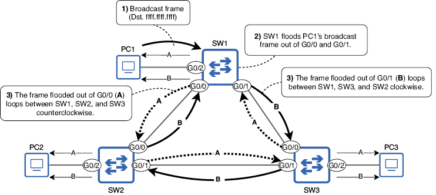{text-align: justify}
/// figura
Un PC1 envía una trama broadcast y SW1 la inunda. Cuando SW2 y SW3 reciben sus copias de la trama, también la inundan, originando dos bucles: uno en sentido antihorario (A) y otro en sentido horario (B). Estas tramas circularán indefinidamente entre SW1, SW2 y SW3.
///

!!!note "Nota"
    Como indican las flechas que apuntan hacia los PCs, SW1, SW2 y SW3 también inundarán las tramas en bucle hacia los hosts finales conectados, pudiendo saturarlos al obligarles a procesarlas repetidamente.

Hay dos problemas principales causados por los bucles de Capa 2. Primero, si se acumulan suficientes tramas en bucle en la red, el resultado es una tormenta de broadcast que consume tantos recursos de red (recursos de CPU de los dispositivos o ancho de banda de los enlaces) que la red deja de ser usable. Los PCs y otros hosts finales conectados a los switches también reciben las mismas tramas repetidamente, lo que puede agotar sus recursos disponibles.

El segundo problema es el MAC address flapping: cuando un switch aprende la misma dirección MAC repetidamente en puertos distintos. Usando el ejemplo anterior, cuando SW1 recibe por primera vez la trama broadcast de PC1, aprende la dirección MAC de PC1 en el puerto G0/2. Sin embargo, cuando llega la trama en bucle A de vuelta por G0/1, vuelve a aprender la dirección MAC de PC1 en ese puerto, y lo mismo ocurre cuando llega la trama en bucle B por G0/0. SW1 actualizará constantemente la entrada de la dirección MAC de PC1 en su tabla de direcciones MAC entre varios puertos, de modo que PC1 será incapaz de recibir tramas; SW1 no sabe qué puerto está realmente conectado PC1.

Un bucle de Capa 2 puede derribar una LAN en cuestión de segundos (según la cantidad de tráfico BUM), por lo que es absolutamente esencial evitarlo. Esa es la función de STP.

## 2 Cómo funciona STP

STP puede resumirse en una frase: evita los bucles de Capa 2 bloqueando conexiones redundantes, dejando un único camino activo entre cualquier par de nodos en una LAN. La figura muestra un ejemplo: el enlace entre SW2 y SW3 queda deshabilitado, evitando que se produzca un bucle de Capa 2.

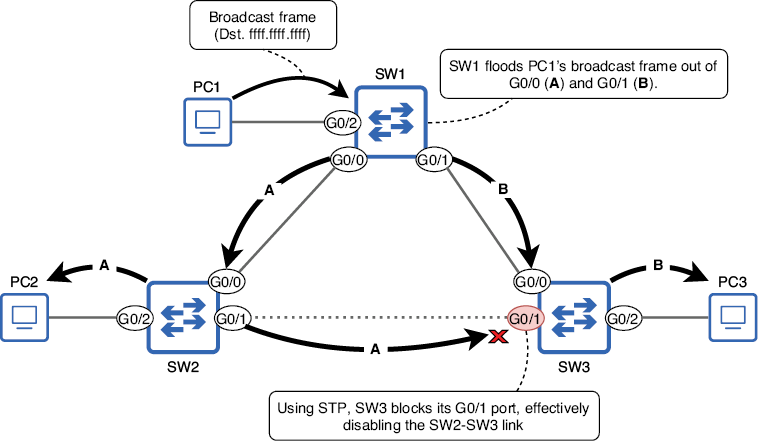{text-align: justify}
/// figura
PC1 envía una trama broadcast y SW1 la inunda. Con STP, SW3 bloquea su puerto G0/1, deshabilitando efectivamente la conexión SW2-SW3; esto evita que se produzca un bucle de Capa 2.
///

Aunque la topología física es la misma que en la figura anterior, gracias a STP ya no hay un bucle de Capa 2. El puerto G0/1 de SW3 está ahora en estado blocking; no reenvía tramas y no procesa las tramas recibidas (excepto los mensajes relacionados con STP). El resto de puertos están en estado forwarding; pueden reenviar y recibir tramas como de costumbre. El enlace SW2 G0/1 a SW3 G0/1 queda sin usar, pero está disponible para hacerse cargo si surge un problema en otro enlace.

!!!note "Nota"
    El término topología se refiere a cómo están dispuestos y conectados los dispositivos en una red. En la figura, SW1, SW2 y SW3 están conectados físicamente en una topología en anillo, formando un círculo. El término topología STP puede utilizarse para referirse al arreglo lógico de switches y sus conexiones como resultado de STP: algunos transportan tráfico activo y otros quedan bloqueados por STP para evitar bucles de Capa 2.

Mientras que la figura anterior mostraba solo tres switches, la figura siguiente muestra una LAN con muchos más switches conectados en malla, una topología de red en la que cada nodo está conectado con cada otro nodo (malla completa) o con tantos otros nodos como sea posible pero no con todos (malla parcial). En una red así existen innumerables bucles de Capa 2. Sin embargo, con STP, los switches bloquearán automáticamente algunos puertos para crear una topología sin bucles. Aunque el tráfico no pasa por los enlaces deshabilitados, permanecen disponibles para hacerse cargo si falla uno de los enlaces activos.

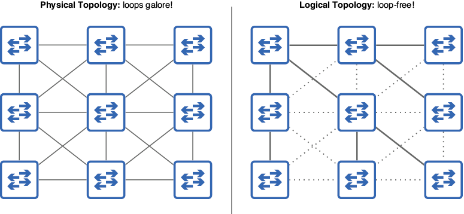{text-align: justify}
/// figura
STP crea una topología sin bucles en una LAN con malla. En la topología física (izquierda), existen innumerables formas de que las tramas circulen por la red. Sin embargo, STP crea una topología lógica (derecha) sin bucles.
///

### ¿Qué es un árbol de expansión?

Un árbol de expansión es un concepto del campo de la teoría de grafos. En teoría de grafos, un grafo es una estructura que modela las relaciones entre objetos (también llamados nodos). Un árbol es un subgrafo en el que cualquier par de nodos están conectados por exactamente un camino, y spanning significa que el árbol incluye todos los nodos; el árbol abarca todos los nodos.

Comparemos esto con una red que usa STP. Cada switch que ejecuta STP es un nodo del grafo, con diversas conexiones físicas entre ellos (la topología física de la figura anterior). STP deshabilita algunas conexiones, dejando solo un camino activo entre cualquier par de nodos; este es el subgrafo: el árbol de expansión (la topología lógica de la figura anterior).

## 3 El algoritmo STP

El proceso que usa STP para crear una topología sin bucles se llama algoritmo STP. Hay tres pasos principales en el algoritmo:

- Elección del puente raíz.
- Selección del puerto raíz.
- Selección del puerto designado.

La figura siguiente muestra un ejemplo de una LAN después de que STP ha creado una topología sin bucles. En esta sección, examinaremos esta LAN y recorreremos el algoritmo STP paso a paso. Tened en cuenta que se diseñó esta LAN para demostrar varios aspectos del algoritmo STP más que para representar una topología LAN realista; las mejores prácticas de arquitectura LAN se cubrirán en el capítulo siguiente del volumen 2.

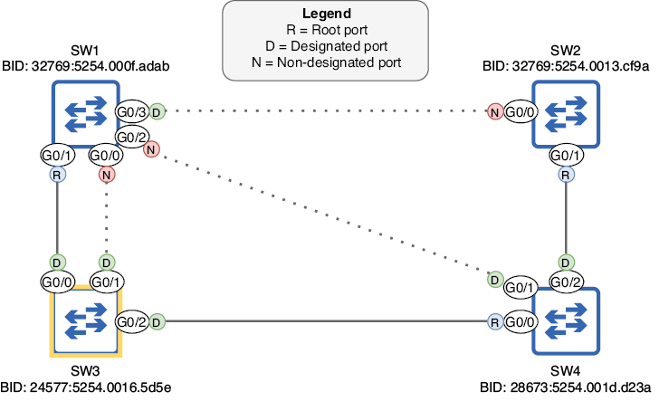{text-align: justify}
/// figura
Una LAN después de que STP ha creado una topología sin bucles. SW3 es el puente raíz y cada otro switch tiene un puerto raíz que conduce a SW3. Los puertos restantes son puertos designados o no designados; los puertos no designados están bloqueados, deshabilitando sus conexiones.
///

### 1 Elección del puente raíz

El primer paso del algoritmo STP es elegir un único switch como puente raíz para la LAN. El puente raíz es el punto central de referencia para la topología STP, y en pasos posteriores todos los demás switches se asegurarán de tener exactamente un camino activo para llegar al puente raíz.

!!!note "Nota"
    STP se desarrolló para usarse con bridges Ethernet, predecesores de los switches. Como resultado, STP usa el término bridge en lugar de switch. Aunque las redes modernas usan switches en lugar de bridges, la terminología original (como root bridge) continúa. En el contexto de STP, bridge y switch pueden considerarse sinónimos.

La elección del puente raíz la llevan a cabo los switches compartiendo mensajes STP Bridge Protocol Data Unit (BPDU) entre sí. De hecho, la información compartida en los BPDUs se usa para tomar todas las decisiones del algoritmo STP, no solo para la elección del puente raíz. Los BPDUs se envían cada 2 segundos y contienen varios elementos relacionados con STP; las dos piezas de información relevantes para la elección del puente raíz son el bridge identifier (BID) del propio switch, un número que identifica al switch dentro de la LAN, y el BID del switch que cree que es el puente raíz.

Cuando un switch arranca por primera vez, aún no conoce el puente raíz de la LAN, así que se declara a sí mismo como puente raíz. La figura siguiente lo demuestra: los cuatro switches han arrancado al mismo tiempo y cada uno envía BPDUs declarándose puente raíz (los campos My BID y Root BID coinciden).

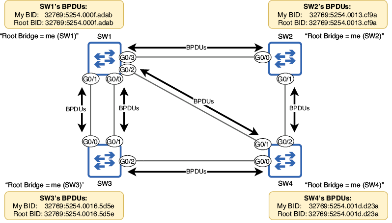{text-align: justify}
/// figura
SW1, SW2, SW3 y SW4 arrancan al mismo tiempo, y cada switch se declara a sí mismo como puente raíz. Los switches envían BPDUs por sus puertos con información como el BID propio y el BID del switch que creen que es el puente raíz (en este caso, ellos mismos).
///

#### El BID

El switch que envíe el BPDU superior será elegido puente raíz de la LAN. El BPDU superior es el que tiene parámetros superiores según el algoritmo STP. Cuando se trata de elegir el puente raíz, eso significa el BPDU con el campo My BID numéricamente más bajo. Antes de determinar cuál de los cuatro switches tiene el BID más bajo, examinemos la estructura del BID, como se muestra en la figura. El BID es un número de 64 bits que consta de un bridge priority de 16 bits y una dirección MAC de 48 bits.

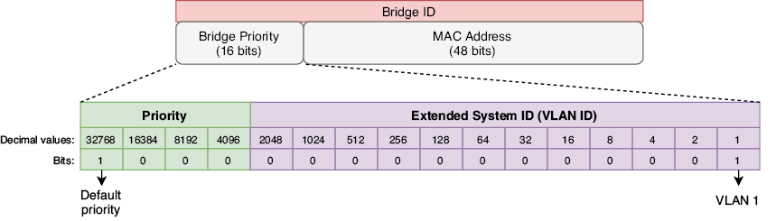{text-align: justify}
/// figura
Contenido del BID STP. Se divide en dos partes: un bridge priority de 16 bits y una dirección MAC de 48 bits. El bridge priority consta, a su vez, de dos partes: un valor de prioridad configurable (predeterminado 32768) y el Extended System ID, que es igual al ID de VLAN en la implementación STP de Cisco.
///

El bridge priority consta de dos partes: la primera es un valor de prioridad configurable. Por defecto, el bit más significativo está establecido en 1, lo que equivale a 32768 decimal. La segunda parte se llama Extended System ID y coincide con el ID de la VLAN; estos dos números se suman para formar el bridge priority (por ejemplo, 32768 + 1 = 32769). Antes de continuar con la elección del puente raíz, profundicemos un poco más en el Extended System ID.

Los switches Cisco ejecutan una versión propietaria de STP llamada Per-VLAN Spanning Tree Plus (PVST+). En PVST+, los switches ejecutan una instancia STP separada para cada VLAN; crean un árbol de expansión distinto para cada VLAN. La ventaja es que distintos enlaces pueden bloquearse en VLAN distintas, dando como resultado tráfico equilibrado por todos los enlaces.

!!!note "Nota"
    Antes de PVST+ existía PVST, que solo admitía encapsulación ISL sobre enlaces trunk. PVST+ admite tanto ISL como 802.1Q, y todos los switches Cisco modernos ejecutan PVST+, no PVST.

Si todas las VLAN comparten la misma instancia STP, los enlaces bloqueados quedan completamente sin usar hasta que falla un enlace activo, lo que puede provocar congestión en los enlaces activos. La figura siguiente muestra cómo puede crearse un árbol de expansión separado para cada VLAN. La LAN tiene dos VLAN (VLAN 1 y VLAN 2), y los switches han bloqueado enlaces distintos en cada VLAN.

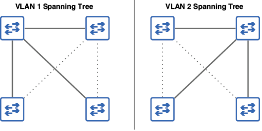{text-align: justify}
/// figura
Los switches de una LAN crean árboles de expansión separados para las VLAN 1 y 2 bloqueando enlaces distintos en cada VLAN, como indican las líneas punteadas. El tráfico de la VLAN 1 usará enlaces distintos del tráfico de la VLAN 2, evitando la congestión de la red.
///

Como el ID de VLAN forma parte del BID, el switch tendrá un bridge priority único para cada instancia STP (para cada VLAN que ejecute STP). Por ejemplo, con la prioridad predeterminada de 32768, el bridge priority total será 32769 (32768 + 1) en la VLAN 1 y 32770 (32768 + 2) en la VLAN 2.

!!!note "Nota"
    Para el resto de este capítulo nos centraremos en una topología de una sola VLAN. No espero preguntas sobre la creación de un árbol de expansión único para cada VLAN en el examen CCNA.

#### ¿Por qué incluir el ID de VLAN en el bridge priority?

El estándar STP (IEEE 802.1D) especifica que cada switch debe tener un BID único. Esto se consigue combinando el bridge priority con la dirección MAC del switch. Aunque todos los switches de la LAN tengan el mismo bridge priority, las direcciones MAC son únicas, por lo que el resultado es un BID único para cada switch.

Sin embargo, los switches Cisco que ejecutan PVST+ ejecutan una instancia STP separada para cada VLAN. Como vimos en el capítulo 12, cada VLAN es como un switch virtual separado, por lo que, para cumplir con el estándar, cada instancia STP que ejecuta el switch debe tener un BID único. Ese es el papel del Extended System ID, que se establece en el ID de VLAN de la instancia STP. Al sumar el ID de VLAN al valor de prioridad, cada instancia STP tendrá un bridge priority único y, por tanto, un BID único.

Por ejemplo, si un switch que ejecuta dos instancias STP (VLAN 1 y VLAN 2) tiene el valor de prioridad predeterminado 32768 y una dirección MAC 5254.000f.adab, el BID resultante sería 32769:5254.000f.adab para la VLAN 1 y 32770:5254.000f.adab para la VLAN 2. Observad que el bridge priority se escribe en decimal, mientras que la dirección MAC se escribe en hexadecimal (como es habitual), y a menudo se separan con dos puntos, como en 32769:5254.000f.adab.

#### Comparación de BIDs

Ahora que ya hemos visto el bridge priority (prioridad + ID de VLAN), ¿qué es la dirección MAC que forma la segunda parte del BID? No es la MAC de ninguno de los puertos del switch; es más bien una dirección MAC separada que identifica al switch como un todo. En esta sección compararemos BIDs y veremos cómo se usa la dirección MAC como desempate. A continuación se muestran los BIDs de los cuatro switches de la figura:

- SW1: 32769:5254.000f.adab
- SW2: 32769:5254.0013.cf9a
- SW3: 32769:5254.0016.5d5e
- SW4: 32769:5254.001d.d23a

¿Cuál de estos BIDs es numéricamente menor y, por tanto, superior? Para compararlos, primero comparad los bridge priorities. En este caso, los cuatro switches tienen el mismo bridge priority de 32769, así que tenemos que comparar las direcciones MAC para desempatar.

!!!note "Nota"
    Aunque dividamos el BID en varias partes, recordad que es simplemente un número de 64 bits. Los bits escritos a la izquierda (los que forman el bridge priority) son los más significativos, por eso deben compararse primero al determinar qué BID es numéricamente menor.

Cuando comparéis direcciones MAC, recordad que son simplemente números escritos en formato hexadecimal, y compararlos es el mismo proceso que seguiríais con números decimales. Por ejemplo, al comparar los números decimales 1999 y 9111, ¿cómo sabéis que el segundo es mayor si solo tiene un 9, mientras que el primero tiene tres? La razón es que el 9 de 9111 es el dígito más significativo; el único 9 de 9111 tiene un valor mayor (9000) que todos los demás dígitos de 1999 combinados. Solo viendo que el dígito más significativo de 9111 es mayor que el de 1999, podéis declarar que 9111 es mayor que 1999; no hace falta comparar los otros tres dígitos.

Lo mismo se aplica a la hora de hallar el mayor (o menor, en este caso) de dos o más direcciones MAC: comparad primero los dígitos más significativos. Los primeros seis dígitos de las cuatro direcciones MAC (OUI) son iguales: 5254.00. A continuación, el siguiente dígito es 1 en SW2, SW3 y SW4, pero 0 en SW1; por tanto, SW1 tiene el BID más bajo de los cuatro: ¡es el puente raíz! Podemos confirmarlo con el comando `show spanning-tree` en SW1, como en el ejemplo siguiente:

``` 
SW1#
show spanning-tree 
VLAN0001
  Spanning tree enabled protocol ieee
  Root ID    Priority    32769
             Address     5254.000f.adab
             This bridge is the root
. . .
  Bridge ID  Priority    32769  (priority 32768 sys-id-ext 1)
             Address     5254.000f.adab
. . .
```

#### Configuración de la prioridad del bridge

Como acabamos de confirmar, SW1 es el puente raíz de la LAN porque tiene la dirección MAC más baja. Sin embargo, es posible configurar la prioridad del bridge para cambiar qué switch será el puente raíz. Esto suele ser deseable porque el puente raíz desempeña un papel muy importante: sirve como punto de referencia central para el árbol de expansión y los demás switches se asegurarán de que el camino más eficiente para llegar al puente raíz esté habilitado. Si un switch está conectado al router que usan los hosts finales para acceder a redes externas, es buena idea que sea el puente raíz; debe existir un camino eficiente para llegar al router sin que las tramas tengan que pasar por demasiados switches.

Siguiendo el ejemplo de la figura anterior, configuremos SW3 como puente raíz y reduzcamos la prioridad de SW4 para que funcione como puente raíz secundario, el bridge que tomará el relevo si falla el puente raíz (porque tiene el BID más bajo de los switches restantes). El comando para configurar la prioridad del root es `spanning-tree vlan vlan-id priority priority-value`. En el ejemplo siguiente, intento establecer la prioridad de SW3 en 20000, pero aparece un mensaje de error:

``` 
SW3(config)# spanning-tree vlan 1 priority 20000
% Bridge Priority must be in increments of 4096.
% Allowed values are:
  0     4096  8192  12288 16384 20480 24576 28672
  32768 36864 40960 45056 49152 53248 57344 61440
```

Como indica el mensaje de error, la prioridad solo puede configurarse en incrementos de 4096. La razón es que, aunque el campo bridge priority en conjunto tiene 16 bits de longitud, solo los cuatro bits más significativos forman el valor de prioridad configurable: los bits con valores 32768, 16384, 8192 y 4096. Los 12 bits menos significativos quedan fijados como ID de VLAN (VLAN 1 en nuestros ejemplos). Por eso la prioridad del bridge debe configurarse en incrementos de 4096: es el valor del bit menos significativo que podemos cambiar. En el ejemplo siguiente, configuro la prioridad de SW3 como 24576 y la de SW4 como 28672 y luego la confirmo con `show spanning-tree` en SW4:

``` 
SW3(config)# spanning-tree vlan 1 priority 24576

SW4(config)# spanning-tree vlan 1 priority 28672
SW4(config)# do show spanning-tree
VLAN0001
  Spanning tree enabled protocol ieee
  Root ID    Priority    24577
             Address     5254.0016.5d5e
. . .
  Bridge ID  Priority    28673  (priority 28672 sys-id-ext 1)
             Address     5254.001d.d23a
. . .
```

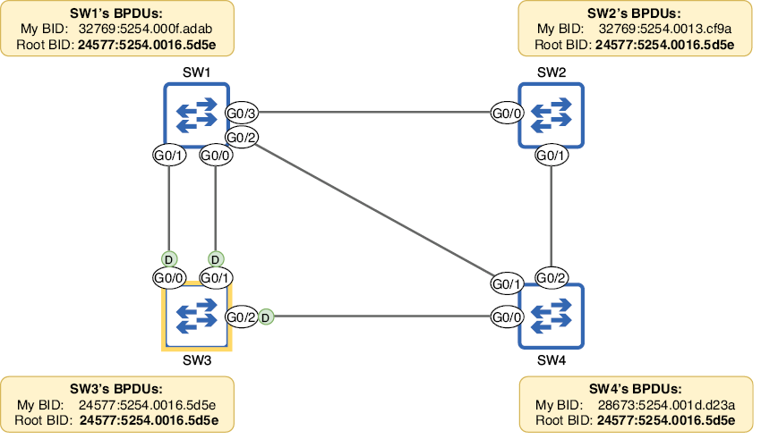{text-align: justify}
/// figura
Resultado después de configurar la prioridad de los bridges SW3 y SW4. Los cuatro switches coinciden en que SW3 es el puente raíz, porque tiene el BID más bajo. Todos los puertos del puente raíz son puertos designados (indicados con D). Si SW3 falla y se realiza una nueva elección, SW4 se convertirá en el nuevo puente raíz porque tiene el segundo BID más bajo.
///

!!!note "Nota"
    Todos los puertos del puente raíz son puertos designados, lo que significa que están en estado forwarding (no en estado blocking). Examinaremos los puertos designados con más detalle en la siguiente sección.

Existe otro método para configurar la prioridad del bridge que debes conocer para el examen CCNA: el comando `spanning-tree vlan vlan-id root { primary | secondary }`. La palabra clave secondary es sencilla: establece la prioridad en 28672 (un incremento de 4096 por debajo del valor predeterminado 32768). La palabra clave primary funciona así:

- Establece la prioridad en 24576 (dos incrementos de 4096 por debajo del valor predeterminado).
- O, si 24576 no es suficiente para que el switch se convierta en puente raíz (es decir, la prioridad del puente raíz actual es 24576), establece la prioridad al múltiplo más alto de 4096 que permita que el switch se convierta en puente raíz.

Estos comandos cumplirán su propósito si todos los demás switches de la LAN tienen la prioridad predeterminada de 32768; el switch configurado con la palabra clave primary será el puente raíz y el configurado con secondary estará a continuación si falla el puente raíz.

Sin embargo, no se recomienda usar estos comandos. Hay varias razones: en primer lugar, no hay garantía de que configurar este comando con `secondary` haga que el switch sea el siguiente en la fila para convertirse en puente raíz si falla el actual; podría haber otro switch no raíz con una prioridad inferior a 28672. Del mismo modo, pueden producirse situaciones en las que este comando con `primary` falle: no puede establecer la prioridad del switch en 0. El ejemplo siguiente muestra qué sucede cuando el puente raíz actual (SW1) tiene una prioridad de 4096 y usas este comando con `primary` en otro switch (SW2):

``` 
SW1(config)# spanning-tree vlan 1 priority 4096

SW2(config)# spanning-tree vlan 1 root primary
% Failed to make the bridge root for vlan 1
% It may be possible to make the bridge root by setting the priority
% for some (or all) of these instances to zero.
```

!!!note "Nota"
    La mejor forma de asegurar que un switch será el puente raíz es usar el comando `spanning-tree vlan vlan-id priority 0`. Entonces, la única forma de arrebatarle el rol de raíz sería usar el mismo comando en otro switch que tenga una dirección MAC más baja y, por tanto, un BID más bajo. Recordad este punto para el examen.

## 4 Selección del puerto raíz

Después de elegir el puente raíz, cada switch no raíz seleccionará uno de sus puertos como puerto raíz: el puerto con la mejor ruta hacia el puente raíz. El switch calcula esto en función de la información en los BPDUs que recibe de sus vecinos. El puerto raíz se selecciona usando varios parámetros: el coste raíz (que mide la proximidad del puerto al puente raíz), el BID del vecino y el ID del puerto del vecino, en ese orden de prioridad:

- Menor coste raíz.
- Menor BID del vecino.
- Menor ID del puerto del vecino.

El coste raíz es un valor que indica cuán eficiente es la ruta hacia el puente raíz a través de ese puerto; cuanto menor es, mejor. Cada puerto tiene asociado un coste determinado, como se muestra en la tabla siguiente.

| Velocidad | Coste |
|---|---:|
| 10 Mbps | 100 |
| 100 Mbps | 19 |
| 1 Gbps | 4 |
| 10 Gbps | 2 |

El coste raíz de un puerto es el coste total de los puertos que llevan hacia el puente raíz (no solo el coste del puerto individual), y el puerto con menor coste raíz será el puerto raíz. Si hay varios puertos en el switch con el mismo coste raíz, el puerto conectado al vecino con el BID más bajo será el puerto raíz. Si dos o más puertos tienen el mismo coste raíz y están conectados al mismo vecino, el puerto conectado al puerto del vecino con el ID más bajo será el puerto raíz. La figura siguiente muestra qué puerto selecciona cada switch no raíz como puerto raíz y cómo llega a esa decisión. En el resto de esta sección, analizaremos la decisión de cada switch paso a paso.

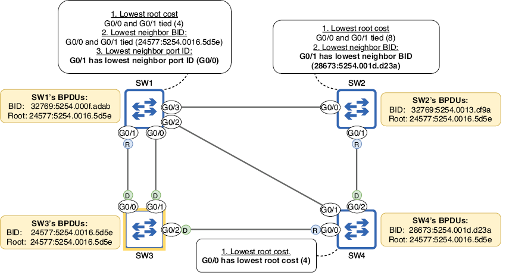{text-align: justify}
/// figura
Los switches no raíz seleccionan un puerto raíz. SW4 elige G0/0 porque tiene el menor coste raíz de sus puertos. SW2 G0/0 y G0/1 tienen el mismo coste raíz, por lo que SW2 elige G0/1 porque tiene el BID del vecino más bajo. SW1 G0/0 y G0/1 tienen el mismo coste raíz y el mismo BID del vecino, por lo que SW1 elige G0/1 porque tiene el menor ID del puerto del vecino.
///

### Coste raíz más bajo

Como ya se ha mencionado varias veces, las decisiones que forman parte del algoritmo STP se basan en la información de los BPDUs que los switches intercambian. Una vez que se ha decidido el puente raíz, es el único switch que genera BPDUs nuevos; los demás switches reciben esos BPDUs y los reenvían a sus vecinos, actualizando cierta información en ellos. Una de las piezas de información del BPDU es el coste raíz. Los BPDUs enviados por el puente raíz tienen un coste de 0 (el coste del puente raíz para alcanzarse a sí mismo es 0). Cuando los switches no raíz reenvían esos BPDUs, suman el coste del puerto por el que los recibieron.

La figura siguiente muestra cómo los switches anuncian su coste raíz entre sí y la lógica que sigue cada switch para elegir su puerto raíz. Solo SW4 puede hacerlo en este punto. SW3 (el puente raíz) envía BPDUs con un coste raíz de 0. Cuando SW1 y SW4 reenvían esos BPDUs, suman el coste de los puertos por los que los recibieron; en este caso, todos los puertos son de GigabitEthernet, así que tienen un coste de 4. Cuando SW2 reenvía los BPDUs que recibe de SW1 y SW4, suma el coste de sus propios puertos (4) al coste de los BPDUs recibidos (4); anuncia un coste de 8.

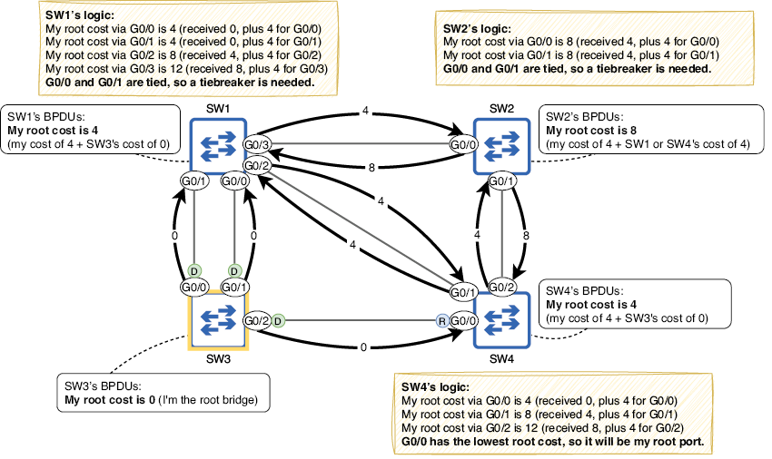{text-align: justify}
/// figura
Los switches anuncian su coste raíz entre sí en los BPDUs. SW3 (el puente raíz) anuncia un coste raíz de 0, SW1 y SW4 anuncian un coste raíz de 4 y SW2 anuncia un coste raíz de 8. SW4 selecciona G0/0 como puerto raíz porque tiene el menor coste raíz de sus tres puertos. SW1 y SW2 no pueden seleccionar todavía un puerto raíz basándose solo en el coste raíz; hace falta un desempate.
///

Aunque SW4 puede determinar su puerto raíz basándose solo en el coste raíz, SW1 y SW2 no; SW1 tiene un coste raíz de 4 por sus puertos G0/0 y G0/1, y SW2 tiene un coste raíz de 8 por ambos puertos G0/0 y G0/1. Para que SW1 y SW2 seleccionen sus puertos raíz, deben pasar al siguiente paso del proceso de selección: el BID del vecino más bajo.

### BID del vecino más bajo

Cuando un switch envía BPDUs, una de las piezas de información que incluye es su propio BID. Esto puede servir luego al switch receptor como desempate al decidir su puerto raíz. El puerto conectado al vecino con el BID más bajo será el puerto raíz del switch. La figura siguiente muestra cómo SW1 y SW2 comparan los BIDs de sus vecinos para decidir sus puertos raíz; SW2 puede seleccionar G0/1, pero SW1 aún no puede elegir un puerto raíz.

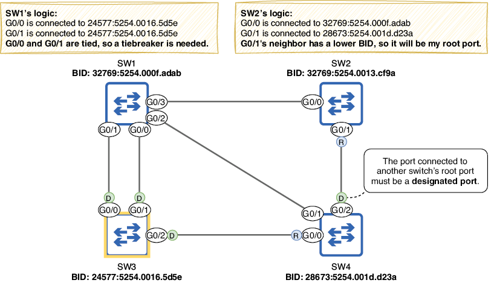{text-align: justify}
/// figura
SW1 compara el BID del vecino de sus puertos G0/0 y G0/1, y SW2 compara el BID del vecino de sus puertos G0/0 y G0/1. El vecino de SW2 G0/1 (SW4) tiene un BID más bajo que el vecino de SW2 G0/0 (SW1), por lo que SW2 selecciona G0/1 como puerto raíz. Los puertos G0/0 y G0/1 de SW1 están conectados ambos a SW3, por lo que ambos tienen el mismo BID del vecino; SW1 todavía no puede seleccionar un puerto raíz.
///

!!!note "Nota"
    El puerto conectado al puerto raíz de otro switch debe ser un puerto designado (forwarding). El puerto raíz proporciona el único camino del switch al puente raíz, así que su vecino no debe bloquear el enlace.

### ID del puerto del vecino más bajo

Otra parte de la información incluida en un BPDU STP es el ID del puerto que envió el BPDU. Se usa como desempate final al seleccionar el puerto raíz. Es importante enfatizar que, al usar el ID del puerto como desempate, son los IDs de los puertos del vecino los que cuentan, no el ID del puerto del switch local. Al decidir el puerto raíz de SW1, tenemos que comparar los IDs de los puertos de SW3 conectados a SW1.

El ID del puerto es un identificador único para cada puerto del switch; como el BID, consiste en un valor de prioridad configurable (128 por defecto) y un número secuencial (1 para el primer puerto, 2 para el segundo, etc.). En el siguiente ejemplo, uso `show spanning-tree` en SW3 para comprobar los IDs de sus puertos G0/0 y G0/1 (en la columna Prio.Nbr):

``` 
SW3#
show spanning-tree
. . .
Interface           Role Sts Cost      Prio.Nbr Type
------------------- ---- --- --------- -------- --------------------------------
Gi0/0               Desg FWD 4         128.1    P2p
Gi0/1               Desg FWD 4         128.2    P2p
Gi0/2               Desg FWD 4         128.3    P2p
```

!!!note "Nota"
    Para influir en la selección del puerto raíz, puedes configurar el valor de prioridad del puerto (la primera parte del ID del puerto) con el comando `spanning-tree vlan vlan-id port-priority priority-value` en el modo de configuración de interfaz. Sin embargo, no esperaría preguntas sobre esto en el examen CCNA. En general, basta con comparar los nombres de los puertos para decidir cuál tiene un ID de puerto menor. G0/0 es menor que G0/1 (0 es menor que 1), por lo que tiene un ID de puerto inferior.

La figura siguiente muestra cómo SW1 selecciona su puerto raíz. SW1 G0/0 está conectado a SW3 G0/1 (ID de puerto 128.2), y SW1 G0/1 está conectado a SW3 G0/0 (ID de puerto 128.1). Como el ID del puerto vecino de G0/1 es menor, SW1 selecciona G0/1 como puerto raíz.

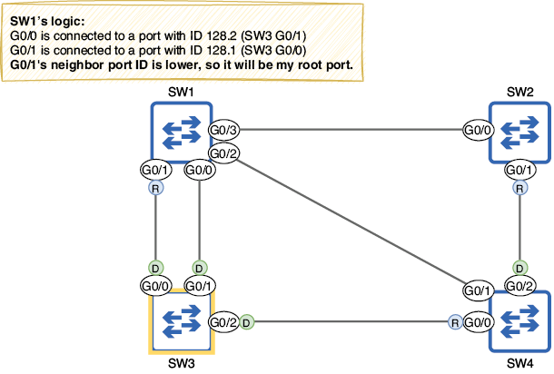{text-align: justify}
/// figura
SW1 compara los ID de puerto vecinos de sus puertos G0/0 y G0/1. G0/1 está conectado a un ID de puerto menor (SW3 G0/0, ID 128.1) que G0/0 (SW3 G0/1, ID 128.2), por lo que G0/1 selecciona G0/1 como puerto raíz.
///

!!!note "Nota"
    Recuerda que compares los IDs del vecino, no los IDs del puerto local del switch; ese es un posible truco del examen.

## 5 Selección del puerto designado

Ahora que cada switch no raíz ha seleccionado un puerto raíz, el último paso es seleccionar puertos designados. Mientras que un puerto raíz es un puerto en estado forwarding que apunta hacia el puente raíz, un puerto designado es un puerto en estado forwarding que apunta alejándose del puente raíz. Por eso todos los puertos del puente raíz son puertos designados: todos apuntan alejándose del puente raíz.

Debe haber exactamente un puerto designado por cada segmento de la LAN. El significado exacto del término segmento puede variar, pero en este caso un segmento es un enlace entre switches. Los puertos designados se seleccionan usando los siguientes parámetros (en orden de prioridad):

- El puerto del switch con el coste raíz más bajo se convierte en designado.
- El puerto del switch con el BID más bajo se convierte en designado.

### ¿Qué es un segmento?

Un segmento es una división de una red, cuya extensión depende del contexto. Un segmento de Capa 1 puede definirse como una conexión eléctrica entre dispositivos y equivale a un dominio de colisión; este es el significado de segmento usado en este capítulo. Dos switches conectados son otro ejemplo de segmento de Capa 1. Otro ejemplo es un grupo de dispositivos conectados a un hub Ethernet; una señal eléctrica enviada por un dispositivo es recibida por todos los demás conectados al hub.

Un segmento de Capa 2 es equivalente a una LAN o dominio de broadcast: un grupo de dispositivos que puede enviar tramas directamente entre sí. Si una LAN física se divide en varias VLANs, cada VLAN es su propio segmento de Capa 2. Un segmento de Capa 3 es equivalente a una subred. Como ya mencioné en el capítulo 12 (VLANs), los segmentos de Capa 2 y Capa 3 suelen tener una relación uno a uno (una subred por VLAN), pero es posible que una sola VLAN incluya varias subredes.

Al elegir el puente raíz y seleccionar el puerto raíz de cada switch, ya pudimos identificar algunos puertos designados en la LAN: todos los puertos del puente raíz son designados, y todos los conectados a un puerto raíz también lo son. Para cada segmento restante debe haber un puerto designado, y los otros puertos deben ser no designados. Los puertos no designados están en estado blocking; así es como STP evita los bucles.

Primero, SW1 G0/0 está conectado a SW3 G0/1 (un puerto designado) y, por tanto, es un puerto no designado; no puede haber más de un puerto designado por segmento. Esto deja dos segmentos restantes: el enlace SW1 G0/2 a SW4 G0/1 y el enlace SW1 G0/3 a SW2 G0/0. La figura siguiente muestra qué puertos serán designados y no designados, y cómo se tomaron esas decisiones. En el resto de esta sección, recorreremos el proceso paso a paso.

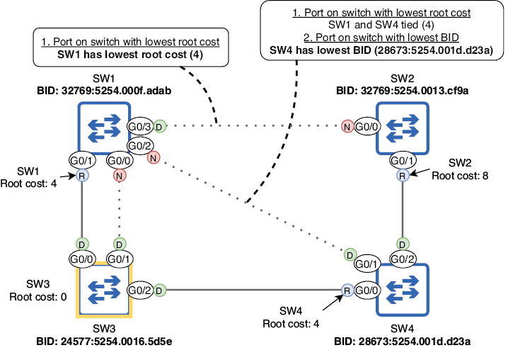{text-align: justify}
/// figura
Cada segmento debe tener exactamente un puerto designado. Todos los puertos del puente raíz son designados, y también los conectados a un puerto raíz. Se selecciona un puerto designado en cada segmento restante y el resto son no designados.
///

### Puerto del switch con el coste raíz más bajo

El primer parámetro usado para decidir qué lado de los enlaces restantes se vuelve designado es el coste raíz: el puerto del switch con el menor coste raíz se vuelve designado, y el otro puerto pasa a ser no designado. Prestad atención a la redacción: es “el puerto del switch con el menor coste raíz se vuelve designado”, no “el puerto con el menor coste raíz se vuelve designado”. Estamos comparando el coste raíz de cada switch a través de su puerto raíz, no el coste de cada puerto cuyo rol se está decidiendo.

La figura siguiente muestra cómo los switches comparan sus costes raíz para decidir qué puerto se convierte en designado. El coste raíz de SW1 (4) es menor que el de SW2 (8), así que el puerto de SW1 se convierte en designado y el de SW2 en no designado. SW1 y SW4 tienen el mismo coste raíz (4) y, por tanto, tendrán que usar un desempate para decidir qué puerto se vuelve designado.

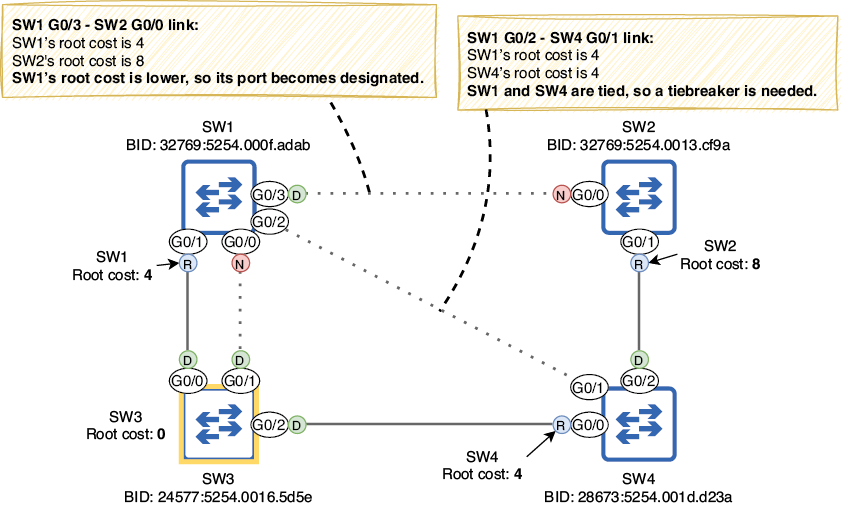{text-align: justify}
/// figura
Los switches comparan sus costes raíz para seleccionar puertos designados. El coste raíz de SW1 (4) es menor que el de SW2 (8), por lo que SW1 G0/3 se convierte en designado y SW2 G0/0 en no designado. SW1 y SW4 tienen el mismo coste raíz (4), así que hace falta un desempate para decidir qué puerto será designado.
///

### Puerto del switch con el BID más bajo

Como desempate para decidir qué puerto se vuelve designado, los switches compararán sus BIDs; el puerto del switch con el BID más bajo se convertirá en designado y el puerto del otro switch será no designado. La figura siguiente muestra cómo SW1 y SW4 comparan BIDs para decidir qué puerto del switch se convierte en designado; el BID de SW4 es menor que el de SW1, así que SW4 G0/1 se convierte en designado y SW1 G0/2 en no designado.

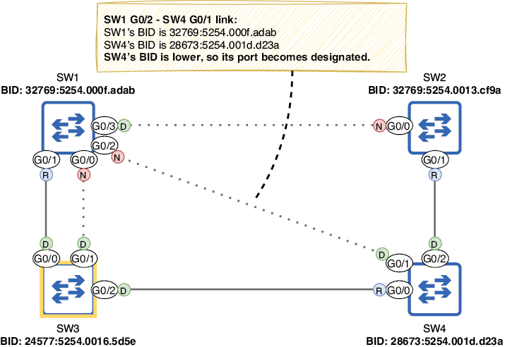{text-align: justify}
/// figura
Los switches comparan sus BIDs como desempate al seleccionar puertos designados. El BID de SW4 (28673:5254.001d.d23a) es menor que el de SW1 (32769:5254.000f.adab), por lo que SW4 G0/1 se vuelve designado y SW1 G0/2 se vuelve no designado.
///

Todos los roles de puerto ya han quedado decididos: raíz, designado y no designado. Observad que los BPDUs solo se envían desde puertos designados. Cuando un switch arranca, cree que es el puente raíz, por lo que todos sus puertos son designados; el switch envía BPDUs por todos ellos. Sin embargo, si luego se convierte en un switch no raíz y algunos de sus puertos pasan a otros roles (raíz o no designado), el switch ya no envía BPDUs por esos puertos. Los BPDUs se originan en el puente raíz y se reenvían por toda la LAN solo a través de puertos designados. Para resumir esta sección, aquí tenéis un resumen del algoritmo STP:

- Elección del puente raíz (uno por LAN): menor BID.
- Selección del puerto raíz (uno por switch, excluyendo el puente raíz): menor coste raíz, menor BID del vecino, menor ID del puerto del vecino.
- Selección del puerto designado (uno por segmento): puerto del switch con menor coste raíz, puerto del switch con menor BID.

## 6 Estados y temporizadores de los puertos STP

En la sección anterior cubrimos los puertos raíz, designados y no designados; estos son los roles de puerto STP. Además de los tres roles, existen varios estados de puerto. Ya mencioné dos de ellos: el estado forwarding y el estado blocking.

En el estado forwarding, el puerto está activo y puede reenviar y recibir tramas. En una LAN estable, los puertos raíz y designados deben estar en estado forwarding. En el estado blocking, el puerto está deshabilitado y no puede reenviar ni recibir tramas; los puertos no designados deberían estar en estado blocking. Sin embargo, hay otros estados transitorios por los que pasa un puerto durante la preparación para reenviar tramas, así como temporizadores que regulan cuánto tiempo permanece cada puerto en cada estado.

### 1 Estados de los puertos STP

Hay cuatro estados principales de puertos STP: blocking, listening, learning y forwarding. También se puede hablar de un quinto estado: disabled. Este se refiere a un puerto que no está operativo, por ejemplo, si está deshabilitado con el comando `shutdown` o si no está conectado a otro dispositivo; STP no está activo en ese puerto, por lo que normalmente no se incluye como estado STP. La tabla siguiente resume los cuatro estados principales que vamos a estudiar en esta sección.

| Estado | Reenvía tramas? | Aprende direcciones MAC? | Estable o transitorio? |
|---|---|---|---|
| Blocking (BLK) | No | No | Estable |
| Listening (LIS) | No | No | Transitorio |
| Learning (LRN) | No | Sí | Transitorio |
| Forwarding (FWD) | Sí | Sí | Estable |

Cuando un puerto se activa por primera vez (por ejemplo, cuando se conecta a otro dispositivo), entra en el estado listening. En este estado, el puerto solo puede enviar y recibir BPDUs; no reenvía tramas normales y el switch no aprende direcciones MAC si llegan tramas por ese puerto. El objetivo de este estado es decidir qué va a pasar con el puerto; el switch decide si será un puerto raíz, designado o no designado. El estado listening es transitorio; el puerto debe permanecer en ese estado durante un máximo de 15 segundos (veremos por qué 15 segundos es el máximo en la siguiente sección). En el ejemplo siguiente, deshabilito el puerto G0/1 de SW2, lo vuelvo a habilitar y confirmo su estado con `show spanning-tree`; en la columna Sts, LIS indica el estado listening:

``` 
SW2(config)#
interface g0/1
SW2(config-if)# shutdown
SW2(config-if)# no shutdown
SW2(config-if)# do show spanning-tree
. . .
Interface           Role Sts Cost      Prio.Nbr Type
------------------- ---- --- --------- -------- --------------------------------
Gi0/0               Altn BLK 4         128.1    P2p
Gi0/1               Root LIS 4         128.2    P2p
```

!!!note "Nota"
    En la salida anterior, G0/0 tiene el rol Altn, que significa alternate; equivale al rol no designado. Alternate es un rol de puerto introducido en Rapid STP, que veremos en el capítulo siguiente; ahora mismo el término se usa aunque el switch ejecute STP estándar.

Si se decide en el estado listening que el puerto será no designado, pasará inmediatamente al estado blocking. En ese estado, el puerto está efectivamente deshabilitado; no reenvía tramas. Su única función es escuchar BPDUs y reaccionar si hay un cambio en la red. Observad que su estado seguirá apareciendo como `up/up` en la salida de `show ip interface brief`; el puerto sigue operativo y preparado para volver al estado listening si hay un cambio en la red. Sin embargo, en la salida de `show spanning-tree`, su estado será BLK (como en el ejemplo anterior).

Si en el estado listening se decide que el puerto será raíz o designado, tras 15 segundos pasará al estado learning. Este es similar al estado listening, con una diferencia: comenzará a aprender direcciones MAC cuando reciba tramas. La finalidad de este estado es preparar el puerto para comenzar a reenviar tráfico; como el estado listening, también es transitorio.

!!!note "Nota"
    Un puerto en estado learning sigue escuchando BPDUs. Si detecta un cambio en la red y cambia de rol para convertirse en no designado, pasará inmediatamente al estado blocking.

Tras estar en el estado learning durante 15 segundos, un puerto raíz o designado finalmente pasará al estado forwarding, un puerto de switch totalmente operativo capaz de reenviar tráfico. La figura siguiente muestra cómo un puerto pasa por los cuatro estados.

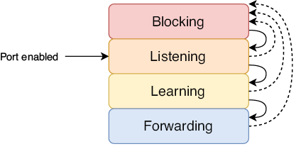{text-align: justify}
/// figura
Cómo pasa un puerto de switch por los estados STP. Un puerto recién habilitado comienza en listening y luego pasa al blocking o al learning y, finalmente, al forwarding. Un puerto en cualquier estado puede pasar inmediatamente a blocking, pero para pasar a forwarding debe pasar antes por listening y learning.
///

Cuando todos los switches de la red han decidido los roles de sus puertos y todos están en estado blocking o forwarding, STP ha convergido; la LAN es estable. Si hay cambios en la red (por ejemplo, fallos de puertos, puertos deshabilitados, nuevos switches añadidos, etc.), los switches usarán STP para recalcular la topología y la red volverá a converger en una nueva topología estable.

### 2 Temporizadores STP

Hay tres temporizadores que regulan el funcionamiento de STP, como se resume en la tabla siguiente.

| Temporizador | Finalidad | Duración |
|---|---|---:|
| Hello | Frecuencia con la que se envían BPDUs | 2 segundos |
| Forward delay | Longitud de los estados listening y learning | 15 segundos por estado |
| Max age | Tiempo que un switch espera para cambiar la topología STP tras dejar de recibir BPDUs en un puerto | 20 segundos |

El temporizador hello es simple: determina la frecuencia con la que se envían BPDUs. Por defecto es 2 segundos, lo que significa que los BPDUs se envían cada 2 segundos. El temporizador hello del puente raíz dicta la frecuencia con la que se envían BPDUs en la LAN; todos los BPDUs se originan en el puente raíz y luego son reenviados por los demás switches por sus puertos designados. Esto también se aplica a los otros temporizadores: los temporizadores del puente raíz son los que usan todos los switches de la LAN.

!!!note "Nota"
    El temporizador hello (y también el resto) puede modificarse, pero es poco frecuente y queda fuera del alcance del examen CCNA.

El temporizador forward delay determina la duración de los estados listening y learning. Por defecto es 15 segundos; el estado listening dura 15 segundos y el estado learning también 15 segundos. Esto significa que un puerto recién habilitado tardará un total de 30 segundos en poder reenviar tramas (excepto BPDUs).

En una LAN con conexiones redundantes, es muy importante que no aparezcan bucles; un bucle puede derribar una LAN en cuestión de segundos, por lo que cada puerto de switch pasa un tiempo determinado en cada estado antes de pasar a otro. Esto permite que el switch esté absolutamente seguro de que no provocará un bucle al pasar un puerto al estado forwarding.

El último temporizador es el max age; determina cuánto tiempo esperará un switch para cambiar la topología STP tras dejar de recibir BPDUs en un puerto. Por defecto, el temporizador max age es 20 segundos; con el temporizador hello predeterminado de 2 segundos, esto significa que un puerto puede perder 10 BPDUs antes de que el switch decida recalcular la topología STP (es decir, elegir un nuevo puente raíz, recalcular los roles de puerto, etc.).

Esto significa que STP puede tardar hasta 50 segundos en pasar un puerto en blocking al estado forwarding: 20 segundos del temporizador max age, 15 segundos del estado listening y 15 segundos del estado learning. La figura siguiente muestra un ejemplo de cómo esto puede causar un problema: una avería de hardware (quizá en el puerto G0/0 de SW3) hace que SW1 deje de recibir BPDUs en G0/1, pero pasan 50 segundos antes de que SW1 G0/0 pueda hacerse cargo como puerto raíz y comenzar a reenviar tráfico.

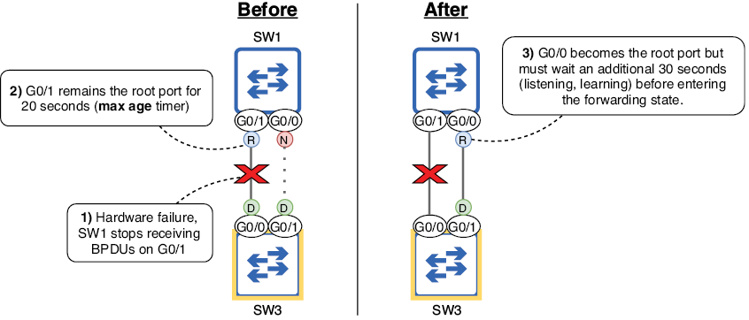{text-align: justify}
/// figura
Los temporizadores STP hacen que SW1 no pueda reenviar tráfico durante 50 segundos. (1) Una avería de hardware impide que SW1 reciba BPDUs por G0/1. (2) G0/1 sigue siendo el puerto raíz durante 20 segundos. (3) G0/0 se convierte en el nuevo puerto raíz pero debe esperar otros 30 segundos antes de entrar en estado forwarding.
///

!!!note "Nota"
    Si la avería de hardware hace que el puerto G0/1 de SW1 quede totalmente no operativo (estado down/down), SW1 reaccionará de inmediato: no hace falta esperar al temporizador max age. Sin embargo, el nuevo puerto raíz de SW1 (G0/0) seguirá teniendo que pasar por los estados listening y learning, lo que provocará 30 segundos de tiempo de inactividad.

Aunque los temporizadores de STP pueden ser lentos, lo hacen por una buena razón: para asegurarse de que un puerto no empieza a reenviar antes de tiempo y provoca un bucle de Capa 2. Sin embargo, existen varias funciones que mejoran la velocidad de STP, y cubriremos una en la siguiente sección, que trata de PortFast y BPDU Guard. Además, veremos Rapid STP, una evolución de STP que reduce mucho el tiempo necesario para la convergencia.

## 7 PortFast y BPDU Guard

Los switches Cisco incluyen un conjunto de funciones opcionales de STP (a veces llamadas STP toolkit) que aceleran la convergencia del STP y mejoran la estabilidad. Para el examen CCNA, debes conocer algunas de estas funciones opcionales de STP. En esta sección cubriremos dos: PortFast y BPDU Guard.

Hasta ahora nos hemos centrado en conexiones entre switches, pero STP está activo en todos los puertos del switch, no solo en los conectados a otros switches. Los puertos de switch conectados a dispositivos que no usan STP (como PCs) serán siempre puertos designados; no existe riesgo de bucle de Capa 2. Sin embargo, debido al funcionamiento basado en temporizadores de STP, tardará 30 segundos desde la conexión del dispositivo en que realmente pueda acceder a la red, es decir, antes de que el puerto del switch entre en estado forwarding. Esto puede resultar frustrante para los usuarios que desconocen STP y, en cualquier caso, es un inconveniente.

### 1 PortFast

PortFast es una función opcional de STP que permite que un puerto del switch pase inmediatamente a estado forwarding, evitando los estados listening y learning. La figura siguiente muestra cómo PortFast permite que un dispositivo conectado tenga acceso inmediato a la red.

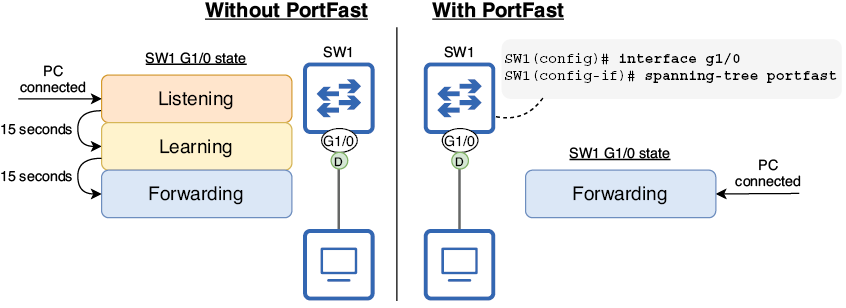{text-align: justify}
/// figura
PortFast permite que un puerto de switch pase inmediatamente a estado forwarding. Sin PortFast, cuando se conecta un host final a un puerto del switch, debe esperar 30 segundos antes de poder acceder a la red. Con PortFast, el host final puede acceder a la red de inmediato, evitando los estados listening y learning.
///

Para habilitar PortFast en un puerto concreto, se usa el comando `spanning-tree portfast` en el modo de configuración de interfaz. Otra opción es usar el comando `spanning-tree portfast default` en el modo de configuración global para habilitar PortFast en todos los puertos de acceso (no en los trunk). Como muestra el ejemplo siguiente, el switch muestra una advertencia extensa tras configurar PortFast:

``` 
SW1(config)#
interface g1/0
SW1(config-if)# spanning-tree portfast
%Warning: portfast should only be enabled on ports connected to a single
 host. Connecting hubs, concentrators, switches, bridges, etc... to this
 interface when portfast is enabled, can cause temporary bridging loops.
 Use with CAUTION
%Portfast has been configured on GigabitEthernet1/0 but will only
 have effect when the interface is in a non-trunking mode.
```

Como PortFast coloca los puertos del switch en estado forwarding inmediatamente, evitando los estados listening y learning, es importante habilitarlo solo en puertos destinados a hosts finales. No conectéis switches a puertos con PortFast habilitado; de lo contrario, pueden producirse bucles de Capa 2, como indica el mensaje de advertencia del ejemplo anterior.

### 2 BPDU Guard

BPDU Guard es otra función opcional de STP que deshabilita un puerto del switch si recibe un BPDU; debe habilitarse en todos los puertos con PortFast. Recordad: los puertos con PortFast solo deben conectarse a hosts finales, que no envían BPDUs. Si un usuario conecta sin cuidado otro switch a un puerto destinado a hosts finales, BPDU Guard deshabilita el puerto y evita que el nuevo switch afecte a la topología STP (por ejemplo, convirtiéndose en el nuevo puente raíz).

Para habilitar BPDU Guard en un puerto, usa el comando `spanning-tree bpduguard enable` en el modo de configuración de interfaz. Otra opción es usar el comando `spanning-tree portfast bpduguard default` en el modo de configuración global; esto habilita automáticamente BPDU Guard en todos los puertos con PortFast. En el ejemplo siguiente, habilito PortFast y BPDU Guard en un puerto del switch:

``` 
SW4(config)#
interface g0/0
SW4(config-if)# spanning-tree portfast
SW4(config-if)# spanning-tree bpduguard enable
```

El puerto en el que habilité PortFast y BPDU Guard en el ejemplo está conectado a otro switch, así que podemos ver BPDU Guard en acción; ¡no hagáis esto en una red real! Si un puerto del switch con BPDU Guard habilitado recibe un BPDU de otro switch, entra en estado err-disabled. El ejemplo siguiente muestra los mensajes de error que aparecen cuando BPDU Guard deshabilita un puerto:

``` 
%SPANTREE-2-BLOCK_BPDUGUARD: Received BPDU on port Gi0/0
with BPDU Guard enabled. Disabling port.
%PM-4-ERR_DISABLE: bpduguard error detected on Gi0/0,
putting Gi0/0 in err-disable state
```

Un puerto en estado err-disabled no es operativo; su estado será down/down en la salida de `show ip interface brief`. Este es un ejemplo del estado disabled de STP que mencioné en la sección anterior. Para volver a habilitar un puerto err-disabled, primero resuelve el problema que provocó el error (desconecta el switch del puerto con PortFast/BPDU Guard), y luego usa los comandos `shutdown` y `no shutdown` en el puerto para reiniciarlo.

!!!note "Nota"
    Recuerda estas buenas prácticas: habilita PortFast solo en puertos destinados a hosts finales, y habilita BPDU Guard en todos los puertos con PortFast. Es posible usar solo PortFast o solo BPDU Guard, pero la mejor práctica es usar ambas funciones a la vez.

## Resumen

- La cabecera Ethernet no dispone de ningún mecanismo para descartar tramas en bucle, así que circulan indefinidamente.
- Si se acumulan suficientes tramas en bucle, puede producirse una tormenta de broadcast que consume tantos recursos que la red queda inutilizable.
- La redundancia consiste en disponer de dispositivos y conexiones adicionales más allá del mínimo necesario para la comunicación, con el fin de eliminar puntos únicos de fallo.
- Los bucles de Capa 2 aparecen como resultado del inundado de tráfico BUM (broadcast, unknown unicast y multicast) en una LAN con conexiones redundantes.
- Spanning Tree Protocol (STP) evita los bucles de Capa 2 en una LAN bloqueando conexiones redundantes, dejando solo un camino activo hacia cada destino de la LAN.
- El proceso que usa STP para crear una topología sin bucles se llama algoritmo STP. Consiste en tres pasos principales: (1) elección del puente raíz, (2) selección del puerto raíz y (3) selección del puerto designado.
- Todas las decisiones del algoritmo las toman los switches compartiendo mensajes STP Bridge Protocol Data Unit (BPDU), que se envían cada 2 segundos.
- El puente raíz es el punto de referencia central de la topología STP. Todos los switches de la LAN asegurarán que tienen exactamente un camino activo hacia el puente raíz.
- El switch con el BID más bajo se convierte en puente raíz. El BID es un número de 64 bits que identifica de forma única al switch. Está compuesto por una prioridad de bridge de 16 bits y una dirección MAC de 48 bits.
- La prioridad del bridge consiste en un valor de prioridad configurable (predeterminado 32768) y el Extended System ID, que es el ID de VLAN.
- La implementación de STP de Cisco se llama Per-VLAN Spanning Tree Plus (PVST+), que crea un árbol de expansión separado para cada VLAN.
- Cuando un switch arranca, anuncia que es el puente raíz y envía BPDUs por todos sus puertos. Si recibe BPDUs de un switch con BID más bajo, aceptará ese switch como puente raíz.
- Usa el comando `show spanning-tree` para ver información sobre el BID del puente raíz, el BID del switch local y los puertos del switch local.
- Usa el comando `spanning-tree vlan vlan-id priority priority-value` para configurar la prioridad del switch para la VLAN especificada (en incrementos de 4096).
- También puedes usar `spanning-tree vlan vlan-id root { primary | secondary }` para configurar la prioridad. La palabra clave secondary establece la prioridad en 28672, y primary la establece en 24576, o en el múltiplo más alto de 4096 que haga que el switch sea puente raíz (pero no la establece en 0).
- Después de elegir el puente raíz, todos los switches no raíz seleccionarán exactamente un puerto raíz, que proporciona el único camino activo del switch al puente raíz.
- El puerto raíz se selecciona usando los siguientes parámetros en orden de prioridad: (1) menor coste raíz, (2) menor BID del vecino y (3) menor ID del puerto del vecino.
- El coste raíz de un puerto indica cuán eficiente es la ruta hacia el puente raíz a través de ese puerto.
- Cuando el puente raíz envía BPDUs, tienen un coste raíz de 0. Cuando un switch no raíz reenvía BPDUs, añade el coste del puerto por el que recibió el BPDU.
- Los valores de coste de puerto STP son 10 Mbps = 100, 100 Mbps = 19, 1 Gbps = 4 y 10 Gbps = 2.
- Si un switch tiene el mismo coste raíz por dos o más puertos, el puerto conectado al vecino con el BID más bajo se convierte en puerto raíz. Si dos o más de esos puertos están conectados al mismo vecino, el puerto conectado al puerto del vecino con el menor ID de puerto se convierte en puerto raíz.
- El ID de puerto es un identificador único de cada puerto del switch. Consiste en un valor de prioridad (128 por defecto) y un número secuencial.
- Cada segmento (enlace) debe tener exactamente un puerto designado. Todos los puertos del puente raíz son designados, y el puerto conectado a un puerto raíz debe ser designado.
- Los enlaces restantes seleccionan luego un puerto designado y el resto serán no designados (blocking).
- Los puertos designados se seleccionan con los siguientes parámetros en orden de prioridad: (1) el puerto del switch con el menor coste raíz y (2) el puerto del switch con el menor BID.
- Los cuatro estados de puerto STP son blocking, listening, learning y forwarding. También existe el estado disabled, que se refiere a un puerto no operativo.
- Un puerto recién habilitado entrará en estado listening, donde el switch decide su rol.
- Si el puerto se vuelve no designado, pasará inmediatamente a blocking, donde queda prácticamente deshabilitado (así es como STP evita bucles).
- Si el puerto se vuelve raíz o designado, pasará a learning, donde empieza a aprender direcciones MAC para construir la tabla de direcciones MAC. Luego pasará a forwarding, donde ya puede reenviar tramas.
- El temporizador hello determina la frecuencia con la que se envían BPDUs. Tiene un valor predeterminado de 2 segundos.
- El temporizador forward delay determina la duración de los estados listening y learning. Por defecto es 15 segundos por estado.
- El temporizador max age determina cuánto tiempo esperará un switch para cambiar la topología STP tras dejar de recibir BPDUs en un puerto.
- Los temporizadores del puente raíz indican los temporizadores que se usarán en todos los switches de la LAN.
- Puede tardar hasta 50 segundos (temporizador max age + listening + learning) en que un puerto empiece a reenviar tras un cambio en la red.
- Puede tardar 30 segundos en que un puerto recién habilitado empiece a reenviar tramas.
- PortFast es una función opcional que puede configurarse en puertos conectados a hosts finales para permitirles pasar directamente al estado forwarding (sin listening/learning).
- Usa `spanning-tree portfast` en modo de configuración de interfaz para habilitar PortFast en un puerto concreto o `spanning-tree portfast default` en modo global para habilitarlo en todos los puertos de acceso.
- BPDU Guard debe configurarse en puertos con PortFast para deshabilitarlos si se conecta otro switch al puerto.
- Usa `spanning-tree bpduguard enable` en modo de configuración de interfaz para habilitar BPDU Guard en un puerto concreto o `spanning-tree portfast bpduguard default` en modo global para habilitarlo en todos los puertos con PortFast.
- Si un puerto con BPDU Guard habilitado recibe un BPDU, el puerto pasa a estado err-disabled, quedando no operativo. Para reactivarlo, desconecta el switch que provocó el error y usa `shutdown` y `no shutdown` en el puerto.
