# Subnetting

Este capítulo cubre

+ Qué es el subnetting y por qué es necesario
+ Cómo tomar bits de la parte de host de una red para ampliar la parte de red y crear subredes
+ Cómo identificar los cinco atributos de una subred
+ Cómo dividir una red en subredes de tamaño igual y variable

En el capítulo 7 tratamos las clases de direcciones IPv4, centrándonos en las clases A, B y C, las tres clases de direcciones que se pueden asignar a hosts. Cada clase se define por el primer bit (o los primeros bits) de la dirección y también se define la longitud de prefijo de las direcciones en cada rango:

+ Las direcciones de clase A comienzan por 0b0 y utilizan una longitud de prefijo /8.
+ Las direcciones de clase B comienzan por 0b10 y utilizan una longitud de prefijo /16.
+ Las direcciones de clase C comienzan por 0b110 y utilizan una longitud de prefijo /24.

Esta arquitectura de direccionamiento, llamada direccionamiento con clases, se definió en el estándar original del Protocolo de Internet en 1981 (RFC 791). Sin embargo, con el rápido crecimiento de internet, el direccionamiento con clases demostró ser pronto demasiado rígido, dando lugar a un uso ineficiente de las direcciones; el conjunto de direcciones IPv4 disponibles se estaba agotando. El subnetting, que consiste en dividir una red grande en redes más pequeñas, es una de las respuestas a este problema y es una habilidad fundamental para los ingenieros de redes. El subnetting es la segunda mitad del tema 1.6 del examen CCNA: Configurar y verificar el direccionamiento y el subnetting IPv4.

Antes de empezar, quiero insistir en que el subnetting es una habilidad y que requiere práctica para llegar a dominarlo. Con sólo leer este capítulo no vais a ser buenos en subnetting; tenéis que dedicar algo de tiempo a hacerlo en la práctica. Sin embargo, si leéis este capítulo con atención y hacéis las prácticas recomendadas, en poco tiempo seréis unos "subnetters" seguros.

!!!note "Nota"
    El método de notación de la longitud de prefijo de una dirección con /X también se conoce como notación CIDR, porque se introdujo con CIDR. Antes de la notación CIDR, la longitud del prefijo se indicaba siempre con una máscara de red, como 255.255.255.0. Otro término para máscara de red es máscara de subred; utilizaré este último término en este capítulo porque nos vamos a centrar en el subnetting, pero los términos son intercambiables.

## 1. ¿Qué es el subnetting?

El problema del direccionamiento con clases es que no nos permite crear redes de tamaños adecuados. El tamaño de red más pequeño, una red de clase C, contiene 254 direcciones utilizables (28 – 2 para las direcciones de red y de difusión). Eso es muy superior a las direcciones necesarias para una red doméstica o para muchas oficinas pequeñas. Asignar una red de clase C a una oficina pequeña que sólo tiene unas pocas docenas de dispositivos dejaría sin utilizar más de 200 direcciones IP.

Sin embargo, una red de clase C es demasiado pequeña para la mayoría de las redes empresariales, lo que significa que se necesitaría una red de clase B. Una red de clase B contiene 65.534 (216 – 2) direcciones utilizables, muy por encima de lo que necesita incluso una red muy grande, lo que se traduce en miles de direcciones desperdiciadas. Y una red de clase A contiene 16.777.214 direcciones utilizables, un número absurdo de direcciones para una sola red. Estas reglas con clases se diseñaron pensando en la simplicidad, no en la eficiencia, pero con la popularidad explosiva de internet se necesitaba una solución mejor.

Para dar soporte al internet en rápido crecimiento y utilizar el espacio de direcciones IPv4 disponible de forma más eficiente, en 1993 se introdujo un nuevo sistema: el Enrutamiento entre dominios sin clases (CIDR, pronunciado como "cider"). CIDR elimina las reglas del direccionamiento con clases y las sustituye por un sistema más flexible. Con CIDR, las longitudes de prefijo no tienen que ser /8, /16 o /24. En su lugar, la frontera entre la parte de red y la parte de host de una dirección IP puede estar en mitad de un octeto, dando lugar a longitudes de prefijo como /23, /26, /28, etc.

!!!note "Nota"
    Un bloque de direcciones es un rango de direcciones IP. Se puede utilizar para referirse a una red antes de haber sido dividida en subredes. Por ejemplo, 192.168.1.0/24 es un bloque de direcciones (incluye las direcciones IP 192.168.1.0 a 192.168.1.255), que se puede dividir en varias redes más pequeñas (subredes).

La figura 1 muestra cómo se puede dividir un bloque de direcciones /24 en subredes. El rango de direcciones 192.168.1.0/24 permite una única subred con una longitud de prefijo /24, que incluye todas las direcciones desde 192.168.1.0 hasta 192.168.1.255. Si se divide el bloque /24 por la mitad se obtienen dos subredes /25, cada una con 128 direcciones. O se puede dividir en cuatro subredes /26, cada una con 64 direcciones. Por cada bit que se amplíe la longitud de prefijo, el número de subredes posibles se duplica, pero el número de direcciones en cada subred se reduce a la mitad.

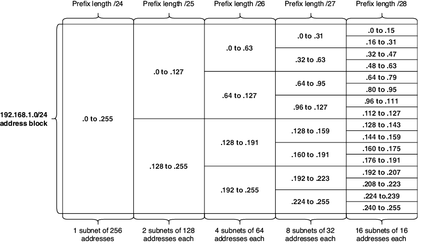{text-align: justify}

/// figura
El bloque de direcciones 192.168.1.0/24 (red) dividido en subredes más pequeñas. Con una longitud de prefijo /24, es una subred de 256 direcciones. Con una longitud de prefijo /25, el bloque se puede dividir en dos subredes de 128 direcciones cada una. Con /26 se obtienen 4 subredes de 64 direcciones cada una. Con /27 se obtienen 8 subredes de 32 direcciones cada una. Con /28 se obtienen 16 subredes de 16 direcciones cada una.
///

!!!note "Nota"
    La figura 1 sólo muestra longitudes de prefijo hasta /28, pero las longitudes de prefijo mayores siguen el mismo patrón: aumentar la longitud del prefijo en 1 bit duplica el número de subredes posibles, pero reduce a la mitad el número de direcciones contenidas en cada subred.

## 2. Subnetting FLSM

El subnetting es el proceso de dividir un bloque de direcciones en subredes más pequeñas. Ese proceso se puede hacer de un par de maneras diferentes: el Enmascaramiento de subred de longitud fija (FLSM) divide el bloque en subredes del mismo tamaño. Por otro lado, el Enmascaramiento de subred de longitud variable (VLSM) divide el bloque en subredes de tamaños variables en función de cuántas direcciones se necesiten realmente en cada subred.

En el mundo real, vais a utilizar VLSM; os permite utilizar de forma más eficiente un bloque de direcciones, ya que podéis hacer cada subred sólo del tamaño que necesita, lo que desperdicia menos direcciones. Sin embargo, FLSM sirve como un paso intermedio útil cuando se aprende a hacer subnetting y debéis conocerlo para el examen CCNA, por lo que en esta sección nos centraremos en FLSM.

### 2.1. Subnetting de bloques de direcciones /24

En primer lugar, veremos cómo hacer subnetting con bloques de direcciones con una longitud de prefijo /24 o superior. El motivo es que nos permite centrarnos sólo en el último octeto de la dirección, simplificando un poco el proceso.

La parte de red de un bloque de direcciones no se puede cambiar; si os dan el bloque de direcciones 192.168.1.0/24, no podéis asignar 192.168.2.1 (ni ninguna otra dirección IP que no esté incluida en el rango 192.168.1.0/24) a un host. Sin embargo, la parte de host es terreno libre: podéis utilizar los últimos 8 bits para crear varias direcciones IP para asignar a los hosts. Ésta es la clave del subnetting: para crear subredes, "tomáis" bits de la parte de host y los añadís a la parte de red. Después sois libres de cambiar el valor binario de esos bits tomados entre 0 y 1 para crear distintas subredes. La figura 2 muestra cómo se puede tomar 1 bit de la parte de host de 192.168.1.0/24 para crear dos subredes diferentes: 192.168.1.0/25 y 192.168.1.128/25.

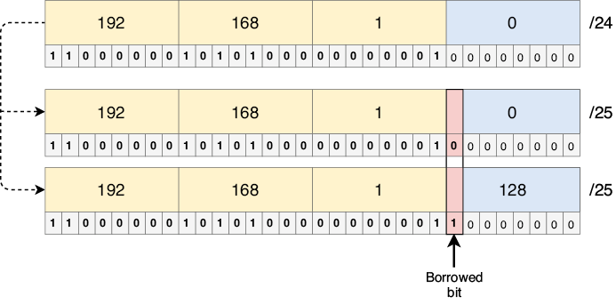{text-align: justify}

/// figura
Tomar 1 bit de la parte de host de 192.168.1.0/24 nos permite crear dos subredes: 192.168.1.0/25 y 192.168.1.128/25. El bit tomado formaba parte de la parte de host del bloque de direcciones original, pero ahora forma parte de la parte de red de cada subred (como indica la longitud de prefijo /25).
///

!!!note "Nota"
    En ejemplos anteriores, la dirección de red siempre terminaba en .0. Sin embargo, al hacer subnetting, como la frontera entre la parte de red y la parte de host puede estar en mitad de un octeto, la dirección de red no tiene por qué terminar en .0. 192.168.1.0 es la dirección de red de la subred 192.168.1.0/25, y 192.168.1.128 es la dirección de red de la subred 192.168.1.128/25.

Con el bit tomado puesto a 0, obtenemos la primera subred: 192.168.1.0/25. Si cambiamos el bit tomado a 1, obtenemos la segunda subred: 192.168.1.128/25. Así es como se crean las subredes: cambiando el valor binario del bit o bits tomados.

Tomando un único bit de la parte de host podemos hacer dos subredes, entonces, ¿cuántas subredes podemos hacer si tomamos 2 bits? Lo vimos en la sección 1: cada bit que se añade a la longitud de prefijo (cada bit tomado de la parte de host) duplica el número de subredes. La fórmula es 2x, donde x es el número de bits tomados, por lo que tomando 2 bits podemos hacer 4 (22) subredes. La figura 3 muestra las cuatro subredes que se pueden crear tomando 2 bits de la parte de host del bloque 192.168.1.0/24.

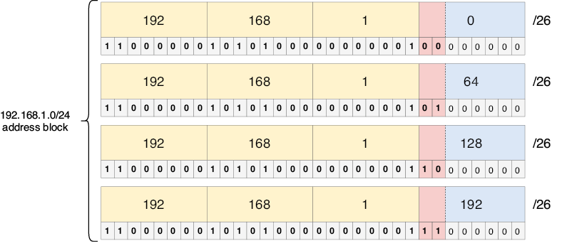{text-align: justify}

/// figura
Tomar 2 bits de 192.168.1.0/24 permite crear cuatro subredes: 192.168.1.0/26, 192.168.1.64/26, 192.168.1.128/26 y 192.168.1.192/26.
///

!!!note "Nota"
    En la primera subred, los bits tomados son 00. ¿Cómo se puede saber cuál es la siguiente subred? Basta con contar en binario: el número después de 00 es 01, luego 10 y luego 11. Como vimos en el capítulo 7, contar en binario es el mismo proceso que contar en decimal, sólo que aquí sólo hay dos dígitos: 0 y 1.

#### 2.1.1. Cálculo de los cinco atributos de una subred /24+

En el capítulo 7 vimos cinco atributos de una red IPv4: dirección de red, dirección de difusión, primera dirección utilizable, última dirección utilizable y número máximo de hosts. Esos mismos atributos se aplican al dividir las redes en subredes. A continuación se hace un repaso rápido de cada atributo:

+ **Dirección de red** — la primera dirección de una subred, con la parte de host toda a 0.
+ **Dirección de difusión** — la última dirección de una subred, con la parte de host toda a 1.
+ **Primera dirección utilizable** — la primera dirección de la subred que se puede asignar a un host. Se calcula sumando 1 a la dirección de red (cambiando el último bit a 1).
+ **Última dirección utilizable** — la última dirección de la subred que se puede asignar a un host. Se calcula restando 1 a la dirección de difusión (cambiando el último bit a 0).
+ **Número máximo de hosts** — el número de direcciones IP disponibles para asignar a hosts. La fórmula es 2y – 2, donde y es el número de bits de la parte de host. Se restan 2 porque las direcciones de red y de difusión no se pueden asignar a hosts.

La figura 4 muestra los cinco atributos de una de las subredes de la figura 3: la subred 192.168.1.64/26. Los cálculos son los mismos que vimos en el capítulo 7; sólo hay que tener en cuenta que los bits tomados pasan a formar parte de la parte de red. Como la longitud de prefijo en este ejemplo es /26, sólo los últimos 6 bits son la parte de host.

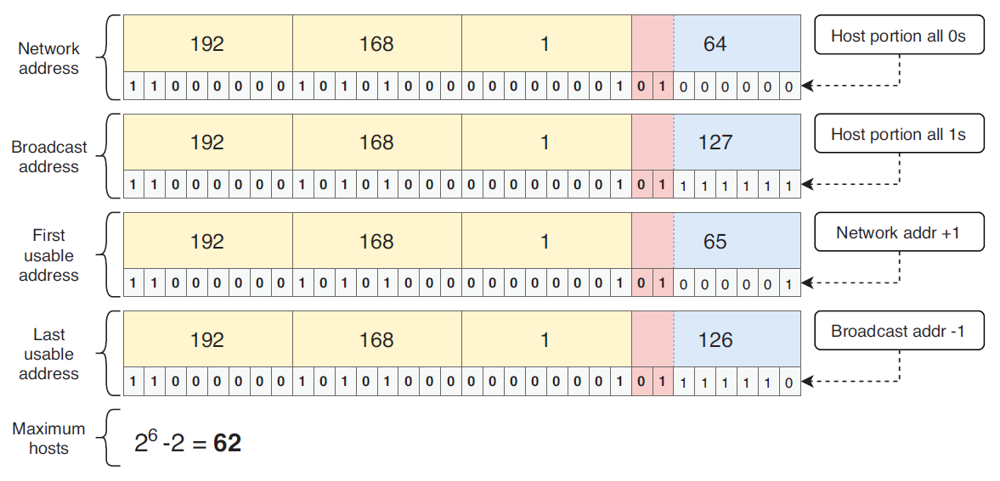{text-align: justify}

/// figura
Los cinco atributos de la subred 192.168.1.64/26. Los primeros 26 bits son la parte de red y los 6 últimos bits son la parte de host. La dirección de red es 192.168.1.64 (parte de host toda a 0s). La dirección de difusión es 192.168.1.127 (parte de host toda a 1s). La primera dirección utilizable es 192.168.1.65 (dirección de red + 1). La última dirección utilizable es 192.168.1.126 (dirección de difusión – 1). El número máximo de hosts en la subred es 62 (26 – 2).
///

Un problema habitual de subnetting es algo así: "PC1 tiene la dirección IP 172.16.20.27/28. ¿Cuál es la dirección de red de la subred a la que pertenece?". Para resolver una pregunta como ésta, podéis seguir estos tres pasos:

+ Escribir la dirección en binario: 10101100.00010000.00010100.00011011
+ Cambiar la parte de host a todo 0s: 10101100.00010000.00010100.00010000
+ Convertir de nuevo a decimal con puntos: 172.16.20.16. ¡Esa es la respuesta!

!!!tip "Consejo de examen"
    Debéis ser capaces de identificar cualquiera de los cinco atributos de una subred concreta, no sólo la dirección de red. Este tipo de problemas pueden aparecer en el examen CCNA como preguntas independientes o como parte de preguntas más complejas.

#### 2.1.2. Máscaras de subred para /24+

Lo ideal sería poder escribir las longitudes de prefijo directamente en notación CIDR, sin tener que preocuparnos por las máscaras de subred. Sin embargo, como tenéis que utilizar máscaras de subred al configurar direcciones IP y rutas estáticas en Cisco IOS, es necesario aprenderlas.

Para repasar, una máscara de subred es una serie de 32 bits que indica qué bits de una dirección IP forman parte de la parte de red y cuáles forman parte de la parte de host. Un bit puesto a 1 en la máscara de subred significa que el bit en la misma posición de la dirección IP forma parte de la parte de red, y un bit puesto a 0 en la máscara de subred significa que el bit en la misma posición de la dirección IP forma parte de la parte de host. Y como una dirección IP está formada por la parte de red seguida de la parte de host, una máscara de subred es una serie de 1s seguida de una serie de 0s (salvo que sean todos 0s, como en /0, o todos 1s, como en /32).

Cuando sólo se trabaja con longitudes de prefijo /8, /16 y /24, las máscaras de subred son sencillas: 255.0.0.0, 255.255.0.0 o 255.255.255.0, respectivamente. Sin embargo, al usar CIDR, la frontera entre la parte de red y la de host puede estar en mitad de un octeto, lo que da lugar a otras máscaras de subred posibles. La tabla 1 enumera las longitudes de prefijo de /24 a /32 y sus máscaras de subred equivalentes escritas en binario y en decimal con puntos. Debéis familiarizaros con estas máscaras de subred; las necesitaréis al configurar routers Cisco. Como referencia, la tabla 1 también indica el número máximo de hosts en una subred de cada tamaño.

Tabla 1 Longitudes de prefijo y máscaras de subred para /24+ (ver figura de tabla)

| Longitud de prefijo | Máscara de subred (binario) | Máscara de subred (decimal) | Número máximo de hosts (2y-2) |
|---------------------|------------------------------|------------------------------|--------------------------------|
| /24                 | 11111111.11111111.11111111.00000000 | 255.255.255.0        | 254                            |
| /25                 | 11111111.11111111.11111111.10000000 | 255.255.255.128      | 126                            |
| /26                 | 11111111.11111111.11111111.11000000 | 255.255.255.192      | 62                             |
| /27                 | 11111111.11111111.11111111.11100000 | 255.255.255.224      | 30                             |
| /28                 | 11111111.11111111.11111111.11110000 | 255.255.255.240      | 14                             |
| /29                 | 11111111.11111111.11111111.11111000 | 255.255.255.248      | 6                              |
| /30                 | 11111111.11111111.11111111.11111100 | 255.255.255.252      | 2                              |
| /31                 | 11111111.11111111.11111111.11111110 | 255.255.255.254      | 2 (ver más adelante)           |
| /32                 | 11111111.11111111.11111111.11111111 | 255.255.255.255      | 1 (ver más adelante)           |

Las longitudes de prefijo /31 y /32 son casos especiales a la hora de calcular el número máximo de hosts de una subred. Una longitud de prefijo /31, por ejemplo, deja un único bit de host. Si utilizamos la fórmula 2y – 2 para calcular el número máximo de hosts en la subred, el resultado es 0; un único bit de host sólo permite dos direcciones, que están ocupadas por la dirección de red y la dirección de difusión, por lo que no quedan direcciones utilizables. Por este motivo, las longitudes de prefijo /31 estuvieron sin usarse durante mucho tiempo.

Sin embargo, con el fin de preservar aún más el espacio de direcciones IPv4, se hizo una excepción a las reglas normales para las longitudes de prefijo /31: se pueden utilizar para enlaces punto a punto, conexiones entre dos routers que sólo requieren dos direcciones IP. En este caso, la subred no tiene dirección de red ni dirección de difusión. Antes de que se hiciera esta excepción, los enlaces punto a punto utilizaban longitudes de prefijo /30, que dejaban dos bits de host y, por tanto, dos direcciones utilizables (22 – 2 = 2). Esto funciona bien, y las longitudes de prefijo /30 siguen siendo hoy en día una opción habitual para los enlaces punto a punto, pero las longitudes de prefijo /31 son más eficientes: sólo consumen dos direcciones IP, en lugar de cuatro.

!!!note "Nota"
    Aunque las subredes /31 son más eficientes, las subredes /30 siguen siendo la opción más habitual, ya que /31 rompe técnicamente la regla de la dirección de red/difusión.

La figura 5 muestra un enlace punto a punto entre dos routers, con dos opciones para la subred utilizada en la conexión: se puede usar 203.0.113.0/30, que consume un total de cuatro direcciones, o 203.0.113.0/31, que consume sólo dos direcciones.

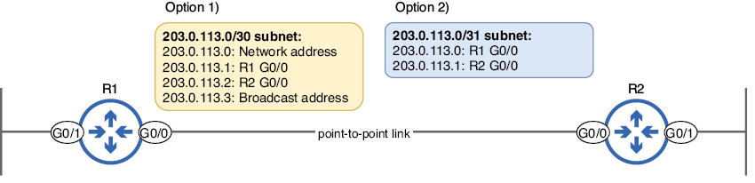{text-align: justify}

/// figura
Un enlace punto a punto que conecta R1 con R2. Tradicionalmente, para una conexión como ésta se utilizaba una subred /30, como en la opción 1. En las redes modernas, una subred /31, como en la opción 2, también es válida (y más eficiente).
///

En el siguiente ejemplo, configuro la dirección IP de la G0/0 de R1 con una longitud de prefijo /31 (máscara de subred 255.255.255.254). El router muestra entonces un mensaje de aviso indicando que las longitudes de prefijo /31 deben usarse con precaución:

```
R1(config-if)# ip address 203.0.113.0 255.255.255.254               #1
% Warning: use /31 mask on non point-to-point interface cautiously  #2
#1 Configures a /31 prefix length
#2 A warning message is displayed.
```

!!!note "Nota"
    Una máscara de subred /32 se puede utilizar para especificar una única dirección IP en una ruta, como vimos en el capítulo 9. Sin embargo, rara vez se configura una máscara de subred /32 en una interfaz (aunque veremos una excepción en el capítulo 18, sobre OSPF).

### 2.2. Subnetting de bloques de direcciones /16

Hacer subnetting con un bloque de direcciones cuya longitud de prefijo sea menor que /24 puede parecer intimidante al principio; ya no os podéis centrar sólo en el último octeto de la dirección. Sin embargo, os aseguro que el proceso de subnetting no cambia en absoluto:

+ El número de subredes que podéis crear sigue siendo 2x, donde x es el número de bits tomados.
+ El número máximo de hosts por subred sigue siendo 2y – 2, donde y es el número de bits de host.
+ La dirección de red de la subred sigue siendo la dirección con la parte de host toda a 0s.

¡Creo que vais captando la idea! La única diferencia es que la conversión entre decimal y binario requiere algo más de cuidado. Como no es necesario introducir conceptos nuevos, en esta sección mostraré cómo se aplican los conceptos anteriores a los bloques de direcciones con una longitud de prefijo /16+. La tabla 2 resume algunas de las formas en que se puede hacer subnetting de un bloque de direcciones /16. Como antes, cada bit tomado duplica la cantidad de subredes que se pueden crear, pero reduce a la mitad el número total de direcciones por subred (la tabla 2 muestra el número máximo de hosts por subred, en lugar del número total de direcciones).

Tabla 2 Subnetting de un bloque de direcciones /16 (ver figura de tabla)

| Longitud de prefijo | Máscara de subred (decimal) | Bits tomados | Número de subredes | Número máximo de hosts por subred (2y-2) |
|---------------------|------------------------------|---------------|---------------------|--------------------------------------------|
| /16                 | 255.255.0.0                  | 0             | 1                   | 65.534                                     |
| /17                 | 255.255.128.0                | 1             | 2                   | 32.766                                     |
| /18                 | 255.255.192.0                | 2             | 4                   | 16.382                                     |
| /19                 | 255.255.224.0                | 3             | 8                   | 8190                                       |
| /20                 | 255.255.240.0                | 4             | 16                  | 4094                                       |
| /21                 | 255.255.248.0                | 5             | 32                  | 2046                                       |
| /22                 | 255.255.252.0                | 6             | 64                  | 1022                                       |
| /23                 | 255.255.254.0                | 7             | 128                 | 510                                        |
| /24                 | 255.255.255.0                | 8             | 256                 | 254                                        |
| /25                 | 255.255.255.128              | 9             | 512                 | 126                                        |

!!!note "Nota"
    La tabla 2 sólo muestra longitudes de prefijo hasta /25, pero los bloques de direcciones /16 también se pueden dividir en subredes hasta /32.

En la figura 3 vimos cómo tomar dos bits del bloque de direcciones 192.168.1.0/24 permite crear cuatro subredes. La figura 6 muestra lo mismo, pero esta vez usando el bloque de direcciones 192.168.0.0/16.

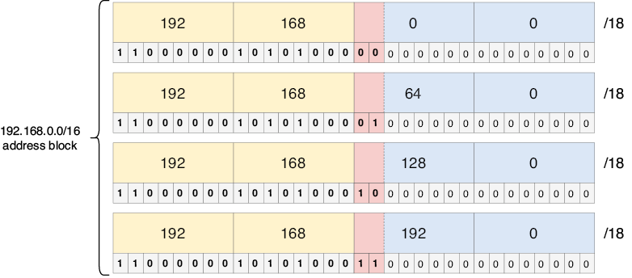{text-align: justify}

/// figura
Tomar dos bits de 192.168.0.0/16 permite crear cuatro subredes: 192.168.0.0/18, 192.168.64.0/18, 192.168.128.0/18 y 192.168.192.0/18.
///

El cálculo de los cinco atributos es el mismo proceso de antes. La figura 7 toma una de las subredes de la figura 6 (192.168.128.0/18) y muestra los cinco atributos de esa subred.

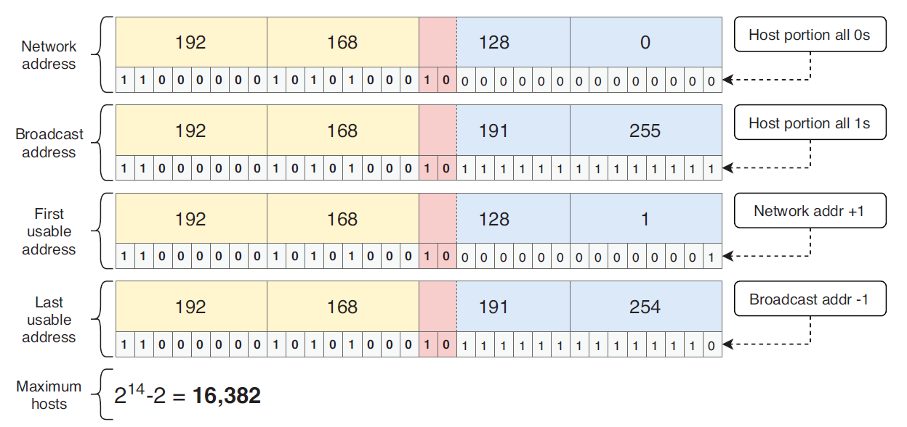{text-align: justify}

/// figura
Los cinco atributos de la subred 192.168.128.0/18. Los primeros 18 bits son la parte de red y los últimos 14 bits son la parte de host. La dirección de red es 192.168.128.0 (parte de host toda a 0s). La dirección de difusión es 192.168.191.255 (parte de host toda a 1s). La primera dirección utilizable es 192.168.128.1 (dirección de red + 1). La última dirección utilizable es 192.168.191.254 (dirección de difusión – 1). El número máximo de hosts en la subred es 16.382 (214 – 2).
///

!!!note "Nota"
    /18 es un tamaño de subred muy grande, con 16.382 direcciones de host por subred. Probablemente nunca configuraréis una subred /18 en una interfaz, pero para el examen CCNA debéis ser capaces de crear subredes de cualquier tamaño.

### 2.3. Subnetting de bloques de direcciones /8

Hacer subnetting con un bloque de direcciones /8 es, una vez más, el mismo proceso que hemos visto hasta ahora. Sin embargo, un bloque de direcciones /8 significa que hay 24 bits de host: muchos bits para tomar y crear un montón de subredes, o para usar y crear unas pocas subredes muy grandes. La tabla 3 resume algunas de las formas en que se puede hacer subnetting de un bloque de direcciones /8.

Tabla 3 Subnetting de un bloque de direcciones /8 (ver figura de tabla)

| Longitud de prefijo | Máscara de subred (decimal) | Bits tomados | Número de subredes | Número máximo de hosts por subred (2y-2) |
|---------------------|------------------------------|---------------|---------------------|--------------------------------------------|
| /8                  | 255.0.0.0                    | 0             | 1                   | 16.777.214                                 |
| /9                  | 255.128.0.0                  | 1             | 2                   | 8.388.606                                  |
| /10                 | 255.192.0.0                  | 2             | 4                   | 4.194.302                                  |
| /11                 | 255.224.0.0                  | 3             | 8                   | 2.097.150                                  |
| /12                 | 255.240.0.0                  | 4             | 16                  | 1.048.574                                  |
| /13                 | 255.248.0.0                  | 5             | 32                  | 524.286                                    |
| /14                 | 255.252.0.0                  | 6             | 64                  | 262.142                                    |
| /15                 | 255.254.0.0                  | 7             | 128                 | 131.070                                    |
| /16                 | 255.255.0.0                  | 8             | 256                 | 65.534                                     |
| /17                 | 255.255.128.0                | 9             | 512                 | 32.766                                     |

!!!note "Nota"
    Debido al número de bits de host en un bloque de direcciones /8, el número de hosts por subred para cada longitud de prefijo de la tabla 3 es extremadamente grande. Cuando hagáis subnetting de un bloque /8 en la práctica, probablemente tomaréis muchos bits para crear subredes más pequeñas; una subred con millones de direcciones nunca es necesaria.

En la figura 8 tomo 12 bits del bloque de direcciones 10.0.0.0/8, lo que permite crear 4.096 subredes distintas. Por supuesto, no voy a escribir las 4.096 subredes, así que la figura 8 muestra sólo la primera subred y las dos últimas.

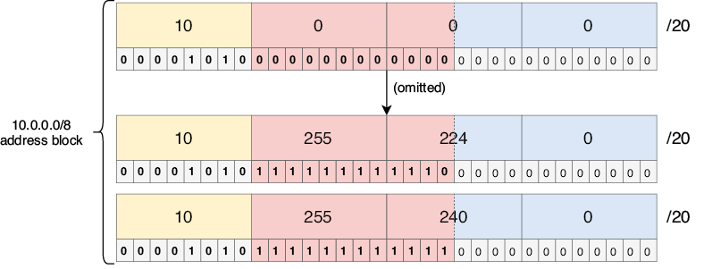{text-align: justify}

/// figura
Tomar 12 bits de 10.0.0.0/8 permite crear 4.096 subredes. 10.0.0.0/20 es la primera subred, y 10.255.224.0/20 y 10.255.240.0/20 son las dos últimas.
///

!!!note "Nota"
    La figura 8 se diferencia de los ejemplos anteriores en que los bits tomados cruzan entre octetos (todo el segundo octeto y los cuatro primeros bits del tercer octeto). ¡Esto no cambia nada en cómo funciona el subnetting! Tened en cuenta que las divisiones entre octetos sólo existen para hacer las direcciones más legibles; para un ordenador, una dirección IP es simplemente una serie de 32 bits, sin divisiones entre octetos.

El cálculo de los cinco atributos de una subred no cambia, independientemente del tamaño del bloque de direcciones original o de cuántos bits toméis, así que no vamos a hacer un tercer ejemplo aquí. Para practicar un poco más, os recomiendo coger una de las subredes de la figura 8 y calcular sus cinco atributos: dirección de red, dirección de difusión, primera dirección utilizable, última dirección utilizable y número máximo de hosts.

### 2.4. Escenarios FLSM

Como mencioné al principio de este capítulo, el subnetting es una habilidad que requiere práctica para llegar a dominarla. Al final de este capítulo daré algunas recomendaciones de sitios web gratuitos donde podréis encontrar preguntas para practicar subnetting. Antes de eso, vamos a ver un par de escenarios parecidos a los que podríais encontrar en esos sitios (y en el propio examen CCNA).

La figura 9 plantea un escenario de práctica en el que usaremos FLSM para dividir el bloque de direcciones 172.25.190.0/23 en cuatro subredes del mismo tamaño, calcular el número máximo de hosts en cada subred y configurar la primera dirección utilizable de cada subred en las interfaces de R1.

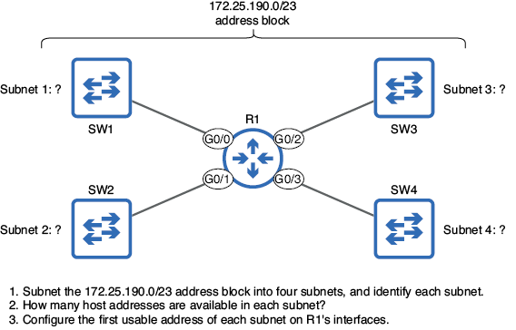{text-align: justify}

/// figura
Un escenario FLSM en el que debéis dividir el bloque de direcciones 172.25.190.0/23 en cuatro subredes del mismo tamaño, identificar el número de direcciones de host por subred y configurar la primera dirección utilizable de cada subred en las interfaces de R1.
///

!!!note "Nota"
    El ejemplo de la figura 9 es la primera vez que empezamos con un bloque de direcciones que no es /8, /16 o /24, pero el proceso de subnetting sigue siendo el mismo.

Para empezar, identifiquemos las cuatro subredes. ¿Cuántos bits necesitamos tomar para dividir un bloque de direcciones en cuatro subredes? Como hemos visto en un par de ejemplos anteriores, necesitamos tomar 2 bits para crear cuatro subredes, ya que 22 = 4. Después basta con contar con esos 2 bits tomados para crear las cuatro subredes. La figura 10 muestra las cuatro subredes que se pueden crear tomando 2 bits del bloque de direcciones 172.25.190.0/23. Como tomamos 2 bits de la parte de host, la longitud de prefijo de cada subred es /25 (/23 + 2).

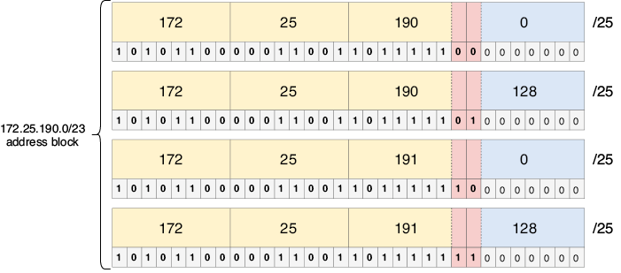{text-align: justify}

/// figura
Subredes que se pueden crear al dividir 172.25.190.0/23 en cuatro partes iguales: 172.25.190.0/25, 172.25.190.128/25, 172.25.191.0/25 y 172.25.191.128/25. Tomar 2 bits de la parte de host del bloque de direcciones /23 da como resultado cuatro subredes /25.
///

Ya hemos resuelto la primera parte del escenario: identificar las cuatro subredes. La segunda parte pregunta cuántas direcciones de host hay disponibles en cada subred. Para resolverlo, basta con usar la misma fórmula de siempre: 2y – 2 (siendo y el número de bits de host). El bloque de direcciones original era /23, lo que significa que había 9 bits de host. Sin embargo, después de tomar 2 bits de host para crear las subredes, quedan 7 bits de host. Por lo tanto, hay 126 (27 – 2) direcciones de host disponibles en cada subred.

La parte final del escenario pide configurar la primera dirección utilizable de cada subred en las interfaces de R1. La primera dirección utilizable se calcula con el método habitual: se suma 1 a la dirección de red de cada subred. En el siguiente ejemplo, configuro las interfaces de R1 con la primera dirección utilizable de cada subred:

```
R1(config)# interface g0/0                                   #1
R1(config-if)# ip address 172.25.190.1 255.255.255.128       #1
R1(config-if)# interface g0/1                                #2
R1(config-if)# ip address 172.25.190.129 255.255.255.128     #2
R1(config-if)# interface g0/2                                #3
R1(config-if)# ip address 172.25.191.1 255.255.255.128       #3
R1(config-if)# interface g0/3                                #4
R1(config-if)# ip address 172.25.191.129 255.255.255.128     #4
#1 Configure 172.25.190.1/25 on G0/0.
#2 Configure 172.25.190.129/25 on G0/1.
#3 Configure 172.25.191.1/25 on G0/2.
#4 Configure 172.25.191.129/25 on G0/3.
```

¡Ya hemos resuelto el escenario! Veamos un escenario más, esta vez sólo con texto: se os ha dado el bloque de direcciones 10.224.0.0/11. Debéis crear 2.000 subredes, que se asignarán a varias oficinas y departamentos dentro de una empresa grande. ¿Qué longitud de prefijo debéis usar para crear un número suficiente de subredes? ¿Cuántas direcciones de host tiene cada subred?

Para resolver este escenario, primero tenemos que determinar cuántos bits debemos tomar para crear 2.000 subredes. Si habéis aprendido las potencias de 2, esto no debería ser muy difícil: 1 bit da 2 subredes, 2 bits dan 4 subredes, 3 bits dan 8 subredes, y así sucesivamente; 11 bits dan 2.048 subredes. Son 48 más de las que necesitamos en el escenario, pero tomar 10 bits sólo daría 1.024 subredes (insuficiente), por lo que la respuesta es 11 bits. Tomar 11 bits de la parte de host da como resultado una longitud de prefijo /22, que es la respuesta a la primera parte del escenario. La figura 11 lo ilustra y muestra la primera subred y la última (la 2.048ª).

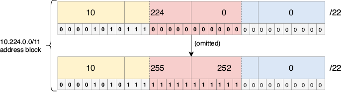{text-align: justify}

/// figura
Tomar 11 bits de la parte de host del bloque de direcciones 10.224.0.0/11 permite crear 2.048 subredes. La primera subred es 10.224.0.0/22 (todos los bits tomados a 0), y la última (la 2.048ª) es 10.255.252.0/22 (todos los bits tomados a 1).
///

Una longitud de prefijo /22 significa que quedan 10 bits de host, por lo que ahora podemos calcular el número de direcciones de host en cada subred: 1.022 (210 – 2). ¡Y con esto ya tenemos resuelto el escenario!

!!!note "Nota"
    Como el número de subredes aumenta en una potencia de 2 por cada bit tomado, a menudo no podréis crear exactamente el número de subredes que necesitáis; probablemente os quedarán algunas subredes de sobra, lo cual no es malo, ya que se pueden usar para absorber ampliaciones de la red en el futuro. Del mismo modo, a menudo no podréis crear subredes del tamaño exacto que necesitáis; normalmente os quedarán algunas direcciones de sobra en cada subred.

## 3. Subnetting VLSM

El Enmascaramiento de subred de longitud variable (VLSM) nos permite hacer subnetting de un bloque de direcciones de forma aún más eficiente que FLSM, creando subredes de tamaños variables. Aunque FLSM es una introducción útil al subnetting, cuando hagáis subnetting de redes en el mundo real, lo más probable es que estéis haciendo VLSM. La figura 12 muestra el escenario que utilizaré para demostrar VLSM.

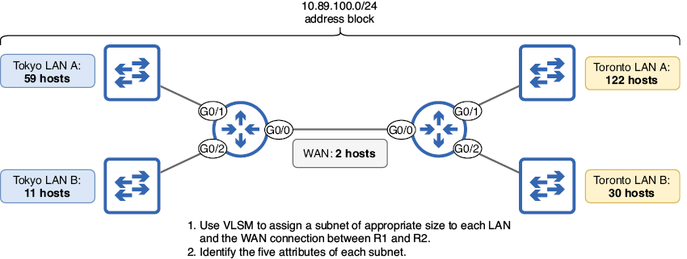{text-align: justify}

/// figura
Un escenario VLSM en el que debéis asignar subredes del bloque de direcciones 10.89.100.0/24 a cada LAN y a la conexión WAN, e identificar los cinco atributos de cada subred.
///

Un bloque de direcciones /24 incluye 254 direcciones de host, y el número total de direcciones de host necesarias en el escenario de la figura 12 es 226, por lo que el espacio de direcciones es suficiente. Si se usa FLSM para crear subredes del mismo tamaño, algunas subredes se quedarían con muy pocas direcciones (la LAN A de Toronto necesita 122 direcciones de host) y otras tendrían demasiadas (la conexión WAN sólo necesita 2 direcciones de host, una para R1 y otra para R2). Sin embargo, si usamos VLSM, podemos hacer unas subredes más pequeñas y otras más grandes, lo que nos permite utilizar de forma eficiente el bloque de direcciones disponible. El proceso de VLSM, a grandes rasgos, es el siguiente:

+ Asignar la subred más grande al principio del bloque de direcciones.
+ Asignar la segunda subred más grande justo después.
+ Repetir el proceso hasta que se hayan asignado todas las subredes.

Las cinco subredes de la figura 12, ordenadas de mayor a menor, son: LAN A de Toronto (122 hosts), LAN A de Tokio (59 hosts), LAN B de Toronto (30 hosts), LAN B de Tokio (11 hosts) y la conexión WAN (2 hosts). Empecemos, pues, asignando la LAN A de Toronto.

!!!note "Nota"
    Las direcciones IP de los routers se incluyen en el cómputo de "hosts"; cualquier dispositivo con una dirección IP puede considerarse un host. El término host final se suele usar para referirse a PCs, servidores, etc. para distinguirlos de los dispositivos de infraestructura de red como los routers.

La figura 13 representa visualmente las cinco subredes que resultarán de este proceso: una subred /25 (128 direcciones), una subred /26 (64 direcciones), una subred /27 (32 direcciones), una subred /28 (16 direcciones) y una subred /30 (4 direcciones). En las siguientes secciones veremos cómo realizar subnetting VLSM y crear estas cinco subredes.

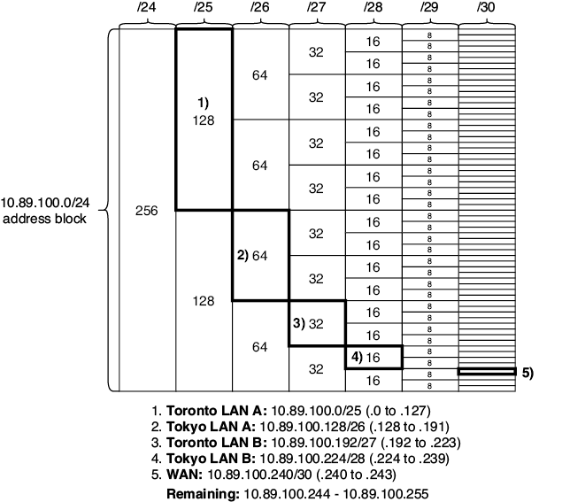{text-align: justify}

/// figura
El bloque de direcciones 10.89.100.0/24, dividido en cinco subredes de tamaños variables. (1) La LAN A de Toronto es 10.89.100.0/25, con 128 direcciones. (2) La LAN A de Tokio es 10.89.100.128/26, con 64 direcciones. (3) La LAN B de Toronto es 10.89.100.192/27, con 32 direcciones. (4) La LAN B de Tokio es 10.89.100.224/28, con 16 direcciones. (5) La conexión WAN es 10.89.100.240/30, con 4 direcciones. Tras el subnetting, quedan 12 direcciones sin usar: de 10.89.100.244 a 10.89.100.255.
///

!!!note "Nota"
    Por motivos prácticos, la figura 13 no muestra el número de direcciones en las subredes /30 (4 direcciones cada una) y no incluye columnas para las subredes /31 (2 direcciones cada una) ni para las subredes /32 (1 dirección cada una).

### 3.1. Asignación de la subred de la LAN A de Toronto

La LAN A de Toronto necesita 122 direcciones de host, por lo que la pregunta es: ¿cuál es el número mínimo de bits de host necesario para proporcionar al menos 122 direcciones de host? Consultando la fórmula que usamos para calcular el número máximo de bits de host en una subred (2y – 2), ¿cuál es el valor mínimo de y que nos serviría? La respuesta es 7, porque 27 – 2 = 126, sólo unas pocas direcciones más de las que necesitamos. Con 6 bits de host sólo tendríamos 62 direcciones de host (26 – 2), insuficientes para los 122 hosts de la LAN A de Toronto. Para dejar 7 bits de host, tenemos que tomar 1 bit del bloque de direcciones /24. La figura 14 muestra la subred resultante cuando tomamos un único bit de host del bloque de direcciones 10.89.100.0/24: 10.89.100.0/25, ¡la subred de la LAN A de Toronto! La figura 14 también enumera los cinco atributos de la subred.

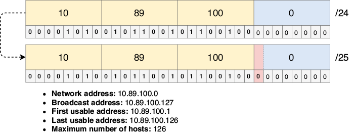{text-align: justify}

/// figura
Subred de la LAN A de Toronto. Tomar 1 bit del bloque de direcciones 10.89.100.0/24 da como resultado la subred 10.89.100.0/25, que admite hasta 126 direcciones de host, suficientes para los 122 hosts de la LAN.
///

Al asignar la subred 10.89.100.0/25 a la LAN A de Toronto, ya hemos utilizado la mitad del espacio de direcciones disponible: de 10.89.100.0 a 10.89.100.127. Todo el bloque de direcciones 10.89.100.0/24 incluye 256 direcciones, y una única subred /25 ocupa 128 de esas direcciones (recordad que sólo 126 de esas 128 direcciones se pueden asignar a hosts). Asignaremos el resto de las subredes del rango de direcciones restante: de 10.89.100.128 a 10.89.100.255.

### 3.2. Asignación de la subred de la LAN A de Tokio

Tras asignar la subred de la LAN A de Toronto e identificar sus cinco atributos, podemos identificar fácilmente un dato más: la dirección de red de la LAN A de Tokio. La última dirección (no la última dirección utilizable) de la LAN A de Toronto es 10.89.100.127, la dirección de difusión. Sin necesidad de conocer ningún otro dato sobre la LAN A de Tokio, podemos identificar su primera dirección IP (la primera dirección inmediatamente posterior a la dirección de difusión de la LAN A de Toronto), que es 10.89.100.128. Ésta es la dirección de red de la LAN A de Tokio, porque la primera dirección IP de una subred es la dirección de red.

Ahora que conocemos la dirección de red de la LAN A de Tokio, sólo nos queda averiguar cuántos bits de host se necesitan (lo que determina la longitud del prefijo) y, a partir de ahí, podremos calcular los demás atributos. La LAN A de Tokio necesita suficientes direcciones para 59 hosts, por lo que se requieren 6 bits de host, lo que da 62 (26 – 2) direcciones utilizables, es decir, una longitud de prefijo /26. Por lo tanto, la subred que debemos asignar a la LAN A de Tokio es 10.89.100.128/26. La figura 15 muestra la subred y sus cinco atributos.

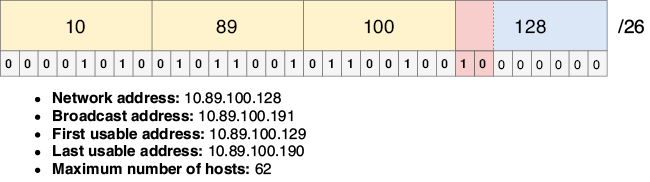{text-align: justify}

/// figura
Subred de la LAN A de Tokio. La dirección de red es 10.89.100.128, la primera dirección después de la LAN A de Toronto. Se usa una longitud de prefijo /26 para permitir hasta 62 direcciones de host, suficientes para los 59 hosts de la LAN.
///

Ya hemos asignado tres cuartas partes del bloque de direcciones 10.89.100.0/24: una subred /25 (la mitad) y una subred /26 (la cuarta parte). El rango de direcciones restante es 10.89.100.192 a 10.89.100.255, y asignaremos las tres subredes restantes dentro de ese rango.

### 3.3. Asignación de la subred de la LAN B de Toronto

La dirección IP inmediatamente posterior a la dirección final de la LAN A de Tokio (su dirección de difusión) es 10.89.100.192, y ésa es la dirección de red de la LAN B de Toronto. ¿Y la longitud de prefijo? La LAN B de Toronto necesita direcciones IP para al menos 30 hosts, por lo que se requieren 5 bits de host, lo que da exactamente 30 (25 – 2) direcciones de host. Por lo tanto, la subred de la LAN B de Toronto debe usar una longitud de prefijo /27, dando lugar a la subred 10.89.100.192/27. La figura 16 muestra la subred y sus cinco atributos.

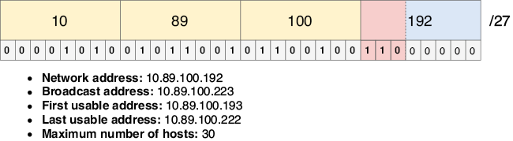{text-align: justify}

/// figura
Subred de la LAN B de Toronto. La dirección de red es 10.89.100.192, la primera dirección después de la LAN A de Tokio. Se usa una longitud de prefijo /27 para permitir hasta 30 direcciones de host, exactamente la cantidad necesaria.
///

!!!note "Nota"
    En una situación real, deberíais dejar algo de margen en cada subred para permitir el crecimiento futuro; puede que en algún momento necesitéis añadir más hosts a la subred. Sin embargo, al hacer ejercicios de subnetting como éste (y en el examen CCNA), usad la longitud de prefijo más eficiente, dejando el menor número posible de direcciones sin usar en la subred.

Ya hemos asignado siete octavos del bloque de direcciones 10.89.100.0/24: una subred /25 (la mitad), una subred /26 (la cuarta parte) y una subred /27 (la octava parte). El rango de direcciones restante es 10.89.100.224 a 10.89.100.255, y usaremos ese rango para asignar las subredes restantes: la LAN B de Tokio y la conexión WAN entre R1 y R2.

### 3.4. Asignación de la subred de la LAN B de Tokio

Podemos usar el mismo proceso para asignar la subred de la LAN B de Tokio. Su dirección de red es la primera dirección después de la dirección de difusión de la LAN anterior (la LAN B de Toronto), por lo que la dirección de red de la LAN B de Tokio es 10.89.100.224. La LAN B de Tokio es una LAN pequeña, que sólo necesita 11 direcciones de host. Por lo tanto, sólo se requieren 4 bits de host, lo que permite hasta 14 (24 – 2) direcciones de host, así que la subred de la LAN B de Tokio es 10.89.100.224/28. La figura 17 muestra la subred y sus cinco atributos.

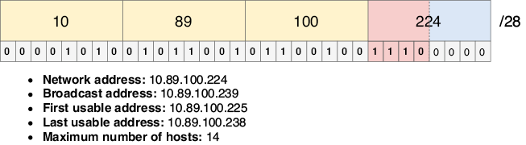{text-align: justify}

/// figura
Subred de la LAN B de Tokio. La dirección de red es 10.89.100.224, la primera dirección después de la LAN B de Toronto. Se usa una longitud de prefijo /28 para permitir hasta 14 direcciones de host, suficientes para los 11 hosts de la LAN.
///

Sólo queda un dieciseisavo del bloque de direcciones 10.89.100.0/24, las direcciones 10.89.100.240 a 10.89.100.255. Por suerte, eso es más que suficiente para la última subred: la conexión WAN entre R1 y R2.

### 3.5. Asignación de la subred de la conexión WAN

La conexión WAN entre R1 y R2 es un enlace punto a punto que sólo necesita dos direcciones de host. La dirección de red es 10.89.100.240 (la primera dirección después de la dirección de difusión de la LAN B de Tokio), pero ¿qué longitud de prefijo debe tener? Como vimos en la sección 3, hay dos opciones: una longitud de prefijo /30 (dos direcciones utilizables, cuatro direcciones en total) o una longitud de prefijo /31 (dos direcciones utilizables, sin direcciones de red ni de difusión). Cualquiera de las dos longitudes de prefijo es una opción válida, pero para este ejemplo usaré una longitud de prefijo /30, por lo que la subred de la conexión WAN es 10.89.100.240/30. La figura 18 muestra la subred y sus cinco atributos.

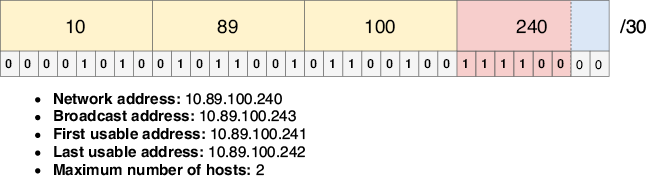{text-align: justify}

/// figura
Subred de la conexión WAN. La dirección de red es 10.89.100.240, la primera dirección después de la LAN B de Tokio. Se usa una longitud de prefijo /30 para permitir dos direcciones de host: una para R1 y otra para R2.
///

!!!note "Nota"
    Cuando representé visualmente estas cinco subredes en la figura 13, elegí una longitud de prefijo /30 para la subred de la conexión WAN. La razón principal de esa elección fue práctica; las cajas que representan las subredes /31 en el diagrama serían demasiado pequeñas. Por mantener la coherencia, utilicé aquí una longitud de prefijo /30, pero tened en cuenta que una longitud de prefijo /31 también es válida y, de hecho, es superior porque consume menos direcciones.

¡Y ya hemos terminado! Hemos asignado las cinco subredes, con sólo unas pocas direcciones IP de sobra (de 10.89.100.244 a 10.89.100.255); estas direcciones quedan libres para ser utilizadas según sea necesario en el futuro a medida que esta hipotética empresa se expanda. Con FLSM, esto no habría sido posible, pero VLSM nos da la flexibilidad de crear subredes de tamaños variables.

### 3.6. Escenarios de examen

Sentirse cómodo con el subnetting es un elemento clave del éxito en el examen CCNA. Aquí tenéis un par de ejemplos de cómo se podrían poner a prueba vuestros conocimientos de subnetting en el examen CCNA:

1. (opción múltiple, varias respuestas)

¿Cuál de los siguientes pares de longitud de prefijo y máscara de subred son correctos? (Seleccionad dos.)

A. /25 = 255.255.255.192

B. /15 = 255.252.0.0

C. /29 = 255.255.255.248

D. /27 = 255.255.255.240

E. /18 = 255.255.192.0

E. /10 = 255.224.0.0

Las máscaras de subred son necesarias para configurar direcciones IP y rutas estáticas en Cisco IOS, por lo que es importante que seáis capaces de identificar la máscara de subred correcta para una longitud de prefijo dada. Por suerte, las máscaras de subred son bastante sencillas: una serie de 1s binarios seguida de una serie de 0s binarios. En este caso, (C) es la primera opción correcta; /29 equivale a 255.255.255.248 (29 unos binarios seguidos de 3 ceros binarios, escritos en decimal con puntos). (E) es la segunda opción correcta; /18 equivale a 255.255.192.0. Como he dicho antes, ¡sentirse cómodo con la conversión entre binario y decimal con puntos es clave!

2. (arrastrar y soltar)

Arrastrad cada subred de la izquierda a su correspondiente rango de direcciones de host utilizables de la derecha. Hay más rangos de direcciones utilizables que subredes, por lo que no se utilizarán todos los rangos de direcciones.

Identificar el rango de direcciones utilizables de una subred requiere identificar la primera y la última dirección utilizable de la subred; marcan el inicio y el final del rango de direcciones utilizables. En esta pregunta, el rango de direcciones utilizables de (A) es 10.23.24.129 a 10.23.24.254, el de (B) es 10.23.24.129 a 10.23.24.158, el de (C) es 10.23.24.65 a 10.23.24.126 y el de (D) es 10.23.24.65 a 10.23.24.78. Para resolver esta pregunta, fijaos sólo en el último octeto de cada dirección; los tres primeros octetos son iguales en todas ellas.

## 4. Práctica adicional de subnetting

Para dominar el subnetting, tenéis que practicar. Por suerte, hay algunos sitios web gratuitos que generan problemas de subnetting que podéis resolver. Un ejemplo es https://www.subnetting.net/, pero podréis encontrar otros con una búsqueda rápida en Google. Os recomiendo dedicar un poco de tiempo cada día a practicar subnetting durante al menos una o dos semanas, o hasta que os sintáis seguros resolviendo las preguntas de los sitios de práctica.

Antes de mandaros a probar las preguntas de práctica, quiero mencionar dos cosas. Primero, algunas preguntas de práctica que encontréis pueden no indicar explícitamente el tamaño del bloque de direcciones que debéis dividir en subredes. Aquí va un ejemplo: "¿Cuál es el número máximo de subredes válidas y de hosts utilizables por subred que se pueden obtener de la red 172.26.0.0 255.255.252.0?". En estos casos, asumid que el bloque de direcciones original es una red con clase. En este ejemplo, la dirección IP es 172.26.0.0, que es una dirección de clase B (porque empieza por 0b10), por lo que podéis asumir que el bloque de direcciones es /16 (172.26.0.0/16).

El segundo punto es que algunas preguntas tratarán sobre máscaras comodín, que son parecidas a las máscaras de subred, pero en realidad no están relacionadas con el tema del subnetting. Trataremos las máscaras comodín en el capítulo 17 (Enrutamiento dinámico), así como en los capítulos 23 y 24 (Listas de control de acceso). Por ahora, podéis saltarlas en cualquier pregunta de un sitio de práctica que mencione máscaras comodín.

### 4.1. El método del "número mágico"

Algunos instructores enseñan atajos que os pueden ayudar a resolver escenarios de subnetting sin tener que pensar en el binario subyacente; un ejemplo famoso es el llamado método del "número mágico". No estoy de acuerdo con estos métodos para los candidatos al CCNA porque creo que sólo sirven como muleta, ayudándoos a resolver problemas de subnetting sin entender cómo funciona realmente el subnetting. Puede parecer engorroso pensar siempre en binario, pero con la práctica se vuelve algo natural. Y seréis mejores no sólo en subnetting, sino en todas las demás habilidades que requieren soltura con el binario (enumeré algunas en el capítulo 7).

## 5. Resumen

+ El Enrutamiento entre dominios sin clases (CIDR) sustituyó al direccionamiento con clases, permitiendo longitudes de prefijo fuera de las tradicionales /8, /16 y /24.
+ Con CIDR, un bloque de direcciones se puede dividir en redes más pequeñas llamadas subredes. Este proceso se llama subnetting.
+ El subnetting con Enmascaramiento de subred de longitud fija (FLSM) divide un bloque de direcciones en subredes del mismo tamaño.
+ El subnetting con Enmascaramiento de subred de longitud variable (VLSM) divide un bloque de direcciones en subredes de tamaños variables.
+ Para hacer subnetting de un bloque de direcciones, se "toman" bits de la parte de host del bloque de direcciones y se añaden a la parte de red. Mientras que la parte de red del bloque de direcciones original no se puede cambiar, los bits tomados sí se pueden cambiar para crear distintas subredes.
+ Cada bit adicional tomado duplica el número de subredes que se pueden crear: 1 bit tomado = 2 subredes, 2 bits tomados = 4 subredes, 3 bits tomados = 8 subredes, etc. Sin embargo, cada bit adicional tomado reduce a la mitad el número de direcciones en cada subred, ya que hay menos bits en la parte de host.
+ Los cinco atributos de una red IPv4 se calculan de la misma forma para las subredes: la dirección de red es la primera dirección de una subred (parte de host toda a 0s), la dirección de difusión es la última dirección de una subred (parte de host toda a 1s), la primera dirección utilizable es la primera dirección después de la dirección de red, la última dirección utilizable es la última dirección antes de la dirección de difusión, y el número máximo de hosts es 2y – 2, donde y es el número de bits de host.
+ Para los enlaces punto a punto (conexiones entre dos routers), se puede usar una longitud de prefijo /30 o /31. /30 consume cuatro direcciones (dirección de red, dirección de difusión y dos direcciones de host), mientras que /31 consume sólo dos direcciones (dos direcciones de host, sin dirección de red ni de difusión).
+ Para hacer subnetting de un bloque de direcciones usando VLSM, se asigna la subred más grande al principio del bloque de direcciones, la segunda subred más grande justo después, y se repite el proceso hasta que se hayan asignado todas las subredes.
+ La dirección de red de la siguiente subred es la dirección inmediatamente posterior a la dirección de difusión de la subred actual.
+ En una situación real, deberíais dejar algo de espacio en cada subred para el crecimiento futuro. Al hacer escenarios de subnetting para practicar (o para el examen CCNA), sed lo más eficientes posible (dejad el menor número posible de direcciones sin usar).
