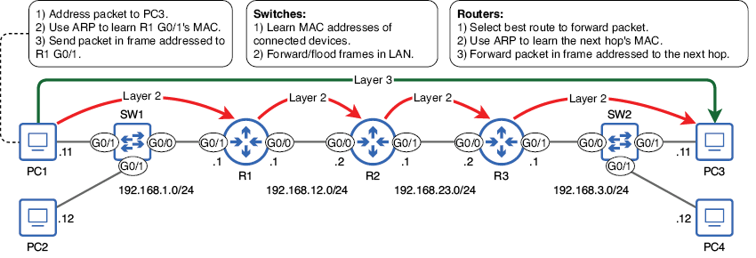
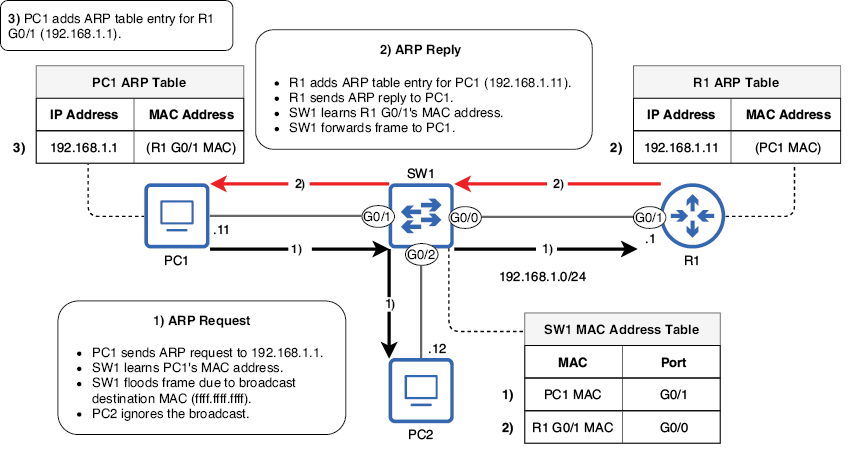
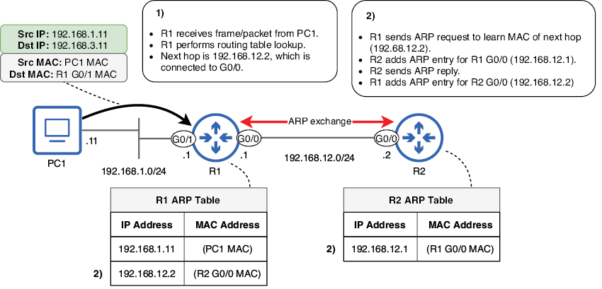
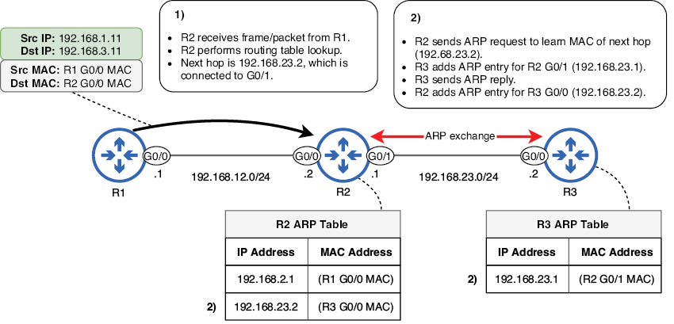
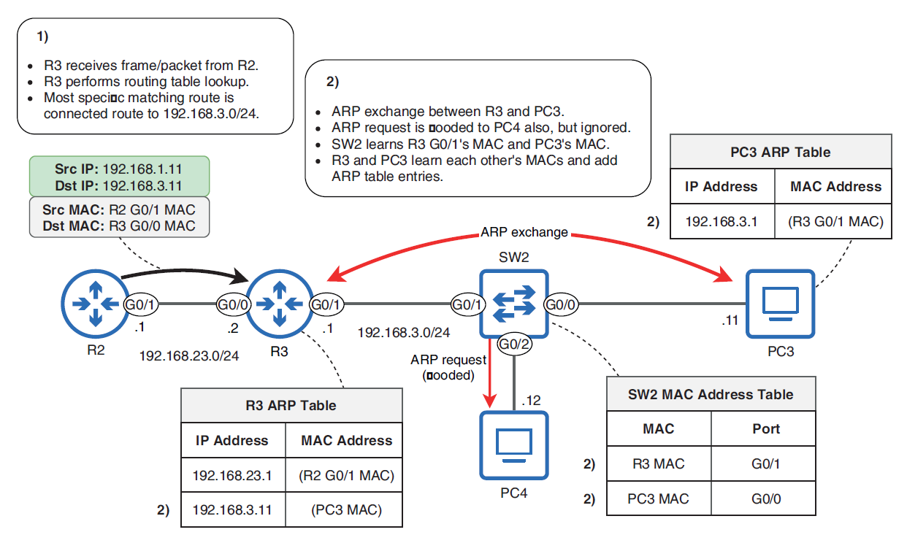
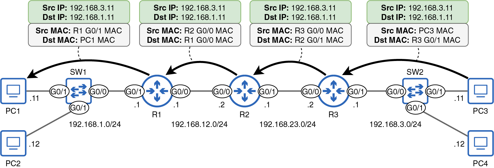

# Vida del paquete

Este capítulo cubre

+ Un repaso de los procesos involucrados en la entrega de un paquete desde el origen hasta el destino
+ Cómo reenvían tramas los switches
+ El Protocolo de resolución de direcciones (ARP)
+ Cómo reenvían paquetes los routers

Los conceptos que hemos visto hasta ahora —el modelo TCP/IP, la conmutación de tramas, ARP, las direcciones IPv4, el enrutamiento, etc.— son conceptos fundamentales sobre los que iremos construyendo en el resto de los dos volúmenes de este libro. En este capítulo repasaremos muchos de esos conceptos y veremos el papel que desempeña cada uno en la entrega de un paquete desde el host emisor hasta el destino previsto del paquete.

Este capítulo es único entre los demás de este libro en cuanto a que no trata información nueva; todo lo que aparece en él se ha cubierto en capítulos anteriores. En lugar de introducir conceptos nuevos, el objetivo de este capítulo es tomar los conceptos más importantes de los capítulos anteriores y unirlos todos en un todo coherente.

La figura 1 muestra la red que utilizaremos en este capítulo; usamos la misma al tratar el enrutamiento en el capítulo 9. La figura 1 también resume los diferentes procesos involucrados en la entrega de un paquete de PC1 a PC3: ARP, conmutación, enrutamiento, etc. Repasaremos estos procesos a lo largo del capítulo.

{text-align: justify}

/// figura
Un resumen de las acciones realizadas por cada dispositivo cuando PC1 envía un paquete a PC3. PC1 prepara un paquete dirigido a PC3, usa ARP para averiguar la dirección MAC de la puerta de enlace predeterminada (R1 G0/1) y envía el paquete en una trama a esa dirección MAC. Los switches averiguan las direcciones MAC de los dispositivos conectados y reenvían o inundan las tramas según corresponda. Los routers seleccionan la mejor ruta para reenviar el paquete, usan ARP para averiguar la dirección MAC del siguiente salto y reenvían el paquete en una trama dirigida a esa dirección MAC.
///

!!!note "Nota"
    Las flechas de la figura 1 son un recordatorio de que, en la Capa 3, el paquete va dirigido a PC3 (dirección IP 192.168.3.11) durante todo el trayecto. Sin embargo, en la Capa 2, el paquete se encapsula en una nueva trama en cada salto, y cada trama va dirigida al siguiente salto (hasta que R3 dirige finalmente su trama a PC3).
///

## 1. La vida de un paquete de PC1 a PC3

La figura 1 ofrece un esquema de los diferentes procesos involucrados en la entrega de un paquete de PC1 a PC3. Ahora vamos a examinar el proceso paso a paso para ver cómo los diferentes componentes que hemos visto en el libro hasta ahora se unen para permitir las comunicaciones sobre la red.

### 1.1. De PC1 a R1

En nuestro escenario, PC1 quiere enviar un paquete a PC3. El tipo de paquete no es relevante para este ejemplo, así que supongamos que es un mensaje de solicitud de eco ICMP enviado al ejecutar el comando ping 192.168.3.11 en PC1.

La dirección IP de PC1 es 192.168.1.11, y tiene una longitud de prefijo /24 (máscara de red 255.255.255.0), por lo que sabe que su red local incluye las direcciones IP 192.168.1.0 (la dirección de red) hasta 192.168.1.255 (la dirección de difusión). Por lo tanto, sabe que PC3 (192.168.3.11) no está en su red local. Esto significa que PC1 debe enviar el paquete a su puerta de enlace predeterminada en una trama dirigida a la dirección MAC de la puerta de enlace predeterminada (en lugar de a la dirección MAC del propio PC3).

PC1 sabe que la dirección IP de su puerta de enlace predeterminada es 192.168.1.1 (probablemente aprendida mediante DHCP, que veremos en el capítulo 4 del volumen 2), pero la información que realmente necesita es la dirección MAC de la puerta de enlace predeterminada; necesita enviar el paquete (destinado a PC3) en una trama dirigida a la dirección MAC de la G0/1 de R1. Para averiguar la dirección MAC de la G0/1 de R1, usará ARP. La figura 2 esquematiza el intercambio ARP entre PC1 y R1.

!!!note "Nota"
    ARP no se utiliza para averiguar la dirección MAC del destino del paquete (PC3), sino la dirección MAC de la puerta de enlace predeterminada (R1 G0/1). Como PC1 y PC3 están en LANs separadas, no necesitan conocer la dirección MAC del otro.
///

{text-align: justify}

/// figura
PC1 usa ARP para averiguar la dirección MAC de la G0/1 de R1. (1) PC1 envía una petición ARP a 192.168.1.1. SW1 averigua la dirección MAC de PC1 e inunda la trama debido a que la dirección MAC de destino es ffff.ffff.ffff. (2) Tras recibir la petición ARP, R1 añade una entrada en su tabla ARP que asocia la dirección IP 192.168.1.11 con la dirección MAC de PC1. R1 envía entonces una respuesta ARP a PC1. SW1 averigua la dirección MAC de la G0/1 de R1 y reenvía la trama a PC1. (3) Tras recibir la respuesta ARP, PC1 añade una entrada en su tabla ARP que asocia la dirección IP 192.168.1.1 con la dirección MAC de la G0/1 de R1.
///

!!!note "Nota"
    Para reducir el ruido visual, la figura 2 sólo menciona brevemente a PC2. Al recibir la petición ARP de PC1 (que fue inundada por SW1), PC2 simplemente descarta el mensaje: la petición ARP no va dirigida a la dirección IP de PC2, así que PC2 la ignora.

Tras el intercambio ARP, PC1 ya conoce la dirección MAC de su puerta de enlace predeterminada (en el proceso, R1 también averigua la dirección MAC de PC1 y crea una entrada ARP). PC1 ya puede encapsular el paquete a PC3 en una trama dirigida a la interfaz G0/1 de R1. En la siguiente sección veremos qué acciones realiza R1 al recibir la trama (y el paquete dentro de la trama) de PC1.

El papel de SW1 es averiguar las direcciones MAC de los dispositivos conectados y luego reenviar o inundar las tramas según sea necesario. Inundará las tramas de difusión (es decir, la petición ARP de PC1) y las tramas unicast desconocidas. Reenviará las tramas unicast conocidas (es decir, la respuesta ARP de R1).

!!!tip "Consejo de examen"
    Conoced la diferencia entre la tabla de direcciones MAC de un switch y la tabla ARP de un host final o un router. Una tabla de direcciones MAC asigna direcciones MAC a puertos del switch y se usa para permitir que un switch reenvíe tramas por el puerto correcto. Una tabla ARP asigna direcciones IP a direcciones MAC y se usa para permitir que un router o un host final encapsule paquetes en tramas con la dirección MAC de destino adecuada.

### 1.2. De R1 a R2

Cuando R1 recibe la trama de PC1, la des encapsula y examina el paquete que contiene. Como vimos en el capítulo 9, realiza entonces una búsqueda en la tabla de enrutamiento: busca la ruta coincidente más específica (la ruta coincidente con la longitud de prefijo más larga). El siguiente ejemplo muestra la tabla de enrutamiento de R1:

```
R1# show ip route
. . .
      192.168.1.0/24 is variably subnetted, 2 subnets, 2 masks
C        192.168.1.0/24 is directly connected, GigabitEthernet0/1
L        192.168.1.1/32 is directly connected, GigabitEthernet0/1
S     192.168.3.0/24 [1/0] via 192.168.12.2, GigabitEthernet0/0
      192.168.12.0/24 is variably subnetted, 2 subnets, 2 masks
C        192.168.12.0/24 is directly connected, GigabitEthernet0/0
L        192.168.12.1/32 is directly connected, GigabitEthernet0/0
```

La ruta coincidente más específica es la ruta estática a 192.168.3.0/24 a través del siguiente salto 192.168.12.2 (en realidad, es la única ruta coincidente). Sin embargo, igual que PC1 conocía la dirección IP de su puerta de enlace predeterminada pero no la dirección MAC (y por tanto tuvo que usar ARP para averiguar la dirección MAC), R1 conoce la dirección IP del siguiente salto pero no su dirección MAC (y por tanto tiene que usar ARP).

R1 envía una petición ARP para averiguar la dirección MAC de 192.168.12.2 (G0/0 de R2), y R2 envía una respuesta ARP. En el proceso, ambos averiguan la dirección MAC del otro y crean entradas en sus tablas ARP. R1 ya está listo para encapsular el paquete en una trama dirigida a la dirección MAC de la G0/0 de R2 y reenviarlo por la interfaz G0/0. La figura 3 esquematiza el proceso hasta este punto.

!!!note "Nota"
    La petición ARP enviada de R1 a R2 va dirigida a la dirección MAC de difusión (ffff.ffff.ffff). Sin embargo, R2 es el único dispositivo que recibe el mensaje: no hay ningún switch que inunde la trama en la LAN entre R1 y R2.
///

{text-align: justify}

/// figura
R1 recibe el mensaje de PC1, realiza una búsqueda en la tabla de enrutamiento y usa ARP para averiguar la dirección MAC del siguiente salto. (1) R1 recibe la trama/paquete y realiza una búsqueda en la tabla de enrutamiento. La ruta coincidente más específica es a 192.168.3.0/24, siguiente salto 192.168.12.2. (2) R1 usa ARP para averiguar la dirección MAC de 192.168.12.2 (G0/0 de R2). R1 y R2 añaden entradas a sus tablas ARP. R1 ya está listo para reenviar el paquete al siguiente salto.
///

!!!note "Nota"
    He simplificado el intercambio ARP en la figura 3, pero recordad que consiste en una petición ARP de R1 a R2 y luego una respuesta ARP de R2 a R1.

### 1.3. De R2 a R3

Cuando R2 recibe la trama de R1, la des encapsula y examina el paquete que contiene. El proceso que sigue es idéntico al proceso que R1 siguió antes. Primero, realiza una búsqueda en la tabla de enrutamiento para encontrar la ruta coincidente más específica. El siguiente ejemplo muestra la tabla de enrutamiento de R2:

```
R2# show ip route
. . .
S     192.168.1.0/24 [1/0] via 192.168.12.1, GigabitEthernet0/0
S     192.168.3.0/24 [1/0] via 192.168.23.2, GigabitEthernet0/1      #1
      192.168.12.0/24 is variably subnetted, 2 subnets, 2 masks
C        192.168.12.0/24 is directly connected, GigabitEthernet0/0
L        192.168.12.2/32 is directly connected, GigabitEthernet0/0
      192.168.23.0/24 is variably subnetted, 2 subnets, 2 masks
C        192.168.23.0/24 is directly connected, GigabitEthernet0/1
L        192.168.23.1/32 is directly connected, GigabitEthernet0/1
#1 The most specific matching route
```

La única ruta que coincide con el destino 192.168.3.11 es la ruta estática a 192.168.3.0/24, a través del siguiente salto 192.168.23.2 (interfaz G0/0 de R3). Para averiguar la dirección MAC del siguiente salto, R2 envía una petición ARP y R3 envía una respuesta ARP. En el proceso, R2 y R3 crean entradas en sus tablas ARP, y R2 ya está listo para reenviar el paquete en una trama dirigida a la dirección MAC de la G0/0 de R3. La figura 4 esquematiza este proceso.

{text-align: justify}

/// figura
R2 recibe la trama de R1, realiza una búsqueda en la tabla de enrutamiento y usa ARP para averiguar la dirección MAC del siguiente salto. (1) R2 recibe la trama/paquete y realiza una búsqueda en la tabla de enrutamiento. La ruta coincidente más específica es a 192.168.3.0/24, siguiente salto 192.168.23.2. (2) R2 usa ARP para averiguar la dirección MAC de 192.168.23.2 (G0/0 de R3). R2 y R3 añaden entradas a sus tablas ARP. R2 ya está listo para reenviar el paquete al siguiente salto.
///

### 1.4. De R3 a PC3

Después de que R2 reenvía el mensaje y llega a R3, el paquete está ahora en el router final antes del destino. R3 sigue el mismo proceso que R1 y R2 hicieron antes; realiza una búsqueda en la tabla de enrutamiento para encontrar la ruta coincidente más específica. El siguiente ejemplo muestra la tabla de enrutamiento de R3:

```
R3# show ip route
. . .
S     192.168.1.0/24 [1/0] via 192.168.23.1, GigabitEthernet0/0
      192.168.3.0/24 is variably subnetted, 2 subnets, 2 masks
C        192.168.3.0/24 is directly connected, GigabitEthernet0/1     #1
L        192.168.3.1/32 is directly connected, GigabitEthernet0/1
      192.168.23.0/24 is variably subnetted, 2 subnets, 2 masks
C        192.168.23.0/24 is directly connected, GigabitEthernet0/0
L        192.168.23.2/32 is directly connected, GigabitEthernet0/0
#1 The most specific matching route
```

La única ruta coincidente es la ruta a 192.168.3.0/24, que es una ruta conectada. Como el destino del paquete está en una red directamente conectada, R3 encapsulará el paquete en una trama dirigida a la dirección MAC del host de destino, la dirección MAC de PC3. Para ello, debe usar ARP.

SW2 inunda la petición ARP tanto a PC3 como a PC4; PC4 la ignora, pero PC3 envía una respuesta ARP de vuelta a R3. En ese proceso, SW2 averigua las direcciones MAC de la G0/1 de R3 y de PC3. R3 y PC3 también averiguan la dirección MAC del otro y añaden entradas a sus tablas ARP. La figura 5 muestra este proceso.

{text-align: justify}

/// figura
R3 recibe la trama de R2, realiza una búsqueda en la tabla de enrutamiento y usa ARP para averiguar la dirección MAC del siguiente salto. (1) R3 recibe la trama/paquete y realiza una búsqueda en la tabla de enrutamiento. La ruta coincidente más específica es la ruta conectada a 192.168.3.0/24. (2) R3 usa ARP para averiguar la dirección MAC de 192.168.3.11 (PC3). SW2 averigua las direcciones MAC de la G0/1 de R3 y de PC3. R3 y PC3 añaden entradas a sus tablas ARP. R3 ya está listo para reenviar el paquete al destino.
///

R3 ya puede reenviar el paquete en una trama dirigida a la dirección MAC de PC3. ¡El paquete ha llegado a su destino final! Tras recibir el paquete, PC3 lo procesará según corresponda. Antes dije que el mensaje de PC1 era una solicitud de eco ICMP. En ese caso, PC3 enviará un mensaje de respuesta de eco ICMP de vuelta a PC1.

## 2. La vida de un paquete de PC3 a PC1

Los procesos involucrados en la entrega de la respuesta de PC3 a PC1 son similares, pero hay dos diferencias importantes: los switches ya han averiguado las direcciones MAC necesarias, y los PCs y routers ya tienen las entradas ARP necesarias. Esto simplifica un poco el proceso: como los dispositivos ya tienen la información necesaria en sus tablas, no es necesario que los switches averigüen direcciones MAC ni que los PCs y routers usen ARP. La figura 6 esboza cómo se entrega el paquete de PC3 a PC1, dirigido desde y hacia diferentes direcciones MAC en cada salto.

{text-align: justify}

/// figura
PC3 envía una respuesta a PC1. PC3 envía el paquete en una trama dirigida a la puerta de enlace predeterminada (G0/1 de R3), y SW2 reenvía la trama a R3. R3 reenvía el paquete en una trama a la G0/1 de R2, y R2 reenvía el paquete en una trama a la G0/0 de R1. Por último, R1 reenvía el paquete en una trama al destino (PC1), y SW1 reenvía la trama a PC1.
///

Aparte de la falta de aprendizaje de direcciones MAC y de ARP, el proceso es el mismo de antes. PC3 envía su paquete en una trama dirigida a la puerta de enlace predeterminada, que SW2 reenvía por el puerto adecuado. Los routers de la ruta realizan búsquedas en la tabla de enrutamiento para reenviar el paquete hacia el siguiente salto hasta que R1 lo reenvía en una trama dirigida al propio PC1, y la trama es reenviada a PC1 por SW1.

## 3. Resumen

+ Para enviar paquetes a destinos remotos, un host final (como un PC) enviará el paquete a su puerta de enlace predeterminada (router). Para ello, encapsulará el paquete en una trama dirigida a la dirección MAC de la puerta de enlace predeterminada. Usa ARP para averiguar la dirección MAC de la puerta de enlace predeterminada.
+ ARP implica dos mensajes: petición ARP (difusión) y respuesta ARP (unicast).
+ Cuando un dispositivo recibe una petición ARP, no se limita a enviar una respuesta ARP; también crea una entrada en su propia tabla ARP, asociando la dirección IP del host que envió la petición con la dirección MAC de ese host.
+ Los switches averiguan direcciones MAC y reenvían o inundan las tramas según corresponda. No modifican las tramas que reenvían; sus operaciones son transparentes para los dispositivos conectados a ellos.
+ Un switch inundará las tramas de difusión y las tramas unicast desconocidas. Reenviará las tramas unicast conocidas.
+ Cuando un router recibe una trama dirigida a su propia dirección MAC, la des encapsula y examina el paquete que contiene. A continuación, realiza una búsqueda en la tabla de enrutamiento para determinar cómo reenviar el paquete (o descartar el paquete o recibirlo para sí mismo).
+ Un router reenviará un paquete según la ruta coincidente más específica: la ruta coincidente con la longitud de prefijo más larga.
+ Para reenviar un paquete al siguiente salto de la ruta, un router reenviará el paquete en una trama dirigida a la dirección MAC del siguiente salto. Usa ARP para averiguar la dirección MAC del siguiente salto.
+ Para reenviar un paquete al host de destino del paquete, un router reenviará el paquete en una trama dirigida a la dirección MAC del host de destino, usando ARP para averiguar la dirección MAC.
